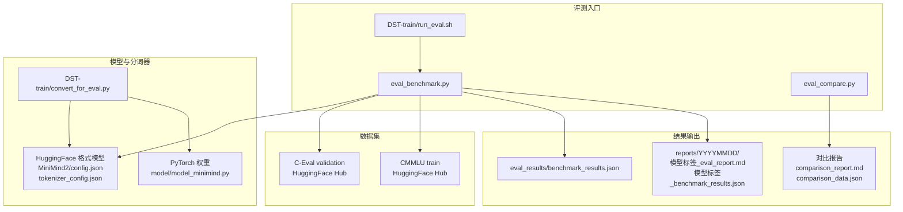
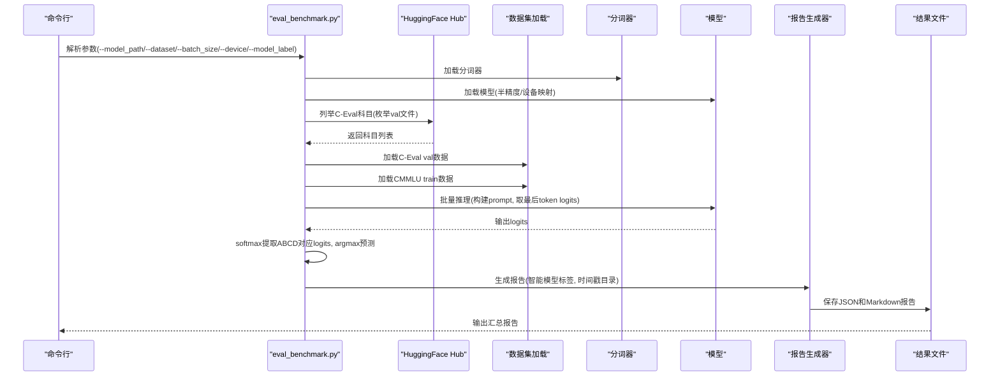
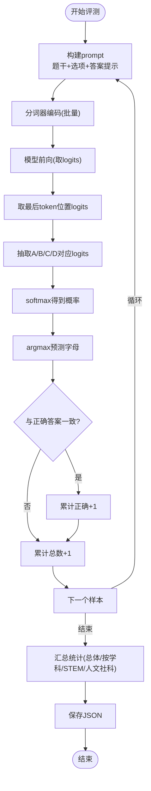
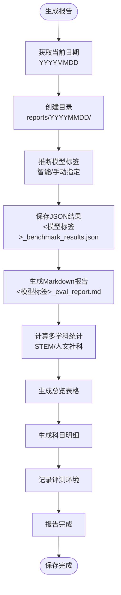
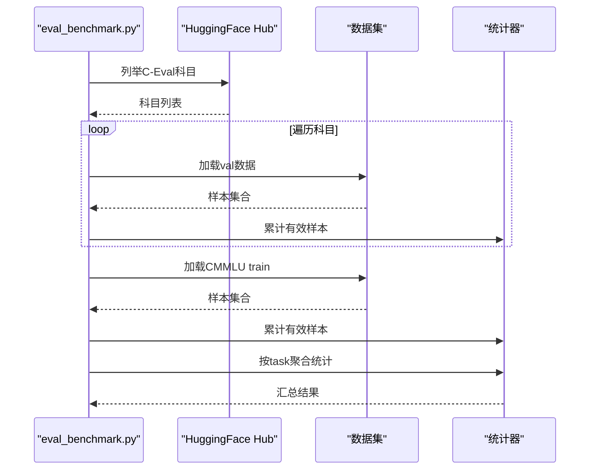
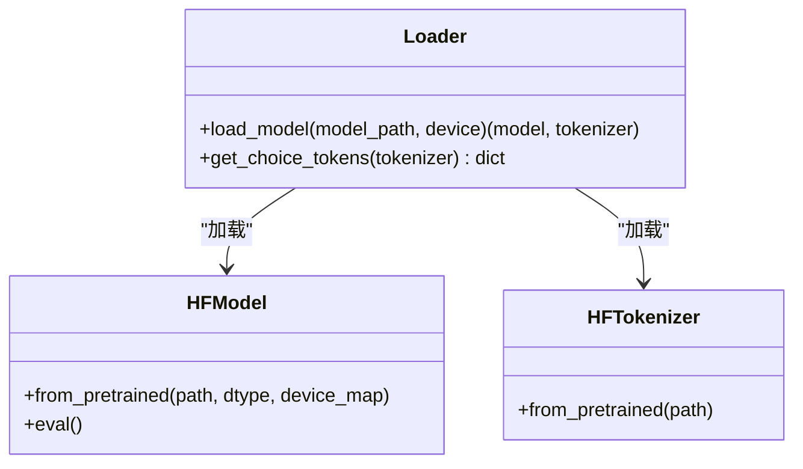
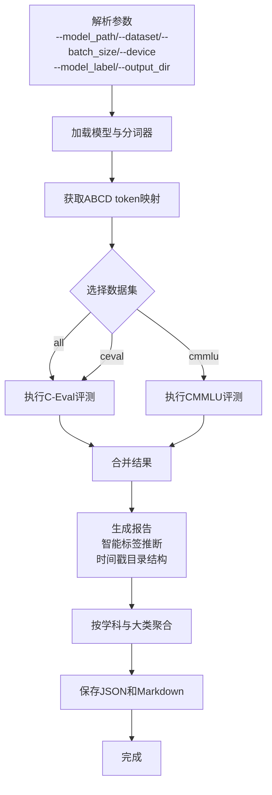
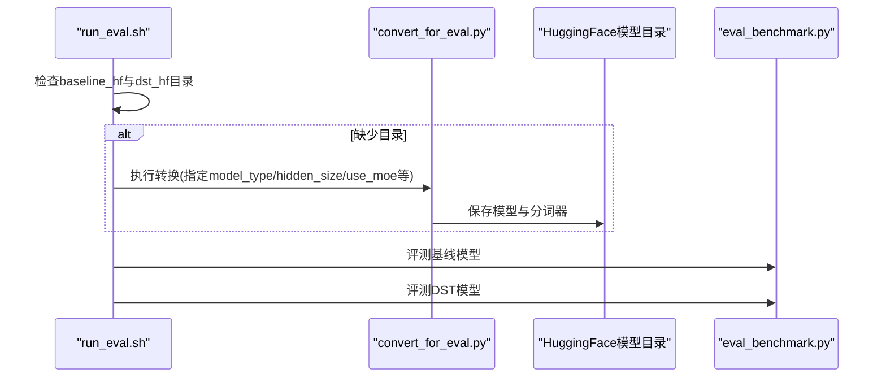
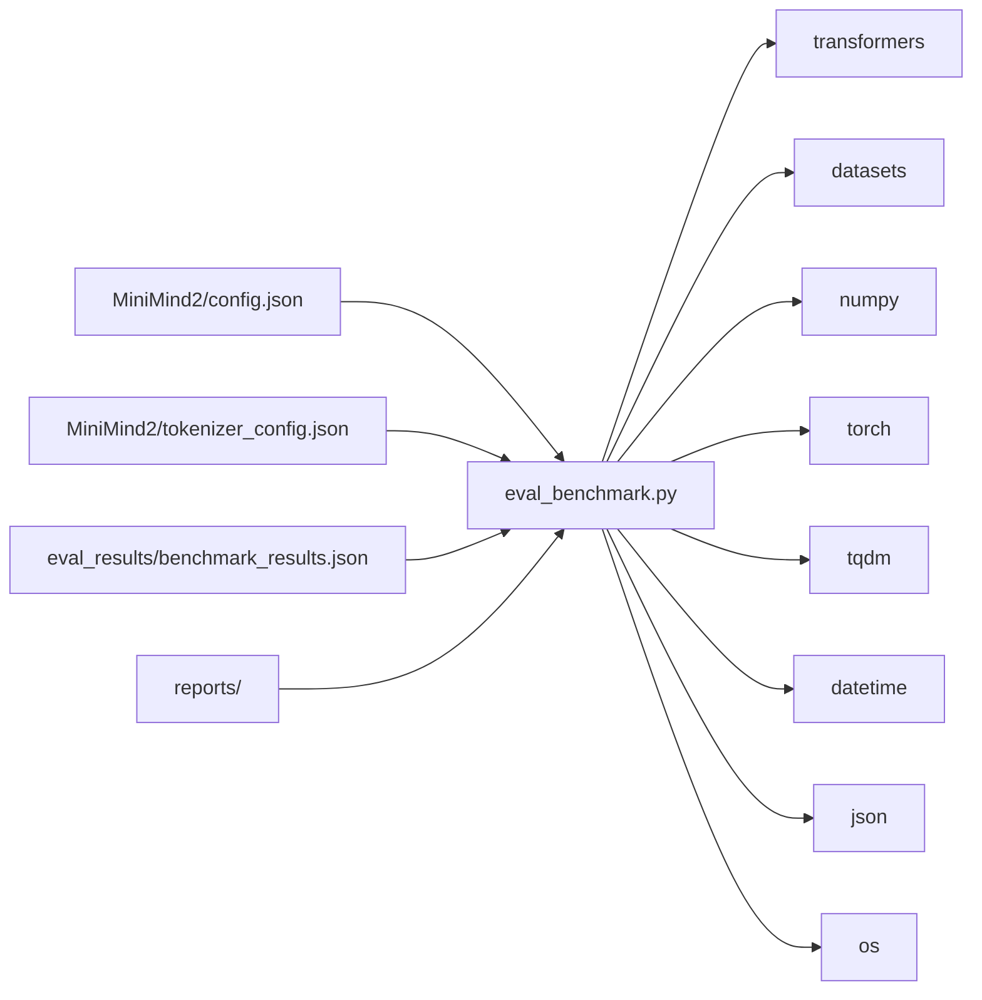

# 基准测试

<cite>
**本文引用的文件**
- [eval_benchmark.py](file://eval_benchmark.py)
- [eval_llm.py](file://eval_llm.py)
- [eval_compare.py](file://eval_compare.py)
- [README.md](file://README.md)
- [requirements.txt](file://requirements.txt)
- [eval_results/benchmark_results.json](file://eval_results/benchmark_results.json)
- [reports/20260430/baseline_benchmark_results.json](file://reports/20260430/baseline_benchmark_results.json)
- [reports/20260430/dst_eval_report.md](file://reports/20260430/dst_eval_report.md)
- [MiniMind2/config.json](file://MiniMind2/config.json)
- [MiniMind2/tokenizer_config.json](file://MiniMind2/tokenizer_config.json)
- [DST-train/run_eval.sh](file://DST-train/run_eval.sh)
- [DST-train/convert_for_eval.py](file://DST-train/convert_for_eval.py)
- [model/model_minimind.py](file://model/model_minimind.py)
</cite>

## 目录
1. [简介](#简介)
2. [项目结构](#项目结构)
3. [核心组件](#核心组件)
4. [架构总览](#架构总览)
5. [详细组件分析](#详细组件分析)
6. [依赖关系分析](#依赖关系分析)
7. [性能考量](#性能考量)
8. [故障排查指南](#故障排查指南)
9. [结论](#结论)
10. [附录](#附录)

## 简介
本文件面向研究人员与工程实践者，系统化阐述MiniMind项目的基准测试流程与实现细节，重点覆盖C-Eval与CMMLU两大中文评测数据集的使用方法，多选题评测的ABCD token概率对比法原理，评测脚本的使用流程（模型加载、分词器配置、批量推理），评测指标计算（总体准确率与按学科分类的准确率统计），以及结果解读与常见问题处理、性能优化建议与结果验证技巧。**新增功能**包括智能模型标签推断、可配置模型标签参数、时间戳报告目录结构、多学科分类统计、Markdown报告生成等高级特性，帮助研究人员更高效地评估模型在中文场景下的语言能力。

## 项目结构
本项目围绕"评测脚本 + 数据集 + 结果输出 + 模型转换 + 报告生成"形成完整的闭环。评测脚本负责加载模型与分词器、构建prompt、执行批量推理、统计指标并输出JSON报告；数据集通过HuggingFace Hub或本地目录提供；结果以JSON和Markdown格式落盘，便于后续分析、可视化和对比。

**图表来源**
- [eval_benchmark.py:362-455](file://eval_benchmark.py#L362-L455)
- [eval_compare.py:697-745](file://eval_compare.py#L697-L745)
- [DST-train/run_eval.sh:1-60](file://DST-train/run_eval.sh#L1-L60)
- [DST-train/convert_for_eval.py:30-83](file://DST-train/convert_for_eval.py#L30-L83)
- [eval_results/benchmark_results.json:1-494](file://eval_results/benchmark_results.json#L1-L494)

**章节来源**
- [eval_benchmark.py:362-455](file://eval_benchmark.py#L362-L455)
- [eval_compare.py:697-745](file://eval_compare.py#L697-L745)
- [DST-train/run_eval.sh:1-60](file://DST-train/run_eval.sh#L1-L60)
- [DST-train/convert_for_eval.py:30-83](file://DST-train/convert_for_eval.py#L30-L83)
- [eval_results/benchmark_results.json:1-494](file://eval_results/benchmark_results.json#L1-L494)

## 核心组件
- **评测主脚本**：负责加载模型与分词器、构建多选题prompt、批量推理、统计指标与输出结果。
- **报告生成器**：新增功能，支持智能模型标签推断、时间戳目录结构、多学科分类统计、Markdown报告生成。
- **数据集加载**：C-Eval通过HuggingFace Hub枚举val子任务并加载；CMMLU直接加载train集合。
- **指标统计**：总体准确率、按学科分类的准确率、按STEM与人文社科大类聚合的准确率。
- **结果落盘**：将评测结果序列化为JSON，包含by_task明细与聚合统计，同时生成可读的Markdown报告。

**章节来源**
- [eval_benchmark.py:362-455](file://eval_benchmark.py#L362-L455)
- [eval_benchmark.py:18-318](file://eval_benchmark.py#L18-L318)

## 架构总览
评测流程从命令行入口开始，解析参数后分别执行C-Eval与CMMLU评测，二者共享同一多选题评测逻辑，最后汇总输出并保存JSON和Markdown报告。

**图表来源**
- [eval_benchmark.py:458-517](file://eval_benchmark.py#L458-L517)
- [eval_benchmark.py:362-455](file://eval_benchmark.py#L362-L455)
- [eval_benchmark.py:128-231](file://eval_benchmark.py#L128-L231)

## 详细组件分析

### 多选题评测实现：ABCD token概率对比法
- **目标**：对每道题，将题干与选项拼接为prompt，取最后一个token位置的logits，分别抽取A/B/C/D对应的logit，softmax后取最高概率作为预测，与正确答案比较。
- **关键点**：
  - 获取ABCD token id：优先使用单token编码；若多token则尝试带空格；否则回退取首个token并告警。
  - 构造prompt：将题干与四选项拼接，末尾附加"答案是："提示。
  - 批量推理：使用padding与truncation，max_length限制；取最后一层logits，按ABCD索引堆叠，softmax后argmax得到预测字母。
  - 统计：累计正确数与总数，按task聚合统计。

**图表来源**
- [eval_benchmark.py:54-125](file://eval_benchmark.py#L54-L125)
- [eval_benchmark.py:33-51](file://eval_benchmark.py#L33-L51)

**章节来源**
- [eval_benchmark.py:33-125](file://eval_benchmark.py#L33-L125)

### 报告生成器：智能模型标签与时间戳目录
**新增功能**：报告生成器支持智能模型标签推断、可配置模型标签参数、时间戳报告目录结构、多学科分类统计、Markdown报告生成。

- **智能模型标签推断**：
  - 从模型路径自动推断标签：`dst_hf` → `dst`，`pretrain_512` → `baseline`，其他情况使用模型名称
  - 支持通过`--model_label`参数手动指定标签，避免同日评测不同模型时的文件覆盖
- **时间戳目录结构**：自动创建`reports/YYYYMMDD/`目录，按日期组织报告文件
- **多学科分类统计**：支持STEM与人文社科两大类别的准确率计算
- **Markdown报告生成**：生成包含总览表、各科目明细、评测环境信息的完整报告

**图表来源**
- [eval_benchmark.py:362-455](file://eval_benchmark.py#L362-L455)
- [eval_benchmark.py:351-359](file://eval_benchmark.py#L351-L359)

**章节来源**
- [eval_benchmark.py:362-455](file://eval_benchmark.py#L362-L455)
- [eval_benchmark.py:351-359](file://eval_benchmark.py#L351-L359)

### 数据集加载与评测流程
- **C-Eval**：
  - 通过HuggingFace Hub列出所有val子任务，遍历加载每个科目的val集合，过滤有效样本（题干与答案非空且答案为A/B/C/D）。
  - 统计有效题目总数，执行evaluate_multiple_choice。
- **CMMLU**：
  - 直接加载CMMLU的train集合，过滤有效样本后执行evaluate_multiple_choice。
- **结果汇总**：
  - 输出总体准确率与各科目准确率。
  - 按STEM与人文社科两类聚合统计。

**图表来源**
- [eval_benchmark.py:128-231](file://eval_benchmark.py#L128-L231)

**章节来源**
- [eval_benchmark.py:128-231](file://eval_benchmark.py#L128-L231)

### 模型与分词器加载
- **模型加载**：使用AutoModelForCausalLM.from_pretrained加载HuggingFace格式模型，半精度与设备映射，打印参数量。
- **分词器加载**：使用AutoTokenizer.from_pretrained加载，支持特殊token配置。
- **ABCD token映射**：get_choice_tokens函数处理单字母编码为多token的情况，必要时尝试带空格编码，否则回退取首个token并告警。

**图表来源**
- [eval_benchmark.py:18-51](file://eval_benchmark.py#L18-L51)

**章节来源**
- [eval_benchmark.py:18-51](file://eval_benchmark.py#L18-L51)

### 评测脚本使用流程
- **命令行参数**：
  - `--model_path`：HuggingFace格式模型路径（默认指向MiniMind2）。
  - `--device`：设备（默认cuda，若不可用则cpu）。
  - `--batch_size`：批大小（默认8）。
  - `--dataset`：评测数据集选择（all/ceval/cmmlu）。
  - `--model_label`：**新增**模型标签（用于报告文件名前缀，默认从模型路径自动推断）。
  - `--output_dir`：**新增**报告输出目录（默认 reports/YYYYMMDD）。
- **执行顺序**：加载模型→获取ABCD token→按数据集选择执行评测→汇总并保存JSON→生成Markdown报告。

**图表来源**
- [eval_benchmark.py:458-517](file://eval_benchmark.py#L458-L517)
- [eval_benchmark.py:465-466](file://eval_benchmark.py#L465-L466)

**章节来源**
- [eval_benchmark.py:458-517](file://eval_benchmark.py#L458-L517)

### 指标计算与结果解读
- **总体准确率**：正确数/总数。
- **学科准确率**：按task聚合correct/total。
- **大类准确率**：STEM与人文社科两类聚合统计，便于横向对比。
- **子领域统计**：支持按数学、物理、化学/生物/医学、计算机、工程/应用、人文社科等子领域进行细分统计。
- **结果解读要点**：
  - STEM领域（数学、物理、化学、生物、计算机、医学等）通常对逻辑推理与知识体系要求较高，若表现偏低，可结合具体科目分析。
  - 人文社科领域（历史、政治、哲学、法律、教育学等）对语言理解与文化背景要求较高，若表现偏低，可关注prompt设计与上下文长度。
  - 若某科目样本量较少，准确率波动较大，需谨慎解读。

**章节来源**
- [eval_benchmark.py:273-313](file://eval_benchmark.py#L273-L313)
- [eval_benchmark.py:338-348](file://eval_benchmark.py#L338-L348)
- [eval_results/benchmark_results.json:1-494](file://eval_results/benchmark_results.json#L1-L494)

### 模型转换与评测自动化
- **DST训练模型评测**：run_eval.sh脚本自动检查基线与DST模型的HuggingFace格式是否存在，若不存在则提示先执行convert_for_eval.py转换。
- **转换流程**：convert_for_eval.py将PyTorch权重转换为HuggingFace格式，注册AutoClass以便自动加载，复制分词器，保存模型与配置。

**图表来源**
- [DST-train/run_eval.sh:26-54](file://DST-train/run_eval.sh#L26-L54)
- [DST-train/convert_for_eval.py:30-83](file://DST-train/convert_for_eval.py#L30-L83)

**章节来源**
- [DST-train/run_eval.sh:26-54](file://DST-train/run_eval.sh#L26-L54)
- [DST-train/convert_for_eval.py:30-83](file://DST-train/convert_for_eval.py#L30-L83)

## 依赖关系分析
- **评测脚本依赖**：
  - transformers：模型与分词器加载。
  - datasets：HuggingFace数据集加载。
  - torch/numpy：张量运算与统计。
  - tqdm：进度条。
  - datetime：时间戳处理。
- **报告生成依赖**：
  - json：JSON序列化。
  - os：文件系统操作。
  - collections：字典默认值处理。
- **模型配置与分词器配置**：
  - MiniMind2/config.json与tokenizer_config.json定义了模型架构、最大位置、词表大小、RoPE参数等，影响推理长度与精度。
- **评测结果**：
  - eval_results/benchmark_results.json包含C-Eval与CMMLU的总体与按学科统计，便于对比分析。
  - reports/目录包含按日期组织的报告文件，支持多模型对比分析。

**图表来源**
- [eval_benchmark.py:14-16](file://eval_benchmark.py#L14-L16)
- [requirements.txt:1-31](file://requirements.txt#L1-L31)
- [MiniMind2/config.json:1-33](file://MiniMind2/config.json#L1-L33)
- [MiniMind2/tokenizer_config.json:1-18](file://MiniMind2/tokenizer_config.json#L1-L18)
- [eval_results/benchmark_results.json:1-494](file://eval_results/benchmark_results.json#L1-L494)

**章节来源**
- [eval_benchmark.py:14-16](file://eval_benchmark.py#L14-L16)
- [requirements.txt:1-31](file://requirements.txt#L1-L31)
- [MiniMind2/config.json:1-33](file://MiniMind2/config.json#L1-L33)
- [MiniMind2/tokenizer_config.json:1-18](file://MiniMind2/tokenizer_config.json#L1-L18)
- [eval_results/benchmark_results.json:1-494](file://eval_results/benchmark_results.json#L1-L494)

## 性能考量
- **批大小与显存**：增大batch_size可提升吞吐，但需注意显存上限；可通过--batch_size调节。
- **设备选择**：优先使用GPU（cuda），若显存不足可切换CPU。
- **半精度推理**：模型加载时使用float16可降低显存占用，提升速度。
- **最大长度与截断**：max_length=2048限制输入长度，避免过长样本导致显存溢出。
- **分词器鲁棒性**：get_choice_tokens对多token字母进行容错处理，减少因编码策略导致的token映射错误。
- **报告生成性能**：智能模型标签推断和多学科统计计算开销较小，不会显著影响评测性能。

**章节来源**
- [eval_benchmark.py:18-30](file://eval_benchmark.py#L18-L30)
- [eval_benchmark.py:91-97](file://eval_benchmark.py#L91-L97)
- [eval_benchmark.py:33-51](file://eval_benchmark.py#L33-L51)

## 故障排查指南
- **无法连接HuggingFace Hub**：
  - 设置镜像源环境变量（脚本中已设置），确保网络可达。
- **缺少ABCD token映射**：
  - 检查分词器是否将A/B/C/D编码为单token；若多token，确认带空格编码是否可用；否则回退首个token并留意告警。
- **数据集加载异常**：
  - C-Eval：确认科目名称与val文件匹配；若某科目加载失败，脚本会跳过该科目并继续。
  - CMMLU：确认数据集中answer字段为A/B/C/D之一。
- **结果为空或异常**：
  - 检查模型路径与分词器路径是否正确；确认模型为HuggingFace格式。
  - 检查batch_size与max_length设置是否合理。
- **报告生成失败**：
  - 确认输出目录存在或可创建；检查权限。
  - 检查--model_label参数是否包含非法字符。
  - 确认时间戳目录创建权限。
- **JSON保存失败**：
  - 确认输出目录存在或可创建；检查权限。
- **Markdown报告格式异常**：
  - 检查matplotlib安装状态；确保中文字体配置正确。

**章节来源**
- [eval_benchmark.py:6-8](file://eval_benchmark.py#L6-L8)
- [eval_benchmark.py:137-161](file://eval_benchmark.py#L137-L161)
- [eval_benchmark.py:195-210](file://eval_benchmark.py#L195-L210)
- [eval_benchmark.py:303-313](file://eval_benchmark.py#L303-L313)

## 结论
本基准测试方案以ABCD token概率对比法为核心，统一了C-Eval与CMMLU的评测流程，实现了从模型加载、prompt构建、批量推理到指标统计与结果落盘的完整闭环。**新增的报告生成功能**提供了智能模型标签推断、时间戳目录结构、多学科分类统计、Markdown报告生成等高级特性，支持研究人员更高效地开展模型对比评测工作。通过按学科与大类聚合统计，研究人员可快速定位模型在中文场景下的优势与短板，并结合性能优化建议与故障排查指南，稳定高效地开展评测工作。

## 附录

### 使用示例与最佳实践
- **基础评测**：
  - 使用默认模型路径与设备，评测全部数据集：python eval_benchmark.py
  - 指定模型路径与批大小：python eval_benchmark.py --model_path ./MiniMind2 --batch_size 16
  - **新增**指定模型标签：python eval_benchmark.py --model_label dst
- **DST模型对比评测**：
  - 先转换PyTorch权重为HuggingFace格式，再一键评测：bash DST-train/run_eval.sh
  - **新增**对比报告生成：python eval_compare.py --report_dir reports/20260430
- **结果解读**：
  - 查看reports/目录下的Markdown报告，对比C-Eval与CMMLU总体与按学科准确率，关注STEM与人文社科两类聚合结果。
  - **新增**查看智能推断的模型标签命名规范，如`dst_eval_report.md`、`baseline_benchmark_results.json`等。
- **报告定制**：
  - **新增**自定义输出目录：python eval_benchmark.py --output_dir ./custom_reports
  - **新增**手动指定模型标签：python eval_benchmark.py --model_label custom_model

**章节来源**
- [eval_benchmark.py:458-517](file://eval_benchmark.py#L458-L517)
- [eval_benchmark.py:465-466](file://eval_benchmark.py#L465-L466)
- [DST-train/run_eval.sh:1-60](file://DST-train/run_eval.sh#L1-L60)
- [eval_results/benchmark_results.json:1-494](file://eval_results/benchmark_results.json#L1-L494)
- [eval_compare.py:707-722](file://eval_compare.py#L707-L722)