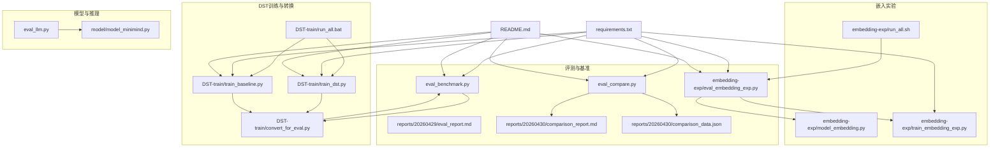
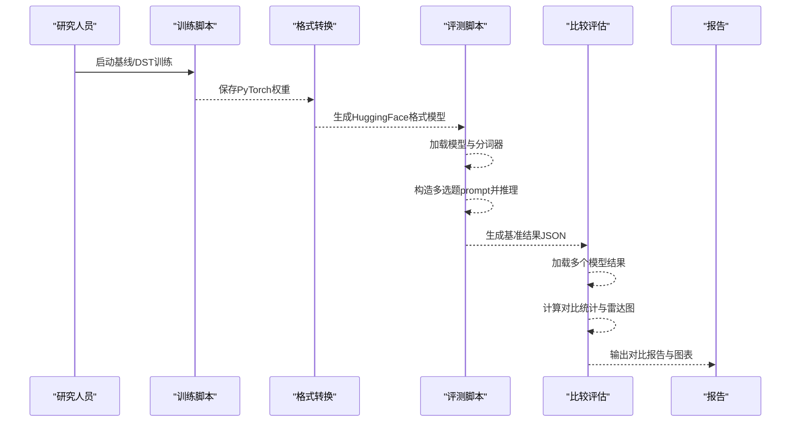
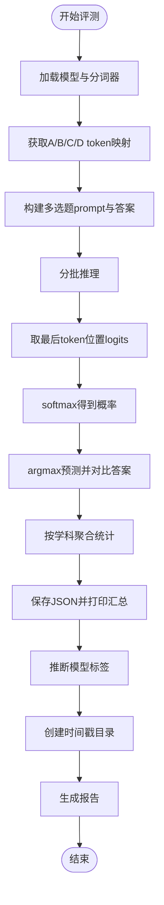
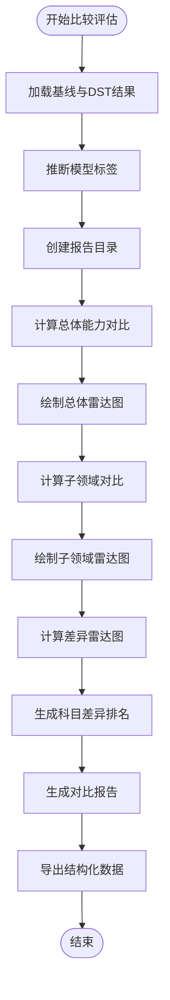
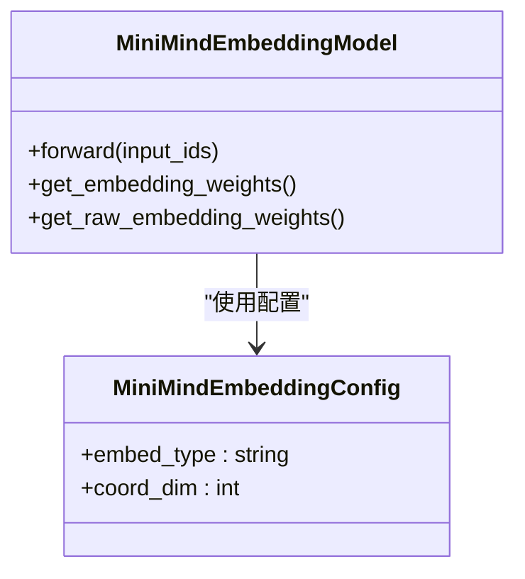
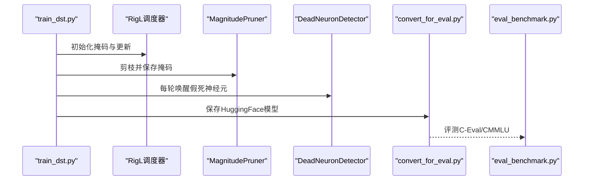
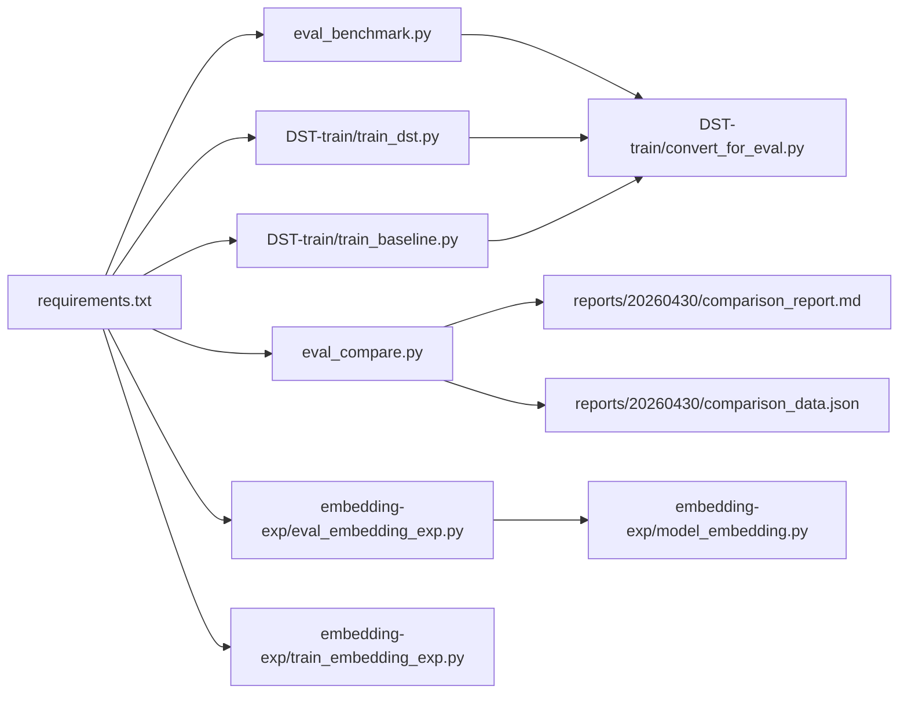

# 实验与评估

<cite>
**本文引用的文件**   
- [eval_benchmark.py](file://eval_benchmark.py)
- [eval_compare.py](file://eval_compare.py)
- [eval_llm.py](file://eval_llm.py)
- [embedding-exp/eval_embedding_exp.py](file://embedding-exp/eval_embedding_exp.py)
- [embedding-exp/model_embedding.py](file://embedding-exp/model_embedding.py)
- [embedding-exp/train_embedding_exp.py](file://embedding-exp/train_embedding_exp.py)
- [embedding-exp/run_all.sh](file://embedding-exp/run_all.sh)
- [DST-train/convert_for_eval.py](file://DST-train/convert_for_eval.py)
- [DST-train/train_dst.py](file://DST-train/train_dst.py)
- [DST-train/train_baseline.py](file://DST-train/train_baseline.py)
- [DST-train/dst_hooks.py](file://DST-train/dst_hooks.py)
- [DST-train/dst_pruning.py](file://DST-train/dst_pruning.py)
- [DST-train/run_all.bat](file://DST-train/run_all.bat)
- [model/model_minimind.py](file://model/model_minimind.py)
- [requirements.txt](file://requirements.txt)
- [README.md](file://README.md)
- [reports/20260429/eval_report.md](file://reports/20260429/eval_report.md)
- [reports/20260430/comparison_report.md](file://reports/20260430/comparison_report.md)
- [reports/20260430/comparison_data.json](file://reports/20260430/comparison_data.json)
</cite>

## 目录
1. [简介](#简介)
2. [项目结构](#项目结构)
3. [核心组件](#核心组件)
4. [架构总览](#架构总览)
5. [详细组件分析](#详细组件分析)
6. [依赖关系分析](#依赖关系分析)
7. [性能考量](#性能考量)
8. [故障排查指南](#故障排查指南)
9. [结论](#结论)
10. [附录](#附录)

## 简介
本文件系统化梳理 MiniMind 项目的实验与评估体系，覆盖基准评测（C-Eval、CMMLU）、嵌入向量实验（相似度与可视化）、模型评估指标与统计分析、实验数据组织与脚本使用、结果报告生成，以及高级评估技术（性能对比、消融实验、A/B 测试思路）。目标是帮助研究人员科学地评估与改进模型性能。

**更新** 本次更新引入了全新的比较评估系统，包括 `eval_compare.py` 脚本用于模型间比较分析，以及增强的报告生成功能，支持多模型标签推断、时间戳报告目录、STEM vs 人文学科分类统计等高级功能。

## 项目结构
项目围绕"模型—数据—评估—报告"闭环组织，关键目录与文件职责如下：
- 评测与基准：eval_benchmark.py、eval_compare.py、embedding-exp/eval_embedding_exp.py、reports/20260429/eval_report.md、reports/20260430/comparison_report.md
- 嵌入实验：embedding-exp/model_embedding.py、embedding-exp/train_embedding_exp.py、embedding-exp/run_all.sh
- DST 训练与转换：DST-train/train_dst.py、DST-train/train_baseline.py、DST-train/convert_for_eval.py、DST-train/run_all.bat
- 模型与推理：model/model_minimind.py、eval_llm.py
- 依赖与环境：requirements.txt、README.md

**图表来源**
- [eval_benchmark.py:1-518](file://eval_benchmark.py#L1-L518)
- [eval_compare.py:1-773](file://eval_compare.py#L1-L773)
- [embedding-exp/eval_embedding_exp.py:1-708](file://embedding-exp/eval_embedding_exp.py#L1-L708)
- [embedding-exp/model_embedding.py:1-300](file://embedding-exp/model_embedding.py#L1-L300)
- [embedding-exp/train_embedding_exp.py:1-226](file://embedding-exp/train_embedding_exp.py#L1-L226)
- [embedding-exp/run_all.sh:1-141](file://embedding-exp/run_all.sh#L1-L141)
- [DST-train/train_dst.py:1-472](file://DST-train/train_dst.py#L1-L472)
- [DST-train/train_baseline.py:1-169](file://DST-train/train_baseline.py#L1-L169)
- [DST-train/convert_for_eval.py:1-154](file://DST-train/convert_for_eval.py#L1-L154)
- [DST-train/run_all.bat:1-130](file://DST-train/run_all.bat#L1-L130)
- [model/model_minimind.py:1-474](file://model/model_minimind.py#L1-L474)
- [requirements.txt:1-31](file://requirements.txt#L1-L31)
- [README.md:1-1932](file://README.md#L1-L1932)

**章节来源**
- [README.md:1-1932](file://README.md#L1-L1932)
- [requirements.txt:1-31](file://requirements.txt#L1-L31)

## 核心组件
- 基准评测脚本：eval_benchmark.py，支持 C-Eval 与 CMMLU 的 ABCD token 概率对比法评测，输出总体与按学科的准确率，并保存 JSON 结果。
- **新增** 比较评估脚本：eval_compare.py，专门用于模型间比较分析，支持多模型标签推断、时间戳报告目录、STEM vs 人文学科分类统计、子领域对比、雷达图绘制等功能。
- 嵌入实验脚本：embedding-exp/eval_embedding_exp.py，支持基准评测、语义分析（最近邻、t-SNE 可视化）、四组嵌入方案对比汇总。
- DST 训练流水线：DST-train/train_dst.py（三阶段：RigL 学习→剪枝巩固→蒸馏恢复），DST-train/train_baseline.py（基线预训练），DST-train/convert_for_eval.py（权重转 HuggingFace 格式）。
- 嵌入模型定义：embedding-exp/model_embedding.py，实现 A/B/C1/C2 四种嵌入方案。
- 推理与对话：eval_llm.py，支持加载原生权重或 Transformers 格式模型进行对话与生成。
- 报告与示例：reports/20260429/eval_report.md 和 reports/20260430/comparison_report.md，展示预训练模型在 C-Eval/CMMLU 的评测结果与分析。

**章节来源**
- [eval_benchmark.py:1-518](file://eval_benchmark.py#L1-L518)
- [eval_compare.py:1-773](file://eval_compare.py#L1-L773)
- [embedding-exp/eval_embedding_exp.py:1-708](file://embedding-exp/eval_embedding_exp.py#L1-L708)
- [DST-train/train_dst.py:1-472](file://DST-train/train_dst.py#L1-L472)
- [DST-train/train_baseline.py:1-169](file://DST-train/train_baseline.py#L1-L169)
- [DST-train/convert_for_eval.py:1-154](file://DST-train/convert_for_eval.py#L1-L154)
- [embedding-exp/model_embedding.py:1-300](file://embedding-exp/model_embedding.py#L1-L300)
- [eval_llm.py:1-89](file://eval_llm.py#L1-L89)
- [reports/20260429/eval_report.md:1-128](file://reports/20260429/eval_report.md#L1-L128)
- [reports/20260430/comparison_report.md:1-111](file://reports/20260430/comparison_report.md#L1-L111)

## 架构总览
下图展示从"训练/转换"到"评测/报告"的端到端评估流程，涵盖模型格式转换、评测脚本、嵌入实验与 DST 训练，以及新增的比较评估系统。

**图表来源**
- [DST-train/train_dst.py:293-472](file://DST-train/train_dst.py#L293-L472)
- [DST-train/train_baseline.py:88-169](file://DST-train/train_baseline.py#L88-L169)
- [DST-train/convert_for_eval.py:85-154](file://DST-train/convert_for_eval.py#L85-L154)
- [eval_benchmark.py:458-518](file://eval_benchmark.py#L458-L518)
- [eval_compare.py:410-703](file://eval_compare.py#L410-L703)
- [reports/20260429/eval_report.md:1-128](file://reports/20260429/eval_report.md#L1-L128)
- [reports/20260430/comparison_report.md:1-111](file://reports/20260430/comparison_report.md#L1-L111)

## 详细组件分析

### 基准评测（C-Eval/CMMLU）
- 评测方法：ABCD token 概率对比法，对每题构造"问题+选项+答案是："的 prompt，取最后一个 token 位置的 A/B/C/D 对应 logits，softmax 得概率并取 argmax 作为预测。
- 数据加载：C-Eval 使用 HuggingFace Hub 的 zacharyxxxxcr/ceval-exam 数据集，遍历 val-* 文件；CMMLU 使用 svjack/cmmlu 的 train split。
- 指标输出：总准确率、按学科（task）的准确率、按学科大类（STEM/人文社科）汇总，最终保存为 JSON 并打印汇总。
- 批处理与设备：支持批量推理与 GPU/CPU 设备切换，自动释放显存。
- **增强功能**：新增多模型标签推断（infer_model_label），自动从模型路径推断标签（如 'dst'、'baseline'），避免同日评测不同模型时文件覆盖；报告生成包含时间戳目录（YYYYMMDD）。

**图表来源**
- [eval_benchmark.py:18-125](file://eval_benchmark.py#L18-L125)
- [eval_benchmark.py:128-518](file://eval_benchmark.py#L128-L518)
- [eval_benchmark.py:351-379](file://eval_benchmark.py#L351-L379)

**章节来源**
- [eval_benchmark.py:1-518](file://eval_benchmark.py#L1-L518)

### 比较评估系统（eval_compare.py）
**新增功能** 专门用于模型间比较分析的完整系统，支持以下核心功能：

- **多模型标签推断**：自动从结果文件名推断模型标签（如 'baseline'、'dst'），支持自定义标签参数。
- **时间戳报告目录**：自动生成包含日期的时间戳目录，避免报告覆盖。
- **学科分类统计**：支持 STEM 与人文学科的大类分类，以及 C-Eval/CMMLU 的子领域细分。
- **雷达图可视化**：生成总体能力对比雷达图、子领域对比雷达图、差异雷达图（Delta Radar）。
- **科目差异排名**：计算两个模型在各科目上的准确率差异，提供提升和下降的科目排名。
- **结构化数据导出**：生成 JSON 格式的对比数据，包含维度、数值、差异等完整信息。

**图表来源**
- [eval_compare.py:410-703](file://eval_compare.py#L410-L703)
- [eval_compare.py:306-406](file://eval_compare.py#L306-L406)

**章节来源**
- [eval_compare.py:1-773](file://eval_compare.py#L1-L773)

### 嵌入向量实验（相似度与可视化）
- 嵌入方案：
  - A：标准高维嵌入（词表维度→隐藏维度）
  - B：二维固定坐标 + 线性映射
  - C1：三维固定正弦编码 + 线性映射
  - C2：可学习三维嵌入 + 线性映射
- 语义分析：
  - 最邻近字分析：对高频 token 计算余弦相似度，输出近邻 token 及相似度。
  - t-SNE 可视化：对映射后嵌入或原始低维嵌入进行降维并标注中文 token。
  - 参数效率比：以困惑度（用准确率近似）与嵌入相关参数量的比值衡量效率。
- 对比汇总：收集 A/B/C1/C2 的评测与语义分析结果，生成对比报告与损失曲线对比图。

**图表来源**
- [embedding-exp/model_embedding.py:30-200](file://embedding-exp/model_embedding.py#L30-L200)

**章节来源**
- [embedding-exp/eval_embedding_exp.py:1-708](file://embedding-exp/eval_embedding_exp.py#L1-L708)
- [embedding-exp/model_embedding.py:1-300](file://embedding-exp/model_embedding.py#L1-L300)

### DST 训练与评估流水线
- 三阶段训练：
  - 阶段一：RigL 动态稀疏训练（周期性剪枝-生长），结合 MBE 监控与死神经元检测。
  - 阶段二：magnitude 剪枝，保存剪枝掩码与教师模型。
  - 阶段三：低学习率微调 + 可选知识蒸馏 + 假死神经元唤醒。
- 模型转换：将 PyTorch 权重转换为 HuggingFace 格式，便于评测脚本加载。
- 自动化脚本：run_all.bat（Windows）与 run_all.sh（Linux/Mac）串联训练、转换、评测与对比。

**图表来源**
- [DST-train/train_dst.py:74-264](file://DST-train/train_dst.py#L74-L264)
- [DST-train/dst_pruning.py:9-118](file://DST-train/dst_pruning.py#L9-L118)
- [DST-train/dst_hooks.py:10-160](file://DST-train/dst_hooks.py#L10-L160)
- [DST-train/convert_for_eval.py:30-83](file://DST-train/convert_for_eval.py#L30-L83)
- [eval_benchmark.py:458-518](file://eval_benchmark.py#L458-L518)

**章节来源**
- [DST-train/train_dst.py:1-472](file://DST-train/train_dst.py#L1-L472)
- [DST-train/dst_pruning.py:1-291](file://DST-train/dst_pruning.py#L1-L291)
- [DST-train/dst_hooks.py:1-263](file://DST-train/dst_hooks.py#L1-L263)
- [DST-train/convert_for_eval.py:1-154](file://DST-train/convert_for_eval.py#L1-L154)
- [DST-train/run_all.bat:1-130](file://DST-train/run_all.bat#L1-L130)
- [embedding-exp/run_all.sh:1-141](file://embedding-exp/run_all.sh#L1-L141)

### 推理与对话（eval_llm.py）
- 支持加载原生 torch 权重或 Transformers 格式模型，结合 chat template 生成对话。
- 参数控制：隐藏维度、层数、MoE 开关、推理 RoPE 外推、采样策略（温度、top_p）、历史对话轮数等。
- 交互模式：自动测试或手动输入，流式输出生成结果。

**章节来源**
- [eval_llm.py:1-89](file://eval_llm.py#L1-L89)
- [model/model_minimind.py:1-200](file://model/model_minimind.py#L1-L200)

## 依赖关系分析
- 评测脚本依赖 transformers、datasets、torch 等；嵌入实验脚本依赖 scikit-learn、matplotlib；DST 训练依赖 torch 与分布式工具。
- 评测与转换：eval_benchmark.py 依赖 convert_for_eval.py 生成的 HuggingFace 模型；eval_compare.py 依赖 eval_benchmark.py 生成的基准结果 JSON；嵌入实验脚本依赖 model_embedding.py 与训练脚本输出的权重。
- 报告：reports/20260429/eval_report.md 和 reports/20260430/comparison_report.md 展示评测结果与分析，可作为模板生成后续报告。

**图表来源**
- [requirements.txt:1-31](file://requirements.txt#L1-L31)
- [eval_benchmark.py:1-518](file://eval_benchmark.py#L1-L518)
- [eval_compare.py:1-773](file://eval_compare.py#L1-L773)
- [embedding-exp/eval_embedding_exp.py:1-708](file://embedding-exp/eval_embedding_exp.py#L1-L708)
- [DST-train/train_dst.py:1-472](file://DST-train/train_dst.py#L1-L472)
- [DST-train/train_baseline.py:1-169](file://DST-train/train_baseline.py#L1-L169)
- [embedding-exp/train_embedding_exp.py:1-226](file://embedding-exp/train_embedding_exp.py#L1-L226)
- [DST-train/convert_for_eval.py:1-154](file://DST-train/convert_for_eval.py#L1-L154)
- [embedding-exp/model_embedding.py:1-300](file://embedding-exp/model_embedding.py#L1-L300)

**章节来源**
- [requirements.txt:1-31](file://requirements.txt#L1-L31)

## 性能考量
- 推理吞吐与显存：评测脚本支持批量推理与 GPU/CPU 设备切换；嵌入实验在语义分析阶段进行 t-SNE 降维，注意数据规模与维度。
- 模型大小与效率：嵌入方案 B/C1/C2 通过低维坐标映射显著减少嵌入参数量；参数效率比可用于权衡准确率与参数开销。
- 训练稳定性：DST 训练引入 RigL 动态稀疏、magnitude 剪枝与蒸馏恢复，结合 MBE 监控与假死神经元唤醒，提升训练鲁棒性。
- 可视化与可解释性：t-SNE 与最近邻分析有助于理解嵌入语义拓扑与局部结构。
- **新增** 比较评估性能：eval_compare.py 支持多模型并行比较，雷达图绘制使用 matplotlib，注意中文字体配置与渲染性能。

## 故障排查指南
- 数据集加载失败：C-Eval/CMMLU 数据加载依赖 HuggingFace Hub，若网络受限可配置镜像源或离线缓存。
- 设备与精度：确保 CUDA 可用与混合精度设置正确；必要时降低 batch size 或使用 CPU。
- 模型格式：确保权重转换为 HuggingFace 格式后再进行评测；检查 config.json 与 tokenizer 配置一致性。
- 分词器映射：ABCD token 映射可能受分词器影响，若出现多 token 编码需回退到带空格的编码策略。
- DST 训练异常：RigL 初始化掩码与更新频率需合理设置；MBE 饱和阈值与耐心参数影响早停判断。
- **新增** 比较评估问题：确保基准结果 JSON 文件存在且格式正确；检查模型标签推断是否符合预期；雷达图中文字体缺失时会提示安装 SimHei 字体。

**章节来源**
- [eval_benchmark.py:1-518](file://eval_benchmark.py#L1-L518)
- [eval_compare.py:1-773](file://eval_compare.py#L1-L773)
- [embedding-exp/eval_embedding_exp.py:1-708](file://embedding-exp/eval_embedding_exp.py#L1-L708)
- [DST-train/train_dst.py:1-472](file://DST-train/train_dst.py#L1-L472)
- [DST-train/dst_hooks.py:1-263](file://DST-train/dst_hooks.py#L1-L263)
- [DST-train/dst_pruning.py:1-291](file://DST-train/dst_pruning.py#L1-L291)

## 结论
MiniMind 的实验与评估体系以"可复现、可对比、可解释"为目标，覆盖从嵌入设计到模型训练、评测与报告的完整流程。**更新** 新增的比较评估系统进一步完善了模型间性能对比能力，通过 eval_compare.py 实现自动化、可视化的模型比较分析，结合增强的 eval_benchmark.py 报告生成功能，研究人员可以系统地评估与改进模型性能，并形成可复用的实验范式。

## 附录

### 评测指标与统计分析
- 指标：准确率（总体与按学科）、按学科大类（STEM/人文社科）汇总。
- 统计：按任务聚合正确/总数，计算准确率；可扩展为置信区间与显著性检验。
- 结果解读：对比基线（随机 25%）与更大模型（如 RL 训练）的表现，识别强/弱点学科。
- **新增** 比较分析：通过差异雷达图直观展示模型间的相对优劣势，提供科目级差异排名。

**章节来源**
- [eval_benchmark.py:274-313](file://eval_benchmark.py#L274-L313)
- [eval_compare.py:248-301](file://eval_compare.py#L248-L301)
- [reports/20260429/eval_report.md:1-128](file://reports/20260429/eval_report.md#L1-L128)
- [reports/20260430/comparison_report.md:1-111](file://reports/20260430/comparison_report.md#L1-L111)

### 实验数据组织与脚本使用
- 嵌入实验一键脚本：run_all.sh（Linux/Mac）与 run_all.bat（Windows）串联训练、转换、评测与对比。
- 嵌入训练：embedding-exp/train_embedding_exp.py，支持 B/C1/C2 三种嵌入方案训练与保存。
- 嵌入评测：embedding-exp/eval_embedding_exp.py，支持基准评测、语义分析与对比汇总。
- DST 训练：DST-train/train_dst.py 与 train_baseline.py，配套 convert_for_eval.py 转换格式。
- **新增** 比较评估：eval_compare.py 支持多模型对比，自动生成雷达图和对比报告。

**章节来源**
- [embedding-exp/run_all.sh:1-141](file://embedding-exp/run_all.sh#L1-L141)
- [DST-train/run_all.bat:1-130](file://DST-train/run_all.bat#L1-L130)
- [embedding-exp/train_embedding_exp.py:1-226](file://embedding-exp/train_embedding_exp.py#L1-L226)
- [embedding-exp/eval_embedding_exp.py:627-708](file://embedding-exp/eval_embedding_exp.py#L627-L708)
- [DST-train/train_dst.py:293-472](file://DST-train/train_dst.py#L293-L472)
- [DST-train/train_baseline.py:88-169](file://DST-train/train_baseline.py#L88-L169)
- [DST-train/convert_for_eval.py:85-154](file://DST-train/convert_for_eval.py#L85-L154)
- [eval_compare.py:707-773](file://eval_compare.py#L707-L773)

### 结果报告生成流程
- 自动生成：嵌入实验 compare 子命令生成对比报告与损失曲线图；基准评测脚本保存 JSON；**新增** 比较评估脚本生成多维度对比报告、雷达图和结构化数据。
- 手工撰写：可参考 reports/20260429/eval_report.md 和 reports/20260430/comparison_report.md 的结构与分析要点，扩展到更多模型与场景。
- **新增** 时间戳管理：基准评测自动创建 YYYYMMDD 格式的报告目录，避免文件覆盖。

**章节来源**
- [embedding-exp/eval_embedding_exp.py:544-624](file://embedding-exp/eval_embedding_exp.py#L544-L624)
- [eval_benchmark.py:302-313](file://eval_benchmark.py#L302-L313)
- [eval_benchmark.py:362-455](file://eval_benchmark.py#L362-L455)
- [eval_compare.py:410-703](file://eval_compare.py#L410-L703)
- [reports/20260429/eval_report.md:1-128](file://reports/20260429/eval_report.md#L1-L128)
- [reports/20260430/comparison_report.md:1-111](file://reports/20260430/comparison_report.md#L1-L111)

### 高级评估技术
- 性能对比：固定评测设置（prompt、采样参数、批大小）对比不同模型/方案。
- 消融实验：固定嵌入方案，对比不同训练阶段（预训练、SFT、DST）的效果。
- A/B 测试：在真实流量中对比两个模型的响应质量与用户反馈（建议在外部系统落地时实施）。
- **新增** 模型间比较：使用 eval_compare.py 进行系统性的多模型对比，支持雷达图可视化和统计分析。