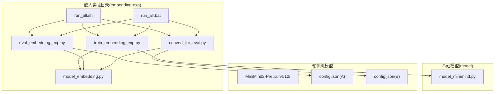
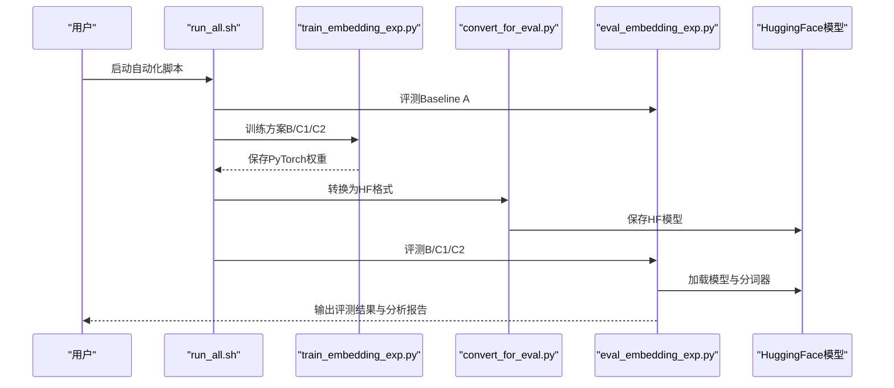
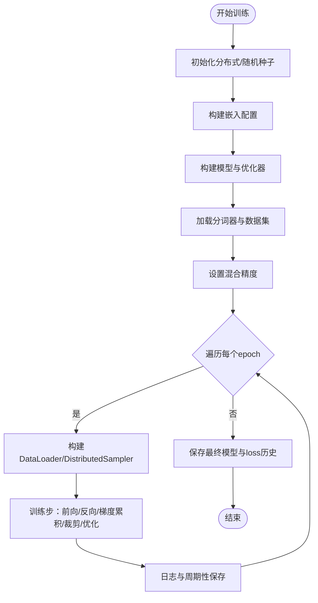
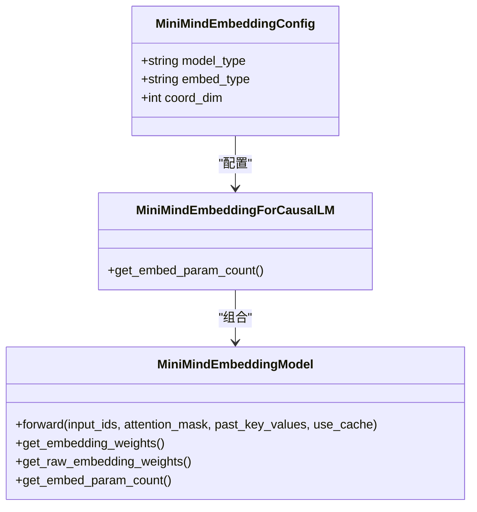
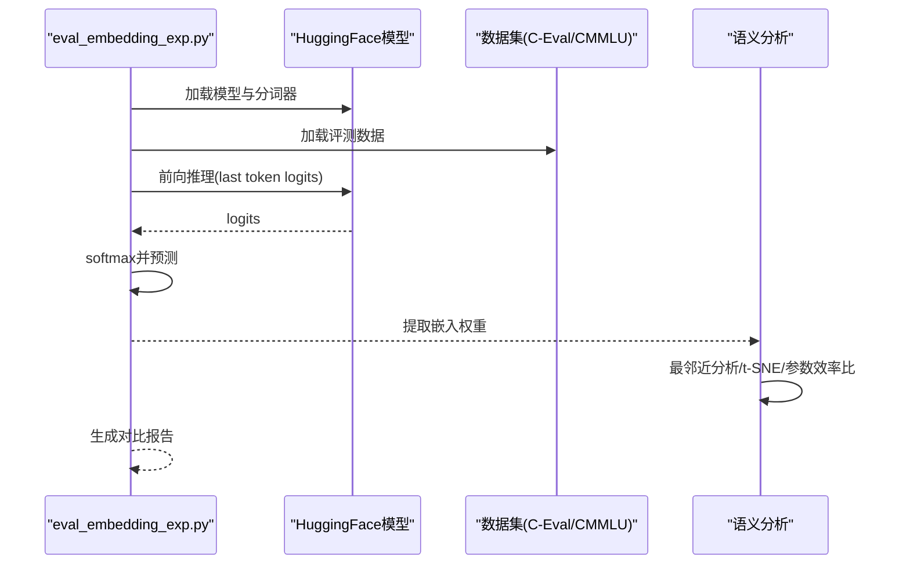
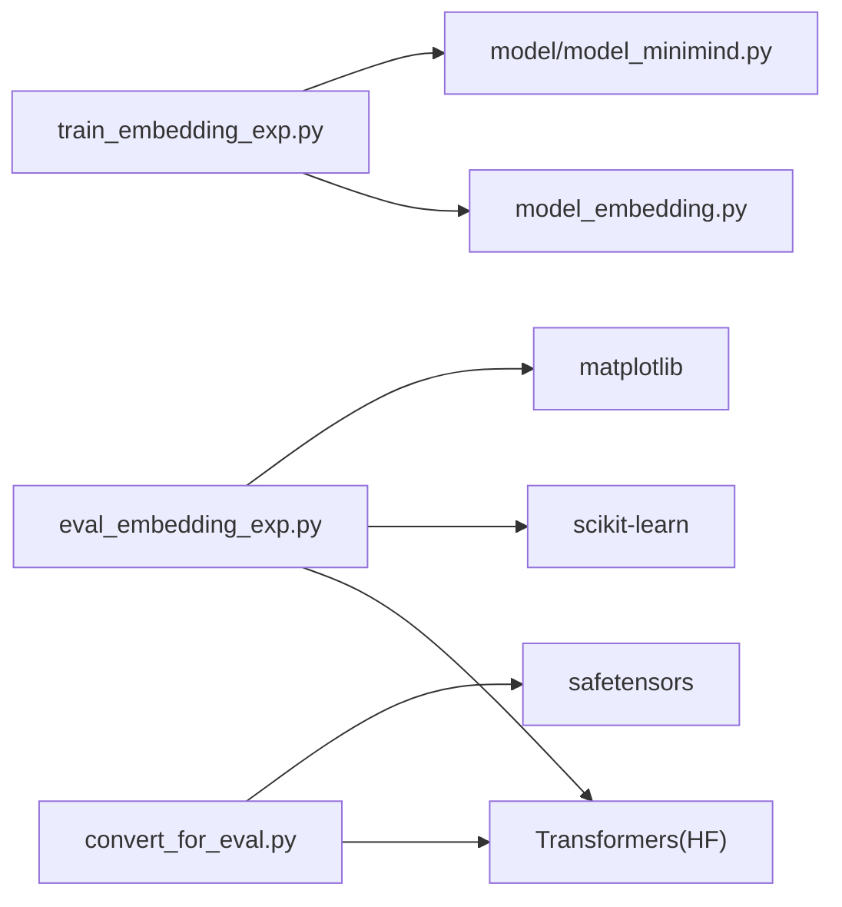

# 嵌入向量实验

<cite>
**本文引用的文件**
- [embedding-exp/train_embedding_exp.py](file://embedding-exp/train_embedding_exp.py)
- [embedding-exp/model_embedding.py](file://embedding-exp/model_embedding.py)
- [embedding-exp/eval_embedding_exp.py](file://embedding-exp/eval_embedding_exp.py)
- [embedding-exp/convert_for_eval.py](file://embedding-exp/convert_for_eval.py)
- [embedding-exp/run_all.sh](file://embedding-exp/run_all.sh)
- [embedding-exp/run_all.bat](file://embedding-exp/run_all.bat)
- [model/model_minimind.py](file://model/model_minimind.py)
- [MiniMind2-Pretrain-512/config.json](file://MiniMind2-Pretrain-512/config.json)
- [MiniMind2/config.json](file://MiniMind2/config.json)
</cite>

## 目录
1. [简介](#简介)
2. [项目结构](#项目结构)
3. [核心组件](#核心组件)
4. [架构总览](#架构总览)
5. [详细组件分析](#详细组件分析)
6. [依赖关系分析](#依赖关系分析)
7. [性能考量](#性能考量)
8. [故障排查指南](#故障排查指南)
9. [结论](#结论)
10. [附录](#附录)

## 简介
本文件面向MiniMind项目的嵌入向量实验，系统性阐述嵌入模型的架构设计、训练与评估流程、评估指标与可视化方法，以及实验脚本的使用步骤。实验聚焦三种非基线嵌入方案（B/C1/C2）与一个基线方案（A），通过统一的训练脚本进行对比，覆盖损失函数、训练策略、混合精度、梯度累积、学习率调度、DDP分布式训练、模型保存与加载、HuggingFace格式转换、下游评测（C-Eval/CMMLU）、语义分析（最近邻、t-SNE可视化、参数效率比）与对比报告生成。

## 项目结构
- embedding-exp：嵌入实验主目录，包含训练、评估、转换与自动化脚本
  - train_embedding_exp.py：统一训练脚本，支持方案B/C1/C2
  - model_embedding.py：嵌入模型定义与权重提取接口
  - eval_embedding_exp.py：基准评测、语义分析与对比汇总
  - convert_for_eval.py：将PyTorch权重转换为HuggingFace格式
  - run_all.sh / run_all.bat：跨平台自动化流水线
- model/model_minimind.py：基础MiniMind配置与模型组件（注意力、RMSNorm、RoPE等）
- 预训练模型目录：MiniMind2-Pretrain-512（方案A基线）
- 配置文件：MiniMind2-Pretrain-512/config.json、MiniMind2/config.json

**图表来源**
- [embedding-exp/train_embedding_exp.py:1-226](file://embedding-exp/train_embedding_exp.py#L1-L226)
- [embedding-exp/model_embedding.py:1-300](file://embedding-exp/model_embedding.py#L1-L300)
- [embedding-exp/eval_embedding_exp.py:1-708](file://embedding-exp/eval_embedding_exp.py#L1-L708)
- [embedding-exp/convert_for_eval.py:1-135](file://embedding-exp/convert_for_eval.py#L1-L135)
- [embedding-exp/run_all.sh:1-141](file://embedding-exp/run_all.sh#L1-L141)
- [embedding-exp/run_all.bat:1-186](file://embedding-exp/run_all.bat#L1-L186)
- [model/model_minimind.py:1-200](file://model/model_minimind.py#L1-L200)
- [MiniMind2-Pretrain-512/config.json:1-33](file://MiniMind2-Pretrain-512/config.json#L1-L33)

**章节来源**
- [embedding-exp/train_embedding_exp.py:1-226](file://embedding-exp/train_embedding_exp.py#L1-L226)
- [embedding-exp/model_embedding.py:1-300](file://embedding-exp/model_embedding.py#L1-L300)
- [embedding-exp/eval_embedding_exp.py:1-708](file://embedding-exp/eval_embedding_exp.py#L1-L708)
- [embedding-exp/convert_for_eval.py:1-135](file://embedding-exp/convert_for_eval.py#L1-L135)
- [embedding-exp/run_all.sh:1-141](file://embedding-exp/run_all.sh#L1-L141)
- [embedding-exp/run_all.bat:1-186](file://embedding-exp/run_all.bat#L1-L186)
- [model/model_minimind.py:1-200](file://model/model_minimind.py#L1-L200)
- [MiniMind2-Pretrain-512/config.json:1-33](file://MiniMind2-Pretrain-512/config.json#L1-L33)

## 核心组件
- 训练脚本（train_embedding_exp.py）
  - 支持方案B/C1/C2的统一训练流程，基于因果语言模型目标
  - 混合精度、梯度累积、余弦退火学习率、DDP分布式训练、周期性保存
- 嵌入模型（model_embedding.py）
  - MiniMindEmbeddingConfig：扩展基础配置，新增embed_type等字段
  - MiniMindEmbeddingModel：根据方案选择不同嵌入路径（A为标准Embedding；B/C1为固定坐标+线性映射；C2为可学习3维瓶颈+线性映射）
  - MiniMindEmbeddingForCausalLM：断开方案A以外的权重绑定，lm_head独立参数
  - 提供嵌入权重提取接口（映射后/原始低维）
- 评估脚本（eval_embedding_exp.py）
  - 基准评测：C-Eval/CMMLU多选题评测，ABCD token概率对比
  - 语义分析：高频字最近邻、t-SNE可视化、参数效率比
  - 对比汇总：四组方案对比报告与loss曲线对比图
- 转换脚本（convert_for_eval.py）
  - 将PyTorch权重转换为HuggingFace格式，便于下游评测与分析
- 自动化脚本（run_all.sh / run_all.bat）
  - 完整流水线：Baseline A评测 → B/C1/C2训练 → 转换 → 评测 → 语义分析 → 对比报告

**章节来源**
- [embedding-exp/train_embedding_exp.py:1-226](file://embedding-exp/train_embedding_exp.py#L1-L226)
- [embedding-exp/model_embedding.py:1-300](file://embedding-exp/model_embedding.py#L1-L300)
- [embedding-exp/eval_embedding_exp.py:1-708](file://embedding-exp/eval_embedding_exp.py#L1-L708)
- [embedding-exp/convert_for_eval.py:1-135](file://embedding-exp/convert_for_eval.py#L1-L135)
- [embedding-exp/run_all.sh:1-141](file://embedding-exp/run_all.sh#L1-L141)
- [embedding-exp/run_all.bat:1-186](file://embedding-exp/run_all.bat#L1-L186)

## 架构总览
嵌入实验采用“统一训练 + 分离评估”的架构。训练阶段以MiniMind骨干网络为基础，仅替换嵌入层以实现不同嵌入方案；评估阶段通过HuggingFace格式加载模型，执行下游评测与语义分析，并生成对比报告。

**图表来源**
- [embedding-exp/run_all.sh:1-141](file://embedding-exp/run_all.sh#L1-L141)
- [embedding-exp/train_embedding_exp.py:125-226](file://embedding-exp/train_embedding_exp.py#L125-L226)
- [embedding-exp/convert_for_eval.py:21-85](file://embedding-exp/convert_for_eval.py#L21-L85)
- [embedding-exp/eval_embedding_exp.py:202-236](file://embedding-exp/eval_embedding_exp.py#L202-L236)

## 详细组件分析

### 训练脚本（train_embedding_exp.py）
- 训练流程
  - 初始化分布式环境与随机种子
  - 构建MiniMindEmbeddingConfig与模型，打印参数统计
  - 准备分词器、数据集与优化器，启用混合精度与梯度累积
  - 余弦退火学习率调度，周期性日志与模型保存
- 关键技术
  - 损失函数：交叉熵（忽略填充位置），掩码平均
  - 训练策略：梯度累积、梯度裁剪、混合精度、DDP
  - 模型保存：半精度权重保存，周期性保存loss历史
- 训练参数
  - epochs、batch_size、learning_rate、hidden_size、num_hidden_layers、max_seq_len、use_moe、embed_type等

**图表来源**
- [embedding-exp/train_embedding_exp.py:149-226](file://embedding-exp/train_embedding_exp.py#L149-L226)

**章节来源**
- [embedding-exp/train_embedding_exp.py:1-226](file://embedding-exp/train_embedding_exp.py#L1-L226)

### 嵌入模型（model_embedding.py）
- 配置与嵌入方案
  - A：标准nn.Embedding(vocab, hidden_size)，权重绑定到lm_head
  - B：二维固定坐标 + Linear(2, hidden_size)
  - C1：三维固定正弦编码 + Linear(3, hidden_size)
  - C2：可学习Embedding(vocab, 3) + Linear(3, hidden_size)
- 前向逻辑
  - 根据方案选择嵌入路径，应用dropout与RMSNorm，逐层Transformer Block
  - 支持缓存KV以便推理加速
- 权重提取
  - get_embedding_weights：返回映射后的(词表大小, 隐藏维)嵌入
  - get_raw_embedding_weights：返回原始低维嵌入(词表大小, 坐标维)
  - get_embed_param_count：统计嵌入相关可训练参数量

**图表来源**
- [embedding-exp/model_embedding.py:30-243](file://embedding-exp/model_embedding.py#L30-L243)

**章节来源**
- [embedding-exp/model_embedding.py:1-300](file://embedding-exp/model_embedding.py#L1-L300)

### 评估脚本（eval_embedding_exp.py）
- 基准评测（C-Eval/CMMLU）
  - 加载HuggingFace模型与分词器
  - 构造多选题提示，计算最后一token对应A/B/C/D的logits并softmax得到概率
  - 统计整体准确率、按科目细分准确率
- 语义分析
  - 提取嵌入权重（映射后/原始低维）
  - 最邻近分析：高频字的Top-K邻居与相似度
  - t-SNE可视化：映射后高维或原始低维降维可视化
  - 参数效率比：PPL（由评测准确率近似）/嵌入相关参数量
- 对比汇总
  - 收集各方案评测、语义分析与loss历史
  - 生成对比报告与loss曲线对比图

**图表来源**
- [embedding-exp/eval_embedding_exp.py:202-236](file://embedding-exp/eval_embedding_exp.py#L202-L236)
- [embedding-exp/eval_embedding_exp.py:442-498](file://embedding-exp/eval_embedding_exp.py#L442-L498)
- [embedding-exp/eval_embedding_exp.py:544-624](file://embedding-exp/eval_embedding_exp.py#L544-L624)

**章节来源**
- [embedding-exp/eval_embedding_exp.py:1-708](file://embedding-exp/eval_embedding_exp.py#L1-L708)

### 转换脚本（convert_for_eval.py）
- 功能
  - 将PyTorch权重文件转换为HuggingFace格式，注册AutoClass以支持自动加载
  - 复制分词器，保存模型与配置
- 使用
  - 指定模型目录、嵌入方案、隐藏维、层数、MoE开关与保存精度
  - 自动生成b_hf/c1_hf/c2_hf目录

**章节来源**
- [embedding-exp/convert_for_eval.py:1-135](file://embedding-exp/convert_for_eval.py#L1-L135)

### 自动化脚本（run_all.sh / run_all.bat）
- 流水线步骤
  - Step1：评测Baseline A（已有预训练模型）
  - Step2-4：训练方案B/C1/C2（若权重文件不存在则训练）
  - Step5：转换为HuggingFace格式
  - Step6：评测B/C1/C2
  - Step7：语义分析与对比报告
- 平台差异
  - Linux/Mac使用run_all.sh
  - Windows使用run_all.bat（包含错误处理与提示）

**章节来源**
- [embedding-exp/run_all.sh:1-141](file://embedding-exp/run_all.sh#L1-L141)
- [embedding-exp/run_all.bat:1-186](file://embedding-exp/run_all.bat#L1-L186)

## 依赖关系分析
- 训练脚本依赖
  - 嵌入模型定义（model_embedding.py）
  - 基础MiniMind配置与组件（model/model_minimind.py）
  - 数据集（PretrainDataset，来自项目其他模块）
- 评估脚本依赖
  - HuggingFace AutoModel/AutoTokenizer
  - scikit-learn（t-SNE）、matplotlib（绘图）
  - datasets（加载评测数据）
- 转换脚本依赖
  - HuggingFace Transformers（注册AutoClass）
  - safetensors（加载权重文件）

**图表来源**
- [embedding-exp/train_embedding_exp.py:22-25](file://embedding-exp/train_embedding_exp.py#L22-L25)
- [embedding-exp/model_embedding.py:19-23](file://embedding-exp/model_embedding.py#L19-L23)
- [embedding-exp/eval_embedding_exp.py:33-34](file://embedding-exp/eval_embedding_exp.py#L33-L34)
- [embedding-exp/convert_for_eval.py:15-16](file://embedding-exp/convert_for_eval.py#L15-L16)

**章节来源**
- [embedding-exp/train_embedding_exp.py:1-226](file://embedding-exp/train_embedding_exp.py#L1-L226)
- [embedding-exp/model_embedding.py:1-300](file://embedding-exp/model_embedding.py#L1-L300)
- [embedding-exp/eval_embedding_exp.py:1-708](file://embedding-exp/eval_embedding_exp.py#L1-L708)
- [embedding-exp/convert_for_eval.py:1-135](file://embedding-exp/convert_for_eval.py#L1-L135)

## 性能考量
- 训练性能
  - 混合精度：bfloat16/float16降低显存占用，提升吞吐
  - 梯度累积：在显存受限时扩大有效batch
  - 梯度裁剪：防止梯度爆炸，稳定训练
  - DDP分布式：多卡并行，加速收敛
- 评估性能
  - GPU设备优先，CPU仅用于语义分析中的权重提取
  - t-SNE降维时控制样本规模，避免内存压力
- 参数效率
  - 嵌入方案B/C1/C2显著减少嵌入相关参数，但需平衡下游任务性能
  - 参数效率比（PPL/嵌入参数量）作为轻量嵌入的评价指标

[本节为通用指导，无需特定文件来源]

## 故障排查指南
- 训练阶段
  - CUDA不可用或显存不足：检查设备与混合精度设置，适当减小batch或增大accumulation_steps
  - DDP初始化失败：确认环境变量与NCCL配置
  - 学习率或梯度裁剪异常：调整学习率调度与裁剪阈值
- 评估阶段
  - HuggingFace模型加载失败：确认config.json与权重文件存在且匹配
  - t-SNE报错：检查权重维度与样本数量，必要时缩小样本规模
- 转换阶段
  - 权重缺失/多余key：检查权重文件完整性与模型结构一致性
- 自动化脚本
  - Windows批处理错误：查看错误码，确认Python路径与依赖安装
  - Linux/Mac权限问题：赋予脚本执行权限

**章节来源**
- [embedding-exp/train_embedding_exp.py:167-194](file://embedding-exp/train_embedding_exp.py#L167-L194)
- [embedding-exp/eval_embedding_exp.py:257-296](file://embedding-exp/eval_embedding_exp.py#L257-L296)
- [embedding-exp/convert_for_eval.py:51-67](file://embedding-exp/convert_for_eval.py#L51-L67)
- [embedding-exp/run_all.bat:22-49](file://embedding-exp/run_all.bat#L22-L49)

## 结论
本实验通过统一训练框架与标准化评估流程，系统比较了基线（A）与三种嵌入方案（B/C1/C2）。训练脚本提供了稳定的训练策略（混合精度、梯度累积、DDP、学习率调度），评估脚本覆盖下游评测与语义分析，自动化脚本实现了端到端流水线。建议在实际研究中结合参数效率比、下游任务准确率与t-SNE可视化综合判断嵌入质量，并针对具体场景选择最优嵌入方案。

[本节为总结性内容，无需特定文件来源]

## 附录

### 实验脚本使用指南
- 训练（方案B/C1/C2）
  - 使用统一训练脚本，指定embed_type、epochs、hidden_size、data_path、save_dir等参数
  - 训练完成后在save_dir生成.pth权重与loss历史JSON
- 转换（PyTorch → HuggingFace）
  - 使用转换脚本，指定model_dir、embed_type、hidden_size、tokenizer_path等
  - 自动生成b_hf/c1_hf/c2_hf目录，包含config.json与权重文件
- 评测（C-Eval/CMMLU）
  - 使用评估脚本的benchmark子命令，指定model_path与embed_type
  - 输出评测结果JSON，包含总准确率与按科目细分
- 语义分析
  - 使用semantic子命令，提取嵌入权重并生成最近邻、t-SNE图与分析JSON
- 对比汇总
  - 使用compare子命令，汇总A/B/C1/C2的评测、语义分析与loss曲线

**章节来源**
- [embedding-exp/train_embedding_exp.py:125-147](file://embedding-exp/train_embedding_exp.py#L125-L147)
- [embedding-exp/convert_for_eval.py:87-131](file://embedding-exp/convert_for_eval.py#L87-L131)
- [embedding-exp/eval_embedding_exp.py:631-704](file://embedding-exp/eval_embedding_exp.py#L631-L704)

### 嵌入模型配置参考
- 预训练模型配置（MiniMind2-Pretrain-512）
  - hidden_size、num_hidden_layers、num_attention_heads、vocab_size等
- 基础模型组件（model_minimind.py）
  - 注意力、RMSNorm、RoPE频率预计算等

**章节来源**
- [MiniMind2-Pretrain-512/config.json:1-33](file://MiniMind2-Pretrain-512/config.json#L1-L33)
- [model/model_minimind.py:8-78](file://model/model_minimind.py#L8-L78)