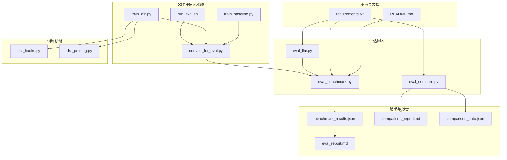
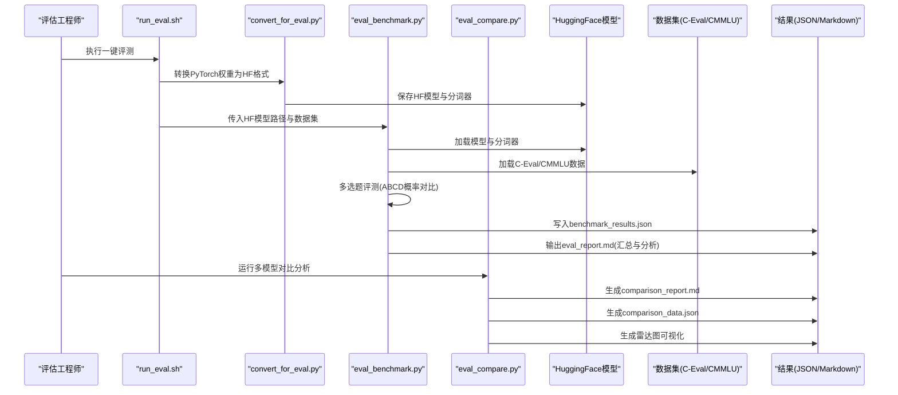
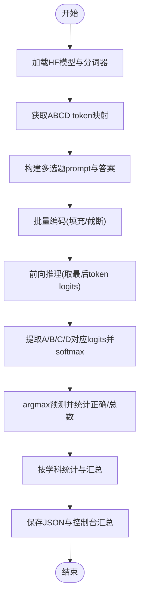
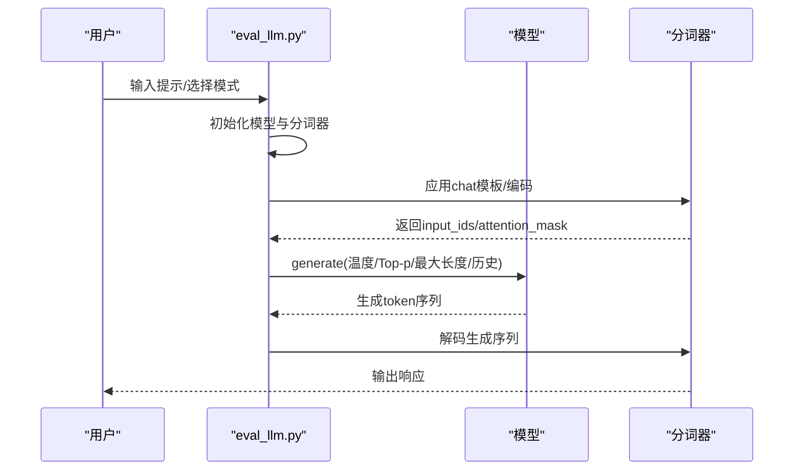
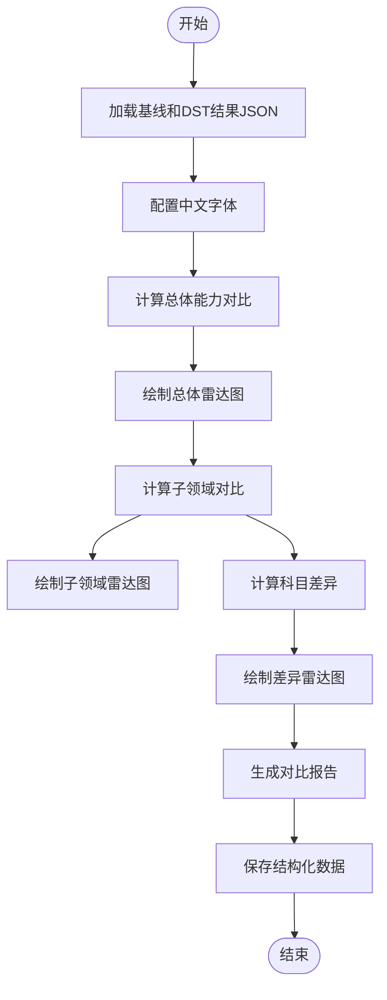
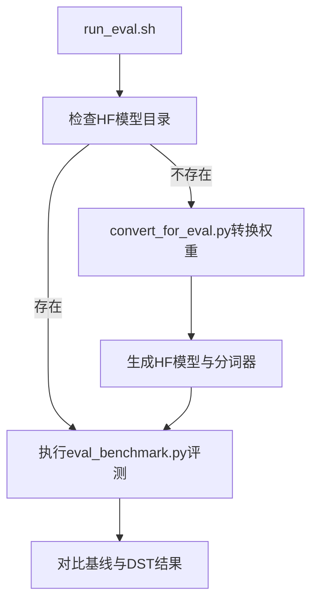
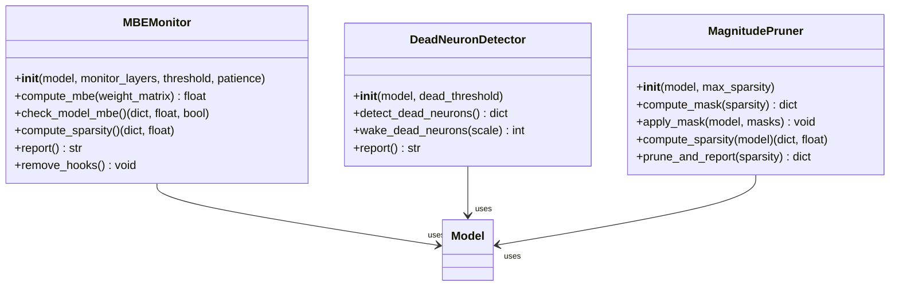
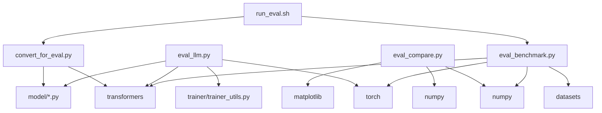

# 性能评估

<cite>
**本文引用的文件**   
- [eval_benchmark.py](file://eval_benchmark.py)
- [eval_llm.py](file://eval_llm.py)
- [eval_compare.py](file://eval_compare.py)
- [benchmark_results.json](file://eval_results/benchmark_results.json)
- [baseline_benchmark_results.json](file://reports/20260430/baseline_benchmark_results.json)
- [dst_benchmark_results.json](file://reports/20260430/dst_benchmark_results.json)
- [comparison_report.md](file://reports/20260430/comparison_report.md)
- [comparison_data.json](file://reports/20260430/comparison_data.json)
- [eval_report.md](file://reports/20260429/eval_report.md)
- [run_eval.sh](file://DST-train/run_eval.sh)
- [convert_for_eval.py](file://DST-train/convert_for_eval.py)
- [train_dst.py](file://DST-train/train_dst.py)
- [dst_hooks.py](file://DST-train/dst_hooks.py)
- [dst_pruning.py](file://DST-train/dst_pruning.py)
- [train_baseline.py](file://DST-train/train_baseline.py)
- [requirements.txt](file://requirements.txt)
- [README.md](file://README.md)
</cite>

## 目录
1. [引言](#引言)
2. [项目结构](#项目结构)
3. [核心组件](#核心组件)
4. [架构总览](#架构总览)
5. [详细组件分析](#详细组件分析)
6. [依赖分析](#依赖分析)
7. [性能考量](#性能考量)
8. [故障排查指南](#故障排查指南)
9. [结论](#结论)
10. [附录](#附录)

## 引言
本文件面向MiniMind项目的性能评估体系，系统化阐述模型性能的全面评估方法，涵盖推理速度（吞吐量、延迟）、内存占用、模型质量（对话质量、逻辑推理、代码生成）等关键指标。文档结合项目现有脚本与报告，给出评估数据集选择原则、标准化评估流程、评估报告撰写规范，以及性能优化的评估方法与实践建议，帮助评估团队建立科学、客观、可重复的评估体系。

**更新** 本版本新增了多模型评估能力、比较报告生成、雷达图可视化分析等功能，支持更全面的模型性能对比和分析。

## 项目结构
MiniMind的评估相关能力主要分布在以下模块：
- 基准评测脚本：负责加载模型、分词器，执行多选题评测，输出总体与按学科维度的准确率，并保存JSON结果。
- 推理与对话脚本：提供交互式推理与对话能力，支持不同权重与生成参数，便于质量评估。
- 比较报告生成：支持多模型对比分析，生成雷达图和详细对比报告。
- 报告与结果：包含基准评测结果JSON与Markdown报告，用于汇总与展示。
- DST训练与评估流水线：提供一键评测脚本，将PyTorch权重转换为HuggingFace格式后统一评测基线与DST模型。
- DST训练诊断：提供矩阵基熵(MBE)监控与假死神经元检测，辅助训练稳定性与收敛性评估。
- 依赖与环境：requirements.txt列出关键依赖，README.md提供项目背景与训练/评测概览。

**图示来源**
- [eval_benchmark.py:1-319](file://eval_benchmark.py#L1-L319)
- [eval_llm.py:1-89](file://eval_llm.py#L1-L89)
- [eval_compare.py:1-773](file://eval_compare.py#L1-L773)
- [benchmark_results.json:1-494](file://eval_results/benchmark_results.json#L1-L494)
- [baseline_benchmark_results.json:1-494](file://reports/20260430/baseline_benchmark_results.json#L1-L494)
- [dst_benchmark_results.json:1-494](file://reports/20260430/dst_benchmark_results.json#L1-L494)
- [comparison_report.md:1-111](file://reports/20260430/comparison_report.md#L1-L111)
- [comparison_data.json:1-944](file://reports/20260430/comparison_data.json#L1-L944)
- [eval_report.md:1-128](file://reports/20260429/eval_report.md#L1-L128)
- [run_eval.sh:1-60](file://DST-train/run_eval.sh#L1-L60)
- [convert_for_eval.py:1-154](file://DST-train/convert_for_eval.py#L1-L154)
- [train_dst.py:1-472](file://DST-train/train_dst.py#L1-L472)
- [train_baseline.py:1-169](file://DST-train/train_baseline.py#L1-L169)
- [dst_hooks.py:1-263](file://DST-train/dst_hooks.py#L1-L263)
- [dst_pruning.py:1-291](file://DST-train/dst_pruning.py#L1-L291)
- [requirements.txt:1-31](file://requirements.txt#L1-L31)
- [README.md:1-1932](file://README.md#L1-L1932)

**章节来源**
- [eval_benchmark.py:1-319](file://eval_benchmark.py#L1-L319)
- [eval_llm.py:1-89](file://eval_llm.py#L1-L89)
- [eval_compare.py:1-773](file://eval_compare.py#L1-L773)
- [run_eval.sh:1-60](file://DST-train/run_eval.sh#L1-L60)
- [convert_for_eval.py:1-154](file://DST-train/convert_for_eval.py#L1-L154)
- [train_dst.py:1-472](file://DST-train/train_dst.py#L1-L472)
- [train_baseline.py:1-169](file://DST-train/train_baseline.py#L1-L169)
- [dst_hooks.py:1-263](file://DST-train/dst_hooks.py#L1-L263)
- [dst_pruning.py:1-291](file://DST-train/dst_pruning.py#L1-L291)
- [requirements.txt:1-31](file://requirements.txt#L1-L31)
- [README.md:1-1932](file://README.md#L1-L1932)

## 核心组件
- 基准评测脚本（eval_benchmark.py）
  - 加载HuggingFace格式模型与分词器，支持CUDA/CPU设备。
  - 通过ABCD token概率对比法进行多选题评测，支持批处理推理。
  - 加载C-Eval与CMMLU数据集，按学科维度统计准确率，输出总体与分科结果。
  - 保存JSON结果与按学科大类（STEM/人文社科）汇总的准确率。
- 推理与对话脚本（eval_llm.py）
  - 支持加载原生权重或Transformers格式模型，支持LoRA权重加载。
  - 提供交互式对话，支持温度、Top-p、最大生成长度、历史对话轮数等参数。
  - 适用于对话质量、逻辑推理、代码生成等多维度质量评估。
- 比较报告生成（eval_compare.py）
  - 支持多模型对比分析，自动加载基线模型和DST模型的评测结果。
  - 生成总体能力对比、子领域对比、差异分析等多维度报告。
  - 绘制雷达图，包括总体能力雷达图、子领域雷达图、差异雷达图等。
  - 生成结构化的JSON对比数据，便于进一步分析和集成。
- 结果与报告（benchmark_results.json、comparison_report.md、comparison_data.json）
  - JSON记录C-Eval/CMMLU的总体准确率、正确/总数、按学科统计与按学科大类汇总。
  - Markdown报告提供评测环境、对比分析与摘要，便于汇报与归档。
  - 结构化数据包含详细的对比维度、数值和差异分析。
- DST评估流水线（run_eval.sh、convert_for_eval.py、train_dst.py、train_baseline.py）
  - run_eval.sh：统一评测基线与DST模型，自动检查HuggingFace格式模型并执行评测。
  - convert_for_eval.py：将PyTorch权重转换为HuggingFace格式，便于统一评测。
  - train_dst.py：实现RigL动态稀疏训练、剪枝与恢复训练，配套诊断模块。
  - train_baseline.py：标准预训练基线，作为DST对比实验的对照组。
- 训练诊断（dst_hooks.py、dst_pruning.py）
  - MBE监控：通过权重矩阵SVD计算矩阵基熵，判断模型是否达到学习饱和。
  - 假死神经元检测：检测并唤醒训练中出现的大量零激活神经元。
  - Magnitude Pruner：基于绝对值大小的剪枝，支持稀疏度计算与掩码应用。
- 环境与依赖（requirements.txt、README.md）
  - requirements.txt列出关键依赖，包括transformers、torch、datasets、matplotlib等。
  - README.md提供项目背景、模型配置、训练与评测概览，便于理解评估上下文。

**章节来源**
- [eval_benchmark.py:18-126](file://eval_benchmark.py#L18-L126)
- [eval_benchmark.py:129-231](file://eval_benchmark.py#L129-L231)
- [eval_benchmark.py:234-318](file://eval_benchmark.py#L234-L318)
- [eval_llm.py:12-87](file://eval_llm.py#L12-L87)
- [eval_compare.py:408-702](file://eval_compare.py#L408-L702)
- [benchmark_results.json:1-494](file://eval_results/benchmark_results.json#L1-L494)
- [baseline_benchmark_results.json:1-494](file://reports/20260430/baseline_benchmark_results.json#L1-L494)
- [dst_benchmark_results.json:1-494](file://reports/20260430/dst_benchmark_results.json#L1-L494)
- [comparison_report.md:1-111](file://reports/20260430/comparison_report.md#L1-L111)
- [comparison_data.json:1-944](file://reports/20260430/comparison_data.json#L1-L944)
- [eval_report.md:1-128](file://reports/20260429/eval_report.md#L1-L128)
- [run_eval.sh:26-59](file://DST-train/run_eval.sh#L26-L59)
- [convert_for_eval.py:30-83](file://DST-train/convert_for_eval.py#L30-L83)
- [train_dst.py:74-139](file://DST-train/train_dst.py#L74-L139)
- [train_dst.py:143-168](file://DST-train/train_dst.py#L143-L168)
- [train_dst.py:174-264](file://DST-train/train_dst.py#L174-L264)
- [train_baseline.py:27-86](file://DST-train/train_baseline.py#L27-L86)
- [dst_hooks.py:10-160](file://DST-train/dst_hooks.py#L10-L160)
- [dst_hooks.py:162-263](file://DST-train/dst_hooks.py#L162-L263)
- [dst_pruning.py:9-118](file://DST-train/dst_pruning.py#L9-L118)
- [dst_pruning.py:120-291](file://DST-train/dst_pruning.py#L120-L291)
- [requirements.txt:1-31](file://requirements.txt#L1-L31)
- [README.md:118-122](file://README.md#L118-L122)

## 架构总览
下图展示了MiniMind评估体系的端到端流程：从数据准备、模型转换、评测执行到结果汇总与报告生成。

**图示来源**
- [run_eval.sh:42-54](file://DST-train/run_eval.sh#L42-L54)
- [convert_for_eval.py:30-83](file://DST-train/convert_for_eval.py#L30-L83)
- [eval_benchmark.py:18-126](file://eval_benchmark.py#L18-L126)
- [eval_benchmark.py:234-318](file://eval_benchmark.py#L234-L318)
- [eval_compare.py:408-702](file://eval_compare.py#L408-L702)
- [benchmark_results.json:304-314](file://eval_results/benchmark_results.json#L304-L314)
- [comparison_report.md:1-111](file://reports/20260430/comparison_report.md#L1-L111)
- [comparison_data.json:1-944](file://reports/20260430/comparison_data.json#L1-L944)

## 详细组件分析

### 组件A：基准评测脚本（eval_benchmark.py）
- 模型加载与参数统计
  - 通过AutoModelForCausalLM与AutoTokenizer加载HF格式模型与分词器，支持半精度与设备映射。
  - 输出模型参数量，便于评估与对比。
- ABCD token映射
  - 获取A/B/C/D对应的token id，处理多token编码场景，确保评测一致性。
- 多选题评测流程
  - 构建prompt，批量编码，前向推理，取最后一个token位置logits，提取A/B/C/D对应logits，softmax得到概率，argmax预测，与正确答案比较统计准确率。
  - 支持按学科维度统计与按学科大类（STEM/人文社科）汇总。
- 数据集加载
  - C-Eval：从HuggingFace仓库加载val-split子任务，遍历科目构建问题集合。
  - CMMLU：直接加载train-split，构建问题集合。
- 结果保存与汇总
  - 保存JSON结果，包含总体准确率、正确/总数、按学科统计与按学科大类汇总。
  - 控制台输出汇总报告，便于快速对比。

**图示来源**
- [eval_benchmark.py:18-126](file://eval_benchmark.py#L18-L126)
- [eval_benchmark.py:129-231](file://eval_benchmark.py#L129-L231)
- [eval_benchmark.py:234-318](file://eval_benchmark.py#L234-L318)

**章节来源**
- [eval_benchmark.py:18-126](file://eval_benchmark.py#L18-L126)
- [eval_benchmark.py:129-231](file://eval_benchmark.py#L129-L231)
- [eval_benchmark.py:234-318](file://eval_benchmark.py#L234-L318)

### 组件B：推理与对话脚本（eval_llm.py）
- 模型初始化
  - 支持加载原生权重或Transformers格式模型，可选LoRA权重。
  - 输出模型参数量，便于评估与对比。
- 对话与生成
  - 支持自动测试与手动输入两种模式。
  - 支持温度、Top-p、最大生成长度、历史对话轮数等参数，便于质量评估与行为控制。
- 生成流
  - 应用chat模板或直接拼接，编码后生成，解码输出，支持TextStreamer流式输出。

**图示来源**
- [eval_llm.py:12-87](file://eval_llm.py#L12-L87)

**章节来源**
- [eval_llm.py:12-87](file://eval_llm.py#L12-L87)

### 组件C：比较报告生成（eval_compare.py）
- 多模型对比分析
  - 自动加载基线模型和DST模型的评测结果JSON文件。
  - 支持自定义模型标签，便于区分不同版本或配置的模型。
  - 生成详细的对比报告，包含总体能力对比、子领域对比、差异分析等。
- 雷达图可视化
  - 绘制总体能力雷达图，展示C-Eval和CMMLU的总体表现。
  - 绘制子领域雷达图，分别展示C-Eval和CMMLU的子领域表现。
  - 绘制差异雷达图，展示DST相对基线的百分点差异。
- 结构化数据输出
  - 生成JSON格式的对比数据，包含维度标签、数值和差异。
  - 支持科目级别的差异排名，便于识别提升和下降的领域。
- 中文字体支持
  - 自动配置matplotlib中文字体，确保中文标签正常显示。
  - 支持多种字体回退机制，提高兼容性。

**图示来源**
- [eval_compare.py:408-702](file://eval_compare.py#L408-L702)
- [eval_compare.py:304-406](file://eval_compare.py#L304-L406)
- [eval_compare.py:196-214](file://eval_compare.py#L196-L214)

**章节来源**
- [eval_compare.py:408-702](file://eval_compare.py#L408-L702)
- [eval_compare.py:304-406](file://eval_compare.py#L304-L406)
- [eval_compare.py:196-214](file://eval_compare.py#L196-L214)

### 组件D：DST评估流水线（run_eval.sh、convert_for_eval.py、train_dst.py、train_baseline.py）
- 一键评测脚本
  - 检查基线与DST模型的HF格式目录是否存在，不存在则提示先转换。
  - 依次评测基线与DST模型，输出对比结果。
- 模型格式转换
  - 将PyTorch权重转换为HF格式，注册AutoClass，保存模型与分词器。
- DST训练与基线训练
  - train_dst.py：实现RigL动态稀疏训练、剪枝与恢复训练，配套诊断模块。
  - train_baseline.py：标准预训练基线，作为DST对比实验的对照组。

**图示来源**
- [run_eval.sh:26-59](file://DST-train/run_eval.sh#L26-L59)
- [convert_for_eval.py:30-83](file://DST-train/convert_for_eval.py#L30-L83)
- [train_dst.py:377-471](file://DST-train/train_dst.py#L377-L471)
- [train_baseline.py:88-169](file://DST-train/train_baseline.py#L88-L169)

**章节来源**
- [run_eval.sh:26-59](file://DST-train/run_eval.sh#L26-L59)
- [convert_for_eval.py:30-83](file://DST-train/convert_for_eval.py#L30-L83)
- [train_dst.py:377-471](file://DST-train/train_dst.py#L377-L471)
- [train_baseline.py:88-169](file://DST-train/train_baseline.py#L88-L169)

### 组件E：训练诊断（dst_hooks.py、dst_pruning.py）
- MBE监控
  - 通过权重矩阵SVD计算矩阵基熵，判断模型是否达到学习饱和，记录每层MBE与整体稀疏度。
- 假死神经元检测
  - 检测并唤醒训练中出现的大量零激活神经元，保持网络发展潜力。
- Magnitude Pruner
  - 基于绝对值大小的剪枝，计算并应用掩码，支持稀疏度统计与报告。

**图示来源**
- [dst_hooks.py:10-160](file://DST-train/dst_hooks.py#L10-L160)
- [dst_hooks.py:162-263](file://DST-train/dst_hooks.py#L162-L263)
- [dst_pruning.py:9-118](file://DST-train/dst_pruning.py#L9-L118)
- [dst_pruning.py:120-291](file://DST-train/dst_pruning.py#L120-L291)

**章节来源**
- [dst_hooks.py:10-160](file://DST-train/dst_hooks.py#L10-L160)
- [dst_hooks.py:162-263](file://DST-train/dst_hooks.py#L162-L263)
- [dst_pruning.py:9-118](file://DST-train/dst_pruning.py#L9-L118)
- [dst_pruning.py:120-291](file://DST-train/dst_pruning.py#L120-L291)

## 依赖分析
- 关键依赖
  - transformers、torch、datasets：模型加载、数据集加载与评测执行。
  - matplotlib、numpy：结果可视化与统计分析基础。
  - swanlab/wandb：训练/评测过程可视化（项目默认使用SwanLab替代WandB）。
- 评估脚本依赖关系
  - eval_benchmark.py依赖transformers、datasets、torch、numpy、tqdm。
  - eval_llm.py依赖transformers、torch、model与trainer工具。
  - eval_compare.py依赖matplotlib、numpy，提供雷达图可视化功能。
  - DST评估脚本依赖convert_for_eval.py与eval_benchmark.py。

**图示来源**
- [requirements.txt:1-31](file://requirements.txt#L1-L31)
- [eval_benchmark.py:14-15](file://eval_benchmark.py#L14-L15)
- [eval_llm.py:6-9](file://eval_llm.py#L6-L9)
- [eval_compare.py:12-18](file://eval_compare.py#L12-L18)
- [convert_for_eval.py:15-16](file://DST-train/convert_for_eval.py#L15-L16)
- [run_eval.sh:47-54](file://DST-train/run_eval.sh#L47-L54)

**章节来源**
- [requirements.txt:1-31](file://requirements.txt#L1-L31)
- [eval_benchmark.py:14-15](file://eval_benchmark.py#L14-L15)
- [eval_llm.py:6-9](file://eval_llm.py#L6-L9)
- [eval_compare.py:12-18](file://eval_compare.py#L12-L18)
- [convert_for_eval.py:15-16](file://DST-train/convert_for_eval.py#L15-L16)
- [run_eval.sh:47-54](file://DST-train/run_eval.sh#L47-L54)

## 性能考量
- 推理速度评估
  - 吞吐量测试：通过批大小（batch_size）与设备（CUDA/CPU）控制，结合eval_benchmark.py的批处理推理流程，可在相同prompt集合上调整batch_size观察吞吐量变化。
  - 延迟测量：可通过在eval_llm.py中记录generate前后的时间戳，统计首token与后续token的生成延迟，结合最大生成长度与温度、Top-p等参数评估延迟特性。
  - 内存占用分析：结合模型参数量（eval_benchmark.py与eval_llm.py均输出参数量）与设备显存使用情况，评估不同模型规模与精度（半精度/全精度）对内存的影响。
- 模型质量评估
  - 对话质量：通过eval_llm.py的人工/自动对话测试，结合eval_report.md中的分析维度，评估回答准确性、连贯性与安全性。
  - 逻辑推理：利用C-Eval/CMMLU的多选题评测，按学科大类（STEM/人文社科）统计准确率，评估逻辑推理能力。
  - 代码生成：在eval_llm.py中构造代码生成任务，结合人工评估与自动化评分（如语法正确性、功能可达性）进行质量评估。
- 多模型对比评估
  - **新增功能**：通过eval_compare.py支持多模型对比分析，自动加载基线模型和DST模型的结果，生成详细的对比报告。
  - 雷达图可视化：支持总体能力雷达图、子领域雷达图、差异雷达图等多种可视化形式，直观展示模型间的性能差异。
  - 结构化数据输出：生成JSON格式的对比数据，便于进一步分析和集成到其他系统中。
- 数据集选择原则
  - 代表性：C-Eval/CMMLU覆盖广泛学科，适合评估模型的跨领域知识与推理能力。
  - 多样性：包含自然科学、社会科学、工程与医学等多个领域，确保评估覆盖面。
  - 难度梯度：通过按学科大类汇总准确率，识别模型在不同难度领域的表现差异。
- 评估流程标准化
  - 数据准备：统一数据格式（JSON/JSONL），确保prompt与答案结构一致。
  - 测试执行：固定随机种子（如eval_llm.py中的setup_seed），确保结果可复现。
  - 结果收集：统一保存JSON与Markdown报告，便于对比与归档。
  - 统计分析：按学科大类与总体准确率进行统计，结合可视化图表展示趋势。
  - **新增流程**：多模型对比分析流程，包括结果文件准备、对比报告生成、可视化输出等步骤。
- 评估报告撰写规范
  - 结果展示：使用表格呈现总体与分科准确率，突出关键指标。
  - 图表制作：结合matplotlib/numpy进行可视化（如按学科准确率柱状图、雷达图）。
  - 结论总结：结合eval_report.md的分析维度，总结模型优势与改进方向。
  - **新增规范**：多模型对比报告的撰写规范，包括对比维度说明、雷达图解读、差异分析等。

**章节来源**
- [eval_benchmark.py:18-126](file://eval_benchmark.py#L18-L126)
- [eval_llm.py:12-87](file://eval_llm.py#L12-L87)
- [eval_compare.py:408-702](file://eval_compare.py#L408-L702)
- [eval_report.md:108-128](file://reports/20260429/eval_report.md#L108-L128)
- [benchmark_results.json:304-314](file://eval_results/benchmark_results.json#L304-L314)

## 故障排查指南
- 模型加载失败
  - 确认HF格式模型目录存在且包含config.json、generation_config.json、tokenizer等文件。
  - 检查convert_for_eval.py是否成功执行，确认模型与分词器保存路径。
- 数据集加载失败
  - 确认网络可访问HuggingFace镜像源，检查数据集名称与split是否正确。
  - 对于C-Eval，确认val子任务存在且可加载。
- 评测结果异常
  - 检查ABCD token映射是否正确，避免多token编码导致的映射偏差。
  - 确认batch_size与设备内存匹配，避免OOM。
- **新增故障排查**：
  - 比较报告生成失败：检查基线和DST结果JSON文件是否存在且格式正确。
  - 雷达图显示异常：确认matplotlib安装正确，检查中文字体配置。
  - 结构化数据缺失：验证eval_compare.py的输出目录权限，确保JSON文件写入成功。
- 训练/评测可视化
  - 若使用wandb/swanlab，确认网络可访问并正确初始化，或切换为本地记录。

**章节来源**
- [run_eval.sh:30-40](file://DST-train/run_eval.sh#L30-L40)
- [convert_for_eval.py:30-83](file://DST-train/convert_for_eval.py#L30-L83)
- [eval_benchmark.py:138-162](file://eval_benchmark.py#L138-L162)
- [eval_benchmark.py:34-52](file://eval_benchmark.py#L34-L52)
- [eval_compare.py:707-773](file://eval_compare.py#L707-L773)

## 结论
MiniMind的评估体系以eval_benchmark.py为核心，结合eval_llm.py、eval_compare.py与DST训练流水线，实现了从数据准备、模型转换、评测执行到结果汇总与报告生成的闭环。通过C-Eval/CMMLU的多选题评测与按学科大类的准确率统计，能够全面评估模型在知识、逻辑推理等方面的表现；通过eval_llm.py的交互式对话与生成参数控制，可评估对话质量与代码生成能力；通过eval_compare.py的多模型对比分析和雷达图可视化，可直观展示模型间的性能差异。

配合DST训练诊断模块，可进一步优化模型训练稳定性与收敛性。建议在实际评估中遵循标准化流程，确保结果可复现、可对比、可解释。新增的多模型评估能力为模型开发和优化提供了更强大的分析工具，支持更深入的性能对比和改进方向识别。

## 附录
- 评估数据集
  - C-Eval：包含52个科目，验证集，适合评估多学科知识与推理能力。
  - CMMLU：包含67个科目，训练集，适合评估跨领域知识广度。
- 评估报告模板
  - 可参考eval_report.md的结构，包含评测环境、结果总览、分科成绩、分析与结论等部分。
  - **新增**：比较报告模板，包含多模型对比维度、雷达图解读、差异分析等内容。
- 性能优化评估方法
  - 通过DST训练诊断模块（MBE监控、假死神经元检测、剪枝）识别训练瓶颈，制定稀疏化与恢复训练策略，验证优化效果。
  - **新增**：多模型对比分析方法，通过雷达图和差异分析识别模型性能差异，指导模型改进方向。

**章节来源**
- [benchmark_results.json:1-494](file://eval_results/benchmark_results.json#L1-L494)
- [baseline_benchmark_results.json:1-494](file://reports/20260430/baseline_benchmark_results.json#L1-L494)
- [dst_benchmark_results.json:1-494](file://reports/20260430/dst_benchmark_results.json#L1-L494)
- [comparison_report.md:1-111](file://reports/20260430/comparison_report.md#L1-L111)
- [comparison_data.json:1-944](file://reports/20260430/comparison_data.json#L1-L944)
- [eval_report.md:1-128](file://reports/20260429/eval_report.md#L1-L128)
- [dst_hooks.py:10-160](file://DST-train/dst_hooks.py#L10-L160)
- [dst_hooks.py:162-263](file://DST-train/dst_hooks.py#L162-L263)
- [dst_pruning.py:9-118](file://DST-train/dst_pruning.py#L9-L118)
- [dst_pruning.py:120-291](file://DST-train/dst_pruning.py#L120-L291)