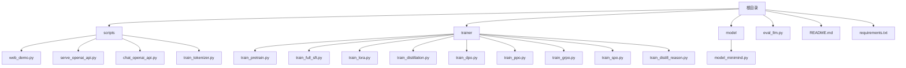
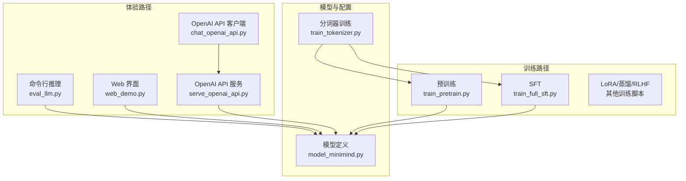
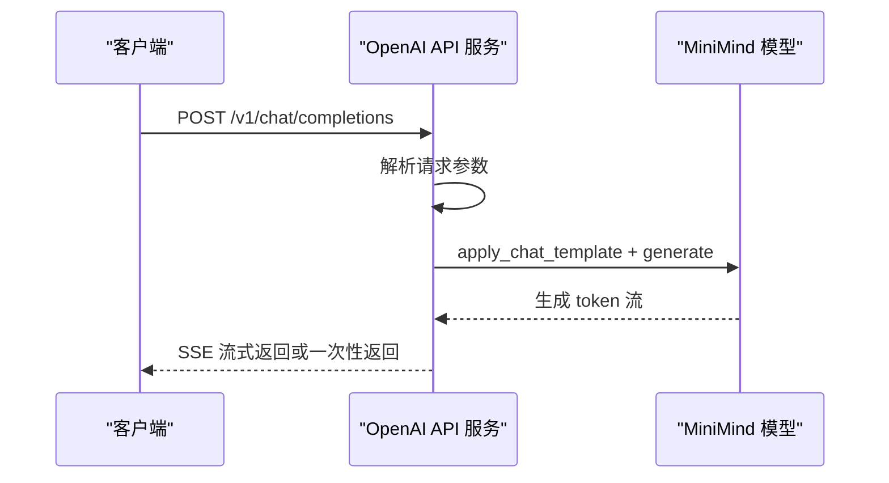
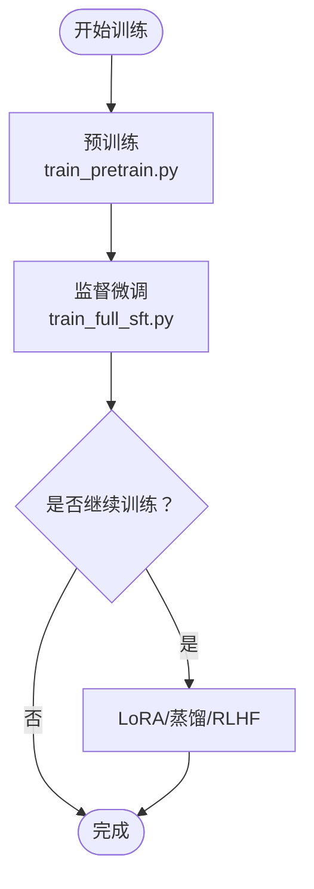
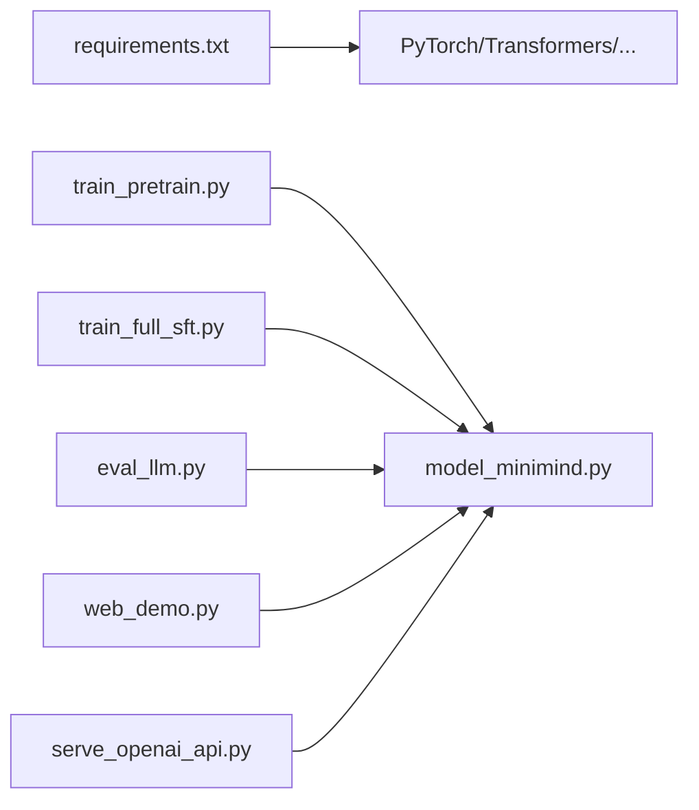

# 快速开始

<cite>
**本文引用的文件列表**
- [README.md](file://README.md)
- [requirements.txt](file://requirements.txt)
- [env_test.py](file://env_test.py)
- [eval_llm.py](file://eval_llm.py)
- [scripts/web_demo.py](file://scripts/web_demo.py)
- [scripts/serve_openai_api.py](file://scripts/serve_openai_api.py)
- [scripts/chat_openai_api.py](file://scripts/chat_openai_api.py)
- [scripts/train_tokenizer.py](file://scripts/train_tokenizer.py)
- [trainer/train_pretrain.py](file://trainer/train_pretrain.py)
- [trainer/train_full_sft.py](file://trainer/train_full_sft.py)
- [model/model_minimind.py](file://model/model_minimind.py)
</cite>

## 目录
1. [简介](#简介)
2. [项目结构](#项目结构)
3. [核心组件](#核心组件)
4. [架构总览](#架构总览)
5. [详细组件解析](#详细组件解析)
6. [依赖关系分析](#依赖关系分析)
7. [性能与成本](#性能与成本)
8. [故障排除指南](#故障排除指南)
9. [结论](#结论)
10. [附录](#附录)

## 简介
本指南面向希望在最短时间内体验 MiniMind 的用户，提供三类使用路径：
- 测试已有模型效果：直接体验 MiniMind2 系列模型，支持命令行、Web 界面与 OpenAI API 服务。
- 从零开始训练完整模型：按预训练→监督微调→可选蒸馏/强化学习的顺序训练，适合有一定经验的用户。
- 快速复现实用模型：使用推荐数据集组合，单卡 3090 在约 2 小时内完成从零到一的完整体验，成本约 3 元。

同时涵盖环境准备、CUDA 配置、依赖安装、命令行示例、参数说明、预期结果、Web 界面、OpenAI API 服务、第三方推理框架（如 llama.cpp、vllm、ollama）等多种使用方式，并提供故障排除与常见问题解决方案。

## 项目结构
- 根目录包含训练脚本、推理脚本、模型定义、数据集、文档与示例。
- 关键目录与文件：
  - scripts：Web Demo、OpenAI API 服务、OpenAI API 客户端、分词器训练脚本。
  - trainer：各类训练脚本（预训练、SFT、LoRA、蒸馏、RLHF 等）。
  - model：模型定义与配置。
  - eval_llm.py：命令行推理与评测入口。
  - README.md：项目总览与快速开始说明。
  - requirements.txt：Python 依赖清单。

图表来源
- [README.md](file://README.md)
- [requirements.txt](file://requirements.txt)
- [scripts/web_demo.py](file://scripts/web_demo.py)
- [scripts/serve_openai_api.py](file://scripts/serve_openai_api.py)
- [scripts/chat_openai_api.py](file://scripts/chat_openai_api.py)
- [scripts/train_tokenizer.py](file://scripts/train_tokenizer.py)
- [trainer/train_pretrain.py](file://trainer/train_pretrain.py)
- [trainer/train_full_sft.py](file://trainer/train_full_sft.py)
- [model/model_minimind.py](file://model/model_minimind.py)

章节来源
- [README.md](file://README.md)
- [requirements.txt](file://requirements.txt)

## 核心组件
- 模型定义与配置：MiniMindConfig 与 MiniMindForCausalLM，支持 MoE 架构与 YaRN RoPE 外推。
- 训练脚本：预训练、全参数 SFT、LoRA、蒸馏、DPO/GRPO/SPO、RLHF Reason 蒸馏等。
- 推理与评测：命令行 eval_llm.py，支持 Transformers 与原生权重加载、LoRA 应用与加载。
- Web 界面：Streamlit 实现的聊天界面，支持本地模型与 OpenAI API 两种来源。
- OpenAI API 服务：FastAPI 服务，兼容 OpenAI Chat Completions 协议，支持流式与非流式响应。
- 分词器：ByteLevel BPE 训练脚本，词表大小 6400，适配 MiniMind 架构。

章节来源
- [model/model_minimind.py](file://model/model_minimind.py)
- [trainer/train_pretrain.py](file://trainer/train_pretrain.py)
- [trainer/train_full_sft.py](file://trainer/train_full_sft.py)
- [eval_llm.py](file://eval_llm.py)
- [scripts/web_demo.py](file://scripts/web_demo.py)
- [scripts/serve_openai_api.py](file://scripts/serve_openai_api.py)
- [scripts/train_tokenizer.py](file://scripts/train_tokenizer.py)

## 架构总览
MiniMind 的使用路径分为三条主线：
- 测试已有模型：命令行 eval、Web Demo、OpenAI API 服务。
- 从零训练：预训练→SFT→可选 LoRA/蒸馏/RLHF。
- 快速复现：使用推荐数据集组合，单卡 3090 约 2 小时完成。

图表来源
- [eval_llm.py](file://eval_llm.py)
- [scripts/web_demo.py](file://scripts/web_demo.py)
- [scripts/serve_openai_api.py](file://scripts/serve_openai_api.py)
- [scripts/chat_openai_api.py](file://scripts/chat_openai_api.py)
- [trainer/train_pretrain.py](file://trainer/train_pretrain.py)
- [trainer/train_full_sft.py](file://trainer/train_full_sft.py)
- [model/model_minimind.py](file://model/model_minimind.py)
- [scripts/train_tokenizer.py](file://scripts/train_tokenizer.py)

## 详细组件解析

### 环境准备与依赖安装
- Python 版本：推荐 Python 3.10+，项目在该版本下稳定运行。
- CUDA 配置：确保 PyTorch 可用 CUDA，可通过环境检测脚本验证。
- 依赖安装：使用 pip 安装 requirements.txt 中的依赖，建议使用国内镜像源加速。
- 硬件建议：单卡 3090（24GB）可满足 MiniMind2-Small 的快速复现实验；8 卡 4090 可将总用时压缩至约 10 分钟（成本仍约 3 元）。

命令示例
- 克隆仓库与安装依赖
  - git clone https://github.com/jingyaogong/minimind.git
  - pip install -r requirements.txt -i https://mirrors.aliyun.com/pypi/simple
- CUDA 可用性检测
  - python env_test.py

章节来源
- [README.md](file://README.md)
- [requirements.txt](file://requirements.txt)
- [env_test.py](file://env_test.py)

### 测试已有模型效果
- 命令行推理
  - 使用 eval_llm.py 加载 Transformers 格式模型或原生权重，支持温度、top_p、最大生成长度、历史对话轮数等参数。
  - 示例命令：python eval_llm.py --load_from ../MiniMind2
- Web 界面
  - 使用 Streamlit 启动 web_demo.py，支持本地模型与 OpenAI API 两种来源，可调节历史轮数、最大长度、温度等。
  - 示例命令：streamlit run scripts/web_demo.py
- 第三方推理框架
  - ollama：ollama run jingyaogong/minimind2
  - vllm：vllm serve ../MiniMind2/ --served-model-name "minimind"

预期结果
- 命令行与 Web 界面均可获得流畅的中文对话效果，推理延迟与显存占用与模型规模相关（MiniMind2-Small 约 0.5GB，MiniMind2 约 1GB）。

章节来源
- [eval_llm.py](file://eval_llm.py)
- [scripts/web_demo.py](file://scripts/web_demo.py)
- [README.md](file://README.md)

### OpenAI API 服务
- 启动服务
  - 使用 serve_openai_api.py 启动 FastAPI 服务，支持 OpenAI Chat Completions 协议，可配置温度、top_p、最大生成长度、是否使用 MoE、推理时 RoPE 外推等。
  - 示例命令：python scripts/serve_openai_api.py --load_from ../MiniMind2 --weight full_sft --hidden_size 768
- 客户端调用
  - 使用 chat_openai_api.py 以 OpenAI SDK 调用本地服务，支持流式与非流式响应。
  - 示例命令：python scripts/chat_openai_api.py

图表来源
- [scripts/serve_openai_api.py](file://scripts/serve_openai_api.py)
- [scripts/chat_openai_api.py](file://scripts/chat_openai_api.py)

章节来源
- [scripts/serve_openai_api.py](file://scripts/serve_openai_api.py)
- [scripts/chat_openai_api.py](file://scripts/chat_openai_api.py)

### 从零开始训练完整模型
- 数据准备
  - 下载推荐数据集组合：pretrain_hq.jsonl + sft_mini_512.jsonl，放置于 dataset/ 目录。
  - 参考数据集说明与下载链接，按需选择其他数据集组合。
- 预训练
  - 使用 train_pretrain.py，建议单卡 3090 1 轮训练，约 1.1 小时，成本约 1.43 元。
  - 示例命令：python train_pretrain.py
- 监督微调（SFT）
  - 使用 train_full_sft.py，建议 2 轮训练，约 3.3 小时，成本约 4.29 元。
  - 示例命令：python train_full_sft.py
- 断点续训
  - 所有训练脚本支持断点续训，添加 --from_resume 1 即可自动检测并恢复训练。
  - 检查点保存在 checkpoints/ 目录，支持跨 GPU 数量恢复与 SwanLab/W&B 记录连续性。

图表来源
- [trainer/train_pretrain.py](file://trainer/train_pretrain.py)
- [trainer/train_full_sft.py](file://trainer/train_full_sft.py)
- [README.md](file://README.md)

章节来源
- [trainer/train_pretrain.py](file://trainer/train_pretrain.py)
- [trainer/train_full_sft.py](file://trainer/train_full_sft.py)
- [README.md](file://README.md)

### 快速复现实用模型
- 推荐组合：pretrain_hq.jsonl + sft_mini_512.jsonl
- 单卡 3090：约 2.1 小时 + 2.73 元，即可从零训练出 MiniMind-Zero-0.025B 模型。
- 若使用 8 卡 4090：总用时约 10 分钟，成本仍约 3 元。

章节来源
- [README.md](file://README.md)

### 分词器训练
- 使用 scripts/train_tokenizer.py 训练 ByteLevel BPE 分词器，词表大小 6400，适配 MiniMind 架构。
- 训练完成后保存 tokenizer.json 与 tokenizer_config.json，可直接在模型训练与推理中使用。

章节来源
- [scripts/train_tokenizer.py](file://scripts/train_tokenizer.py)

## 依赖关系分析
- Python 依赖：PyTorch、transformers、trl、peft、streamlit、fastapi、uvicorn、openai 等。
- 训练脚本依赖 model/model_minimind.py 中的配置与模型定义。
- 推理脚本依赖 Transformers 加载模型与分词器，或直接加载原生权重。

图表来源
- [requirements.txt](file://requirements.txt)
- [trainer/train_pretrain.py](file://trainer/train_pretrain.py)
- [trainer/train_full_sft.py](file://trainer/train_full_sft.py)
- [eval_llm.py](file://eval_llm.py)
- [scripts/web_demo.py](file://scripts/web_demo.py)
- [scripts/serve_openai_api.py](file://scripts/serve_openai_api.py)
- [model/model_minimind.py](file://model/model_minimind.py)

章节来源
- [requirements.txt](file://requirements.txt)
- [model/model_minimind.py](file://model/model_minimind.py)

## 性能与成本
- 单卡 3090 成本：约 1.3 元/小时。
- 推荐训练组合与耗时/成本概览（基于 README 的实测数据）：
  - MiniMind2-Small：预训练约 1.1 小时 + 1.43 元，SFT(sft_mini_512) 约 1 小时 + 1.3 元。
  - MiniMind2：预训练约 3.9 小时 + 5.07 元，SFT(sft_512) 约 3.3 小时 + 4.29 元。
- 8 卡 4090 可将总用时压缩至约 10 分钟，成本仍约 3 元。

章节来源
- [README.md](file://README.md)

## 故障排除指南
- CUDA 不可用
  - 症状：torch.cuda.is_available() 返回 False。
  - 处理：前往 PyTorch 官方下载对应 CUDA 版本的 wheel 文件安装。
- 训练中断后恢复
  - 使用 --from_resume 1 参数启动训练脚本，自动检测并恢复检查点。
  - 检查点保存在 checkpoints/ 目录，支持跨 GPU 数量恢复。
- 训练可视化
  - 默认使用 SwanLab 替代 W&B（完全兼容 API），如需直连 W&B 请按 README 说明切换。
- Web 界面无法加载模型
  - 确认模型路径正确，且已安装 streamlit。
- OpenAI API 服务报错
  - 检查服务端口与模型加载路径，确认分词器与模型配置一致。

章节来源
- [README.md](file://README.md)
- [env_test.py](file://env_test.py)
- [scripts/web_demo.py](file://scripts/web_demo.py)
- [scripts/serve_openai_api.py](file://scripts/serve_openai_api.py)

## 结论
通过本快速开始指南，您可以在 3 元成本与 2 小时内完成从零到一的 MiniMind 体验：既可直接测试已有模型，也可按推荐数据集组合快速复现，还可搭建 OpenAI API 服务与 Web 界面，或在本地训练完整模型。项目提供断点续训、多卡训练、可视化与第三方推理框架兼容等能力，满足不同层次用户的需求。

## 附录
- 常用命令与参数速查
  - 命令行推理：python eval_llm.py --load_from ../MiniMind2 --weight full_sft --temperature 0.85 --top_p 0.85 --max_new_tokens 8192
  - Web 界面：streamlit run scripts/web_demo.py
  - OpenAI API 服务：python scripts/serve_openai_api.py --load_from ../MiniMind2 --weight full_sft --hidden_size 768
  - OpenAI API 客户端：python scripts/chat_openai_api.py
  - 预训练：python trainer/train_pretrain.py
  - SFT：python trainer/train_full_sft.py
  - 断点续训：在任意训练脚本中添加 --from_resume 1

章节来源
- [eval_llm.py](file://eval_llm.py)
- [scripts/web_demo.py](file://scripts/web_demo.py)
- [scripts/serve_openai_api.py](file://scripts/serve_openai_api.py)
- [scripts/chat_openai_api.py](file://scripts/chat_openai_api.py)
- [trainer/train_pretrain.py](file://trainer/train_pretrain.py)
- [trainer/train_full_sft.py](file://trainer/train_full_sft.py)
- [README.md](file://README.md)