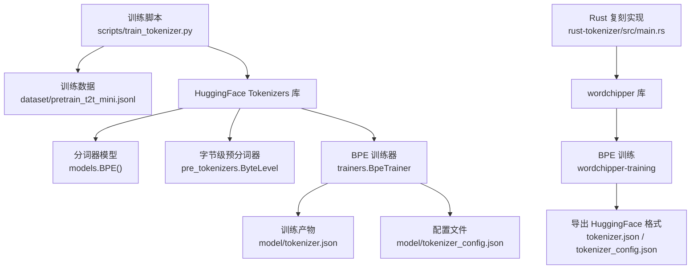
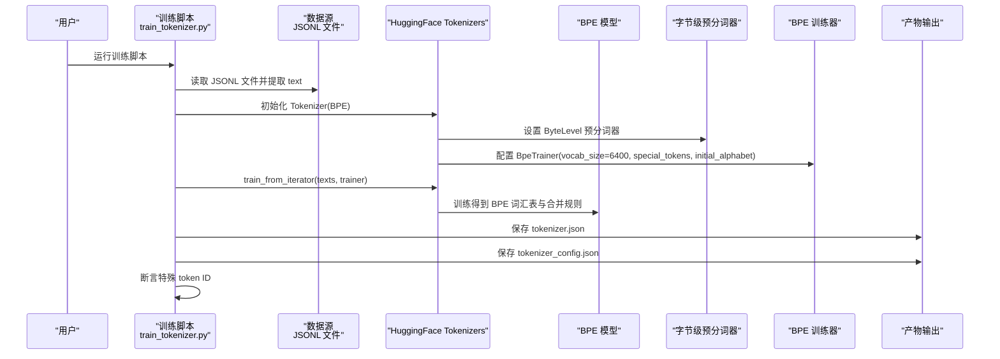
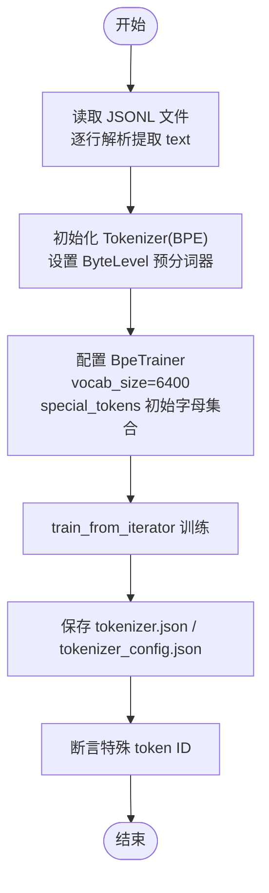

# 分词器训练

<cite>
**本文引用的文件**
- [scripts/train_tokenizer.py](file://scripts/train_tokenizer.py)
- [model/tokenizer.json](file://model/tokenizer.json)
- [model/tokenizer_config.json](file://model/tokenizer_config.json)
- [MiniMind2/tokenizer.json](file://MiniMind2/tokenizer.json)
- [MiniMind2/tokenizer_config.json](file://MiniMind2/tokenizer_config.json)
- [docs/02_Phase2_Tokenizer与数据集.md](file://docs/02_Phase2_Tokenizer与数据集.md)
- [requirements.txt](file://requirements.txt)
- [README.md](file://README.md)
- [.comate/specs/rust-bpe-tokenizer/tasks.md](file://.comate/specs/rust-bpe-tokenizer/tasks.md)
- [.comate/specs/rust-bpe-tokenizer/doc.md](file://.comate/specs/rust-bpe-tokenizer/doc.md)
- [rust-tokenizer/src/main.rs](file://rust-tokenizer/src/main.rs)
</cite>

## 目录
1. [简介](#简介)
2. [项目结构](#项目结构)
3. [核心组件](#核心组件)
4. [架构总览](#架构总览)
5. [详细组件分析](#详细组件分析)
6. [依赖分析](#依赖分析)
7. [性能考量](#性能考量)
8. [故障排查指南](#故障排查指南)
9. [结论](#结论)
10. [附录](#附录)

## 简介
本文件围绕 MiniMind 项目中的分词器训练进行系统化说明，重点基于 HuggingFace Tokenizers 库实现的 BPE 分词器，涵盖字节级预分词器（ByteLevel）、BPE 算法原理、词汇表大小（6400）、训练数据格式（JSONL）、特殊 token 定义与索引、训练参数与优化策略、训练脚本使用指南、评估方法、性能测试与常见问题解决。同时提供与 Rust 复刻实现的对照说明，帮助读者从多角度理解与复用该分词器。

## 项目结构
与分词器训练直接相关的文件与目录如下：
- 训练脚本：scripts/train_tokenizer.py
- 训练产物（Python）：model/tokenizer.json、model/tokenizer_config.json
- 训练产物（MiniMind2）：MiniMind2/tokenizer.json、MiniMind2/tokenizer_config.json
- 文档与规范：docs/02_Phase2_Tokenizer与数据集.md、.comate/specs/rust-bpe-tokenizer/*.md
- Rust 复刻实现：rust-tokenizer/src/main.rs
- 依赖声明：requirements.txt

**图表来源**
- [scripts/train_tokenizer.py:15-60](file://scripts/train_tokenizer.py#L15-L60)
- [model/tokenizer.json:1-50](file://model/tokenizer.json#L1-L50)
- [model/tokenizer_config.json:1-43](file://model/tokenizer_config.json#L1-L43)
- [rust-tokenizer/src/main.rs:137-383](file://rust-tokenizer/src/main.rs#L137-L383)

**章节来源**
- [scripts/train_tokenizer.py:15-60](file://scripts/train_tokenizer.py#L15-L60)
- [model/tokenizer.json:1-50](file://model/tokenizer.json#L1-L50)
- [model/tokenizer_config.json:1-43](file://model/tokenizer_config.json#L1-L43)
- [rust-tokenizer/src/main.rs:137-383](file://rust-tokenizer/src/main.rs#L137-L383)

## 核心组件
- 分词器初始化与组件装配
  - 使用 models.BPE() 初始化 BPE 模型
  - 使用 pre_tokenizers.ByteLevel(add_prefix_space=False) 作为字节级预分词器
  - 使用 decoders.ByteLevel() 作为解码器
- 训练器配置
  - vocab_size=6400
  - special_tokens=["", "<|im_start|>", "<|im_end|>"]
  - initial_alphabet=pre_tokenizers.ByteLevel.alphabet()
  - show_progress=True
- 数据读取与训练
  - 从 dataset/pretrain_t2t_mini.jsonl 逐行读取 JSONL，提取 text 字段
  - 使用 tokenizer.train_from_iterator(texts, trainer=trainer) 训练
- 产物保存与断言
  - 保存 tokenizer.json 与 tokenizer_config.json
  - 断言特殊 token 的 ID：空 token=0、消息开始=1、消息结束=2

**章节来源**
- [scripts/train_tokenizer.py:25-58](file://scripts/train_tokenizer.py#L25-L58)
- [scripts/train_tokenizer.py:17-21](file://scripts/train_tokenizer.py#L17-L21)

## 架构总览
下图展示从数据到分词器训练与产物导出的端到端流程：

**图表来源**
- [scripts/train_tokenizer.py:15-60](file://scripts/train_tokenizer.py#L15-L60)

**章节来源**
- [scripts/train_tokenizer.py:15-60](file://scripts/train_tokenizer.py#L15-L60)

## 详细组件分析

### BPE 分词器实现与参数
- 模型与预分词器
  - 模型：BPE（Byte Pair Encoding）
  - 预分词器：ByteLevel，add_prefix_space=false
  - 解码器：ByteLevel
- 训练器参数
  - 词汇表大小：6400
  - 特殊 token：空 token（填充）、消息开始标记、消息结束标记
  - 初始字母集合：来自 ByteLevel.alphabet()
  - 进度显示：show_progress=True
- 数据格式
  - JSONL 文件，每行包含 {"text": "..."} 字段
  - 训练数据路径：dataset/pretrain_t2t_mini.jsonl

**章节来源**
- [scripts/train_tokenizer.py:25-58](file://scripts/train_tokenizer.py#L25-L58)
- [scripts/train_tokenizer.py:17-21](file://scripts/train_tokenizer.py#L17-L21)

### 训练流程与数据读取
- 数据读取
  - 逐行读取 JSONL，解析 JSON，提取 text 字段
- 训练
  - 使用 train_from_iterator 将文本迭代器喂给训练器
- 断言
  - 验证特殊 token 的 ID 与预期一致

**图表来源**
- [scripts/train_tokenizer.py:15-60](file://scripts/train_tokenizer.py#L15-L60)

**章节来源**
- [scripts/train_tokenizer.py:15-60](file://scripts/train_tokenizer.py#L15-L60)

### 产物结构与配置
- tokenizer.json
  - added_tokens：包含空 token、消息开始、消息结束
  - pre_tokenizer：ByteLevel，add_prefix_space=false
  - decoder：ByteLevel，add_prefix_space=true
  - model：BPE，包含 merges 列表与 vocab 映射
- tokenizer_config.json
  - 特殊 token 配置：bos_token、eos_token、pad_token、unk_token
  - added_tokens_decoder：特殊 token 的详细描述
  - chat_template：用于对话模板渲染
  - model_max_length：32768
  - tokenizer_class：PreTrainedTokenizerFast

**章节来源**
- [model/tokenizer.json:1-800](file://model/tokenizer.json#L1-L800)
- [model/tokenizer_config.json:1-43](file://model/tokenizer_config.json#L1-L43)

### Rust 复刻实现对照
- Rust 实现目标
  - 使用 wordchipper + wordchipper-training 复刻 Python 训练流程
  - 产出与 HuggingFace 格式兼容的 tokenizer.json 与 tokenizer_config.json
- 关键点
  - 特殊 token 设置：空 token=0、消息开始=1、消息结束=2
  - 预分词器：OA_GPT2_PATTERN_SLOW（与 HuggingFace ByteLevel 正则等价）
  - 训练：update_from_samples + train，提取 unified_dictionary 与 canonical merges
  - 导出：手动构建 HuggingFace tokenizer.json 与 tokenizer_config.json

**章节来源**
- [.comate/specs/rust-bpe-tokenizer/tasks.md:1-39](file://.comate/specs/rust-bpe-tokenizer/tasks.md#L1-L39)
- [.comate/specs/rust-bpe-tokenizer/doc.md:1-86](file://.comate/specs/rust-bpe-tokenizer/doc.md#L1-L86)
- [rust-tokenizer/src/main.rs:137-383](file://rust-tokenizer/src/main.rs#L137-L383)

## 依赖分析
- Python 训练脚本依赖
  - tokenizers 库：Tokenizer、models.BPE、pre_tokenizers.ByteLevel、trainers.BpeTrainer、decoders.ByteLevel
  - 标准库：json、os、random
- Rust 复刻实现依赖
  - wordchipper、wordchipper-training：BPE 训练与词汇表管理
  - serde_json：JSON 序列化
  - 日志与错误处理：anyhow、log、env_logger

**章节来源**
- [requirements.txt:1-31](file://requirements.txt#L1-L31)
- [rust-tokenizer/src/main.rs:137-383](file://rust-tokenizer/src/main.rs#L137-L383)

## 性能考量
- 词表大小权衡
  - 词表大小 6400，显著降低嵌入层与输出层参数占比，适合小模型体积约束
  - 压缩率较低，可能导致 "hello" 被拆分为多个 token
- 预分词器影响
  - ByteLevel 预分词器对字节进行编码，有助于处理未登录词与多语言混合
  - add_prefix_space=false 与后续 chat_template 配置需保持一致
- 训练效率
  - JSONL 数据读取为流式迭代，适合大规模数据
  - 训练器 show_progress=True 便于监控进度

**章节来源**
- [docs/02_Phase2_Tokenizer与数据集.md:23-47](file://docs/02_Phase2_Tokenizer与数据集.md#L23-L47)
- [scripts/train_tokenizer.py:25-58](file://scripts/train_tokenizer.py#L25-L58)

## 故障排查指南
- 训练数据路径错误
  - 确认 dataset/pretrain_t2t_mini.jsonl 存在且可读
- 特殊 token ID 不匹配
  - 断言空 token=0、消息开始=1、消息结束=2，若失败检查 special_tokens 传入与 initial_alphabet
- 词表大小与预期不符
  - 检查 vocab_size=6400 是否正确传入 BpeTrainer
- 解码一致性验证
  - 使用 evaluate_tokenizer 中的 apply_chat_template 与 decode 流程验证编码解码一致性
- Rust 导出不兼容
  - 确认特殊 token ID 与 Python 一致，检查导出字段顺序与类型

**章节来源**
- [scripts/train_tokenizer.py:50-52](file://scripts/train_tokenizer.py#L50-L52)
- [scripts/train_tokenizer.py:112-139](file://scripts/train_tokenizer.py#L112-L139)
- [rust-tokenizer/src/main.rs:353-383](file://rust-tokenizer/src/main.rs#L353-L383)

## 结论
MiniMind 的分词器训练以 HuggingFace Tokenizers 为基础，采用 BPE 算法与 ByteLevel 预分词器，在 6400 词表规模下实现了对中文与多语言的良好覆盖。通过明确的特殊 token 定义、严格的 ID 断言与完善的产物导出，确保了训练产物与下游模型的一致性。Rust 复刻实现进一步验证了训练流程的可移植性与可复现性。建议在复用时保持数据格式、特殊 token 与配置的一致性，以避免跨版本与跨实现的兼容性问题。

## 附录

### 训练脚本使用指南
- 准备数据
  - 下载并放置 dataset/pretrain_t2t_mini.jsonl 至项目根目录
- 执行训练
  - 运行 python scripts/train_tokenizer.py
- 产物与配置
  - 生成 model/tokenizer.json 与 model/tokenizer_config.json
- 评估与验证
  - 使用 eval_tokenizer 验证 chat_template 应用、编码长度与解码一致性

**章节来源**
- [scripts/train_tokenizer.py:141-148](file://scripts/train_tokenizer.py#L141-L148)
- [scripts/train_tokenizer.py:112-139](file://scripts/train_tokenizer.py#L112-L139)

### 数据格式与特殊 token
- 数据格式
  - JSONL，每行 {"text": "..."}
- 特殊 token
  - 空 token（填充）：ID=0
  - 消息开始标记：<|im_start|>：ID=1
  - 消息结束标记：<|im_end|>：ID=2

**章节来源**
- [docs/02_Phase2_Tokenizer与数据集.md:127-135](file://docs/02_Phase2_Tokenizer与数据集.md#L127-L135)
- [scripts/train_tokenizer.py:29-38](file://scripts/train_tokenizer.py#L29-L38)

### 评估方法与性能测试
- 评估流程
  - 使用 AutoTokenizer.from_pretrained 加载分词器
  - apply_chat_template 渲染对话模板
  - 统计 encoder 长度与解码一致性
- 性能指标
  - 词表长度：len(tokenizer)
  - 编码长度：len(input_ids)
  - 解码一致性：decode 与原始文本比较

**章节来源**
- [scripts/train_tokenizer.py:112-139](file://scripts/train_tokenizer.py#L112-L139)