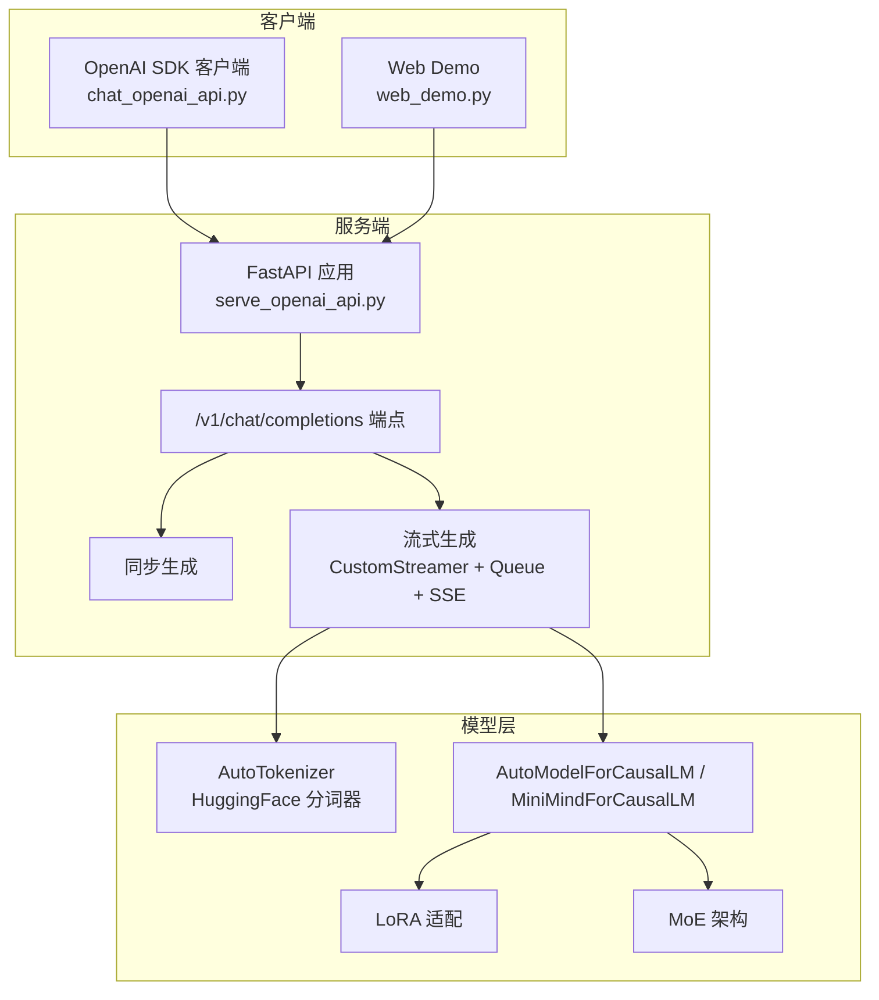
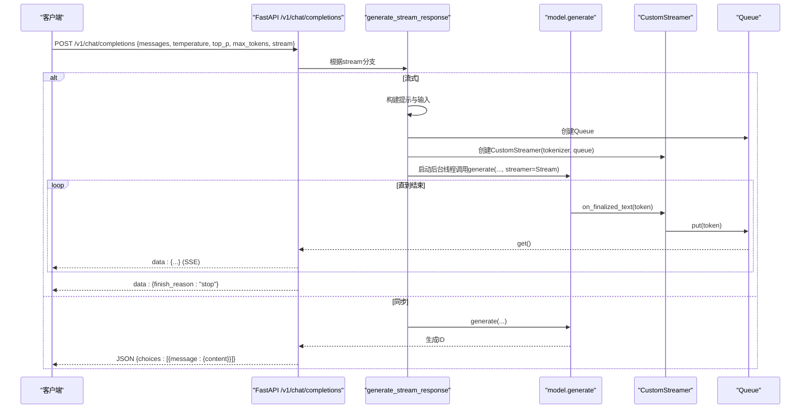
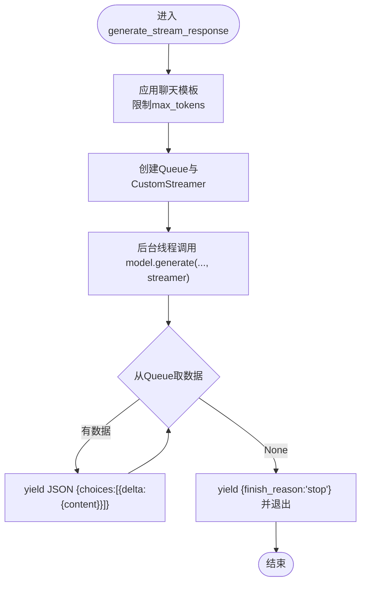
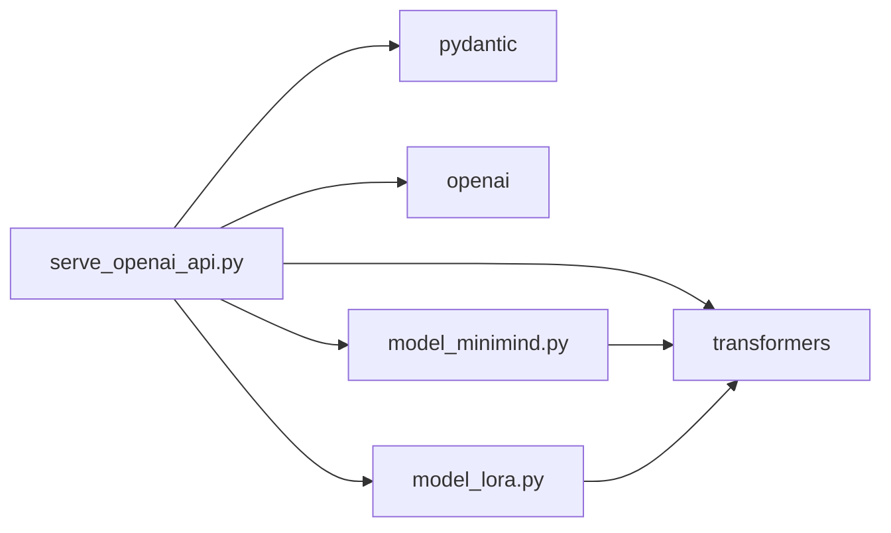

# OpenAI API兼容服务

<cite>
**本文引用的文件列表**
- [serve_openai_api.py](file://scripts/serve_openai_api.py)
- [chat_openai_api.py](file://scripts/chat_openai_api.py)
- [model_minimind.py](file://model/model_minimind.py)
- [model_lora.py](file://model/model_lora.py)
- [requirements.txt](file://requirements.txt)
- [README.md](file://README.md)
- [web_demo.py](file://scripts/web_demo.py)
- [config.json](file://MiniMind2/config.json)
- [generation_config.json](file://MiniMind2/generation_config.json)
- [tokenizer_config.json](file://MiniMind2/tokenizer_config.json)
</cite>

## 目录
1. [简介](#简介)
2. [项目结构](#项目结构)
3. [核心组件](#核心组件)
4. [架构总览](#架构总览)
5. [详细组件分析](#详细组件分析)
6. [依赖关系分析](#依赖关系分析)
7. [性能考量](#性能考量)
8. [故障排查指南](#故障排查指南)
9. [结论](#结论)
10. [附录](#附录)

## 简介
本项目提供一个与OpenAI API兼容的推理服务，基于FastAPI框架实现，支持同步与流式两种响应模式。服务端通过/v1/chat/completions端点接受请求，内部使用自研MiniMind模型（支持MoE与LoRA），并采用SSE（Server-Sent Events）协议向客户端推送流式响应。该服务既可作为独立API服务运行，也可与第三方前端（如Open-WebUI、FastGPT）无缝对接。

## 项目结构
- scripts：服务端与演示脚本
  - serve_openai_api.py：FastAPI服务入口，定义/v1/chat/completions端点，实现流式与同步生成逻辑
  - chat_openai_api.py：OpenAI SDK客户端示例，演示如何调用本服务
  - web_demo.py：Streamlit Web Demo，可切换本地模型或API模式进行对话
- model：模型与LoRA实现
  - model_minimind.py：MiniMind配置与模型实现（含Attention、FeedForward、MoE、RMSNorm等）
  - model_lora.py：LoRA低秩适配模块与应用/加载逻辑
- MiniMind2：HuggingFace格式的MiniMind权重与配置
  - config.json、generation_config.json、tokenizer_config.json：模型与分词器配置
- requirements.txt：Python依赖清单
- README.md：项目说明与使用指南

图表来源
- [serve_openai_api.py:113-159](file://scripts/serve_openai_api.py#L113-L159)
- [model_minimind.py:441-475](file://model/model_minimind.py#L441-L475)
- [model_lora.py:21-41](file://model/model_lora.py#L21-L41)

章节来源
- [serve_openai_api.py:1-178](file://scripts/serve_openai_api.py#L1-L178)
- [README.md:109-122](file://README.md#L109-L122)

## 核心组件
- FastAPI应用与路由
  - 应用实例与中间件、异常处理
  - /v1/chat/completions端点：接收ChatRequest，返回同步或SSE流式响应
- ChatRequest模型
  - 字段：model、messages、temperature、top_p、max_tokens、stream、tools
  - 默认值：temperature=0.7、top_p=0.92、max_tokens=8192、stream=False
- 流式生成器
  - CustomStreamer：继承Transformers TextStreamer，将生成的token放入Queue
  - generate_stream_response：构建提示、调用model.generate并以SSE推送增量内容
- 模型初始化
  - init_model：根据参数加载AutoTokenizer与AutoModelForCausalLM或MiniMindForCausalLM
  - 支持LoRA权重应用与加载
  - 支持MoE架构配置（use_moe、专家数量等）

章节来源
- [serve_openai_api.py:49-57](file://scripts/serve_openai_api.py#L49-L57)
- [serve_openai_api.py:59-69](file://scripts/serve_openai_api.py#L59-L69)
- [serve_openai_api.py:71-111](file://scripts/serve_openai_api.py#L71-L111)
- [serve_openai_api.py:27-46](file://scripts/serve_openai_api.py#L27-L46)

## 架构总览
服务端采用同步与异步双通道：
- 同步模式：直接调用model.generate，解码后一次性返回
- 流式模式：启动后台线程执行model.generate，通过CustomStreamer回调将token写入Queue，主协程循环从Queue取出并以SSE格式逐块推送

图表来源
- [serve_openai_api.py:113-159](file://scripts/serve_openai_api.py#L113-L159)
- [serve_openai_api.py:71-111](file://scripts/serve_openai_api.py#L71-L111)
- [serve_openai_api.py:59-69](file://scripts/serve_openai_api.py#L59-L69)

## 详细组件分析

### FastAPI端点与请求模型
- ChatRequest字段与默认值
  - model：字符串，模型标识
  - messages：列表，对话历史与当前消息
  - temperature：浮点，默认0.7
  - top_p：浮点，默认0.92
  - max_tokens：整数，默认8192
  - stream：布尔，默认False
  - tools：列表，默认[]
- /v1/chat/completions处理流程
  - 同步：调用tokenizer.apply_chat_template生成提示，model.generate生成ID，解码并返回标准OpenAI格式
  - 流式：使用StreamingResponse与SSE，逐块返回choices.delta.content

章节来源
- [serve_openai_api.py:49-57](file://scripts/serve_openai_api.py#L49-L57)
- [serve_openai_api.py:113-159](file://scripts/serve_openai_api.py#L113-L159)

### 流式响应生成机制
- CustomStreamer
  - 继承TextStreamer，重写on_finalized_text，将生成的文本片段写入Queue
  - 结束时写入None作为终止信号
- generate_stream_response
  - 使用tokenizer.apply_chat_template生成提示，限制max_tokens
  - 创建Queue与CustomStreamer，后台线程调用model.generate并传入streamer
  - 主协程循环从Queue取文本，逐块yield JSON，最后发送finish_reason
- SSE协议
  - FastAPI StreamingResponse以text/event-stream传输
  - 每块数据前缀"data: "，末尾"\n\n"

图表来源
- [serve_openai_api.py:71-111](file://scripts/serve_openai_api.py#L71-L111)
- [serve_openai_api.py:59-69](file://scripts/serve_openai_api.py#L59-L69)

章节来源
- [serve_openai_api.py:59-69](file://scripts/serve_openai_api.py#L59-L69)
- [serve_openai_api.py:71-111](file://scripts/serve_openai_api.py#L71-L111)

### 模型初始化与配置
- init_model
  - AutoTokenizer.from_pretrained加载分词器
  - 若load_from包含"model"，则实例化MiniMindForCausalLM并加载本地权重
  - 否则使用AutoModelForCausalLM.from_pretrained加载HuggingFace格式模型
  - 可选加载LoRA权重（apply_lora + load_lora）
- MiniMind配置
  - MiniMindConfig：包含hidden_size、num_hidden_layers、num_attention_heads、num_key_value_heads、vocab_size、rope_theta、inference_rope_scaling、use_moe、专家相关参数等
  - MiniMindForCausalLM：继承PreTrainedModel与GenerationMixin，包含MiniMindModel与lm_head
- HuggingFace配置
  - config.json、generation_config.json、tokenizer_config.json提供模型与分词器的标准配置

章节来源
- [serve_openai_api.py:27-46](file://scripts/serve_openai_api.py#L27-L46)
- [model_minimind.py:8-78](file://model/model_minimind.py#L8-L78)
- [model_minimind.py:441-475](file://model/model_minimind.py#L441-L475)
- [config.json:1-33](file://MiniMind2/config.json#L1-L33)
- [generation_config.json:1-10](file://MiniMind2/generation_config.json#L1-L10)
- [tokenizer_config.json:1-18](file://MiniMind2/tokenizer_config.json#L1-L18)

### LoRA权重应用
- LoRA结构
  - LoRA模块：两个低秩线性层A与B，秩rank控制参数量
  - apply_lora：遍历模型Linear层，为方阵权重注入lora模块，并重写forward实现A+B叠加
  - load_lora/save_lora：按模块名匹配加载/保存LoRA状态
- 服务端集成
  - init_model中根据参数决定是否应用LoRA并加载对应权重

章节来源
- [model_lora.py:6-19](file://model/model_lora.py#L6-L19)
- [model_lora.py:21-41](file://model/model_lora.py#L21-L41)
- [serve_openai_api.py:40-42](file://scripts/serve_openai_api.py#L40-L42)

### API使用示例
- 同步调用
  - 使用OpenAI SDK，设置base_url为本服务地址，model为"minimind"
  - messages为对话历史，temperature与top_p按需设置
- 流式调用
  - 将stream设为True，遍历response，读取choices[0].delta.content累积输出
- Web Demo
  - web_demo.py支持本地模型与API两种模式，可调节历史轮数、最大生成长度、温度等参数

章节来源
- [chat_openai_api.py:14-29](file://scripts/chat_openai_api.py#L14-L29)
- [web_demo.py:261-276](file://scripts/web_demo.py#L261-L276)

## 依赖关系分析
- Python依赖
  - FastAPI、uvicorn：服务端框架与ASGI服务器
  - pydantic：请求模型验证
  - transformers、torch：模型与分词器、张量运算
  - openai：OpenAI SDK客户端示例
- 模块耦合
  - serve_openai_api.py依赖model_minimind.py与model_lora.py
  - model_minimind.py定义MiniMindConfig/MiniMindForCausalLM
  - model_lora.py提供LoRA注入与加载

图表来源
- [requirements.txt:1-31](file://requirements.txt#L1-L31)
- [serve_openai_api.py:18-20](file://scripts/serve_openai_api.py#L18-L20)

章节来源
- [requirements.txt:1-31](file://requirements.txt#L1-L31)
- [serve_openai_api.py:18-20](file://scripts/serve_openai_api.py#L18-L20)

## 性能考量
- 设备与显存
  - 服务端默认优先使用CUDA，可通过--device参数切换CPU
  - MiniMind2系列参数量从26M到145M不等，适合不同显存条件
- 生成策略
  - temperature与top_p影响采样多样性与稳定性
  - max_tokens限制生成长度，避免过长序列导致显存压力
- 流式优势
  - 流式响应降低首屏延迟，改善用户体验
  - SSE协议轻量，适合长文本生成
- 模型优化
  - RoPE外推（inference_rope_scaling）可提升长序列推理
  - MoE架构在相同参数量下提升容量与效率
  - LoRA低秩适配减少参数量与内存占用

章节来源
- [serve_openai_api.py:173-175](file://scripts/serve_openai_api.py#L173-L175)
- [model_minimind.py:58-64](file://model/model_minimind.py#L58-L64)
- [README.md:98-107](file://README.md#L98-L107)

## 故障排查指南
- 常见错误与处理
  - HTTP 500：服务端异常捕获并返回错误信息，检查日志定位具体异常
  - 生成异常：generate_stream_response中捕获异常并返回{"error": "..."}
- 环境与依赖
  - 确认requirements.txt中依赖版本满足要求
  - CUDA可用性：若CUDA不可用，服务端会回退到CPU
- 模型加载
  - load_from路径正确：transformers格式与本地权重路径需匹配
  - LoRA权重文件存在且与hidden_size匹配
- SSE连接
  - 客户端需正确解析SSE格式，注意"data: "前缀与"\n\n"结尾

章节来源
- [serve_openai_api.py:158-159](file://scripts/serve_openai_api.py#L158-L159)
- [serve_openai_api.py:109-110](file://scripts/serve_openai_api.py#L109-L110)
- [requirements.txt:1-31](file://requirements.txt#L1-L31)

## 结论
本OpenAI API兼容服务以FastAPI为核心，结合自研MiniMind模型与LoRA/MoE技术，实现了高性能、低延迟的对话生成服务。通过同步与流式两种模式，满足不同场景下的交互需求；通过SSE协议与队列异步处理，保障了良好的用户体验。项目文档与示例清晰，便于快速集成与扩展。

## 附录
- 启动服务
  - python scripts/serve_openai_api.py [--device cuda|cpu] [--load_from ...] [--weight ...] [--lora_weight ...] [--use_moe 0|1]
- 调用示例
  - 同步：设置stream=false
  - 流式：设置stream=true，逐块读取delta.content
- Web Demo
  - streamlit run scripts/web_demo.py，可切换本地模型或API模式

章节来源
- [serve_openai_api.py:162-178](file://scripts/serve_openai_api.py#L162-L178)
- [web_demo.py:162-182](file://scripts/web_demo.py#L162-L182)