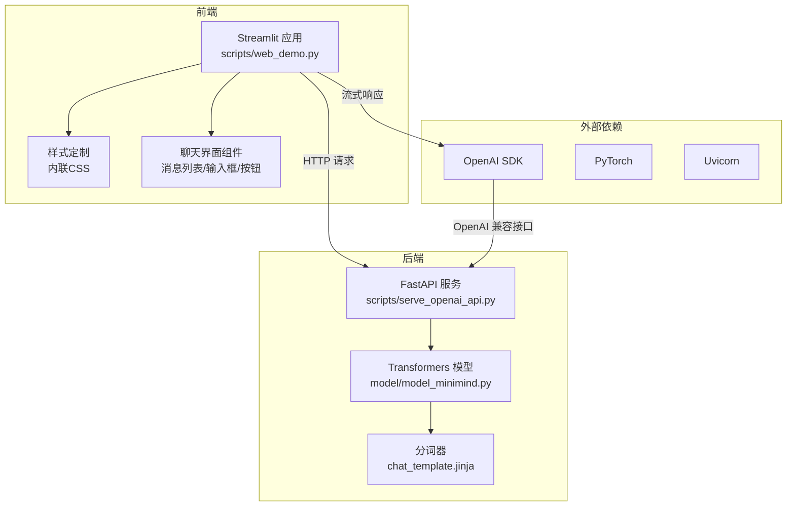
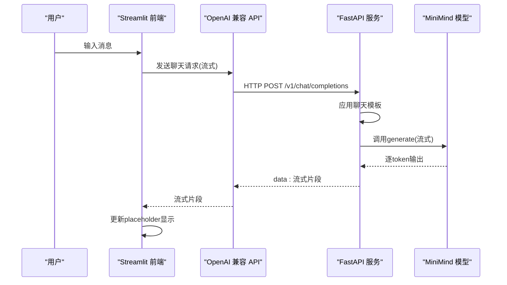
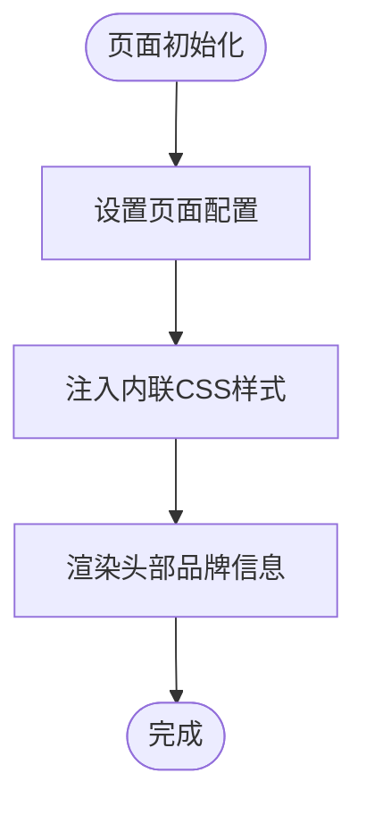
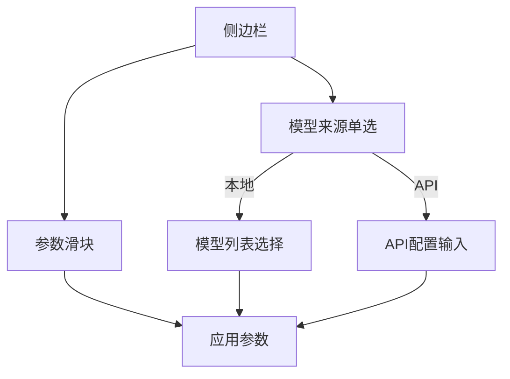
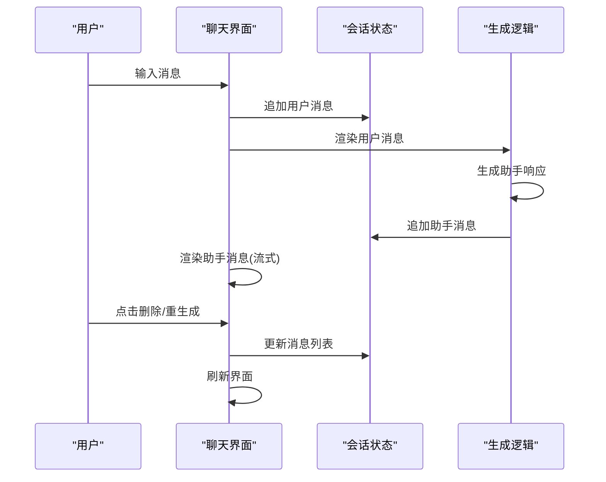
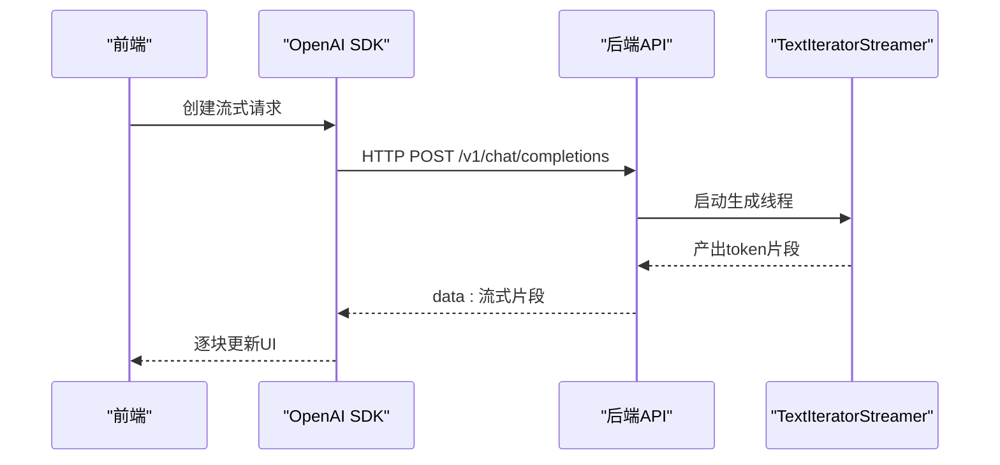
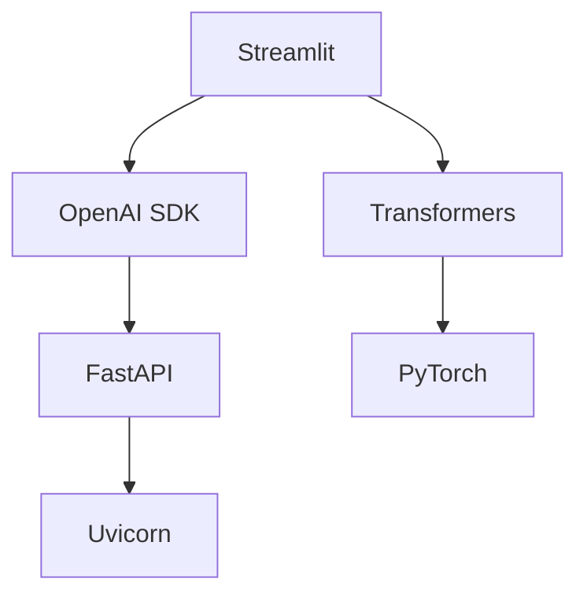

# Web演示界面

<cite>
**本文档引用的文件**
- [web_demo.py](file://scripts/web_demo.py)
- [requirements.txt](file://requirements.txt)
- [README.md](file://README.md)
- [serve_openai_api.py](file://scripts/serve_openai_api.py)
- [chat_openai_api.py](file://scripts/chat_openai_api.py)
- [chat_template.jinja](file://MiniMind2/chat_template.jinja)
- [model_minimind.py](file://model/model_minimind.py)
</cite>

## 目录
1. [简介](#简介)
2. [项目结构](#项目结构)
3. [核心组件](#核心组件)
4. [架构概览](#架构概览)
5. [详细组件分析](#详细组件分析)
6. [依赖关系分析](#依赖关系分析)
7. [性能考量](#性能考量)
8. [故障排除指南](#故障排除指南)
9. [结论](#结论)
10. [附录](#附录)

## 简介
本文件为MiniMind项目Web演示界面的详细实现文档，聚焦于基于Streamlit的聊天界面实现，涵盖页面布局设计、组件布局、样式定制、聊天交互逻辑、实时通信机制、主题定制与个性化设置、部署指南以及用户体验优化建议。该界面支持两种模式：
- 本地模型模式：直接加载本地训练好的MiniMind模型进行推理
- API模式：通过OpenAI兼容的API接口与后端服务通信，实现流式响应

## 项目结构
Web演示界面的核心实现位于scripts/web_demo.py，配合后端OpenAI API服务scripts/serve_openai_api.py，以及模型配置model/model_minimind.py和聊天模板MiniMind2/chat_template.jinja。依赖管理通过requirements.txt统一维护。

**图表来源**
- [web_demo.py:1-329](file://scripts/web_demo.py#L1-L329)
- [serve_openai_api.py:1-178](file://scripts/serve_openai_api.py#L1-L178)
- [model_minimind.py:1-200](file://model/model_minimind.py#L1-L200)
- [chat_template.jinja:1-74](file://MiniMind2/chat_template.jinja#L1-L74)

**章节来源**
- [web_demo.py:1-329](file://scripts/web_demo.py#L1-L329)
- [requirements.txt:1-31](file://requirements.txt#L1-L31)
- [README.md:252-258](file://README.md#L252-L258)

## 核心组件
- 页面配置与样式定制：通过st.set_page_config设置页面标题，使用st.markdown注入内联CSS，实现按钮圆角、尺寸、间距、悬停效果等样式定制，以及主容器的顶部/底部间距调整。
- 侧边栏参数调节：提供历史对话轮数、最大生成长度、温度等滑块控件，支持本地模型与API两种模式切换。
- 聊天界面：使用st.chat_message渲染助手消息，st.chat_input接收用户输入，placeholder用于流式展示生成内容。
- 模型加载与缓存：@st.cache_resource装饰的load_model_tokenizer用于加载本地模型与分词器，减少重复初始化开销。
- 实时通信：API模式下使用OpenAI SDK的流式接口，后端服务通过TextIteratorStreamer与队列实现SSE风格的流式响应。
- 内容处理：process_assistant_content对推理标签进行HTML转换，支持展开/折叠的推理内容展示。

**章节来源**
- [web_demo.py:9-65](file://scripts/web_demo.py#L9-L65)
- [web_demo.py:154-162](file://scripts/web_demo.py#L154-L162)
- [web_demo.py:207-323](file://scripts/web_demo.py#L207-L323)
- [web_demo.py:98-109](file://scripts/web_demo.py#L98-L109)
- [web_demo.py:71-95](file://scripts/web_demo.py#L71-L95)

## 架构概览
Web演示界面采用前后端分离架构：
- 前端：Streamlit负责UI渲染与用户交互，通过OpenAI SDK或本地模型生成内容。
- 后端：FastAPI提供OpenAI兼容的/chat/completions接口，内部使用Transformers加载MiniMind模型，支持流式生成与SSE响应。

**图表来源**
- [web_demo.py:251-276](file://scripts/web_demo.py#L251-L276)
- [serve_openai_api.py:113-157](file://scripts/serve_openai_api.py#L113-L157)

## 详细组件分析

### 页面布局与样式定制
- 页面配置：设置页面标题，初始侧边栏状态为折叠。
- 样式定制：通过内联CSS实现按钮圆角、固定尺寸、居中对齐、悬停过渡效果；调整主容器顶部/底部间距，优化视觉层次。
- 头部展示：使用st.markdown渲染品牌Logo与标语，增强品牌识别。

**图表来源**
- [web_demo.py:9-65](file://scripts/web_demo.py#L9-L65)
- [web_demo.py:185-194](file://scripts/web_demo.py#L185-L194)

**章节来源**
- [web_demo.py:9-65](file://scripts/web_demo.py#L9-L65)
- [web_demo.py:185-194](file://scripts/web_demo.py#L185-L194)

### 侧边栏参数与模型选择
- 参数调节：历史对话轮数（0-6步进2）、最大生成长度（256-8192）、温度（0.6-1.2）。
- 模式切换：本地模型与API两种来源，API模式下可配置URL、模型ID、API Key等。
- 模型列表：支持MiniMind2系列不同规模模型的本地加载。

**图表来源**
- [web_demo.py:154-181](file://scripts/web_demo.py#L154-L181)

**章节来源**
- [web_demo.py:154-181](file://scripts/web_demo.py#L154-L181)

### 聊天界面交互逻辑
- 历史消息渲染：遍历st.session_state.messages，助手消息使用st.chat_message渲染，用户消息使用自定义HTML块展示。
- 用户输入：st.chat_input提供占位符，触发条件为prompt存在。
- 助手响应：使用st.empty()创建placeholder，根据模式分别调用OpenAI SDK或本地模型生成。
- 删除与重生成：为每条消息提供删除按钮，支持重新生成最后一条回答。

**图表来源**
- [web_demo.py:217-323](file://scripts/web_demo.py#L217-L323)

**章节来源**
- [web_demo.py:217-323](file://scripts/web_demo.py#L217-L323)

### 实时通信与流式响应
- API模式：使用OpenAI SDK的chat.completions.create并设置stream=True，逐块接收delta.content并更新placeholder。
- 本地模式：使用TextIteratorStreamer与自定义队列，通过线程异步生成，逐token推送至前端。
- 后端服务：FastAPI提供/v1/chat/completions接口，支持流式与非流式两种模式，内部通过CustomStreamer实现SSE风格响应。

**图表来源**
- [web_demo.py:251-276](file://scripts/web_demo.py#L251-L276)
- [serve_openai_api.py:79-107](file://scripts/serve_openai_api.py#L79-L107)

**章节来源**
- [web_demo.py:251-276](file://scripts/web_demo.py#L251-L276)
- [serve_openai_api.py:79-107](file://scripts/serve_openai_api.py#L79-L107)

### 主题定制与个性化设置
- 颜色方案：通过内联CSS定义按钮基础色、悬停色、背景色等，实现柔和的视觉风格。
- 字体设置：使用内联CSS设置字号、字重、斜体等属性，提升可读性。
- 响应式设计：通过flex布局与居中对齐，适配不同屏幕尺寸。
- 个性化元素：品牌Logo与标语展示，增强产品识别度。

**章节来源**
- [web_demo.py:11-65](file://scripts/web_demo.py#L11-L65)
- [web_demo.py:185-194](file://scripts/web_demo.py#L185-L194)

### 聊天模板与推理标签处理
- 聊天模板：使用Jinja模板将消息列表转换为模型可接受的格式，支持系统提示、工具调用、推理标签等。
- 推理标签处理：process_assistant_content对特定标签进行HTML转换，支持展开/折叠的推理内容展示，提升用户体验。

**章节来源**
- [chat_template.jinja:1-74](file://MiniMind2/chat_template.jinja#L1-L74)
- [web_demo.py:71-95](file://scripts/web_demo.py#L71-L95)

## 依赖关系分析
- Streamlit：前端UI框架，负责页面渲染与用户交互。
- Transformers：模型加载与推理，支持本地模型与聊天模板应用。
- OpenAI SDK：API模式下的客户端SDK，支持流式响应。
- FastAPI/Uvicorn：后端服务，提供OpenAI兼容的API接口。
- PyTorch：模型推理后端，支持CUDA加速。

**图表来源**
- [requirements.txt:27-31](file://requirements.txt#L27-L31)
- [requirements.txt:12-21](file://requirements.txt#L12-L21)
- [requirements.txt:3,4](file://requirements.txt#L3,L4)

**章节来源**
- [requirements.txt:1-31](file://requirements.txt#L1-L31)

## 性能考量
- 缓存策略：@st.cache_resource用于模型与分词器的缓存，避免重复加载。
- 流式生成：API模式与本地模式均采用流式输出，降低首token延迟，提升交互体验。
- 设备选择：自动检测CUDA可用性，优先使用GPU加速。
- 参数限制：对用户输入长度进行截断，避免过长上下文影响性能。

**章节来源**
- [web_demo.py:98-109](file://scripts/web_demo.py#L98-L109)
- [web_demo.py:278-314](file://scripts/web_demo.py#L278-L314)
- [web_demo.py:68](file://scripts/web_demo.py#L68)

## 故障排除指南
- API连接失败：检查API URL、模型ID、API Key配置是否正确，确认后端服务已启动。
- 流式响应异常：确认OpenAI SDK版本与后端SSE实现兼容，检查网络连接与防火墙设置。
- 本地模型加载错误：确认模型路径正确，依赖库版本匹配，CUDA驱动与PyTorch版本兼容。
- 显示异常：检查内联CSS样式是否被浏览器禁用，或与主题冲突。

**章节来源**
- [web_demo.py:274-276](file://scripts/web_demo.py#L274-L276)
- [README.md:252-258](file://README.md#L252-L258)

## 结论
本Web演示界面通过Streamlit实现了简洁高效的聊天交互体验，结合OpenAI兼容的后端服务与本地模型加载，支持灵活的部署与扩展。通过内联CSS与聊天模板的配合，界面在视觉与功能上达到良好平衡。建议在生产环境中进一步完善错误处理、日志记录与监控告警，以提升稳定性与可维护性。

## 附录

### 部署指南
- 环境准备：安装Python 3.10+，使用requirements.txt安装依赖。
- 启动后端服务：进入scripts目录，运行Python脚本启动FastAPI服务。
- 启动前端：在scripts目录下使用Streamlit命令启动web_demo.py。
- 配置API模式：在侧边栏填写API URL、模型ID、API Key等参数。

**章节来源**
- [README.md:231-258](file://README.md#L231-L258)
- [requirements.txt:1-31](file://requirements.txt#L1-L31)