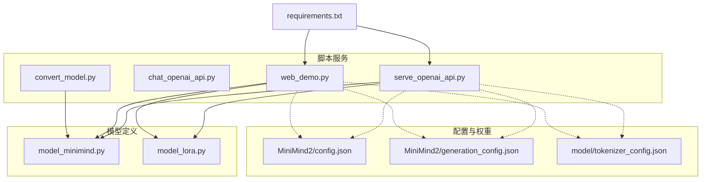
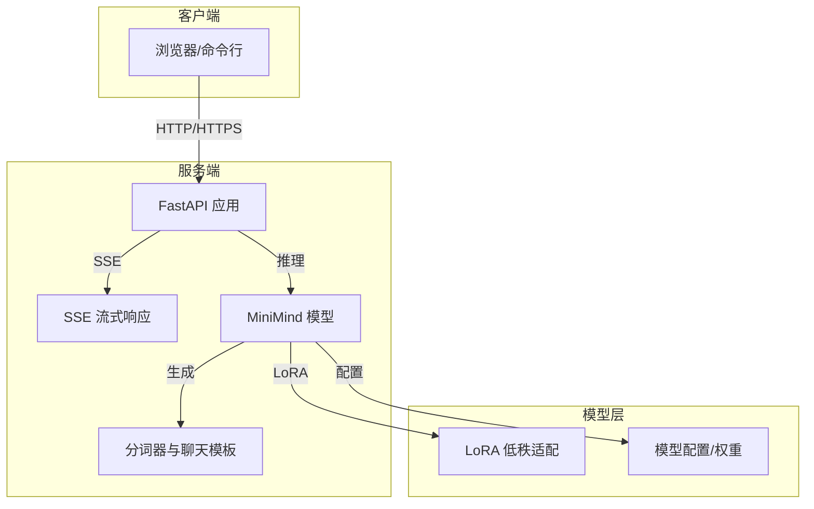
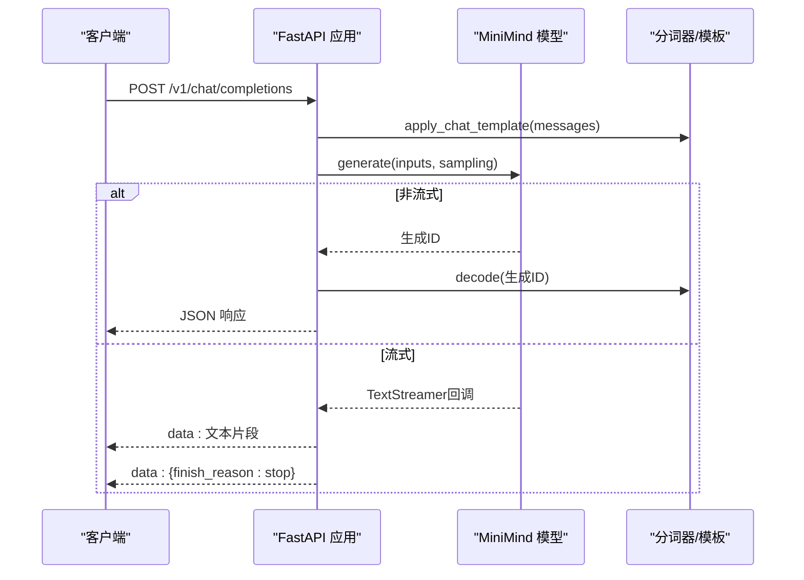
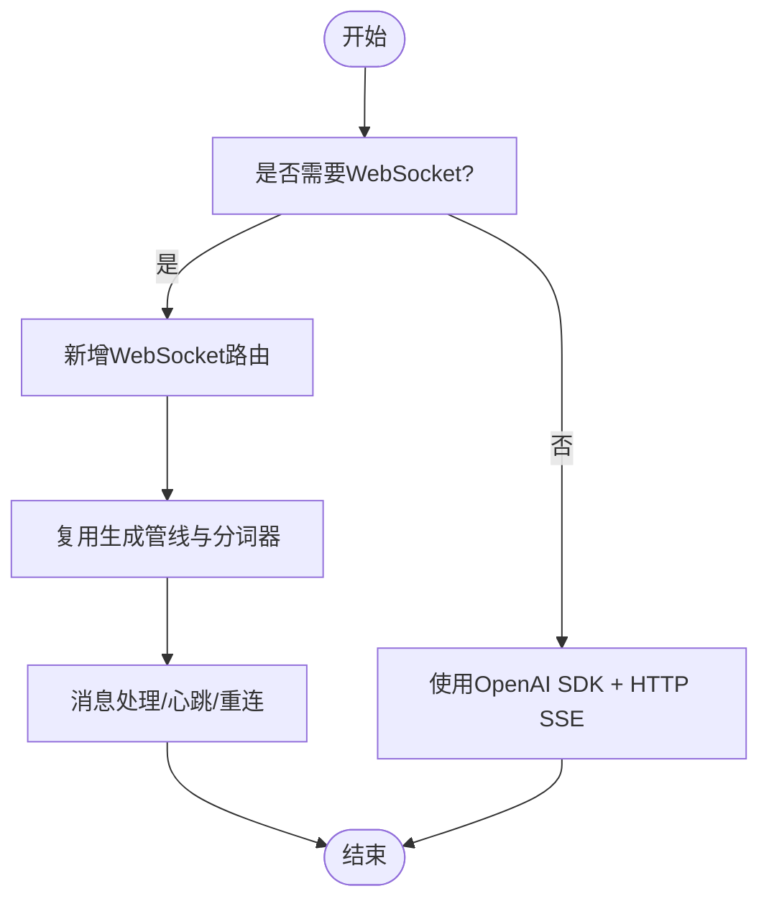
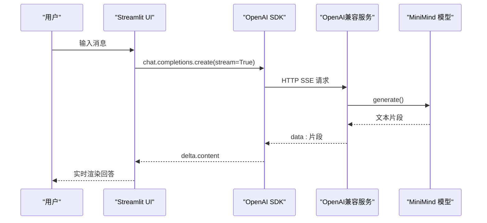
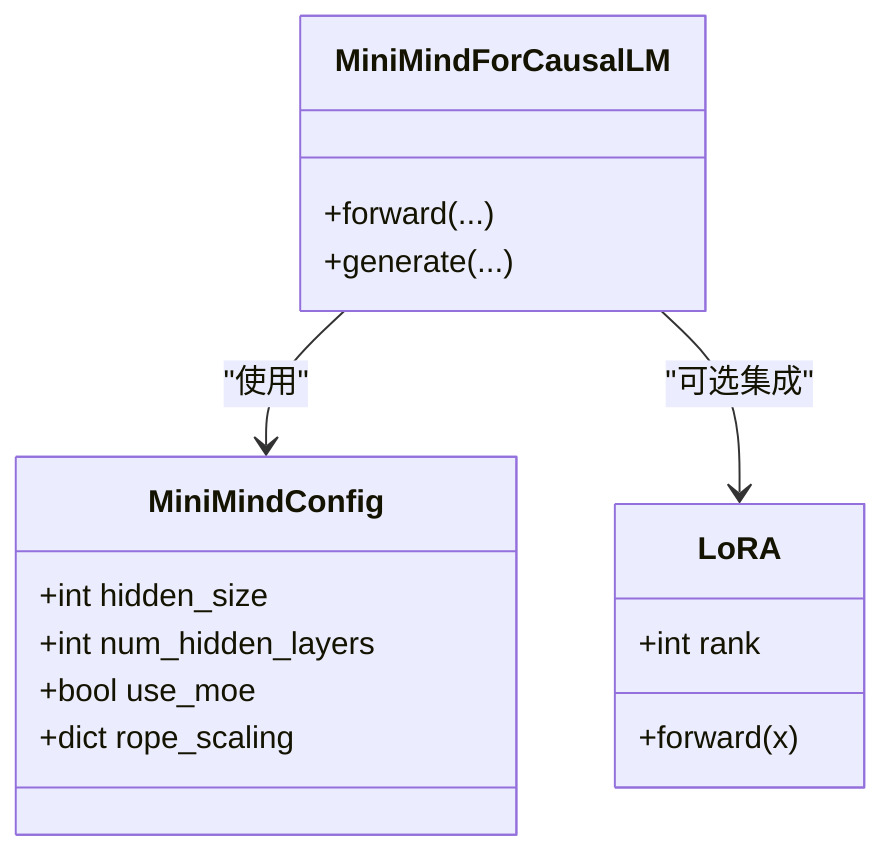
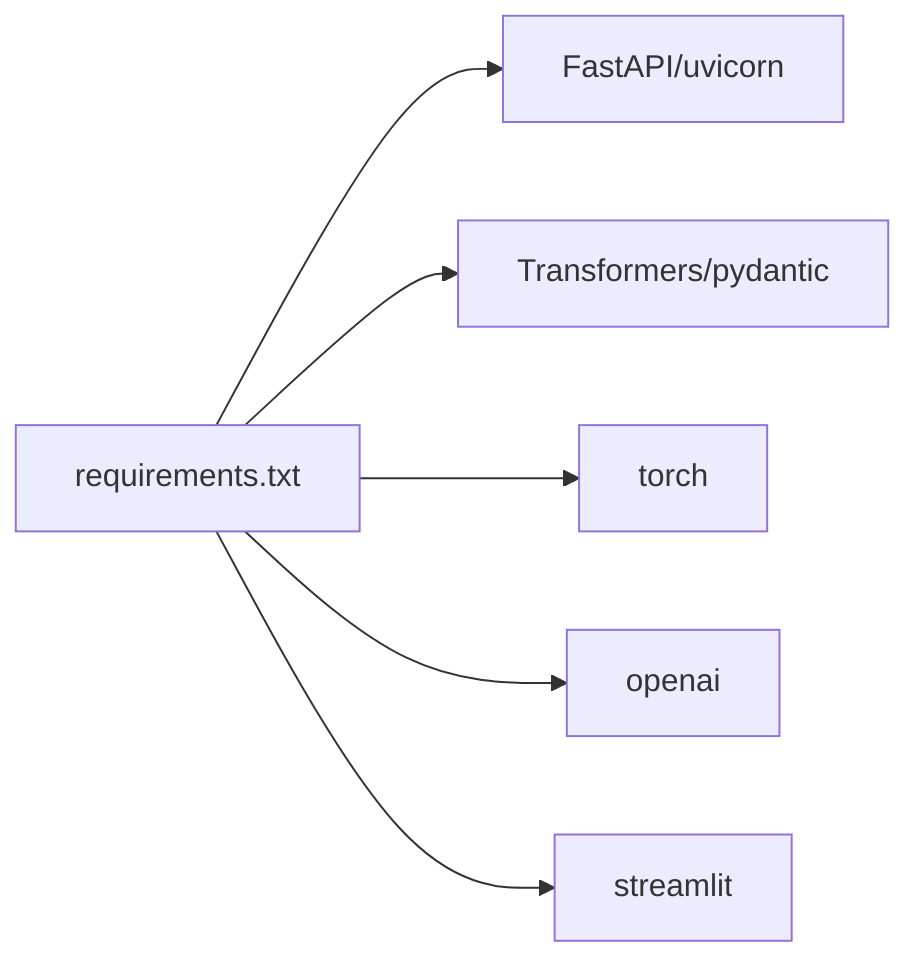

# 推理服务工具

<cite>
**本文引用的文件**
- [serve_openai_api.py](file://scripts/serve_openai_api.py)
- [chat_openai_api.py](file://scripts/chat_openai_api.py)
- [web_demo.py](file://scripts/web_demo.py)
- [requirements.txt](file://requirements.txt)
- [model_minimind.py](file://model/model_minimind.py)
- [model_lora.py](file://model/model_lora.py)
- [convert_model.py](file://scripts/convert_model.py)
- [README.md](file://README.md)
- [config.json](file://MiniMind2/config.json)
- [generation_config.json](file://MiniMind2/generation_config.json)
- [tokenizer_config.json](file://model/tokenizer_config.json)
</cite>

## 目录
1. [简介](#简介)
2. [项目结构](#项目结构)
3. [核心组件](#核心组件)
4. [架构总览](#架构总览)
5. [详细组件分析](#详细组件分析)
6. [依赖分析](#依赖分析)
7. [性能考量](#性能考量)
8. [故障排查指南](#故障排查指南)
9. [结论](#结论)
10. [附录](#附录)

## 简介
本文件面向MiniMind项目的推理服务工具，系统化阐述以下内容：
- OpenAI API兼容服务的实现：基于FastAPI的HTTP接口设计、请求/响应格式、流式SSE输出、模型加载与推理管线。
- 聊天API服务的WebSocket实现：实时通信协议、消息处理逻辑与前端集成。
- Streamlit Web界面：UI组件设计、交互逻辑、主题定制与本地/远程模型切换。
- 启动配置：端口、环境变量、模型参数与LoRA权重加载。
- 服务监控、日志记录、错误处理与性能优化建议。

## 项目结构
本项目围绕“脚本服务 + 模型定义 + 配置文件”组织，核心推理服务位于scripts目录，模型结构与LoRA实现位于model目录，Web界面位于scripts/web_demo.py，依赖声明在requirements.txt。

**图表来源**
- [serve_openai_api.py:1-178](file://scripts/serve_openai_api.py#L1-L178)
- [web_demo.py:1-329](file://scripts/web_demo.py#L1-L329)
- [model_minimind.py:1-474](file://model/model_minimind.py#L1-L474)
- [model_lora.py:1-50](file://model/model_lora.py#L1-L50)
- [convert_model.py:1-76](file://scripts/convert_model.py#L1-L76)
- [requirements.txt:1-31](file://requirements.txt#L1-L31)

**章节来源**
- [README.md:208-288](file://README.md#L208-L288)
- [requirements.txt:1-31](file://requirements.txt#L1-L31)

## 核心组件
- OpenAI兼容服务（FastAPI）
  - 路由：/v1/chat/completions
  - 支持：非流式与SSE流式两种模式
  - 输入：messages、temperature、top_p、max_tokens、stream等
  - 输出：OpenAI兼容的JSON或SSE数据流
- 聊天客户端（OpenAI SDK）
  - 本地命令行交互，支持历史对话截断与流式打印
- Streamlit Web Demo
  - 本地/远程模型切换、参数调节、流式显示与Markdown渲染
- 模型与LoRA
  - 自定义MiniMind模型结构、RMSNorm、RoPE、注意力与MoE
  - LoRA低秩适配与加载
- 模型转换
  - Torch权重转Transformers格式、Llama兼容映射

**章节来源**
- [serve_openai_api.py:49-160](file://scripts/serve_openai_api.py#L49-L160)
- [chat_openai_api.py:1-31](file://scripts/chat_openai_api.py#L1-L31)
- [web_demo.py:154-329](file://scripts/web_demo.py#L154-L329)
- [model_minimind.py:8-78](file://model/model_minimind.py#L8-L78)
- [model_lora.py:21-50](file://model/model_lora.py#L21-L50)
- [convert_model.py:14-55](file://scripts/convert_model.py#L14-L55)

## 架构总览
OpenAI兼容服务与Streamlit前端通过HTTP/HTTPS与SSE交互，模型推理由Transformers与自定义MiniMind实现支撑。LoRA权重可按需加载，模型可转换为Transformers/Llama格式以适配第三方生态。

**图表来源**
- [serve_openai_api.py:113-159](file://scripts/serve_openai_api.py#L113-L159)
- [model_minimind.py:441-474](file://model/model_minimind.py#L441-L474)
- [model_lora.py:21-50](file://model/model_lora.py#L21-L50)

## 详细组件分析

### OpenAI兼容服务（FastAPI）
- 接口设计
  - 路由：POST /v1/chat/completions
  - 请求体：ChatRequest（model、messages、temperature、top_p、max_tokens、stream、tools）
  - 响应：非流式返回完整JSON；流式返回text/event-stream
- 推理管线
  - 非流式：apply_chat_template + generate + decode
  - 流式：TextStreamer + 自定义CustomStreamer + Queue + SSE
- 模型加载
  - 支持transformers格式与原生torch权重
  - 可选MoE与LoRA权重加载
- 端口与运行
  - 默认监听0.0.0.0:8998

**图表来源**
- [serve_openai_api.py:113-159](file://scripts/serve_openai_api.py#L113-L159)
- [serve_openai_api.py:71-111](file://scripts/serve_openai_api.py#L71-L111)

**章节来源**
- [serve_openai_api.py:49-160](file://scripts/serve_openai_api.py#L49-L160)

### 聊天API服务的WebSocket实现
- 当前实现
  - 项目未提供WebSocket服务端实现
  - Streamlit前端通过OpenAI SDK对接HTTP服务，实现近似实时的流式显示
- 可扩展建议
  - 若需原生WebSocket，可在FastAPI中引入WebSocket路由，复用现有生成管线与分词器
  - 注意：WebSocket需处理连接管理、心跳、断线重连与并发控制

[本图为概念性流程图，不直接映射具体源码文件]

### Streamlit Web界面
- 功能要点
  - 侧边栏：历史对话轮数、最大生成长度、温度、模型来源切换（本地/远程）
  - 远程模型：可配置API URL、模型ID、API Key
  - 本地模型：加载Transformers格式权重，支持TextIteratorStreamer
  - Markdown渲染：支持<think>标签包裹的推理内容折叠/展开
- 交互逻辑
  - 用户输入 → 组装messages → 调用OpenAI SDK或本地generate → 流式渲染回答
  - 支持删除/重生成/清空对话

**图表来源**
- [web_demo.py:251-277](file://scripts/web_demo.py#L251-L277)
- [serve_openai_api.py:113-125](file://scripts/serve_openai_api.py#L113-L125)

**章节来源**
- [web_demo.py:154-329](file://scripts/web_demo.py#L154-L329)

### 模型与LoRA
- 模型结构
  - RMSNorm、RoPE、Attention（含KV缓存与Flash Attention）、FeedForward/MoE
  - GenerationMixin集成，支持generate与past_key_values
- LoRA适配
  - 为线性层注入低秩矩阵A/B，训练时冻结主权重，仅训练LoRA参数
  - 支持加载/保存LoRA权重

**图表来源**
- [model_minimind.py:8-78](file://model/model_minimind.py#L8-L78)
- [model_minimind.py:441-474](file://model/model_minimind.py#L441-L474)
- [model_lora.py:6-18](file://model/model_lora.py#L6-L18)

**章节来源**
- [model_minimind.py:80-474](file://model/model_minimind.py#L80-L474)
- [model_lora.py:21-50](file://model/model_lora.py#L21-L50)

### 模型转换
- Torch权重转Transformers/Llama格式
  - 注册AutoClass、复制权重、保存模型与分词器
- 适配第三方生态（vLLM/ollama等）

**章节来源**
- [convert_model.py:14-55](file://scripts/convert_model.py#L14-L55)

## 依赖分析
- 核心依赖
  - FastAPI、uvicorn：HTTP服务与ASGI运行
  - Transformers、Pydantic：模型加载与请求校验
  - torch、accelerate：推理与设备管理
  - openai：OpenAI SDK（客户端）
  - streamlit：Web界面
- 版本与兼容性
  - README中提供requirements.txt与安装指引
  - README说明兼容llama.cpp、vLLM、ollama等生态

**图表来源**
- [requirements.txt:1-31](file://requirements.txt#L1-L31)
- [README.md:233-235](file://README.md#L233-L235)

**章节来源**
- [requirements.txt:1-31](file://requirements.txt#L1-L31)
- [README.md:233-235](file://README.md#L233-L235)

## 性能考量
- 推理优化
  - 使用Flash Attention与KV缓存，减少注意力计算与显存占用
  - RoPE外推（YaRN）提升长序列推理能力
  - MoE与LoRA在保持效果的同时降低参数与显存
- 服务优化
  - SSE流式输出降低首字延迟，提升交互体验
  - 合理设置max_tokens与temperature，平衡生成质量与时延
- 硬件与设备
  - 优先使用CUDA设备；必要时启用半精度（模型保存与转换时可float16）

[本节为通用性能建议，不直接分析具体源码文件]

## 故障排查指南
- 常见问题
  - 端口占用：确认端口8998未被占用，或在启动时修改host/port
  - 设备不可用：检查CUDA是否可用，或切换CPU
  - 分词器不匹配：确保使用项目提供的tokenizer与chat_template
  - LoRA加载失败：核对LoRA权重路径与rank一致性
- 错误处理
  - FastAPI路由捕获异常并返回HTTP 500
  - SSE流中异常以JSON形式返回error字段
- 日志与监控
  - 建议在生产环境接入日志系统（如Python logging + 文件/远程日志）
  - 对关键路径（加载模型、生成、SSE）打点统计

**章节来源**
- [serve_openai_api.py:158-159](file://scripts/serve_openai_api.py#L158-L159)
- [serve_openai_api.py:109-110](file://scripts/serve_openai_api.py#L109-L110)

## 结论
MiniMind推理服务工具以OpenAI兼容接口为核心，结合FastAPI与Transformers生态，提供高性能、可扩展的推理能力。Streamlit前端与OpenAI SDK协同，实现简洁直观的交互体验。通过LoRA与MoE等技术，兼顾效果与效率；通过SSE流式输出与RoPE外推，优化实时性与长序列处理。建议在生产环境中完善日志与监控体系，并根据硬件条件合理配置参数与精度。

[本节为总结性内容，不直接分析具体源码文件]

## 附录

### 启动与配置
- 启动OpenAI兼容服务
  - 运行：python scripts/serve_openai_api.py
  - 默认监听：0.0.0.0:8998
  - 关键参数：--load_from、--weight、--hidden_size、--num_hidden_layers、--max_seq_len、--use_moe、--inference_rope_scaling、--device
- 启动Streamlit Web界面
  - 运行：streamlit run scripts/web_demo.py
  - 可在侧边栏配置模型来源、API参数与生成参数
- 命令行聊天客户端
  - 运行：python scripts/chat_openai_api.py
  - 交互式输入与流式输出

**章节来源**
- [serve_openai_api.py:162-178](file://scripts/serve_openai_api.py#L162-L178)
- [web_demo.py:252-277](file://scripts/web_demo.py#L252-L277)
- [README.md:252-258](file://README.md#L252-L258)

### 请求/响应格式（OpenAI兼容）
- 请求体（POST /v1/chat/completions）
  - 字段：model、messages、temperature、top_p、max_tokens、stream、tools
- 非流式响应
  - 字段：id、object、created、model、choices（含message与finish_reason）
- 流式响应（SSE）
  - 每个data行包含delta.content，结束时返回finish_reason

**章节来源**
- [serve_openai_api.py:49-57](file://scripts/serve_openai_api.py#L49-L57)
- [serve_openai_api.py:145-157](file://scripts/serve_openai_api.py#L145-L157)
- [serve_openai_api.py:117-125](file://scripts/serve_openai_api.py#L117-L125)

### 配置文件与分词器
- 模型配置（MiniMind2）
  - config.json：架构、注意力头数、隐藏维度、RoPE参数等
  - generation_config.json：生成相关默认值
- 分词器配置
  - tokenizer_config.json：chat_template、特殊token、最大长度等

**章节来源**
- [config.json:1-33](file://MiniMind2/config.json#L1-L33)
- [generation_config.json:1-10](file://MiniMind2/generation_config.json#L1-L10)
- [tokenizer_config.json:31-43](file://model/tokenizer_config.json#L31-L43)