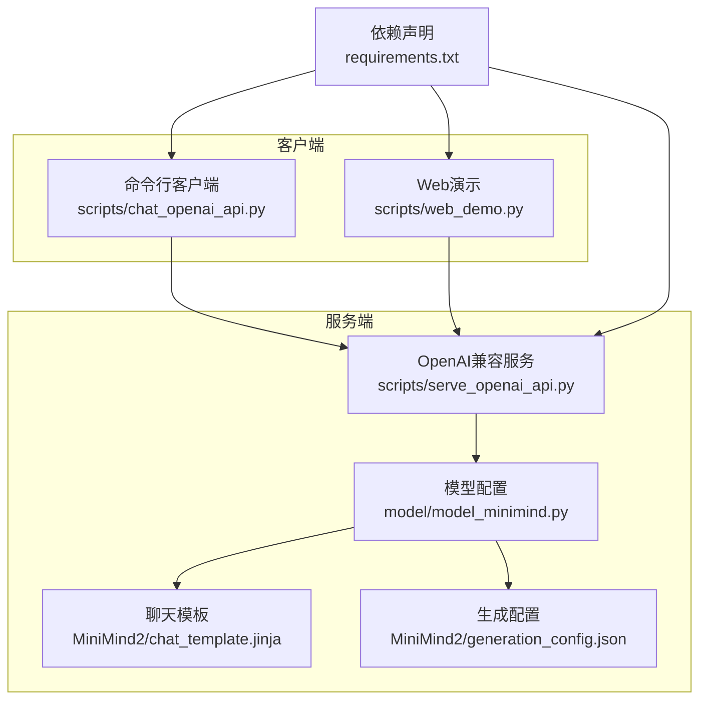
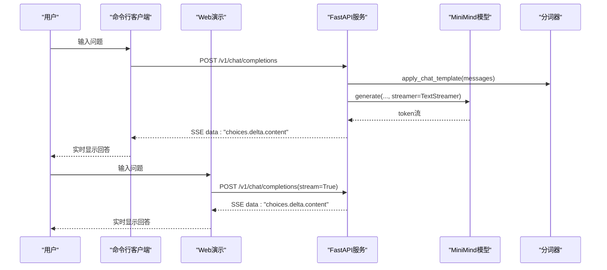
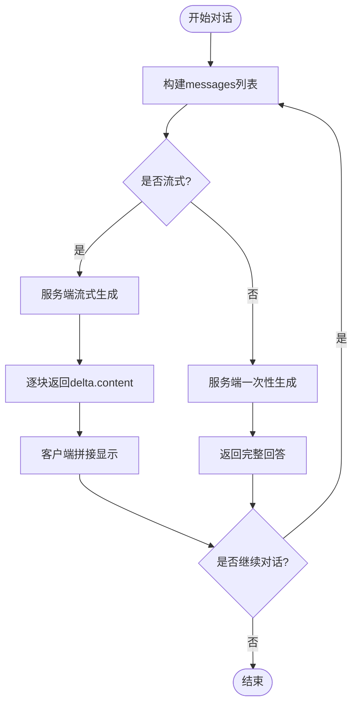
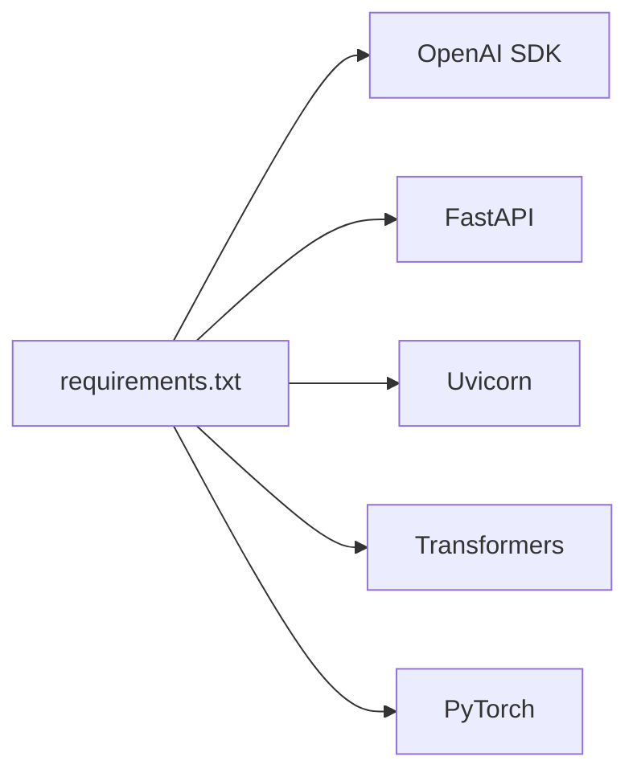

# 聊天API客户端

<cite>
**本文引用的文件**
- [scripts/chat_openai_api.py](file://scripts/chat_openai_api.py)
- [scripts/serve_openai_api.py](file://scripts/serve_openai_api.py)
- [scripts/web_demo.py](file://scripts/web_demo.py)
- [requirements.txt](file://requirements.txt)
- [README.md](file://README.md)
- [model/model_minimind.py](file://model/model_minimind.py)
- [MiniMind2/chat_template.jinja](file://MiniMind2/chat_template.jinja)
- [MiniMind2/generation_config.json](file://MiniMind2/generation_config.json)
</cite>

## 目录
1. [简介](#简介)
2. [项目结构](#项目结构)
3. [核心组件](#核心组件)
4. [架构总览](#架构总览)
5. [详细组件分析](#详细组件分析)
6. [依赖分析](#依赖分析)
7. [性能考量](#性能考量)
8. [故障排查指南](#故障排查指南)
9. [结论](#结论)
10. [附录](#附录)

## 简介
本文件为“聊天API客户端”的综合使用文档，围绕命令行参数、连接建立、消息格式、流式输出、对话交互流程、配置项影响与排障优化等方面进行系统阐述。客户端兼容OpenAI风格的API，既可作为命令行脚本直接使用，也可通过Web界面进行交互；服务端基于FastAPI提供OpenAI兼容的/v1/chat/completions接口，支持同步与流式两种响应模式。

## 项目结构
与聊天API客户端直接相关的文件主要集中在scripts目录与模型配置目录中：
- 服务端脚本：scripts/serve_openai_api.py
- 客户端脚本：scripts/chat_openai_api.py
- Web演示：scripts/web_demo.py
- 模型与分词模板：model/model_minimind.py、MiniMind2/chat_template.jinja、MiniMind2/generation_config.json
- 依赖声明：requirements.txt
- 项目说明：README.md

图表来源
- [scripts/serve_openai_api.py:162-177](file://scripts/serve_openai_api.py#L162-L177)
- [scripts/chat_openai_api.py:1-31](file://scripts/chat_openai_api.py#L1-L31)
- [scripts/web_demo.py:251-277](file://scripts/web_demo.py#L251-L277)
- [model/model_minimind.py:1-200](file://model/model_minimind.py#L1-L200)
- [MiniMind2/chat_template.jinja:23-74](file://MiniMind2/chat_template.jinja#L23-L74)
- [MiniMind2/generation_config.json:1-10](file://MiniMind2/generation_config.json#L1-L10)
- [requirements.txt:1-31](file://requirements.txt#L1-L31)

章节来源
- [scripts/serve_openai_api.py:162-177](file://scripts/serve_openai_api.py#L162-L177)
- [scripts/chat_openai_api.py:1-31](file://scripts/chat_openai_api.py#L1-L31)
- [scripts/web_demo.py:251-277](file://scripts/web_demo.py#L251-L277)
- [requirements.txt:1-31](file://requirements.txt#L1-L31)

## 核心组件
- 服务端FastAPI应用：提供/v1/chat/completions端点，支持同步与SSE流式返回。
- 客户端OpenAI SDK：命令行脚本与Web界面均通过OpenAI兼容的SDK发起请求。
- 模型与分词器：基于transformers加载MiniMind模型与分词器，使用chat_template进行消息格式化。
- 生成配置：控制EOS、缓存等行为，影响生成稳定性与性能。

章节来源
- [scripts/serve_openai_api.py:113-159](file://scripts/serve_openai_api.py#L113-L159)
- [scripts/chat_openai_api.py:1-31](file://scripts/chat_openai_api.py#L1-L31)
- [scripts/web_demo.py:251-277](file://scripts/web_demo.py#L251-L277)
- [model/model_minimind.py:1-200](file://model/model_minimind.py#L1-L200)
- [MiniMind2/generation_config.json:1-10](file://MiniMind2/generation_config.json#L1-L10)

## 架构总览
OpenAI兼容服务端采用FastAPI + Uvicorn，模型推理通过transformers加载MiniMind，使用TextStreamer实现流式输出。客户端通过OpenAI SDK向/v1/chat/completions发起请求，支持同步与SSE流式两种模式。

图表来源
- [scripts/serve_openai_api.py:113-125](file://scripts/serve_openai_api.py#L113-L125)
- [scripts/serve_openai_api.py:71-111](file://scripts/serve_openai_api.py#L71-L111)
- [scripts/chat_openai_api.py:14-29](file://scripts/chat_openai_api.py#L14-L29)
- [scripts/web_demo.py:262-272](file://scripts/web_demo.py#L262-L272)

## 详细组件分析

### 命令行参数与配置
- 服务端参数（--load_from、--save_dir、--weight、--lora_weight、--hidden_size、--num_hidden_layers、--max_seq_len、--use_moe、--inference_rope_scaling、--device）
  - 作用：选择模型权重来源、LoRA权重、模型尺寸与层数、最大序列长度、是否使用MoE、是否启用RoPE外推、运行设备。
  - 示例：启动服务端监听0.0.0.0:8998，加载transformers格式模型。
- 客户端参数（--host、--port、--model）
  - 说明：命令行脚本未直接解析host/port/model参数，而是通过OpenAI SDK的base_url与model参数进行配置。
  - 建议：在脚本中显式设置base_url与model，或在Web界面中配置API URL与模型ID。

章节来源
- [scripts/serve_openai_api.py:162-177](file://scripts/serve_openai_api.py#L162-L177)
- [scripts/chat_openai_api.py:3-6](file://scripts/chat_openai_api.py#L3-L6)
- [scripts/web_demo.py:164-168](file://scripts/web_demo.py#L164-L168)

### 连接建立与握手
- 客户端通过OpenAI SDK初始化，设置base_url与api_key，随后调用chat.completions.create发起请求。
- 服务端FastAPI路由/v1/chat/completions接收请求，解析请求体（messages、temperature、top_p、max_tokens、stream等）。
- 同步模式：服务端生成完成后一次性返回choices。
- 流式模式：服务端通过StreamingResponse以SSE格式逐块返回delta内容。

章节来源
- [scripts/chat_openai_api.py:3-6](file://scripts/chat_openai_api.py#L3-L6)
- [scripts/serve_openai_api.py:113-159](file://scripts/serve_openai_api.py#L113-L159)

### 消息格式规范
- 请求体字段：model、messages、temperature、top_p、max_tokens、stream、tools等。
- messages格式：由OpenAI兼容的chat_template进行格式化，支持system/user/assistant/tool等角色。
- 响应体字段：choices[].delta.content（流式）、choices[].message.content（同步）。

章节来源
- [scripts/serve_openai_api.py:49-57](file://scripts/serve_openai_api.py#L49-L57)
- [MiniMind2/chat_template.jinja:23-74](file://MiniMind2/chat_template.jinja#L23-L74)

### 心跳检测机制
- 当前实现未包含WebSocket握手与心跳检测逻辑；服务端为HTTP服务，使用SSE进行流式传输。
- 若需WebSocket支持，可在服务端引入WebSocket路由并在客户端侧实现心跳保活。

章节来源
- [scripts/serve_openai_api.py:113-125](file://scripts/serve_openai_api.py#L113-L125)

### 对话交互流程
- 历史对话管理：客户端可维护conversation_history，按轮数截断传入服务端。
- 同步对话：服务端一次性生成并返回完整答案。
- 流式对话：服务端逐token返回，客户端实时拼接并显示。

图表来源
- [scripts/chat_openai_api.py:10-31](file://scripts/chat_openai_api.py#L10-L31)
- [scripts/serve_openai_api.py:113-159](file://scripts/serve_openai_api.py#L113-L159)

章节来源
- [scripts/chat_openai_api.py:10-31](file://scripts/chat_openai_api.py#L10-L31)
- [scripts/serve_openai_api.py:113-159](file://scripts/serve_openai_api.py#L113-L159)

### 配置项对对话质量的影响
- 温度（temperature）：控制采样随机性，数值越高越发散，越低越稳定。
- Top-p（核采样阈值）：控制概率质量窗口，影响多样性与稳定性。
- 最大令牌数（max_tokens）：限制生成长度，避免过长输出。
- RoPE外推（inference_rope_scaling）：提升长序列外推能力，适合长对话场景。
- MoE开关（use_moe）：在同等参数规模下提升容量，但推理成本上升。

章节来源
- [scripts/serve_openai_api.py:49-57](file://scripts/serve_openai_api.py#L49-L57)
- [scripts/serve_openai_api.py:168-172](file://scripts/serve_openai_api.py#L168-L172)
- [model/model_minimind.py:57-64](file://model/model_minimind.py#L57-L64)

### 使用示例
- 基本问答（命令行）
  - 启动服务端：python scripts/serve_openai_api.py
  - 运行客户端：python scripts/chat_openai_api.py
  - 在客户端输入问题，查看流式回答。
- 多轮对话
  - 客户端维护conversation_history，按轮数截断传入服务端，实现上下文延续。
- 错误处理
  - 服务端捕获异常并返回HTTP 500；客户端可捕获异常并提示。

章节来源
- [scripts/serve_openai_api.py:162-177](file://scripts/serve_openai_api.py#L162-L177)
- [scripts/chat_openai_api.py:10-31](file://scripts/chat_openai_api.py#L10-L31)
- [scripts/web_demo.py:274-276](file://scripts/web_demo.py#L274-L276)

## 依赖分析
- Python依赖：openai、fastapi、uvicorn、transformers、torch等。
- 依赖安装：pip install -r requirements.txt

图表来源
- [requirements.txt:1-31](file://requirements.txt#L1-L31)

章节来源
- [requirements.txt:1-31](file://requirements.txt#L1-L31)

## 性能考量
- 流式输出：SSE流式传输降低首字延迟，提升交互体验。
- 生成参数：合理设置temperature与top_p，平衡创造性与稳定性。
- 序列长度：max_seq_len与max_tokens共同限制生成范围，避免显存溢出。
- 设备选择：优先使用GPU，确保CUDA可用；必要时切换CPU。
- RoPE外推：启用inference_rope_scaling可提升长文本外推能力。

章节来源
- [scripts/serve_openai_api.py:113-159](file://scripts/serve_openai_api.py#L113-L159)
- [scripts/serve_openai_api.py:168-172](file://scripts/serve_openai_api.py#L168-L172)
- [README.md:223-258](file://README.md#L223-L258)

## 故障排查指南
- 服务端无法启动
  - 检查端口占用与权限；确认CUDA可用；核对模型路径与权重文件是否存在。
- 客户端无法连接
  - 确认base_url与端口正确；检查防火墙与网络策略。
- 生成异常或报错
  - 查看服务端异常捕获与HTTP 500响应；在客户端捕获并打印异常信息。
- 显示异常
  - 确认分词器与模型版本匹配；检查chat_template是否正确应用。

章节来源
- [scripts/serve_openai_api.py:158-159](file://scripts/serve_openai_api.py#L158-L159)
- [scripts/web_demo.py:274-276](file://scripts/web_demo.py#L274-L276)

## 结论
本聊天API客户端以OpenAI兼容协议为基础，结合FastAPI与MiniMind模型，实现了简洁高效的对话交互。通过合理的参数配置与流式输出机制，能够在不同硬件环境下获得良好的交互体验。后续可扩展WebSocket支持与更丰富的工具调用能力，进一步提升实用性与稳定性。

## 附录
- 项目快速开始与更多用法详见README。
- 模型配置与生成配置文件位于model与MiniMind2目录。

章节来源
- [README.md:223-258](file://README.md#L223-L258)
- [MiniMind2/generation_config.json:1-10](file://MiniMind2/generation_config.json#L1-L10)