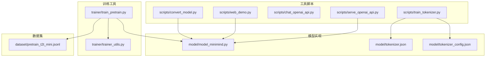
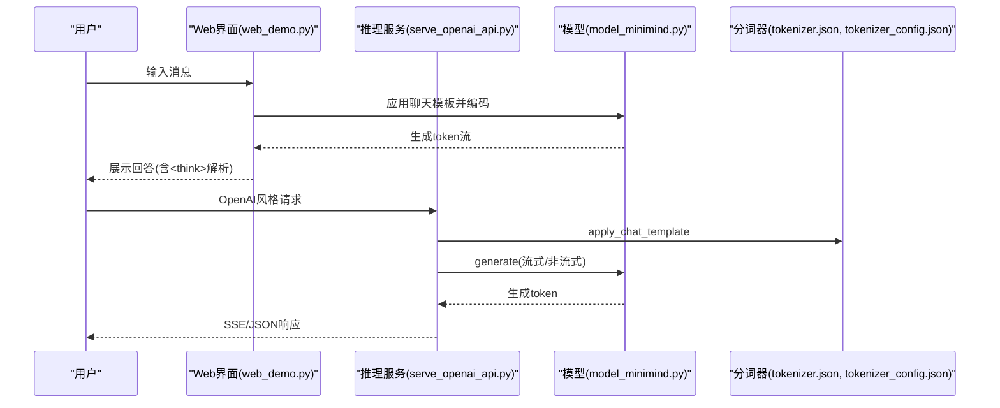
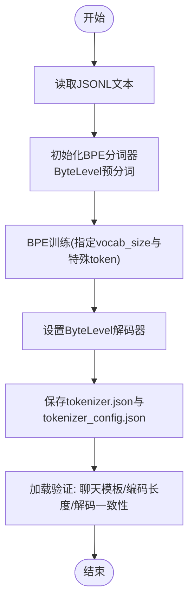
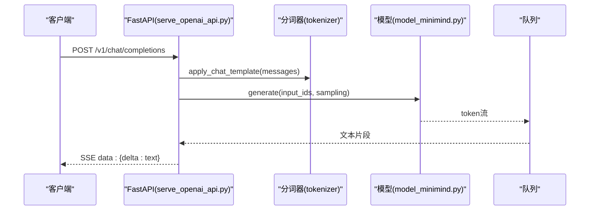
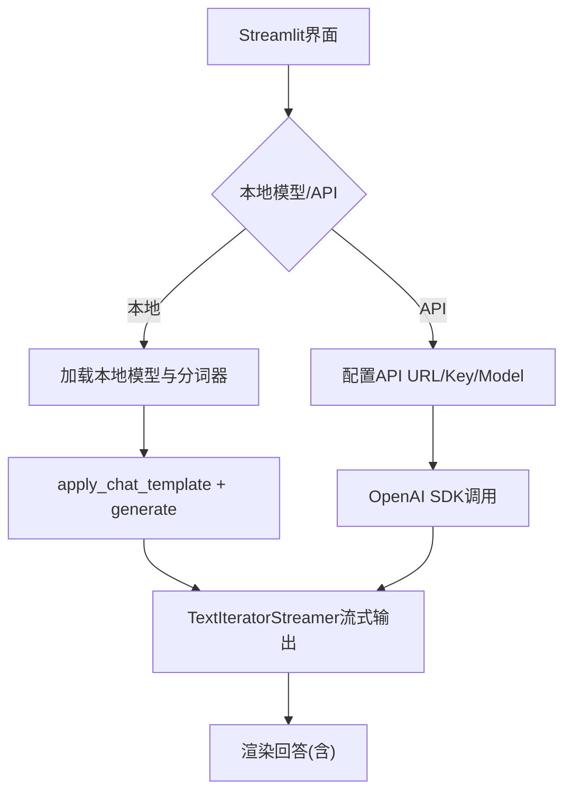
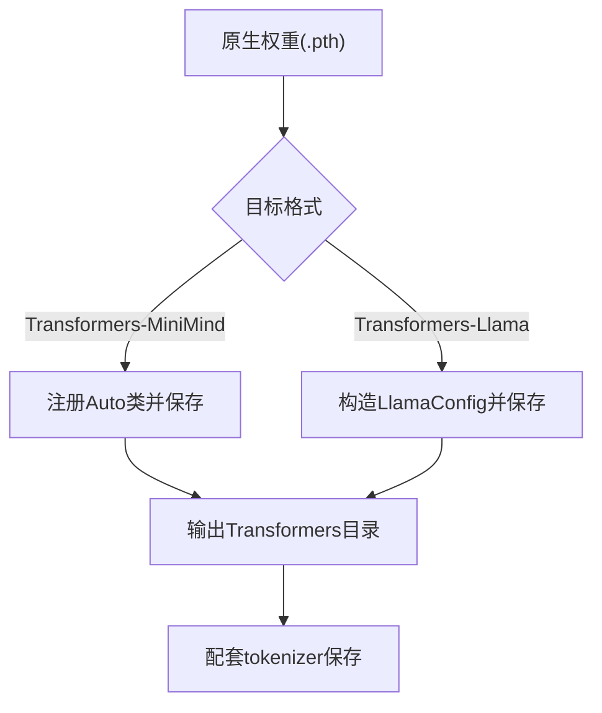
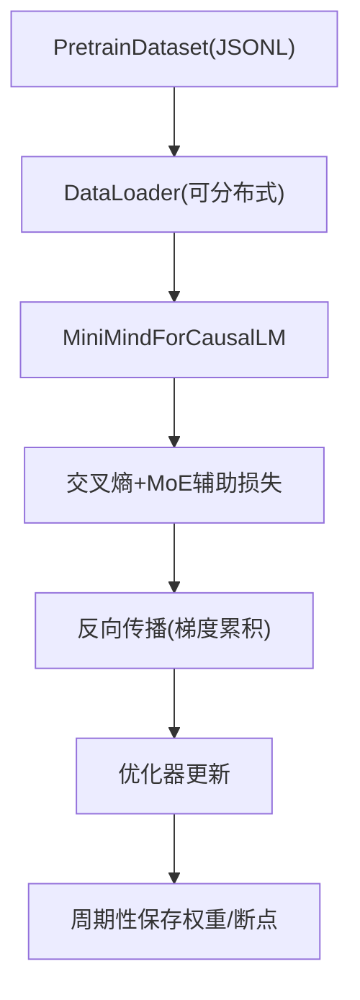
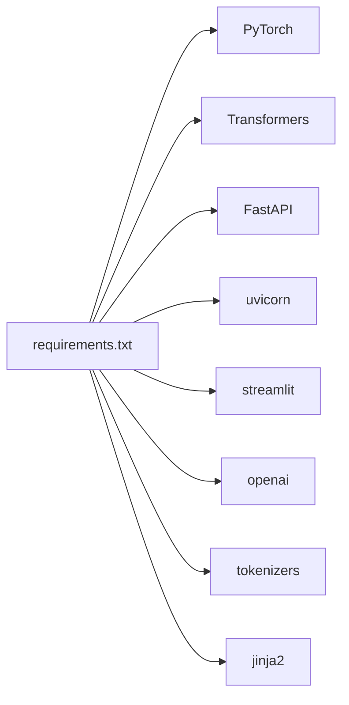

# 数据处理与工具

<cite>
**本文引用的文件**   
- [README.md](file://README.md)
- [requirements.txt](file://requirements.txt)
- [scripts/train_tokenizer.py](file://scripts/train_tokenizer.py)
- [scripts/serve_openai_api.py](file://scripts/serve_openai_api.py)
- [scripts/chat_openai_api.py](file://scripts/chat_openai_api.py)
- [scripts/web_demo.py](file://scripts/web_demo.py)
- [scripts/convert_model.py](file://scripts/convert_model.py)
- [model/model_minimind.py](file://model/model_minimind.py)
- [model/tokenizer.json](file://model/tokenizer.json)
- [model/tokenizer_config.json](file://model/tokenizer_config.json)
- [trainer/trainer_utils.py](file://trainer/trainer_utils.py)
- [trainer/train_pretrain.py](file://trainer/train_pretrain.py)
- [dataset/pretrain_t2t_mini.jsonl](file://dataset/pretrain_t2t_mini.jsonl)
</cite>

## 目录
1. [简介](#简介)
2. [项目结构](#项目结构)
3. [核心组件](#核心组件)
4. [架构总览](#架构总览)
5. [详细组件分析](#详细组件分析)
6. [依赖关系分析](#依赖关系分析)
7. [性能考量](#性能考量)
8. [故障排查指南](#故障排查指南)
9. [结论](#结论)
10. [附录](#附录)

## 简介
本文件聚焦MiniMind项目中的数据处理与工具服务，系统阐述分词器训练原理与实现、推理服务工具链（OpenAI API兼容服务、Web聊天界面、模型转换工具）、数据集格式规范与清洗方法、批量处理脚本与最佳实践，以及性能优化、错误处理与调试技巧，帮助用户高效利用项目提供的工具与服务。

## 项目结构
- 工具脚本位于 scripts/，涵盖分词器训练、推理服务、Web演示、模型转换等。
- 模型实现位于 model/，包含MiniMind配置与模型主体、分词器配置与词表。
- 训练工具位于 trainer/，包含训练通用工具与预训练脚本。
- 数据集位于 dataset/，提供预训练与SFT等数据格式示例。
- 顶层文档与依赖清单位于根目录。

**图表来源**
- [scripts/train_tokenizer.py:1-148](file://scripts/train_tokenizer.py#L1-L148)
- [scripts/serve_openai_api.py:1-178](file://scripts/serve_openai_api.py#L1-L178)
- [scripts/web_demo.py:1-329](file://scripts/web_demo.py#L1-L329)
- [scripts/convert_model.py:1-76](file://scripts/convert_model.py#L1-L76)
- [model/model_minimind.py:1-474](file://model/model_minimind.py#L1-L474)
- [model/tokenizer.json:1-800](file://model/tokenizer.json#L1-L800)
- [model/tokenizer_config.json:1-43](file://model/tokenizer_config.json#L1-L43)
- [trainer/trainer_utils.py:1-139](file://trainer/trainer_utils.py#L1-L139)
- [trainer/train_pretrain.py:1-162](file://trainer/train_pretrain.py#L1-L162)
- [dataset/pretrain_t2t_mini.jsonl](file://dataset/pretrain_t2t_mini.jsonl)

**章节来源**
- [README.md:208-740](file://README.md#L208-L740)

## 核心组件
- 分词器训练：基于BPE算法，自定义词表大小与特殊token，输出tokenizer.json与tokenizer_config.json。
- 推理服务：OpenAI API兼容服务，支持流式与非流式响应，集成聊天模板与工具调用标记。
- Web聊天界面：Streamlit实现的本地或API双模式聊天界面，支持历史对话、温度与长度调节。
- 模型转换：将原生权重转换为Transformers格式或Llama兼容格式，便于第三方生态使用。
- 训练工具：分布式训练、断点续训、混合精度、学习率调度、检查点管理等。
- 数据集规范：预训练与SFT数据格式，统一为JSONL，便于批量处理与清洗。

**章节来源**
- [scripts/train_tokenizer.py:15-110](file://scripts/train_tokenizer.py#L15-L110)
- [scripts/serve_openai_api.py:49-177](file://scripts/serve_openai_api.py#L49-L177)
- [scripts/web_demo.py:98-329](file://scripts/web_demo.py#L98-L329)
- [scripts/convert_model.py:14-76](file://scripts/convert_model.py#L14-L76)
- [trainer/trainer_utils.py:19-139](file://trainer/trainer_utils.py#L19-L139)
- [trainer/train_pretrain.py:23-162](file://trainer/train_pretrain.py#L23-L162)
- [README.md:425-606](file://README.md#L425-L606)

## 架构总览
MiniMind的数据处理与工具链围绕“数据-分词-模型-服务”闭环展开。数据集经清洗与格式化后进入训练流程；分词器训练产出词表与配置；模型训练完成后通过OpenAI API服务或Web界面提供推理能力；模型转换工具打通第三方生态。

**图表来源**
- [scripts/web_demo.py:251-315](file://scripts/web_demo.py#L251-L315)
- [scripts/serve_openai_api.py:71-159](file://scripts/serve_openai_api.py#L71-L159)
- [model/model_minimind.py:441-474](file://model/model_minimind.py#L441-L474)
- [model/tokenizer_config.json:31-33](file://model/tokenizer_config.json#L31-L33)

## 详细组件分析

### 分词器训练（BPE）
- 自定义词表：词表大小、特殊token（起始/结束/填充）与聊天模板集成。
- 训练流程：从JSONL读取文本，ByteLevel预分词，BPE训练，保存模型与配置。
- 评估：应用聊天模板、编码长度、解码一致性验证。

**图表来源**
- [scripts/train_tokenizer.py:15-110](file://scripts/train_tokenizer.py#L15-L110)
- [model/tokenizer.json:1-800](file://model/tokenizer.json#L1-L800)
- [model/tokenizer_config.json:1-43](file://model/tokenizer_config.json#L1-L43)

**章节来源**
- [scripts/train_tokenizer.py:15-110](file://scripts/train_tokenizer.py#L15-L110)
- [model/tokenizer.json:1-800](file://model/tokenizer.json#L1-L800)
- [model/tokenizer_config.json:1-43](file://model/tokenizer_config.json#L1-L43)

### 推理服务工具（OpenAI API兼容）
- FastAPI服务：/v1/chat/completions，支持流式SSE与非流式响应。
- 参数：temperature、top_p、max_tokens、tools、stream等。
- 生成：TextStreamer队列驱动的流式输出，异常捕获与HTTP异常返回。
- 集成：支持原生权重与Transformers格式，LoRA权重加载。

**图表来源**
- [scripts/serve_openai_api.py:49-159](file://scripts/serve_openai_api.py#L49-L159)
- [model/model_minimind.py:441-474](file://model/model_minimind.py#L441-L474)

**章节来源**
- [scripts/serve_openai_api.py:49-177](file://scripts/serve_openai_api.py#L49-L177)

### Web聊天界面（Streamlit）
- 双模式：本地模型或API模式，支持R1推理内容的折叠展示。
- 功能：历史对话轮数、最大生成长度、温度调节、删除/重新生成。
- 生成：TextIteratorStreamer流式显示，异常提示。

**图表来源**
- [scripts/web_demo.py:98-329](file://scripts/web_demo.py#L98-L329)
- [model/tokenizer_config.json:31-33](file://model/tokenizer_config.json#L31-L33)

**章节来源**
- [scripts/web_demo.py:98-329](file://scripts/web_demo.py#L98-L329)

### 模型转换工具
- 原生→Transformers：注册Auto类，保存模型与分词器。
- 原生→Llama兼容：按LlamaConfig映射参数，保存为LlamaForCausalLM格式。
- 反向转换：Transformers→PyTorch权重。

**图表来源**
- [scripts/convert_model.py:14-76](file://scripts/convert_model.py#L14-L76)

**章节来源**
- [scripts/convert_model.py:14-76](file://scripts/convert_model.py#L14-L76)

### 训练与数据处理（预训练）
- 训练循环：跨步学习率、混合精度、梯度累积、分布式训练、断点续训。
- 数据集：PretrainDataset读取JSONL，按max_seq_len截断。
- 检查点：定期保存权重与resume检查点，支持GPU数量变化自动调整step。

**图表来源**
- [trainer/train_pretrain.py:23-79](file://trainer/train_pretrain.py#L23-L79)
- [trainer/trainer_utils.py:47-98](file://trainer/trainer_utils.py#L47-L98)

**章节来源**
- [trainer/train_pretrain.py:23-162](file://trainer/train_pretrain.py#L23-L162)
- [trainer/trainer_utils.py:19-139](file://trainer/trainer_utils.py#L19-L139)

## 依赖关系分析
- 运行时依赖：PyTorch、Transformers、FastAPI、uvicorn、streamlit、openai等。
- 训练生态：DDP、混合精度、WandB/SwanLab可视化。
- 分词生态：tokenizers（BPE）、Jinja2聊天模板。

**图表来源**
- [requirements.txt:1-31](file://requirements.txt#L1-L31)

**章节来源**
- [requirements.txt:1-31](file://requirements.txt#L1-L31)

## 性能考量
- 混合精度：bfloat16/float16降低显存占用，提升吞吐。
- 梯度累积：在显存受限时增大有效batch size。
- Flash Attention：PyTorch≥2.0时自动启用，减少注意力计算开销。
- 分布式训练：DDP多卡加速，注意忽略缓冲区参与同步。
- 断点续训：检查点保存与恢复，避免长时间训练中断损失。
- 推理优化：KV缓存、RoPE缩放、流式输出减少等待。

[本节为通用指导，无需列出具体文件来源]

## 故障排查指南
- 服务端口占用：确认端口未被占用，或修改端口。
- CUDA不可用：检查CUDA与驱动版本，或切换CPU设备。
- 分词器不匹配：确保tokenizer.json与tokenizer_config.json配套，且与模型配置一致。
- 模型加载失败：核对权重路径、模型配置与dtype；必要时使用转换工具。
- Web界面空白：检查本地模型路径与权限，或切换API模式并确认URL/Key。
- 训练中断恢复：确认检查点文件存在，GPU数量变化时step会自动转换。

**章节来源**
- [scripts/serve_openai_api.py:162-177](file://scripts/serve_openai_api.py#L162-L177)
- [scripts/web_demo.py:207-329](file://scripts/web_demo.py#L207-L329)
- [trainer/trainer_utils.py:88-97](file://trainer/trainer_utils.py#L88-L97)

## 结论
MiniMind通过自研分词器、OpenAI API兼容服务、Streamlit Web界面与模型转换工具，构建了从数据到推理再到生态对接的完整工具链。结合训练工具与数据集规范，用户可在较低成本与较短时间内完成从零到一的模型训练与部署。

[本节为总结性内容，无需列出具体文件来源]

## 附录

### 数据集格式规范
- 预训练数据：每行一条JSON，字段为text。
- SFT数据：每行一条JSON，字段为conversations（交替的user/assistant/system）。
- RLHF数据：每行一条JSON，字段为chosen与rejected（对话列表）。
- 推荐数据组合：pretrain_hq.jsonl + sft_mini_512.jsonl，快速复现Zero模型。

**章节来源**
- [README.md:466-531](file://README.md#L466-L531)
- [README.md:550-590](file://README.md#L550-L590)

### 数据清洗与批量处理建议
- 统一格式：将多来源数据转换为统一JSONL格式。
- 长度控制：按max_seq_len截断，避免过长序列。
- 去重与过滤：使用SimHash或基于内容的去重策略。
- 批量脚本：使用Python读取JSONL，逐条清洗并写回新文件。

[本节为通用指导，无需列出具体文件来源]

### 常用命令与参数
- 启动OpenAI API服务：指定模型路径、权重前缀、设备与端口。
- 启动Web界面：选择本地模型或API模式，设置历史轮数与生成长度。
- 模型转换：选择原生→Transformers或Llama兼容格式，设置dtype。
- 训练预训练：设置epochs、batch size、学习率、混合精度与分布式参数。

**章节来源**
- [scripts/serve_openai_api.py:162-177](file://scripts/serve_openai_api.py#L162-L177)
- [scripts/web_demo.py:154-182](file://scripts/web_demo.py#L154-L182)
- [scripts/convert_model.py:65-76](file://scripts/convert_model.py#L65-L76)
- [trainer/train_pretrain.py:81-162](file://trainer/train_pretrain.py#L81-L162)