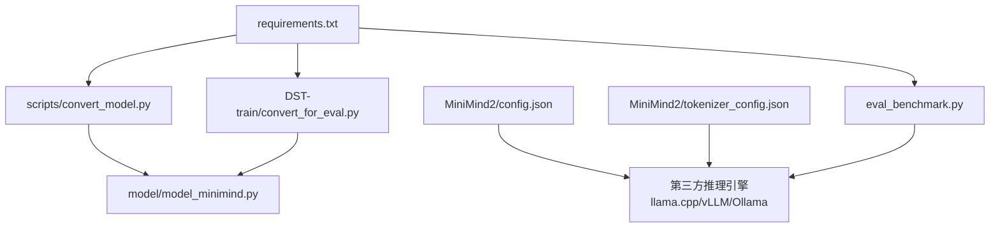
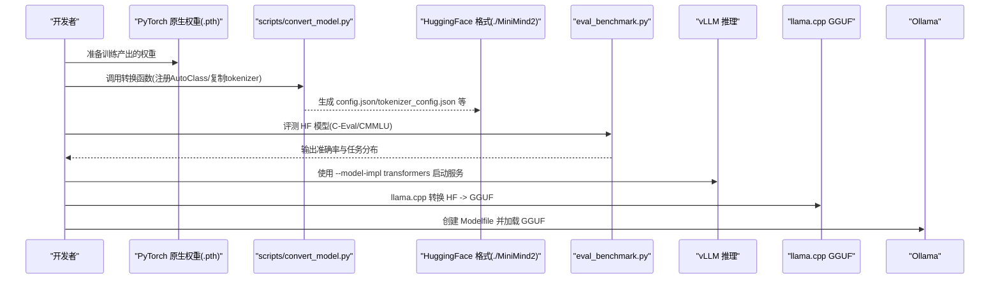
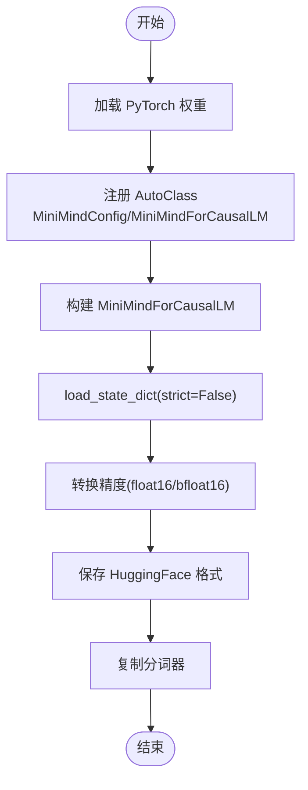
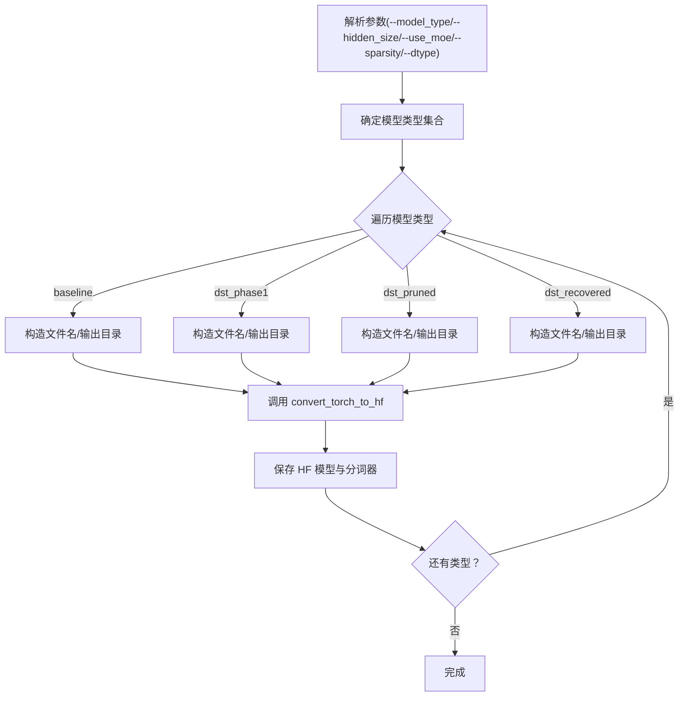
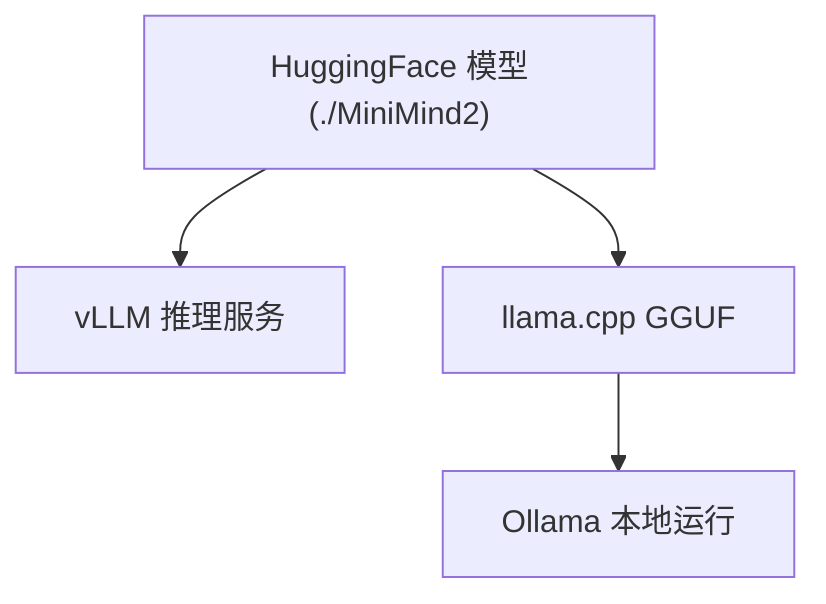
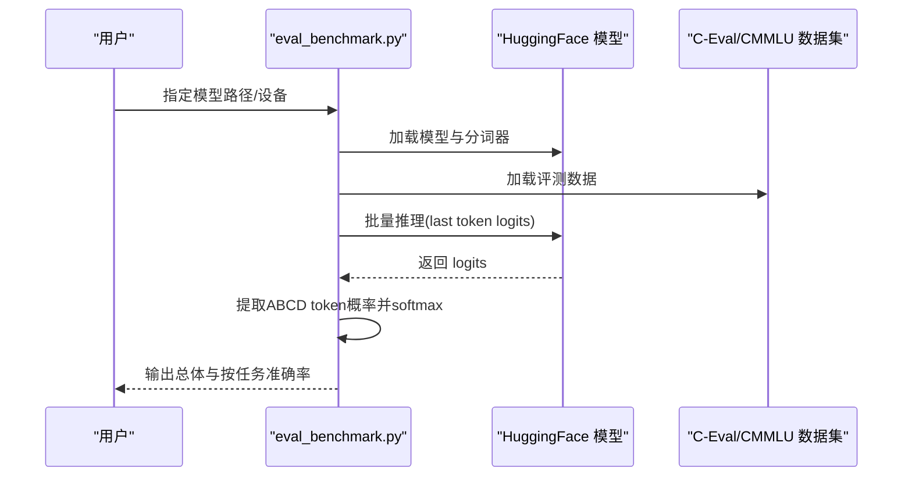
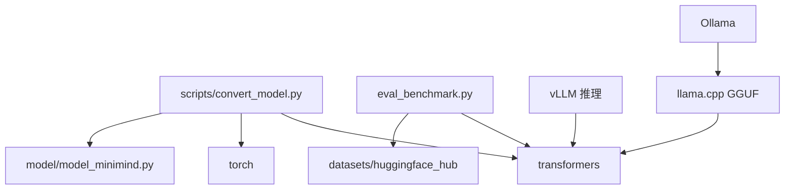

# 模型转换工具

<cite>
**本文引用的文件**
- [scripts/convert_model.py](file://scripts/convert_model.py)
- [model/model_minimind.py](file://model/model_minimind.py)
- [DST-train/convert_for_eval.py](file://DST-train/convert_for_eval.py)
- [eval_benchmark.py](file://eval_benchmark.py)
- [README.md](file://README.md)
- [README_en.md](file://README_en.md)
- [requirements.txt](file://requirements.txt)
- [MiniMind2/config.json](file://MiniMind2/config.json)
- [MiniMind2/tokenizer_config.json](file://MiniMind2/tokenizer_config.json)
</cite>

## 目录
1. [简介](#简介)
2. [项目结构](#项目结构)
3. [核心组件](#核心组件)
4. [架构总览](#架构总览)
5. [详细组件分析](#详细组件分析)
6. [依赖关系分析](#依赖关系分析)
7. [性能考量](#性能考量)
8. [故障排查指南](#故障排查指南)
9. [结论](#结论)
10. [附录](#附录)

## 简介
本文件系统性阐述 MiniMind 项目中的模型转换工具，重点覆盖以下方面：
- 不同框架间权重转换：从 PyTorch 原生权重到 HuggingFace Transformers 格式，再到第三方生态（如 llama.cpp、vLLM、Ollama）的适配与兼容。
- 配置文件适配：如何将 MiniMind 自定义配置映射到 Llama 风格配置，确保第三方推理引擎正确识别与加载。
- 兼容性处理：针对位置编码差异、权重映射与线性层校准等兼容性问题给出策略与验证方法。
- 支持的转换目标格式：Transformers（HuggingFace）、llama.cpp GGUF、vLLM 推理、Ollama 本地运行。
- 转换参数配置：隐藏维度、层数、MoE 开关、精度（float16/bfloat16）等。
- 批量转换脚本：DST 实验与嵌入实验的自动化转换与评测流水线。
- 转换前后对比验证：基于分词器一致性、配置一致性、推理输出稳定性等方法。
- 性能基准与内存占用：结合 C-Eval/CMMLU 基准测试与模型参数量统计，给出评估指标。
- 常见问题排查与优化建议：错误处理策略、精度与显存权衡、第三方工具链集成要点。

## 项目结构
围绕模型转换的核心文件与目录如下：
- 转换脚本
  - scripts/convert_model.py：主转换入口，提供 torch ↔ transformers 互转与 Llama 结构适配。
  - DST-train/convert_for_eval.py：DST 实验的批量转换脚本，支持 baseline/dst_phase1/dst_pruned/dst_recovered 等类型。
- 模型定义
  - model/model_minimind.py：MiniMindConfig 与 MiniMindForCausalLM 的实现，包含 RoPE、注意力、FFN、MoE 等核心组件。
- 第三方生态适配
  - README.md / README_en.md：说明 llama.cpp、vLLM、Ollama 的集成步骤与注意事项。
  - MiniMind2/config.json、tokenizer_config.json：HuggingFace 格式配置示例，展示 Llama 风格配置字段。
- 评测与基准
  - eval_benchmark.py：C-Eval/CMMLU 基准评测脚本，用于转换后模型的对比验证。
- 依赖
  - requirements.txt：转换与推理所需的 Python 包版本约束。

**图表来源**
- [scripts/convert_model.py:1-76](file://scripts/convert_model.py#L1-L76)
- [model/model_minimind.py:1-475](file://model/model_minimind.py#L1-L475)
- [DST-train/convert_for_eval.py:1-154](file://DST-train/convert_for_eval.py#L1-L154)
- [MiniMind2/config.json:1-33](file://MiniMind2/config.json#L1-L33)
- [MiniMind2/tokenizer_config.json:1-18](file://MiniMind2/tokenizer_config.json#L1-L18)
- [eval_benchmark.py:1-200](file://eval_benchmark.py#L1-L200)
- [requirements.txt:1-31](file://requirements.txt#L1-L31)

**章节来源**
- [scripts/convert_model.py:1-76](file://scripts/convert_model.py#L1-L76)
- [model/model_minimind.py:1-475](file://model/model_minimind.py#L1-L475)
- [DST-train/convert_for_eval.py:1-154](file://DST-train/convert_for_eval.py#L1-L154)
- [README.md:1634-1684](file://README.md#L1634-L1684)
- [README_en.md:1615-1722](file://README_en.md#L1615-L1722)
- [MiniMind2/config.json:1-33](file://MiniMind2/config.json#L1-L33)
- [MiniMind2/tokenizer_config.json:1-18](file://MiniMind2/tokenizer_config.json#L1-L18)
- [eval_benchmark.py:1-200](file://eval_benchmark.py#L1-L200)
- [requirements.txt:1-31](file://requirements.txt#L1-L31)

## 核心组件
- torch → transformers 转换
  - 支持将 PyTorch 原生权重加载为 MiniMindForCausalLM，并注册 AutoClass 以便 HuggingFace 自动识别。
  - 自动复制分词器，确保 tokenizer 与模型配置一致。
- transformers → torch 转换
  - 从 HuggingFace 格式加载模型，导出 state_dict 为 .pth。
- Llama 结构适配
  - 将 MiniMind 配置映射为 LlamaConfig，生成 LlamaForCausalLM，便于 vLLM、llama.cpp 等生态识别。
- 批量转换（DST 实验）
  - 支持 baseline/dst_phase1/dst_pruned/dst_recovered 等模型类型的批量转换，自动推断输出目录与文件名。
- 基准评测
  - 通过 eval_benchmark.py 对转换后的模型进行 C-Eval/CMMLU 评测，输出准确率与按任务分类的统计。

**章节来源**
- [scripts/convert_model.py:14-76](file://scripts/convert_model.py#L14-L76)
- [DST-train/convert_for_eval.py:30-83](file://DST-train/convert_for_eval.py#L30-L83)
- [eval_benchmark.py:18-31](file://eval_benchmark.py#L18-L31)

## 架构总览
下图展示了从 PyTorch 原生权重到第三方推理引擎的转换与验证路径：

**图表来源**
- [scripts/convert_model.py:14-76](file://scripts/convert_model.py#L14-L76)
- [eval_benchmark.py:18-31](file://eval_benchmark.py#L18-L31)
- [README_en.md:1615-1722](file://README_en.md#L1615-L1722)

## 详细组件分析

### 组件A：主转换脚本（scripts/convert_model.py）
- 功能要点
  - torch2transformers_minimind：注册 MiniMind AutoClass，加载 state_dict，转换精度，保存为 HuggingFace 格式，并复制分词器。
  - torch2transformers_llama：将 MiniMind 配置映射为 LlamaConfig，生成 LlamaForCausalLM，便于第三方生态识别。
  - transformers2torch：从 HuggingFace 加载模型，导出 state_dict。
- 关键实现路径
  - [convert_torch2transformers_minimind:14-28](file://scripts/convert_model.py#L14-L28)
  - [convert_torch2transformers_llama:31-55](file://scripts/convert_model.py#L31-L55)
  - [convert_transformers2torch:58-61](file://scripts/convert_model.py#L58-L61)
- 依赖与配置
  - 依赖 transformers、torch、model/model_minimind.py 中的 MiniMindConfig/MiniMindForCausalLM。
  - 通过 AutoTokenizer.from_pretrained 复制分词器。

**图表来源**
- [scripts/convert_model.py:14-28](file://scripts/convert_model.py#L14-L28)

**章节来源**
- [scripts/convert_model.py:14-76](file://scripts/convert_model.py#L14-L76)
- [model/model_minimind.py:8-78](file://model/model_minimind.py#L8-L78)

### 组件B：DST 实验批量转换（DST-train/convert_for_eval.py）
- 功能要点
  - 支持 baseline/dst_phase1/dst_pruned/dst_recovered 等模型类型批量转换。
  - 自动推断输出目录与文件名，支持 MoE 与稀疏度参数。
  - 通过 argparse 控制隐藏维度、层数、精度、分词器路径等。
- 关键实现路径
  - [convert_torch_to_hf:30-83](file://DST-train/convert_for_eval.py#L30-L83)
  - [main:85-150](file://DST-train/convert_for_eval.py#L85-L150)

**图表来源**
- [DST-train/convert_for_eval.py:85-150](file://DST-train/convert_for_eval.py#L85-L150)

**章节来源**
- [DST-train/convert_for_eval.py:1-154](file://DST-train/convert_for_eval.py#L1-L154)

### 组件C：第三方生态适配（llama.cpp、vLLM、Ollama）
- vLLM
  - 使用 HuggingFace 格式模型，通过 --model-impl transformers 启动服务。
  - 参考路径：[README_en.md:1615-1623](file://README_en.md#L1615-L1623)
- llama.cpp
  - 将 HuggingFace 模型转换为 GGUF，需在 convert_hf_to_gguf.py 中添加 MiniMind 分词器支持。
  - 参考路径：[README_en.md:1625-1662](file://README_en.md#L1625-L1662)
- Ollama
  - 通过 Modelfile FROM 指定 GGUF，设置 SYSTEM/TEMPLATE，创建并运行本地模型。
  - 参考路径：[README_en.md:1676-1708](file://README_en.md#L1676-L1708)

**图表来源**
- [README_en.md:1615-1722](file://README_en.md#L1615-L1722)

**章节来源**
- [README_en.md:1615-1722](file://README_en.md#L1615-L1722)

### 组件D：基准评测与对比验证（eval_benchmark.py）
- 功能要点
  - 加载 HuggingFace 模型与分词器，统计参数量。
  - 通过 C-Eval/CMMLU 数据集进行多选题评测，输出总体准确率与按任务分类的准确率。
  - 使用 ABCD token 概率对比法，基于最后一个 token 位置的 logits 提取 A/B/C/D 对应 token 的概率并 softmax。
- 关键实现路径
  - [load_model:18-31](file://eval_benchmark.py#L18-31)
  - [evaluate_multiple_choice:55-126](file://eval_benchmark.py#L55-126)
  - [run_ceval_eval:129-187](file://eval_benchmark.py#L129-187)
  - [run_cmmlu_eval:190-200](file://eval_benchmark.py#L190-200)

**图表来源**
- [eval_benchmark.py:18-126](file://eval_benchmark.py#L18-L126)

**章节来源**
- [eval_benchmark.py:1-200](file://eval_benchmark.py#L1-L200)

## 依赖关系分析
- 转换脚本依赖
  - transformers：AutoTokenizer、AutoModelForCausalLM、LlamaConfig/LlamaForCausalLM。
  - torch：权重加载、精度转换、保存。
  - model/model_minimind.py：MiniMindConfig/MiniMindForCausalLM。
- 第三方生态依赖
  - vLLM：transformers 版本要求与 OpenAI 兼容服务。
  - llama.cpp：GGUF 转换脚本与量化工具。
  - Ollama：Modelfile 语法与本地运行。
- 评测依赖
  - datasets、huggingface_hub（加载 C-Eval 数据集）。
  - torch、numpy、tqdm。

**图表来源**
- [scripts/convert_model.py:1-11](file://scripts/convert_model.py#L1-L11)
- [model/model_minimind.py:1-10](file://model/model_minimind.py#L1-L10)
- [eval_benchmark.py:14-15](file://eval_benchmark.py#L14-L15)
- [requirements.txt:21-31](file://requirements.txt#L21-L31)

**章节来源**
- [requirements.txt:1-31](file://requirements.txt#L1-L31)

## 性能考量
- 精度与显存权衡
  - float16/bfloat16 降低显存占用，同时保持推理性能；可通过转换脚本参数切换。
- 参数量与推理延迟
  - 通过模型参数量统计（eval_benchmark.py 中打印）评估显存占用与吞吐潜力。
- 第三方引擎优化
  - vLLM：合理设置并发与批大小，利用 KV 缓存与 Flash Attention。
  - llama.cpp：GGUF 量化（如 Q4_K_M）进一步降低显存与存储占用。
- 基准测试指标
  - C-Eval/CMMLU 总体准确率与按任务分类准确率，作为转换后模型质量的客观指标。

**章节来源**
- [eval_benchmark.py:18-31](file://eval_benchmark.py#L18-L31)
- [README_en.md:1615-1722](file://README_en.md#L1615-L1722)

## 故障排查指南
- 权重加载失败
  - 检查 state_dict 键名是否与模型结构匹配；转换脚本使用 strict=False 加载，但仍可能出现缺失/多余键提示。
  - 参考路径：[convert_torch_to_hf:61-65](file://DST-train/convert_for_eval.py#L61-L65)
- 分词器不一致
  - 确保转换时复制了正确的分词器目录；MiniMind2/tokenizer_config.json 展示了期望的特殊 token 配置。
  - 参考路径：[MiniMind2/tokenizer_config.json:1-18](file://MiniMind2/tokenizer_config.json#L1-L18)
- 第三方引擎无法识别
  - 确认 HuggingFace 格式包含 config.json 与 tokenizer_config.json；必要时手动修正或使用 README 中的适配步骤。
  - 参考路径：[README_en.md:1625-1662](file://README_en.md#L1625-L1662)
- 位置编码差异导致 QK 值差异
  - README 指出 Llama 位置编码与 MiniMind 差异，需通过权重映射与线性层校准恢复；转换后建议进行基准评测验证。
  - 参考路径：[README.md:154-160](file://README.md#L154-L160)
- 量化与本地运行问题
  - llama.cpp 转换需在 convert_hf_to_gguf.py 中添加分词器支持；Ollama Modelfile 的 SYSTEM/TEMPLATE 必须与模型 chat_template 一致。
  - 参考路径：[README_en.md:1649-1708](file://README_en.md#L1649-L1708)

**章节来源**
- [DST-train/convert_for_eval.py:61-65](file://DST-train/convert_for_eval.py#L61-L65)
- [MiniMind2/tokenizer_config.json:1-18](file://MiniMind2/tokenizer_config.json#L1-L18)
- [README.md:154-160](file://README.md#L154-L160)
- [README_en.md:1625-1708](file://README_en.md#L1625-L1708)

## 结论
MiniMind 的模型转换工具以 HuggingFace 格式为核心枢纽，打通了从 PyTorch 原生权重到第三方推理引擎（vLLM、llama.cpp、Ollama）的完整路径。通过配置映射与分词器复制，确保第三方生态的正确识别与加载；借助 eval_benchmark.py 的基准评测，可对转换后模型的质量进行量化评估。实践中建议优先采用 float16/bfloat16 以平衡显存与性能，并结合 vLLM/llama.cpp 的优化策略进一步提升吞吐与延迟表现。

## 附录
- 支持的转换目标格式
  - Transformers（HuggingFace）：通用、稳定，适配 vLLM、Ollama 等。
  - GGUF（llama.cpp）：本地离线推理与量化优化。
  - vLLM 推理：高性能在线服务。
  - Ollama 本地：简单易用的本地运行。
- 转换参数配置建议
  - hidden_size/num_hidden_layers/use_moe：与训练配置一致。
  - dtype：float16 或 bfloat16，依据硬件与显存。
  - tokenizer_path：指向项目内分词器目录。
- 批量转换脚本
  - DST 实验：DST-train/convert_for_eval.py 支持多类型模型批量转换。
  - 嵌入实验：embedding-exp/run_all.sh 提供从训练到评测的完整流水线（Linux/Mac）。

**章节来源**
- [README.md:1634-1684](file://README.md#L1634-L1684)
- [README_en.md:1615-1722](file://README_en.md#L1615-L1722)
- [DST-train/convert_for_eval.py:85-150](file://DST-train/convert_for_eval.py#L85-L150)
- [embedding-exp/run_all.sh:1-141](file://embedding-exp/run_all.sh#L1-L141)