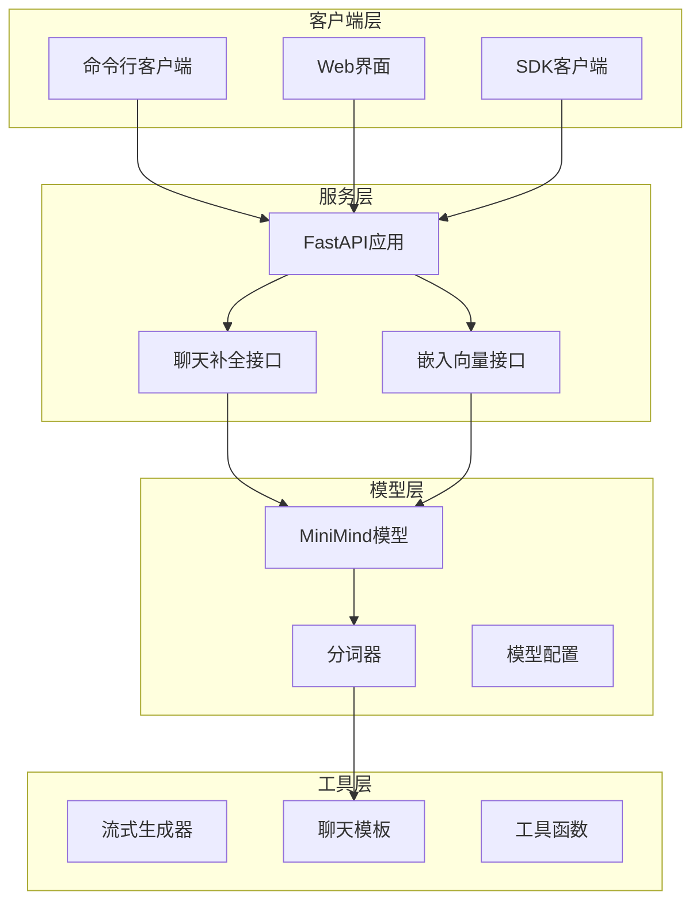
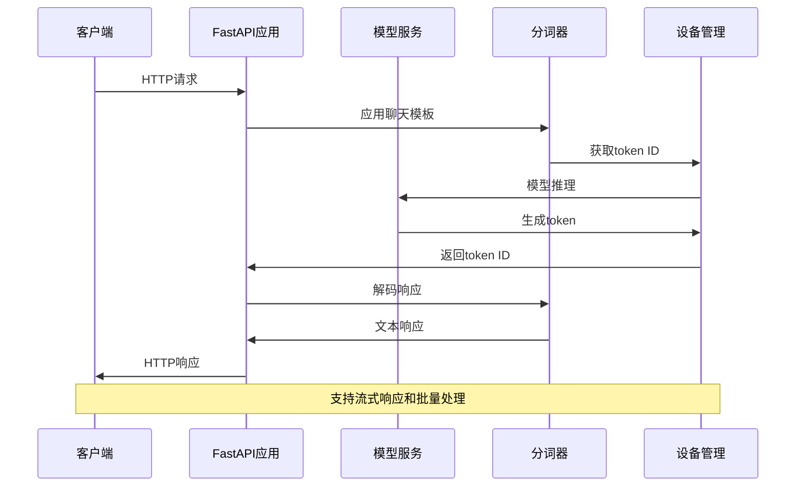
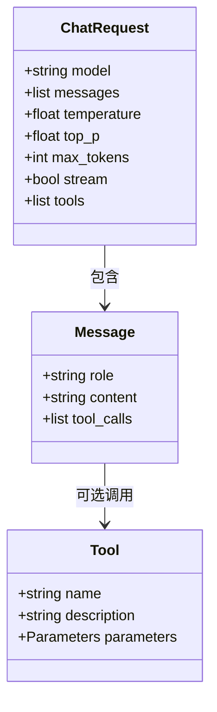
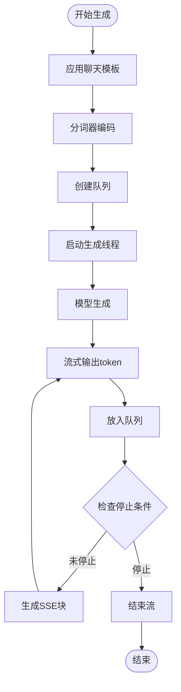
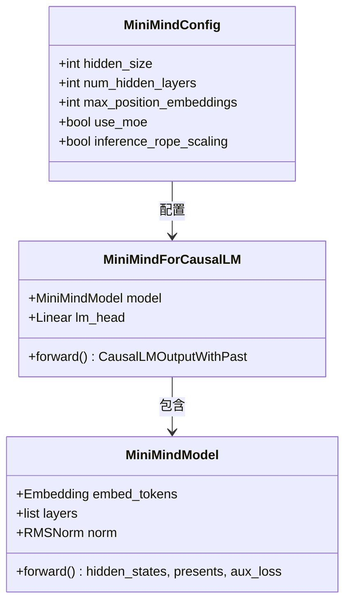
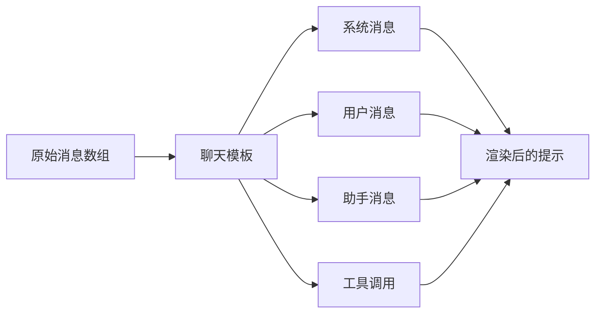
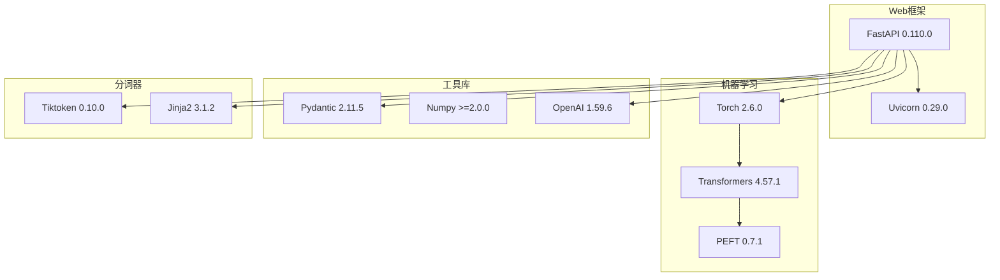
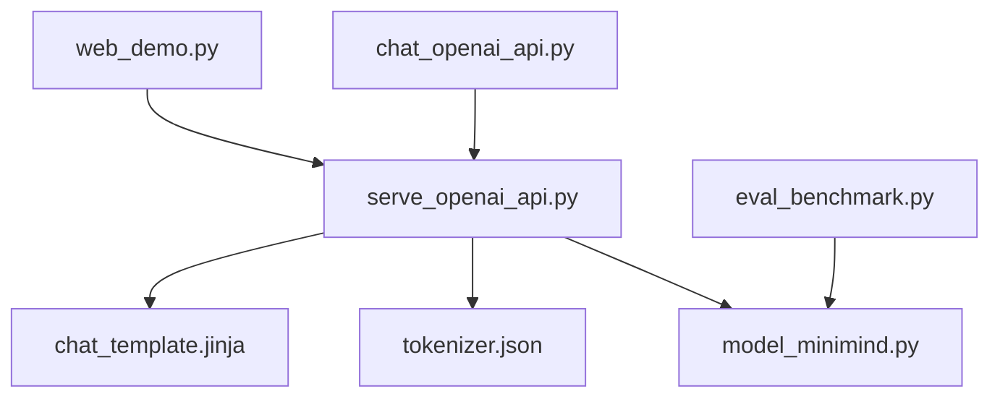

# OpenAI API兼容服务

<cite>
**本文档引用的文件**
- [serve_openai_api.py](file://scripts/serve_openai_api.py)
- [chat_openai_api.py](file://scripts/chat_openai_api.py)
- [requirements.txt](file://requirements.txt)
- [README.md](file://README.md)
- [README_en.md](file://README_en.md)
- [model_minimind.py](file://model/model_minimind.py)
- [web_demo.py](file://scripts/web_demo.py)
- [tokenizer.json](file://model/tokenizer.json)
- [chat_template.jinja](file://MiniMind2/chat_template.jinja)
- [eval_benchmark.py](file://eval_benchmark.py)
</cite>

## 目录
1. [简介](#简介)
2. [项目结构](#项目结构)
3. [核心组件](#核心组件)
4. [架构概览](#架构概览)
5. [详细组件分析](#详细组件分析)
6. [依赖关系分析](#依赖关系分析)
7. [性能考虑](#性能考虑)
8. [故障排除指南](#故障排除指南)
9. [结论](#结论)
10. [附录](#附录)

## 简介

OpenAI API兼容服务是一个基于FastAPI构建的HTTP服务，实现了OpenAI API的兼容接口，主要用于MiniMind系列大语言模型的推理服务。该服务提供了完整的聊天补全和嵌入向量生成功能，支持流式响应和多种参数配置。

该项目的核心目标是为用户提供一个轻量级、高性能的OpenAI API兼容服务，支持从0开始训练的超小语言模型，最小版本仅需25.8M参数即可具备流畅对话能力。服务支持多种部署方式，包括本地部署、容器化部署和云平台部署。

## 项目结构

项目采用模块化设计，主要包含以下核心模块：



**图表来源**
- [serve_openai_api.py:1-25](file://scripts/serve_openai_api.py#L1-L25)
- [model_minimind.py:441-475](file://model/model_minimind.py#L441-L475)

**章节来源**
- [serve_openai_api.py:1-178](file://scripts/serve_openai_api.py#L1-L178)
- [README.md:1644-1684](file://README.md#L1644-L1684)

## 核心组件

### 1. FastAPI应用架构

服务基于FastAPI构建，提供了类型安全的API接口和自动生成的文档。应用实例在全局范围内创建，支持多线程并发处理。

### 2. 模型加载与初始化

系统支持两种模型加载方式：
- **Transformers格式**：直接从HuggingFace格式的模型权重加载
- **原生PyTorch格式**：从自定义的PyTorch权重文件加载

模型初始化过程包括配置加载、权重加载和LoRA微调权重的可选应用。

### 3. 分词器集成

使用自定义的分词器，支持6400个特殊token，包括系统标记、用户标记和助手标记。分词器配置支持聊天模板渲染和特殊token处理。

**章节来源**
- [serve_openai_api.py:27-46](file://scripts/serve_openai_api.py#L27-L46)
- [model_minimind.py:8-78](file://model/model_minimind.py#L8-L78)
- [tokenizer.json:1-31](file://model/tokenizer.json#L1-L31)

## 架构概览

服务采用分层架构设计，确保了良好的可扩展性和维护性：



**图表来源**
- [serve_openai_api.py:113-159](file://scripts/serve_openai_api.py#L113-L159)
- [serve_openai_api.py:71-111](file://scripts/serve_openai_api.py#L71-L111)

### 服务端点设计

系统提供以下主要API端点：

| 端点 | 方法 | 功能 | 流式支持 |
|------|------|------|----------|
| `/v1/chat/completions` | POST | 聊天补全生成 | ✓ |
| `/v1/embeddings` | POST | 嵌入向量生成 | ✗ |

**章节来源**
- [serve_openai_api.py:113-159](file://scripts/serve_openai_api.py#L113-L159)

## 详细组件分析

### 聊天补全接口实现

#### 请求模型定义



**图表来源**
- [serve_openai_api.py:49-57](file://scripts/serve_openai_api.py#L49-L57)

#### 流式响应生成

服务实现了基于队列的流式响应机制：



**图表来源**
- [serve_openai_api.py:71-111](file://scripts/serve_openai_api.py#L71-L111)

#### 非流式响应处理

非流式模式下，服务会等待完整生成后再返回响应：

**章节来源**
- [serve_openai_api.py:113-159](file://scripts/serve_openai_api.py#L113-L159)

### 嵌入向量接口

虽然当前版本主要实现聊天补全功能，但项目结构已为嵌入向量接口预留了扩展空间。嵌入向量功能通常用于：

- 文档检索和相似度匹配
- 语义搜索和内容推荐
- 文本聚类和分析

**章节来源**
- [serve_openai_api.py:113-159](file://scripts/serve_openai_api.py#L113-L159)

### 模型配置与优化

#### MiniMind模型架构



**图表来源**
- [model_minimind.py:441-475](file://model/model_minimind.py#L441-L475)

#### RoPE位置编码扩展

系统支持YaRN算法的位置编码外推，允许模型处理超过训练长度的序列：

**章节来源**
- [model_minimind.py:8-78](file://model/model_minimind.py#L8-L78)

### 聊天模板系统

系统使用Jinja2模板引擎处理聊天消息格式：



**图表来源**
- [chat_template.jinja:1-74](file://MiniMind2/chat_template.jinja#L1-L74)

**章节来源**
- [chat_template.jinja:1-74](file://MiniMind2/chat_template.jinja#L1-L74)

## 依赖关系分析

### 外部依赖

项目依赖以下核心库：



**图表来源**
- [requirements.txt:1-31](file://requirements.txt#L1-L31)

### 内部模块依赖



**图表来源**
- [serve_openai_api.py:1-25](file://scripts/serve_openai_api.py#L1-L25)

**章节来源**
- [requirements.txt:1-31](file://requirements.txt#L1-L31)

## 性能考虑

### 模型优化策略

1. **参数量控制**：最小模型仅25.8M参数，适合资源受限环境
2. **内存优化**：使用RMSNorm和SwiGLU激活函数减少内存占用
3. **推理优化**：支持Flash Attention和RoPE位置编码外推
4. **量化支持**：可选的半精度浮点数推理

### 并发处理

- **多线程支持**：流式响应使用独立线程处理生成
- **异步处理**：FastAPI内置异步支持
- **连接池**：合理配置Uvicorn的工作进程数

### 缓存策略

- **KV缓存**：支持键值对缓存减少重复计算
- **分词器缓存**：缓存常用的token映射
- **模型权重缓存**：避免重复加载模型

## 故障排除指南

### 常见问题及解决方案

#### 1. 模型加载失败

**症状**：启动时出现模型加载错误
**原因**：
- 模型权重文件路径错误
- 模型配置不匹配
- 权重文件损坏

**解决方案**：
- 验证模型文件完整性
- 检查模型配置参数
- 重新下载模型权重

#### 2. 内存不足错误

**症状**：推理过程中出现内存溢出
**原因**：
- 序列长度过长
- 批处理大小过大
- GPU内存不足

**解决方案**：
- 减少max_tokens参数
- 降低batch_size
- 使用CPU进行推理

#### 3. 流式响应异常

**症状**：SSE流式响应中断或格式错误
**原因**：
- 线程同步问题
- 队列阻塞
- 网络连接中断

**解决方案**：
- 检查线程安全性
- 增加队列缓冲区
- 配置适当的超时时间

**章节来源**
- [serve_openai_api.py:158-159](file://scripts/serve_openai_api.py#L158-L159)

## 结论

OpenAI API兼容服务为MiniMind系列模型提供了一个轻量级、高性能的推理接口。通过合理的架构设计和优化策略，该服务能够在资源受限的环境中提供流畅的聊天体验。

主要优势包括：
- **轻量级部署**：支持从0参数的超小模型开始
- **OpenAI兼容**：完全兼容OpenAI API格式
- **流式响应**：支持实时流式生成
- **灵活配置**：丰富的参数调节选项
- **易于集成**：支持多种客户端和第三方UI

未来发展方向：
- 实现嵌入向量生成功能
- 优化多GPU推理支持
- 增强安全认证机制
- 扩展更多模型格式支持

## 附录

### API使用示例

#### curl命令示例

```bash
# 基础聊天补全
curl http://localhost:8998/v1/chat/completions \
  -H "Content-Type: application/json" \
  -d '{
    "model": "minimind",
    "messages": [
      {"role": "user", "content": "你好"}
    ],
    "temperature": 0.7,
    "max_tokens": 512,
    "stream": true
  }'

# 非流式响应
curl http://localhost:8998/v1/chat/completions \
  -H "Content-Type: application/json" \
  -d '{
    "model": "minimind",
    "messages": [
      {"role": "user", "content": "解释量子计算"}
    ],
    "temperature": 0.7,
    "max_tokens": 1024,
    "stream": false
  }'
```

#### Python客户端示例

```python
from openai import OpenAI

client = OpenAI(
    api_key="ollama",
    base_url="http://127.0.0.1:8998/v1"
)

# 流式响应
response = client.chat.completions.create(
    model="minimind",
    messages=[{"role": "user", "content": "生成一个故事"}],
    stream=True
)

for chunk in response:
    content = chunk.choices[0].delta.content or ""
    print(content, end="")
```

**章节来源**
- [README.md:1670-1683](file://README.md#L1670-L1683)
- [chat_openai_api.py:14-29](file://scripts/chat_openai_api.py#L14-L29)

### 部署最佳实践

#### 环境配置

1. **硬件要求**：
   - 最小GPU内存：1GB
   - 推荐GPU内存：2GB+
   - CPU：Intel i5或AMD Ryzen 5以上

2. **软件依赖**：
   - Python 3.8+
   - CUDA 11.8+ (可选)
   - pip包管理器

#### 安全配置

1. **访问控制**：
   - 实现API密钥认证
   - 配置防火墙规则
   - 启用HTTPS加密

2. **资源限制**：
   - 设置请求频率限制
   - 配置超时时间
   - 监控资源使用情况

#### 性能优化

1. **模型优化**：
   - 使用半精度推理
   - 启用模型量化
   - 优化批处理大小

2. **服务优化**：
   - 配置合适的并发数
   - 启用HTTP/2支持
   - 使用反向代理缓存

**章节来源**
- [README.md:208-288](file://README.md#L208-L288)
- [requirements.txt:1-31](file://requirements.txt#L1-L31)