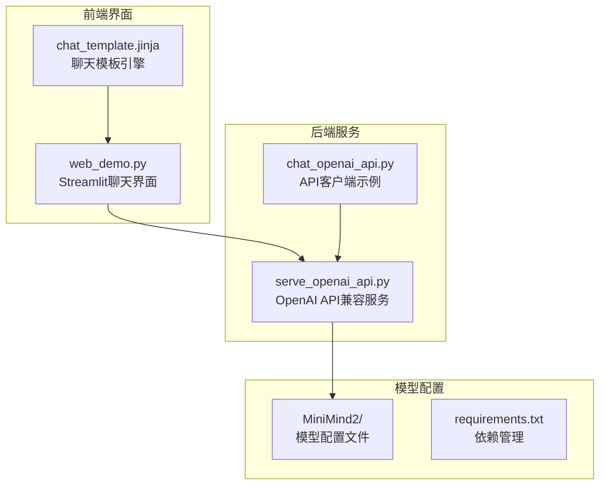
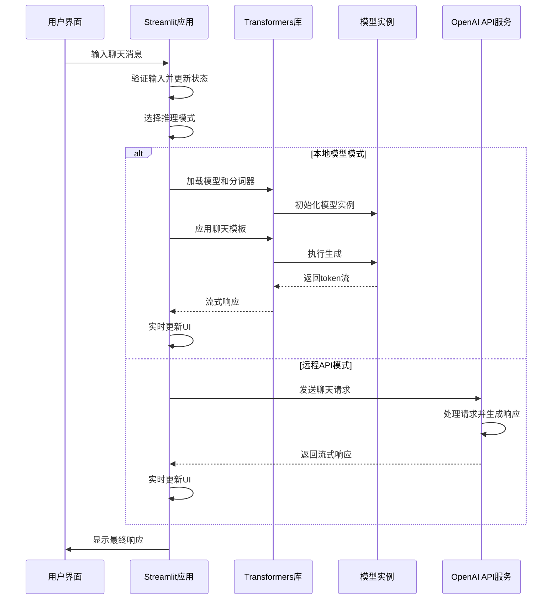
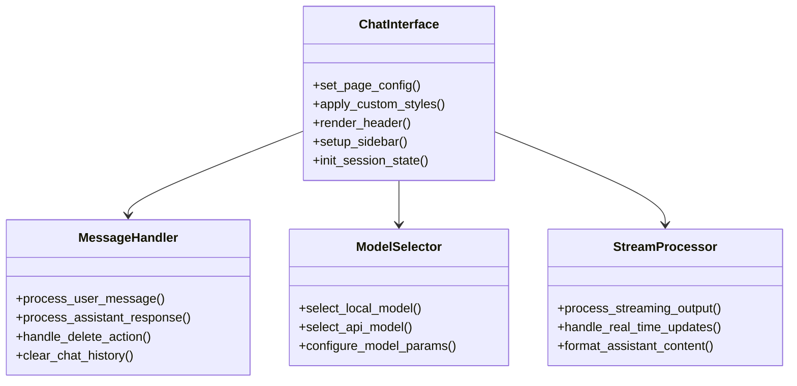
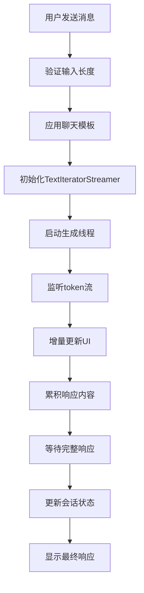
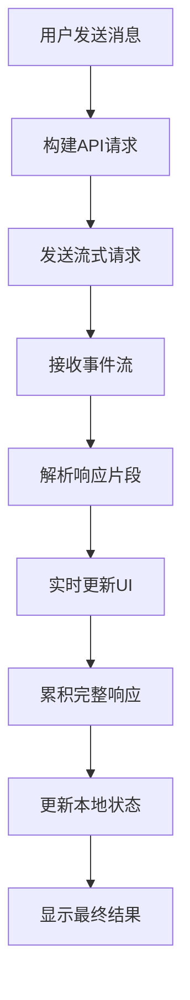
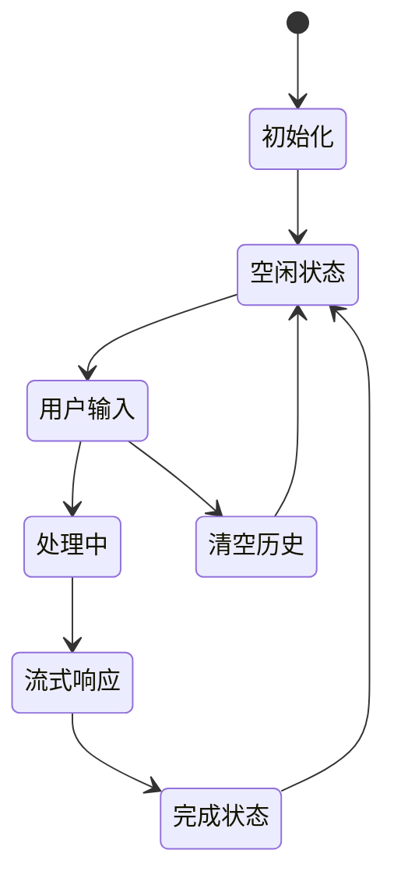
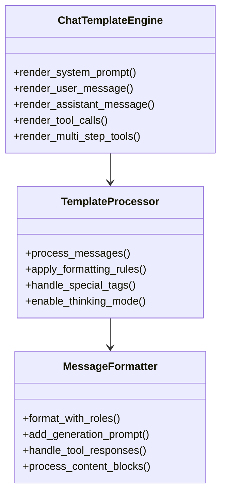

现在我已经收集了足够的信息来创建详细的Web聊天界面技术文档。让我开始生成文档：

<docs>
# Web聊天界面

<cite>
**本文档引用的文件**
- [web_demo.py](file://scripts/web_demo.py)
- [serve_openai_api.py](file://scripts/serve_openai_api.py)
- [chat_template.jinja](file://MiniMind2/chat_template.jinja)
- [chat_openai_api.py](file://scripts/chat_openai_api.py)
- [README.md](file://README.md)
- [requirements.txt](file://requirements.txt)
</cite>

## 目录
1. [简介](#简介)
2. [项目结构](#项目结构)
3. [核心组件](#核心组件)
4. [架构概览](#架构概览)
5. [详细组件分析](#详细组件分析)
6. [依赖关系分析](#依赖关系分析)
7. [性能考虑](#性能考虑)
8. [故障排除指南](#故障排除指南)
9. [结论](#结论)

## 简介

Web聊天界面是基于Streamlit构建的交互式AI聊天系统，集成了多种推理模式和实时交互功能。该系统支持本地模型推理和远程API调用两种模式，提供完整的对话历史管理、实时流式响应和灵活的配置选项。

## 项目结构

该项目采用模块化的文件组织方式，主要包含以下关键组件：

**图表来源**
- [web_demo.py:1-329](file://scripts/web_demo.py#L1-L329)
- [serve_openai_api.py:1-178](file://scripts/serve_openai_api.py#L1-L178)
- [chat_template.jinja:1-74](file://MiniMind2/chat_template.jinja#L1-L74)

**章节来源**
- [web_demo.py:1-329](file://scripts/web_demo.py#L1-L329)
- [README.md:109-122](file://README.md#L109-L122)

## 核心组件

### Streamlit聊天界面核心功能

Web聊天界面的核心功能包括：

1. **实时消息流处理** - 支持流式生成和增量显示
2. **多模型支持** - 本地模型和远程API两种推理模式
3. **会话状态管理** - 完整的消息历史和状态持久化
4. **响应式布局** - 自适应不同屏幕尺寸的界面设计
5. **主题定制** - 支持自定义样式和主题切换

### 关键配置参数

系统提供丰富的配置选项：

- **历史对话轮数** - 控制上下文窗口大小 (0-6轮)
- **最大生成长度** - 序列长度限制 (256-8192 tokens)
- **温度参数** - 控制生成多样性 (0.6-1.2)
- **模型选择** - 支持多种MiniMind变体

**章节来源**
- [web_demo.py:154-161](file://scripts/web_demo.py#L154-L161)
- [web_demo.py:171-181](file://scripts/web_demo.py#L171-L181)

## 架构概览

系统采用前后端分离的架构设计，结合了本地推理和远程服务两种模式：

**图表来源**
- [web_demo.py:251-314](file://scripts/web_demo.py#L251-L314)
- [serve_openai_api.py:113-159](file://scripts/serve_openai_api.py#L113-L159)

## 详细组件分析

### Streamlit界面组件

#### 页面配置和样式定制

界面采用现代化的设计理念，通过CSS样式表实现了高度定制化的外观：

**图表来源**
- [web_demo.py:98-110](file://scripts/web_demo.py#L98-L110)
- [web_demo.py:117-152](file://scripts/web_demo.py#L117-L152)
- [web_demo.py:71-95](file://scripts/web_demo.py#L71-L95)

#### 实时消息流处理机制

系统实现了高效的实时消息流处理，支持两种不同的流式响应模式：

**本地模型流式生成流程**：

**图表来源**
- [web_demo.py:277-314](file://scripts/web_demo.py#L277-L314)

**远程API流式响应流程**：

**图表来源**
- [web_demo.py:251-276](file://scripts/web_demo.py#L251-L276)

#### 会话状态管理系统

系统采用Streamlit的session_state机制实现完整的会话管理：

**章节来源**
- [web_demo.py:213-246](file://scripts/web_demo.py#L213-L246)
- [web_demo.py:112-115](file://scripts/web_demo.py#L112-L115)

### 聊天模板系统

#### Jinja模板引擎集成

系统使用Jinja模板引擎处理复杂的聊天格式，支持多种角色和工具调用场景：

**图表来源**
- [chat_template.jinja:1-74](file://MiniMind2/chat_template.jinja#L1-L74)

#### 特殊标记处理机制

系统支持特殊的推理标记，用于控制思考过程的显示和格式：

| 标记类型 | 作用 | 显示效果 |
|---------|------|----------|
| `