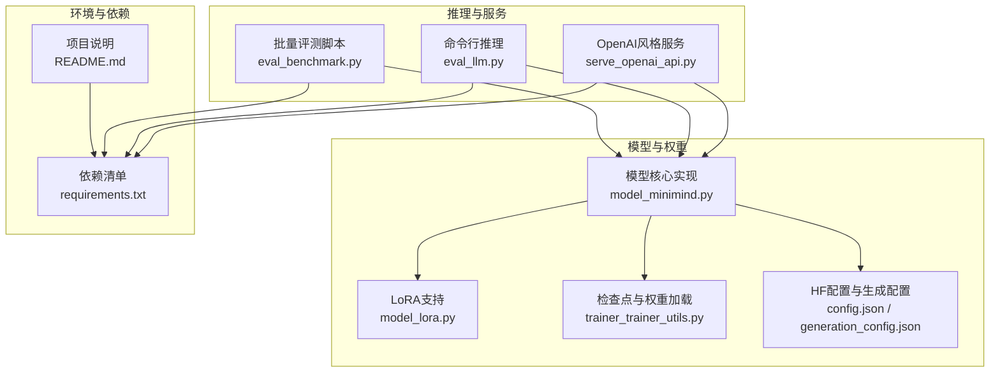
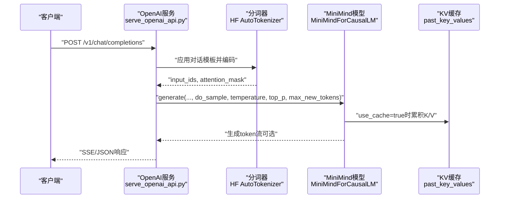
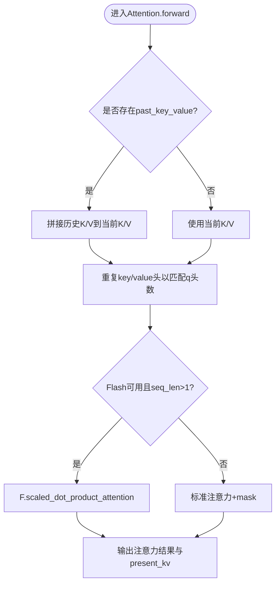
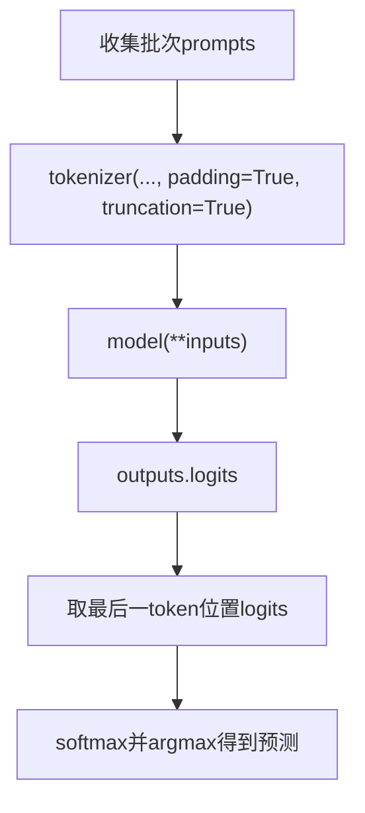
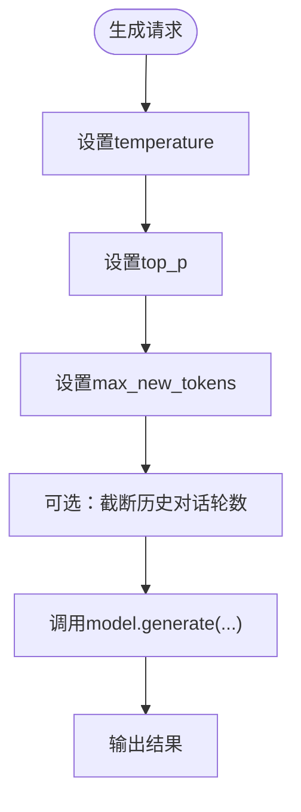
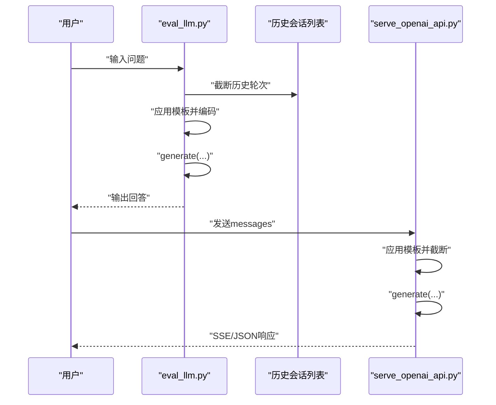
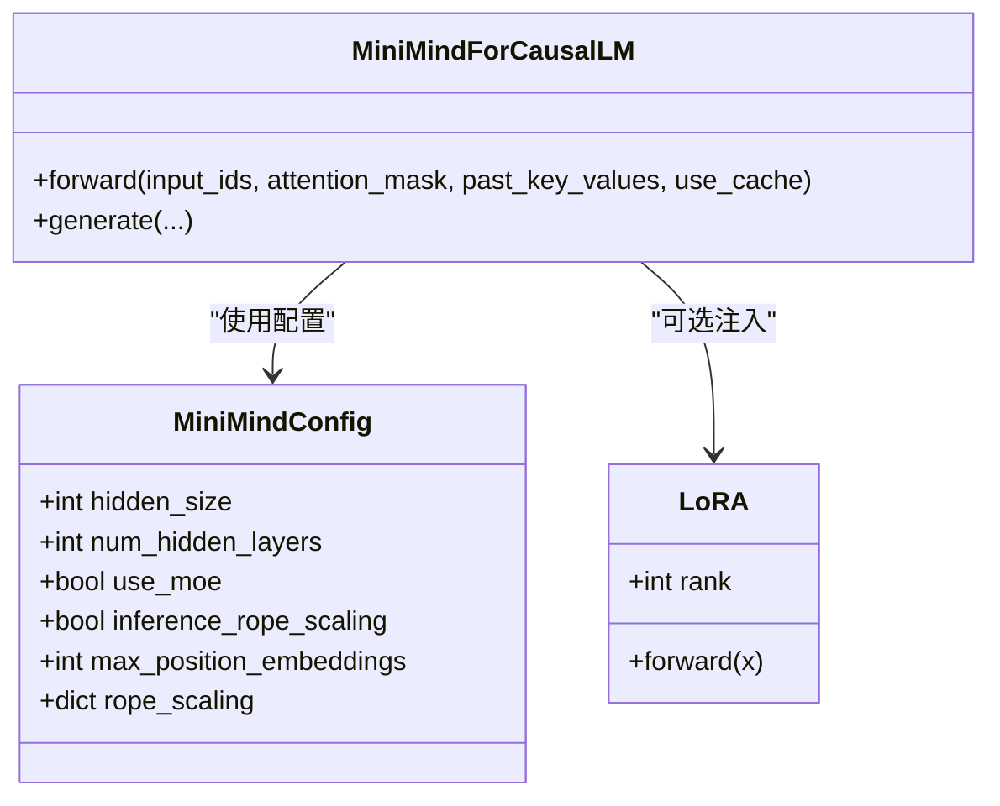
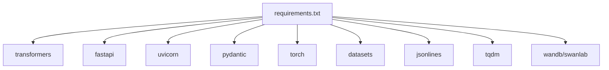

# 批量推理引擎

<cite>
**本文引用的文件**
- [model_minimind.py](file://model/model_minimind.py)
- [model_lora.py](file://model/model_lora.py)
- [serve_openai_api.py](file://scripts/serve_openai_api.py)
- [eval_llm.py](file://eval_llm.py)
- [eval_benchmark.py](file://eval_benchmark.py)
- [trainer_utils.py](file://trainer/trainer_utils.py)
- [requirements.txt](file://requirements.txt)
- [README.md](file://README.md)
- [config.json（MiniMind2）](file://MiniMind2/config.json)
- [generation_config.json（MiniMind2）](file://MiniMind2/generation_config.json)
- [config.json（baseline_hf）](file://DST-train/model/baseline_hf/config.json)
- [generation_config.json（baseline_hf）](file://DST-train/model/baseline_hf/generation_config.json)
</cite>

## 目录
1. [引言](#引言)
2. [项目结构](#项目结构)
3. [核心组件](#核心组件)
4. [架构总览](#架构总览)
5. [详细组件分析](#详细组件分析)
6. [依赖分析](#依赖分析)
7. [性能考量](#性能考量)
8. [故障排查指南](#故障排查指南)
9. [结论](#结论)
10. [附录](#附录)

## 引言
本文件面向批量推理引擎的技术文档，聚焦MiniMind系列模型在推理阶段的优化策略与工程实践，包括KV缓存机制、批量处理与内存管理、推理参数配置（温度、采样、生成长度）、会话管理（历史对话、上下文窗口、状态持久化）、多模型支持（统一接口与权重加载）、性能基准与调优（吞吐与延迟）、以及大规模部署与监控方案。文档以仓库现有代码与配置为依据，结合推理流水线与服务端实现，给出可操作的分析与建议。

## 项目结构
该仓库围绕“从零训练到部署推理”的完整闭环组织，推理相关的关键目录与文件如下：
- 模型定义与推理核心：model/model_minimind.py
- LoRA微调支持：model/model_lora.py
- OpenAI风格推理服务：scripts/serve_openai_api.py
- 命令行推理与对话：eval_llm.py
- 批量评测（多选题ABC D）：eval_benchmark.py
- 训练工具与权重保存/加载：trainer/trainer_utils.py
- 依赖声明：requirements.txt
- 模型配置与生成配置（HF格式）：MiniMind2/config.json、MiniMind2/generation_config.json；baseline_hf/config.json、generation_config.json
- 项目总览与使用说明：README.md

**图表来源**
- [serve_openai_api.py:162-178](file://scripts/serve_openai_api.py#L162-L178)
- [eval_llm.py:32-89](file://eval_llm.py#L32-L89)
- [eval_benchmark.py:234-319](file://eval_benchmark.py#L234-L319)
- [model_minimind.py:443-477](file://model/model_minimind.py#L443-L477)
- [model_lora.py:21-50](file://model/model_lora.py#L21-L50)
- [trainer_utils.py:47-111](file://trainer/trainer_utils.py#L47-L111)
- [requirements.txt:1-31](file://requirements.txt#L1-L31)
- [README.md:208-424](file://README.md#L208-L424)

**章节来源**
- [README.md:208-424](file://README.md#L208-L424)
- [requirements.txt:1-31](file://requirements.txt#L1-L31)

## 核心组件
- 模型核心（MiniMindForCausalLM）：实现KV缓存、Flash Attention、RoPE位置编码、MoE门控与专家路由、RMSNorm等，支持use_cache与past_key_values传参与返回。
- 推理服务（OpenAI API）：FastAPI服务，支持流式与非流式响应，参数温度、top_p、max_tokens，内置对话模板应用与截断。
- 命令行推理：支持历史对话轮数控制、温度与top_p采样、最大生成长度、LoRA权重加载。
- 批量评测：以HF格式模型加载，批量token化与forward，最后取最后一个token位置的logits进行ABCD四选项概率对比。
- LoRA支持：原生实现LoRA模块注入与权重加载，便于轻量微调与快速切换。
- 训练工具：检查点保存/恢复、分布式训练辅助、权重命名与路径约定。

**章节来源**
- [model_minimind.py:443-477](file://model/model_minimind.py#L443-L477)
- [serve_openai_api.py:113-159](file://scripts/serve_openai_api.py#L113-L159)
- [eval_llm.py:32-89](file://eval_llm.py#L32-L89)
- [eval_benchmark.py:55-127](file://eval_benchmark.py#L55-L127)
- [model_lora.py:21-50](file://model/model_lora.py#L21-L50)
- [trainer_utils.py:47-111](file://trainer/trainer_utils.py#L47-L111)

## 架构总览
推理引擎由“服务端（FastAPI）—模型（MiniMind）—分词器（HF）—权重（本地/远程）”构成，支持流式与非流式两种输出模式；批量评测与命令行推理分别面向离线评估与交互式对话。

**图表来源**
- [serve_openai_api.py:113-159](file://scripts/serve_openai_api.py#L113-L159)
- [model_minimind.py:443-477](file://model/model_minimind.py#L443-L477)

## 详细组件分析

### KV缓存与注意力优化
- KV缓存：Attention模块在forward中接收past_key_value，若存在则拼接当前K/V到历史序列，形成增量扩展；use_cache为true时返回present_key_value，供后续调用复用。
- 注意力实现：优先使用scaled_dot_product_attention（Flash Attention）；当存在注意力掩码或仅单步推理时，回退到标准注意力实现，确保因果掩码与mask兼容。
- RoPE与外推：位置编码在模型前向中按start_pos与seq_len切片生成，支持inference_rope_scaling配置（YaRN外推）。

**图表来源**
- [model_minimind.py:150-227](file://model/model_minimind.py#L150-L227)

**章节来源**
- [model_minimind.py:150-227](file://model/model_minimind.py#L150-L227)

### 批量处理与内存管理
- 批量评测：eval_benchmark.py以固定batch_size分批tokenize与forward，最后取最后一token位置logits，减少峰值显存占用。
- 命令行推理：eval_llm.py支持max_new_tokens与do_sample/top_p/temperature等参数，结合TextStreamer实现流式输出，降低单次等待时间。
- 服务端流式：serve_openai_api.py使用Queue与自定义TextStreamer，将生成片段异步推送，避免阻塞主线程。

**图表来源**
- [eval_benchmark.py:85-127](file://eval_benchmark.py#L85-L127)

**章节来源**
- [eval_benchmark.py:55-127](file://eval_benchmark.py#L55-L127)
- [eval_llm.py:77-85](file://eval_llm.py#L77-L85)
- [serve_openai_api.py:71-111](file://scripts/serve_openai_api.py#L71-L111)

### 推理参数配置与调优
- 温度（temperature）：控制采样随机性，数值越高越随机；服务端与命令行均支持传入。
- Top-p（核采样）：在累积概率达到阈值时截断，兼顾多样性与稳定性。
- 最大生成长度（max_tokens/max_new_tokens）：限制生成长度，避免长尾消耗。
- 历史对话轮数（historys）：eval_llm.py支持截断历史轮次，便于控制上下文长度。
- LoRA权重：支持在原生权重基础上注入LoRA模块并加载LoRA权重，实现轻量微调。

**图表来源**
- [serve_openai_api.py:113-159](file://scripts/serve_openai_api.py#L113-L159)
- [eval_llm.py:32-89](file://eval_llm.py#L32-L89)
- [model_lora.py:21-50](file://model/model_lora.py#L21-L50)

**章节来源**
- [serve_openai_api.py:49-111](file://scripts/serve_openai_api.py#L49-L111)
- [eval_llm.py:32-89](file://eval_llm.py#L32-L89)
- [model_lora.py:21-50](file://model/model_lora.py#L21-L50)

### 会话管理与上下文窗口
- 历史对话维护：eval_llm.py通过截断conversation列表维持历史轮数，避免上下文溢出。
- 上下文窗口管理：服务端与命令行均对输入prompt进行apply_chat_template并截断max_tokens，确保输入长度可控。
- 状态持久化：trainer_utils.py提供检查点保存/恢复，支持跨GPU数量恢复与wandb记录连续性，便于长期会话与实验追踪。

**图表来源**
- [eval_llm.py:60-86](file://eval_llm.py#L60-L86)
- [serve_openai_api.py:113-159](file://scripts/serve_openai_api.py#L113-L159)
- [trainer_utils.py:47-98](file://trainer/trainer_utils.py#L47-L98)

**章节来源**
- [eval_llm.py:60-86](file://eval_llm.py#L60-L86)
- [trainer_utils.py:47-98](file://trainer/trainer_utils.py#L47-L98)

### 多模型支持与统一接口
- 统一接口：MiniMindForCausalLM继承GenerationMixin，兼容transformers的generate接口；同时支持原生torch权重加载与HF格式模型加载。
- 权重加载：serve_openai_api.py与eval_llm.py均支持从本地权重路径加载，并可按hidden_size/num_hidden_layers/use_moe/inference_rope_scaling等参数重建配置。
- HF配置：MiniMind2与baseline_hf提供config.json与generation_config.json，确保与transformers生态兼容。

**图表来源**
- [model_minimind.py:8-78](file://model/model_minimind.py#L8-L78)
- [model_minimind.py:443-477](file://model/model_minimind.py#L443-L477)
- [model_lora.py:6-18](file://model/model_lora.py#L6-L18)

**章节来源**
- [model_minimind.py:8-78](file://model/model_minimind.py#L8-L78)
- [model_minimind.py:443-477](file://model/model_minimind.py#L443-L477)
- [model_lora.py:21-50](file://model/model_lora.py#L21-L50)
- [config.json（MiniMind2）:1-33](file://MiniMind2/config.json#L1-L33)
- [generation_config.json（MiniMind2）:1-10](file://MiniMind2/generation_config.json#L1-L10)
- [config.json（baseline_hf）:1-37](file://DST-train/model/baseline_hf/config.json#L1-L37)
- [generation_config.json（baseline_hf）:1-9](file://DST-train/model/baseline_hf/generation_config.json#L1-L9)

### 性能基准测试与调优
- 基准评测：eval_benchmark.py使用ABCD token概率对比法，对C-Eval与CMMLU进行批量评测，支持batch_size与max_length控制。
- 评测流程：分批tokenize→forward→取最后一token logits→softmax→argmax→统计准确率。
- 调优建议：
  - 批大小：在显存允许前提下增大batch_size以提升吞吐。
  - 生成长度：合理设置max_new_tokens，避免过长导致延迟上升。
  - 采样策略：top_p与temperature影响生成稳定性和多样性，建议结合业务场景调参。
  - KV缓存：在长对话与流式场景中启用use_cache可显著降低重复计算。

**章节来源**
- [eval_benchmark.py:55-127](file://eval_benchmark.py#L55-L127)
- [eval_benchmark.py:234-319](file://eval_benchmark.py#L234-L319)

### 大规模部署与监控
- 服务端：serve_openai_api.py基于FastAPI+uvicorn，支持SSE流式输出，便于集成第三方前端。
- 监控与可视化：trainer_utils.py支持将训练/检查点信息与wandb/suanlab记录关联，便于追踪指标与恢复训练。
- 部署建议：
  - 使用容器化部署（镜像包含requirements.txt依赖）。
  - 结合Nginx/反向代理与多实例部署，按需扩容。
  - 使用Prometheus/Grafana采集服务指标（QPS、P95/P99延迟、显存占用）。

**章节来源**
- [serve_openai_api.py:162-178](file://scripts/serve_openai_api.py#L162-L178)
- [trainer_utils.py:47-98](file://trainer/trainer_utils.py#L47-L98)
- [requirements.txt:1-31](file://requirements.txt#L1-L31)

## 依赖分析
- 推理与服务：transformers、fastapi、uvicorn、pydantic、torch等。
- 评测与数据：datasets、jsonlines、tqdm等。
- 可视化与日志：wandb/swanlab（兼容）、psutil等。

**图表来源**
- [requirements.txt:1-31](file://requirements.txt#L1-L31)

**章节来源**
- [requirements.txt:1-31](file://requirements.txt#L1-L31)

## 性能考量
- 吞吐优化
  - 批量推理：eval_benchmark.py与服务端均支持批量输入，减少调度开销。
  - KV缓存：在多轮对话与流式生成中启用use_cache，避免重复计算。
  - Flash Attention：在满足条件时使用scaled_dot_product_attention，提升注意力计算效率。
- 延迟控制
  - 控制max_new_tokens与max_length，避免过长生成。
  - 合理设置temperature与top_p，减少无效重算。
  - 流式输出：服务端使用队列与线程异步生成，降低首token延迟感知。
- 内存管理
  - 批量评测中对输入进行padding与truncation，控制峰值显存。
  - 检查点保存采用half精度与临时文件替换，降低IO与内存压力。

[本节为通用指导，无需特定文件引用]

## 故障排查指南
- 生成异常或报错
  - 确认tokenizer与模型配置一致（HF格式与原生权重路径）。
  - 检查attention_mask与past_key_values形状一致性。
- 显存不足
  - 降低batch_size与max_length，或启用use_cache减少重复计算。
  - 使用半精度（HF配置dtype为float16）。
- LoRA未生效
  - 确认apply_lora与load_lora顺序正确，权重路径与rank一致。
- 服务端SSE无输出
  - 检查CustomStreamer回调与队列消费逻辑，确认线程与生成函数分离执行。

**章节来源**
- [serve_openai_api.py:71-111](file://scripts/serve_openai_api.py#L71-L111)
- [model_lora.py:21-50](file://model/model_lora.py#L21-L50)
- [trainer_utils.py:47-98](file://trainer/trainer_utils.py#L47-L98)

## 结论
本批量推理引擎以MiniMind为核心，结合KV缓存、批量处理与内存优化、灵活的推理参数配置、统一的多模型接口与LoRA支持，以及完善的评测与部署方案，形成了从训练到生产的完整闭环。通过合理调参与监控，可在保证质量的前提下实现高吞吐与低延迟的推理服务。

## 附录
- 关键参数与路径
  - 服务端参数：--load_from、--save_dir、--weight、--lora_weight、--hidden_size、--num_hidden_layers、--max_seq_len、--use_moe、--inference_rope_scaling、--device
  - 命令行参数：--load_from、--save_dir、--weight、--lora_weight、--hidden_size、--num_hidden_layers、--use_moe、--inference_rope_scaling、--max_new_tokens、--temperature、--top_p、--historys、--device
- 配置文件
  - MiniMind2：config.json、generation_config.json
  - baseline_hf：config.json、generation_config.json

**章节来源**
- [serve_openai_api.py:162-178](file://scripts/serve_openai_api.py#L162-L178)
- [eval_llm.py:32-89](file://eval_llm.py#L32-L89)
- [config.json（MiniMind2）:1-33](file://MiniMind2/config.json#L1-L33)
- [generation_config.json（MiniMind2）:1-10](file://MiniMind2/generation_config.json#L1-L10)
- [config.json（baseline_hf）:1-37](file://DST-train/model/baseline_hf/config.json#L1-L37)
- [generation_config.json（baseline_hf）:1-9](file://DST-train/model/baseline_hf/generation_config.json#L1-L9)