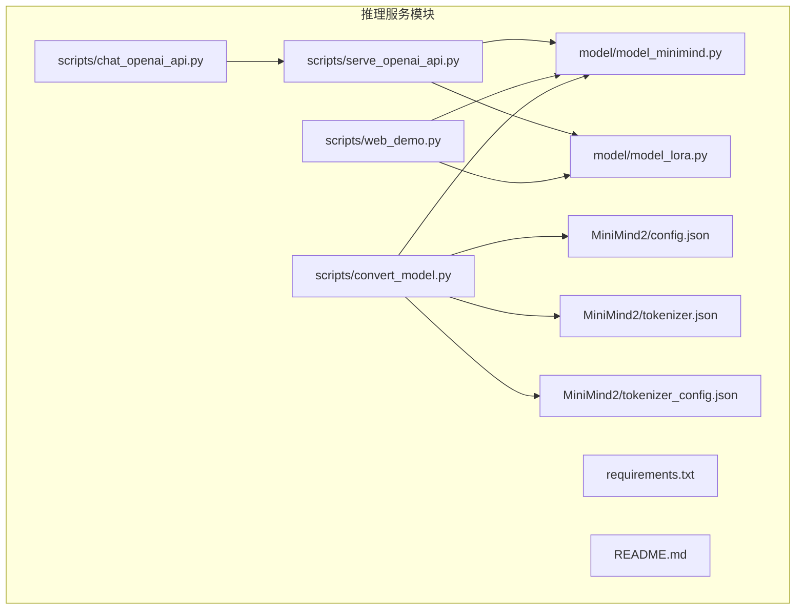
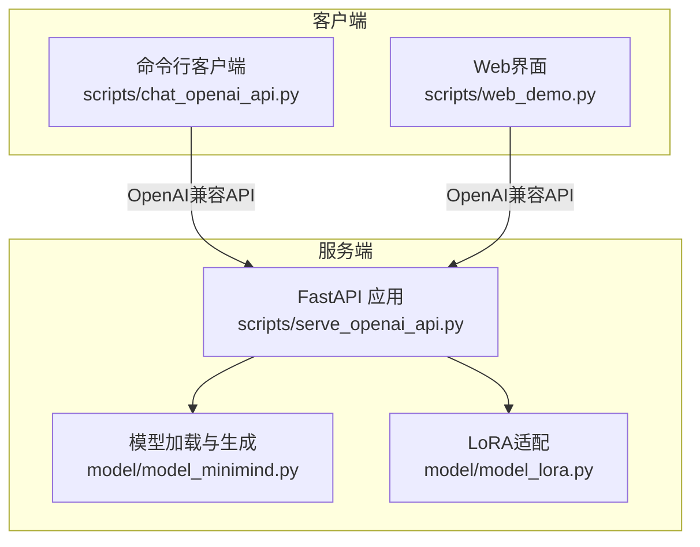
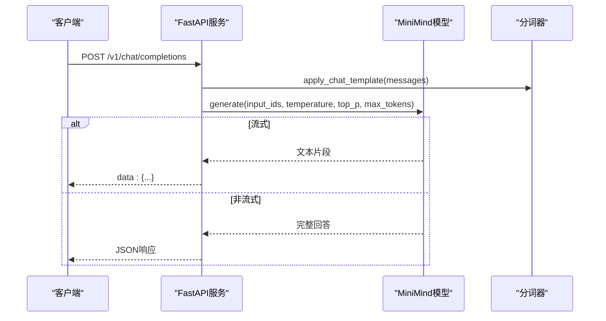
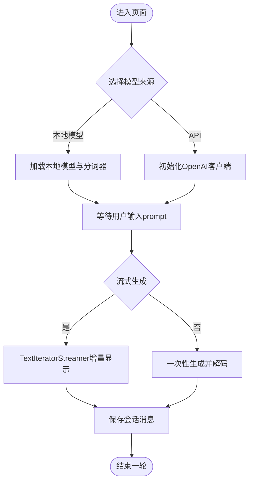
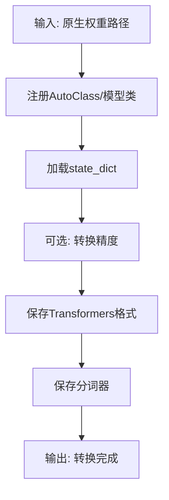
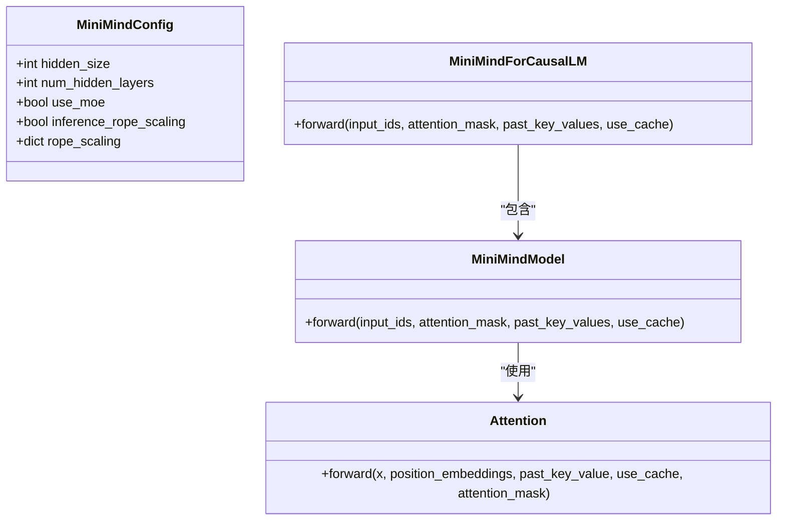
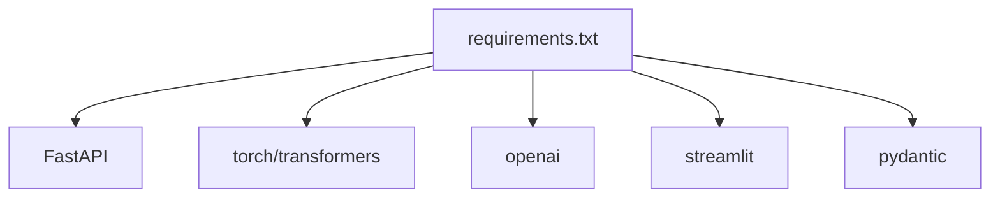

# 推理服务模块

<cite>
**本文档引用的文件**
- [serve_openai_api.py](file://scripts/serve_openai_api.py)
- [chat_openai_api.py](file://scripts/chat_openai_api.py)
- [web_demo.py](file://scripts/web_demo.py)
- [convert_model.py](file://scripts/convert_model.py)
- [model_minimind.py](file://model/model_minimind.py)
- [model_lora.py](file://model/model_lora.py)
- [requirements.txt](file://requirements.txt)
- [README.md](file://README.md)
- [config.json](file://MiniMind2/config.json)
- [tokenizer.json](file://MiniMind2/tokenizer.json)
- [tokenizer_config.json](file://MiniMind2/tokenizer_config.json)
</cite>

## 目录
1. [简介](#简介)
2. [项目结构](#项目结构)
3. [核心组件](#核心组件)
4. [架构总览](#架构总览)
5. [详细组件分析](#详细组件分析)
6. [依赖关系分析](#依赖关系分析)
7. [性能考量](#性能考量)
8. [故障排查指南](#故障排查指南)
9. [结论](#结论)
10. [附录](#附录)

## 简介
本文件系统性梳理MiniMind推理服务模块，围绕OpenAI API兼容服务、Web聊天界面、模型转换工具与推理优化策略展开，提供从架构设计到部署实践的完整技术文档。读者将获得：
- OpenAI API兼容服务的HTTP接口设计、请求响应格式与认证机制
- Streamlit集成的Web聊天界面实现细节与实时交互机制
- 模型转换工具的设计思路与权重适配流程
- 推理优化策略（KV缓存、分组查询注意力、Flash Attention、RoPE外推等）
- 部署示例、API使用指南与性能调优建议

## 项目结构
推理服务模块主要由以下脚本与模型文件构成：
- HTTP服务与客户端：scripts/serve_openai_api.py、scripts/chat_openai_api.py
- Web聊天界面：scripts/web_demo.py
- 模型转换工具：scripts/convert_model.py
- 模型实现：model/model_minimind.py、model/model_lora.py
- 依赖声明：requirements.txt
- 模型配置与分词器：MiniMind2/config.json、MiniMind2/tokenizer.json、MiniMind2/tokenizer_config.json
- 项目说明：README.md

**图表来源**
- [serve_openai_api.py:1-178](file://scripts/serve_openai_api.py#L1-L178)
- [web_demo.py:1-329](file://scripts/web_demo.py#L1-L329)
- [convert_model.py:1-76](file://scripts/convert_model.py#L1-L76)
- [model_minimind.py:1-475](file://model/model_minimind.py#L1-L475)
- [model_lora.py:1-50](file://model/model_lora.py#L1-L50)
- [requirements.txt:1-31](file://requirements.txt#L1-L31)
- [README.md:1-800](file://README.md#L1-L800)
- [config.json:1-33](file://MiniMind2/config.json#L1-L33)
- [tokenizer.json:1-800](file://MiniMind2/tokenizer.json#L1-L800)
- [tokenizer_config.json:1-43](file://MiniMind2/tokenizer_config.json#L1-L43)

**章节来源**
- [README.md:208-260](file://README.md#L208-L260)
- [requirements.txt:1-31](file://requirements.txt#L1-L31)

## 核心组件
- OpenAI API兼容HTTP服务：提供/v1/chat/completions端点，支持流式与非流式响应，内置温度、top_p、max_tokens等参数。
- Web聊天界面：基于Streamlit构建，支持本地模型与API两种模式，具备会话管理、历史对话回溯、实时流式显示等功能。
- 模型转换工具：提供MiniMind到Transformers格式的转换，以及与Llama结构的兼容转换，便于第三方生态集成。
- 推理模型实现：包含MiniMindConfig、MiniMindForCausalLM、Attention、FeedForward、RMSNorm、RoPE等核心组件，支持KV缓存、分组查询注意力、MoE等特性。

**章节来源**
- [serve_openai_api.py:113-159](file://scripts/serve_openai_api.py#L113-L159)
- [web_demo.py:207-329](file://scripts/web_demo.py#L207-L329)
- [convert_model.py:14-76](file://scripts/convert_model.py#L14-L76)
- [model_minimind.py:8-78](file://model/model_minimind.py#L8-L78)

## 架构总览
推理服务模块采用“服务端FastAPI + 模型推理 + Web前端”的三层架构：
- 服务端：FastAPI提供OpenAI兼容接口，内部调用transformers AutoModelForCausalLM与自定义TextStreamer实现流式生成。
- 模型层：MiniMind模型支持KV缓存、分组查询注意力、RoPE位置编码与可选MoE结构，具备高效推理能力。
- 前端层：Streamlit Web界面与命令行OpenAI客户端，分别提供图形化与CLI交互入口。

**图表来源**
- [serve_openai_api.py:24-46](file://scripts/serve_openai_api.py#L24-L46)
- [web_demo.py:251-277](file://scripts/web_demo.py#L251-L277)
- [chat_openai_api.py:3-6](file://scripts/chat_openai_api.py#L3-L6)

## 详细组件分析

### OpenAI API兼容HTTP服务
- 接口设计
  - 端点：POST /v1/chat/completions
  - 请求体：包含model、messages、temperature、top_p、max_tokens、stream、tools等字段
  - 响应：非流式返回完整JSON；流式返回SSE格式数据块
- 认证机制：示例客户端使用固定API Key（便于本地调试），生产环境建议接入真实鉴权
- 生成逻辑：支持温度与核采样参数；流式模式通过自定义TextStreamer与队列实现增量输出
- 错误处理：捕获异常并返回HTTP 500错误

**图表来源**
- [serve_openai_api.py:113-159](file://scripts/serve_openai_api.py#L113-L159)
- [serve_openai_api.py:71-111](file://scripts/serve_openai_api.py#L71-L111)

**章节来源**
- [serve_openai_api.py:49-57](file://scripts/serve_openai_api.py#L49-L57)
- [serve_openai_api.py:113-159](file://scripts/serve_openai_api.py#L113-L159)

### Web聊天界面（Streamlit集成）
- 功能特性
  - 本地模型与API双模式切换
  - 历史对话轮数滑杆、最大生成长度、温度等参数调节
  - 实时流式显示与会话管理（删除、重新生成）
  - 对<think>标签的Markdown渲染增强
- 交互流程
  - 用户输入prompt后，界面根据模式选择调用OpenAI客户端或本地模型
  - 通过TextIteratorStreamer实现流式生成，占位符动态更新显示

**图表来源**
- [web_demo.py:207-329](file://scripts/web_demo.py#L207-L329)

**章节来源**
- [web_demo.py:154-182](file://scripts/web_demo.py#L154-L182)
- [web_demo.py:251-317](file://scripts/web_demo.py#L251-L317)

### 模型转换工具
- 设计思路
  - 将原生MiniMind权重转换为Transformers格式，便于第三方生态兼容
  - 提供与Llama结构的兼容转换，满足llama.cpp、vllm等生态需求
  - 支持权重精度转换与参数统计
- 关键流程
  - 注册AutoClass与模型类，加载state_dict，保存为Transformers格式
  - 生成LlamaConfig并映射关键参数，确保与第三方推理引擎兼容

**图表来源**
- [convert_model.py:14-28](file://scripts/convert_model.py#L14-L28)
- [convert_model.py:32-55](file://scripts/convert_model.py#L32-L55)

**章节来源**
- [convert_model.py:14-76](file://scripts/convert_model.py#L14-L76)

### 推理优化策略
- KV缓存与分组查询注意力（GQA）
  - 通过past_key_value实现KV缓存，减少重复计算
  - GQA将8查询头映射到2组KV头，降低KV存储与计算开销
- Flash Attention
  - 在满足条件时使用torch.nn.functional.scaled_dot_product_attention
  - 自动掩码与因果掩码处理，提升注意力计算效率
- RoPE位置编码与外推
  - 支持YaRN风格的RoPE缩放配置，实现长序列外推
- LoRA适配
  - 为线性层注入低秩矩阵，实现参数高效微调与推理加速

**图表来源**
- [model_minimind.py:8-78](file://model/model_minimind.py#L8-L78)
- [model_minimind.py:150-225](file://model/model_minimind.py#L150-L225)
- [model_minimind.py:385-439](file://model/model_minimind.py#L385-L439)
- [model_minimind.py:441-475](file://model/model_minimind.py#L441-L475)

**章节来源**
- [model_minimind.py:150-225](file://model/model_minimind.py#L150-L225)
- [model_minimind.py:385-439](file://model/model_minimind.py#L385-L439)
- [model_lora.py:21-41](file://model/model_lora.py#L21-L41)

## 依赖关系分析
- 运行时依赖
  - FastAPI、uvicorn：HTTP服务与ASGI服务器
  - transformers、torch：模型加载与推理
  - openai：OpenAI兼容客户端
  - streamlit：Web界面
- 版本与兼容性
  - torch 2.6.0、transformers 4.57.1、pydantic 2.11.5、openai 1.59.6、streamlit 1.50.0
  - 项目README明确支持llama.cpp、vllm、ollama等生态

**图表来源**
- [requirements.txt:1-31](file://requirements.txt#L1-L31)

**章节来源**
- [requirements.txt:1-31](file://requirements.txt#L1-L31)
- [README.md:118-122](file://README.md#L118-L122)

## 性能考量
- KV缓存与GQA
  - 推理阶段启用use_cache，结合past_key_value实现增量解码，显著降低计算与显存占用
- Flash Attention
  - 在CUDA可用且满足条件时使用高效注意力实现，减少注意力计算时间
- RoPE外推
  - 通过rope_scaling配置实现长序列外推，避免位置编码退化
- LoRA参数高效性
  - 仅传输低秩矩阵，减少推理时的参数量与计算量
- Web界面与流式显示
  - 使用TextIteratorStreamer与占位符动态更新，降低前端阻塞与提升交互体验

**章节来源**
- [model_minimind.py:184-188](file://model/model_minimind.py#L184-L188)
- [model_minimind.py:196-205](file://model/model_minimind.py#L196-L205)
- [model_minimind.py:58-64](file://model/model_minimind.py#L58-L64)
- [model_lora.py:21-32](file://model/model_lora.py#L21-L32)
- [web_demo.py:295-314](file://scripts/web_demo.py#L295-L314)

## 故障排查指南
- 服务启动与端口占用
  - 确认端口未被占用，或修改scripts/serve_openai_api.py中的端口配置
- 模型加载失败
  - 检查--load_from参数指向的路径与格式；确认模型权重文件存在且可读
- 分词器与聊天模板
  - 确认tokenizer.json与tokenizer_config.json完整；检查chat_template配置
- 流式输出异常
  - 确认队列与线程正确传递；检查CustomStreamer与TextStreamer的集成
- Web界面显示问题
  - 检查Streamlit版本与依赖；确认会话状态初始化与按钮事件处理

**章节来源**
- [serve_openai_api.py:162-178](file://scripts/serve_openai_api.py#L162-L178)
- [web_demo.py:98-109](file://scripts/web_demo.py#L98-L109)
- [tokenizer_config.json:33](file://MiniMind2/tokenizer_config.json#L33)

## 结论
MiniMind推理服务模块通过OpenAI兼容HTTP服务、Streamlit Web界面与模型转换工具，实现了从模型加载、推理生成到生态集成的完整闭环。其核心优化策略（KV缓存、GQA、Flash Attention、RoPE外推、LoRA）在小参数量模型上有效提升了推理效率与长序列处理能力。结合清晰的部署与调优建议，可为个人与小团队提供低成本、高性能的推理解决方案。

## 附录

### 部署示例
- 启动OpenAI兼容HTTP服务
  - 运行：python scripts/serve_openai_api.py
  - 访问：http://127.0.0.1:8998/v1/chat/completions
- 启动Web聊天界面
  - 运行：streamlit run scripts/web_demo.py
  - 访问：http://localhost:8501
- 使用OpenAI客户端
  - 运行：python scripts/chat_openai_api.py

**章节来源**
- [README.md:248-267](file://README.md#L248-L267)
- [serve_openai_api.py:162-178](file://scripts/serve_openai_api.py#L162-L178)
- [web_demo.py:207-329](file://scripts/web_demo.py#L207-L329)

### API使用指南
- 端点：POST /v1/chat/completions
- 请求体字段
  - model: 模型标识（如minimind）
  - messages: 消息数组（支持system、user、assistant、tool角色）
  - temperature: 采样温度（默认0.7）
  - top_p: 核采样阈值（默认0.92）
  - max_tokens: 最大生成长度（默认8192）
  - stream: 是否流式返回（默认false）
  - tools: 工具描述列表（可选）
- 响应
  - 非流式：返回完整JSON，包含choices与finish_reason
  - 流式：SSE格式，逐段返回delta.content

**章节来源**
- [serve_openai_api.py:49-57](file://scripts/serve_openai_api.py#L49-L57)
- [serve_openai_api.py:113-159](file://scripts/serve_openai_api.py#L113-L159)

### 性能调优建议
- 启用use_cache与GQA，减少KV存储与注意力计算
- 在CUDA可用时确保使用Flash Attention
- 合理设置temperature与top_p，平衡多样性与稳定性
- 对长序列场景启用inference_rope_scaling以提升外推能力
- 使用LoRA进行参数高效微调，降低推理开销

**章节来源**
- [model_minimind.py:58-64](file://model/model_minimind.py#L58-L64)
- [model_minimind.py:196-205](file://model/model_minimind.py#L196-L205)
- [model_minimind.py:184-188](file://model/model_minimind.py#L184-L188)
- [model_lora.py:21-32](file://model/model_lora.py#L21-L32)