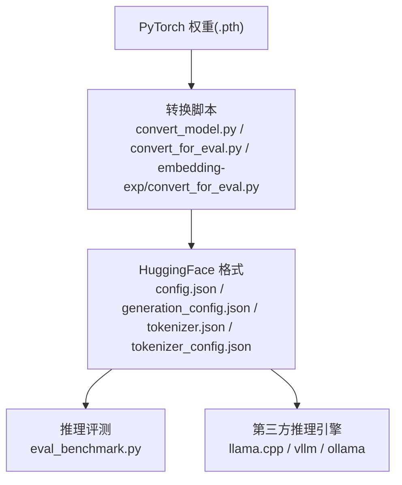
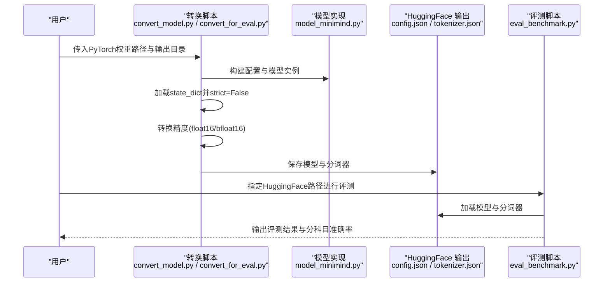
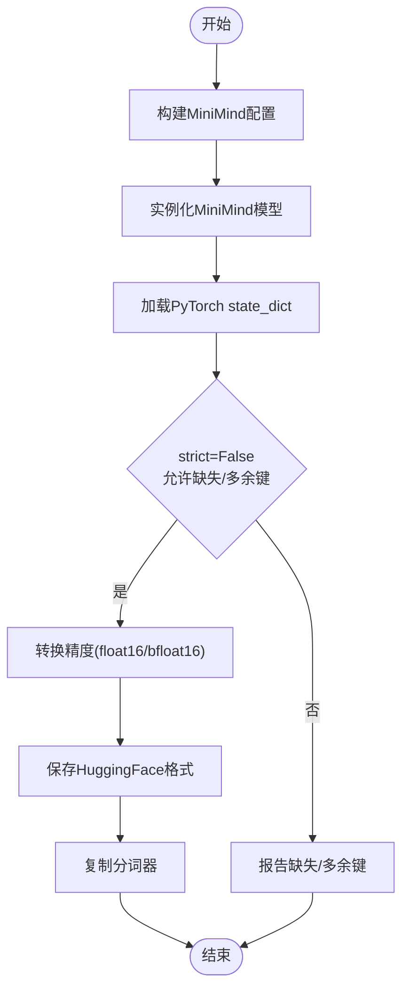
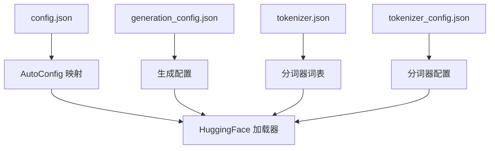
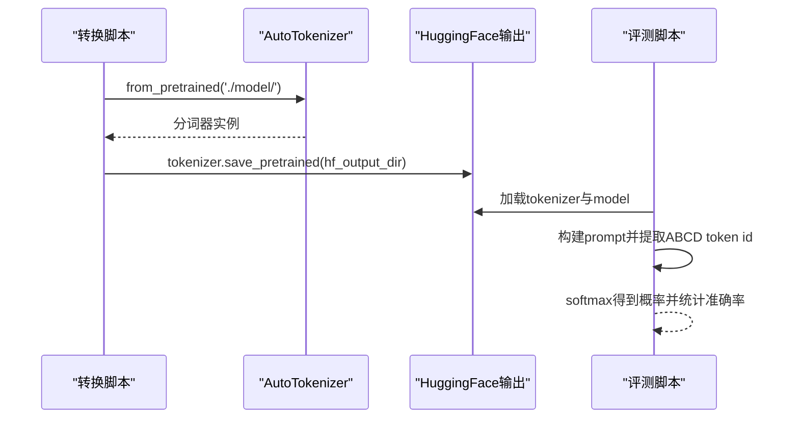
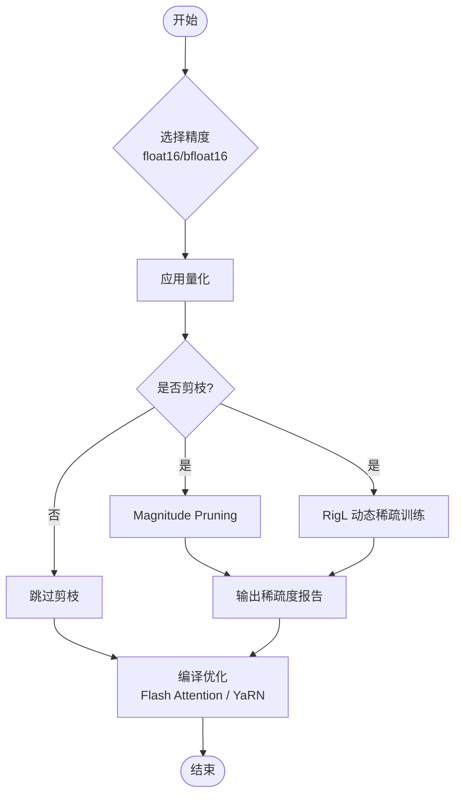
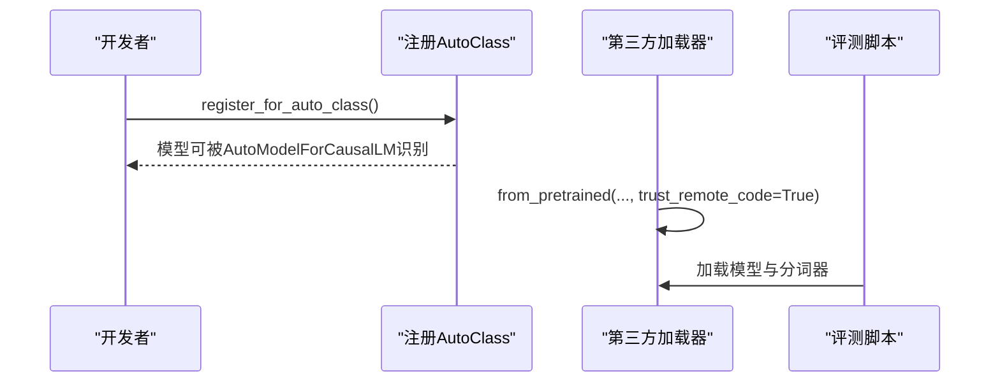
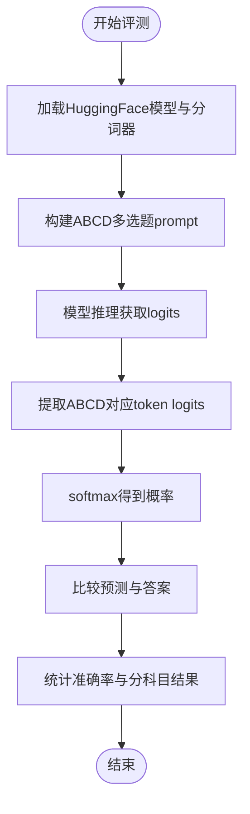
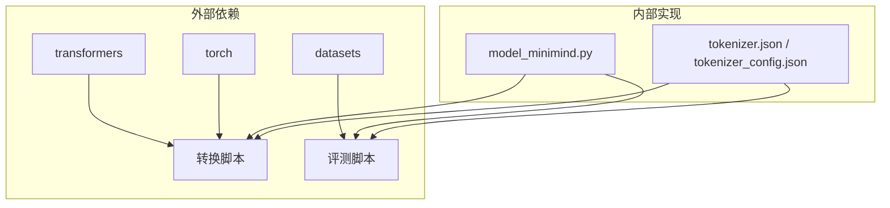

# 模型转换工具

<cite>
**本文引用的文件**
- [convert_model.py](file://scripts/convert_model.py)
- [convert_for_eval.py](file://DST-train/convert_for_eval.py)
- [convert_for_eval.py](file://embedding-exp/convert_for_eval.py)
- [model_minimind.py](file://model/model_minimind.py)
- [model_minimind.py](file://DST-train/model/baseline_hf/model_minimind.py)
- [tokenizer.json](file://model/tokenizer.json)
- [tokenizer_config.json](file://model/tokenizer_config.json)
- [config.json](file://DST-train/model/baseline_hf/config.json)
- [generation_config.json](file://DST-train/model/baseline_hf/generation_config.json)
- [eval_benchmark.py](file://eval_benchmark.py)
- [dst_hooks.py](file://DST-train/dst_hooks.py)
- [dst_pruning.py](file://DST-train/dst_pruning.py)
- [requirements.txt](file://requirements.txt)
- [README.md](file://README.md)
</cite>

## 目录
1. [简介](#简介)
2. [项目结构](#项目结构)
3. [核心组件](#核心组件)
4. [架构总览](#架构总览)
5. [详细组件分析](#详细组件分析)
6. [依赖分析](#依赖分析)
7. [性能考量](#性能考量)
8. [故障排查指南](#故障排查指南)
9. [结论](#结论)
10. [附录](#附录)

## 简介
本文件系统化梳理模型转换工具的技术细节，围绕权重格式转换、模型架构适配、分词器与元数据处理、性能优化策略（量化、剪枝、编译优化）、跨框架兼容性映射、部署到不同推理引擎的转换流程，以及转换质量验证与错误诊断方法展开。文档以仓库中的脚本与模型实现为依据，结合训练与评测流程，给出可操作的转换指南与最佳实践。

## 项目结构
本项目围绕“从PyTorch权重到HuggingFace格式再到推理引擎”的转换链路组织，关键文件与职责如下：
- 转换脚本
  - scripts/convert_model.py：提供MiniMind与Llama结构的双向转换入口，支持精度转换与分词器复制。
  - DST-train/convert_for_eval.py：将DST训练产出的PyTorch权重转换为HuggingFace格式，支持baseline/dst系列模型。
  - embedding-exp/convert_for_eval.py：将嵌入实验的PyTorch权重转换为HuggingFace格式，支持方案B/C1/C2。
- 模型实现
  - model/model_minimind.py：MiniMind模型与配置类，定义注意力、FFN、MoE门控与推理主干。
  - DST-train/model/baseline_hf/model_minimind.py：HuggingFace兼容的MiniMind实现（与训练阶段一致）。
- 分词器与元数据
  - model/tokenizer.json 与 tokenizer_config.json：分词器词表与配置。
  - DST-train/model/baseline_hf/config.json 与 generation_config.json：HuggingFace格式的配置与生成配置。
- 评测与诊断
  - eval_benchmark.py：加载HuggingFace格式模型进行基准评测。
  - DST-train/dst_hooks.py 与 dst_pruning.py：训练期诊断与剪枝工具，支撑转换前的质量评估与结构适配。

**图表来源**
- [convert_model.py:15-76](file://scripts/convert_model.py#L15-L76)
- [convert_for_eval.py:30-83](file://DST-train/convert_for_eval.py#L30-L83)
- [convert_for_eval.py:21-85](file://embedding-exp/convert_for_eval.py#L21-L85)
- [eval_benchmark.py:18-31](file://eval_benchmark.py#L18-L31)

**章节来源**
- [convert_model.py:15-76](file://scripts/convert_model.py#L15-L76)
- [convert_for_eval.py:30-83](file://DST-train/convert_for_eval.py#L30-L83)
- [convert_for_eval.py:21-85](file://embedding-exp/convert_for_eval.py#L21-L85)
- [eval_benchmark.py:18-31](file://eval_benchmark.py#L18-L31)

## 核心组件
- 权重转换器
  - MiniMind到HuggingFace：注册AutoClass，构建模型实例，加载state_dict，转换精度，保存模型与分词器。
  - Llama结构兼容：根据MiniMind配置生成LlamaConfig，构建LlamaForCausalLM，加载权重并保存。
  - 反向转换：从HuggingFace加载模型，导出state_dict回PyTorch格式。
- 模型架构适配
  - 配置文件生成：config.json与generation_config.json，包含模型类型、注意力头数、层数、RoPE参数、MoE开关等。
  - 分词器适配：tokenizer.json与tokenizer_config.json，复制到输出目录，确保推理一致性。
- 性能优化
  - 量化：支持float16/bfloat16保存精度。
  - 剪枝：Magnitude Pruning与RigL动态稀疏训练，支持转换前后稀疏度统计与报告。
  - 编译优化：Flash Attention开关与YaRN RoPE扩展配置。
- 兼容性处理
  - 参数映射：将MiniMind权重映射到Llama结构，保持关键维度一致。
  - 接口适配：通过AutoClass注册与trust_remote_code，确保第三方加载器可识别。
- 转换质量验证
  - 评测驱动：eval_benchmark.py加载转换后的模型，进行多选题评测，输出准确率与分科目结果。
  - 训练期诊断：MBE监控与假死神经元检测，辅助判断模型学习状态与结构健康度。

**章节来源**
- [convert_model.py:15-76](file://scripts/convert_model.py#L15-L76)
- [convert_for_eval.py:30-83](file://DST-train/convert_for_eval.py#L30-L83)
- [convert_for_eval.py:21-85](file://embedding-exp/convert_for_eval.py#L21-L85)
- [model_minimind.py:8-78](file://model/model_minimind.py#L8-L78)
- [config.json:1-37](file://DST-train/model/baseline_hf/config.json#L1-L37)
- [generation_config.json:1-9](file://DST-train/model/baseline_hf/generation_config.json#L1-L9)
- [tokenizer.json:1-800](file://model/tokenizer.json#L1-L800)
- [tokenizer_config.json:1-43](file://model/tokenizer_config.json#L1-L43)
- [eval_benchmark.py:18-31](file://eval_benchmark.py#L18-L31)
- [dst_hooks.py:10-160](file://DST-train/dst_hooks.py#L10-L160)
- [dst_pruning.py:9-118](file://DST-train/dst_pruning.py#L9-L118)

## 架构总览
下图展示从PyTorch权重到HuggingFace格式再到推理评测的整体流程，以及与第三方推理引擎的对接关系。

**图表来源**
- [convert_model.py:15-76](file://scripts/convert_model.py#L15-L76)
- [convert_for_eval.py:30-83](file://DST-train/convert_for_eval.py#L30-L83)
- [model_minimind.py:443-477](file://model/model_minimind.py#L443-L477)
- [eval_benchmark.py:18-31](file://eval_benchmark.py#L18-L31)

## 详细组件分析

### 组件A：权重格式转换机制
- 转换流程
  - 注册AutoClass：MiniMindConfig与MiniMindForCausalLM注册为AutoModelForCausalLM，确保第三方加载器可识别。
  - 构建模型：根据配置实例化模型，加载state_dict，允许缺失/多余键（strict=False）。
  - 精度转换：将模型权重转换为float16或bfloat16，降低存储与传输成本。
  - 保存与复制：保存模型与分词器到目标目录，便于后续评测与部署。
- Llama结构兼容
  - 依据MiniMind配置生成LlamaConfig，构建LlamaForCausalLM，加载state_dict并保存，实现第三方生态兼容。
- 反向转换
  - 从HuggingFace加载模型，导出state_dict回PyTorch格式，便于在训练或推理链路间切换。

**图表来源**
- [convert_model.py:15-28](file://scripts/convert_model.py#L15-L28)
- [convert_model.py:32-55](file://scripts/convert_model.py#L32-L55)

**章节来源**
- [convert_model.py:15-76](file://scripts/convert_model.py#L15-L76)

### 组件B：模型架构适配与配置生成
- 配置文件生成
  - config.json：包含模型类型、层数、注意力头数、隐藏维度、中间维度、RoPE参数、MoE开关等。
  - generation_config.json：生成相关配置（如eos_token_id等）。
- 分词器适配
  - tokenizer.json：包含合并规则、特殊token等。
  - tokenizer_config.json：包含chat_template、bos/eos等配置。
- 自动映射
  - 通过AutoMap与AutoClass注册，第三方加载器可自动识别模型类型与配置。

**图表来源**
- [config.json:1-37](file://DST-train/model/baseline_hf/config.json#L1-L37)
- [generation_config.json:1-9](file://DST-train/model/baseline_hf/generation_config.json#L1-L9)
- [tokenizer.json:1-800](file://model/tokenizer.json#L1-L800)
- [tokenizer_config.json:1-43](file://model/tokenizer_config.json#L1-L43)

**章节来源**
- [config.json:1-37](file://DST-train/model/baseline_hf/config.json#L1-L37)
- [generation_config.json:1-9](file://DST-train/model/baseline_hf/generation_config.json#L1-L9)
- [tokenizer.json:1-800](file://model/tokenizer.json#L1-L800)
- [tokenizer_config.json:1-43](file://model/tokenizer_config.json#L1-L43)

### 组件C：分词器适配与元数据处理
- 分词器复制
  - 转换脚本从./model/加载AutoTokenizer，复制到HuggingFace输出目录，确保推理一致性。
- 元数据处理
  - chat_template、bos/eos、model_max_length等在tokenizer_config.json中定义，影响对话格式与最大长度。
- 评测适配
  - eval_benchmark.py加载分词器，构建prompt，提取A/B/C/D对应token id，进行概率对比评测。

**图表来源**
- [convert_for_eval.py:78-82](file://DST-train/convert_for_eval.py#L78-L82)
- [eval_benchmark.py:34-52](file://eval_benchmark.py#L34-L52)

**章节来源**
- [convert_for_eval.py:78-82](file://DST-train/convert_for_eval.py#L78-L82)
- [eval_benchmark.py:34-52](file://eval_benchmark.py#L34-L52)

### 组件D：性能优化策略
- 量化
  - 支持float16与bfloat16两种精度保存，降低显存与存储占用。
- 剪枝
  - Magnitude Pruner：按权重绝对值阈值进行稀疏化，支持剪枝前后稀疏度统计与报告。
  - RigL：动态稀疏训练，周期性剪枝与生长，固定掩码后停止调整。
- 编译优化
  - Flash Attention开关：在满足条件时使用scaled_dot_product_attention，提升注意力计算效率。
  - YaRN RoPE扩展：通过rope_scaling配置实现长序列外推。

**图表来源**
- [convert_model.py:68-69](file://scripts/convert_model.py#L68-L69)
- [dst_pruning.py:23-48](file://DST-train/dst_pruning.py#L23-L48)
- [dst_hooks.py:57-84](file://DST-train/dst_hooks.py#L57-L84)
- [model_minimind.py:166-226](file://model/model_minimind.py#L166-L226)

**章节来源**
- [convert_model.py:68-69](file://scripts/convert_model.py#L68-L69)
- [dst_pruning.py:23-48](file://DST-train/dst_pruning.py#L23-L48)
- [dst_hooks.py:57-84](file://DST-train/dst_hooks.py#L57-L84)
- [model_minimind.py:166-226](file://model/model_minimind.py#L166-L226)

### 组件E：兼容性处理与接口适配
- 参数映射
  - 将MiniMind的hidden_size、num_hidden_layers、num_attention_heads、num_key_value_heads等映射到LlamaConfig，确保第三方加载器可正确初始化。
- 接口适配
  - 通过MiniMindConfig.register_for_auto_class与MiniMindForCausalLM.register_for_auto_class，实现AutoModelForCausalLM自动识别。
  - 评测与加载时使用trust_remote_code=True，确保第三方加载器可执行远程代码。

**图表来源**
- [convert_model.py:16-18](file://scripts/convert_model.py#L16-L18)
- [convert_for_eval.py:52-54](file://DST-train/convert_for_eval.py#L52-L54)
- [eval_benchmark.py:20-28](file://eval_benchmark.py#L20-L28)

**章节来源**
- [convert_model.py:16-18](file://scripts/convert_model.py#L16-L18)
- [convert_for_eval.py:52-54](file://DST-train/convert_for_eval.py#L52-L54)
- [eval_benchmark.py:20-28](file://eval_benchmark.py#L20-L28)

### 组件F：转换质量验证与错误诊断
- 转换质量验证
  - 评测驱动：eval_benchmark.py加载HuggingFace格式模型，进行C-Eval与CMMLU评测，输出总体与分科目准确率。
- 错误诊断
  - 训练期诊断：MBE监控器计算矩阵基熵，判断模型是否达到学习饱和；假死神经元检测器识别并唤醒大量零激活神经元。
  - 剪枝诊断：Magnitude Pruner与RigL提供剪枝前后稀疏度统计与报告，辅助结构健康评估。

**图表来源**
- [eval_benchmark.py:55-127](file://eval_benchmark.py#L55-L127)

**章节来源**
- [eval_benchmark.py:55-127](file://eval_benchmark.py#L55-L127)
- [dst_hooks.py:85-154](file://DST-train/dst_hooks.py#L85-L154)
- [dst_pruning.py:85-118](file://DST-train/dst_pruning.py#L85-L118)

## 依赖分析
- 外部依赖
  - transformers、torch、datasets、accelerate等，用于模型加载、权重保存、数据集加载与分布式训练。
- 内部依赖
  - 转换脚本依赖model_minimind.py中的配置与模型实现，确保配置与权重结构一致。
  - 评测脚本依赖HuggingFace格式的config.json、tokenizer.json等元数据。

**图表来源**
- [requirements.txt:1-31](file://requirements.txt#L1-L31)
- [model_minimind.py:8-78](file://model/model_minimind.py#L8-L78)
- [tokenizer.json:1-800](file://model/tokenizer.json#L1-L800)
- [tokenizer_config.json:1-43](file://model/tokenizer_config.json#L1-L43)

**章节来源**
- [requirements.txt:1-31](file://requirements.txt#L1-L31)
- [model_minimind.py:8-78](file://model/model_minimind.py#L8-L78)
- [tokenizer.json:1-800](file://model/tokenizer.json#L1-L800)
- [tokenizer_config.json:1-43](file://model/tokenizer_config.json#L1-L43)

## 性能考量
- 精度选择
  - float16适合大多数推理场景，bfloat16在部分硬件上更稳定；两者均可降低显存占用。
- 注意力优化
  - Flash Attention在满足条件时使用原生scaled_dot_product_attention，显著提升注意力计算效率。
- 结构优化
  - YaRN RoPE扩展提升长序列外推能力，减少截断误差。
- 剪枝与稀疏
  - 适度剪枝可降低参数与计算量，但需注意最大稀疏度限制，避免性能严重下降。

[本节为通用指导，无需特定文件引用]

## 故障排查指南
- 加载失败
  - 确认HuggingFace格式目录包含config.json、generation_config.json与tokenizer.json/tokenizer_config.json。
  - 使用trust_remote_code=True加载模型，确保AutoClass注册生效。
- 精度问题
  - 若显存不足，尝试bfloat16；若数值不稳定，检查权重是否正确转换为float16。
- 剪枝异常
  - 检查剪枝比例是否超过最大限制；确认掩码应用与保存路径正确。
- 评测异常
  - 确认分词器chat_template与ABCD token映射正确；检查max_length与padding策略。

**章节来源**
- [eval_benchmark.py:20-28](file://eval_benchmark.py#L20-L28)
- [dst_pruning.py:34-36](file://DST-train/dst_pruning.py#L34-L36)

## 结论
本工具链以PyTorch权重为核心，通过注册AutoClass与配置文件生成，实现到HuggingFace格式的稳定转换；结合分词器与元数据复制，确保推理一致性。在性能层面，提供量化、剪枝与编译优化策略；在兼容性层面，通过Llama结构映射与接口适配，打通第三方推理引擎。评测与诊断模块为转换质量提供闭环保障，适用于从训练到部署的全链路场景。

[本节为总结性内容，无需特定文件引用]

## 附录
- 使用指南（示例）
  - 将DST训练权重转换为HuggingFace格式：使用DST-train/convert_for_eval.py，指定model_dir、model_type、hidden_size、num_hidden_layers、use_moe、sparsity、dtype与tokenizer_path。
  - 将嵌入实验权重转换为HuggingFace格式：使用embedding-exp/convert_for_eval.py，指定model_dir、embed_type、hidden_size、num_hidden_layers、use_moe、dtype与tokenizer_path。
  - 将PyTorch权重转换为Llama结构：使用scripts/convert_model.py，调用convert_torch2transformers_llama，指定输入权重与输出目录。
  - 评测转换后的模型：使用eval_benchmark.py，指定--model_path与--dataset，支持ceval与cmmlu。
- 兼容性提示
  - 为兼容llama.cpp、vllm、ollama等第三方生态，需确保config.json与tokenizer配置正确，且使用register_for_auto_class注册模型类型。

**章节来源**
- [convert_for_eval.py:85-150](file://DST-train/convert_for_eval.py#L85-L150)
- [convert_for_eval.py:87-131](file://embedding-exp/convert_for_eval.py#L87-L131)
- [convert_model.py:65-76](file://scripts/convert_model.py#L65-L76)
- [eval_benchmark.py:234-266](file://eval_benchmark.py#L234-L266)
- [README.md:121-122](file://README.md#L121-L122)