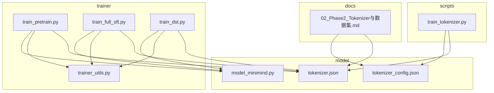
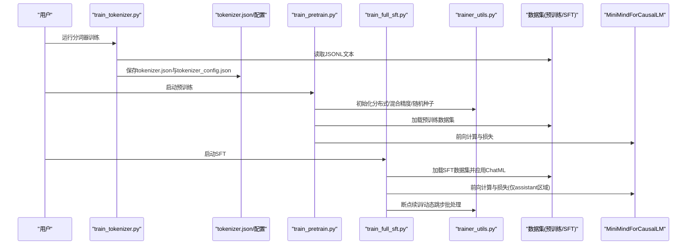
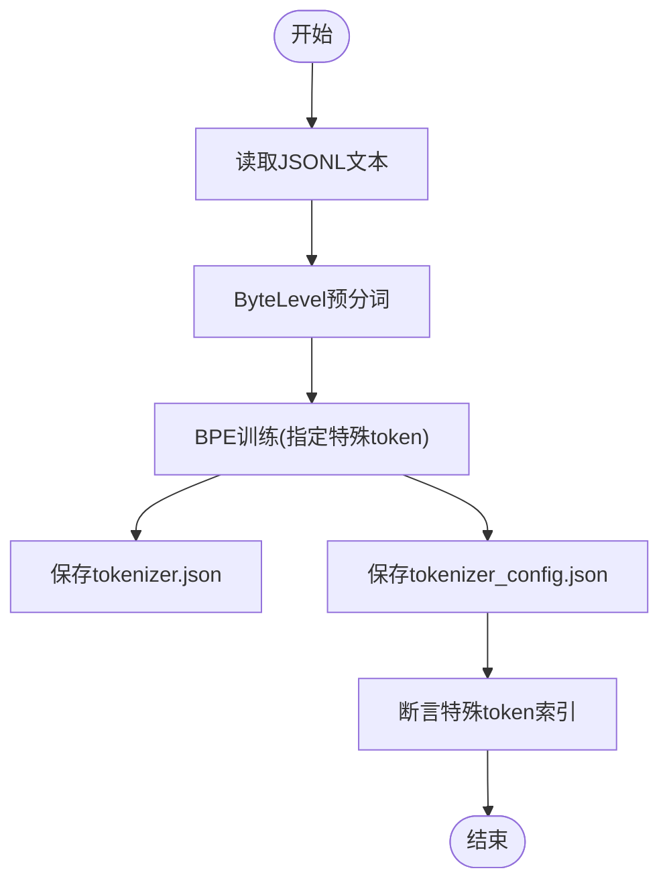
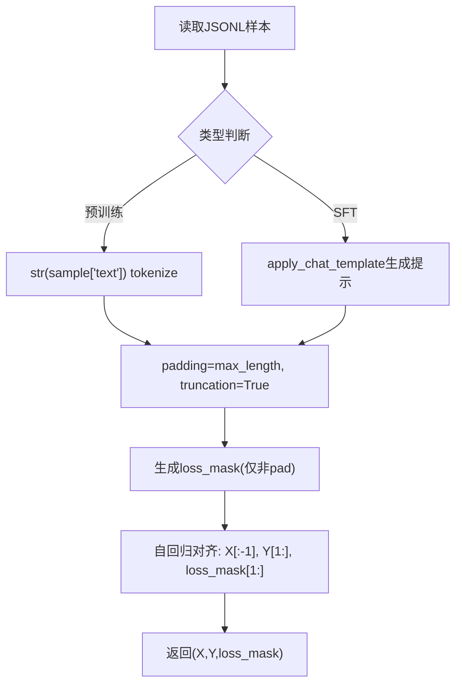
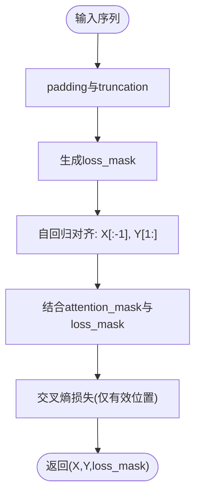
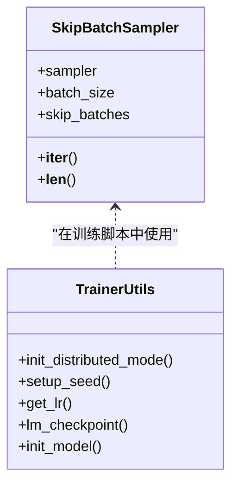
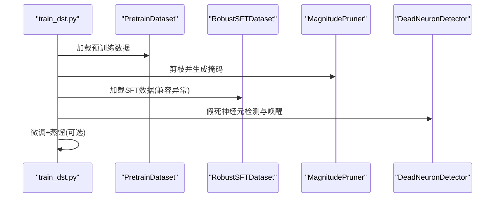
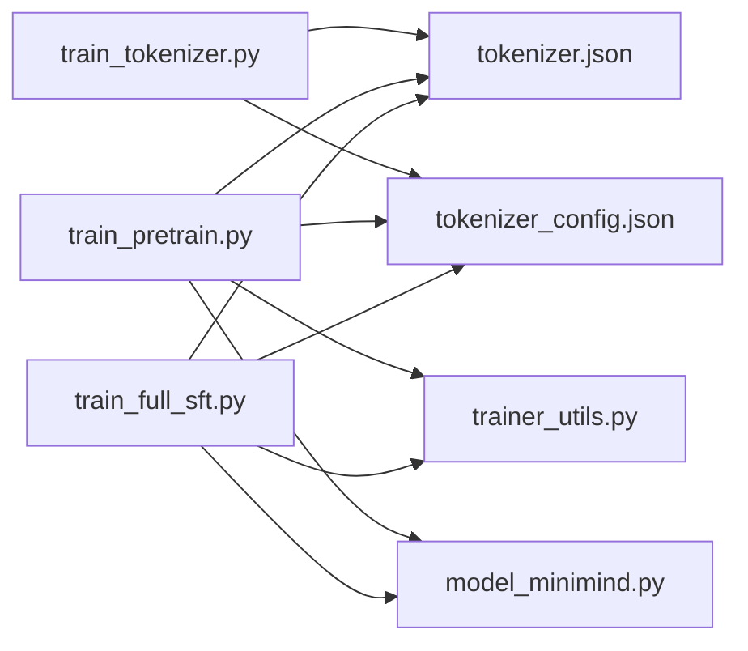

# 数据处理模块

<cite>
**本文引用的文件**
- [scripts/train_tokenizer.py](file://scripts/train_tokenizer.py)
- [model/tokenizer.json](file://model/tokenizer.json)
- [model/tokenizer_config.json](file://model/tokenizer_config.json)
- [trainer/trainer_utils.py](file://trainer/trainer_utils.py)
- [trainer/train_pretrain.py](file://trainer/train_pretrain.py)
- [trainer/train_full_sft.py](file://trainer/train_full_sft.py)
- [trainer/train_dst.py](file://trainer/train_dst.py)
- [model/model_minimind.py](file://model/model_minimind.py)
- [docs/02_Phase2_Tokenizer与数据集.md](file://docs/02_Phase2_Tokenizer与数据集.md)
- [README.md](file://README.md)
</cite>

## 目录
1. [引言](#引言)
2. [项目结构](#项目结构)
3. [核心组件](#核心组件)
4. [架构总览](#架构总览)
5. [详细组件分析](#详细组件分析)
6. [依赖分析](#依赖分析)
7. [性能考量](#性能考量)
8. [故障排查指南](#故障排查指南)
9. [结论](#结论)
10. [附录](#附录)

## 引言
本技术文档聚焦MiniMind数据处理模块，围绕分词器训练（BPE算法、词汇表构建、特殊token处理）、数据集格式与处理流程（JSON格式、ChatML模板、数据清洗与预处理）、自回归数据处理（序列截断、填充策略、注意力掩码生成）、以及数据加载与批处理机制（动态批处理、内存管理、断点续训）展开。文档旨在帮助读者从原理到实践全面掌握MiniMind的数据管线，并提供配置示例、数据格式规范与质量控制指南。

## 项目结构
数据处理模块横跨以下关键目录与文件：
- scripts：分词器训练脚本，负责BPE训练、特殊token注入与配置导出
- model：分词器与模型配置文件，包含tokenizer.json、tokenizer_config.json、模型配置与实现
- trainer：训练脚本与工具，包含数据加载、批处理、断点续训、分布式训练等
- docs：官方文档，包含数据集格式、ChatML模板与数据处理细节

**图表来源**
- [scripts/train_tokenizer.py:1-148](file://scripts/train_tokenizer.py#L1-L148)
- [model/tokenizer.json:1-800](file://model/tokenizer.json#L1-L800)
- [model/tokenizer_config.json:1-43](file://model/tokenizer_config.json#L1-L43)
- [model/model_minimind.py:1-474](file://model/model_minimind.py#L1-L474)
- [trainer/trainer_utils.py:1-139](file://trainer/trainer_utils.py#L1-L139)
- [trainer/train_pretrain.py:1-162](file://trainer/train_pretrain.py#L1-L162)
- [trainer/train_full_sft.py:1-163](file://trainer/train_full_sft.py#L1-L163)
- [trainer/train_dst.py:1-472](file://trainer/train_dst.py#L1-L472)
- [docs/02_Phase2_Tokenizer与数据集.md:1-424](file://docs/02_Phase2_Tokenizer与数据集.md#L1-L424)

**章节来源**
- [scripts/train_tokenizer.py:1-148](file://scripts/train_tokenizer.py#L1-L148)
- [model/tokenizer.json:1-800](file://model/tokenizer.json#L1-L800)
- [model/tokenizer_config.json:1-43](file://model/tokenizer_config.json#L1-L43)
- [model/model_minimind.py:1-474](file://model/model_minimind.py#L1-L474)
- [trainer/trainer_utils.py:1-139](file://trainer/trainer_utils.py#L1-L139)
- [trainer/train_pretrain.py:1-162](file://trainer/train_pretrain.py#L1-L162)
- [trainer/train_full_sft.py:1-163](file://trainer/train_full_sft.py#L1-L163)
- [trainer/train_dst.py:1-472](file://trainer/train_dst.py#L1-L472)
- [docs/02_Phase2_Tokenizer与数据集.md:1-424](file://docs/02_Phase2_Tokenizer与数据集.md#L1-L424)
- [README.md:425-606](file://README.md#L425-L606)

## 核心组件
- 分词器训练与配置
  - BPE算法训练、特殊token注入、ByteLevel预分词、解码器配置
  - 词表大小、特殊token索引、ChatML模板、模型最大长度
- 数据集与数据流
  - 预训练数据集（纯文本）、SFT数据集（对话+工具调用）、DPO/RLAIF数据集
  - ChatML模板应用、loss mask生成、自回归X/Y对齐
- 训练与批处理
  - DataLoader与分布式采样、动态跳步批处理、混合精度、梯度累积、断点续训
- 模型与推理
  - MiniMindConfig与MiniMindForCausalLM，注意力掩码与KV缓存

**章节来源**
- [scripts/train_tokenizer.py:15-110](file://scripts/train_tokenizer.py#L15-L110)
- [model/tokenizer.json:1-800](file://model/tokenizer.json#L1-L800)
- [model/tokenizer_config.json:1-43](file://model/tokenizer_config.json#L1-L43)
- [docs/02_Phase2_Tokenizer与数据集.md:249-369](file://docs/02_Phase2_Tokenizer与数据集.md#L249-L369)
- [trainer/trainer_utils.py:114-139](file://trainer/trainer_utils.py#L114-L139)
- [trainer/train_pretrain.py:23-80](file://trainer/train_pretrain.py#L23-L80)
- [trainer/train_full_sft.py:23-81](file://trainer/train_full_sft.py#L23-L81)
- [model/model_minimind.py:441-474](file://model/model_minimind.py#L441-L474)

## 架构总览
数据处理模块的端到端流程如下：
- 分词器训练：从JSONL文本读取，ByteLevel预分词，BPE训练，特殊token注入，保存tokenizer.json与tokenizer_config.json
- 数据加载：训练脚本加载数据集，应用ChatML模板，生成自回归样本与loss mask
- 训练循环：混合精度、梯度累积、分布式采样、动态跳步批处理、断点续训
- 模型推理：Attention掩码与KV缓存，支持因果掩码与扩展注意力掩码

**图表来源**
- [scripts/train_tokenizer.py:15-110](file://scripts/train_tokenizer.py#L15-L110)
- [trainer/train_pretrain.py:106-162](file://trainer/train_pretrain.py#L106-L162)
- [trainer/train_full_sft.py:107-163](file://trainer/train_full_sft.py#L107-L163)
- [trainer/trainer_utils.py:28-46](file://trainer/trainer_utils.py#L28-L46)
- [model/model_minimind.py:441-474](file://model/model_minimind.py#L441-L474)

## 详细组件分析

### 分词器训练与BPE实现
- BPE算法流程
  - ByteLevel预分词，将文本拆分为字符级token
  - 统计相邻token对频率，合并高频对，直至达到目标词表大小
- 特殊token与索引
  - 特殊token列表包含空token、起始标记、结束标记
  - 训练后断言特殊token索引，确保与配置一致
- 配置导出
  - 保存tokenizer.json与tokenizer_config.json
  - 配置包含add_bos_token/eos_token、pad_token、unk_token、chat_template、model_max_length等
- ChatML模板
  - tokenizer_config.json内嵌Jinja模板，支持system、user、assistant、tool、tools等角色
  - 支持工具调用与思维链<think>标签

**图表来源**
- [scripts/train_tokenizer.py:15-110](file://scripts/train_tokenizer.py#L15-L110)

**章节来源**
- [scripts/train_tokenizer.py:15-110](file://scripts/train_tokenizer.py#L15-L110)
- [model/tokenizer.json:1-800](file://model/tokenizer.json#L1-L800)
- [model/tokenizer_config.json:1-43](file://model/tokenizer_config.json#L1-L43)
- [docs/02_Phase2_Tokenizer与数据集.md:49-86](file://docs/02_Phase2_Tokenizer与数据集.md#L49-L86)

### 数据集格式与处理流程
- 预训练数据集（pretrain_t2t_*）
  - JSONL格式，每行为{"text": "..."}的纯文本
  - 训练时对text进行tokenize，padding策略为max_length，loss_mask仅对非pad位置生效
  - 自回归：X=input_ids[:-1]，Y=input_ids[1:]，loss_mask去掉首token
- SFT数据集（sft_t2t_*）
  - JSONL格式，每行为{"conversations": [...]}
  - 使用apply_chat_template生成ChatML提示，loss_mask仅在assistant回复区域为1
  - 支持tools与tool_calls字段，模板中包含工具调用与思维链<think>标签
- DPO/RLAIF数据集
  - DPO：每条包含chosen与rejected两组对话
  - RLAIF：返回prompt与answer文本，训练时再进行tokenize

**图表来源**
- [docs/02_Phase2_Tokenizer与数据集.md:249-369](file://docs/02_Phase2_Tokenizer与数据集.md#L249-L369)

**章节来源**
- [docs/02_Phase2_Tokenizer与数据集.md:109-176](file://docs/02_Phase2_Tokenizer与数据集.md#L109-L176)
- [docs/02_Phase2_Tokenizer与数据集.md:249-369](file://docs/02_Phase2_Tokenizer与数据集.md#L249-L369)
- [README.md:466-542](file://README.md#L466-L542)

### 自回归数据处理与注意力掩码
- 序列截断与填充
  - 预训练：padding='max_length'，truncation=True
  - SFT：按max_length截断，ChatML模板生成的序列长度可能超过max_length，需在数据侧控制
- 损失掩码（loss mask）
  - 预训练：非pad位置为1，pad位置为0
  - SFT：仅assistant回复区域为1，user/system等区域为0，确保模型仅学习回答部分
- 注意力掩码生成
  - 模型内部支持因果掩码与扩展注意力掩码，结合loss_mask实现精确的损失计算
  - KV缓存与past_key_values用于推理阶段的高效生成

**图表来源**
- [docs/02_Phase2_Tokenizer与数据集.md:249-369](file://docs/02_Phase2_Tokenizer与数据集.md#L249-L369)
- [model/model_minimind.py:166-224](file://model/model_minimind.py#L166-L224)

**章节来源**
- [docs/02_Phase2_Tokenizer与数据集.md:249-369](file://docs/02_Phase2_Tokenizer与数据集.md#L249-L369)
- [model/model_minimind.py:166-224](file://model/model_minimind.py#L166-L224)

### 数据加载与批处理机制
- DataLoader与分布式采样
  - 训练脚本使用DistributedSampler进行分布式数据划分
  - num_workers与pin_memory提升IO吞吐
- 动态跳步批处理（SkipBatchSampler）
  - 支持从断点续训时跳过已完成的step，避免重复计算
- 混合精度与梯度累积
  - autocast与GradScaler在GPU上使用bf16/f16，降低显存占用
  - accumulation_steps减少显存峰值，提升batch size
- 断点续训
  - 自动保存与恢复模型、优化器、scaler与训练进度
  - 支持跨GPU数量恢复，自动调整step

**图表来源**
- [trainer/trainer_utils.py:114-139](file://trainer/trainer_utils.py#L114-L139)
- [trainer/trainer_utils.py:28-98](file://trainer/trainer_utils.py#L28-L98)

**章节来源**
- [trainer/trainer_utils.py:114-139](file://trainer/trainer_utils.py#L114-L139)
- [trainer/train_pretrain.py:132-162](file://trainer/train_pretrain.py#L132-L162)
- [trainer/train_full_sft.py:133-163](file://trainer/train_full_sft.py#L133-L163)
- [trainer/train_dst.py:396-472](file://trainer/train_dst.py#L396-L472)

### DST动态稀疏训练中的数据处理
- 预训练阶段（RigL动态稀疏）
  - 使用PretrainDataset，自回归损失，loss_mask仅对非pad位置有效
- 剪枝阶段（Magnitude Pruning）
  - 保存教师模型状态，生成剪枝掩码，保存剪枝后的模型
- 恢复阶段（微调+蒸馏+假死神经元唤醒）
  - 使用RobustSFTDataset兼容带tools字段的异常数据
  - 可选知识蒸馏，使用distillation_loss（KL散度）

**图表来源**
- [trainer/train_dst.py:36-57](file://trainer/train_dst.py#L36-L57)
- [trainer/train_dst.py:143-168](file://trainer/train_dst.py#L143-L168)
- [trainer/train_dst.py:174-264](file://trainer/train_dst.py#L174-L264)

**章节来源**
- [trainer/train_dst.py:36-57](file://trainer/train_dst.py#L36-L57)
- [trainer/train_dst.py:143-168](file://trainer/train_dst.py#L143-L168)
- [trainer/train_dst.py:174-264](file://trainer/train_dst.py#L174-L264)

## 依赖分析
- 分词器依赖
  - scripts/train_tokenizer.py依赖tokenizers库进行BPE训练与配置导出
  - model/tokenizer.json与tokenizer_config.json为训练脚本输出
- 训练脚本依赖
  - trainer/train_pretrain.py与trainer/train_full_sft.py依赖AutoTokenizer加载分词器
  - 两者均依赖trainer/trainer_utils.py进行分布式、混合精度、断点续训等
- 模型依赖
  - model/model_minimind.py定义MiniMindForCausalLM，训练脚本通过init_model加载

**图表来源**
- [scripts/train_tokenizer.py:15-110](file://scripts/train_tokenizer.py#L15-L110)
- [trainer/train_pretrain.py:101-135](file://trainer/train_pretrain.py#L101-L135)
- [trainer/train_full_sft.py:132-136](file://trainer/train_full_sft.py#L132-L136)
- [trainer/trainer_utils.py:100-112](file://trainer/trainer_utils.py#L100-L112)
- [model/model_minimind.py:441-474](file://model/model_minimind.py#L441-L474)

**章节来源**
- [scripts/train_tokenizer.py:15-110](file://scripts/train_tokenizer.py#L15-L110)
- [trainer/train_pretrain.py:101-135](file://trainer/train_pretrain.py#L101-L135)
- [trainer/train_full_sft.py:132-136](file://trainer/train_full_sft.py#L132-L136)
- [trainer/trainer_utils.py:100-112](file://trainer/trainer_utils.py#L100-L112)
- [model/model_minimind.py:441-474](file://model/model_minimind.py#L441-L474)

## 性能考量
- 显存与吞吐
  - 混合精度（bf16/f16）与梯度累积降低显存峰值
  - DataLoader的pin_memory与num_workers提升IO
- 截断与填充
  - 合理设置max_seq_len，避免过度padding造成算力浪费
  - ChatML模板长度控制，确保SFT样本在max_seq_len范围内
- 分布式与断点续训
  - DDP分布式训练提升吞吐
  - 断点续训避免重复计算，提高长期训练稳定性

[本节为通用性能指导，不直接分析具体文件]

## 故障排查指南
- 分词器相关
  - 特殊token索引不匹配：确认tokenizer_config.json中的特殊token索引与训练脚本断言一致
  - ChatML模板异常：使用RobustSFTDataset回退方案，移除异常字段后重试
- 数据加载相关
  - DataLoader报错：检查num_workers与pin_memory设置，Windows建议num_workers=0
  - 分布式采样异常：确认DistributedSampler初始化与rank设置
- 训练相关
  - 显存不足：减小batch_size或增大accumulation_steps
  - 断点续训失败：检查checkpoint文件命名与保存路径

**章节来源**
- [scripts/train_tokenizer.py:49-53](file://scripts/train_tokenizer.py#L49-L53)
- [trainer/train_dst.py:36-57](file://trainer/train_dst.py#L36-L57)
- [trainer/train_pretrain.py:154-162](file://trainer/train_pretrain.py#L154-L162)
- [trainer/trainer_utils.py:47-98](file://trainer/trainer_utils.py#L47-L98)

## 结论
MiniMind数据处理模块以BPE分词器为核心，结合ChatML模板与严格的loss mask设计，实现了从预训练到SFT的高质量数据流水线。通过分布式训练、混合精度、动态跳步批处理与断点续训等优化手段，模块在小模型与有限资源条件下仍能高效稳定地完成训练。建议在实际部署中严格遵循数据格式规范与质量控制流程，确保模型性能与一致性。

[本节为总结性内容，不直接分析具体文件]

## 附录

### 配置示例与最佳实践
- 分词器配置要点
  - 词表大小：6400
  - 特殊token：空token、<|im_start|>、<|im_end|>
  - ChatML模板：内置Jinja模板，支持tools与思维链<think>
- 训练参数建议
  - 预训练：batch_size=32，accumulation_steps=8，max_seq_len=512
  - SFT：batch_size=16，accumulation_steps=1，max_seq_len=512
  - 混合精度：bf16（CPU为nullcontext）
- 数据格式规范
  - 预训练：{"text": "..."}
  - SFT：{"conversations": [{"role": "...", "content": "..."}]}
  - DPO：{"chosen": [...], "rejected": [...]}
- 质量控制指南
  - 控制样本长度，避免过长导致截断
  - 清洗噪声与符号污染，确保ChatML模板稳定
  - 使用RobustSFTDataset兼容异常数据

**章节来源**
- [scripts/train_tokenizer.py:23-58](file://scripts/train_tokenizer.py#L23-L58)
- [model/tokenizer_config.json:32-43](file://model/tokenizer_config.json#L32-L43)
- [trainer/train_pretrain.py:86-99](file://trainer/train_pretrain.py#L86-L99)
- [trainer/train_full_sft.py:87-101](file://trainer/train_full_sft.py#L87-L101)
- [README.md:466-542](file://README.md#L466-L542)
- [docs/02_Phase2_Tokenizer与数据集.md:109-176](file://docs/02_Phase2_Tokenizer与数据集.md#L109-L176)