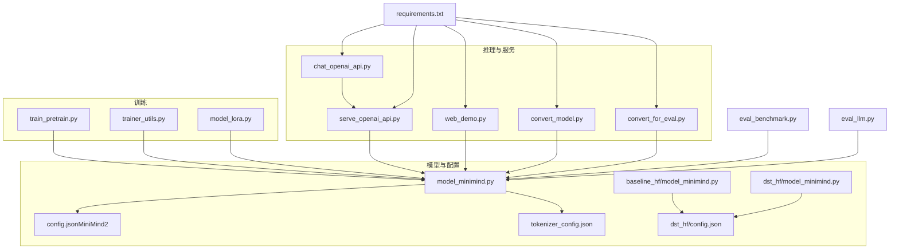
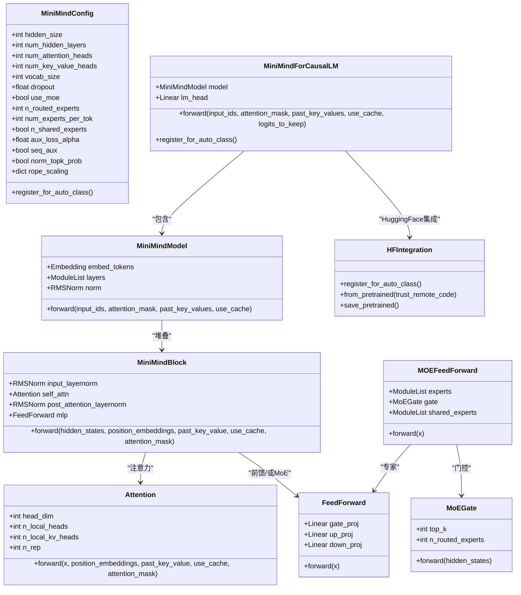
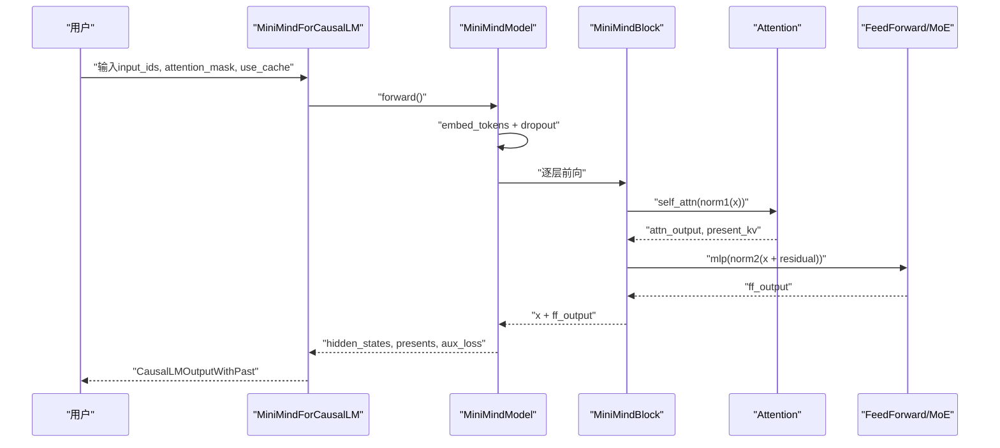
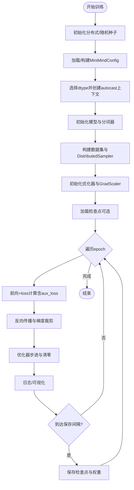
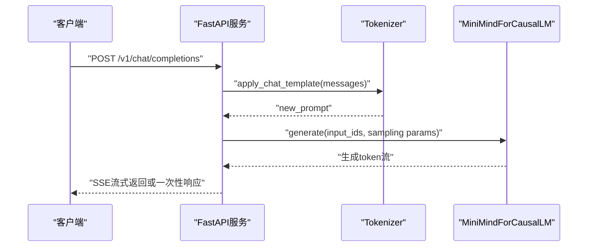
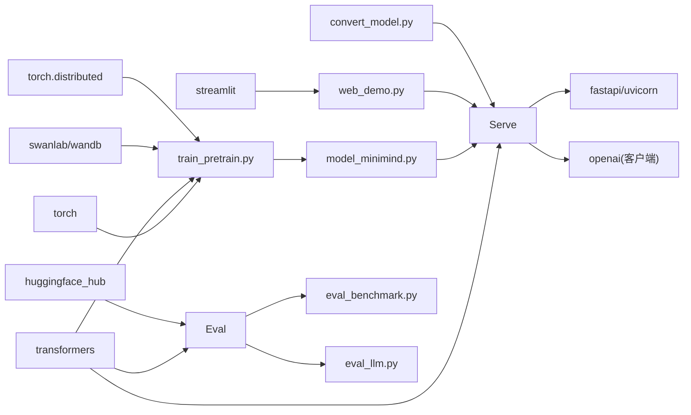

# 核心代码模块

<cite>
**本文引用的文件**
- [model_minimind.py](file://model/model_minimind.py)
- [model_minimind.py（DST训练基线）](file://DST-train/model/baseline_hf/model_minimind.py)
- [model_minimind.py（DST训练HuggingFace）](file://DST-train/model/dst_hf/model_minimind.py)
- [serve_openai_api.py](file://scripts/serve_openai_api.py)
- [chat_openai_api.py](file://scripts/chat_openai_api.py)
- [web_demo.py](file://scripts/web_demo.py)
- [convert_model.py](file://scripts/convert_model.py)
- [convert_for_eval.py](file://DST-train/convert_for_eval.py)
- [train_pretrain.py](file://trainer/train_pretrain.py)
- [trainer_utils.py](file://trainer/trainer_utils.py)
- [model_lora.py](file://model/model_lora.py)
- [config.json（MiniMind2）](file://MiniMind2/config.json)
- [config.json（DST训练HuggingFace）](file://DST-train/model/dst_hf/config.json)
- [tokenizer_config.json](file://model/tokenizer_config.json)
- [eval_benchmark.py](file://eval_benchmark.py)
- [eval_llm.py](file://eval_llm.py)
- [requirements.txt](file://requirements.txt)
- [README.md](file://README.md)
</cite>

## 更新摘要
**变更内容**
- 新增HuggingFace模型格式支持，包括模型注册和自动加载机制
- 增强远程代码执行功能，通过trust_remote_code参数实现
- 改进与HuggingFace生态系统的集成，支持完整的Transformers兼容性
- 新增模型转换工具，支持PyTorch权重到HuggingFace格式的双向转换
- 扩展推理服务，支持HuggingFace格式模型的加载和推理

## 目录
1. [引言](#引言)
2. [项目结构](#项目结构)
3. [核心组件](#核心组件)
4. [架构总览](#架构总览)
5. [详细组件分析](#详细组件分析)
6. [依赖关系分析](#依赖关系分析)
7. [性能考量](#性能考量)
8. [故障排查指南](#故障排查指南)
9. [结论](#结论)
10. [附录](#附录)

## 引言
本文件聚焦MiniMind项目的核心代码模块，系统解析模型架构（MiniMindForCausalLM、Attention、FeedForward、MOEFeedForward）、训练工具（分布式训练、混合精度、学习率调度）、数据处理（数据集基类、预训练与SFT数据集）、推理服务（OpenAI API兼容、Web界面、模型转换工具）等关键模块的设计思路与实现细节。文档提供接口说明、使用模式与扩展指南，帮助读者快速掌握从训练到部署的完整链路。

**更新** 本次更新重点反映了HuggingFace模型格式支持的扩展，包括模型注册机制、远程代码执行功能和完整的生态系统集成。

## 项目结构
项目采用按职责分层的组织方式：
- 模型定义与推理：model/model_minimind.py、DST-train/model/baseline_hf/model_minimind.py、DST-train/model/dst_hf/model_minimind.py
- 训练脚本与工具：trainer/train_pretrain.py、trainer/trainer_utils.py
- 推理服务与前端：scripts/serve_openai_api.py、scripts/web_demo.py、scripts/chat_openai_api.py
- 模型转换：scripts/convert_model.py、DST-train/convert_for_eval.py
- 配置与依赖：MiniMind2/config.json、DST-train/model/dst_hf/config.json、model/tokenizer_config.json、requirements.txt
- 评测与基准：eval_benchmark.py、eval_llm.py
- 文档与说明：README.md

**图表来源**
- [model_minimind.py](file://model/model_minimind.py)
- [train_pretrain.py](file://trainer/train_pretrain.py)
- [trainer_utils.py](file://trainer/trainer_utils.py)
- [model_lora.py](file://model/model_lora.py)
- [serve_openai_api.py](file://scripts/serve_openai_api.py)
- [web_demo.py](file://scripts/web_demo.py)
- [chat_openai_api.py](file://scripts/chat_openai_api.py)
- [convert_model.py](file://scripts/convert_model.py)
- [convert_for_eval.py](file://DST-train/convert_for_eval.py)
- [eval_benchmark.py](file://eval_benchmark.py)
- [eval_llm.py](file://eval_llm.py)
- [config.json（MiniMind2）](file://MiniMind2/config.json)
- [config.json（DST训练HuggingFace）](file://DST-train/model/dst_hf/config.json)
- [tokenizer_config.json](file://model/tokenizer_config.json)
- [requirements.txt](file://requirements.txt)

**章节来源**
- [README.md](file://README.md)
- [requirements.txt](file://requirements.txt)

## 核心组件
- 模型配置与主干：MiniMindConfig、MiniMindModel、MiniMindForCausalLM
- 注意力与前馈：Attention、FeedForward、RMSNorm、RoPE位置编码
- 混合专家（MoE）：MoEGate、MOEFeedForward、共享专家
- 训练工具：分布式训练、混合精度、学习率调度、断点续训
- 推理服务：OpenAI兼容API、Streamlit Web Demo、模型转换工具
- **新增** HuggingFace集成：模型注册、自动加载、远程代码执行

**章节来源**
- [model_minimind.py](file://model/model_minimind.py)
- [trainer_utils.py](file://trainer/trainer_utils.py)
- [model_lora.py](file://model/model_lora.py)

## 架构总览
MiniMind采用Decoder-only Transformer结构，结合RMSNorm、SwiGLU激活、RoPE位置编码与可选MoE前馈模块。训练侧支持单机多卡（DDP）、混合精度（bf16/f16）、学习率余弦退火调度与断点续训；推理侧提供OpenAI兼容API与Web Demo，支持LoRA微调与模型格式转换。**更新** 新增HuggingFace格式支持，通过模型注册机制实现自动加载和远程代码执行。

**图表来源**
- [model_minimind.py](file://model/model_minimind.py)

## 详细组件分析

### 模型架构模块
- MiniMindConfig：集中管理模型超参，包括MoE相关开关与参数（use_moe、n_routed_experts、num_experts_per_tok、aux_loss_alpha、seq_aux、norm_topk_prob等），并支持RoPE外推配置。**更新** 新增register_for_auto_class()方法，支持HuggingFace自动加载。
- MiniMindModel：负责词嵌入、层堆叠、RMSNorm归一化与位置编码缓存（freqs_cos/freqs_sin）。
- MiniMindForCausalLM：将LM头部与嵌入权重共享，提供CausalLM输出（last_hidden_state、logits、aux_loss、past_key_values）。**更新** 新增register_for_auto_class("AutoModelForCausalLM")方法，实现完整的HuggingFace兼容性。
- Attention：支持Flash Attention与传统注意力，KV缓存、RoPE旋转位置编码、重复KV头（Grouped-Query Attention）。
- FeedForward：SwiGLU激活（ACT2FN），线性变换与残差连接。
- MOEFeedForward：专家门控（softmax top-k）、辅助负载均衡损失、推理时的高效分桶聚合。

**图表来源**
- [model_minimind.py](file://model/model_minimind.py)

**章节来源**
- [model_minimind.py](file://model/model_minimind.py)

### HuggingFace集成模块
**新增** 本模块实现了MiniMind与HuggingFace生态系统的深度集成，包括模型注册、自动加载和远程代码执行。

- 模型注册：通过register_for_auto_class()方法将MiniMindConfig和MiniMindForCausalLM注册为HuggingFace自动加载类，支持AutoModelForCausalLM.from_pretrained()自动识别。
- 远程代码执行：通过trust_remote_code=True参数启用，允许从HuggingFace Hub加载包含自定义代码的模型。
- 格式转换：提供双向转换工具，支持PyTorch权重到HuggingFace格式的转换，以及从HuggingFace格式到原生权重的转换。
- 配置兼容：生成的HuggingFace格式配置文件与标准Llama配置兼容，便于与其他Transformers工具链集成。

**章节来源**
- [model_minimind.py](file://model/model_minimind.py)
- [convert_for_eval.py](file://DST-train/convert_for_eval.py)
- [convert_model.py](file://scripts/convert_model.py)

### 训练工具模块
- 分布式训练：通过环境变量初始化NCCL后端，DDP包裹模型（忽略freqs_cos/sin缓冲区），支持多机多卡。
- 混合精度：bfloat16/f16自动混合精度，GradScaler缩放与梯度裁剪。
- 学习率调度：余弦退火调度，周期内线性插值。
- 断点续训：检查点保存（模型、优化器、scaler、wandb/run信息），支持跨GPU数量恢复与自动跳步。
- 数据加载：DistributedSampler、SkipBatchSampler跳过已训练step，减少重复。

**图表来源**
- [train_pretrain.py](file://trainer/train_pretrain.py)
- [trainer_utils.py](file://trainer/trainer_utils.py)

**章节来源**
- [train_pretrain.py](file://trainer/train_pretrain.py)
- [trainer_utils.py](file://trainer/trainer_utils.py)

### 数据处理模块
- 数据集基类：PretrainDataset（训练侧使用），支持最大长度截断与掩码。
- 预训练数据集：pretrain_hq.jsonl（高质量中文语料），单条文本字段text。
- SFT数据集：sft_512.jsonl、sft_1024.jsonl、sft_2048.jsonl、sft_mini_512.jsonl，统一的conversations格式。
- RLHF数据集：dpo.jsonl（chosen/rejected偏好对）。
- RLAIF数据集：rlaif-mini.jsonl（强化学习微调采样子集）。

说明：数据集文件统一为JSONL格式，便于流式读取与清洗。Tokenizer采用自定义分词器，词表6400，支持chat_template与特殊token。

**章节来源**
- [README.md](file://README.md)
- [tokenizer_config.json](file://model/tokenizer_config.json)

### 推理服务模块
- OpenAI兼容API：FastAPI服务，支持流式与非流式响应，参数temperature/top_p/max_tokens/stream等。**更新** 新增对HuggingFace格式模型的支持，通过trust_remote_code=True参数启用远程代码执行。
- Web界面：Streamlit实现的聊天Demo，支持本地模型与API两种来源，滑杆调节历史轮数、最大生成长度、温度等。
- 模型转换工具：支持将原生权重转换为Transformers格式（MiniMind与Llama兼容），或从Transformers转回原生权重；可选LoRA融合。

**图表来源**
- [serve_openai_api.py](file://scripts/serve_openai_api.py)

**章节来源**
- [serve_openai_api.py](file://scripts/serve_openai_api.py)
- [web_demo.py](file://scripts/web_demo.py)
- [chat_openai_api.py](file://scripts/chat_openai_api.py)
- [convert_model.py](file://scripts/convert_model.py)

### 评测与基准模块
**新增** 本模块提供了完整的模型评测和基准测试功能，支持多种数据集和评测方法。

- 模型加载：支持HuggingFace格式模型的自动加载，通过AutoModelForCausalLM.from_pretrained()和AutoTokenizer.from_pretrained()实现。
- 评测数据集：C-Eval（validation集合）和CMMLU（train集合），提供多学科的多选题评测。
- 评测方法：采用ABCD token概率对比法，与lm-evaluation-harness方法保持一致。
- 报告生成：自动生成详细的评测报告，包括总准确率、各科目准确率和分类统计。

**章节来源**
- [eval_benchmark.py](file://eval_benchmark.py)
- [eval_llm.py](file://eval_llm.py)

### LoRA微调模块
- LoRA结构：低秩矩阵A/B，对线性层进行增量参数注入。
- 应用与加载：遍历模型模块，对满足条件的Linear层插入LoRA并重写forward；支持保存/加载LoRA权重。
- 与推理服务结合：服务端可加载LoRA权重并进行推理。

**章节来源**
- [model_lora.py](file://model/model_lora.py)
- [serve_openai_api.py](file://scripts/serve_openai_api.py)

## 依赖关系分析
- 训练侧依赖：torch、transformers、accelerate（通过DDP/GradScaler）、swanlab/wandb（可视化）、datasets（数据集）、einops（张量操作）。
- 推理侧依赖：fastapi、uvicorn、openai（客户端）、streamlit（Web Demo）、transformers（模型加载）。
- 评测侧依赖：transformers、datasets、huggingface_hub（数据集访问）、numpy（数值计算）。
- 关键耦合点：模型配置（MiniMindConfig）贯穿训练与推理；Tokenizer配置（tokenizer_config.json）影响chat_template与特殊token行为；服务端与模型权重格式需保持一致。**更新** 新增HuggingFace生态系统的完整依赖链。

**图表来源**
- [requirements.txt](file://requirements.txt)
- [train_pretrain.py](file://trainer/train_pretrain.py)
- [model_minimind.py](file://model/model_minimind.py)
- [serve_openai_api.py](file://scripts/serve_openai_api.py)
- [web_demo.py](file://scripts/web_demo.py)
- [convert_model.py](file://scripts/convert_model.py)
- [eval_benchmark.py](file://eval_benchmark.py)
- [eval_llm.py](file://eval_llm.py)

**章节来源**
- [requirements.txt](file://requirements.txt)

## 性能考量
- 计算效率
  - Flash Attention：在满足条件时使用scaled_dot_product_attention，降低内存与提升吞吐。
  - KV缓存：past_key_values在推理时显著降低自回归开销。
  - RoPE外推：通过rope_scaling配置（如Yarn）提升长序列外推能力。
- 内存与精度
  - 混合精度：bf16/f16自动混合精度，GradScaler缩放，减少显存占用。
  - 半精度保存：检查点权重半精度存储，降低IO与存储压力。
- 分布式与吞吐
  - DDP并行：NCCL后端，忽略位置编码缓冲参与同步，避免不必要的通信。
  - SkipBatchSampler：跨GPU数量恢复时自动调整step，减少重复训练。
- 生成策略
  - 温度与top_p：控制采样多样性；max_tokens限制生成长度，避免过长生成。
  - 流式输出：SSE流式返回，改善交互体验。
- **新增** HuggingFace集成性能
  - 模型注册：通过register_for_auto_class()实现高效的自动加载机制。
  - 远程代码执行：trust_remote_code参数启用时的额外安全性考虑。
  - 格式转换：PyTorch到HuggingFace格式转换的性能优化。

## 故障排查指南
- 分布式训练
  - 确认NCCL后端可用与环境变量设置正确；检查LOCAL_RANK与CUDA设备映射。
  - 若出现同步异常，确认模型中freqs_cos/freqs_sin未参与参数同步（已在DDP包裹时忽略）。
- 混合精度
  - CPU设备禁用autocast；确保dtype与设备匹配（bf16仅限支持平台）。
  - GradScaler缩放失败时检查梯度是否溢出，适当降低学习率或增大clip阈值。
- 断点续训
  - 检查checkpoints目录下resume文件是否存在；跨GPU数量恢复时step会自动换算。
  - 若权重加载失败，确认use_moe与权重文件后缀（_moe）一致。
- 推理服务
  - OpenAI客户端：确认base_url与API Key；流式模式下注意delta.content为空的处理。
  - Web Demo：确保transformers版本与trust_remote_code；若加载失败，检查模型路径与tokenizer配置。
  - **新增** HuggingFace模型加载：确认模型目录包含有效的config.json和tokenizer配置文件。
- 模型转换
  - 转换为Transformers格式时，注意MiniMindConfig注册与权重精度转换；Llama兼容转换需对齐中间维度。
  - **新增** 远程代码执行：trust_remote_code=True时确保模型代码的安全性，仅在可信源加载。
- **新增** HuggingFace集成故障排查
  - 模型注册：确认register_for_auto_class()方法正确调用，AutoModelForCausalLM能够自动识别。
  - 格式兼容：检查生成的config.json是否符合HuggingFace标准格式。
  - 评测加载：确保eval_benchmark.py中的trust_remote_code参数正确设置。

**章节来源**
- [trainer_utils.py](file://trainer/trainer_utils.py)
- [train_pretrain.py](file://trainer/train_pretrain.py)
- [serve_openai_api.py](file://scripts/serve_openai_api.py)
- [web_demo.py](file://scripts/web_demo.py)
- [convert_model.py](file://scripts/convert_model.py)
- [eval_benchmark.py](file://eval_benchmark.py)

## 结论
MiniMind通过从零实现的Transformer核心模块，提供了从预训练到SFT、LoRA、RLHF与推理部署的完整链路。其设计强调可解释性与可扩展性：MoE模块、RoPE外推、混合精度与分布式训练等关键特性均有清晰的实现与配置入口。结合OpenAI兼容API与Web Demo，项目既适合教学实践，也能快速落地应用。

**更新** 本次扩展进一步增强了MiniMind与HuggingFace生态系统的集成，通过模型注册机制和远程代码执行功能，实现了与主流Transformers工具链的无缝对接，为用户提供了更加灵活和强大的模型加载与推理能力。

## 附录
- 使用模式
  - 训练：在trainer目录执行train_pretrain.py，支持--from_resume自动续训；可选--use_wandb记录训练曲线。
  - 推理：启动serve_openai_api.py提供/v1/chat/completions接口；或使用web_demo.py启动Streamlit界面。
  - 转换：使用convert_model.py将原生权重转换为Transformers格式，便于第三方生态使用。
  - **新增** HuggingFace集成：通过trust_remote_code=True参数加载包含自定义代码的模型，支持完整的Transformers兼容性。
- 扩展指南
  - 新增数据集：遵循JSONL格式与tokenizer配置，确保chat_template与特殊token一致。
  - 自定义MoE：调整MiniMindConfig中use_moe与专家参数，验证aux_loss与推理分桶逻辑。
  - LoRA融合：在服务端加载LoRA权重，或在训练后保存融合权重以便部署。
  - **新增** HuggingFace格式扩展：利用register_for_auto_class()方法扩展新的模型类型，实现自动加载支持。

**章节来源**
- [README.md](file://README.md)
- [convert_model.py](file://scripts/convert_model.py)
- [serve_openai_api.py](file://scripts/serve_openai_api.py)
- [web_demo.py](file://scripts/web_demo.py)
- [train_pretrain.py](file://trainer/train_pretrain.py)
- [convert_for_eval.py](file://DST-train/convert_for_eval.py)
- [eval_benchmark.py](file://eval_benchmark.py)
- [eval_llm.py](file://eval_llm.py)