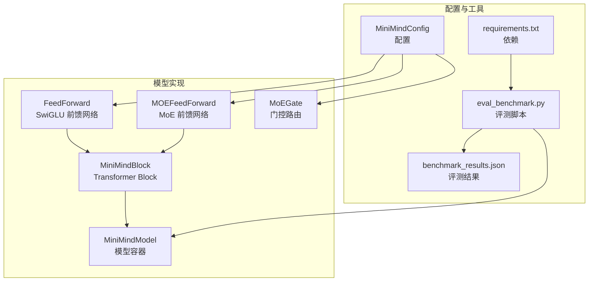
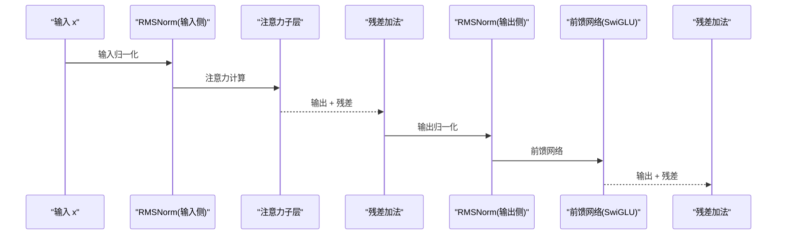
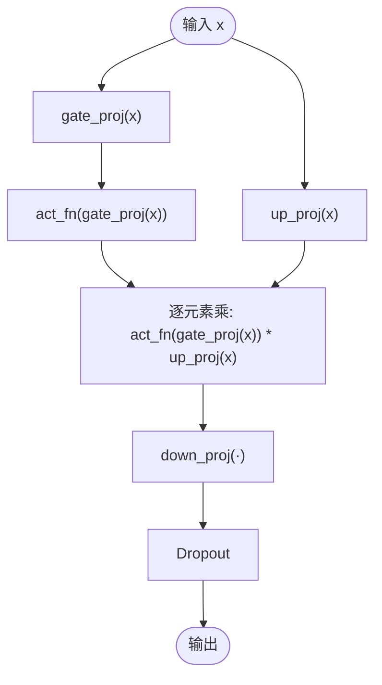
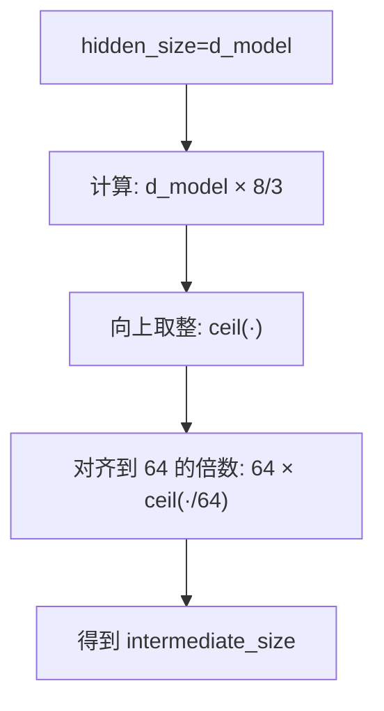
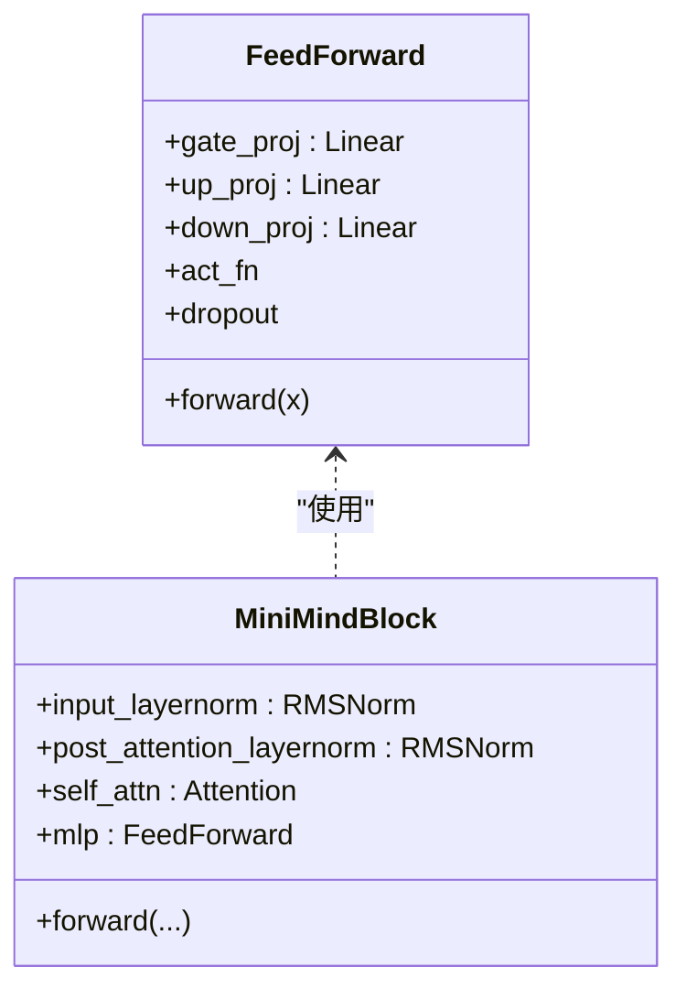
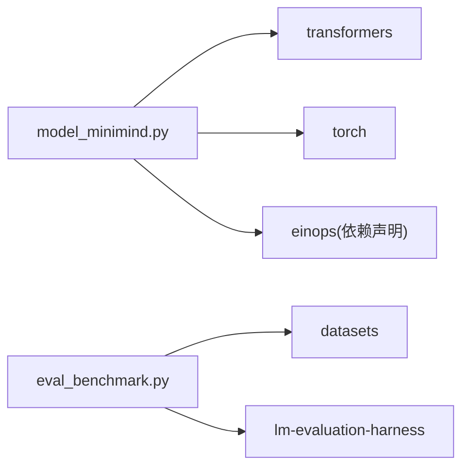

# 前馈网络

<cite>
**本文引用的文件**
- [model_minimind.py](file://model/model_minimind.py)
- [model_minimind.py(dst_hf)](file://DST-train/model/dst_hf/model_minimind.py)
- [03_Phase3_模型架构详解.md](file://docs/03_Phase3_模型架构详解.md)
- [eval_benchmark.py](file://eval_benchmark.py)
- [eval_results/benchmark_results.json](file://eval_results/benchmark_results.json)
- [requirements.txt](file://requirements.txt)
</cite>

## 目录
1. [简介](#简介)
2. [项目结构](#项目结构)
3. [核心组件](#核心组件)
4. [架构总览](#架构总览)
5. [详细组件分析](#详细组件分析)
6. [依赖分析](#依赖分析)
7. [性能考量](#性能考量)
8. [故障排查指南](#故障排查指南)
9. [结论](#结论)
10. [附录](#附录)

## 简介
本文件围绕前馈网络（FeedForward）展开，重点解析 SwiGLU 激活函数的双重投影机制（gate_proj 与 up_proj），中间层维度的 8/3 比例与 64 对齐的数学原理，残差连接与 Dropout 的应用策略，以及不同激活函数的支持与性能差异。同时提供参数初始化、权重共享与内存优化的技术细节，并结合仓库中的基准测试脚本与结果，给出可复现的评测路径与参考指标。

## 项目结构
- 前馈网络的核心实现位于模型主文件中，采用 SwiGLU（SiLU 门控线性单元）作为激活函数。
- 文档中对前馈网络的结构、计算流程与 MoE 扩展均有详细说明。
- 基准测试脚本提供统一的评测入口，支持 C-Eval 与 CMMLU 两大榜单，便于横向对比。

**图表来源**
- [model_minimind.py:229-243](file://model/model_minimind.py#L229-L243)
- [model_minimind.py:301-337](file://model/model_minimind.py#L301-L337)
- [model_minimind.py:245-298](file://model/model_minimind.py#L245-L298)
- [model_minimind.py:363-384](file://model/model_minimind.py#L363-L384)
- [model_minimind.py:387-440](file://model/model_minimind.py#L387-L440)
- [eval_benchmark.py:18-31](file://eval_benchmark.py#L18-L31)
- [eval_results/benchmark_results.json:1-494](file://eval_results/benchmark_results.json#L1-L494)
- [requirements.txt:1-31](file://requirements.txt#L1-L31)

**章节来源**
- [model_minimind.py:229-243](file://model/model_minimind.py#L229-L243)
- [model_minimind.py:301-337](file://model/model_minimind.py#L301-L337)
- [model_minimind.py:363-384](file://model/model_minimind.py#L363-L384)
- [model_minimind.py:387-440](file://model/model_minimind.py#L387-L440)
- [03_Phase3_模型架构详解.md:178-205](file://docs/03_Phase3_模型架构详解.md#L178-L205)
- [eval_benchmark.py:18-31](file://eval_benchmark.py#L18-L31)
- [eval_results/benchmark_results.json:1-494](file://eval_results/benchmark_results.json#L1-L494)
- [requirements.txt:1-31](file://requirements.txt#L1-L31)

## 核心组件
- FeedForward（SwiGLU）：包含 gate_proj、up_proj、down_proj 三个线性层，使用 ACT2FN[config.hidden_act] 作为激活函数（默认 SiLU），并在输出端应用 Dropout。
- 中间层维度对齐：若未显式设置 intermediate_size，则按 hidden_size × 8/3 向上对齐到 64 的倍数。
- 残差连接：在 MiniMindBlock 的前馈网络分支中，先对输入进行 RMSNorm，再与残差相加，形成“后加”式残差。
- Dropout 应用：在前馈网络输出端与注意力输出端分别应用 Dropout，控制训练时的正则化强度。

**章节来源**
- [model_minimind.py:229-243](file://model/model_minimind.py#L229-L243)
- [model_minimind.py:363-384](file://model/model_minimind.py#L363-L384)
- [model_minimind.py:150-226](file://model/model_minimind.py#L150-L226)
- [03_Phase3_模型架构详解.md:178-205](file://docs/03_Phase3_模型架构详解.md#L178-L205)

## 架构总览
前馈网络位于 Transformer Block 的 MLP 子层，与注意力子层并行。在前向传播中，先对输入进行 RMSNorm，再分别通过注意力与前馈网络，最后叠加残差。

**图表来源**
- [model_minimind.py:363-384](file://model/model_minimind.py#L363-L384)
- [model_minimind.py:229-243](file://model/model_minimind.py#L229-L243)

## 详细组件分析

### SwiGLU 前馈网络（FeedForward）
- 双重投影机制：
  - gate_proj：将隐藏维映射到中间维，随后经激活函数（默认 SiLU）。
  - up_proj：将隐藏维映射到中间维，与 gate_proj 的激活结果逐元素相乘。
  - down_proj：将中间维映射回隐藏维，作为前馈网络的最终输出。
- 中间层维度对齐：
  - 若未设置 intermediate_size，则按 hidden_size × 8/3 向上取整到最近的 64 的倍数。
- Dropout：
  - 在 down_proj 输出后应用，受 config.dropout 控制。
- 残差连接：
  - 在 MiniMindBlock 中，前馈网络输出与 LN2 后的输入相加，形成残差。

**图表来源**
- [model_minimind.py:229-243](file://model/model_minimind.py#L229-L243)
- [03_Phase3_模型架构详解.md:178-205](file://docs/03_Phase3_模型架构详解.md#L178-L205)

**章节来源**
- [model_minimind.py:229-243](file://model/model_minimind.py#L229-L243)
- [03_Phase3_模型架构详解.md:178-205](file://docs/03_Phase3_模型架构详解.md#L178-L205)

### 中间层维度计算规则（8/3 比例与 64 对齐）
- 设 hidden_size 为 d_model，中间维 intermediate_size 的计算与对齐规则如下：
  - intermediate_size = ceil(d_model × 8/3)
  - 对齐到 64 的倍数：intermediate_size = 64 × ceil(intermediate_size / 64)
- 数学原理：
  - 8/3 比例是 SwiGLU 的常见中间通道扩张因子，兼顾计算与表达能力。
  - 64 对齐有利于张量核函数与内存访问的高效性（如 cuBLAS/Flash Attention 的优化）。

**图表来源**
- [model_minimind.py:232-234](file://model/model_minimind.py#L232-L234)
- [03_Phase3_模型架构详解.md:185-187](file://docs/03_Phase3_模型架构详解.md#L185-L187)

**章节来源**
- [model_minimind.py:232-234](file://model/model_minimind.py#L232-L234)
- [03_Phase3_模型架构详解.md:185-187](file://docs/03_Phase3_模型架构详解.md#L185-L187)

### 残差连接与 Dropout 策略
- 残差连接：
  - 注意力子层：输出与输入侧 RMSNorm 的输入相加。
  - 前馈网络：输出与输出侧 RMSNorm 的输入相加。
- Dropout：
  - 注意力输出端：resid_dropout。
  - 前馈网络输出端：dropout。
  - 两者均受 config.dropout 控制，训练时启用，推理时关闭。

**图表来源**
- [model_minimind.py:229-243](file://model/model_minimind.py#L229-L243)
- [model_minimind.py:363-384](file://model/model_minimind.py#L363-L384)

**章节来源**
- [model_minimind.py:150-226](file://model/model_minimind.py#L150-L226)
- [model_minimind.py:229-243](file://model/model_minimind.py#L229-L243)
- [model_minimind.py:363-384](file://model/model_minimind.py#L363-L384)

### 激活函数支持与性能差异
- 支持范围：
  - 通过 ACT2FN[config.hidden_act] 动态绑定激活函数，config.hidden_act 默认为 'silu'。
- 性能差异（基于仓库实现与文档说明）：
  - SiLU（SwiGLU）通常在语言建模任务上优于 ReLU，具备更好的梯度流动与非线性表达能力。
  - ReLU 在某些轻量任务中可能更快，但表达能力较弱。
  - 本仓库默认使用 SiLU，未提供切换示例，如需更换需修改配置项 hidden_act。

**章节来源**
- [model_minimind.py:239](file://model/model_minimind.py#L239)
- [03_Phase3_模型架构详解.md:12](file://docs/03_Phase3_模型架构详解.md#L12)

### 参数初始化、权重共享与内存优化
- 参数初始化：
  - 前馈网络的线性层均设置 bias=False，以减少参数量并提升稳定性。
  - 注意力子层的线性层同样设置 bias=False。
- 权重共享：
  - 语言模型头部 lm_head 与嵌入层 embed_tokens 权重共享，减少参数总量。
- 内存优化：
  - 中间维按 64 对齐，有利于张量核与缓存友好性。
  - 使用 RMSNorm 替代 LayerNorm，降低计算开销。
  - 注意力子层支持 Flash Attention（在满足条件时自动启用），显著降低注意力计算的内存与时间开销。

**章节来源**
- [model_minimind.py:159-166](file://model/model_minimind.py#L159-L166)
- [model_minimind.py:235-239](file://model/model_minimind.py#L235-L239)
- [model_minimind.py:443-454](file://model/model_minimind.py#L443-L454)
- [model_minimind.py:198-207](file://model/model_minimind.py#L198-L207)

### 代码实现示例与路径
- 前馈网络定义与前向传播：[model_minimind.py:229-243](file://model/model_minimind.py#L229-L243)
- 中间维对齐逻辑：[model_minimind.py:232-234](file://model/model_minimind.py#L232-L234)
- 残差连接与前馈网络集成：[model_minimind.py:363-384](file://model/model_minimind.py#L363-L384)
- 注意力子层（含 Flash Attention 与 Dropout）：[model_minimind.py:150-226](file://model/model_minimind.py#L150-L226)
- 激活函数绑定（ACT2FN）：[model_minimind.py:239](file://model/model_minimind.py#L239)

**章节来源**
- [model_minimind.py:229-243](file://model/model_minimind.py#L229-L243)
- [model_minimind.py:232-234](file://model/model_minimind.py#L232-L234)
- [model_minimind.py:363-384](file://model/model_minimind.py#L363-L384)
- [model_minimind.py:150-226](file://model/model_minimind.py#L150-L226)
- [model_minimind.py:239](file://model/model_minimind.py#L239)

### 性能基准测试与结果
- 评测脚本：
  - eval_benchmark.py 提供一键式评测，支持 C-Eval（validation）与 CMMLU（train）。
  - 自动加载 HuggingFace 格式模型与分词器，按批推理并计算 A/B/C/D 四个选项的概率，统计准确率。
- 基准结果：
  - C-Eval 总准确率：约 23.18%
  - CMMLU 总准确率：约 25.63%
  - 评测脚本输出按学科大类汇总（STEM 与 人文社科），并保存 JSON 结果。
- 使用建议：
  - 使用 Llama 格式转换后的模型（见文档说明）以获得最佳兼容性。
  - 如遇 CUDA 不可用，脚本会回退到 CPU，但速度较慢；建议检查 GPU 驱动与显存。

**章节来源**
- [eval_benchmark.py:18-31](file://eval_benchmark.py#L18-L31)
- [eval_benchmark.py:129-187](file://eval_benchmark.py#L129-L187)
- [eval_benchmark.py:190-231](file://eval_benchmark.py#L190-L231)
- [eval_benchmark.py:234-314](file://eval_benchmark.py#L234-L314)
- [eval_results/benchmark_results.json:1-494](file://eval_results/benchmark_results.json#L1-L494)
- [03_Phase3_模型架构详解.md:10-16](file://docs/03_Phase3_模型架构详解.md#L10-L16)

## 依赖分析
- 关键依赖：
  - transformers（ACT2FN、PreTrainedModel、GenerationMixin 等）
  - torch（张量运算、Dropout、Softmax 等）
  - einops（张量操作，仓库中存在依赖声明）
- 评测依赖：
  - datasets、lm-evaluation-harness（评测脚本中使用）

**图表来源**
- [requirements.txt:1-31](file://requirements.txt#L1-L31)
- [model_minimind.py:89-92](file://model/model_minimind.py#L89-L92)
- [eval_benchmark.py:14-15](file://eval_benchmark.py#L14-L15)

**章节来源**
- [requirements.txt:1-31](file://requirements.txt#L1-L31)
- [model_minimind.py:89-92](file://model/model_minimind.py#L89-L92)
- [eval_benchmark.py:14-15](file://eval_benchmark.py#L14-L15)

## 性能考量
- 中间维对齐与激活函数：
  - 8/3 扩张与 64 对齐在多数硬件上能获得更优的吞吐与显存占用。
  - SiLU 相比 ReLU 在语言建模上通常更优，但计算成本略高。
- Dropout 与正则化：
  - 在前馈网络与注意力输出端分别应用 Dropout，有助于缓解过拟合。
- Flash Attention：
  - 在满足条件时自动启用，显著降低注意力计算的内存与时间开销。
- 权重共享与 RMSNorm：
  - 嵌入与 lm_head 权重共享减少参数量；RMSNorm 计算更高效。

[本节为通用性能讨论，不直接分析具体文件]

## 故障排查指南
- CUDA 不可用或显存不足：
  - 评测脚本会回退到 CPU，速度极慢；建议检查驱动与显存。
- 数据集下载失败：
  - 首次运行需从 HuggingFace 下载，网络问题可配置镜像（如 HF_ENDPOINT）。
- 模型格式转换失败：
  - 确认权重文件路径与模型配置一致；转换脚本需与当前模型参数匹配。
- 分词器多 Token 映射：
  - 评测脚本对 A/B/C/D 的 token 映射做了兼容处理，若仍异常，检查分词器版本。

**章节来源**
- [eval_benchmark.py:87-91](file://eval_benchmark.py#L87-L91)
- [eval_benchmark.py:138-143](file://eval_benchmark.py#L138-L143)
- [eval_benchmark.py:160-162](file://eval_benchmark.py#L160-L162)
- [eval_benchmark.py:40-51](file://eval_benchmark.py#L40-L51)

## 结论
本仓库的前馈网络采用 SwiGLU（SiLU 门控线性单元），通过 gate_proj 与 up_proj 的双重投影实现门控机制，中间维按 8/3 比例并向上对齐到 64 的倍数，兼顾表达能力与硬件效率。残差连接与 Dropout 策略遵循 Pre-LN/Post-LN 的常见实践，配合 RMSNorm 与 Flash Attention，整体在推理速度与稳定性上取得平衡。评测脚本提供了可复现的基准测试路径，C-Eval 与 CMMLU 的准确率可作为性能参考。

[本节为总结性内容，不直接分析具体文件]

## 附录
- 评测脚本使用要点：
  - 模型格式：建议使用 Llama 格式转换后的 HuggingFace 模型。
  - 批大小：可根据显存调整（脚本默认 8）。
  - 输出：评测结果保存为 JSON，包含总准确率与按学科大类的细分结果。

**章节来源**
- [eval_benchmark.py:234-314](file://eval_benchmark.py#L234-L314)
- [eval_results/benchmark_results.json:1-494](file://eval_results/benchmark_results.json#L1-L494)