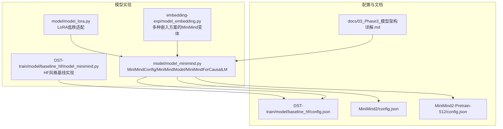
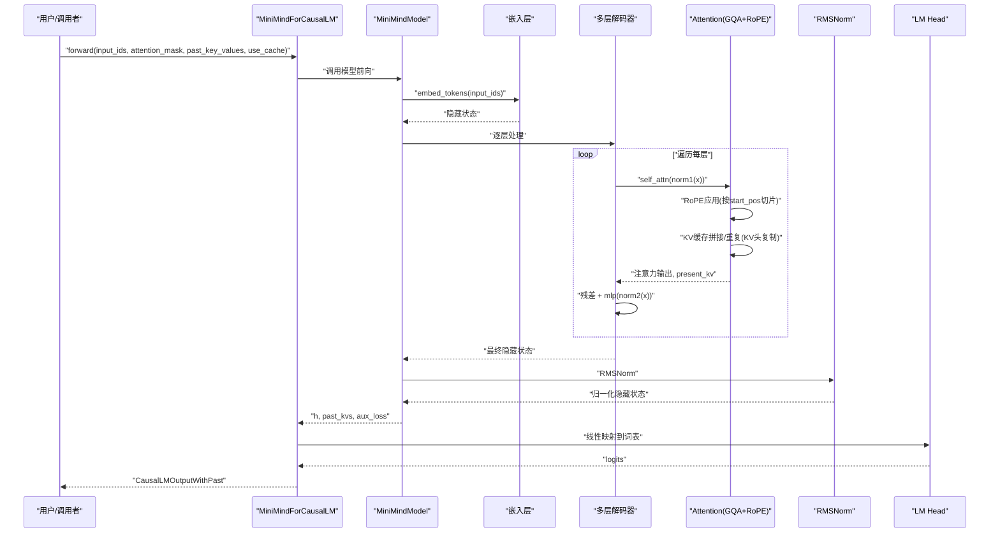
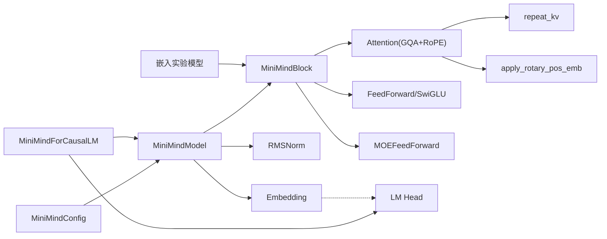

# 完整模型架构

<cite>
**本文引用的文件**
- [model_minimind.py](file://model/model_minimind.py)
- [model_minimind.py（HF基线版本）](file://DST-train/model/baseline_hf/model_minimind.py)
- [model_lora.py](file://model/model_lora.py)
- [model_embedding.py](file://embedding-exp/model_embedding.py)
- [config.json（HF基线）](file://DST-train/model/baseline_hf/config.json)
- [config.json（MiniMind2）](file://MiniMind2/config.json)
- [config.json（MiniMind2-Pretrain-512）](file://MiniMind2-Pretrain-512/config.json)
- [03_Phase3_模型架构详解.md](file://docs/03_Phase3_模型架构详解.md)
</cite>

## 目录
1. [简介](#简介)
2. [项目结构](#项目结构)
3. [核心组件](#核心组件)
4. [架构总览](#架构总览)
5. [详细组件分析](#详细组件分析)
6. [依赖关系分析](#依赖关系分析)
7. [性能考量](#性能考量)
8. [故障排查指南](#故障排查指南)
9. [结论](#结论)
10. [附录](#附录)

## 简介
本文件面向MiniMindModel的完整模型架构，系统性解析嵌入层、解码器层列表与最终归一化的设计思路；深入说明RoPE位置编码的预计算与缓存机制（含YaRN外推缩放）、前向传播从token ID到最终隐藏状态的完整路径；解析past_key_values的管理与缓存复用策略；阐述MoE专家选择与辅助损失聚合；并覆盖参数初始化、权重绑定与内存优化等实现细节。文末提供架构图与关键代码片段路径，便于读者快速定位实现。

## 项目结构
仓库围绕“模型实现 + 训练/评估脚本 + 文档”组织，核心模型位于model目录，另有LoRA适配、嵌入实验与多套配置文件。下图给出与本文相关的文件与职责映射。

图表来源
- [model_minimind.py:1-477](file://model/model_minimind.py#L1-L477)
- [model_minimind.py（HF基线版本）:1-477](file://DST-train/model/baseline_hf/model_minimind.py#L1-L477)
- [model_embedding.py:1-300](file://embedding-exp/model_embedding.py#L1-L300)
- [model_lora.py:1-50](file://model/model_lora.py#L1-L50)
- [config.json（HF基线）:1-37](file://DST-train/model/baseline_hf/config.json#L1-L37)
- [config.json（MiniMind2）:1-33](file://MiniMind2/config.json#L1-L33)
- [config.json（MiniMind2-Pretrain-512）:1-33](file://MiniMind2-Pretrain-512/config.json#L1-L33)
- [03_Phase3_模型架构详解.md:1-387](file://docs/03_Phase3_模型架构详解.md#L1-L387)

章节来源
- [model_minimind.py:1-477](file://model/model_minimind.py#L1-L477)
- [model_minimind.py（HF基线版本）:1-477](file://DST-train/model/baseline_hf/model_minimind.py#L1-L477)
- [model_embedding.py:1-300](file://embedding-exp/model_embedding.py#L1-L300)
- [model_lora.py:1-50](file://model/model_lora.py#L1-L50)
- [config.json（HF基线）:1-37](file://DST-train/model/baseline_hf/config.json#L1-L37)
- [config.json（MiniMind2）:1-33](file://MiniMind2/config.json#L1-L33)
- [config.json（MiniMind2-Pretrain-512）:1-33](file://MiniMind2-Pretrain-512/config.json#L1-L33)
- [03_Phase3_模型架构详解.md:1-387](file://docs/03_Phase3_模型架构详解.md#L1-L387)

## 核心组件
- 配置类：MiniMindConfig，承载模型超参（维度、层数、注意力头数、KV头数、RoPE参数、MoE参数、是否启用Flash Attention等）。
- 嵌入层：标准词嵌入或多种嵌入方案（见嵌入实验模块）。
- 解码器层列表：MiniMindBlock堆叠，每层包含RMSNorm、Attention（GQA+RoPE）与FFN/MoE。
- 归一化：最终输出经RMSNorm。
- RoPE：预计算频率表并注册为非持久缓冲区，按当前起始位置切片使用。
- KV缓存：Attention内部维护past_key_value，支持use_cache与推理增量生成。
- LM头：线性层，可与嵌入权重绑定以节省参数。
- LoRA：可选低秩适配模块，用于参数高效微调。

章节来源
- [model_minimind.py:8-78](file://model/model_minimind.py#L8-L78)
- [model_minimind.py:387-441](file://model/model_minimind.py#L387-L441)
- [model_minimind.py:443-477](file://model/model_minimind.py#L443-L477)
- [model_embedding.py:82-174](file://embedding-exp/model_embedding.py#L82-L174)
- [model_lora.py:21-33](file://model/model_lora.py#L21-L33)

## 架构总览
下图展示MiniMindModel从输入token ID到最终隐藏状态的整体数据流，以及RoPE与KV缓存的关键节点。

图表来源
- [model_minimind.py:403-441](file://model/model_minimind.py#L403-L441)
- [model_minimind.py:363-384](file://model/model_minimind.py#L363-L384)
- [model_minimind.py:150-227](file://model/model_minimind.py#L150-L227)
- [model_minimind.py:95-106](file://model/model_minimind.py#L95-L106)

## 详细组件分析

### 嵌入层与多嵌入方案
- 标准嵌入：nn.Embedding(vocab_size, hidden_size)。
- 嵌入实验模块提供四种方案：
  - A：标准嵌入（权重绑定）。
  - B：固定二维坐标 + Linear(2, hidden_size)。
  - C1：固定三维正弦编码 + Linear(3, hidden_size)。
  - C2：可学习Embedding(vocab, 3) + Linear(3, hidden_size)。
- 嵌入权重提取接口：get_embedding_weights、get_raw_embedding_weights、get_embed_param_count，便于分析与可视化。

章节来源
- [model_minimind.py](file://model/model_minimind.py#L392)
- [model_embedding.py:82-174](file://embedding-exp/model_embedding.py#L82-L174)
- [model_embedding.py:175-214](file://embedding-exp/model_embedding.py#L175-L214)

### RoPE位置编码：预计算与缓存
- 频率表生成：
  - 计算基础频率：freqs_i = 1 / (theta^(2i/d))，i取偶数。
  - 可选YaRN外推：当end/orig_max > 1时，按维度分段计算beta与缩放因子，对高频分量进行缩放。
  - 计算每个位置的频率：freqs = outer(t, freqs)，拼接cos/sin得到freqs_cos/freqs_sin。
- 缓存机制：
  - 在模型初始化时调用precompute_freqs_cis，将freqs_cos/freqs_sin注册为非持久缓冲区（register_buffer，persistent=False），避免参与优化器更新但随模型一起保存/加载。
  - 前向时根据past_key_values中的已有历史长度start_pos切片使用：freqs_cos[start_pos:start_pos+seq_len], freqs_sin同理。
- 应用方式：
  - Attention内部对Q/K分别应用apply_rotary_pos_emb，按位置切片cos/sin广播到Q/K的头维。

章节来源
- [model_minimind.py:108-128](file://model/model_minimind.py#L108-L128)
- [model_minimind.py:131-137](file://model/model_minimind.py#L131-L137)
- [model_minimind.py:397-401](file://model/model_minimind.py#L397-L401)
- [model_minimind.py:416-419](file://model/model_minimind.py#L416-L419)
- [03_Phase3_模型架构详解.md:77-116](file://docs/03_Phase3_模型架构详解.md#L77-L116)

### 解码器层列表与块结构
- MiniMindBlock：
  - 输入/输出归一化：RMSNorm在前（Pre-LN）。
  - 注意力子层：Attention(GQA+RoPE)，支持KV缓存与Flash Attention。
  - 前馈子层：FeedForward(SwiGLU)或MOEFeedForward。
  - 残差连接：注意力输出与MLP输出均与输入相加。
- 层数：由config.num_hidden_layers决定，以ModuleList装载。

章节来源
- [model_minimind.py:363-384](file://model/model_minimind.py#L363-L384)
- [model_minimind.py:229-243](file://model/model_minimind.py#L229-L243)
- [model_minimind.py:301-337](file://model/model_minimind.py#L301-L337)

### 注意力与KV缓存：GQA、RoPE与Flash Attention
- GQA：
  - n_local_heads = num_attention_heads，n_local_kv_heads = num_key_value_heads，n_rep = n_local_heads // n_local_kv_heads。
  - KV头复制：repeat_kv将KV头重复n_rep次以匹配Q头数。
- RoPE：
  - 在Q/K投影后应用apply_rotary_pos_emb，cos/sin按当前位置切片。
- KV缓存：
  - past_key_value为(None, None)或(prev_k, prev_v)元组；推理时将新K/V与历史拼接，并在use_cache=True时返回present。
- Flash Attention：
  - 若可用且seq_len>1，优先使用F.scaled_dot_product_attention；否则回退到手工实现（带因果掩码与可选注意力mask）。

章节来源
- [model_minimind.py:150-227](file://model/model_minimind.py#L150-L227)
- [model_minimind.py:140-147](file://model/model_minimind.py#L140-L147)
- [model_minimind.py:198-226](file://model/model_minimind.py#L198-L226)

### 前馈网络与MoE
- FeedForward：
  - SwiGLU结构：gate_proj与up_proj并行，SiLU激活后逐元素乘，再经down_proj降维。
  - intermediate_size自动对齐到64的倍数，提升内存访问效率。
- MoE：
  - MoEGate：线性层计算专家分数，softmax后Top-K选择，可选归一化权重。
  - MOEFeedForward：训练时逐专家处理并加权求和；推理时按专家分组批处理优化（moe_infer），减少重复计算。
  - 辅助损失：负载均衡项，按序列级或token级聚合，控制专家使用分布均匀性。
  - 共享专家：始终参与计算，叠加在路由专家输出之上。

章节来源
- [model_minimind.py:229-243](file://model/model_minimind.py#L229-L243)
- [model_minimind.py:245-298](file://model/model_minimind.py#L245-L298)
- [model_minimind.py:301-361](file://model/model_minimind.py#L301-L361)
- [model_minimind.py:434-438](file://model/model_minimind.py#L434-L438)

### 前向传播流程（从token ID到隐藏状态）
- 输入准备：input_ids形状(batch, seq_len)，attention_mask可选。
- 嵌入：embed_tokens(input_ids)后经dropout。
- RoPE：按start_pos切片使用freqs_cos/freqs_sin。
- 层循环：逐层执行MiniMindBlock，收集每层的present_kv。
- 归一化：最终hidden_states经RMSNorm。
- 输出：返回(h, past_kvs, aux_loss)；CausalLM头将h映射到词表logits。

章节来源
- [model_minimind.py:403-441](file://model/model_minimind.py#L403-L441)

### past_key_values的管理与缓存复用
- 初始化：若未提供past_key_values，则按层数填充None。
- 起始位置：start_pos = past_key_values[0][0].shape[1]（历史KV长度）。
- KV拼接：Attention内部将新K/V与历史拼接，形成累积KV序列。
- 返回：use_cache=True时返回每层的present=(new_k, new_v)。
- 与RoPE配合：freqs_cos/freqs_sin按start_pos切片，确保位置索引连续。

章节来源
- [model_minimind.py:410-412](file://model/model_minimind.py#L410-L412)
- [model_minimind.py:187-190](file://model/model_minimind.py#L187-L190)
- [model_minimind.py:416-419](file://model/model_minimind.py#L416-L419)

### 权重绑定与内存优化
- 权重绑定：MiniMindForCausalLM中lm_head与embed_tokens共享权重，减少参数量并提升一致性。
- 非持久缓冲区：RoPE频率表注册为非持久缓冲区，既随模型保存/加载，又不参与优化器参数，降低显存占用。
- 参数初始化：MoE门控权重使用Kaiming均匀初始化；LoRA模块A矩阵高斯初始化、B矩阵零初始化。
- 中间尺寸对齐：FFN中间维度对齐到64倍数，提升内存访问效率。

章节来源
- [model_minimind.py:445-452](file://model/model_minimind.py#L445-L452)
- [model_minimind.py:397-401](file://model/model_minimind.py#L397-L401)
- [model_minimind.py:261-262](file://model/model_minimind.py#L261-L262)
- [model_minimind.py:232-234](file://model/model_minimind.py#L232-L234)

### LoRA适配（参数高效微调）
- 结构：在指定Linear层上叠加低秩模块A（in×rank）与B（rank×out），A高斯初始化、B零初始化。
- 绑定：通过动态替换forward实现A+B的叠加，无需修改原权重。
- 保存/加载：按模块名前缀保存/加载LoRA参数，便于轻量微调。

章节来源
- [model_lora.py:6-18](file://model/model_lora.py#L6-L18)
- [model_lora.py:21-33](file://model/model_lora.py#L21-L33)
- [model_lora.py:35-50](file://model/model_lora.py#L35-L50)

## 依赖关系分析
- 模块耦合：
  - MiniMindModel依赖MiniMindBlock、RMSNorm、Attention、FeedForward/MOE。
  - Attention依赖RoPE工具函数与repeat_kv。
  - MiniMindForCausalLM依赖MiniMindModel与LM Head，并进行权重绑定。
  - 嵌入实验模块继承MiniMindModel，替换嵌入层实现。
- 外部依赖：
  - Transformers库提供PreTrainedModel、GenerationMixin、CausalLMOutputWithPast等。
  - PyTorch提供线性层、Dropout、RMSNorm、F.scaled_dot_product_attention等。

图表来源
- [model_minimind.py:8-78](file://model/model_minimind.py#L8-L78)
- [model_minimind.py:363-384](file://model/model_minimind.py#L363-L384)
- [model_minimind.py:150-227](file://model/model_minimind.py#L150-L227)
- [model_minimind.py:229-243](file://model/model_minimind.py#L229-L243)
- [model_minimind.py:301-361](file://model/model_minimind.py#L301-L361)
- [model_minimind.py:443-477](file://model/model_minimind.py#L443-L477)
- [model_embedding.py:82-174](file://embedding-exp/model_embedding.py#L82-L174)

## 性能考量
- 计算效率
  - Flash Attention：在可用时优先使用，显著降低注意力计算时间与显存峰值。
  - RMSNorm：仅缩放归一化，计算量小于LayerNorm，推理更快。
  - GQA：KV头数减少，降低KV投影与注意力计算成本。
- 内存优化
  - 非持久缓冲区：RoPE频率表不参与优化器参数，减少冗余存储。
  - 中间维度对齐：FFN中间维度对齐到64倍数，提升内存访问效率。
  - KV缓存：增量生成时仅保留历史KV，避免重复计算。
- 训练稳定性
  - MoE辅助损失：通过负载均衡抑制专家路由崩塌，提升训练稳定性。
  - Dropout与Residual：缓解过拟合并稳定梯度流动。

[本节为通用性能讨论，不直接分析具体文件]

## 故障排查指南
- RoPE外推异常
  - 现象：长序列生成时位置编码异常。
  - 排查：确认config.inference_rope_scaling与rope_scaling配置；检查precompute_freqs_cis中的YaRN缩放逻辑是否生效。
- KV缓存错位
  - 现象：推理生成结果错误或重复。
  - 排查：确认start_pos正确计算（past_key_values[0][0].shape[1]）；确保freqs_cos/freqs_sin按start_pos切片使用。
- MoE辅助损失为0
  - 现象：训练中aux_loss恒为0。
  - 排查：确认use_moe为True且alpha>0；检查training模式与seq_aux设置。
- 权重绑定问题
  - 现象：词表权重不一致或无法共享。
  - 排查：确认MiniMindForCausalLM中lm_head与embed_tokens指向同一权重对象。

章节来源
- [model_minimind.py:57-64](file://model/model_minimind.py#L57-L64)
- [model_minimind.py:111-122](file://model/model_minimind.py#L111-L122)
- [model_minimind.py:410-412](file://model/model_minimind.py#L410-L412)
- [model_minimind.py:434-438](file://model/model_minimind.py#L434-L438)
- [model_minimind.py:445-452](file://model/model_minimind.py#L445-L452)

## 结论
MiniMindModel以Transformer Decoder-Only为核心，结合RMSNorm、RoPE、GQA与可选MoE，实现了高效、可扩展的自回归语言模型。RoPE预计算与非持久缓冲区设计兼顾了长序列外推能力与内存效率；KV缓存与Flash Attention进一步提升了推理性能。MoE模块通过门控路由与辅助损失实现专家负载均衡，适合大规模参数场景。嵌入实验模块展示了多种嵌入策略的可插拔性，便于探索与可视化。LoRA适配则为参数高效微调提供了轻量解决方案。

[本节为总结性内容，不直接分析具体文件]

## 附录
- 关键代码片段路径
  - RoPE频率表生成与YaRN外推：[precompute_freqs_cis:108-128](file://model/model_minimind.py#L108-L128)
  - RoPE应用：[apply_rotary_pos_emb:131-137](file://model/model_minimind.py#L131-L137)
  - GQA与KV复制：[repeat_kv:140-147](file://model/model_minimind.py#L140-L147)
  - Attention前向（含Flash与KV缓存）：[Attention.forward:169-226](file://model/model_minimind.py#L169-L226)
  - SwiGLU前馈网络：[FeedForward:229-243](file://model/model_minimind.py#L229-L243)
  - MoE门控与专家聚合：[MoEGate:245-298](file://model/model_minimind.py#L245-L298)、[MOEFeedForward:301-361](file://model/model_minimind.py#L301-L361)
  - MiniMindBlock结构：[MiniMindBlock:363-384](file://model/model_minimind.py#L363-L384)
  - MiniMindModel前向与RoPE切片：[MiniMindModel.forward:403-441](file://model/model_minimind.py#L403-L441)
  - 权重绑定与LM头：[MiniMindForCausalLM:443-477](file://model/model_minimind.py#L443-L477)
  - 嵌入实验模型（多种嵌入方案）：[MiniMindEmbeddingModel:82-174](file://embedding-exp/model_embedding.py#L82-L174)
  - LoRA适配与绑定：[LoRA:6-18](file://model/model_lora.py#L6-L18)、[apply_lora:21-33](file://model/model_lora.py#L21-L33)

- 配置参考
  - HF基线配置：[config.json（HF基线）:1-37](file://DST-train/model/baseline_hf/config.json#L1-L37)
  - MiniMind2配置：[config.json（MiniMind2）:1-33](file://MiniMind2/config.json#L1-L33)
  - MiniMind2-Pretrain-512配置：[config.json（MiniMind2-Pretrain-512）:1-33](file://MiniMind2-Pretrain-512/config.json#L1-L33)