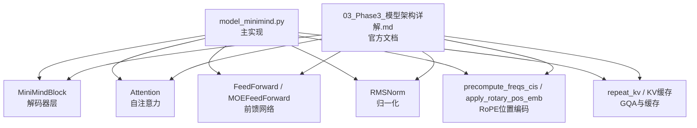
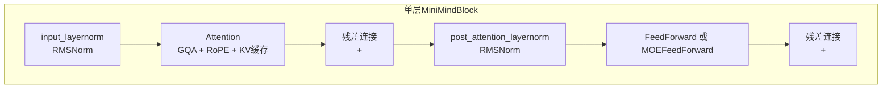
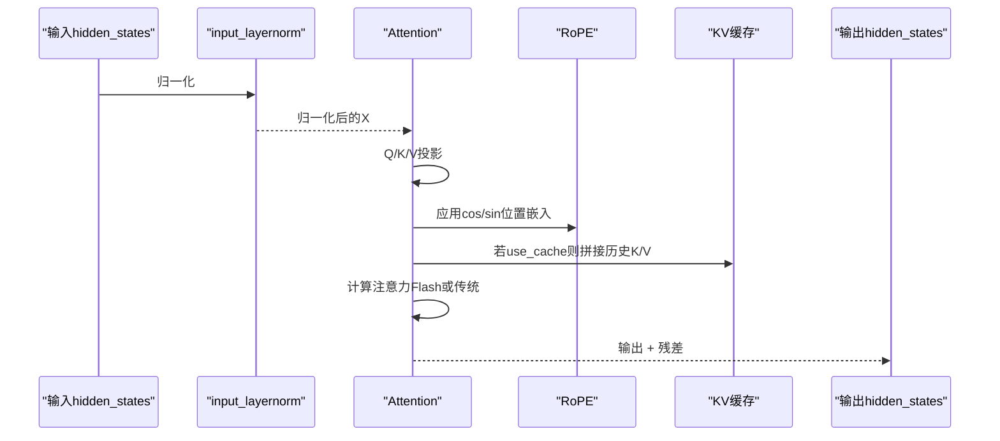
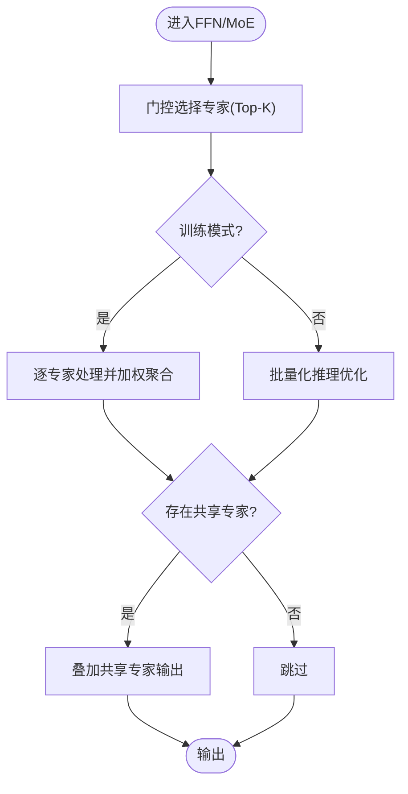
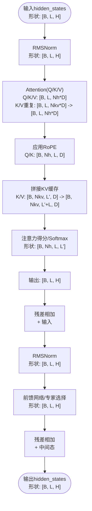
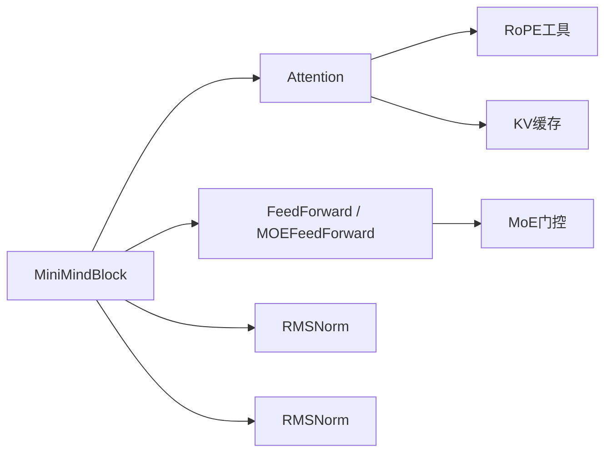

# 模型块结构

<cite>
**本文引用的文件列表**
- [model_minimind.py](file://model/model_minimind.py)
- [03_Phase3_模型架构详解.md](file://docs/03_Phase3_模型架构详解.md)
- [model_minimind.py（HF基线版本）](file://DST-train/model/baseline_hf/model_minimind.py)
- [configuration.json（MiniMind2-PyTorch）](file://MiniMind2-PyTorch/configuration.json)
- [tokenizer.json（模型目录）](file://model/tokenizer.json)
</cite>

## 目录
1. [简介](#简介)
2. [项目结构](#项目结构)
3. [核心组件](#核心组件)
4. [架构总览](#架构总览)
5. [详细组件分析](#详细组件分析)
6. [依赖关系分析](#依赖关系分析)
7. [性能考量](#性能考量)
8. [故障排查指南](#故障排查指南)
9. [结论](#结论)
10. [附录](#附录)

## 简介
本文件聚焦于MiniMindBlock模型块的详细技术文档，系统解析Transformer解码器层的标准结构与实现细节，包括：
- 自注意力与前馈网络的堆叠方式与顺序
- RMSNorm归一化的实现位置与作用机制（含数学原理与数值稳定性）
- 残差连接的设计思路与加法融合
- 位置嵌入的传递机制与缓存策略
- 模型块前向传播流程图与张量形状变化说明
- 可扩展性设计与自定义修改指南

## 项目结构
本仓库围绕MiniMind模型展开，关键文件与职责如下：
- 模型实现：model/model_minimind.py（主实现）、DST-train/model/baseline_hf/model_minimind.py（HF基线实现）
- 文档说明：docs/03_Phase3_模型架构详解.md（官方文档）
- 配置与分词器：MiniMind2-PyTorch/configuration.json、model/tokenizer.json
- 训练与评估脚本：trainer、scripts等（与本文主题关联较小）

图表来源
- [model_minimind.py:363-384](file://model/model_minimind.py#L363-L384)
- [model_minimind.py:150-226](file://model/model_minimind.py#L150-L226)
- [model_minimind.py:229-242](file://model/model_minimind.py#L229-L242)
- [model_minimind.py:95-106](file://model/model_minimind.py#L95-L106)
- [model_minimind.py:108-128](file://model/model_minimind.py#L108-L128)
- [model_minimind.py:140-147](file://model/model_minimind.py#L140-L147)

章节来源
- [model_minimind.py:1-477](file://model/model_minimind.py#L1-L477)
- [03_Phase3_模型架构详解.md:1-387](file://docs/03_Phase3_模型架构详解.md#L1-L387)

## 核心组件
- MiniMindBlock：单个解码器层，包含自注意力子层、前馈网络子层以及两处RMSNorm（Pre-LN与Post-LN）。
- Attention：实现多查询注意力（GQA），支持Flash Attention与传统注意力路径，内置KV缓存与RoPE应用。
- FeedForward/MOEFeedForward：SwiGLU前馈网络或MoE前馈网络，支持共享专家与辅助损失。
- RMSNorm：均方根归一化，提升数值稳定性与收敛效率。
- RoPE工具：预计算频率与旋转应用，支持YaRN外推。

章节来源
- [model_minimind.py:363-384](file://model/model_minimind.py#L363-L384)
- [model_minimind.py:150-226](file://model/model_minimind.py#L150-L226)
- [model_minimind.py:229-242](file://model/model_minimind.py#L229-L242)
- [model_minimind.py:95-106](file://model/model_minimind.py#L95-L106)
- [model_minimind.py:108-128](file://model/model_minimind.py#L108-L128)

## 架构总览
MiniMind采用Decoder-only架构，每个层遵循“Pre-LN + 自注意力 + 残差 + Post-LN + 前馈网络 + 残差”的堆叠顺序。位置嵌入通过RoPE注入，注意力采用GQA并支持KV缓存加速推理。

图表来源
- [model_minimind.py:363-384](file://model/model_minimind.py#L363-L384)
- [model_minimind.py:150-226](file://model/model_minimind.py#L150-L226)
- [model_minimind.py:229-242](file://model/model_minimind.py#L229-L242)
- [model_minimind.py:95-106](file://model/model_minimind.py#L95-L106)

## 详细组件分析

### MiniMindBlock：解码器层
- 结构组成
  - 输入归一化：input_layernorm（RMSNorm）
  - 自注意力：Attention（GQA + RoPE + KV缓存）
  - 残差连接：注意力输出与输入相加
  - 后归一化：post_attention_layernorm（RMSNorm）
  - 前馈网络：FeedForward或MOEFeedForward
  - 残差连接：FFN输出与中间态相加
- 关键点
  - Pre-LN顺序：先归一化再进入注意力，有助于稳定训练与推理。
  - 残差路径贯穿两个子层，缓解梯度消失并增强特征复用。
  - 前馈网络可切换为MoE，支持共享专家与辅助损失。

章节来源
- [model_minimind.py:363-384](file://model/model_minimind.py#L363-L384)
- [03_Phase3_模型架构详解.md:281-303](file://docs/03_Phase3_模型架构详解.md#L281-L303)

### Attention：自注意力与GQA
- GQA设置
  - 查询头数与KV头数可分离，通过repeat_kv进行重复以匹配查询头数。
- RoPE集成
  - 在Q/K投影后立即应用旋转，位置嵌入按当前解码步长切片传入。
- KV缓存
  - 推理时将历史K/V拼接到当前K/V，形成增量更新，显著降低重复计算。
- 注意力实现
  - 支持Flash Attention（PyTorch 2.0+）与传统路径，自动处理因果掩码与外部注意力掩码。

图表来源
- [model_minimind.py:150-226](file://model/model_minimind.py#L150-L226)
- [model_minimind.py:108-128](file://model/model_minimind.py#L108-L128)
- [model_minimind.py:140-147](file://model/model_minimind.py#L140-L147)

章节来源
- [model_minimind.py:150-226](file://model/model_minimind.py#L150-L226)
- [model_minimind.py:108-128](file://model/model_minimind.py#L108-L128)
- [model_minimind.py:140-147](file://model/model_minimind.py#L140-L147)

### FeedForward 与 MOEFeedForward：前馈网络
- FeedForward（SwiGLU）
  - 采用门控线性单元，中间维度按规则对齐至64的倍数，激活函数由配置指定。
- MOEFeedForward
  - 通过MoEGate选择Top-K专家，训练时逐专家处理，推理时批量化优化，支持共享专家与辅助损失。

图表来源
- [model_minimind.py:245-298](file://model/model_minimind.py#L245-L298)
- [model_minimind.py:301-360](file://model/model_minimind.py#L301-L360)

章节来源
- [model_minimind.py:229-242](file://model/model_minimind.py#L229-L242)
- [model_minimind.py:245-298](file://model/model_minimind.py#L245-L298)
- [model_minimind.py:301-360](file://model/model_minimind.py#L301-L360)

### RMSNorm：归一化与数值稳定性
- 数学原理
  - 对最后一维做均方根归一化，再乘以可学习缩放参数，使用float32计算以提升数值稳定性。
- 作用机制
  - Pre-LN：在子层前进行归一化，稳定梯度与激活分布。
  - Post-LN：在子层后进行归一化，保持输出尺度稳定。
- 误差控制
  - eps加入分母，避免除零；类型转换回原dtype，保证与下游计算兼容。

章节来源
- [model_minimind.py:95-106](file://model/model_minimind.py#L95-L106)
- [03_Phase3_模型架构详解.md:52-75](file://docs/03_Phase3_模型架构详解.md#L52-L75)

### 位置嵌入与缓存：RoPE与KV缓存
- RoPE
  - 预计算cos/sin频率，按最大位置长度注册为缓冲区；推理时按start_pos切片，避免重复计算。
  - 旋转应用于Q/K，结合YaRN可实现长序列外推。
- KV缓存
  - 推理时将past_key_value与当前K/V拼接，仅对新增token计算注意力，显著降低时间复杂度。

章节来源
- [model_minimind.py:108-128](file://model/model_minimind.py#L108-L128)
- [model_minimind.py:131-137](file://model/model_minimind.py#L131-L137)
- [model_minimind.py:186-190](file://model/model_minimind.py#L186-L190)
- [model_minimind.py:403-420](file://model/model_minimind.py#L403-L420)

### 前向传播流程与张量形状
以下以单层MiniMindBlock为例，给出前向传播的关键步骤与形状变化（批次B、序列L、隐藏维度H、头数Nh、KV头数Nkv、头维度D）：

图表来源
- [model_minimind.py:363-384](file://model/model_minimind.py#L363-L384)
- [model_minimind.py:150-226](file://model/model_minimind.py#L150-L226)
- [model_minimind.py:229-242](file://model/model_minimind.py#L229-L242)

章节来源
- [model_minimind.py:363-384](file://model/model_minimind.py#L363-L384)
- [model_minimind.py:150-226](file://model/model_minimind.py#L150-L226)
- [model_minimind.py:229-242](file://model/model_minimind.py#L229-L242)

### 可扩展性设计与自定义修改指南
- 子层替换
  - 可将Attention替换为其他注意力变体（如Longformer、BigBird），需保持接口一致（输入/输出形状与缓存格式）。
  - 可将FeedForward替换为ConvFFN、SparseFFN或自定义MoE配置。
- 归一化策略
  - 可在Pre-LN与Post-LN之间调整位置，或引入LayerNorm以对比效果。
- RoPE与外推
  - 可调整rope_theta与rope_scaling参数，或替换为其他相对位置编码方案。
- 残差连接
  - 可尝试门控残差、混合残差或分层残差，以探索不同融合策略。
- 训练与推理
  - 可开启/关闭use_cache与flash_attn，以平衡速度与内存占用。
- MoE扩展
  - 可增加共享专家数量、调整Top-K与评分函数，或引入路由一致性正则。

章节来源
- [model_minimind.py:363-384](file://model/model_minimind.py#L363-L384)
- [model_minimind.py:245-298](file://model/model_minimind.py#L245-L298)
- [model_minimind.py:301-360](file://model/model_minimind.py#L301-L360)

## 依赖关系分析
- 模块耦合
  - MiniMindBlock内部耦合：Attention与FeedForward/MOEFeedForward通过RMSNorm与残差连接耦合。
  - 外部依赖：RoPE工具函数、repeat_kv、KV缓存接口。
- 可能的循环依赖
  - 未发现直接循环导入；Attention与FeedForward相互独立。
- 外部集成点
  - 与transformers库的GenerationMixin、PreTrainedModel对接，便于推理与服务化。

图表来源
- [model_minimind.py:363-384](file://model/model_minimind.py#L363-L384)
- [model_minimind.py:150-226](file://model/model_minimind.py#L150-L226)
- [model_minimind.py:229-242](file://model/model_minimind.py#L229-L242)
- [model_minimind.py:245-298](file://model/model_minimind.py#L245-L298)

章节来源
- [model_minimind.py:363-384](file://model/model_minimind.py#L363-L384)
- [model_minimind.py:150-226](file://model/model_minimind.py#L150-L226)
- [model_minimind.py:229-242](file://model/model_minimind.py#L229-L242)
- [model_minimind.py:245-298](file://model/model_minimind.py#L245-L298)

## 性能考量
- 计算效率
  - Flash Attention在大序列时显著提速；GQA减少KV头数量，降低显存与计算开销。
- 内存占用
  - KV缓存按增量拼接，推理时显存随生成步数线性增长；可通过截断策略或混合精度降低峰值。
- 数值稳定性
  - RMSNorm使用float32归一化，eps避免除零；RoPE旋转避免了绝对位置编码的高维表示。
- 可扩展性
  - MoE在训练时增加通信与负载均衡成本，但可提升参数利用率；共享专家可降低MoE开销。

## 故障排查指南
- 形状不匹配
  - 确认Attention输入Q/K/V投影维度与head_dim一致；GQA下repeat_kv后应与Nh匹配。
- KV缓存错误
  - 检查past_key_value是否与当前K/V拼接；use_cache开关与推理模式一致。
- RoPE异常
  - 确认freqs_cos/freqs_sin已注册为缓冲区；start_pos切片与当前序列长度一致。
- 残差连接问题
  - 确保残差相加发生在正确的中间态；注意类型与设备一致性。
- MoE异常
  - 检查top_k与n_routed_experts配置；训练/推理分支的输出形状一致。

章节来源
- [model_minimind.py:150-226](file://model/model_minimind.py#L150-L226)
- [model_minimind.py:140-147](file://model/model_minimind.py#L140-L147)
- [model_minimind.py:403-420](file://model/model_minimind.py#L403-L420)

## 结论
MiniMindBlock以Pre-LN为核心范式，结合GQA、RoPE与KV缓存，实现了高效稳定的解码器层。RMSNorm在数值稳定性与收敛效率方面表现优异；残差连接贯穿注意力与前馈网络，增强了特征复用与梯度流动。通过MoE与可插拔子层，模型具备良好的可扩展性，便于在不同任务与资源约束下进行定制化优化。

## 附录
- 配置参考
  - 模型框架与任务类型：[configuration.json（MiniMind2-PyTorch）:1-1](file://MiniMind2-PyTorch/configuration.json#L1-L1)
  - 分词器配置：[tokenizer.json（模型目录）:1-200](file://model/tokenizer.json#L1-L200)
- 相关文档
  - 官方文档：[03_Phase3_模型架构详解.md:1-387](file://docs/03_Phase3_模型架构详解.md#L1-L387)