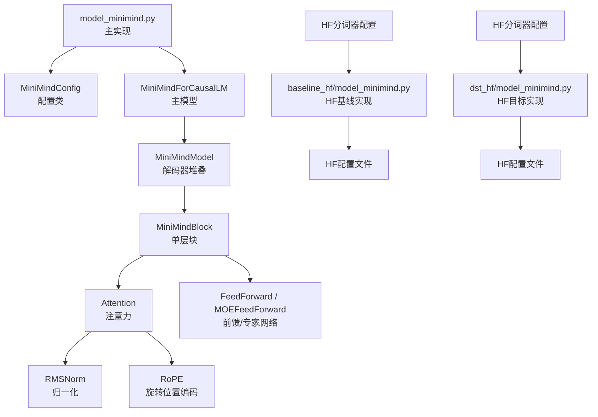
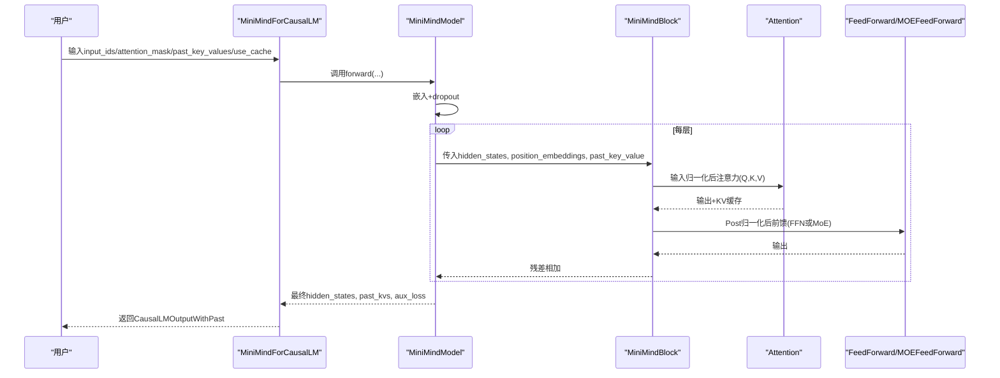
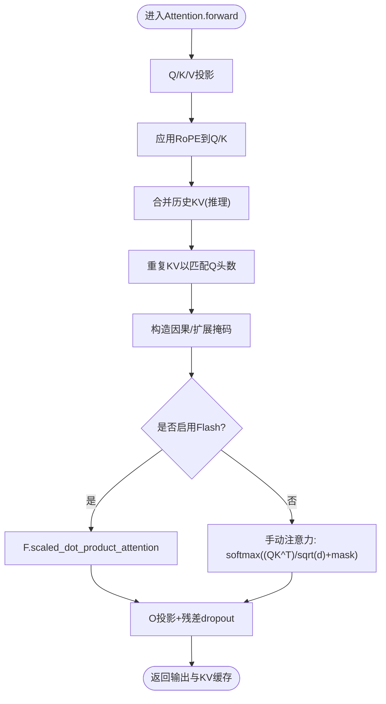
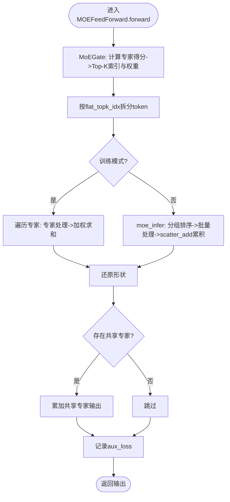
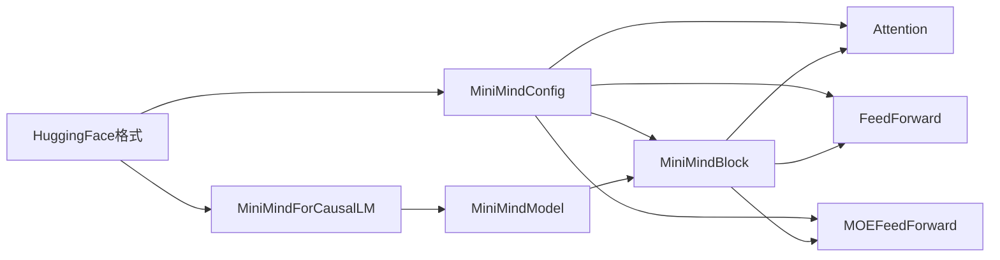

# 模型架构模块

<cite>
**本文引用的文件列表**
- [model_minimind.py](file://model/model_minimind.py)
- [model_minimind.py（HF基线）](file://DST-train/model/baseline_hf/model_minimind.py)
- [model_minimind.py（HF目标）](file://DST-train/model/dst_hf/model_minimind.py)
- [配置文件（HF基线）](file://DST-train/model/baseline_hf/config.json)
- [配置文件（HF目标）](file://DST-train/model/dst_hf/config.json)
- [分词器配置（HF基线）](file://DST-train/model/baseline_hf/tokenizer_config.json)
- [分词器配置（HF目标）](file://DST-train/model/dst_hf/tokenizer_config.json)
- [分词器文件（HF基线）](file://DST-train/model/baseline_hf/tokenizer.json)
- [分词器文件（HF目标）](file://DST-train/model/dst_hf/tokenizer.json)
- [聊天模板（HF基线）](file://DST-train/model/baseline_hf/chat_template.jinja)
- [聊天模板（HF目标）](file://DST-train/model/dst_hf/chat_template.jinja)
- [生成配置（HF基线）](file://DST-train/model/baseline_hf/generation_config.json)
- [生成配置（HF目标）](file://DST-train/model/dst_hf/generation_config.json)
- [模型格式转换脚本](file://DST-train/convert_for_eval.py)
- [模型架构文档](file://docs/03_Phase3_模型架构详解.md)
- [性能评测文档](file://.comate/specs/model-benchmark-eval/doc.md)
- [依赖清单](file://requirements.txt)
</cite>

## 目录
1. [简介](#简介)
2. [项目结构](#项目结构)
3. [核心组件](#核心组件)
4. [架构总览](#架构总览)
5. [详细组件分析](#详细组件分析)
6. [HuggingFace格式支持](#huggingface格式支持)
7. [依赖关系分析](#依赖关系分析)
8. [性能考量](#性能考量)
9. [故障排查指南](#故障排查指南)
10. [结论](#结论)
11. [附录](#附录)

## 简介
本文件面向MiniMind模型架构模块，系统化梳理配置类MiniMindConfig的设计思路与参数含义，深入解析主模型MiniMindForCausalLM的实现原理，包括Transformer解码器架构、RMSNorm归一化、RoPE旋转位置编码等核心技术；阐述Attention注意力机制的实现细节（含Flash Attention优化、KV缓存机制、多查询注意力GQA）；解析FeedForward前馈网络与MOEFeedForward混合专家网络（含专家选择、路由机制、辅助损失计算）；并提供参数配置说明、扩展建议与实践路径。

**更新** 新增对HuggingFace格式模型架构的完整支持，包括baseline_hf和dst_hf两种配置方案，提供标准化的配置文件、分词器文件和模型架构实现，支持更灵活的模型部署和评估。

## 项目结构
本仓库中与模型架构直接相关的关键文件如下：
- 模型实现与配置：model/model_minimind.py
- HF基线模型实现：DST-train/model/baseline_hf/model_minimind.py
- HF目标模型实现：DST-train/model/dst_hf/model_minimind.py
- HF配置样例：DST-train/model/baseline_hf/config.json、DST-train/model/dst_hf/config.json
- HF分词器配置：DST-train/model/baseline_hf/tokenizer_config.json、DST-train/model/dst_hf/tokenizer_config.json
- HF分词器文件：DST-train/model/baseline_hf/tokenizer.json、DST-train/model/dst_hf/tokenizer.json
- HF聊天模板：DST-train/model/baseline_hf/chat_template.jinja、DST-train/model/dst_hf/chat_template.jinja
- HF生成配置：DST-train/model/baseline_hf/generation_config.json、DST-train/model/dst_hf/generation_config.json
- 模型格式转换脚本：DST-train/convert_for_eval.py
- 模型架构文档：docs/03_Phase3_模型架构详解.md
- 性能评测文档：.comate/specs/model-benchmark-eval/doc.md
- 依赖清单：requirements.txt

**图表来源**
- [model_minimind.py:1-474](file://model/model_minimind.py#L1-L474)
- [model_minimind.py（HF基线）:1-477](file://DST-train/model/baseline_hf/model_minimind.py#L1-L477)
- [model_minimind.py（HF目标）:1-477](file://DST-train/model/dst_hf/model_minimind.py#L1-L477)

**章节来源**
- [model_minimind.py:1-474](file://model/model_minimind.py#L1-L474)
- [model_minimind.py（HF基线）:1-477](file://DST-train/model/baseline_hf/model_minimind.py#L1-L477)
- [model_minimind.py（HF目标）:1-477](file://DST-train/model/dst_hf/model_minimind.py#L1-L477)

## 核心组件
- MiniMindConfig：继承自PretrainedConfig，集中定义模型超参数，包含隐藏层维度、注意力头数、GQA设置、RoPE参数、Flash Attention开关、MoE相关配置等。
- MiniMindForCausalLM：基于PreTrainedModel与GenerationMixin，封装MiniMindModel与语言模型头，并实现权重共享（Embedding与lm_head共享）。
- MiniMindModel：嵌入层、若干MiniMindBlock堆叠、最终RMSNorm归一化，负责前向传播与KV缓存收集。
- MiniMindBlock：单层Transformer块，包含Pre-LN的输入归一化、Self-Attention、残差、Post-LN的MLP（Dense或MoE）。
- Attention：实现Q/K/V投影、RoPE注入、GQA重复KV、KV缓存、Flash Attention与兼容路径。
- FeedForward：SwiGLU前馈网络，中间维度按64对齐。
- MOEFeedForward：MoE门控路由、Top-K专家选择、辅助损失、共享专家融合。
- RMSNorm：均方根归一化，计算稳定、推理高效。
- RoPE：YaRN可选外推的旋转位置编码预计算与应用。

**章节来源**
- [model_minimind.py:8-78](file://model/model_minimind.py#L8-L78)
- [model_minimind.py:441-474](file://model/model_minimind.py#L441-L474)
- [model_minimind.py:385-438](file://model/model_minimind.py#L385-L438)
- [model_minimind.py:361-382](file://model/model_minimind.py#L361-L382)
- [model_minimind.py:150-224](file://model/model_minimind.py#L150-L224)
- [model_minimind.py:227-241](file://model/model_minimind.py#L227-L241)
- [model_minimind.py:299-358](file://model/model_minimind.py#L299-L358)
- [model_minimind.py:95-106](file://model/model_minimind.py#L95-L106)
- [model_minimind.py:108-128](file://model/model_minimind.py#L108-L128)

## 架构总览
MiniMind采用Decoder-only Transformer架构，遵循Pre-LN设计，使用RMSNorm与RoPE，结合GQA注意力与可选MoE前馈网络。推理时启用KV缓存，支持Flash Attention加速。

**图表来源**
- [model_minimind.py:441-474](file://model/model_minimind.py#L441-L474)
- [model_minimind.py:385-438](file://model/model_minimind.py#L385-L438)
- [model_minimind.py:361-382](file://model/model_minimind.py#L361-L382)
- [model_minimind.py:150-224](file://model/model_minimind.py#L150-L224)
- [model_minimind.py:299-358](file://model/model_minimind.py#L299-L358)

## 详细组件分析

### MiniMindConfig 配置类
- 设计要点
  - 以PretrainedConfig为基础，统一HuggingFace生态的配置接口。
  - 关键参数覆盖：隐藏层维度、层数、注意力头数与KV头数（GQA）、词表大小、最大序列长度、RoPE基础频率与可选YaRN外推、RMSNorm正则项、激活函数、Dropout、Flash Attention开关。
  - MoE专用参数：use_moe、每个token选择专家数、可路由专家总数、共享专家数、评分函数、辅助损失系数、序列级辅助损失、Top-K概率归一化。
- 参数含义与默认值
  - 基础：hidden_size、num_hidden_layers、num_attention_heads、num_key_value_heads、vocab_size、max_position_embeddings、rope_theta、rms_norm_eps、hidden_act、dropout、flash_attn。
  - 推理扩展：inference_rope_scaling控制是否启用YaRN外推，rope_scaling字典包含beta_fast、beta_slow、factor、original_max_position_embeddings、type。
  - MoE：use_moe、num_experts_per_tok、n_routed_experts、n_shared_experts、scoring_func、aux_loss_alpha、seq_aux、norm_topk_prob。
- 设计意图
  - 通过GQA降低KV计算与显存开销，同时保持多头表达能力。
  - 通过RMSNorm与RoPE提升稳定性与长序列泛化。
  - 通过MoE在不显著增加参数量的前提下扩大有效通道容量，并通过辅助损失维持路由均衡。

**章节来源**
- [model_minimind.py:8-78](file://model/model_minimind.py#L8-L78)
- [docs/03_Phase3_模型架构详解.md:27-50](file://docs/03_Phase3_模型架构详解.md#L27-L50)

### MiniMindForCausalLM 主模型
- 结构与职责
  - 封装MiniMindModel与语言模型头，实现权重共享（Embedding与lm_head共享），便于参数压缩与推理效率提升。
  - 统一返回CausalLMOutputWithPast，包含last_hidden_state、logits、past_key_values、aux_loss等。
- 前向传播
  - 调用MiniMindModel获取隐状态、KV缓存与MoE辅助损失，随后通过线性层映射到词表空间，按logits_to_keep切片输出。
- 与GenerationMixin集成
  - 支持generate等推理接口，利用KV缓存实现自回归解码。

**章节来源**
- [model_minimind.py:441-474](file://model/model_minimind.py#L441-L474)
- [model_minimind.py:385-438](file://model/model_minimind.py#L385-L438)

### MiniMindModel 解码器堆叠
- 组件
  - 嵌入层、若干MiniMindBlock、最终RMSNorm。
  - 预先计算并注册RoPE频率缓存（cos/sin），按起始位置截取用于当前步。
- KV缓存
  - 逐层收集present_key_value，供后续生成步复用。
- MoE辅助损失聚合
  - 遍历各层的MoE子层，汇总aux_loss。

**章节来源**
- [model_minimind.py:385-438](file://model/model_minimind.py#L385-L438)

### MiniMindBlock 单层块
- 结构
  - Pre-LN：输入先经RMSNorm，再进入Attention。
  - 残差连接：Attention输出与输入相加。
  - Post-LN：再经RMSNorm，进入MLP（Dense或MoE）。
- 注意力与前馈选择
  - 根据config.use_moe动态切换MLP实现。

**章节来源**
- [model_minimind.py:361-382](file://model/model_minimind.py#L361-L382)

### Attention 注意力机制
- 投影与维度
  - Q/K/V分别投影至num_attention_heads、num_key_value_heads、num_key_value_heads维，head_dim=hidden_size/num_attention_heads。
- RoPE注入
  - 将cos/sin按当前位置截取，对Q/K应用旋转。
- GQA与KV重复
  - n_rep = n_local_heads / n_local_kv_heads，对K/V按n_rep复制以匹配Q头数。
- KV缓存
  - 推理时将历史K/V与当前K/V拼接，形成增量KV缓存。
- 掩码与因果性
  - 自回归时添加上三角掩码；支持外部attention_mask扩展。
- Flash Attention与兼容路径
  - 若满足条件，使用F.scaled_dot_product_attention；否则手动实现注意力计算。
- Dropout
  - 注意力分数与残差投影均应用dropout。

**图表来源**
- [model_minimind.py:150-224](file://model/model_minimind.py#L150-L224)

**章节来源**
- [model_minimind.py:150-224](file://model/model_minimind.py#L150-L224)

### FeedForward 前馈网络
- SwiGLU结构
  - gate_proj与up_proj并行，经ACT2FN[hidden_act]后逐元素相乘，再经down_proj降维。
  - 中间维度intermediate_size按64对齐，确保张量操作友好。
- Dropout与激活
  - 前馈输出经dropout，激活函数由配置指定。

**章节来源**
- [model_minimind.py:227-241](file://model/model_minimind.py#L227-L241)

### MOEFeedForward 混合专家网络
- 专家集合与门控
  - experts为n_routed_experts个FeedForward专家；shared_experts为始终参与的专家集合。
  - MoEGate根据hidden_states计算专家得分，Top-K选择专家并可选归一化权重。
- 前向传播
  - 训练：按flat_topk_idx将token分发给对应专家，加权求和。
  - 推理：moe_infer按专家分组批量处理，使用scatter_add累积加权输出。
- 辅助损失
  - 训练时按seq_aux策略计算专家选择分布与平均分数的乘积，乘以alpha系数，作为负载均衡约束。
- 共享专家
  - 将共享专家输出累加到最终结果。

**图表来源**
- [model_minimind.py:299-358](file://model/model_minimind.py#L299-L358)
- [model_minimind.py:243-296](file://model/model_minimind.py#L243-L296)

**章节来源**
- [model_minimind.py:299-358](file://model/model_minimind.py#L299-L358)
- [model_minimind.py:243-296](file://model/model_minimind.py#L243-L296)

### RMSNorm 归一化
- 计算方式
  - 先按均方根归一化，再乘以可学习缩放参数weight，数值类型保持不变。
- 优势
  - 计算更轻量，推理更快，实验效果与LayerNorm相当。

**章节来源**
- [model_minimind.py:95-106](file://model/model_minimind.py#L95-L106)

### RoPE 旋转位置编码
- 频率预计算
  - 根据rope_theta与head_dim生成频率序列，支持YaRN可选外推，按位置计算cos/sin。
- 应用方式
  - 将cos/sin按当前位置截取，对Q/K进行旋转半向变换后相加。
- 外推能力
  - YaRN通过可变缩放因子扩展到更长上下文。

**章节来源**
- [model_minimind.py:108-128](file://model/model_minimind.py#L108-L128)
- [model_minimind.py:131-137](file://model/model_minimind.py#L131-L137)

## HuggingFace格式支持

### HF配置文件结构
新增的HuggingFace格式模型包含以下标准化文件结构：

- **config.json**：核心配置文件，定义模型架构参数
- **tokenizer.json**：BPE分词器词汇表和配置
- **tokenizer_config.json**：分词器配置参数
- **generation_config.json**：生成配置参数
- **chat_template.jinja**：聊天模板，支持工具调用和思维链
- **model_minimind.py**：完整的模型实现文件

### 基线模型配置（baseline_hf）
- 模型类型：MiniMindForCausalLM
- 隐藏层维度：512
- 层数：8
- 注意力头数：8
- KV头数：2
- 词表大小：6400
- 最大位置嵌入：32768
- RoPE基础频率：1000000.0
- 使用MoE：False
- Flash Attention：True
- 数据类型：float16

### 目标模型配置（dst_hf）
- 参数设置与基线模型完全相同
- 专门用于知识蒸馏后的模型部署
- 支持相同的分词器和聊天模板

### 分词器配置
- **tokenizer_config.json**：配置BPE分词器，支持特殊token
- **tokenizer.json**：包含31042个词汇的完整BPE词汇表
- 特殊token：`<|im_start|>`（开始）和`<|im_end|>`（结束）
- 最大长度：32768字符

### 聊天模板功能
- 支持系统消息、用户消息、助手消息的标准对话格式
- 工具调用支持：`<tools>`标签内的函数签名
- 思维链支持：可选的<think>标签
- JSON格式的工具调用响应

### 自动类注册
模型实现中包含自动类注册机制：
- `MiniMindConfig.register_for_auto_class()`
- `MiniMindForCausalLM.register_for_auto_class("AutoModelForCausalLM")`

这使得模型可以直接通过HuggingFace的Auto类进行加载和使用。

### 模型格式转换
提供完整的格式转换脚本，支持：
- PyTorch权重到HuggingFace格式的转换
- 支持baseline、dst_phase1、dst_pruned、dst_recovered四种模型类型
- 自动复制分词器配置
- 支持float16和bfloat16精度保存

**章节来源**
- [model_minimind.py（HF基线）:1-477](file://DST-train/model/baseline_hf/model_minimind.py#L1-L477)
- [model_minimind.py（HF目标）:1-477](file://DST-train/model/dst_hf/model_minimind.py#L1-L477)
- [配置文件（HF基线）:1-37](file://DST-train/model/baseline_hf/config.json#L1-L37)
- [配置文件（HF目标）:1-37](file://DST-train/model/dst_hf/config.json#L1-L37)
- [分词器配置（HF基线）:1-18](file://DST-train/model/baseline_hf/tokenizer_config.json#L1-L18)
- [分词器配置（HF目标）:1-18](file://DST-train/model/dst_hf/tokenizer_config.json#L1-L18)
- [聊天模板（HF基线）:1-74](file://DST-train/model/baseline_hf/chat_template.jinja#L1-L74)
- [聊天模板（HF目标）:1-74](file://DST-train/model/dst_hf/chat_template.jinja#L1-L74)
- [模型格式转换脚本:1-154](file://DST-train/convert_for_eval.py#L1-L154)

## 依赖关系分析
- 外部库
  - torch、transformers（PreTrainedModel、GenerationMixin、CausalLMOutputWithPast、ACT2FN）、typing（Optional/Tuple/List/Union）。
- 内部模块
  - RMSNorm、RoPE工具函数、Attention、FeedForward、MoEGate、MOEFeedForward、MiniMindBlock、MiniMindModel、MiniMindForCausalLM。
- 关键耦合点
  - Attention依赖RoPE频率缓存与config中的头数、head_dim、flash_attn。
  - MiniMindBlock在MLP选择上依赖config.use_moe。
  - MiniMindModel在KV缓存与RoPE截取上依赖past_key_values与start_pos。

**图表来源**
- [model_minimind.py:8-78](file://model/model_minimind.py#L8-L78)
- [model_minimind.py:150-224](file://model/model_minimind.py#L150-L224)
- [model_minimind.py:227-241](file://model/model_minimind.py#L227-L241)
- [model_minimind.py:299-358](file://model/model_minimind.py#L299-L358)
- [model_minimind.py:361-382](file://model/model_minimind.py#L361-L382)
- [model_minimind.py:385-438](file://model/model_minimind.py#L385-L438)
- [model_minimind.py:441-474](file://model/model_minimind.py#L441-L474)

**章节来源**
- [model_minimind.py:8-78](file://model/model_minimind.py#L8-L78)
- [model_minimind.py:150-224](file://model/model_minimind.py#L150-L224)
- [model_minimind.py:299-358](file://model/model_minimind.py#L299-L358)
- [model_minimind.py:361-382](file://model/model_minimind.py#L361-L382)
- [model_minimind.py:385-438](file://model/model_minimind.py#L385-L438)
- [model_minimind.py:441-474](file://model/model_minimind.py#L441-L474)

## 性能考量
- 计算与内存
  - GQA通过减少KV头数降低KV计算与KV缓存占用，适合长序列与高并发推理。
  - RMSNorm避免均值计算，减少算子开销。
  - SwiGLU中间维度按64对齐，有利于张量核优化。
- 推理加速
  - Flash Attention在PyTorch 2.0+上提供高效SDPA实现；兼容路径保留手动注意力。
  - KV缓存复用显著降低自回归生成的重复计算。
- MoE收益与代价
  - 通过Top-K路由扩大有效通道容量；辅助损失有助于路由均衡，避免专家"冷热不均"。
  - 推理时moe_infer按专家分组批量处理，减少分支开销。
- 长序列与外推
  - YaRN可选外推使RoPE在更长上下文中保持相对位置编码的有效性。
- HuggingFace格式优势
  - 标准化的配置文件结构，便于模型部署和评估。
  - 完整的分词器支持，确保文本处理的一致性。
  - 自动类注册机制，简化模型加载流程。

**章节来源**
- [model_minimind.py:150-224](file://model/model_minimind.py#L150-L224)
- [model_minimind.py:299-358](file://model/model_minimind.py#L299-L358)
- [model_minimind.py:108-128](file://model/model_minimind.py#L108-L128)

## 故障排查指南
- Flash Attention不可用
  - 现象：未使用Flash Attention，提示"使用慢速注意力"。原因可能是PyTorch版本过低或禁用。
  - 处理：升级至PyTorch 2.0+，确认config.flash_attn为True。
- KV缓存异常
  - 现象：推理时past_key_values维度不匹配或报错。
  - 处理：确保MiniMindModel.forward正确传入past_key_values列表，且每层KV形状与n_rep一致。
- RoPE外推无效
  - 现象：长序列下位置编码退化。
  - 处理：启用inference_rope_scaling并设置rope_scaling参数；确认max_position_embeddings与rope_theta合理。
- MoE路由崩塌
  - 现象：训练中某些专家几乎不被选择。
  - 处理：提高aux_loss_alpha，开启seq_aux，确保n_routed_experts足够大，Top-K合理。
- 激活函数不支持
  - 现象：MoEGate评分函数不支持。
  - 处理：当前仅支持softmax评分函数，若需扩展请在MoEGate中添加新实现。
- HuggingFace格式加载失败
  - 现象：无法通过Auto类加载模型。
  - 处理：确认模型文件夹包含完整的配置文件和权重文件，检查auto_map配置。
- 分词器不匹配
  - 现象：文本编码结果异常。
  - 处理：确保使用对应的tokenizer_config.json和tokenizer.json文件，检查特殊token配置。

**章节来源**
- [model_minimind.py:166](file://model/model_minimind.py#L166)
- [model_minimind.py:184-188](file://model/model_minimind.py#L184-L188)
- [model_minimind.py:57-64](file://model/model_minimind.py#L57-L64)
- [model_minimind.py:266-269](file://model/model_minimind.py#L266-L269)

## 结论
MiniMind在保持简洁高效的Transformer解码器基础上，引入了RMSNorm、RoPE、GQA与可选MoE等关键技术，兼顾推理效率与表达能力。配置类MiniMindConfig提供了清晰的参数体系，便于在不同规模与场景间灵活切换。Attention与MoE的实现细节体现了工程化取舍：在保证稳定性的同时最大化性能与可扩展性。

**更新** 新增的HuggingFace格式支持进一步提升了模型的可用性和部署灵活性，标准化的配置文件结构和完整的分词器支持使得模型能够更好地融入HuggingFace生态系统，便于进行模型评估、部署和集成。

## 附录

### 参数配置说明（摘要）
- 基础参数
  - hidden_size、num_hidden_layers、num_attention_heads、num_key_value_heads、vocab_size、max_position_embeddings、rope_theta、rms_norm_eps、hidden_act、dropout、flash_attn。
- 推理扩展
  - inference_rope_scaling、rope_scaling（beta_fast、beta_slow、factor、original_max_position_embeddings、type）。
- MoE参数
  - use_moe、num_experts_per_tok、n_routed_experts、n_shared_experts、scoring_func、aux_loss_alpha、seq_aux、norm_topk_prob。

**章节来源**
- [model_minimind.py:8-78](file://model/model_minimind.py#L8-L78)
- [docs/03_Phase3_模型架构详解.md:27-50](file://docs/03_Phase3_模型架构详解.md#L27-L50)

### 代码示例路径
- 构建配置与模型
  - [构建配置与模型示例:347-359](file://docs/03_Phase3_模型架构详解.md#L347-L359)
- 对比Dense与MoE
  - [Dense与MoE参数量对比示例:361-374](file://docs/03_Phase3_模型架构详解.md#L361-L374)

**章节来源**
- [docs/03_Phase3_模型架构详解.md:347-374](file://docs/03_Phase3_模型架构详解.md#L347-L374)

### 扩展指南
- 添加新的MoE评分函数
  - 在MoEGate中扩展scoring_func分支，并在forward中实现相应逻辑。
- 自定义RoPE外推策略
  - 在precompute_freqs_cis中加入新的外推算法，更新rope_scaling字典。
- 引入其他前馈变体
  - 在MiniMindBlock中替换MLP实现，或新增条件分支以支持更多变体。
- 优化KV缓存
  - 在Attention中进一步优化KV拼接与缓存存储策略，减少显存碎片。
- HuggingFace格式扩展
  - 可以基于现有HF格式添加新的配置选项，如不同的MoE设置或特殊的分词器配置。
- 聊天模板定制
  - 根据具体应用场景修改chat_template.jinja，支持特定的工具调用格式或对话风格。

**章节来源**
- [model_minimind.py:243-296](file://model/model_minimind.py#L243-L296)
- [model_minimind.py:108-128](file://model/model_minimind.py#L108-L128)
- [model_minimind.py:361-382](file://model/model_minimind.py#L361-L382)