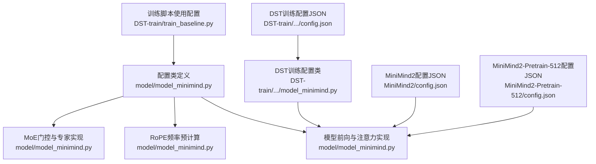
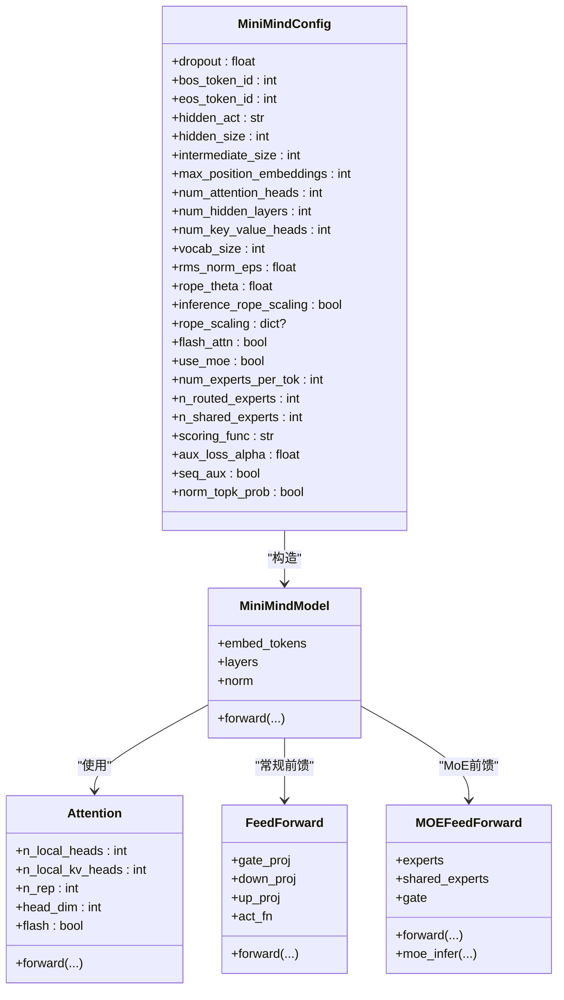
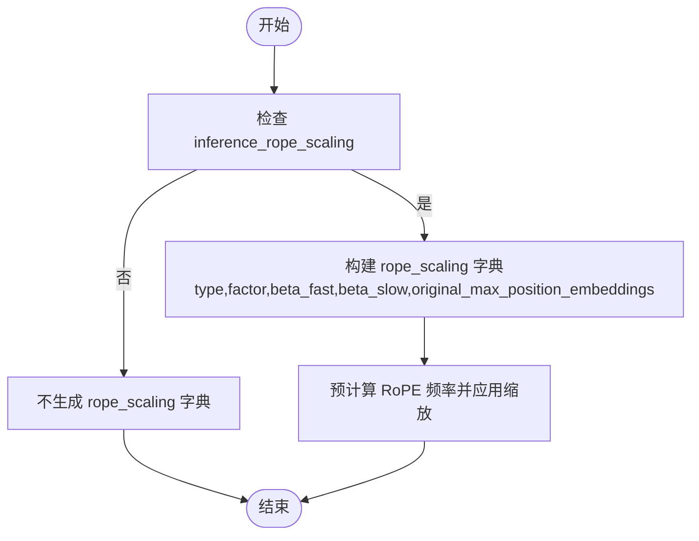
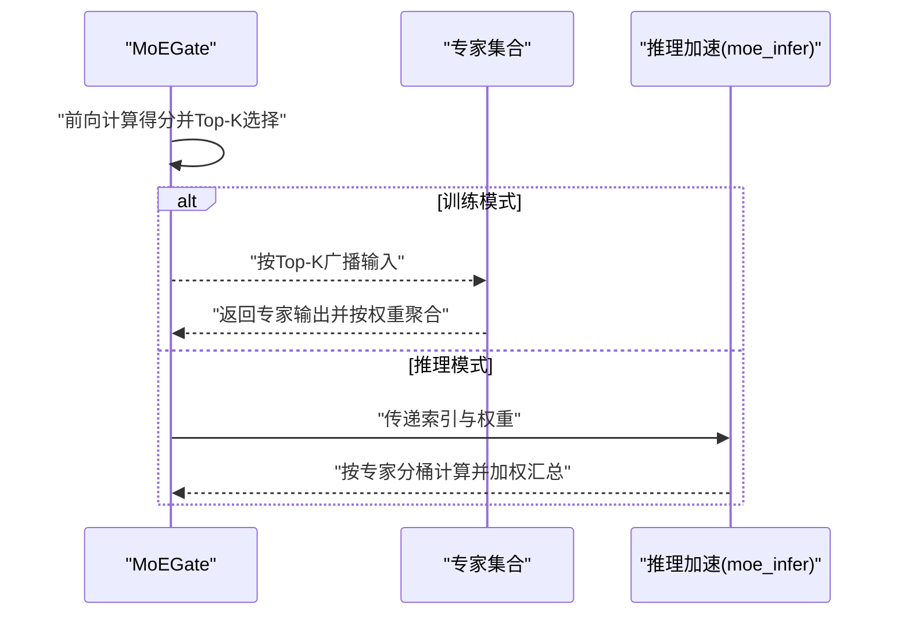
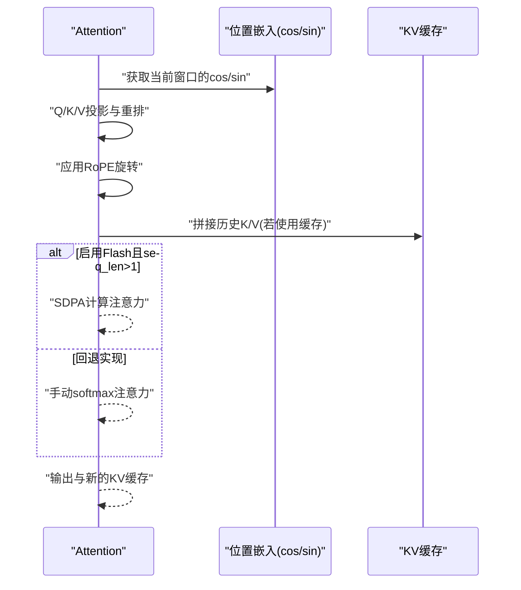
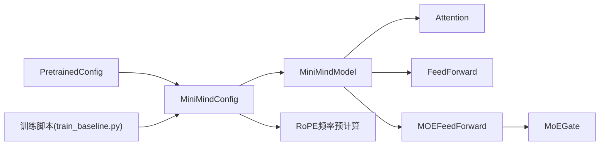

# 模型配置类

<cite>
**本文引用的文件**
- [model/model_minimind.py](file://model/model_minimind.py)
- [DST-train/model/baseline_hf/model_minimind.py](file://DST-train/model/baseline_hf/model_minimind.py)
- [DST-train/model/dst_hf/model_minimind.py](file://DST-train/model/dst_hf/model_minimind.py)
- [DST-train/model/baseline_hf/config.json](file://DST-train/model/baseline_hf/config.json)
- [DST-train/model/dst_hf/config.json](file://DST-train/model/dst_hf/config.json)
- [MiniMind2/config.json](file://MiniMind2/config.json)
- [MiniMind2-Pretrain-512/config.json](file://MiniMind2-Pretrain-512/config.json)
- [DST-train/train_baseline.py](file://DST-train/train_baseline.py)
</cite>

## 目录
1. [简介](#简介)
2. [项目结构](#项目结构)
3. [核心组件](#核心组件)
4. [架构总览](#架构总览)
5. [详细组件分析](#详细组件分析)
6. [依赖关系分析](#依赖关系分析)
7. [性能考量](#性能考量)
8. [故障排查指南](#故障排查指南)
9. [结论](#结论)
10. [附录：配置示例与调优指南](#附录配置示例与调优指南)

## 简介
本文件面向MiniMindConfig配置类，系统性梳理其设计思路与参数语义，覆盖基础参数（如hidden_size、num_attention_heads、num_hidden_layers等）、高级参数（如rope_theta、flash_attn等）、混合专家（MoE）相关参数（use_moe、num_experts_per_tok、n_routed_experts等），以及RoPE旋转位置编码的配置项（inference_rope_scaling与rope_scaling）。同时提供最佳实践建议、性能影响分析与具体配置示例，帮助读者在不同场景下高效调参。

## 项目结构
本仓库中与MiniMindConfig直接相关的核心文件如下：
- 配置类定义与模型实现：model/model_minimind.py
- DST训练版本的配置类与配置文件：DST-train/model/baseline_hf/model_minimind.py、DST-train/model/dst_hf/model_minimind.py、DST-train/model/baseline_hf/config.json、DST-train/model/dst_hf/config.json
- 其他参考配置：MiniMind2/config.json、MiniMind2-Pretrain-512/config.json
- 训练脚本对配置的使用：DST-train/train_baseline.py

图表来源
- [model/model_minimind.py:8-78](file://model/model_minimind.py#L8-L78)
- [model/model_minimind.py:108-128](file://model/model_minimind.py#L108-L128)
- [model/model_minimind.py:243-296](file://model/model_minimind.py#L243-L296)
- [DST-train/model/baseline_hf/model_minimind.py:8-78](file://DST-train/model/baseline_hf/model_minimind.py#L8-L78)
- [DST-train/model/baseline_hf/config.json:1-37](file://DST-train/model/baseline_hf/config.json#L1-L37)
- [MiniMind2/config.json:1-33](file://MiniMind2/config.json#L1-L33)
- [MiniMind2-Pretrain-512/config.json:1-33](file://MiniMind2-Pretrain-512/config.json#L1-L33)
- [DST-train/train_baseline.py:104-118](file://DST-train/train_baseline.py#L104-L118)

章节来源
- [model/model_minimind.py:8-78](file://model/model_minimind.py#L8-L78)
- [DST-train/model/baseline_hf/model_minimind.py:8-78](file://DST-train/model/baseline_hf/model_minimind.py#L8-L78)
- [DST-train/model/dst_hf/model_minimind.py:8-78](file://DST-train/model/dst_hf/model_minimind.py#L8-L78)
- [DST-train/model/baseline_hf/config.json:1-37](file://DST-train/model/baseline_hf/config.json#L1-L37)
- [DST-train/model/dst_hf/config.json:1-37](file://DST-train/model/dst_hf/config.json#L1-L37)
- [MiniMind2/config.json:1-33](file://MiniMind2/config.json#L1-L33)
- [MiniMind2-Pretrain-512/config.json:1-33](file://MiniMind2-Pretrain-512/config.json#L1-L33)
- [DST-train/train_baseline.py:104-118](file://DST-train/train_baseline.py#L104-L118)

## 核心组件
本节聚焦MiniMindConfig的参数体系与职责边界，按“基础参数—高级参数—MoE参数—RoPE参数”的顺序展开，并给出参数间的关系与默认行为。

- 基础参数
  - dropout：隐藏层输出的dropout比例
  - bos_token_id、eos_token_id：句子起止标记ID
  - hidden_act：激活函数名称
  - hidden_size：隐藏层维度
  - intermediate_size：前馈网络中间维度（未指定时按规则推导）
  - max_position_embeddings：最大位置编码长度
  - num_attention_heads：注意力头数
  - num_hidden_layers：Transformer层数
  - num_key_value_heads：KV头数（支持组查询注意力）
  - vocab_size：词表大小
  - rms_norm_eps：RMSNorm的数值稳定小量
  - rope_theta：RoPE频率的基础尺度
  - inference_rope_scaling：是否启用推理时的RoPE外推缩放
  - flash_attn：是否启用Flash Attention（需PyTorch≥2.0的SDPA）

- MoE相关参数
  - use_moe：是否启用MoE前馈
  - num_experts_per_tok：每个token路由到的专家数量（Top-K）
  - n_routed_experts：可路由专家总数
  - n_shared_experts：共享专家数量（始终参与）
  - scoring_func：专家打分函数（当前支持softmax）
  - aux_loss_alpha：辅助损失系数（专家使用均匀性正则）
  - seq_aux：是否按序列级统计专家使用分布
  - norm_topk_prob：是否对Top-K概率做归一化

- RoPE相关参数
  - rope_theta：RoPE频率倒数的基数
  - inference_rope_scaling：是否在推理时启用YARN风格的外推缩放
  - rope_scaling：当启用推理外推时，内部生成的缩放配置字典，包含type、factor、beta_fast、beta_slow、original_max_position_embeddings等键

章节来源
- [model/model_minimind.py:11-78](file://model/model_minimind.py#L11-L78)
- [DST-train/model/baseline_hf/model_minimind.py:11-78](file://DST-train/model/baseline_hf/model_minimind.py#L11-L78)
- [DST-train/model/dst_hf/model_minimind.py:11-78](file://DST-train/model/dst_hf/model_minimind.py#L11-L78)

## 架构总览
MiniMindConfig作为配置载体，贯穿以下关键环节：
- 参数初始化与默认值设定
- RoPE频率预计算与位置嵌入
- 注意力模块（含Flash Attention与传统注意力）
- 前馈模块（常规或MoE）
- 模型前向与缓存KV（past_key_values）

图表来源
- [model/model_minimind.py:8-78](file://model/model_minimind.py#L8-L78)
- [model/model_minimind.py:385-438](file://model/model_minimind.py#L385-L438)
- [model/model_minimind.py:150-224](file://model/model_minimind.py#L150-L224)
- [model/model_minimind.py:227-241](file://model/model_minimind.py#L227-L241)
- [model/model_minimind.py:299-358](file://model/model_minimind.py#L299-L358)

## 详细组件分析

### 配置类参数详解与设计意图
- 基础参数
  - hidden_size、num_attention_heads、num_hidden_layers、num_key_value_heads：决定模型规模与注意力并行度，直接影响显存占用与吞吐
  - intermediate_size：前馈中间维度；未显式设置时按规则向上取整到64倍数，利于张量核优化
  - max_position_embeddings、rope_theta：位置编码长度与频率基数，rope_theta越大，高频越密集，适合长上下文
  - rms_norm_eps：数值稳定性，过小可能导致梯度不稳定
  - dropout、hidden_act：正则与非线性，影响收敛与过拟合
  - vocab_size、bos/eos_token_id：词表与特殊符号
- 高级参数
  - flash_attn：启用后使用PyTorch SDPA，显著提升注意力效率；若设备不满足要求会回退到传统实现
  - inference_rope_scaling：仅在推理阶段启用外推缩放，避免显存重复加载更大权重
  - rope_scaling：当启用推理外推时，内部生成包含type、factor、beta_fast、beta_slow、original_max_position_embeddings的字典，用于YaRN风格的频率缩放
- MoE参数
  - use_moe：开启后将常规前馈替换为MOEFeedForward
  - num_experts_per_tok、n_routed_experts：控制路由粒度与专家总量，影响负载均衡与通信开销
  - scoring_func：当前仅支持softmax；后续可扩展为其他打分策略
  - aux_loss_alpha、seq_aux：通过专家使用均匀性正则提升多样性与稳定性
  - norm_topk_prob：对Top-K概率做归一化，缓解概率集中导致的路由偏差
- RoPE参数
  - rope_theta：RoPE频率倒数基数，影响高频分量分布
  - inference_rope_scaling：仅推理时生效，结合rope_scaling字典进行外推缩放

章节来源
- [model/model_minimind.py:11-78](file://model/model_minimind.py#L11-L78)
- [model/model_minimind.py:54-64](file://model/model_minimind.py#L54-L64)
- [model/model_minimind.py:243-296](file://model/model_minimind.py#L243-L296)
- [model/model_minimind.py:108-128](file://model/model_minimind.py#L108-L128)

### RoPE外推缩放流程
推理时若启用inference_rope_scaling，则根据rope_scaling字典对频率进行YaRN风格缩放，以支持超出原始max_position_embeddings的长度。

图表来源
- [model/model_minimind.py:54-64](file://model/model_minimind.py#L54-L64)
- [model/model_minimind.py:108-128](file://model/model_minimind.py#L108-L128)

### MoE门控与前馈执行流程
MoE前馈在训练与推理阶段采用不同路径，训练时对每个token重复专家输入并加权聚合，推理时按专家分桶减少重复计算。

图表来源
- [model/model_minimind.py:243-296](file://model/model_minimind.py#L243-L296)
- [model/model_minimind.py:337-358](file://model/model_minimind.py#L337-L358)

### 注意力与KV缓存调用序列
注意力模块根据flash_attn标志选择SDPA或手动实现；同时支持KV缓存以加速自回归解码。

图表来源
- [model/model_minimind.py:150-224](file://model/model_minimind.py#L150-L224)

## 依赖关系分析
- 配置类依赖于transformers.PretrainedConfig，确保与HuggingFace生态兼容
- 模型前向依赖RoPE频率预计算结果与注意力实现
- MoE前馈依赖门控模块与专家集合，门控负责路由与辅助损失
- 训练脚本通过argparse传入部分参数并实例化配置类

图表来源
- [model/model_minimind.py:8-78](file://model/model_minimind.py#L8-L78)
- [model/model_minimind.py:385-438](file://model/model_minimind.py#L385-L438)
- [model/model_minimind.py:299-358](file://model/model_minimind.py#L299-L358)
- [DST-train/train_baseline.py:104-118](file://DST-train/train_baseline.py#L104-L118)

章节来源
- [model/model_minimind.py:8-78](file://model/model_minimind.py#L8-L78)
- [DST-train/train_baseline.py:104-118](file://DST-train/train_baseline.py#L104-L118)

## 性能考量
- 显存与吞吐
  - hidden_size、num_attention_heads、num_hidden_layers、intermediate_size共同决定参数量与算子开销
  - num_key_value_heads影响KV头并行度，有助于降低KV存储与计算压力
- 注意力效率
  - flash_attn在满足条件时显著降低注意力时间，但需注意掩码与因果性的组合
- RoPE外推
  - inference_rope_scaling仅在推理启用，避免重复加载大权重，提高长上下文解码效率
- MoE
  - 提升参数与计算规模的同时带来专家间通信与负载均衡挑战；aux_loss与seq_aux有助于稳定训练
  - num_experts_per_tok与n_routed_experts需平衡“多样性”与“开销”

[本节为通用性能讨论，无需列出章节来源]

## 故障排查指南
- Flash Attention不可用
  - 现象：注意力回退到慢速实现
  - 原因：设备不满足SDPA要求
  - 处理：确认PyTorch版本与CUDA能力；或关闭flash_attn
- 掩码与因果性冲突
  - 现象：注意力报错或结果异常
  - 原因：attention_mask与因果掩码叠加不当
  - 处理：确保attention_mask与因果掩码正确组合
- MoE训练不稳定
  - 现象：aux_loss过大或梯度爆炸
  - 原因：aux_loss_alpha过大、seq_aux统计方式不当
  - 处理：适当降低aux_loss_alpha，检查seq_aux与数据分布
- RoPE外推无效
  - 现象：长上下文解码性能未提升
  - 原因：inference_rope_scaling未启用或rope_scaling未正确生成
  - 处理：确认inference_rope_scaling为True，检查max_position_embeddings与rope_scaling配置

章节来源
- [model/model_minimind.py:165-224](file://model/model_minimind.py#L165-L224)
- [model/model_minimind.py:277-296](file://model/model_minimind.py#L277-L296)
- [model/model_minimind.py:54-64](file://model/model_minimind.py#L54-L64)

## 结论
MiniMindConfig以清晰的参数分层与合理的默认值，为MiniMind模型提供了灵活而高效的配置方案。通过合理设置基础参数、启用Flash Attention、谨慎使用MoE与RoPE外推，可在不同硬件与任务场景下取得良好的速度与质量平衡。建议在长上下文与大规模MoE场景下优先启用推理外推与辅助损失，并结合实际资源约束调整专家数量与Top-K路由策略。

[本节为总结性内容，无需列出章节来源]

## 附录：配置示例与调优指南

- 基础配置示例（来自训练脚本）
  - 示例路径：[DST-train/train_baseline.py:117-118](file://DST-train/train_baseline.py#L117-L118)
  - 关键点：通过命令行参数动态传入hidden_size、num_hidden_layers、use_moe等，便于快速对比实验

- MoE配置示例（来自DST训练配置JSON）
  - 示例路径：[DST-train/model/baseline_hf/config.json:21-34](file://DST-train/model/baseline_hf/config.json#L21-L34)
  - 关键点：use_moe、num_experts_per_tok、n_routed_experts、n_shared_experts、scoring_func、aux_loss_alpha、seq_aux、norm_topk_prob

- RoPE配置示例（来自DST训练配置JSON）
  - 示例路径：[DST-train/model/baseline_hf/config.json:16-29](file://DST-train/model/baseline_hf/config.json#L16-L29)
  - 关键点：inference_rope_scaling、rope_theta、rope_parameters

- 参考配置（MiniMind2系列）
  - 示例路径：[MiniMind2/config.json:12-31](file://MiniMind2/config.json#L12-L31)、[MiniMind2-Pretrain-512/config.json:12-31](file://MiniMind2-Pretrain-512/config.json#L12-L31)
  - 关键点：hidden_size、num_hidden_layers、num_attention_heads、num_key_value_heads、rms_norm_eps、rope_parameters

- 调优建议
  - 小模型/短上下文：保持默认，适度降低hidden_size与num_hidden_layers；关闭MoE
  - 中等模型/中等上下文：启用flash_attn；适度开启MoE并设置较小的num_experts_per_tok
  - 大模型/长上下文：启用inference_rope_scaling；谨慎增大n_routed_experts；合理设置aux_loss_alpha与seq_aux
  - 稳定性优先：降低aux_loss_alpha，启用norm_topk_prob；在训练初期使用较小的num_experts_per_tok

章节来源
- [DST-train/train_baseline.py:117-118](file://DST-train/train_baseline.py#L117-L118)
- [DST-train/model/baseline_hf/config.json:21-34](file://DST-train/model/baseline_hf/config.json#L21-L34)
- [DST-train/model/baseline_hf/config.json:16-29](file://DST-train/model/baseline_hf/config.json#L16-L29)
- [MiniMind2/config.json:12-31](file://MiniMind2/config.json#L12-L31)
- [MiniMind2-Pretrain-512/config.json:12-31](file://MiniMind2-Pretrain-512/config.json#L12-L31)