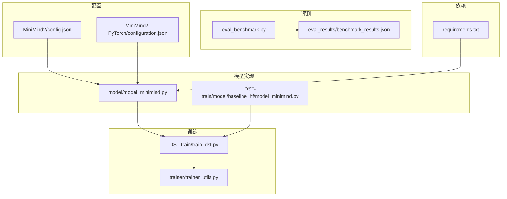
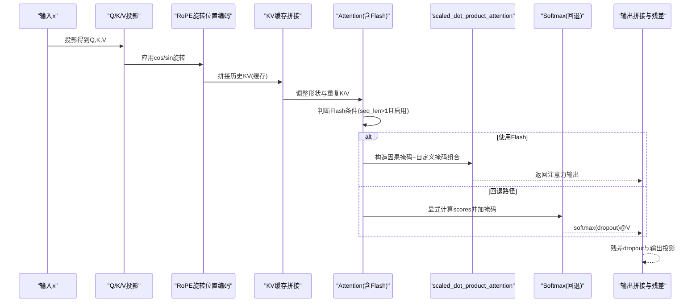
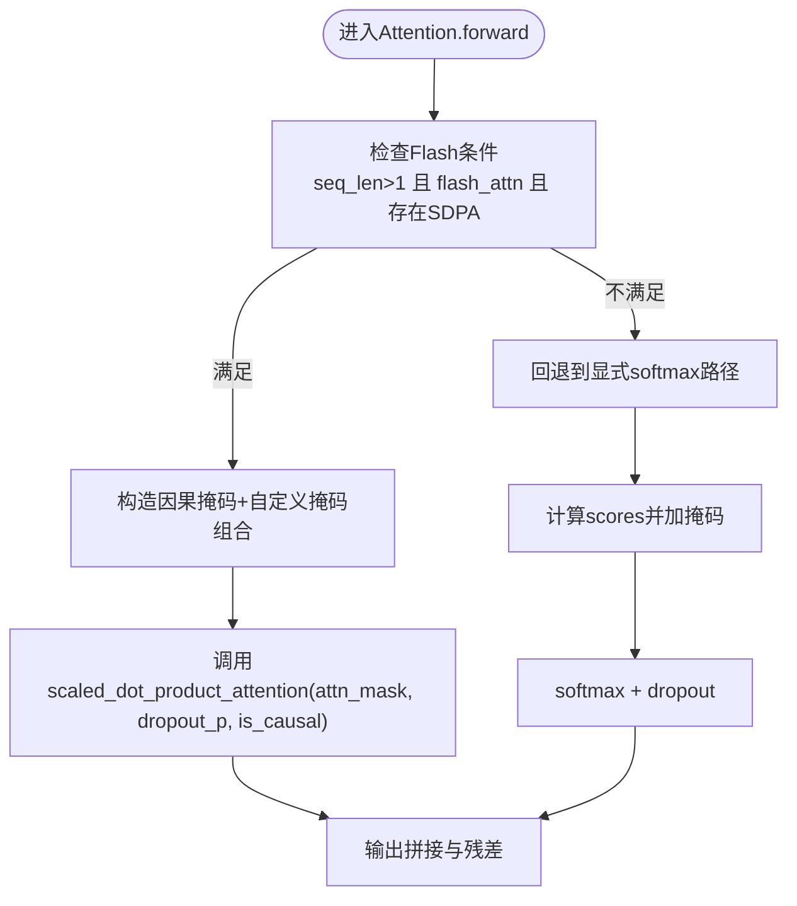
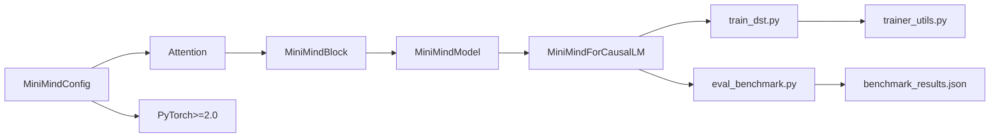

# Flash Attention优化

<cite>
**本文引用的文件列表**
- [model_minimind.py](file://model/model_minimind.py)
- [model_minimind.py](file://DST-train/model/baseline_hf/model_minimind.py)
- [requirements.txt](file://requirements.txt)
- [eval_benchmark.py](file://eval_benchmark.py)
- [config.json](file://MiniMind2/config.json)
- [configuration.json](file://MiniMind2-PyTorch/configuration.json)
- [benchmark_results.json](file://eval_results/benchmark_results.json)
- [train_dst.py](file://DST-train/train_dst.py)
- [trainer_utils.py](file://trainer/trainer_utils.py)
</cite>

## 目录
1. [简介](#简介)
2. [项目结构](#项目结构)
3. [核心组件](#核心组件)
4. [架构概览](#架构概览)
5. [详细组件分析](#详细组件分析)
6. [依赖关系分析](#依赖关系分析)
7. [性能考量](#性能考量)
8. [故障排查指南](#故障排查指南)
9. [结论](#结论)
10. [附录](#附录)

## 简介
本技术文档聚焦于项目中基于PyTorch 2.0内置的scaled_dot_product_attention实现的Flash Attention优化，系统解析其内存效率提升与计算加速策略，详述注意力掩码处理机制（因果掩码与自定义掩码的组合），阐述dropout在Flash Attention中的应用与性能考虑，并给出seq_len>1时的条件判断逻辑与降级回退机制。最后提供性能对比数据与最佳实践建议，帮助读者在实际工程中高效落地该优化。

## 项目结构
该项目采用“模型-训练-评测-部署”分层组织：
- 模型实现位于model与DST-train/model/baseline_hf目录，包含MiniMindConfig、Attention模块以及完整的Transformer块
- 训练脚本位于DST-train目录，涵盖动态稀疏训练（DST）全流程
- 评测脚本位于根目录，支持C-Eval与CMMLU评测
- 配置文件位于MiniMind2与MiniMind2-PyTorch目录，描述模型超参与框架信息
- 评估结果位于eval_results目录，包含基准评测JSON

图表来源
- [model_minimind.py:150-227](file://model/model_minimind.py#L150-L227)
- [model_minimind.py:150-227](file://DST-train/model/baseline_hf/model_minimind.py#L150-L227)
- [train_dst.py:24-26](file://DST-train/train_dst.py#L24-L26)
- [trainer_utils.py:100-111](file://trainer/trainer_utils.py#L100-L111)
- [eval_benchmark.py:18-31](file://eval_benchmark.py#L18-L31)
- [benchmark_results.json:1-494](file://eval_results/benchmark_results.json#L1-L494)
- [config.json:1-33](file://MiniMind2/config.json#L1-L33)
- [configuration.json:1-1](file://MiniMind2-PyTorch/configuration.json#L1-L1)
- [requirements.txt:30-30](file://requirements.txt#L30-L30)

章节来源
- [model_minimind.py:1-477](file://model/model_minimind.py#L1-L477)
- [model_minimind.py:1-477](file://DST-train/model/baseline_hf/model_minimind.py#L1-L477)
- [train_dst.py:1-472](file://DST-train/train_dst.py#L1-L472)
- [trainer_utils.py:1-139](file://trainer/trainer_utils.py#L1-L139)
- [eval_benchmark.py:1-319](file://eval_benchmark.py#L1-L319)
- [benchmark_results.json:1-494](file://eval_results/benchmark_results.json#L1-L494)
- [config.json:1-33](file://MiniMind2/config.json#L1-L33)
- [configuration.json:1-1](file://MiniMind2-PyTorch/configuration.json#L1-L1)
- [requirements.txt:1-31](file://requirements.txt#L1-L31)

## 核心组件
- MiniMindConfig：模型配置，包含dropout、注意力头数、隐藏维度、RoPE参数、Flash Attention开关等
- Attention模块：实现Q/K/V投影、RoPE旋转位置编码、KV缓存拼接、多查询注意力重复、Flash Attention路径与回退路径
- MiniMindBlock/MiniMindModel/MiniMindForCausalLM：Transformer层堆叠、嵌入与输出头、生成混入

章节来源
- [model_minimind.py:8-78](file://model/model_minimind.py#L8-L78)
- [model_minimind.py:150-227](file://model/model_minimind.py#L150-L227)
- [model_minimind.py:363-477](file://model/model_minimind.py#L363-L477)

## 架构概览
下图展示Attention模块在前向过程中的关键路径：当满足Flash条件时走scaled_dot_product_attention，否则回退到显式softmax注意力。

图表来源
- [model_minimind.py:169-226](file://model/model_minimind.py#L169-L226)
- [model_minimind.py:198-222](file://model/model_minimind.py#L198-L222)

## 详细组件分析

### Flash Attention实现与条件判断
- 条件触发：仅当seq_len>1且配置开启flash_attn且存在torch.nn.functional.scaled_dot_product_attention时启用
- 掩码组合策略：
  - 因果掩码：通过上三角填充负无穷构造
  - 自定义掩码：将attention_mask扩展为四维并按位与负无穷
  - 组合方式：将因果掩码与自定义掩码广播相加，形成最终attn_mask；同时设置is_causal=False以避免内核内部再加因果掩码
- Dropout：在Flash路径中通过dropout_p传入，训练时生效，推理时为0

图表来源
- [model_minimind.py:198-207](file://model/model_minimind.py#L198-L207)
- [model_minimind.py:208-222](file://model/model_minimind.py#L208-L222)

章节来源
- [model_minimind.py:166-167](file://model/model_minimind.py#L166-L167)
- [model_minimind.py:198-207](file://model/model_minimind.py#L198-L207)
- [model_minimind.py:208-222](file://model/model_minimind.py#L208-L222)

### 掩码处理机制详解
- 因果掩码：对注意力矩阵上三角置负无穷，保证解码时只能看到历史信息
- 自定义掩码：将attention_mask扩展为四维张量，按位与负无穷，屏蔽padding或无效位置
- 组合方式：将因果掩码与自定义掩码广播相加，统一传入SDPA；同时将is_causal设为False，避免重复因果约束
- 注意：若attention_mask全为1或为空，则直接使用因果掩码(is_causal=True)，由SDPA内核负责高效实现

章节来源
- [model_minimind.py:199-204](file://model/model_minimind.py#L199-L204)

### Dropout在Flash Attention中的应用
- 训练时：通过dropout_p参数将dropout应用于注意力权重，提高泛化能力
- 推理时：dropout_p=0，不引入随机性
- 与回退路径一致：显式softmax路径同样使用attn_dropout

章节来源
- [model_minimind.py:163-165](file://model/model_minimind.py#L163-L165)
- [model_minimind.py:206-207](file://model/model_minimind.py#L206-L207)
- [model_minimind.py:220-221](file://model/model_minimind.py#L220-L221)

### 回退机制与兼容性
- 当不满足Flash条件时，显式计算注意力分数，加因果掩码与自定义掩码，执行softmax与dropout，再做上下文加权
- 这种设计确保在不同PyTorch版本或硬件环境下具备稳定可用性

章节来源
- [model_minimind.py:208-222](file://model/model_minimind.py#L208-L222)

### 模型配置与依赖
- 依赖PyTorch 2.6.0，确保可用scaled_dot_product_attention
- 模型配置包含dropout、注意力头数、隐藏维度、RoPE参数、Flash开关等

章节来源
- [requirements.txt:30-30](file://requirements.txt#L30-L30)
- [model_minimind.py:11-78](file://model/model_minimind.py#L11-L78)
- [config.json:1-33](file://MiniMind2/config.json#L1-L33)

## 依赖关系分析
- 模块耦合
  - Attention依赖MiniMindConfig中的flash_attn开关与dropout
  - MiniMindModel/Block将Attention封装为Transformer层
  - 训练脚本通过trainer_utils加载模型与分词器，驱动训练循环
- 外部依赖
  - PyTorch版本要求≥2.0（项目使用2.6.0）
  - 评测脚本依赖transformers、datasets等生态库

图表来源
- [model_minimind.py:8-78](file://model/model_minimind.py#L8-L78)
- [model_minimind.py:150-227](file://model/model_minimind.py#L150-L227)
- [model_minimind.py:363-477](file://model/model_minimind.py#L363-L477)
- [train_dst.py:24-26](file://DST-train/train_dst.py#L24-L26)
- [trainer_utils.py:100-111](file://trainer/trainer_utils.py#L100-L111)
- [eval_benchmark.py:18-31](file://eval_benchmark.py#L18-L31)
- [benchmark_results.json:1-494](file://eval_results/benchmark_results.json#L1-L494)
- [requirements.txt:30-30](file://requirements.txt#L30-L30)

章节来源
- [model_minimind.py:1-477](file://model/model_minimind.py#L1-L477)
- [train_dst.py:1-472](file://DST-train/train_dst.py#L1-L472)
- [trainer_utils.py:1-139](file://trainer/trainer_utils.py#L1-L139)
- [eval_benchmark.py:1-319](file://eval_benchmark.py#L1-L319)
- [benchmark_results.json:1-494](file://eval_results/benchmark_results.json#L1-L494)
- [requirements.txt:1-31](file://requirements.txt#L1-L31)

## 性能考量
- 内存效率提升
  - Flash Attention避免显式存储中间注意力矩阵，显著降低峰值内存占用
  - 在长序列场景下尤为明显
- 计算加速策略
  - 利用PyTorch 2.0+的高效内核，减少Python层开销
  - 掩码融合（因果+自定义）一次广播相加，避免多次掩码操作
- Dropout与训练稳定性
  - Flash路径与回退路径均应用attn_dropout，训练时有助于泛化
- 评测数据参考
  - 项目提供了C-Eval与CMMLU评测脚本与结果JSON，可用于对比不同配置下的推理表现

章节来源
- [eval_benchmark.py:1-319](file://eval_benchmark.py#L1-L319)
- [benchmark_results.json:1-494](file://eval_results/benchmark_results.json#L1-L494)

## 故障排查指南
- 无法启用Flash
  - 检查PyTorch版本是否≥2.0
  - 确认配置中flash_attn=True
  - 确认seq_len>1（Flash路径在seq_len=1时会回退）
- 掩码异常
  - 若attention_mask全为1或为空，将使用纯因果掩码
  - 若存在自定义掩码，需确保其与输入序列长度一致
- 性能不达预期
  - 长序列场景优先启用Flash
  - 检查是否正确传入attn_mask与is_causal=False（组合掩码时）
  - 训练时适当调整dropout，避免过度抑制

章节来源
- [model_minimind.py:166-167](file://model/model_minimind.py#L166-L167)
- [model_minimind.py:198-207](file://model/model_minimind.py#L198-L207)
- [model_minimind.py:208-222](file://model/model_minimind.py#L208-L222)

## 结论
本项目在MiniMind模型中完整实现了基于PyTorch 2.0的Flash Attention优化，通过条件判断与掩码融合策略，在保证功能正确性的前提下显著提升了内存效率与计算速度。结合训练脚本与评测体系，可在不同规模与场景下验证优化效果，并为后续工程落地提供可靠参考。

## 附录
- 最佳实践建议
  - 默认启用flash_attn，确保PyTorch版本≥2.0
  - 长序列场景优先使用Flash，短序列可接受回退路径
  - 正确构造因果+自定义掩码组合，避免重复因果约束
  - 训练时合理设置dropout，推理时关闭dropout
  - 使用评测脚本定期对比性能与准确性