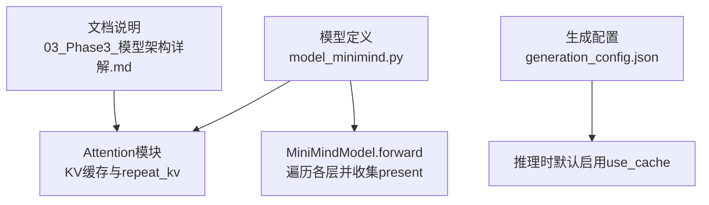
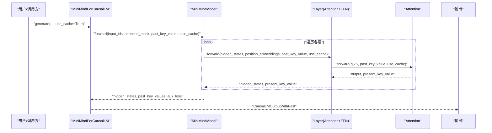
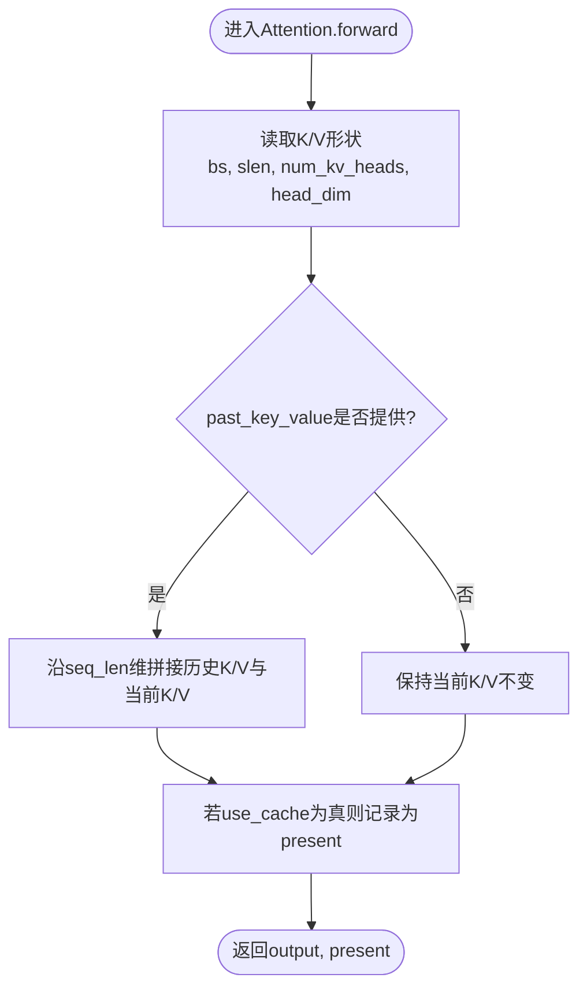
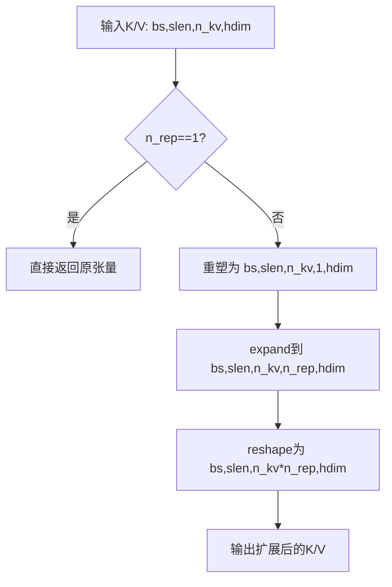
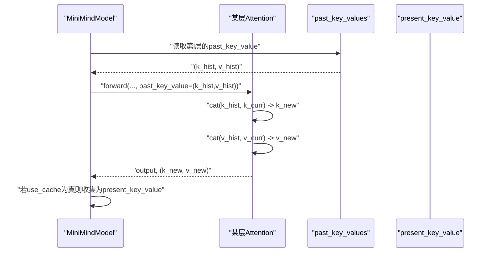
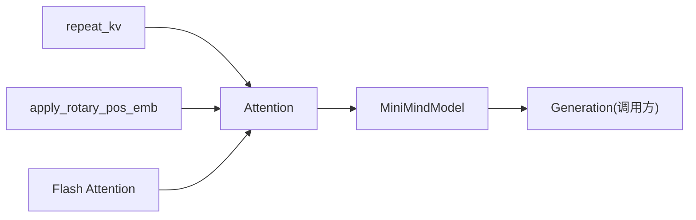

# KV缓存机制

<cite>
**本文引用的文件**
- [model_minimind.py](file://model/model_minimind.py)
- [model_minimind.py（HF基线版本）](file://DST-train/model/baseline_hf/model_minimind.py)
- [03_Phase3_模型架构详解.md](file://docs/03_Phase3_模型架构详解.md)
- [generation_config.json（MiniMind2）](file://MiniMind2/generation_config.json)
- [generation_config.json（MiniMind2-Pretrain-512）](file://MiniMind2-Pretrain-512/generation_config.json)
- [config.json（HF基线版本）](file://DST-train/model/baseline_hf/config.json)
</cite>

## 目录
1. [简介](#简介)
2. [项目结构](#项目结构)
3. [核心组件](#核心组件)
4. [架构总览](#架构总览)
5. [详细组件分析](#详细组件分析)
6. [依赖关系分析](#依赖关系分析)
7. [性能考量](#性能考量)
8. [故障排查指南](#故障排查指南)
9. [结论](#结论)
10. [附录](#附录)

## 简介
本文件系统性解析MiniMind中的KV缓存机制，重点覆盖：
- past_key_value的存储结构与形状变换
- 重复键值头（repeat_kv）的实现原理与n_rep的作用
- 缓存状态维护（序列长度扩展、历史信息保留）
- use_cache参数对行为与性能的影响
- 缓存大小估算与内存使用分析
- 调试与监控KV缓存状态的方法

## 项目结构
本仓库中与KV缓存直接相关的核心实现集中在模型定义文件中，配套文档对GQA与KV缓存有专门说明。生成配置文件显示默认启用use_cache以支持推理加速。

图表来源
- [model_minimind.py:150-226](file://model/model_minimind.py#L150-L226)
- [model_minimind.py:403-440](file://model/model_minimind.py#L403-L440)
- [03_Phase3_模型架构详解.md:118-162](file://docs/03_Phase3_模型架构详解.md#L118-L162)
- [generation_config.json:8](file://MiniMind2/generation_config.json#L8)

章节来源
- [model_minimind.py:150-226](file://model/model_minimind.py#L150-L226)
- [model_minimind.py:403-440](file://model/model_minimind.py#L403-L440)
- [03_Phase3_模型架构详解.md:118-162](file://docs/03_Phase3_模型架构详解.md#L118-L162)
- [generation_config.json:8](file://MiniMind2/generation_config.json#L8)

## 核心组件
- Attention模块：负责Q/K/V投影、RoPE位置编码、KV缓存拼接、repeat_kv扩展以及注意力计算。
- MiniMindModel.forward：遍历各层，将每层的present_key_value按层收集为past_key_values返回。
- repeat_kv函数：将KV头按n_rep倍数扩展，使KV头数与Q头数一致，满足GQA场景。
- use_cache参数：控制是否返回并更新每层的KV缓存，影响推理性能与内存占用。

章节来源
- [model_minimind.py:150-226](file://model/model_minimind.py#L150-L226)
- [model_minimind.py:403-440](file://model/model_minimind.py#L403-L440)
- [model_minimind.py:140-147](file://model/model_minimind.py#L140-L147)

## 架构总览
KV缓存在推理阶段的关键路径如下：输入序列经嵌入与位置编码后进入各层，每层Attention根据past_key_value拼接历史K/V，并在use_cache开启时返回当前层的K/V作为present，最终由MiniMindModel聚合为past_key_values返回给调用方。

图表来源
- [model_minimind.py:403-440](file://model/model_minimind.py#L403-L440)
- [model_minimind.py:376-384](file://model/model_minimind.py#L376-L384)
- [model_minimind.py:169-226](file://model/model_minimind.py#L169-L226)

## 详细组件分析

### KV缓存的数据结构与形状
- 存储结构：past_key_values为列表，列表中每个元素是一个二元组(Tensor_K, Tensor_V)，分别代表该层的历史K和V。
- 张量形状：每层K/V形状通常为[batch_size, seq_len, num_key_value_heads, head_dim]。
- 位置嵌入：MiniMindModel根据当前start_pos与seq_len截取对应的cos/sin用于RoPE。

图表来源
- [model_minimind.py:186-190](file://model/model_minimind.py#L186-L190)
- [model_minimind.py:410-412](file://model/model_minimind.py#L410-L412)

章节来源
- [model_minimind.py:186-190](file://model/model_minimind.py#L186-L190)
- [model_minimind.py:410-412](file://model/model_minimind.py#L410-L412)

### repeat_kv的实现原理与n_rep的作用
- n_rep计算：n_rep = num_attention_heads // num_key_value_heads，GQA场景下Q头数是KV头数的倍数。
- repeat_kv逻辑：当n_rep>1时，将KV张量在head维度上扩展为原head数的n_rep倍，使Q与KV头数一致，从而在注意力计算中正确广播。
- 作用：在保持KV头数较少的前提下，复用相同KV信息服务多个Q头，降低KV存储与计算开销。

图表来源
- [model_minimind.py:140-147](file://model/model_minimind.py#L140-L147)
- [model_minimind.py:157](file://model/model_minimind.py#L157)
- [03_Phase3_模型架构详解.md:144-152](file://docs/03_Phase3_模型架构详解.md#L144-L152)

章节来源
- [model_minimind.py:140-147](file://model/model_minimind.py#L140-L147)
- [model_minimind.py:157](file://model/model_minimind.py#L157)
- [03_Phase3_模型架构详解.md:144-152](file://docs/03_Phase3_模型架构详解.md#L144-L152)

### 缓存状态维护与序列长度扩展
- 起始位置start_pos：从第一层的K张量的seq_len维度推导，用于确定本次计算应使用的cos/sin片段。
- 历史拼接：若past_key_value存在，则将历史K/V与当前K/V沿seq_len维拼接，形成累积的历史序列。
- present_key_value：仅在use_cache为真时返回，供后续调用传回作为新的past_key_value。

图表来源
- [model_minimind.py:403-440](file://model/model_minimind.py#L403-L440)
- [model_minimind.py:186-190](file://model/model_minimind.py#L186-L190)

章节来源
- [model_minimind.py:403-440](file://model/model_minimind.py#L403-L440)
- [model_minimind.py:186-190](file://model/model_minimind.py#L186-L190)

### use_cache参数的影响与性能优化
- 行为影响：开启use_cache时，每层Attention会返回present_key_value；MiniMindModel将各层的present聚合为past_key_values返回，供后续generate调用复用。
- 性能优化：KV缓存避免重复计算历史序列的注意力，显著降低推理延迟；同时，repeat_kv的高效展开与可选的Flash Attention进一步提升吞吐。
- 默认配置：生成配置文件中use_cache默认为true，确保推理时自动启用缓存。

章节来源
- [model_minimind.py:172-174](file://model/model_minimind.py#L172-L174)
- [model_minimind.py:190](file://model/model_minimind.py#L190)
- [model_minimind.py:407](file://model/model_minimind.py#L407)
- [generation_config.json:8](file://MiniMind2/generation_config.json#L8)

### 缓存大小估算与内存使用分析
- 单层KV张量大小（以字节计）：
  - K/V形状：[batch_size, seq_len, num_key_value_heads, head_dim]
  - 单个元素字节数：dtype决定（如float16为2字节）
  - 单层KV总字节数 ≈ 2 × batch_size × seq_len × num_key_value_heads × head_dim
- 模型总KV缓存大小（以字节计）：
  - 总字节数 ≈ 单层KV大小 × num_hidden_layers
- 关键参数来源：
  - num_attention_heads、num_key_value_heads、hidden_size、num_hidden_layers等来自配置文件。

章节来源
- [config.json:24-27](file://DST-train/model/baseline_hf/config.json#L24-L27)
- [config.json:16-18](file://DST-train/model/baseline_hf/config.json#L16-L18)
- [config.json:26](file://DST-train/model/baseline_hf/config.json#L26)

### 调试与监控KV缓存状态的方法
- 在Attention.forward中打印或断点检查：
  - past_key_value是否存在
  - 拼接后的K/V形状变化
  - present_key_value是否按层收集
- 在MiniMindModel.forward中检查：
  - start_pos与seq_len的组合是否正确
  - presents列表长度与层数一致
- 生成配置层面：
  - 确认use_cache为true，确保缓存生效
  - 若出现OOM，可临时关闭use_cache进行对比测试

章节来源
- [model_minimind.py:186-190](file://model/model_minimind.py#L186-L190)
- [model_minimind.py:403-440](file://model/model_minimind.py#L403-L440)
- [generation_config.json:8](file://MiniMind2/generation_config.json#L8)

## 依赖关系分析
- Attention依赖：
  - repeat_kv函数：用于将KV头扩展到与Q头一致的数量
  - RoPE位置嵌入：apply_rotary_pos_emb
  - 可选Flash Attention：F.scaled_dot_product_attention
- MiniMindModel依赖：
  - 通过遍历各层并收集present_key_value，形成完整的past_key_values
- 文档与配置：
  - 文档明确说明GQA与KV缓存的使用方式
  - 生成配置默认启用use_cache

图表来源
- [model_minimind.py:140-147](file://model/model_minimind.py#L140-L147)
- [model_minimind.py:131-137](file://model/model_minimind.py#L131-L137)
- [model_minimind.py:198-207](file://model/model_minimind.py#L198-L207)
- [model_minimind.py:403-440](file://model/model_minimind.py#L403-L440)

章节来源
- [model_minimind.py:140-147](file://model/model_minimind.py#L140-L147)
- [model_minimind.py:131-137](file://model/model_minimind.py#L131-L137)
- [model_minimind.py:198-207](file://model/model_minimind.py#L198-L207)
- [model_minimind.py:403-440](file://model/model_minimind.py#L403-L440)

## 性能考量
- KV缓存显著降低自回归生成的重复计算，尤其在长序列场景收益明显。
- repeat_kv采用高效的reshape/expand策略，避免显式循环展开，减少Python层开销。
- Flash Attention在seq_len>1时启用，进一步降低注意力计算成本。
- 内存占用与batch_size、seq_len、层数、头数呈线性关系，合理设置use_cache与批大小可平衡性能与资源。

## 故障排查指南
- 症状：推理速度慢
  - 检查use_cache是否为true
  - 确认past_key_values是否正确传递
- 症状：显存溢出(OOM)
  - 适当降低batch_size或max_new_tokens
  - 关闭use_cache进行对比测试
- 症状：结果异常或不稳定
  - 检查RoPE位置嵌入的start_pos与seq_len组合
  - 确认repeat_kv未被错误禁用

章节来源
- [generation_config.json:8](file://MiniMind2/generation_config.json#L8)
- [model_minimind.py:403-440](file://model/model_minimind.py#L403-L440)
- [model_minimind.py:186-190](file://model/model_minimind.py#L186-L190)

## 结论
MiniMind的KV缓存机制通过GQA与repeat_kv的结合，在保持较低KV头数的同时，有效复用历史信息，配合use_cache与可选的Flash Attention，实现了推理阶段的高性能与低内存占用。理解past_key_value的形状、拼接与present收集流程，有助于在实际部署中进行性能优化与问题定位。

## 附录
- 相关配置项参考：
  - num_attention_heads、num_key_value_heads、hidden_size、num_hidden_layers、dtype等
- 相关文档参考：
  - GQA与KV缓存说明、RoPE与Flash Attention介绍

章节来源
- [config.json:24-27](file://DST-train/model/baseline_hf/config.json#L24-L27)
- [config.json:16-18](file://DST-train/model/baseline_hf/config.json#L16-L18)
- [config.json:26](file://DST-train/model/baseline_hf/config.json#L26)
- [03_Phase3_模型架构详解.md:118-162](file://docs/03_Phase3_模型架构详解.md#L118-L162)