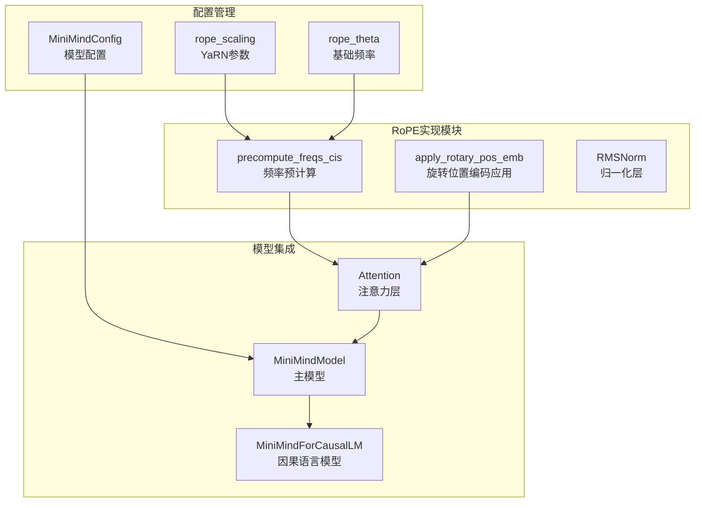
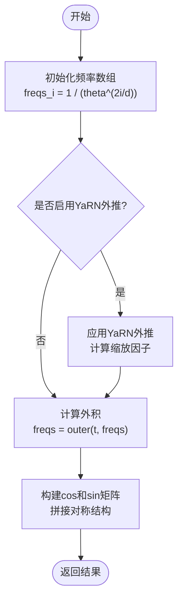
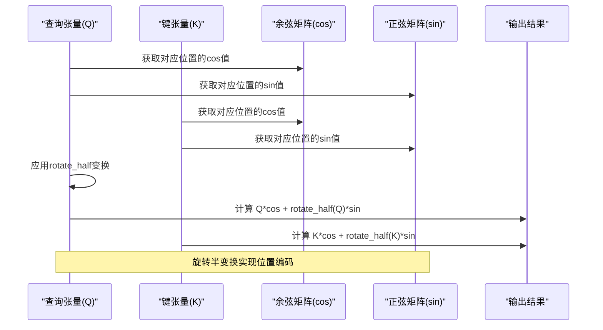
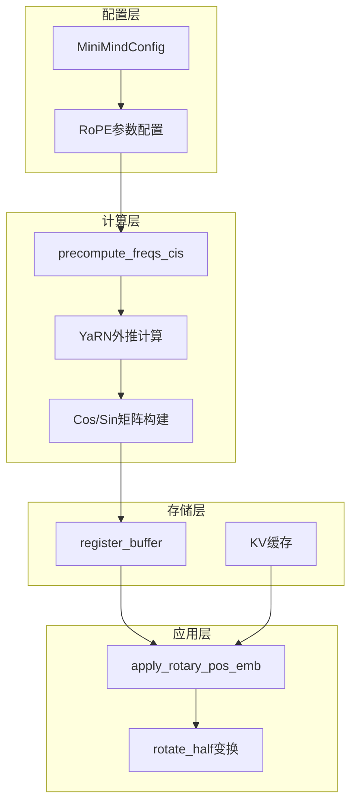
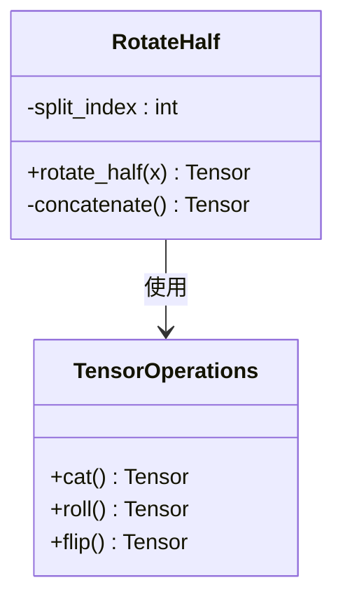
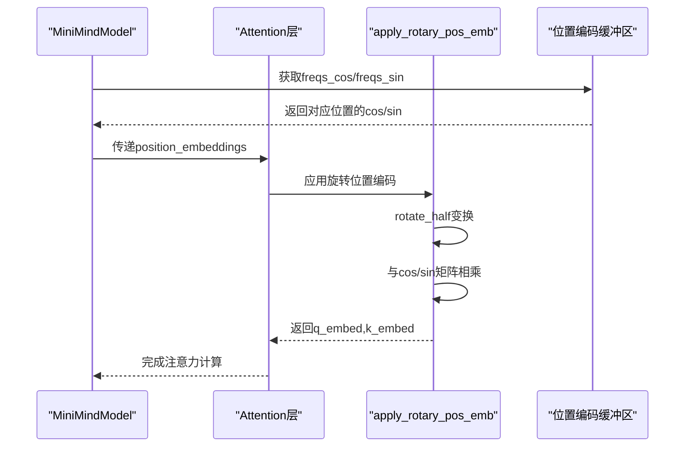
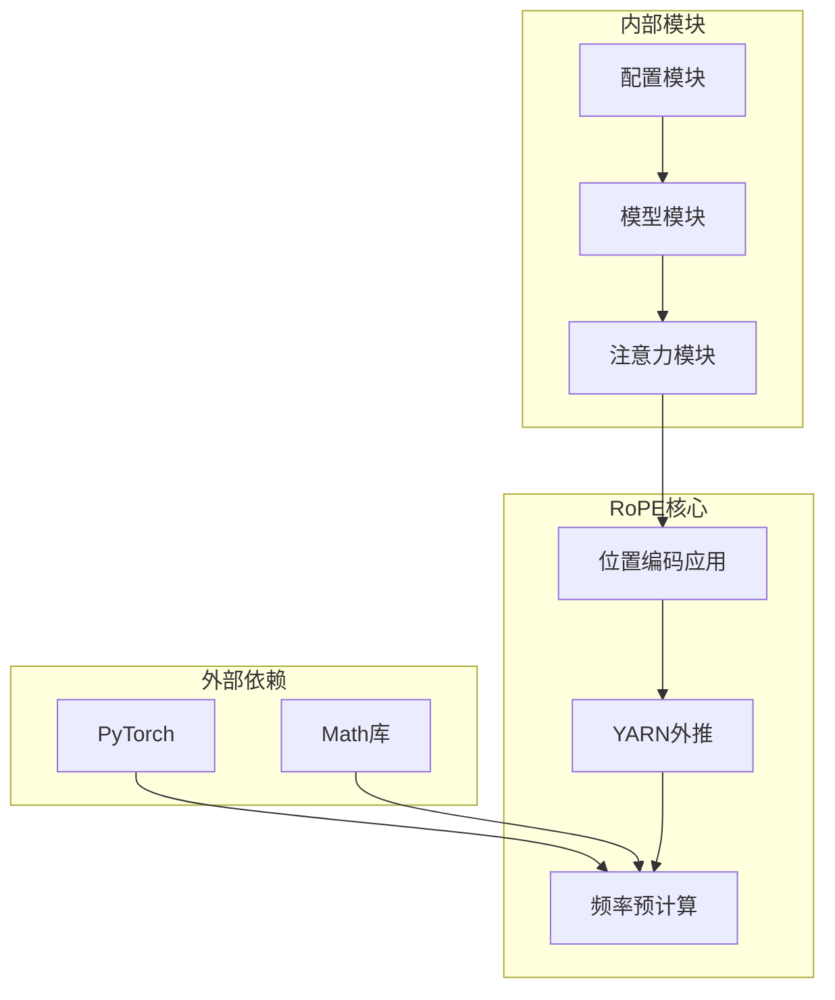

# RoPE旋转位置编码

<cite>
**本文档引用的文件**
- [model_minimind.py](file://model/model_minimind.py)
- [03_Phase3_模型架构详解.md](file://docs/03_Phase3_模型架构详解.md)
- [config.json](file://MiniMind2/config.json)
- [config.json](file://DST-train/model/baseline_hf/config.json)
- [tokenizer_config.json](file://model/tokenizer_config.json)
</cite>

## 目录
1. [简介](#简介)
2. [项目结构](#项目结构)
3. [核心组件](#核心组件)
4. [架构概览](#架构概览)
5. [详细组件分析](#详细组件分析)
6. [依赖分析](#依赖分析)
7. [性能考虑](#性能考虑)
8. [故障排除指南](#故障排除指南)
9. [结论](#结论)

## 简介

RoPE（旋转位置编码）是现代大语言模型中广泛采用的位置编码技术。它通过旋转矩阵为查询（Q）和键（K）注入位置信息，具有相对位置编码的优势，能够有效处理超出训练时长序列的外推问题。

本项目实现了完整的RoPE旋转位置编码系统，包括：
- 标准RoPE频率计算
- YaRN外推扩展机制
- 动态缓存机制
- 旋转半变换实现
- 性能优化的cos/sin矩阵构造

## 项目结构

RoPE相关的核心实现位于模型文件中，采用模块化设计：



**图表来源**
- [model_minimind.py:108-137](file://model/model_minimind.py#L108-L137)
- [model_minimind.py:387-441](file://model/model_minimind.py#L387-L441)

**章节来源**
- [model_minimind.py:1-477](file://model/model_minimind.py#L1-L477)
- [03_Phase3_模型架构详解.md:77-116](file://docs/03_Phase3_模型架构详解.md#L77-L116)

## 核心组件

### 频率预计算函数

`precompute_freqs_cis`函数负责计算RoPE的频率参数和位置编码矩阵：



**图表来源**
- [model_minimind.py:108-128](file://model/model_minimind.py#L108-L128)

### 旋转位置编码应用

`apply_rotary_pos_emb`函数实现具体的旋转操作：



**图表来源**
- [model_minimind.py:131-137](file://model/model_minimind.py#L131-L137)

**章节来源**
- [model_minimind.py:108-137](file://model/model_minimind.py#L108-L137)

## 架构概览

RoPE系统在模型中的集成架构如下：



**图表来源**
- [model_minimind.py:387-401](file://model/model_minimind.py#L387-L401)
- [model_minimind.py:108-137](file://model/model_minimind.py#L108-L137)

## 详细组件分析

### 频率计算原理

RoPE的核心数学原理基于复数旋转的实数表示：

#### 基础频率计算

频率计算公式为：`freqs_i = 1 / (theta^(2i/d))`

其中：
- `theta` 是rope_theta参数，控制频率增长速度
- `d` 是隐藏层维度
- `i` 是频率索引（偶数位置）

#### YaRN外推机制

YaRN（Yet Another RoPE Extrapolation）通过以下步骤实现长序列外推：

```mermaid
flowchart TD
A[输入序列长度end] --> B{end > original_max?}
B --> |否| C[直接计算频率]
B --> |是| D[计算corr_dim]
D --> E[计算power序列]
E --> F[计算beta参数<br/>beta = beta_slow + (beta_fast-beta_slow)*power]
F --> G[计算缩放因子<br/>λ = (β·α - β + 1)/(β·α) 或 1/factor]
G --> H[应用频率缩放<br/>freqs = freqs * scale]
C --> I[构建cos/sin矩阵]
H --> I
```

**图表来源**
- [model_minimind.py:111-122](file://model/model_minimind.py#L111-L122)

#### 参数作用说明

- `rope_theta`：控制频率增长的基础值，越大频率衰减越慢
- `beta_fast`：快速外推区域的beta值，控制高频段缩放强度
- `beta_slow`：慢速外推区域的beta值，控制低频段缩放强度
- `factor`：外推因子，决定最大可处理序列长度

**章节来源**
- [model_minimind.py:108-128](file://model/model_minimind.py#L108-L128)

### 旋转半变换实现

`rotate_half`函数实现向量的旋转半变换：



**图表来源**
- [model_minimind.py:132-133](file://model/model_minimind.py#L132-L133)

旋转半变换的数学原理：
- 将向量分为前后两半
- 对后半部分取负号
- 重新组合形成旋转效果

**章节来源**
- [model_minimind.py:131-137](file://model/model_minimind.py#L131-L137)

### 位置编码应用流程



**图表来源**
- [model_minimind.py:416-419](file://model/model_minimind.py#L416-L419)
- [model_minimind.py:171-182](file://model/model_minimind.py#L171-L182)

**章节来源**
- [model_minimind.py:171-182](file://model/model_minimind.py#L171-L182)

### 缓存机制和动态缩放

#### 位置编码缓存

模型使用PyTorch的`register_buffer`机制缓存预计算的位置编码：

```python
freqs_cos, freqs_sin = precompute_freqs_cis(
    dim=config.hidden_size // config.num_attention_heads,
    end=config.max_position_embeddings, 
    rope_base=config.rope_theta,
    rope_scaling=config.rope_scaling
)
self.register_buffer("freqs_cos", freqs_cos, persistent=False)
self.register_buffer("freqs_sin", freqs_sin, persistent=False)
```

#### 动态缩放功能

缓存在推理模式下的优势：
- 避免重复计算cos/sin矩阵
- 支持动态序列长度调整
- 减少内存占用

**章节来源**
- [model_minimind.py:397-401](file://model/model_minimind.py#L397-L401)

## 依赖分析

RoPE系统的依赖关系如下：



**图表来源**
- [model_minimind.py:84-92](file://model/model_minimind.py#L84-L92)
- [model_minimind.py:150-174](file://model/model_minimind.py#L150-L174)

**章节来源**
- [model_minimind.py:84-92](file://model/model_minimind.py#L84-L92)

## 性能考虑

### 计算复杂度分析

RoPE实现的性能特征：

1. **频率预计算复杂度**：O(L×D) 其中L为序列长度，D为维度
2. **旋转操作复杂度**：O(B×L×H×D) 其中B为批次大小，H为注意力头数
3. **内存占用**：主要由cos/sin矩阵决定，约为O(L×D)

### 优化策略

1. **缓存机制**：预计算并缓存位置编码，避免重复计算
2. **向量化操作**：利用PyTorch的向量化能力提高效率
3. **内存管理**：使用persistent=False减少持久化内存占用

### 不同配置的性能影响

| 配置参数 | 性能影响 | 内存占用 | 适用场景 |
|---------|---------|---------|---------|
| rope_theta增大 | 频率衰减更慢，适合长序列 | 中等 | 超长文本处理 |
| beta_fast增大 | 高频段外推更强 | 稍增 | 非常长序列 |
| factor增大 | 最大支持长度增加 | 显著增加 | 极长序列需求 |
| 维度增大 | 计算和内存成本显著增加 | 大幅增加 | 高精度模型 |

## 故障排除指南

### 常见问题及解决方案

1. **位置编码不生效**
   - 检查`rope_scaling`配置是否正确设置
   - 确认序列长度超过`original_max_position_embeddings`

2. **内存使用过高**
   - 调整`max_position_embeddings`参数
   - 检查是否启用了不必要的缓存

3. **推理速度慢**
   - 确认使用了缓存的位置编码
   - 检查是否启用了Flash Attention

**章节来源**
- [model_minimind.py:111-122](file://model/model_minimind.py#L111-L122)

## 结论

RoPE旋转位置编码系统在本项目中实现了完整的功能，包括：

1. **数学原理清晰**：基于复数旋转的实数表示，理论基础扎实
2. **实现优化完善**：包含YaRN外推、缓存机制等高级特性
3. **性能表现优秀**：通过向量化和缓存机制实现高效运行
4. **配置灵活多样**：支持多种参数组合以适应不同应用场景

该实现为处理超长序列提供了有效的解决方案，同时保持了良好的计算效率和内存使用特性。