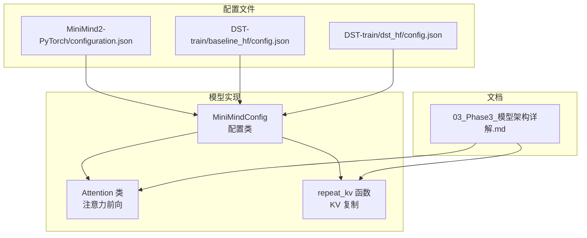
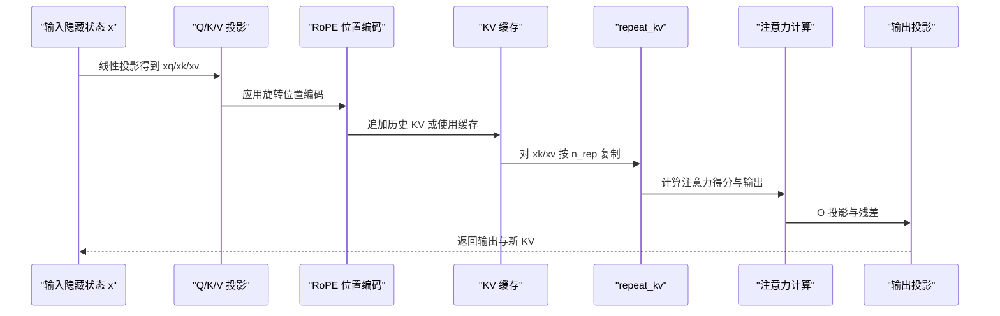
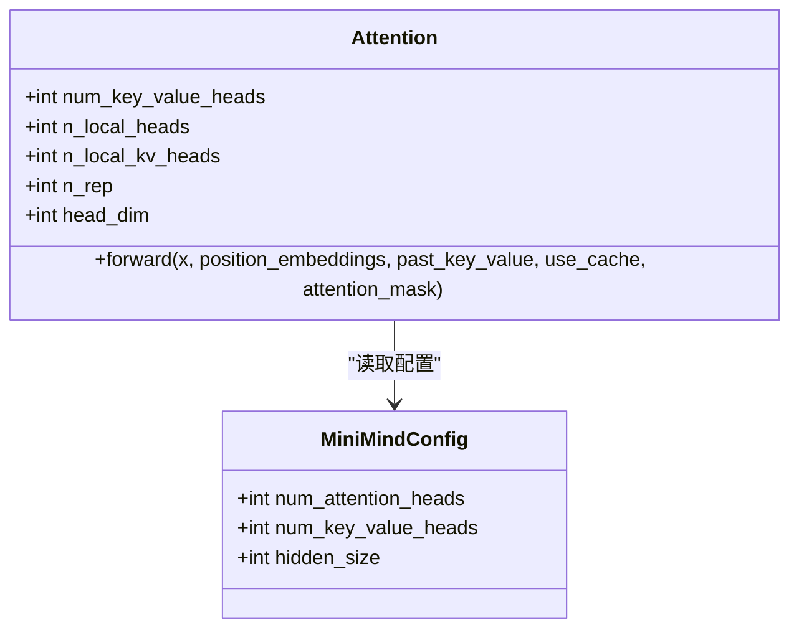
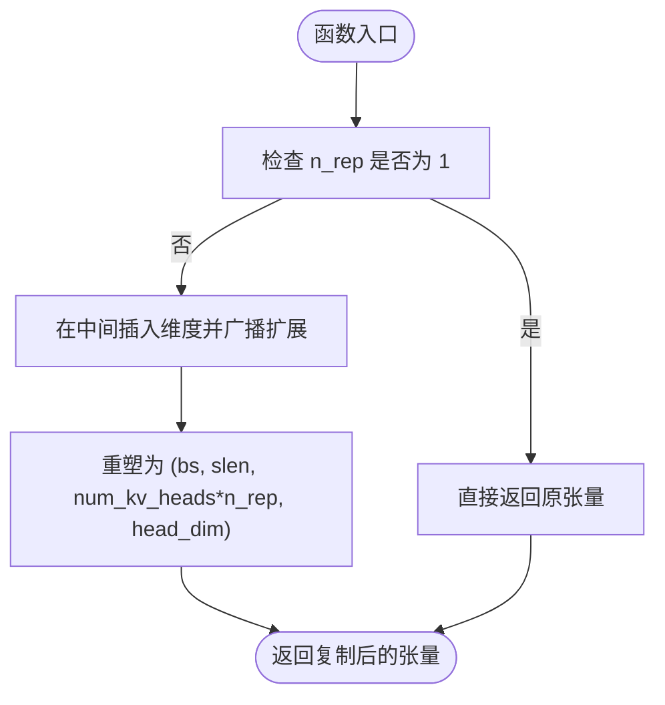
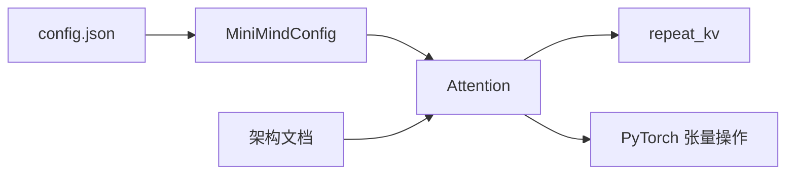

# 多查询注意力(MQA)

<cite>
**本文档引用的文件**
- [model_minimind.py](file://model/model_minimind.py)
- [03_Phase3_模型架构详解.md](file://docs/03_Phase3_模型架构详解.md)
- [configuration.json](file://MiniMind2-PyTorch/configuration.json)
- [config.json](file://DST-train/model/baseline_hf/config.json)
- [config.json](file://DST-train/model/dst_hf/config.json)
- [benchmark_results.json](file://eval_results/benchmark_results.json)
- [benchmark_results.json](file://reports/20260429/benchmark_results.json)
</cite>

## 目录
1. [引言](#引言)
2. [项目结构](#项目结构)
3. [核心组件](#核心组件)
4. [架构总览](#架构总览)
5. [详细组件分析](#详细组件分析)
6. [依赖分析](#依赖分析)
7. [性能考量](#性能考量)
8. [故障排查指南](#故障排查指南)
9. [结论](#结论)
10. [附录](#附录)

## 引言
本文件聚焦于多查询注意力（MQA）在本项目中的实现与应用，系统解析 num_key_value_heads 参数的设计理念、n_rep 重复因子的计算与作用机制、repeat_kv 函数的实现细节与内存优化策略，并对比 MQA 相较于标准注意力（MHA）在参数规模与计算效率上的优势。同时，结合仓库中的配置与评测结果，给出不同头数配置的性能对比与适用场景建议。

## 项目结构
本项目围绕 Transformer Decoder 架构展开，注意力模块采用 GQA（分组查询注意力）策略，其中 num_key_value_heads 控制 KV 头数，n_rep 表示每个 KV 头被复制到多少个 Q 头组中。核心实现集中在模型文件中，配置文件定义了注意力头数与 KV 头数等关键超参。

图表来源
- [model_minimind.py:150-226](file://model/model_minimind.py#L150-L226)
- [model_minimind.py:140-147](file://model/model_minimind.py#L140-L147)
- [configuration.json:1-1](file://MiniMind2-PyTorch/configuration.json#L1-L1)
- [config.json:24-27](file://DST-train/model/baseline_hf/config.json#L24-L27)
- [config.json:24-27](file://DST-train/model/dst_hf/config.json#L24-L27)
- [03_Phase3_模型架构详解.md:118-162](file://docs/03_Phase3_模型架构详解.md#L118-L162)

章节来源
- [model_minimind.py:150-226](file://model/model_minimind.py#L150-L226)
- [model_minimind.py:140-147](file://model/model_minimind.py#L140-L147)
- [03_Phase3_模型架构详解.md:118-162](file://docs/03_Phase3_模型架构详解.md#L118-L162)

## 核心组件
- Attention 类：实现注意力前向计算，包含 Q/K/V 投影、RoPE 位置编码、KV 缓存与注意力输出。
- repeat_kv 函数：将 KV 头按 n_rep 次复制以匹配 Q 头数量，支持 KV 缓存与推理加速。
- MiniMindConfig：集中管理模型超参，包括 num_attention_heads、num_key_value_heads 等。

章节来源
- [model_minimind.py:150-226](file://model/model_minimind.py#L150-L226)
- [model_minimind.py:140-147](file://model/model_minimind.py#L140-L147)
- [model_minimind.py:8-78](file://model/model_minimind.py#L8-L78)

## 架构总览
MQA 在本项目中通过 num_key_value_heads 将 KV 头数减少到少于 Q 头数，n_rep = n_heads / num_key_value_heads 决定了每个 KV 头被复制到多少个 Q 头组中。repeat_kv 在推理阶段将新增的 KV 头维度展平，配合 KV 缓存实现自回归生成的高效迭代。

图表来源
- [model_minimind.py:169-226](file://model/model_minimind.py#L169-L226)
- [model_minimind.py:140-147](file://model/model_minimind.py#L140-L147)

## 详细组件分析

### Attention 类与 MQA 设计
- num_key_value_heads：控制 KV 头数，与 num_attention_heads 的比值决定 n_rep。
- n_rep：重复因子，等于 n_heads / num_key_value_heads，用于 repeat_kv 的复制次数。
- 投影层：Q/K/V 分别线性映射到各自头数对应的维度。
- 前向流程：Q/K/V 投影 → RoPE → KV 缓存拼接 → repeat_kv → 注意力计算 → O 投影。

图表来源
- [model_minimind.py:150-166](file://model/model_minimind.py#L150-L166)
- [model_minimind.py:8-78](file://model/model_minimind.py#L8-L78)

章节来源
- [model_minimind.py:150-166](file://model/model_minimind.py#L150-L166)
- [model_minimind.py:169-226](file://model/model_minimind.py#L169-L226)

### n_rep 重复因子与头数关系
- 定义：n_rep = n_heads / num_key_value_heads，确保 Q 头数与 KV 头数的整除关系。
- 作用：在推理阶段，repeat_kv 将每个 KV 头复制 n_rep 次，使注意力计算中 Q 与 K/V 的头数一致。
- 设计理念：通过减少 KV 投影参数与缓存占用，降低内存与带宽压力，同时保持多头多样性带来的表达能力。

章节来源
- [model_minimind.py:153-157](file://model/model_minimind.py#L153-L157)
- [03_Phase3_模型架构详解.md:118-128](file://docs/03_Phase3_模型架构详解.md#L118-L128)

### repeat_kv 函数实现与内存优化
- 输入形状：bs × slen × num_key_value_heads × head_dim
- 复制策略：当 n_rep > 1 时，通过 expand + reshape 将 num_key_value_heads 维度扩展为 num_key_value_heads × n_rep，避免显式循环复制。
- 内存优化：使用张量广播与 reshape 替代 Python 循环，减少中间拷贝与内存碎片；仅在必要时进行复制（n_rep == 1 时直接返回）。
- 推理加速：配合 KV 缓存，每次仅对新增 token 的 KV 进行计算与拼接，显著降低自回归生成的计算量。

图表来源
- [model_minimind.py:140-147](file://model/model_minimind.py#L140-L147)

章节来源
- [model_minimind.py:140-147](file://model/model_minimind.py#L140-L147)

### 注意力计算与 KV 缓存
- KV 缓存：past_key_value 为空时新建缓存；非空时沿序列维度拼接新增 KV。
- 注意力：支持 Flash Attention 与手动实现两种路径，自动根据序列长度与掩码选择最优路径。
- 输出：注意力输出经 O 投影与残差连接，返回当前层输出与新的 KV 缓存。

章节来源
- [model_minimind.py:186-226](file://model/model_minimind.py#L186-L226)

### 配置与参数设置
- MiniMindConfig：集中定义 num_attention_heads、num_key_value_heads、hidden_size 等关键参数。
- 配置文件：HuggingFace 格式的 config.json 明确指定 num_attention_heads 与 num_key_value_heads，确保训练与推理一致性。

章节来源
- [model_minimind.py:8-78](file://model/model_minimind.py#L8-L78)
- [config.json:24-27](file://DST-train/model/baseline_hf/config.json#L24-L27)
- [config.json:24-27](file://DST-train/model/dst_hf/config.json#L24-L27)
- [configuration.json:1-1](file://MiniMind2-PyTorch/configuration.json#L1-L1)

## 依赖分析
- 组件耦合：Attention 依赖 MiniMindConfig 提供头数与维度信息；repeat_kv 依赖注意力头数与维度进行张量操作。
- 外部依赖：PyTorch 提供线性层、张量操作与可选的 Flash Attention；文档与配置文件提供设计理念与参数来源。

图表来源
- [model_minimind.py:8-78](file://model/model_minimind.py#L8-L78)
- [model_minimind.py:150-226](file://model/model_minimind.py#L150-L226)
- [model_minimind.py:140-147](file://model/model_minimind.py#L140-L147)
- [03_Phase3_模型架构详解.md:118-162](file://docs/03_Phase3_模型架构详解.md#L118-L162)
- [config.json:24-27](file://DST-train/model/baseline_hf/config.json#L24-L27)

章节来源
- [model_minimind.py:8-78](file://model/model_minimind.py#L8-L78)
- [model_minimind.py:150-226](file://model/model_minimind.py#L150-L226)
- [model_minimind.py:140-147](file://model/model_minimind.py#L140-L147)
- [03_Phase3_模型架构详解.md:118-162](file://docs/03_Phase3_模型架构详解.md#L118-L162)
- [config.json:24-27](file://DST-train/model/baseline_hf/config.json#L24-L27)

## 性能考量
- 参数减少：KV 投影参数与 KV 缓存大小随 num_key_value_heads 线性下降，n_rep 保持 Q 头数不变，从而在多数场景下显著降低参数与内存占用。
- 计算效率：repeat_kv 使用张量广播与 reshape，避免 Python 循环，减少内存拷贝；KV 缓存拼接仅针对新增 token，自回归生成阶段计算量近似线性增长。
- 适用场景：
  - 小模型或资源受限设备：MQA 更有利于参数与内存控制。
  - 长序列与高吞吐：结合 KV 缓存与 Flash Attention，可进一步提升推理速度。
  - 训练稳定性：GQA（如 kv_heads=2）在参数与性能间取得平衡，适合大多数训练场景。

章节来源
- [03_Phase3_模型架构详解.md:118-162](file://docs/03_Phase3_模型架构详解.md#L118-L162)
- [model_minimind.py:140-147](file://model/model_minimind.py#L140-L147)
- [model_minimind.py:186-226](file://model/model_minimind.py#L186-L226)

## 故障排查指南
- 头数不整除：若 num_attention_heads 不能被 num_key_value_heads 整除，将触发断言错误。请确保 n_rep 为整数。
- KV 复制异常：检查 n_rep 是否正确计算，以及 repeat_kv 的输入张量维度是否匹配。
- 掩码与注意力：若注意力掩码与因果掩码冲突，可能导致注意力分数异常。请核对 attention_mask 与 causal 掩码的构造逻辑。
- 推理缓存：确保 past_key_value 的形状与 use_cache 标志一致，避免缓存拼接错误。

章节来源
- [model_minimind.py:153-157](file://model/model_minimind.py#L153-L157)
- [model_minimind.py:186-226](file://model/model_minimind.py#L186-L226)

## 结论
本项目通过 MQA 与 GQA 折中策略，在保持多头多样性的同时显著降低参数与内存开销。num_key_value_heads 与 n_rep 的设计使得 KV 头数可控，repeat_kv 的张量广播实现兼顾了性能与可读性。结合 KV 缓存与可选的 Flash Attention，MQA 在推理阶段具备良好的扩展性与效率。配置文件与文档明确了参数来源与实现细节，便于在不同场景下进行头数配置与性能调优。

## 附录

### 不同头数配置的性能对比与适用场景
- 配置示例：n_heads=8，num_key_value_heads=2（GQA），n_rep=4；n_heads=8，num_key_value_heads=1（MQA），n_rep=8。
- 性能对比要点：
  - 参数规模：MQA 显著小于 GQA 与 MHA；GQA 介于两者之间。
  - 内存占用：KV 缓存与 KV 投影参数随 num_key_value_heads 降低；MQA 在长序列推理中优势明显。
  - 计算效率：repeat_kv 的张量操作优于显式循环；KV 缓存拼接仅处理新增 token。
- 适用场景：
  - 小模型或边缘设备：MQA 更合适。
  - 平衡参数与性能：GQA（kv_heads=2）是常见选择。
  - 训练稳定性与效果：可优先考虑 GQA；若资源紧张可转向 MQA。

章节来源
- [03_Phase3_模型架构详解.md:118-162](file://docs/03_Phase3_模型架构详解.md#L118-L162)
- [config.json:24-27](file://DST-train/model/baseline_hf/config.json#L24-L27)
- [config.json:24-27](file://DST-train/model/dst_hf/config.json#L24-L27)