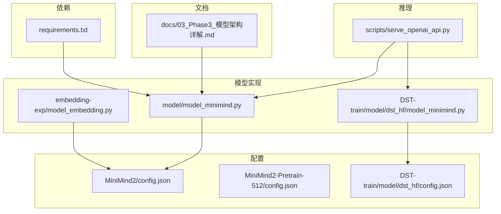
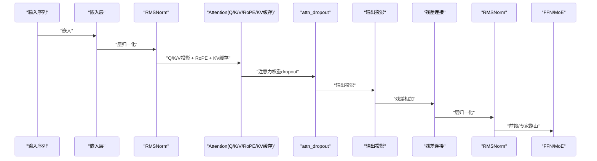
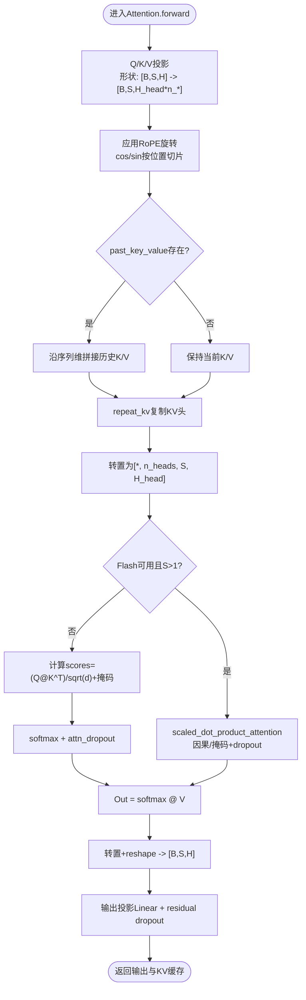
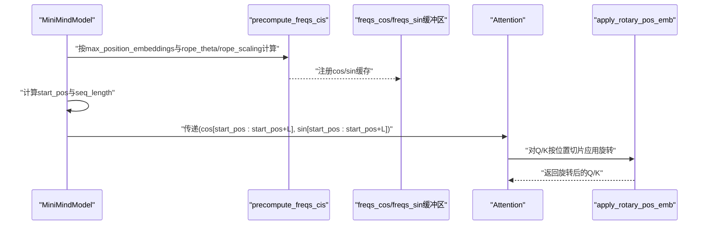
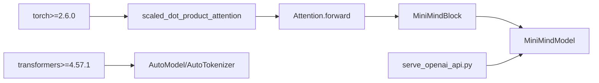

# 注意力机制

<cite>
**本文引用的文件列表**
- [model_minimind.py](file://model/model_minimind.py)
- [model_minimind.py（DST-HF）](file://DST-train/model/dst_hf/model_minimind.py)
- [model_embedding.py](file://embedding-exp/model_embedding.py)
- [config.json（MiniMind2）](file://MiniMind2/config.json)
- [config.json（MiniMind2-Pretrain-512）](file://MiniMind2-Pretrain-512/config.json)
- [config.json（DST-HF）](file://DST-train/model/dst_hf/config.json)
- [requirements.txt](file://requirements.txt)
- [03_Phase3_模型架构详解.md](file://docs/03_Phase3_模型架构详解.md)
- [serve_openai_api.py](file://scripts/serve_openai_api.py)
</cite>

## 目录
1. [引言](#引言)
2. [项目结构](#项目结构)
3. [核心组件](#核心组件)
4. [架构总览](#架构总览)
5. [组件详细分析](#组件详细分析)
6. [依赖关系分析](#依赖关系分析)
7. [性能考量](#性能考量)
8. [故障排查指南](#故障排查指南)
9. [结论](#结论)
10. [附录](#附录)

## 引言
本文件围绕仓库中的注意力机制实现进行系统性技术文档整理，重点覆盖以下方面：
- Multi-Query Attention（MQA）的实现原理与查询/键/值投影计算
- Flash Attention优化技术的实现细节（内存效率与计算加速策略）
- RoPE旋转位置编码的应用方式（cos/sin缓存机制与动态缩放）
- KV缓存机制（past_key_value管理与序列长度扩展）
- 注意力掩码处理、dropout应用与输出投影
- 性能优化技巧与调试方法

## 项目结构
本仓库中与注意力机制直接相关的实现集中在以下文件：
- 核心模型与注意力实现：model/model_minimind.py、DST-train/model/dst_hf/model_minimind.py
- 嵌入实验模型（含RoPE与多嵌入方案）：embedding-exp/model_embedding.py
- 模型配置：MiniMind2/config.json、MiniMind2-Pretrain-512/config.json、DST-train/model/dst_hf/config.json
- 推理服务脚本：scripts/serve_openai_api.py
- 文档与RoPE说明：docs/03_Phase3_模型架构详解.md
- 依赖版本：requirements.txt

**图表来源**
- [model_minimind.py:150-226](file://model/model_minimind.py#L150-L226)
- [model_minimind.py（DST-HF）:150-226](file://DST-train/model/dst_hf/model_minimind.py#L150-L226)
- [model_embedding.py:82-173](file://embedding-exp/model_embedding.py#L82-L173)
- [config.json（MiniMind2）:1-33](file://MiniMind2/config.json#L1-L33)
- [config.json（MiniMind2-Pretrain-512）:1-33](file://MiniMind2-Pretrain-512/config.json#L1-L33)
- [config.json（DST-HF）:1-37](file://DST-train/model/dst_hf/config.json#L1-L37)
- [serve_openai_api.py:1-178](file://scripts/serve_openai_api.py#L1-L178)
- [03_Phase3_模型架构详解.md:77-116](file://docs/03_Phase3_模型架构详解.md#L77-L116)
- [requirements.txt:1-31](file://requirements.txt#L1-L31)

**章节来源**
- [model_minimind.py:150-226](file://model/model_minimind.py#L150-L226)
- [model_minimind.py（DST-HF）:150-226](file://DST-train/model/dst_hf/model_minimind.py#L150-L226)
- [model_embedding.py:82-173](file://embedding-exp/model_embedding.py#L82-L173)
- [config.json（MiniMind2）:1-33](file://MiniMind2/config.json#L1-L33)
- [config.json（MiniMind2-Pretrain-512）:1-33](file://MiniMind2-Pretrain-512/config.json#L1-L33)
- [config.json（DST-HF）:1-37](file://DST-train/model/dst_hf/config.json#L1-L37)
- [serve_openai_api.py:1-178](file://scripts/serve_openai_api.py#L1-L178)
- [03_Phase3_模型架构详解.md:77-116](file://docs/03_Phase3_模型架构详解.md#L77-L116)
- [requirements.txt:1-31](file://requirements.txt#L1-L31)

## 核心组件
- 配置类与RoPE参数：MiniMindConfig（包含num_attention_heads、num_key_value_heads、rope_theta、inference_rope_scaling、flash_attn等），以及YaRN外推参数（factor、beta_fast、beta_slow、original_max_position_embeddings）
- RoPE预计算与应用：precompute_freqs_cis、apply_rotary_pos_emb
- MQA注意力模块：Attention（含Q/K/V投影、RoPE、KV缓存、重复KV、掩码与dropout、输出投影）
- 前馈网络与MoE（可选）：FeedForward、MoEGate、MOEFeedForward
- 模型块与完整模型：MiniMindBlock、MiniMindModel、MiniMindForCausalLM
- 嵌入实验模型：MiniMindEmbeddingModel（支持多种嵌入方案，复用RoPE）

**章节来源**
- [model_minimind.py:8-78](file://model/model_minimind.py#L8-L78)
- [model_minimind.py（DST-HF）:8-78](file://DST-train/model/dst_hf/model_minimind.py#L8-L78)
- [model_minimind.py:108-128](file://model/model_minimind.py#L108-L128)
- [model_minimind.py（DST-HF）:108-128](file://DST-train/model/dst_hf/model_minimind.py#L108-L128)
- [model_minimind.py:131-137](file://model/model_minimind.py#L131-L137)
- [model_minimind.py（DST-HF）:131-137](file://DST-train/model/dst_hf/model_minimind.py#L131-L137)
- [model_minimind.py:150-226](file://model/model_minimind.py#L150-L226)
- [model_minimind.py（DST-HF）:150-226](file://DST-train/model/dst_hf/model_minimind.py#L150-L226)
- [model_embedding.py:82-173](file://embedding-exp/model_embedding.py#L82-L173)

## 架构总览
注意力子系统的整体流程如下：
- 输入嵌入后进入MiniMindBlock，先RMSNorm再自注意力
- 自注意力内部执行Q/K/V投影、RoPE旋转、KV缓存拼接、MQA重复KV、掩码与dropout、输出投影
- 输出与残差相加，再进入FFN（或MoE）

**图表来源**
- [model_minimind.py:363-384](file://model/model_minimind.py#L363-L384)
- [model_minimind.py（DST-HF）:363-384](file://DST-train/model/dst_hf/model_minimind.py#L363-L384)
- [model_minimind.py:150-226](file://model/model_minimind.py#L150-L226)
- [model_minimind.py（DST-HF）:150-226](file://DST-train/model/dst_hf/model_minimind.py#L150-L226)

## 组件详细分析

### Multi-Query Attention（MQA）实现
- 查询/键/值投影
  - Q投影：Linear(隐藏维 → 头数×头维)，K/V投影：Linear(隐藏维 → KV头数×头维)
  - 形状变换：[B, S, H] → [B, S, H_head×n_head] 或 [B, S, H_head×n_kv_head]
- RoPE旋转
  - 对Q/K分别施加旋转，使用cos/sin缓存（按当前位置切片）
- KV缓存
  - 若past_key_value存在，则将历史K/V与当前K/V沿序列维拼接；use_cache为真时返回(K, V)作为下步缓存
- MQA重复K/V
  - repeat_kv将KV头复制n_rep次（n_rep = n_head / n_kv_head），使Q与KV的头数匹配
- 注意力计算
  - Flash Attention：使用torch.nn.functional.scaled_dot_product_attention，支持因果掩码与dropout
  - 降级路径：手工计算scores = (Q @ K^T)/sqrt(d) + 掩码，softmax，dropout，再与V相乘
- 掩码与dropout
  - 因果掩码：上三角-inf
  - 用户传入attention_mask会扩展为广播形状并融合到掩码
  - attn_dropout在softmax后应用
- 输出投影
  - reshape回[B, S, H_head×n_head]，经residual dropout与输出投影Linear

**图表来源**
- [model_minimind.py:150-226](file://model/model_minimind.py#L150-L226)
- [model_minimind.py（DST-HF）:150-226](file://DST-train/model/dst_hf/model_minimind.py#L150-L226)

**章节来源**
- [model_minimind.py:150-226](file://model/model_minimind.py#L150-L226)
- [model_minimind.py（DST-HF）:150-226](file://DST-train/model/dst_hf/model_minimind.py#L150-L226)

### Flash Attention优化
- 启用条件
  - 检测torch.nn.functional是否具备scaled_dot_product_attention，并且配置中开启flash_attn
- 掩码与因果性
  - 若attention_mask全为1或为空，使用因果掩码（上三角-inf），is_causal=True
  - 否则将attention_mask扩展为广播形状并与因果掩码相加，is_causal=False
- Dropout
  - 训练时使用self.dropout，推理时dropout_p=0
- 内存与速度
  - 使用PyTorch内置SDPA，通常在CUDA上有更好的内存效率与吞吐

**章节来源**
- [model_minimind.py:166-167](file://model/model_minimind.py#L166-L167)
- [model_minimind.py（DST-HF）:166-167](file://DST-train/model/dst_hf/model_minimind.py#L166-L167)
- [model_minimind.py:198-207](file://model/model_minimind.py#L198-L207)
- [model_minimind.py（DST-HF）:198-207](file://DST-train/model/dst_hf/model_minimind.py#L198-L207)

### RoPE旋转位置编码
- 频率预计算
  - precompute_freqs_cis按维度与位置生成频率，支持YaRN外推缩放（当end/orig_max>1时）
  - 生成freqs_cos与freqs_sin并注册为非持久buffer
- 应用方式
  - apply_rotary_pos_emb对Q/K按位置切片后的cos/sin进行逐元素旋转
- 动态缩放
  - inference_rope_scaling控制是否启用YaRN外推；配置中包含factor、beta_fast、beta_slow、original_max_position_embeddings等参数
- cos/sin缓存
  - 在MiniMindModel.forward中根据start_pos与seq_length切片缓存，避免重复计算

**图表来源**
- [model_minimind.py:108-128](file://model/model_minimind.py#L108-L128)
- [model_minimind.py:397-420](file://model/model_minimind.py#L397-L420)
- [model_minimind.py（DST-HF）:108-128](file://DST-train/model/dst_hf/model_minimind.py#L108-L128)
- [model_minimind.py（DST-HF）:397-420](file://DST-train/model/dst_hf/model_minimind.py#L397-L420)

**章节来源**
- [model_minimind.py:108-128](file://model/model_minimind.py#L108-L128)
- [model_minimind.py:397-420](file://model/model_minimind.py#L397-L420)
- [model_minimind.py（DST-HF）:108-128](file://DST-train/model/dst_hf/model_minimind.py#L108-L128)
- [model_minimind.py（DST-HF）:397-420](file://DST-train/model/dst_hf/model_minimind.py#L397-L420)
- [config.json（DST-HF）:58-64](file://DST-train/model/dst_hf/config.json#L58-L64)
- [config.json（MiniMind2）:24-27](file://MiniMind2/config.json#L24-L27)
- [config.json（MiniMind2-Pretrain-512）:24-27](file://MiniMind2-Pretrain-512/config.json#L24-L27)
- [03_Phase3_模型架构详解.md:77-116](file://docs/03_Phase3_模型架构详解.md#L77-L116)

### KV缓存机制
- 管理
  - Attention.forward中若past_key_value非空，则将历史K/V与当前K/V沿序列维拼接
  - use_cache为真时返回当前K/V作为“present”缓存
- 序列长度扩展
  - 每步推理时，past_key_values中K/V的序列维逐步增长，避免重复计算历史上下文
- 调用链
  - MiniMindModel.forward根据past_key_values[0][0].shape[1]确定start_pos，从而切片cos/sin与拼接KV

**章节来源**
- [model_minimind.py:186-190](file://model/model_minimind.py#L186-L190)
- [model_minimind.py（DST-HF）:186-190](file://DST-train/model/dst_hf/model_minimind.py#L186-L190)
- [model_minimind.py:409-412](file://model/model_minimind.py#L409-L412)
- [model_minimind.py（DST-HF）:409-412](file://DST-train/model/dst_hf/model_minimind.py#L409-L412)

### 注意力掩码处理、dropout与输出投影
- 掩码
  - 因果掩码：上三角-inf
  - 用户传入attention_mask会扩展为广播形状并与因果掩码相加
- Dropout
  - attn_dropout在softmax之后对注意力权重应用
  - residual dropout在输出投影后应用
- 输出投影
  - 将注意力输出reshape为[B, S, H_head×n_head]，经Linear(H_head×n_head → H)与residual dropout

**章节来源**
- [model_minimind.py:209-226](file://model/model_minimind.py#L209-L226)
- [model_minimind.py（DST-HF）:209-226](file://DST-train/model/dst_hf/model_minimind.py#L209-L226)

### 嵌入实验模型中的RoPE与多嵌入方案
- MiniMindEmbeddingModel复用RoPE缓存与位置切片逻辑，同时支持多种嵌入方案（A/B/C1/C2）
- 该模型展示了如何在不改变注意力实现的前提下，替换嵌入层并保持RoPE一致性

**章节来源**
- [model_embedding.py:82-173](file://embedding-exp/model_embedding.py#L82-L173)

## 依赖关系分析
- 版本要求
  - torch版本要求≥2.6.0（用于Flash Attention与SDPA）
  - transformers版本≥4.57.1
- 模块依赖
  - Attention依赖RoPE预计算与应用函数
  - MiniMindModel依赖RMSNorm与MiniMindBlock
  - 推理脚本serve_openai_api.py加载模型并调用generate接口

**图表来源**
- [requirements.txt:30-31](file://requirements.txt#L30-L31)
- [model_minimind.py:150-226](file://model/model_minimind.py#L150-L226)
- [serve_openai_api.py:1-178](file://scripts/serve_openai_api.py#L1-L178)

**章节来源**
- [requirements.txt:1-31](file://requirements.txt#L1-L31)
- [serve_openai_api.py:1-178](file://scripts/serve_openai_api.py#L1-L178)

## 性能考量
- MQA减少KV头数，降低KV投影与注意力计算开销，适合长序列与资源受限场景
- Flash Attention在CUDA上具有更好的内存效率与吞吐，建议在S>1时启用
- RoPE采用cos/sin缓存与按位置切片，避免重复计算
- KV缓存避免重复计算历史上下文，显著降低推理延迟
- dropout仅在训练阶段生效，推理时dropout_p=0，减少额外开销
- 中间维度按64对齐（intermediate_size按64上取整），有利于张量核优化

**章节来源**
- [model_minimind.py:232-235](file://model/model_minimind.py#L232-L235)
- [model_minimind.py（DST-HF）:232-235](file://DST-train/model/dst_hf/model_minimind.py#L232-L235)
- [model_minimind.py:166-167](file://model/model_minimind.py#L166-L167)
- [model_minimind.py（DST-HF）:166-167](file://DST-train/model/dst_hf/model_minimind.py#L166-L167)

## 故障排查指南
- Flash Attention未生效
  - 检查torch版本是否满足≥2.6.0
  - 确认配置中flash_attn为True
  - 确认seq_len>1（Flash路径在S=1时退化到降级路径）
- 掩码异常
  - 确认attention_mask形状与广播规则正确
  - 注意因果掩码与用户掩码的融合方式
- KV缓存不更新
  - 确认use_cache为True
  - 检查past_key_values的结构与序列维拼接逻辑
- RoPE外推无效
  - 确认inference_rope_scaling为True
  - 检查rope_scaling参数（factor、beta_fast、beta_slow、original_max_position_embeddings）
- 推理服务报错
  - 检查serve_openai_api.py中的模型加载与generate调用参数
  - 确认tokenizer与模型配置一致

**章节来源**
- [requirements.txt:30-31](file://requirements.txt#L30-L31)
- [model_minimind.py:166-167](file://model/model_minimind.py#L166-L167)
- [model_minimind.py（DST-HF）:166-167](file://DST-train/model/dst_hf/model_minimind.py#L166-L167)
- [model_minimind.py:209-226](file://model/model_minimind.py#L209-L226)
- [model_minimind.py（DST-HF）:209-226](file://DST-train/model/dst_hf/model_minimind.py#L209-L226)
- [config.json（DST-HF）:58-64](file://DST-train/model/dst_hf/config.json#L58-L64)
- [serve_openai_api.py:1-178](file://scripts/serve_openai_api.py#L1-L178)

## 结论
本仓库实现了完整的MQA注意力机制，结合RoPE位置编码、KV缓存与可选的Flash Attention优化，既保证了长序列建模能力，又兼顾了推理效率。通过cos/sin缓存与按位置切片，显著降低了RoPE的重复计算成本；通过MQA与KV缓存，进一步减少了KV头数与历史上下文的重复计算。在配置层面，YaRN外推参数与flash_attn开关为不同场景提供了灵活的性能与扩展性权衡。

## 附录
- 相关配置项
  - num_attention_heads、num_key_value_heads、rope_theta、inference_rope_scaling、flash_attn
  - rope_scaling（factor、beta_fast、beta_slow、original_max_position_embeddings）
- 推理脚本关键点
  - 加载模型与tokenizer
  - generate接口参数（max_new_tokens、do_sample、temperature、top_p、attention_mask等）

**章节来源**
- [config.json（DST-HF）:1-37](file://DST-train/model/dst_hf/config.json#L1-L37)
- [config.json（MiniMind2）:1-33](file://MiniMind2/config.json#L1-L33)
- [config.json（MiniMind2-Pretrain-512）:1-33](file://MiniMind2-Pretrain-512/config.json#L1-L33)
- [serve_openai_api.py:1-178](file://scripts/serve_openai_api.py#L1-L178)