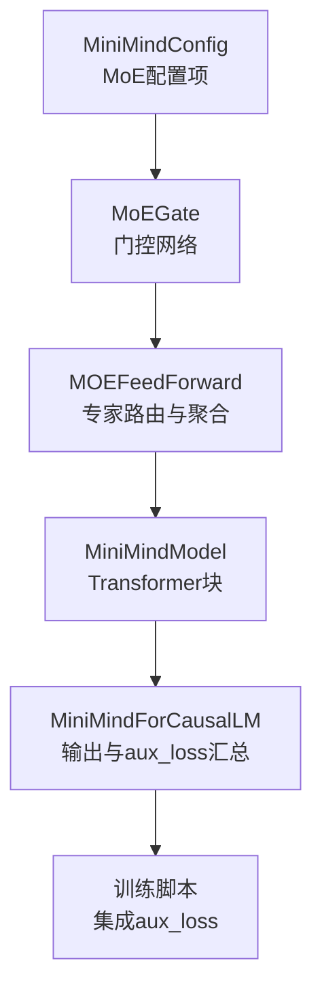
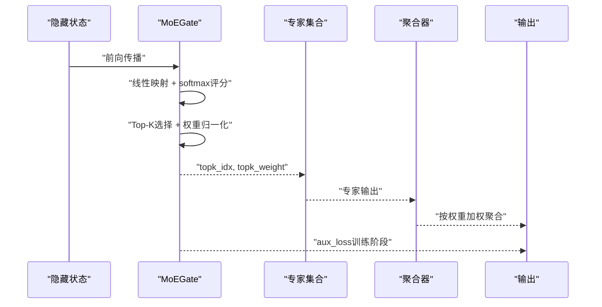
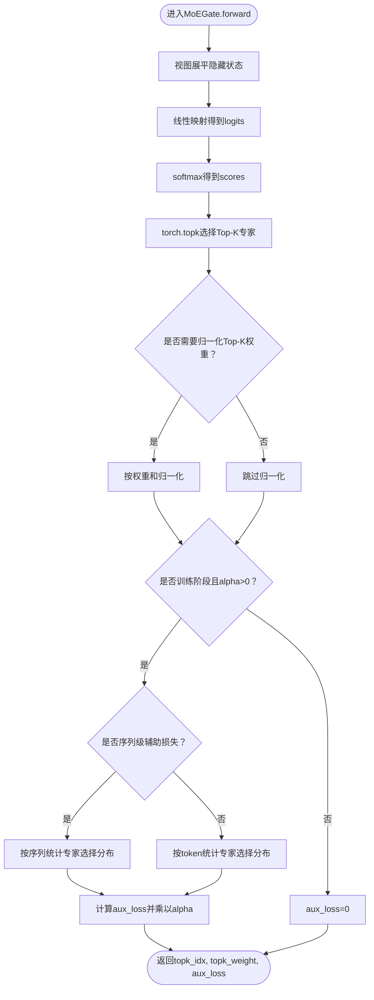
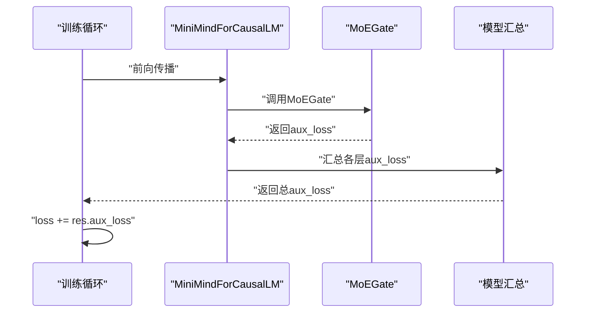
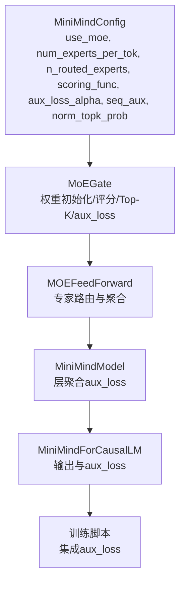

# MoE门控机制

<cite>
**本文引用的文件**
- [model_minimind.py](file://model/model_minimind.py)
- [03_Phase3_模型架构详解.md](file://docs/03_Phase3_模型架构详解.md)
- [04_Phase4_预训练.md](file://docs/04_Phase4_预训练.md)
- [train_dst.py](file://DST-train/train_dst.py)
- [train_lora.py](file://trainer/train_lora.py)
- [configuration.json](file://MiniMind2-PyTorch/configuration.json)
</cite>

## 目录
1. [简介](#简介)
2. [项目结构](#项目结构)
3. [核心组件](#核心组件)
4. [架构总览](#架构总览)
5. [详细组件分析](#详细组件分析)
6. [依赖关系分析](#依赖关系分析)
7. [性能考量](#性能考量)
8. [故障排查指南](#故障排查指南)
9. [结论](#结论)
10. [附录](#附录)

## 简介
本文件聚焦于MoE（Mixture of Experts）门控机制的技术实现与工程细节，围绕以下目标展开：
- 解析MoEGate门控网络的实现原理，包括线性层权重初始化、评分函数计算和Top-K选择策略
- 深入说明softmax评分函数的数学原理与实现细节，涵盖数值稳定性与梯度特性
- 阐述Top-K选择算法的实现，包括索引排序、权重归一化与张量操作优化
- 解析门控机制在训练与推理阶段的不同行为，包括aux_loss计算与序列级辅助损失
- 提供门控参数配置说明与性能调优建议

## 项目结构
本仓库中与MoE门控相关的核心代码集中在模型实现文件中，配套文档对MoE模块进行了架构层面的说明。训练脚本展示了如何在训练循环中集成MoE的aux_loss。

图表来源
- [model_minimind.py:8-78](file://model/model_minimind.py#L8-L78)
- [model_minimind.py:245-298](file://model/model_minimind.py#L245-L298)
- [model_minimind.py:301-360](file://model/model_minimind.py#L301-L360)
- [model_minimind.py:387-440](file://model/model_minimind.py#L387-L440)
- [train_dst.py:98-100](file://DST-train/train_dst.py#L98-L100)

章节来源
- [model_minimind.py:8-78](file://model/model_minimind.py#L8-L78)
- [model_minimind.py:245-298](file://model/model_minimind.py#L245-L298)
- [model_minimind.py:301-360](file://model/model_minimind.py#L301-L360)
- [model_minimind.py:387-440](file://model/model_minimind.py#L387-L440)
- [03_Phase3_模型架构详解.md:207-270](file://docs/03_Phase3_模型架构详解.md#L207-L270)

## 核心组件
- MiniMindConfig：集中定义MoE相关超参数，包括use_moe、num_experts_per_tok、n_routed_experts、n_shared_experts、scoring_func、aux_loss_alpha、seq_aux、norm_topk_prob等
- MoEGate：门控网络，负责将隐藏状态映射为专家分数，执行Top-K选择与权重归一化，并在训练阶段计算aux_loss
- MOEFeedForward：专家集合与门控组合，负责在训练与推理阶段分别进行专家路由与聚合
- MiniMindModel/MiniMindForCausalLM：在模型前向传播中汇总各层的aux_loss，供训练脚本使用

章节来源
- [model_minimind.py:8-78](file://model/model_minimind.py#L8-L78)
- [model_minimind.py:245-298](file://model/model_minimind.py#L245-L298)
- [model_minimind.py:301-360](file://model/model_minimind.py#L301-L360)
- [model_minimind.py:434-440](file://model/model_minimind.py#L434-L440)

## 架构总览
MoE门控机制在模型中的位置与数据流如下：

图表来源
- [model_minimind.py:264-298](file://model/model_minimind.py#L264-L298)
- [model_minimind.py:301-360](file://model/model_minimind.py#L301-L360)

## 详细组件分析

### MoEGate门控网络
- 线性层权重初始化：使用Kaiming均匀初始化，确保门控权重在合理范围内，有利于训练初期的梯度流动
- 评分函数：当前实现仅支持softmax，将专家分数归一化为概率分布
- Top-K选择：对每个token选择Top-K个专家，支持sorted=False以减少排序开销
- 权重归一化：当top_k>1且开启norm_topk_prob时，对Top-K权重进行归一化，避免权重之和偏离1
- 辅助损失（aux_loss）：在训练阶段计算，用于负载均衡，防止专家路由偏向少数专家

图表来源
- [model_minimind.py:264-298](file://model/model_minimind.py#L264-L298)

章节来源
- [model_minimind.py:245-298](file://model/model_minimind.py#L245-L298)
- [03_Phase3_模型架构详解.md:225-243](file://docs/03_Phase3_模型架构详解.md#L225-L243)

### softmax评分函数的数学原理与实现细节
- 数学原理：softmax将logits映射为概率分布，满足非负性与归一性，便于Top-K选择与权重归一化
- 实现细节：
  - 使用torch.nn.functional.linear进行高效矩阵乘法
  - softmax沿专家维（最后一维）归一化
  - 数值稳定性：通过log-sum-exp技巧的直接实现，避免溢出
  - 梯度计算：softmax与topk组合在反向传播中保持可导性，aux_loss引入额外梯度信号

章节来源
- [model_minimind.py:267-271](file://model/model_minimind.py#L267-L271)

### Top-K选择算法实现
- 索引排序：使用torch.topk在专家维上选择Top-K，sorted=False以减少排序开销
- 权重归一化：当top_k>1且norm_topk_prob为真时，按权重和进行归一化，防止权重之和过大或过小
- 张量操作优化：
  - 使用view与unsqueeze减少中间张量创建
  - 在训练阶段使用repeat_interleave与布尔索引进行专家路由
  - 在推理阶段使用moe_infer进行批量化优化，减少循环开销

章节来源
- [model_minimind.py:273-277](file://model/model_minimind.py#L273-L277)
- [model_minimind.py:324-330](file://model/model_minimind.py#L324-L330)
- [model_minimind.py:339-360](file://model/model_minimind.py#L339-L360)

### 训练与推理阶段的行为差异
- 训练阶段：
  - 专家路由：对每个token选择Top-K专家，分别计算专家输出并按权重加权
  - aux_loss：在MoEGate中计算，随后由MiniMindModel汇总
- 推理阶段：
  - 专家路由：使用moe_infer进行批量化处理，先对专家索引排序，再按token分组处理，最后通过scatter_add累加到缓存张量
  - aux_loss：不参与推理，返回0

章节来源
- [model_minimind.py:316-337](file://model/model_minimind.py#L316-L337)
- [model_minimind.py:339-360](file://model/model_minimind.py#L339-L360)
- [model_minimind.py:434-440](file://model/model_minimind.py#L434-L440)

### aux_loss计算与序列级辅助损失
- 计算目标：负载均衡，防止专家路由偏向少数专家，提升专家利用率
- 计算方式：
  - 序列级（seq_aux=True）：按序列统计专家选择分布，结合每个token的专家平均分数，计算加权损失
  - token级（seq_aux=False）：按token统计专家选择分布，结合专家平均分数，计算加权损失
- 与训练脚本集成：训练循环中将res.aux_loss加入总损失，实现端到端优化

图表来源
- [model_minimind.py:434-440](file://model/model_minimind.py#L434-L440)
- [train_dst.py:98-100](file://DST-train/train_dst.py#L98-L100)

章节来源
- [model_minimind.py:279-298](file://model/model_minimind.py#L279-L298)
- [model_minimind.py:434-440](file://model/model_minimind.py#L434-L440)
- [train_dst.py:98-100](file://DST-train/train_dst.py#L98-L100)
- [04_Phase4_预训练.md:123-124](file://docs/04_Phase4_预训练.md#L123-L124)

## 依赖关系分析
MoE门控机制的关键依赖关系如下：

图表来源
- [model_minimind.py:8-78](file://model/model_minimind.py#L8-L78)
- [model_minimind.py:245-298](file://model/model_minimind.py#L245-L298)
- [model_minimind.py:301-360](file://model/model_minimind.py#L301-L360)
- [model_minimind.py:387-440](file://model/model_minimind.py#L387-L440)
- [train_dst.py:98-100](file://DST-train/train_dst.py#L98-L100)

章节来源
- [model_minimind.py:8-78](file://model/model_minimind.py#L8-L78)
- [model_minimind.py:245-298](file://model/model_minimind.py#L245-L298)
- [model_minimind.py:301-360](file://model/model_minimind.py#L301-L360)
- [model_minimind.py:387-440](file://model/model_minimind.py#L387-L440)
- [train_dst.py:98-100](file://DST-train/train_dst.py#L98-L100)

## 性能考量
- 训练阶段优化
  - Top-K排序：使用sorted=False减少排序开销
  - 权重归一化：仅在top_k>1时进行，避免不必要的计算
  - 类型一致性：训练阶段使用float16缓存专家输出，减少内存占用
- 推理阶段优化
  - 批量化路由：moe_infer通过排序与bincount实现按专家分组处理，减少循环次数
  - 内存复用：使用expert_cache与scatter_add减少中间张量创建
- 训练脚本集成
  - 训练循环中将aux_loss加入总损失，确保负载均衡正则化有效
  - 支持混合精度与梯度累积，平衡吞吐与显存

章节来源
- [model_minimind.py:273-277](file://model/model_minimind.py#L273-L277)
- [model_minimind.py:324-330](file://model/model_minimind.py#L324-L330)
- [model_minimind.py:339-360](file://model/model_minimind.py#L339-L360)
- [train_dst.py:98-100](file://DST-train/train_dst.py#L98-L100)

## 故障排查指南
- 门控评分异常
  - 现象：softmax输出出现NaN或Inf
  - 排查：检查logits范围与数值稳定性，确认线性层权重初始化正常
  - 参考：softmax实现路径
- Top-K权重异常
  - 现象：权重之和不为1或出现极端值
  - 排查：确认norm_topk_prob配置与归一化逻辑
  - 参考：Top-K与归一化实现路径
- aux_loss不生效
  - 现象：训练损失未随aux_loss变化
  - 排查：确认训练阶段alpha>0且seq_aux配置正确；检查训练脚本是否将aux_loss加入总损失
  - 参考：aux_loss计算与训练脚本集成路径
- 推理性能下降
  - 现象：推理阶段显存占用高或吞吐低
  - 排查：确认使用moe_infer而非训练分支；检查专家数量与Top-K配置是否过高

章节来源
- [model_minimind.py:267-271](file://model/model_minimind.py#L267-L271)
- [model_minimind.py:273-277](file://model/model_minimind.py#L273-L277)
- [model_minimind.py:279-298](file://model/model_minimind.py#L279-L298)
- [train_dst.py:98-100](file://DST-train/train_dst.py#L98-L100)

## 结论
MoEGate门控机制通过softmax评分与Top-K选择实现高效的专家路由，配合权重归一化与aux_loss实现负载均衡，兼顾训练稳定性与推理效率。通过合理的参数配置与实现优化，可在保证模型表达能力的同时控制计算与显存开销。

## 附录

### 门控参数配置说明
- use_moe：是否启用MoE
- num_experts_per_tok：每个token选择的专家数量
- n_routed_experts：可路由专家总数
- n_shared_experts：共享专家数量（始终参与计算）
- scoring_func：评分函数，当前支持softmax
- aux_loss_alpha：aux_loss权重系数
- seq_aux：是否使用序列级辅助损失
- norm_topk_prob：是否对Top-K权重进行归一化

章节来源
- [model_minimind.py:8-78](file://model/model_minimind.py#L8-L78)
- [03_Phase3_模型架构详解.md:207-243](file://docs/03_Phase3_模型架构详解.md#L207-L243)

### 训练脚本中的MoE集成
- 训练循环中将res.aux_loss加入总损失，实现端到端优化
- 支持混合精度与梯度累积，提升训练效率

章节来源
- [train_dst.py:98-100](file://DST-train/train_dst.py#L98-L100)
- [04_Phase4_预训练.md:123-124](file://docs/04_Phase4_预训练.md#L123-L124)