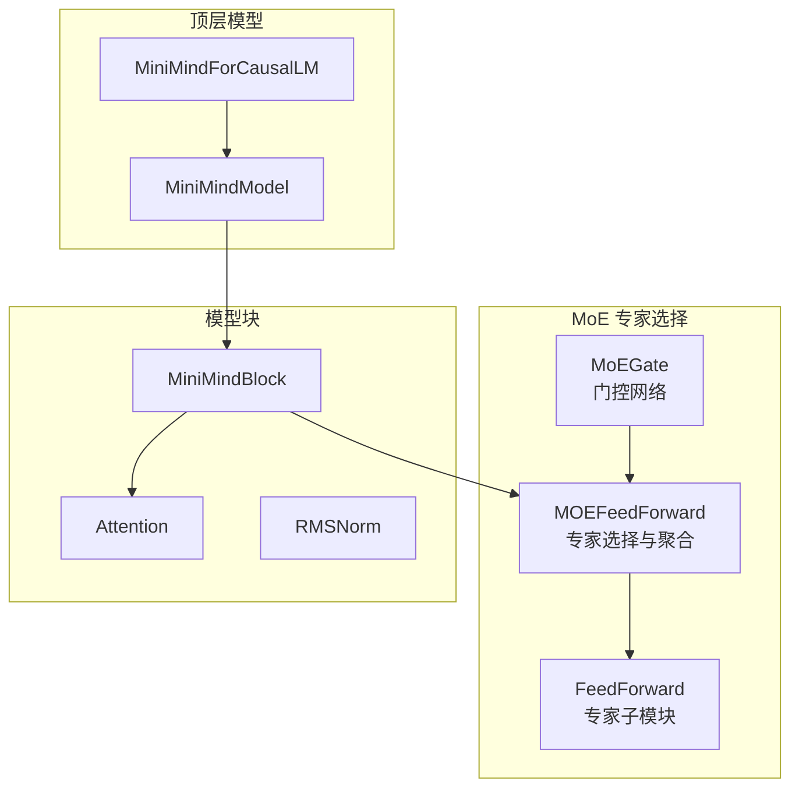
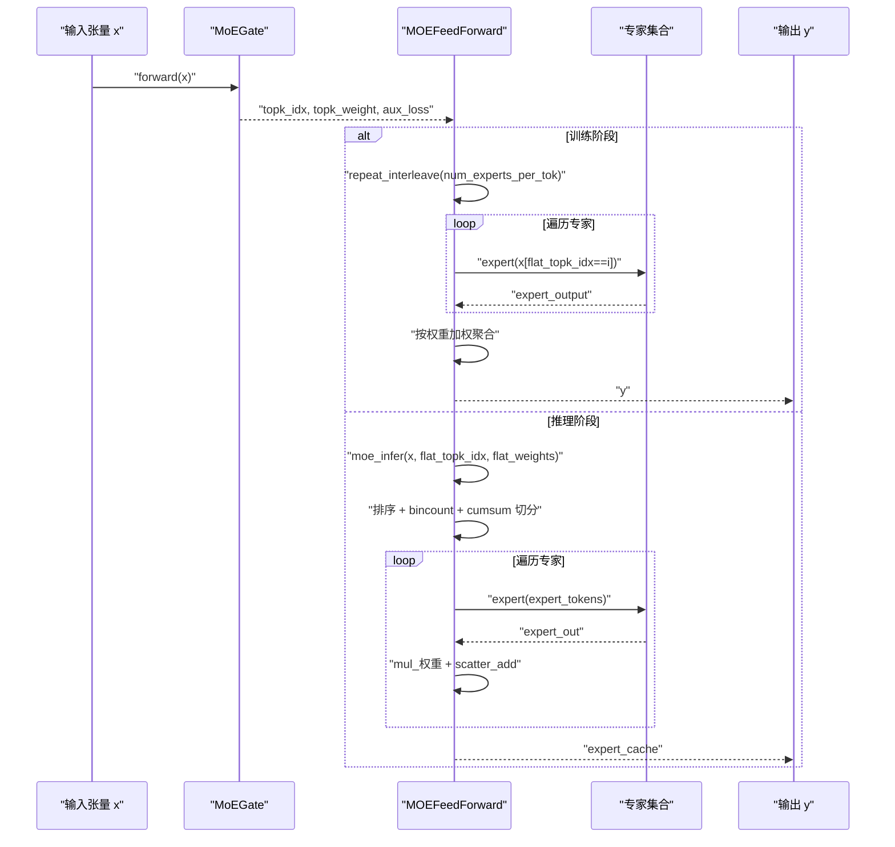
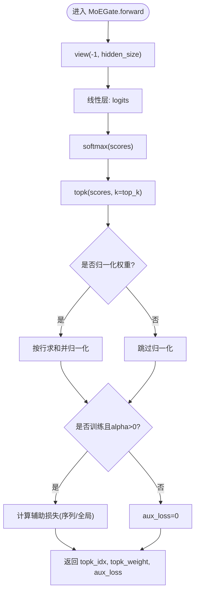
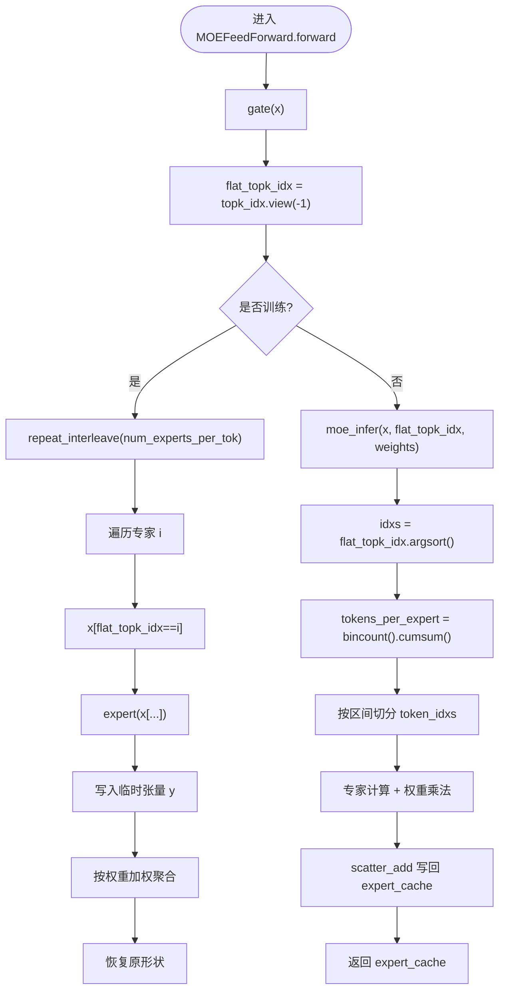
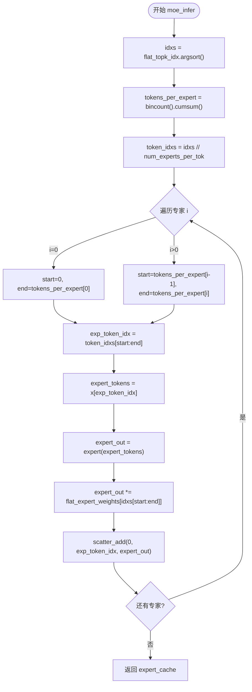
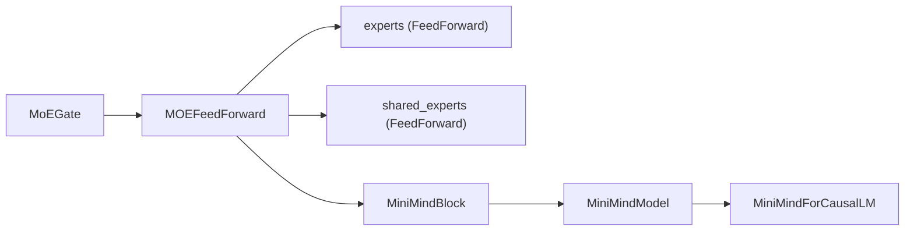

# 专家选择算法

<cite>
**本文引用的文件**
- [model_minimind.py](file://model/model_minimind.py)
- [03_Phase3_模型架构详解.md](file://docs/03_Phase3_模型架构详解.md)
</cite>

## 目录
1. [简介](#简介)
2. [项目结构](#项目结构)
3. [核心组件](#核心组件)
4. [架构总览](#架构总览)
5. [详细组件分析](#详细组件分析)
6. [依赖分析](#依赖分析)
7. [性能考量](#性能考量)
8. [故障排查指南](#故障排查指南)
9. [结论](#结论)
10. [附录](#附录)

## 简介
本文件系统性解析 MiniMind 模型中的专家选择算法，聚焦 MoE（Mixture of Experts）路径下的专家选择流程，包括：
- 令牌分组与专家分配
- 权重计算与归一化
- 训练阶段的专家并行处理（重复张量、逐专家处理、加权聚合）
- 推理阶段的优化算法（令牌排序、bincount/cumsum切分、scatter_add 聚合）
- flat_topk_idx 索引系统的构建与使用
- 性能与内存优化策略

## 项目结构
与专家选择直接相关的核心代码位于模型实现文件中，文档中也提供了架构层面的说明。下图展示与 MoE 专家选择相关的模块关系。

图表来源
- [model_minimind.py:245-360](file://model/model_minimind.py#L245-L360)
- [model_minimind.py:363-440](file://model/model_minimind.py#L363-L440)

章节来源
- [model_minimind.py:245-360](file://model/model_minimind.py#L245-L360)
- [03_Phase3_模型架构详解.md:207-270](file://docs/03_Phase3_模型架构详解.md#L207-L270)

## 核心组件
- MoEGate：计算每个 token 到每个专家的分数，执行 top-k 选择，并返回专家索引、权重与辅助损失。
- MOEFeedForward：根据门控结果进行专家选择与聚合，训练与推理路径分别实现。
- FeedForward：专家子模块，作为路由专家的计算单元。
- MiniMindBlock：包含注意力与 MoE/FFN 的 Transformer 块。
- MiniMindModel/MiniMindForCausalLM：顶层模型封装与输出。

章节来源
- [model_minimind.py:245-360](file://model/model_minimind.py#L245-L360)
- [model_minimind.py:363-440](file://model/model_minimind.py#L363-L440)

## 架构总览
MoE 专家选择在前向传播中按如下顺序执行：
1) 门控网络计算专家分数并 top-k 选择
2) 训练阶段：重复张量、逐专家处理、加权聚合
3) 推理阶段：令牌排序、按专家分组、scatter_add 聚合
4) 可选：共享专家叠加

图表来源
- [model_minimind.py:245-360](file://model/model_minimind.py#L245-L360)

## 详细组件分析

### 门控网络（MoEGate）
- 输入：隐藏状态张量，形状为 [bsz, seq_len, hidden_size]
- 计算：线性变换得到专家分数 logits，softmax 得到 scores
- 选择：top-k 选出 top_k 个专家及其权重
- 归一化：若启用，对 top-k 权重进行归一化
- 辅助损失：在训练时计算负载均衡损失，防止路由崩塌

图表来源
- [model_minimind.py:264-298](file://model/model_minimind.py#L264-L298)

章节来源
- [model_minimind.py:245-298](file://model/model_minimind.py#L245-L298)

### 专家选择与聚合（MOEFeedForward）
- 训练路径：
  - 将输入 x 沿 token 维重复 num_experts_per_tok 次，形成“重复张量”
  - 逐专家筛选出属于该专家的 token，调用专家计算，写入临时张量
  - 将专家输出按 topk 权重加权并聚合回原形状
- 推理路径：
  - 使用 moe_infer，先对 flat_topk_idx 排序，得到 idxs
  - 使用 bincount + cumsum 计算每个专家处理的 token 数目区间
  - 按专家分组提取 token，专家计算后乘以对应权重，使用 scatter_add 写回原始位置

图表来源
- [model_minimind.py:316-360](file://model/model_minimind.py#L316-L360)

章节来源
- [model_minimind.py:301-360](file://model/model_minimind.py#L301-L360)

### 推理优化：令牌排序、专家分组与 scatter_add
- 令牌排序：对 flat_topk_idx 排序得到 idxs，使相同专家的 token 在相邻位置
- bincount + cumsum：统计每个专家处理的 token 数目，累积求和得到区间边界
- token_idxs：通过 idxs 整除 num_experts_per_tok 得到每个 token 对应的专家编号
- 专家分组：按区间提取 token 索引，调用专家计算
- 权重乘法：将 flat_expert_weights 按 idxs 顺序乘到专家输出
- 聚合：使用 scatter_add 将专家输出写回到原始位置，完成加权聚合

图表来源
- [model_minimind.py:339-360](file://model/model_minimind.py#L339-L360)

章节来源
- [model_minimind.py:339-360](file://model/model_minimind.py#L339-L360)

### flat_topk_idx 索引系统
- 构建：topk_idx 由门控返回，形状为 [bsz, seq_len, top_k]，flat_topk_idx = topk_idx.view(-1)
- 作用：
  - 训练：用于筛选属于某专家的 token，构造“重复张量”后逐专家处理
  - 推理：排序后与 num_experts_per_tok 结合，得到每个 token 的专家编号，实现按专家分组
- 张量重塑：
  - 训练：x.view(-1, D) 后 repeat_interleave，使每个 token 被复制 num_experts_per_tok 次
  - 推理：idxs // num_experts_per_tok 得到 token_idxs，按区间切分

章节来源
- [model_minimind.py:321-323](file://model/model_minimind.py#L321-L323)
- [model_minimind.py:342-344](file://model/model_minimind.py#L342-L344)

### 训练阶段专家并行处理
- 重复张量：x.repeat_interleave(num_experts_per_tok, dim=0)
- 逐专家处理：for i, expert in enumerate(self.experts)，筛选 flat_topk_idx==i 的 token
- 类型一致性：将专家输出转换为与 y 相同 dtype
- 加权聚合：将 y 重新整形为 [bsz, seq_len, top_k, D]，乘以 topk_weight.unsqueeze(-1)，沿 top_k 维求和

章节来源
- [model_minimind.py:324-330](file://model/model_minimind.py#L324-L330)

### 推理阶段优化算法
- 令牌排序：idxs = flat_topk_idx.argsort()
- 专家分组：tokens_per_expert = flat_expert_indices.bincount().cumsum()
- token_idxs：idxs // num_experts_per_tok
- 专家计算与加权：expert(expert_tokens) 后乘以 flat_expert_weights[idxs[start:end]]
- 聚合：scatter_add 写回 expert_cache，按原始 token 位置累加

章节来源
- [model_minimind.py:339-360](file://model/model_minimind.py#L339-L360)

## 依赖分析
- MoEGate 依赖线性层与 softmax，输出 topk_idx/topk_weight/aux_loss
- MOEFeedForward 依赖：
  - MoEGate：获取专家选择与权重
  - experts：ModuleList，包含多个 FeedForward 专家
  - shared_experts：可选，始终参与计算
- MiniMindBlock 将 MoEFeedForward 作为 MLP 组件之一
- MiniMindModel/MiniMindForCausalLM 负责组装层、归一化与输出

图表来源
- [model_minimind.py:245-360](file://model/model_minimind.py#L245-L360)
- [model_minimind.py:363-440](file://model/model_minimind.py#L363-L440)

章节来源
- [model_minimind.py:245-360](file://model/model_minimind.py#L245-L360)
- [model_minimind.py:363-440](file://model/model_minimind.py#L363-L440)

## 性能考量
- 训练阶段
  - 重复张量：repeat_interleave 会增加显存占用，建议合理设置 num_experts_per_tok
  - 逐专家处理：循环遍历专家，注意避免不必要的类型转换与中间张量分配
  - 加权聚合：使用 reshape + unsqueeze + sum，尽量保持连续内存访问
- 推理阶段
  - 令牌排序 + bincount/cumsum：排序成本与 bincount 成本与 token 数量相关
  - scatter_add：按 token 位置写回，注意避免频繁的张量分配
  - 专家分组：按区间切分 token，减少重复扫描
- 内存优化建议
  - 使用半精度（如 torch.float16）存储专家输出，降低带宽与显存压力
  - 控制 num_experts_per_tok 与 n_routed_experts，避免过度路由
  - 在推理时优先使用 moe_infer 的分组聚合，避免全量重复
  - 合理设置共享专家数量，共享专家会持续参与计算

[本节为通用性能指导，不直接分析具体文件]

## 故障排查指南
- 门控异常
  - 现象：top-k 权重全为 0 或 NaN
  - 排查：检查 MoEGate 的线性层权重初始化与数值稳定性
- 路由崩塌
  - 现象：所有 token 被分配到少数专家
  - 排查：确认辅助损失 alpha 设置与 seq_aux 开关，确保 aux_loss 正常反传
- 推理聚合错误
  - 现象：输出与期望不符或梯度异常
  - 排查：核对 flat_topk_idx 排序、token_idxs 计算、scatter_add 写回索引
- 类型不一致
  - 现象：张量 dtype 不匹配导致报错
  - 排查：确保专家输出与临时张量 dtype 一致（如 y.dtype）

章节来源
- [model_minimind.py:264-298](file://model/model_minimind.py#L264-L298)
- [model_minimind.py:339-360](file://model/model_minimind.py#L339-L360)

## 结论
本文从代码实现角度完整梳理了 MiniMind 的专家选择算法，覆盖门控、令牌分组、专家分配、权重计算、训练与推理两条路径，以及 flat_topk_idx 索引系统的构建与使用。通过排序 + bincount/cumsum + scatter_add 的推理优化，实现了高效的专家并行与聚合。结合合理的配置与内存优化策略，可在保证效果的同时提升性能与稳定性。

[本节为总结性内容，不直接分析具体文件]

## 附录
- 关键配置项
  - use_moe：是否启用 MoE
  - num_experts_per_tok：每个 token 选择的专家数
  - n_routed_experts：可路由专家总数
  - n_shared_experts：共享专家数
  - scoring_func：评分函数（默认 softmax）
  - aux_loss_alpha：辅助损失系数
  - seq_aux：是否按序列计算辅助损失
  - norm_topk_prob：是否对 top-k 权重归一化

章节来源
- [model_minimind.py:8-78](file://model/model_minimind.py#L8-L78)