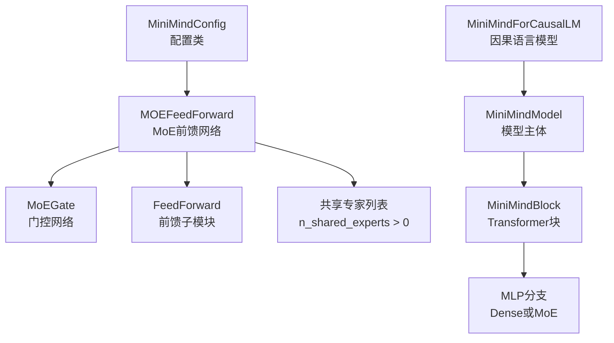
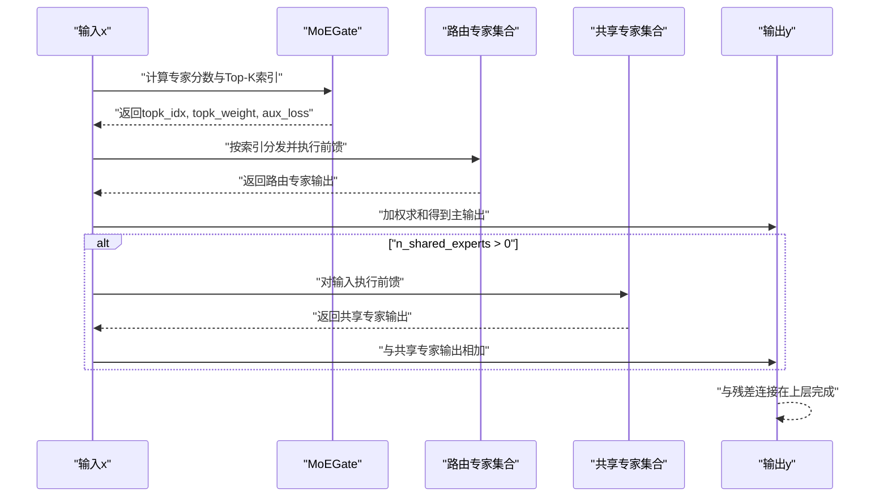
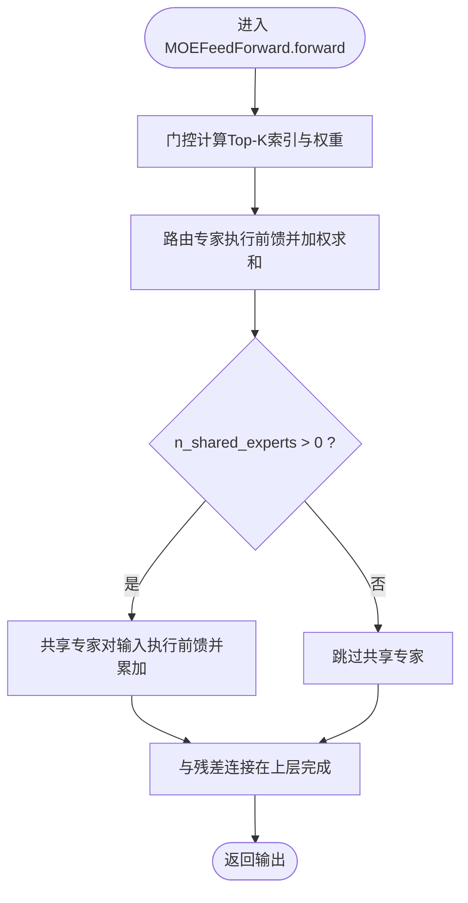
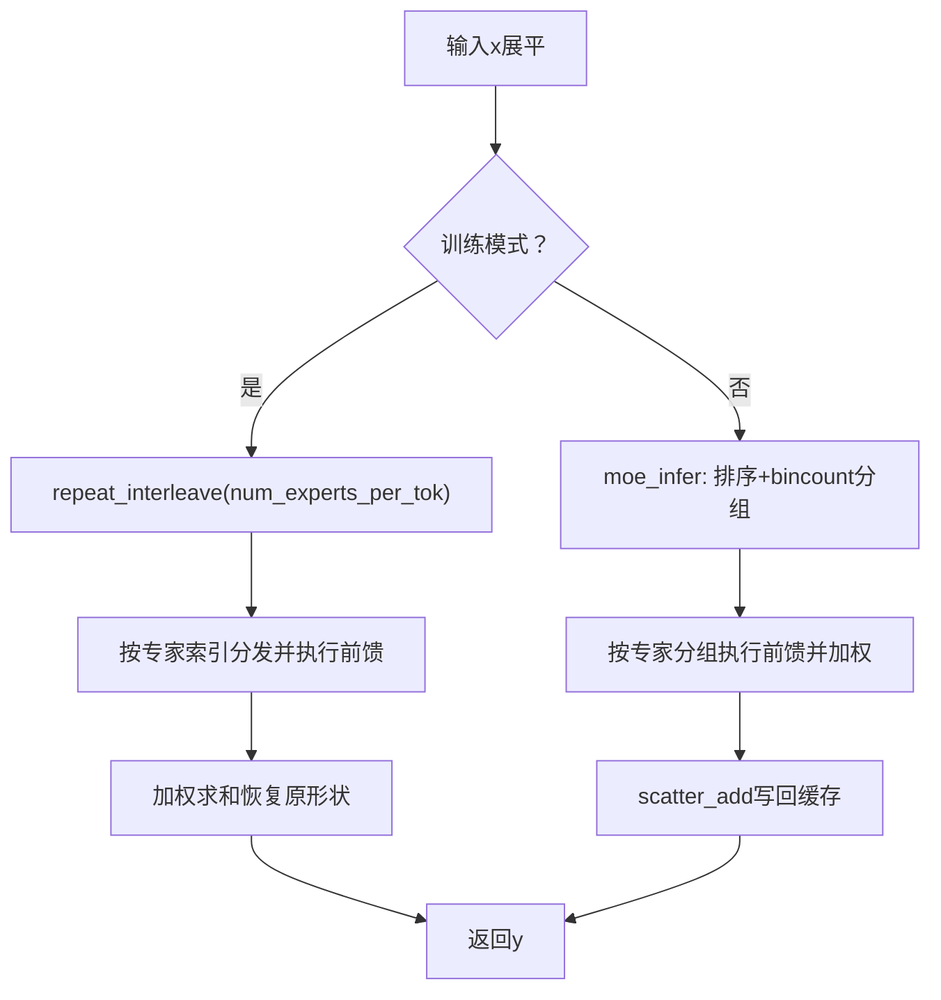
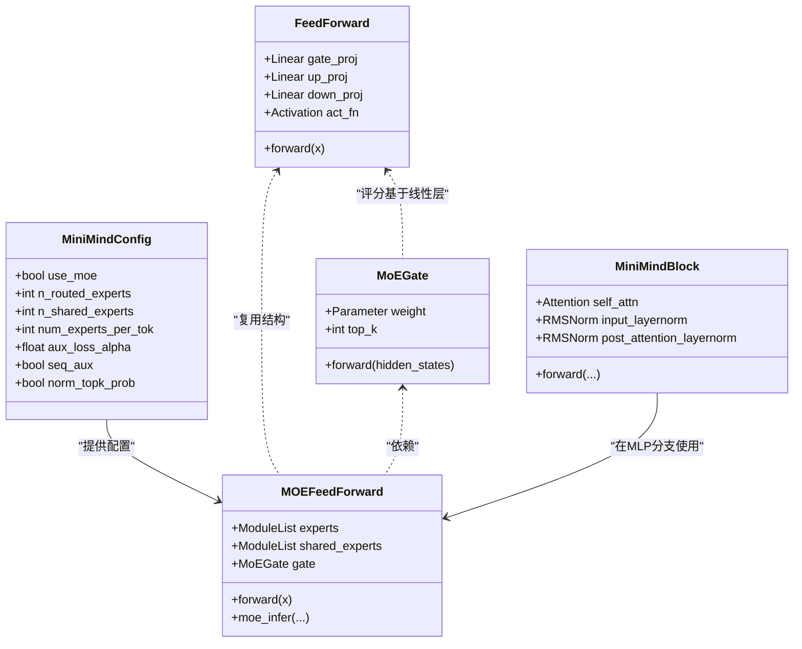

# 共享专家实现

<cite>
**本文引用的文件**
- [model_minimind.py](file://model/model_minimind.py)
- [03_Phase3_模型架构详解.md](file://docs/03_Phase3_模型架构详解.md)
- [config.json](file://DST-train/model/baseline_hf/config.json)
- [config.json](file://DST-train/model/dst_hf/config.json)
</cite>

## 目录
1. [简介](#简介)
2. [项目结构](#项目结构)
3. [核心组件](#核心组件)
4. [架构总览](#架构总览)
5. [详细组件分析](#详细组件分析)
6. [依赖分析](#依赖分析)
7. [性能考量](#性能考量)
8. [故障排查指南](#故障排查指南)
9. [结论](#结论)
10. [附录](#附录)

## 简介
本文件聚焦于共享专家（Shared Experts）在混合专家（Mixture of Experts, MoE）前馈网络中的实现与集成方式，系统解析以下主题：
- n_shared_experts 配置的作用与默认值
- 共享专家与路由专家的区别与职责划分
- 共享专家的前馈网络实现与权重共享策略
- 在 MoEFeedForward 中的集成方式：输出相加与残差连接
- 配置参数与使用场景：何时启用共享专家及其对模型容量的影响
- 性能分析与配置建议：内存占用与计算效率的权衡

## 项目结构
与共享专家实现直接相关的核心文件与模块如下：
- 模型定义与配置：model/model_minimind.py
- 文档说明：docs/03_Phase3_模型架构详解.md
- 配置样例：DST-train/model/baseline_hf/config.json、DST-train/model/dst_hf/config.json

图表来源
- [model_minimind.py:8-78](file://model/model_minimind.py#L8-L78)
- [model_minimind.py:301-375](file://model/model_minimind.py#L301-L375)
- [model_minimind.py:363-384](file://model/model_minimind.py#L363-L384)
- [model_minimind.py:387-440](file://model/model_minimind.py#L387-L440)
- [model_minimind.py:443-477](file://model/model_minimind.py#L443-L477)

章节来源
- [model_minimind.py:8-78](file://model/model_minimind.py#L8-L78)
- [model_minimind.py:301-375](file://model/model_minimind.py#L301-L375)
- [model_minimind.py:363-384](file://model/model_minimind.py#L363-L384)
- [model_minimind.py:387-440](file://model/model_minimind.py#L387-L440)
- [model_minimind.py:443-477](file://model/model_minimind.py#L443-L477)

## 核心组件
- MiniMindConfig：包含 use_moe、n_routed_experts、n_shared_experts、num_experts_per_tok、scoring_func、aux_loss_alpha、seq_aux、norm_topk_prob 等 MoE 相关配置项。
- FeedForward：基础前馈网络，由门控专家与共享专家复用。
- MoEGate：基于隐藏状态的线性评分，Top-K 选择路由专家，并在训练时计算辅助损失。
- MOEFeedForward：MoE 前馈网络，包含路由专家集合与可选的共享专家集合；在推理路径中进行批量优化。
- MiniMindBlock：包含注意力与 MLP（Dense 或 MoE）的 Transformer 层。
- MiniMindModel：堆叠多层 MiniMindBlock 并聚合各层的辅助损失。
- MiniMindForCausalLM：封装 LM 头并输出 CausalLMOutputWithPast。

章节来源
- [model_minimind.py:8-78](file://model/model_minimind.py#L8-L78)
- [model_minimind.py:229-243](file://model/model_minimind.py#L229-L243)
- [model_minimind.py:245-298](file://model/model_minimind.py#L245-L298)
- [model_minimind.py:301-375](file://model/model_minimind.py#L301-L375)
- [model_minimind.py:363-384](file://model/model_minimind.py#L363-L384)
- [model_minimind.py:387-440](file://model/model_minimind.py#L387-L440)
- [model_minimind.py:443-477](file://model/model_minimind.py#L443-L477)

## 架构总览
共享专家在 MoEFeedForward 中的集成路径如下：
- 门控网络根据当前 token 的隐藏状态计算专家分数并 Top-K 选择路由专家。
- 路由专家按索引执行前馈变换并加权求和得到主输出。
- 若配置了共享专家（n_shared_experts > 0），则对输入进行相同前馈变换并累加到主输出。
- 主输出与残差连接结合，进入后续层。

图表来源
- [model_minimind.py:301-375](file://model/model_minimind.py#L301-L375)
- [model_minimind.py:245-298](file://model/model_minimind.py#L245-L298)

章节来源
- [model_minimind.py:301-375](file://model/model_minimind.py#L301-L375)
- [model_minimind.py:245-298](file://model/model_minimind.py#L245-L298)

## 详细组件分析

### 配置参数与作用
- use_moe：是否启用 MoE。当为 False 时，MLP 使用 Dense 前馈。
- n_routed_experts：路由专家总数，决定路由专家集合大小。
- n_shared_experts：共享专家数量。默认值为 1，且在配置类中明确标注“共享专家”。
- num_experts_per_tok：每个 token 选择的专家数量（Top-K）。
- scoring_func：专家评分函数，默认 softmax。
- aux_loss_alpha：辅助损失系数，用于负载均衡正则化。
- seq_aux：是否在序列级别计算辅助损失。
- norm_topk_prob：是否对 Top-K 权重进行归一化。

章节来源
- [model_minimind.py:8-78](file://model/model_minimind.py#L8-L78)
- [config.json:21-22](file://DST-train/model/baseline_hf/config.json#L21-L22)
- [config.json:21-22](file://DST-train/model/dst_hf/config.json#L21-L22)

### 共享专家与路由专家的区别
- 路由专家：由门控网络动态选择，仅对被选中的 token 进行处理，实现稀疏激活与容量扩展。
- 共享专家：始终参与计算，对所有 token 执行相同的前馈变换，作为全局特征增强模块。

章节来源
- [model_minimind.py:301-315](file://model/model_minimind.py#L301-L315)
- [03_Phase3_模型架构详解.md:211-221](file://docs/03_Phase3_模型架构详解.md#L211-L221)

### 前馈网络实现与权重共享策略
- FeedForward 实现：包含 gate_proj、up_proj、down_proj 三个线性层与激活函数，形成 SwiGLU 类型的前馈路径。
- 权重共享策略：共享专家与路由专家均复用 FeedForward 结构体，但各自拥有独立的参数实例（ModuleList）。这意味着共享专家不会与路由专家共享参数，而是通过“相同结构”的方式实现功能复用。

章节来源
- [model_minimind.py:229-243](file://model/model_minimind.py#L229-L243)
- [model_minimind.py:301-315](file://model/model_minimind.py#L301-L315)

### 在 MoEFeedForward 中的集成方式
- 输出相加：共享专家输出与路由专家加权求和后的主输出相加。
- 残差连接：在 MiniMindBlock 的前向传播中，输出与残差相加，形成 Pre-LN 残差连接。

图表来源
- [model_minimind.py:316-337](file://model/model_minimind.py#L316-L337)
- [model_minimind.py:363-384](file://model/model_minimind.py#L363-L384)

章节来源
- [model_minimind.py:316-337](file://model/model_minimind.py#L316-L337)
- [model_minimind.py:363-384](file://model/model_minimind.py#L363-L384)

### 推理路径优化与训练路径差异
- 训练路径：对每个 token 重复 num_experts_per_tok 次，按索引分发给对应专家，再进行加权求和。
- 推理路径：moe_infer 将 token 按专家分组，批量执行前馈并使用 scatter_add 累加，避免重复展开，提升吞吐。

图表来源
- [model_minimind.py:324-337](file://model/model_minimind.py#L324-L337)
- [model_minimind.py:339-360](file://model/model_minimind.py#L339-L360)

章节来源
- [model_minimind.py:324-337](file://model/model_minimind.py#L324-L337)
- [model_minimind.py:339-360](file://model/model_minimind.py#L339-L360)

### 辅助损失与负载均衡
- 门控网络在训练时计算辅助损失，用于防止“路由崩塌”，使 token 分配更均匀地分布在所有路由专家上。
- 支持序列级与 token 级两种辅助损失计算方式，可通过 seq_aux 控制。

章节来源
- [model_minimind.py:279-298](file://model/model_minimind.py#L279-L298)

## 依赖分析
- MOEFeedForward 依赖：
  - MoEGate：负责专家评分与 Top-K 选择，并在训练时计算辅助损失。
  - FeedForward：作为路由专家与共享专家的基础单元。
  - MiniMindBlock：在前向传播中将 MoE 输出与残差相加。
- 配置依赖：
  - n_shared_experts 决定是否初始化共享专家 ModuleList。
  - use_moe 决定 MiniMindBlock 的 MLP 是 Dense 还是 MoE。

图表来源
- [model_minimind.py:8-78](file://model/model_minimind.py#L8-L78)
- [model_minimind.py:229-243](file://model/model_minimind.py#L229-L243)
- [model_minimind.py:245-298](file://model/model_minimind.py#L245-L298)
- [model_minimind.py:301-375](file://model/model_minimind.py#L301-L375)
- [model_minimind.py:363-384](file://model/model_minimind.py#L363-L384)

章节来源
- [model_minimind.py:8-78](file://model/model_minimind.py#L8-L78)
- [model_minimind.py:229-243](file://model/model_minimind.py#L229-L243)
- [model_minimind.py:245-298](file://model/model_minimind.py#L245-L298)
- [model_minimind.py:301-375](file://model/model_minimind.py#L301-L375)
- [model_minimind.py:363-384](file://model/model_minimind.py#L363-L384)

## 性能考量
- 计算效率
  - 推理路径的 moe_infer 通过排序与 bincount 将 token 按专家分组，避免重复展开，显著降低调度开销。
  - 共享专家在推理时同样按输入执行一次前馈，不引入额外的路由开销。
- 内存占用
  - 共享专家与路由专家各自拥有独立参数，n_shared_experts 增大会线性增加参数量与显存占用。
  - 默认 n_shared_experts=1，可在保持较小额外开销的前提下提供全局特征增强。
- 训练稳定性
  - 辅助损失（负载均衡）有助于缓解路由崩塌，提高训练稳定性。
  - Top-K 权重归一化可避免极端权重导致的数值不稳定。
- 启用建议
  - 当需要更强的全局建模能力且资源充足时，可适度增加 n_shared_experts。
  - 在资源受限场景下，优先保证路由专家数量与 num_experts_per_tok 的平衡，避免过度增加共享专家导致显存压力。

章节来源
- [model_minimind.py:339-360](file://model/model_minimind.py#L339-L360)
- [model_minimind.py:279-298](file://model/model_minimind.py#L279-L298)
- [model_minimind.py:301-315](file://model/model_minimind.py#L301-L315)

## 故障排查指南
- 共享专家未生效
  - 检查配置中 n_shared_experts 是否大于 0。
  - 确认 MiniMindBlock 的 MLP 是否为 MoE（use_moe=True）。
- 辅助损失异常
  - 检查 aux_loss_alpha 是否设置合理，seq_aux 与 norm_topk_prob 的组合是否符合预期。
- 推理速度慢
  - 确认推理路径使用 moe_infer，而非训练路径的重复展开逻辑。
- 显存不足
  - 适当降低 n_shared_experts 或 num_experts_per_tok，或减小中间维度。

章节来源
- [model_minimind.py:301-315](file://model/model_minimind.py#L301-L315)
- [model_minimind.py:339-360](file://model/model_minimind.py#L339-L360)
- [model_minimind.py:279-298](file://model/model_minimind.py#L279-L298)

## 结论
共享专家通过“始终参与计算”的设计，在 MoEFeedForward 中提供了稳定的全局特征增强能力。它与路由专家协同工作：路由专家实现稀疏激活与容量扩展，共享专家提供全局一致性与稳定性。在默认 n_shared_experts=1 的前提下，既能获得较好的全局建模能力，又能控制额外的参数与显存开销。通过合理的配置与推理优化，可以在资源约束下实现高效稳定的 MoE 推理。

## 附录
- 配置示例参考
  - baseline_hf 与 dst_hf 的配置文件中均包含 n_shared_experts=1 的示例，便于快速启用共享专家。

章节来源
- [config.json:21-22](file://DST-train/model/baseline_hf/config.json#L21-L22)
- [config.json:21-22](file://DST-train/model/dst_hf/config.json#L21-L22)