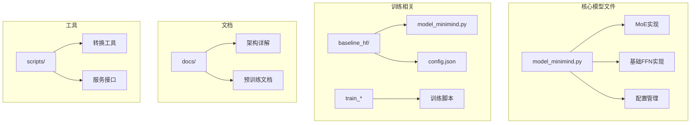
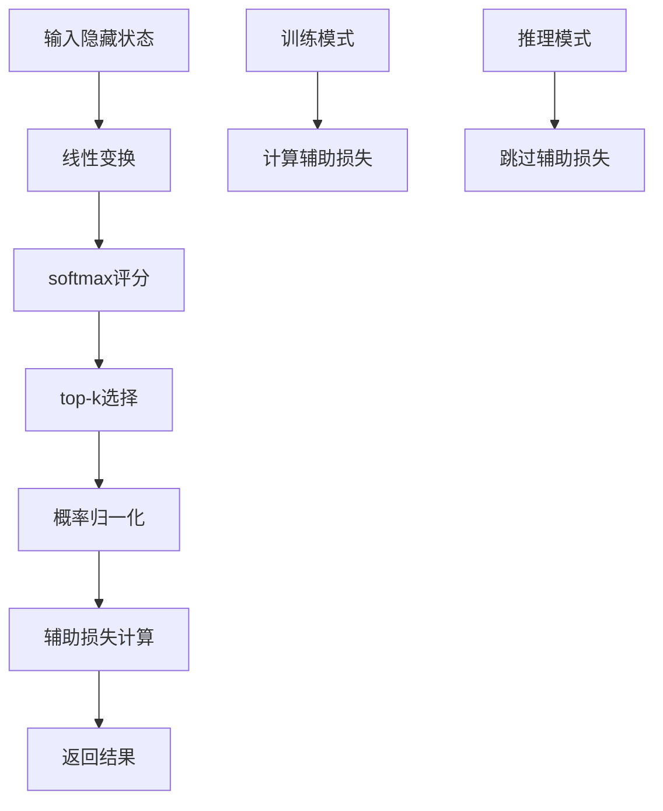
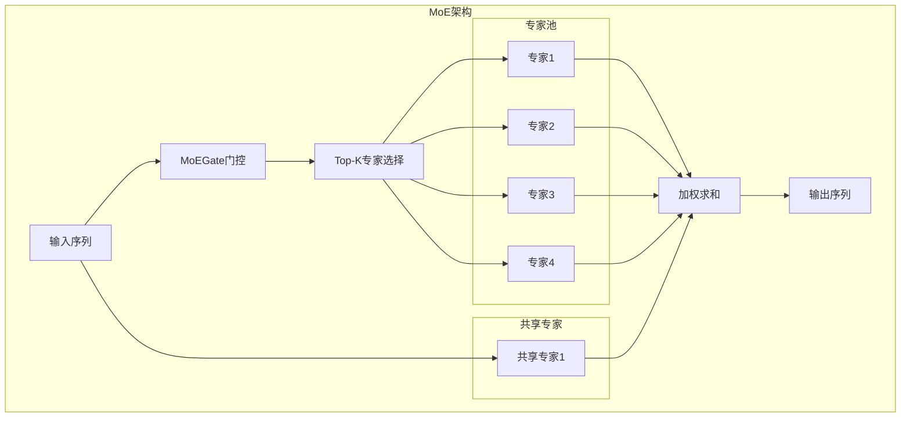
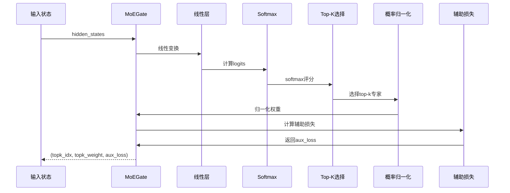
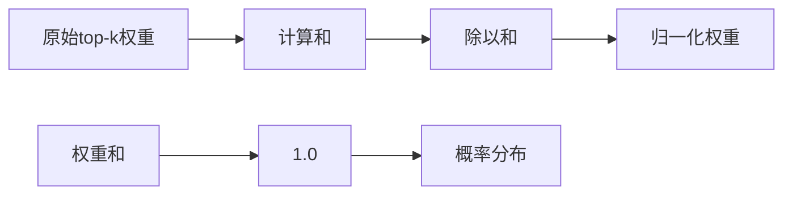
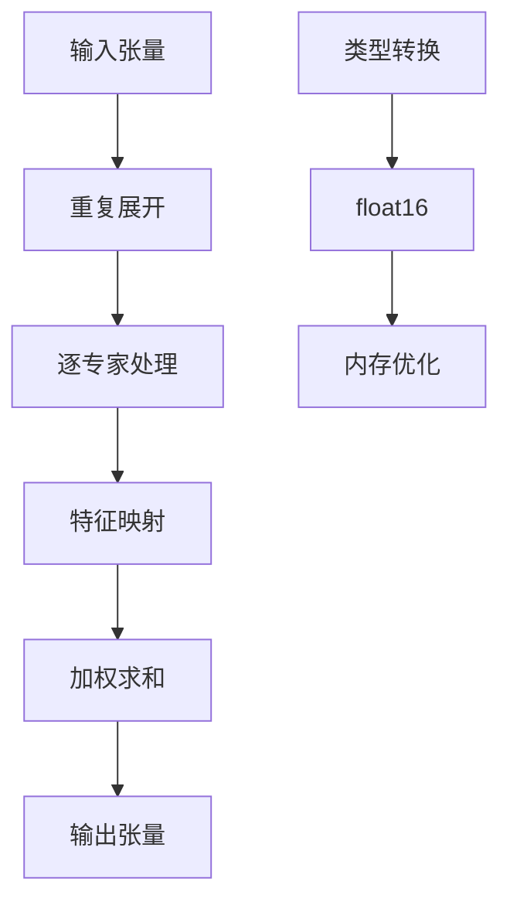
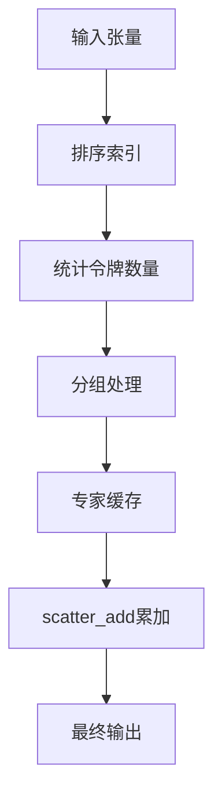
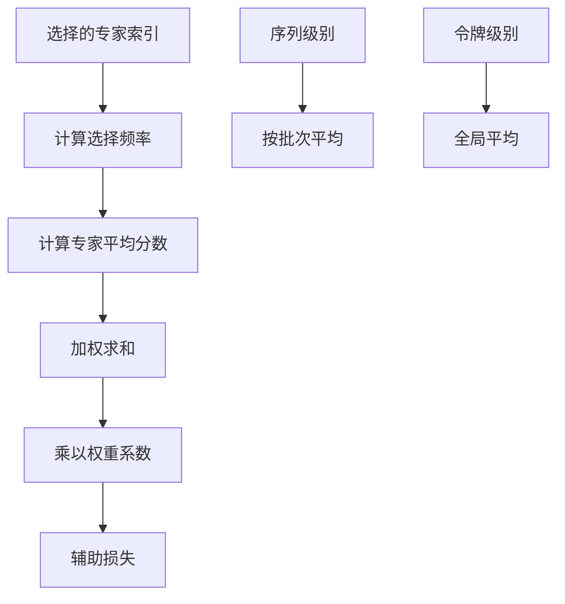
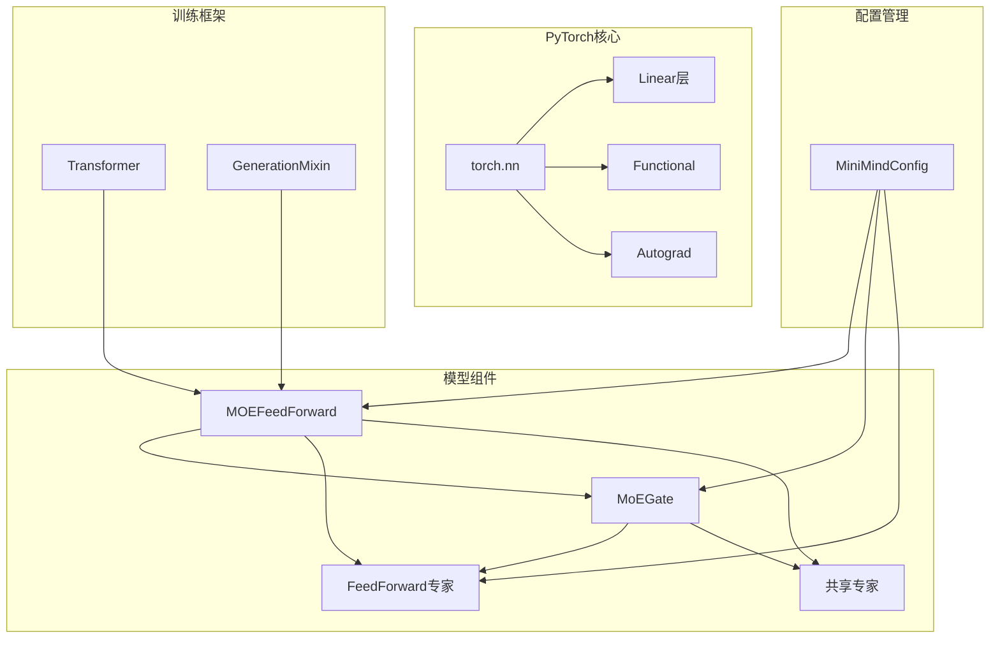

# 混合专家网络

<cite>
**本文档引用的文件**
- [model_minimind.py](file://model/model_minimind.py)
- [model_minimind.py](file://DST-train/model/baseline_hf/model_minimind.py)
- [config.json](file://DST-train/model/baseline_hf/config.json)
- [03_Phase3_模型架构详解.md](file://docs/03_Phase3_模型架构详解.md)
- [04_Phase4_预训练.md](file://docs/04_Phase4_预训练.md)
- [requirements.txt](file://requirements.txt)
</cite>

## 目录
1. [简介](#简介)
2. [项目结构](#项目结构)
3. [核心组件](#核心组件)
4. [架构概览](#架构概览)
5. [详细组件分析](#详细组件分析)
6. [依赖关系分析](#依赖关系分析)
7. [性能考虑](#性能考虑)
8. [故障排除指南](#故障排除指南)
9. [结论](#结论)
10. [附录](#附录)

## 简介

MiniMind项目实现了基于Transformer的混合专家（Mixture of Experts, MoE）网络架构。MoE通过门控机制为每个token选择部分专家进行处理，从而在保持模型表达能力的同时显著提升计算效率。本文档深入解析了MoE门控机制的实现原理，包括MoEGate的评分函数和top-k选择策略，详细说明了专家选择算法、训练和推理两个阶段的不同实现策略，以及辅助损失的计算方法。

## 项目结构

该项目采用模块化的架构设计，主要包含以下关键目录和文件：

**图表来源**
- [model_minimind.py:1-477](file://model/model_minimind.py#L1-L477)
- [model_minimind.py:1-477](file://DST-train/model/baseline_hf/model_minimind.py#L1-L477)

**章节来源**
- [model_minimind.py:1-78](file://model/model_minimind.py#L1-L78)
- [requirements.txt:1-31](file://requirements.txt#L1-L31)

## 核心组件

### MoE配置系统

MoE系统通过MiniMindConfig类统一管理所有相关参数：

| 参数名称 | 类型 | 默认值 | 描述 |
|---------|------|--------|------|
| use_moe | bool | False | 是否启用MoE模块 |
| num_experts_per_tok | int | 2 | 每个token选择的专家数量 |
| n_routed_experts | int | 4 | 可路由专家总数 |
| n_shared_experts | int | 1 | 共享专家数量 |
| scoring_func | str | 'softmax' | 评分函数类型 |
| aux_loss_alpha | float | 0.1 | 辅助损失权重系数 |
| seq_aux | bool | True | 是否按序列级别计算辅助损失 |
| norm_topk_prob | bool | True | 是否对top-k概率进行归一化 |

**章节来源**
- [model_minimind.py:32-77](file://model/model_minimind.py#L32-L77)
- [config.json:9-36](file://DST-train/model/baseline_hf/config.json#L9-L36)

### MoE门控网络

MoEGate是MoE系统的核心组件，负责计算每个token对各个专家的选择概率：

**图表来源**
- [model_minimind.py:245-298](file://model/model_minimind.py#L245-L298)

**章节来源**
- [model_minimind.py:245-298](file://model/model_minimind.py#L245-L298)

## 架构概览

MiniMind的MoE架构采用"门控-专家-共享专家"的三层结构：

**图表来源**
- [model_minimind.py:301-337](file://model/model_minimind.py#L301-L337)

**章节来源**
- [model_minimind.py:301-337](file://model/model_minimind.py#L301-L337)

## 详细组件分析

### MoEGate门控机制

MoEGate实现了完整的门控评分和选择功能：

#### 评分函数实现

门控网络使用线性变换结合softmax函数计算专家选择概率：

**图表来源**
- [model_minimind.py:264-298](file://model/model_minimind.py#L264-L298)

#### Top-K选择策略

MoE采用top-k选择策略，在保证计算效率的同时维持模型表达能力：

| 参数 | 值 | 说明 |
|------|----|-----|
| num_experts_per_tok | 2 | 每token选择2个专家 |
| n_routed_experts | 4 | 总共4个专家 |
| top_k概率归一化 | 启用 | 确保权重和为1 |

**章节来源**
- [model_minimind.py:249-277](file://model/model_minimind.py#L249-L277)

### 专家选择算法

#### softmax评分机制

门控网络使用softmax函数将专家评分转换为概率分布：

1. **线性评分**: `logits = hidden_states × W`
2. **概率转换**: `scores = softmax(logits)`
3. **权重计算**: `weights = scores[top_k]`

#### 概率归一化

为了确保top-k权重和为1，实施了概率归一化：

**图表来源**
- [model_minimind.py:275-277](file://model/model_minimind.py#L275-L277)

**章节来源**
- [model_minimind.py:275-277](file://model/model_minimind.py#L275-L277)

### 训练与推理实现策略

#### 训练阶段优化

训练时采用逐专家处理策略，确保梯度正确传播：

**图表来源**
- [model_minimind.py:324-330](file://model/model_minimind.py#L324-L330)

#### 推理阶段优化

推理时采用批量处理优化，提高计算效率：

**图表来源**
- [model_minimind.py:339-360](file://model/model_minimind.py#L339-L360)

**章节来源**
- [model_minimind.py:324-360](file://model/model_minimind.py#L324-L360)

### 辅助损失计算

MoE系统实现了负载均衡辅助损失，防止专家路由崩塌：

#### 负载均衡原理

辅助损失基于以下数学原理：
- **专家使用均衡性**: 确保各专家被均匀选择
- **负载均衡**: 防止某些专家过度使用

#### 计算公式

**图表来源**
- [model_minimind.py:279-297](file://model/model_minimind.py#L279-L297)

**章节来源**
- [model_minimind.py:279-297](file://model/model_minimind.py#L279-L297)

### 共享专家实现

共享专家是MoE架构的重要组成部分，始终参与计算：

#### 实现细节

共享专家具有以下特点：
- **固定参与**: 在MoE处理过程中始终计算
- **独立权重**: 与路由专家拥有独立的参数
- **加法融合**: 与MoE输出相加而非替换

#### 使用场景

共享专家适用于：
- **稳定性增强**: 提供稳定的基线表示
- **信息保留**: 保持重要的通用特征
- **梯度稳定**: 改善训练过程中的梯度流动

**章节来源**
- [model_minimind.py:310-314](file://model/model_minimind.py#L310-L314)
- [model_minimind.py:333-335](file://model/model_minimind.py#L333-L335)

## 依赖关系分析

### 核心依赖关系

**图表来源**
- [model_minimind.py:84-92](file://model/model_minimind.py#L84-L92)

**章节来源**
- [model_minimind.py:84-92](file://model/model_minimind.py#L84-L92)

### 外部依赖

项目依赖的关键库包括：
- **PyTorch 2.6.0**: 核心深度学习框架
- **Transformers 4.57.1**: HuggingFace模型库
- **Triton**: GPU内核优化（用于某些操作）

**章节来源**
- [requirements.txt:21-31](file://requirements.txt#L21-L31)

## 性能考虑

### 计算复杂度分析

MoE架构的计算复杂度与传统全连接FFN相比有显著改善：

| 组件 | 时间复杂度 | 空间复杂度 | 说明 |
|------|------------|------------|------|
| MoEGate | O(B×S×H×E) | O(B×S×E) | B:批大小, S:序列长度, H:隐藏维度, E:专家数量 |
| 专家计算 | O(B×S×H×I×K) | O(B×S×I) | I:中间维度, K:top-k专家数 |
| 共享专家 | O(B×S×H×I) | O(B×S×I) | 固定数量的专家 |

### 内存优化策略

1. **类型转换**: 训练时使用float16减少内存占用
2. **令牌分组**: 推理时按专家分组处理，避免重复计算
3. **缓存机制**: 使用expert_cache存储中间结果

### 性能调优建议

#### 参数调优

| 参数 | 调优方向 | 建议范围 | 影响 |
|------|----------|----------|------|
| num_experts_per_tok | 增加 | 2-4 | 提高表达能力但增加开销 |
| n_routed_experts | 增加 | 4-8 | 显著影响内存使用 |
| aux_loss_alpha | 减小 | 0.01-0.1 | 改善训练稳定性 |
| norm_topk_prob | 启用 | True | 确保概率分布正确 |

#### 训练优化

1. **混合精度**: 利用float16训练节省显存
2. **梯度累积**: 减少内存峰值需求
3. **辅助损失**: 适当调整alpha值平衡训练稳定性

## 故障排除指南

### 常见问题及解决方案

#### 专家路由崩塌

**症状**: 所有token都分配给同一个专家
**原因**: 辅助损失权重过小或训练不稳定
**解决方案**: 
- 增大aux_loss_alpha值
- 检查门控权重初始化
- 确保足够的训练轮数

#### 内存不足

**症状**: 训练过程中OOM错误
**原因**: 专家数量过多或序列长度过长
**解决方案**:
- 减少n_routed_experts
- 降低batch size
- 使用梯度检查点

#### 推理速度慢

**症状**: 推理时间过长
**原因**: 未启用优化的推理路径
**解决方案**:
- 确保使用推理模式
- 检查是否正确调用moe_infer
- 验证GPU支持情况

**章节来源**
- [model_minimind.py:339-360](file://model/model_minimind.py#L339-L360)

## 结论

MiniMind项目的MoE实现展现了现代大型语言模型的先进架构设计。通过精心设计的门控机制、优化的训练和推理策略，以及完善的辅助损失系统，该实现能够在保持模型性能的同时显著提升计算效率。

关键创新点包括：
1. **灵活的门控机制**: 支持多种评分函数和选择策略
2. **高效的推理优化**: 专门针对推理阶段的令牌分组处理
3. **稳定的训练框架**: 完善的辅助损失计算确保专家均衡使用
4. **模块化设计**: 清晰的组件分离便于维护和扩展

该实现为大规模语言模型的高效训练和部署提供了可靠的基础设施，为后续的模型扩展和优化奠定了坚实基础。

## 附录

### 配置示例

完整的MoE配置示例可在以下文件中找到：
- [config.json:9-36](file://DST-train/model/baseline_hf/config.json#L9-L36)

### 训练脚本

训练脚本展示了如何正确使用MoE模块：
- [train_epoch函数:99-147](file://docs/04_Phase4_预训练.md#L99-L147)

### 相关文档

- [模型架构详解:207-279](file://docs/03_Phase3_模型架构详解.md#L207-L279)
- [预训练流程:94-147](file://docs/04_Phase4_预训练.md#L94-L147)