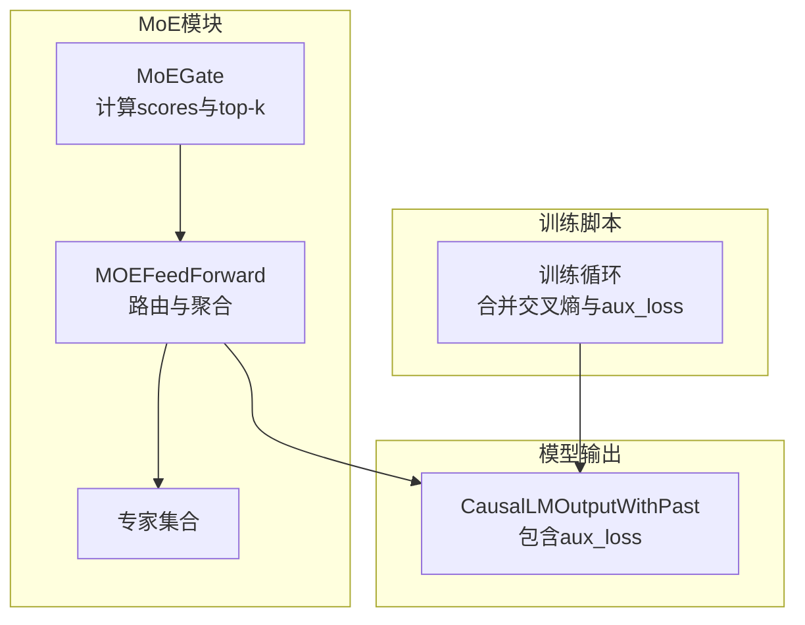
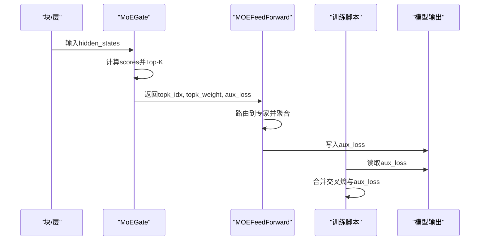
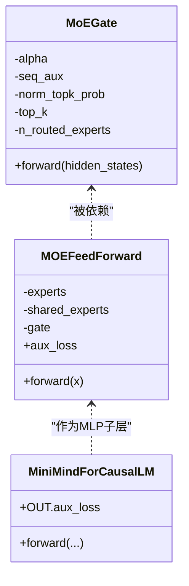
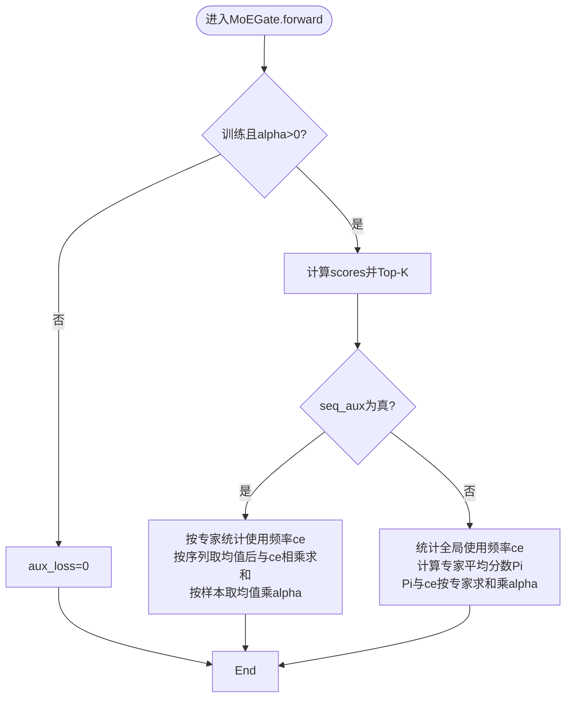
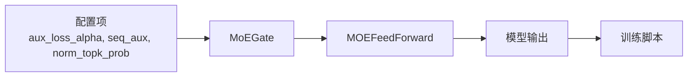

# 辅助损失计算

<cite>
**本文引用的文件列表**
- [model_minimind.py](file://model/model_minimind.py)
- [03_Phase3_模型架构详解.md](file://docs/03_Phase3_模型架构详解.md)
- [train_pretrain.py](file://trainer/train_pretrain.py)
- [train_full_sft.py](file://trainer/train_full_sft.py)
- [train_baseline.py](file://DST-train/train_baseline.py)
- [config.json](file://DST-train/model/baseline_hf/config.json)
- [model_minimind.py（HF基座）](file://DST-train/model/baseline_hf/model_minimind.py)
</cite>

## 目录
1. [简介](#简介)
2. [项目结构与定位](#项目结构与定位)
3. [核心组件与职责](#核心组件与职责)
4. [架构总览](#架构总览)
5. [详细组件分析](#详细组件分析)
6. [依赖关系分析](#依赖关系分析)
7. [性能与数值稳定性](#性能与数值稳定性)
8. [故障排查与调参指南](#故障排查与调参指南)
9. [结论](#结论)
10. [附录：计算示例与监控方法](#附录计算示例与监控方法)

## 简介
本文聚焦于MoE（Mixture of Experts）辅助损失的数学原理与工程实现，系统解析以下主题：
- 专家使用均衡性与负载均衡的计算公式与动机
- 序列级（seq_aux）与令牌级（非seq_aux）辅助损失的区别与适用场景
- 交叉熵分布（ce）与专家概率（Pi）的统计意义
- 辅助损失权重调节机制与alpha参数的作用
- 对模型训练的影响与调参建议
- 在不同配置下的计算示例与性能监控方法

## 项目结构与定位
- 辅助损失的核心实现在MoE门控模块中，位于MoEGate.forward中，随后在MOEFeedForward中汇总到模型输出的aux_loss字段。
- 训练脚本将res.aux_loss加到主损失上，形成最终的训练目标。
- 文档对MoE的数学公式与实现进行了说明，便于读者理解。

图表来源
- [model_minimind.py:245-298](file://model/model_minimind.py#L245-L298)
- [model_minimind.py:301-337](file://model/model_minimind.py#L301-L337)
- [train_pretrain.py:34-43](file://trainer/train_pretrain.py#L34-L43)

章节来源
- [model_minimind.py:245-298](file://model/model_minimind.py#L245-L298)
- [model_minimind.py:301-337](file://model/model_minimind.py#L301-L337)
- [train_pretrain.py:34-43](file://trainer/train_pretrain.py#L34-L43)

## 核心组件与职责
- MoEGate：负责计算每个token对各专家的分数（scores），进行Top-K选择，并在训练时计算辅助损失。
- MOEFeedForward：根据门控结果路由到专家，执行前馈变换并汇总aux_loss。
- 训练脚本：在计算交叉熵损失后，将aux_loss加入总损失，参与反向传播。

章节来源
- [model_minimind.py:245-298](file://model/model_minimind.py#L245-L298)
- [model_minimind.py:301-337](file://model/model_minimind.py#L301-L337)
- [train_pretrain.py:34-43](file://trainer/train_pretrain.py#L34-L43)

## 架构总览
MoE辅助损失的计算链路如下：
- 门控计算scores（softmax），Top-K选择专家并可选归一化权重
- 训练时按配置选择seq_aux或非seq_aux两种方式计算辅助损失
- 将aux_loss返回给模型输出，训练脚本将其加到主损失上

图表来源
- [model_minimind.py:245-298](file://model/model_minimind.py#L245-L298)
- [model_minimind.py:301-337](file://model/model_minimind.py#L301-L337)
- [train_pretrain.py:34-43](file://trainer/train_pretrain.py#L34-L43)

## 详细组件分析

### 数学原理与公式
- 目标：防止“路由崩塌”，确保专家使用均衡，提升负载均衡性
- 两种损失形式：
  - 序列级（seq_aux=True）：对每个专家，统计其在当前批次中被选择的频率（ce），并与该专家在序列上的平均分数相乘，再按专家求和并取均值得到每样本的损失，最后按样本取均值，乘以alpha权重
  - 非序列级（seq_aux=False）：对全局token统计专家使用频率（ce），计算专家平均分数（Pi），将两者按专家求和，乘以alpha权重

章节来源
- [model_minimind.py:279-298](file://model/model_minimind.py#L279-L298)
- [03_Phase3_模型架构详解.md:272-279](file://docs/03_Phase3_模型架构详解.md#L272-L279)

### 关键变量与符号
- scores：每个token对各专家的分数（softmax）
- topk_idx/topk_weight：Top-K专家索引与权重
- ce：专家使用频率（交叉熵分布）
- Pi：专家平均分数
- alpha：辅助损失权重（aux_loss_alpha）

章节来源
- [model_minimind.py:245-298](file://model/model_minimind.py#L245-L298)

### 代码级类图

图表来源
- [model_minimind.py:245-298](file://model/model_minimind.py#L245-L298)
- [model_minimind.py:301-337](file://model/model_minimind.py#L301-L337)
- [model_minimind.py:443-476](file://model/model_minimind.py#L443-L476)

### 流程图：seq_aux与非seq_aux差异

图表来源
- [model_minimind.py:279-298](file://model/model_minimind.py#L279-L298)

### 训练脚本中的损失融合
- 训练脚本中，先计算交叉熵损失，再将res.aux_loss加到总损失上，最后进行梯度累积与优化。

章节来源
- [train_pretrain.py:34-43](file://trainer/train_pretrain.py#L34-L43)
- [train_full_sft.py:37-42](file://trainer/train_full_sft.py#L37-L42)
- [train_baseline.py:42-51](file://DST-train/train_baseline.py#L42-L51)

## 依赖关系分析
- MoEGate依赖配置项：aux_loss_alpha、seq_aux、norm_topk_prob、num_experts_per_tok、n_routed_experts
- MOEFeedForward依赖MoEGate输出的aux_loss，并将其写入模型输出
- 训练脚本依赖模型输出的aux_loss字段

图表来源
- [model_minimind.py:8-77](file://model/model_minimind.py#L8-L77)
- [model_minimind.py:245-298](file://model/model_minimind.py#L245-L298)
- [model_minimind.py:301-337](file://model/model_minimind.py#L301-L337)
- [train_pretrain.py:34-43](file://trainer/train_pretrain.py#L34-L43)

章节来源
- [model_minimind.py:8-77](file://model/model_minimind.py#L8-L77)
- [model_minimind.py:245-298](file://model/model_minimind.py#L245-L298)
- [model_minimind.py:301-337](file://model/model_minimind.py#L301-L337)
- [train_pretrain.py:34-43](file://trainer/train_pretrain.py#L34-L43)

## 性能与数值稳定性
- Top-K概率归一化：当top_k>1时，会对Top-K权重进行归一化，避免权重过大导致数值不稳定
- 除零保护：在归一化与计算频率时使用极小常数，避免除零
- 混合精度：训练脚本支持bfloat16/float16混合精度，有助于提升吞吐与显存效率
- 梯度裁剪：训练脚本对梯度进行裁剪，有助于稳定训练

章节来源
- [model_minimind.py:275-277](file://model/model_minimind.py#L275-L277)
- [train_pretrain.py:48-49](file://trainer/train_pretrain.py#L48-L49)

## 故障排查与调参指南
- 现象：训练不稳定、aux_loss异常大或NaN
  - 排查要点：确认alpha设置合理；检查Top-K归一化是否开启；确认混合精度与梯度裁剪配置
- 现象：专家使用极度不均衡
  - 排查要点：检查seq_aux开关；增大alpha；核对n_routed_experts与num_experts_per_tok配置
- 现象：训练收敛慢或发散
  - 排查要点：逐步降低alpha至0验证是否仍发散；检查学习率与warmup策略；确认数据质量与loss_mask正确

章节来源
- [model_minimind.py:275-277](file://model/model_minimind.py#L275-L277)
- [train_pretrain.py:48-49](file://trainer/train_pretrain.py#L48-L49)

## 结论
- 辅助损失通过约束专家使用频率与平均分数的乘积，有效缓解MoE路由崩塌问题
- seq_aux与非seq_aux分别从序列粒度与全局粒度控制均衡性，应结合任务与资源选择
- alpha是关键的权重调节参数，需结合任务规模与专家数量进行调优
- 训练脚本将aux_loss直接融入主损失，确保训练一致性

## 附录：计算示例与监控方法

### 示例：seq_aux=True（序列级）
- 步骤
  - 对每个样本，统计专家被选择的频率（ce），并按专家求和
  - 计算每个专家在该样本序列上的平均分数（scores_for_seq_aux.mean(dim=1)）
  - 将二者相乘并按专家求和，再按样本取均值
  - 乘以alpha得到该样本的aux_loss
- 适用场景
  - 需要关注序列内部专家使用的均衡性，如长序列、多标签分类等

章节来源
- [model_minimind.py:283-289](file://model/model_minimind.py#L283-L289)

### 示例：seq_aux=False（令牌级）
- 步骤
  - 统计全局token的专家使用频率（ce）
  - 计算专家平均分数（Pi）
  - 将Pi与ce按专家求和，乘以alpha
- 适用场景
  - 更关注全局专家使用均衡，适合大规模训练与快速收敛

章节来源
- [model_minimind.py:290-295](file://model/model_minimind.py#L290-L295)

### 监控方法
- 训练日志：记录loss与aux_loss，观察两者的比例变化
- 可视化：使用wandb/swanlab记录aux_loss曲线，识别异常波动
- 指标：可额外统计专家使用频率的标准差或最大最小比值，评估均衡性

章节来源
- [train_pretrain.py:57-65](file://trainer/train_pretrain.py#L57-L65)
- [train_full_sft.py:57-68](file://trainer/train_full_sft.py#L57-L68)
- [train_baseline.py:64-70](file://DST-train/train_baseline.py#L64-L70)