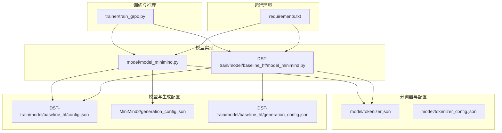
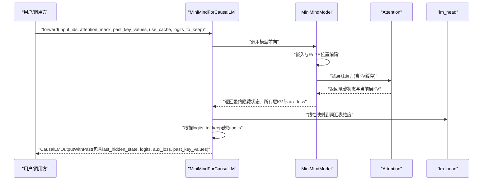
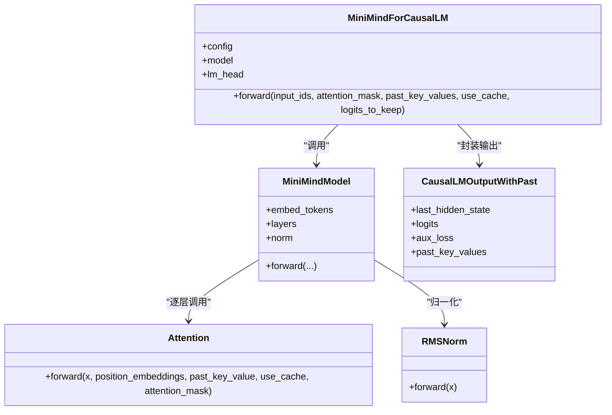
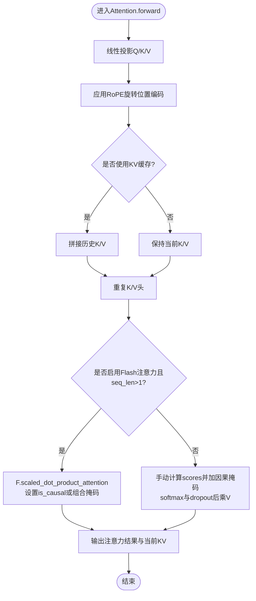
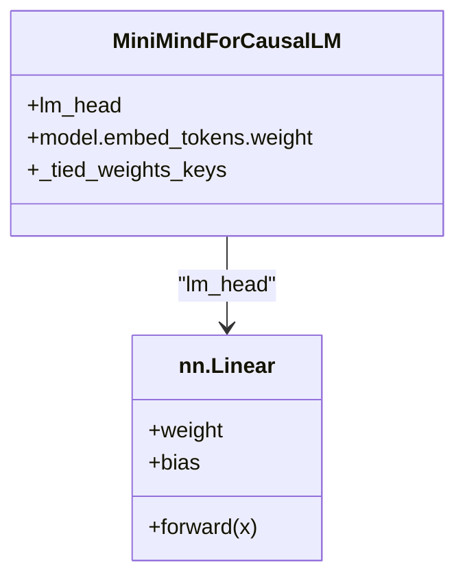
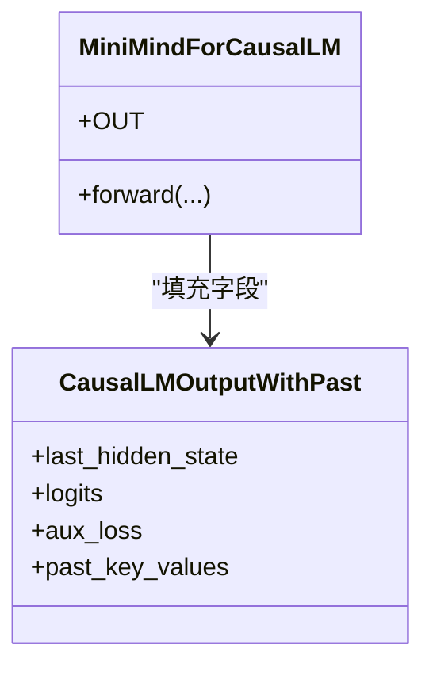
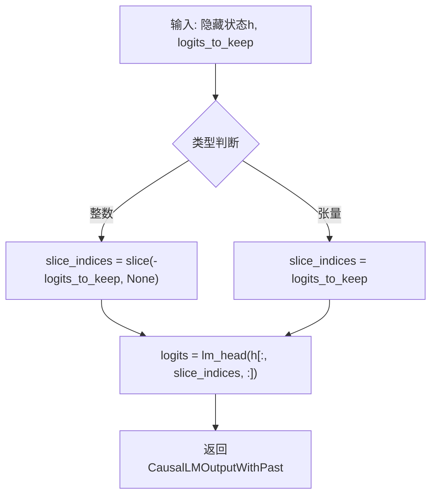
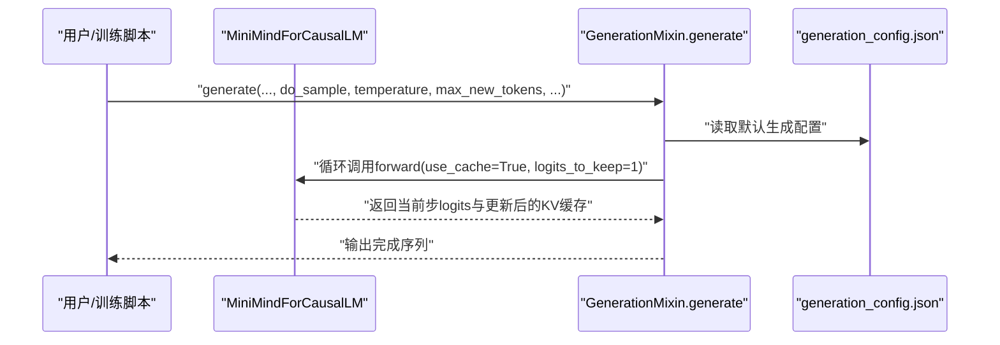
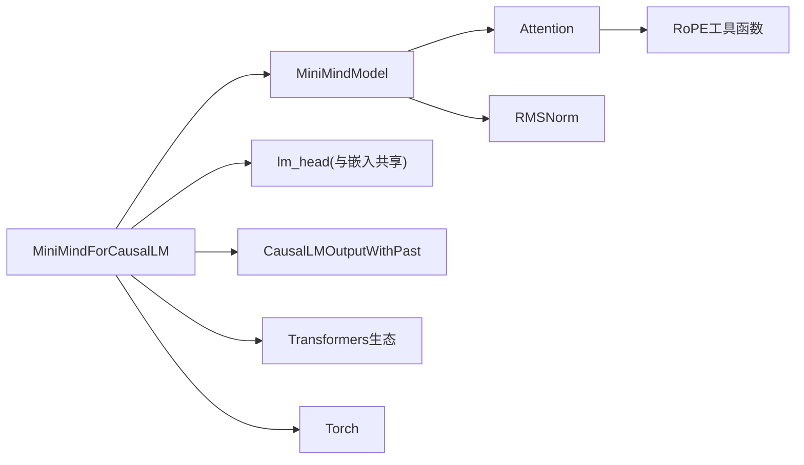

# 语言模型头部

<cite>
**本文引用的文件**   
- [model_minimind.py](file://model/model_minimind.py)
- [model_minimind.py（基线HF版本）](file://DST-train/model/baseline_hf/model_minimind.py)
- [tokenizer.json](file://model/tokenizer.json)
- [tokenizer_config.json](file://model/tokenizer_config.json)
- [config.json（基线HF）](file://DST-train/model/baseline_hf/config.json)
- [generation_config.json（MiniMind2）](file://MiniMind2/generation_config.json)
- [generation_config.json（基线HF）](file://DST-train/model/baseline_hf/generation_config.json)
- [train_grpo.py](file://trainer/train_grpo.py)
- [requirements.txt](file://requirements.txt)
</cite>

## 目录
1. [引言](#引言)
2. [项目结构](#项目结构)
3. [核心组件](#核心组件)
4. [架构总览](#架构总览)
5. [详细组件分析](#详细组件分析)
6. [依赖分析](#依赖分析)
7. [性能考虑](#性能考虑)
8. [故障排查指南](#故障排查指南)
9. [结论](#结论)
10. [附录](#附录)

## 引言
本文件聚焦于MiniMindForCausalLM语言模型头部的技术细节，系统解析以下主题：
- 单向注意力掩码与自回归生成机制
- 线性输出层（lm_head）的实现、权重共享策略与词汇表映射
- CausalLMOutputWithPast输出格式的设计思路与字段组织
- logits截取机制（logits_to_keep）的实现与应用场景
- 生成接口设计（含采样策略与温度调节）
- 性能优化技巧与内存管理策略

## 项目结构
本仓库包含多套模型实现与配套资源。与语言模型头部直接相关的关键文件如下：
- 模型实现：model/model_minimind.py、DST-train/model/baseline_hf/model_minimind.py
- 分词器与配置：model/tokenizer.json、model/tokenizer_config.json
- 模型配置与生成配置：DST-train/model/baseline_hf/config.json、MiniMind2/generation_config.json、DST-train/model/baseline_hf/generation_config.json
- 训练脚本示例：trainer/train_grpo.py
- 运行环境依赖：requirements.txt

**图表来源**
- [model_minimind.py:443-476](file://model/model_minimind.py#L443-L476)
- [model_minimind.py（基线HF版本）:443-476](file://DST-train/model/baseline_hf/model_minimind.py#L443-L476)
- [tokenizer.json:1-800](file://model/tokenizer.json#L1-L800)
- [tokenizer_config.json:1-43](file://model/tokenizer_config.json#L1-L43)
- [config.json（基线HF）:1-37](file://DST-train/model/baseline_hf/config.json#L1-L37)
- [generation_config.json（MiniMind2）:1-10](file://MiniMind2/generation_config.json#L1-L10)
- [generation_config.json（基线HF）:1-9](file://DST-train/model/baseline_hf/generation_config.json#L1-L9)
- [train_grpo.py:112-154](file://trainer/train_grpo.py#L112-L154)
- [requirements.txt:1-31](file://requirements.txt#L1-L31)

**章节来源**
- [model_minimind.py:443-476](file://model/model_minimind.py#L443-L476)
- [model_minimind.py（基线HF版本）:443-476](file://DST-train/model/baseline_hf/model_minimind.py#L443-L476)
- [tokenizer.json:1-800](file://model/tokenizer.json#L1-L800)
- [tokenizer_config.json:1-43](file://model/tokenizer_config.json#L1-L43)
- [config.json（基线HF）:1-37](file://DST-train/model/baseline_hf/config.json#L1-L37)
- [generation_config.json（MiniMind2）:1-10](file://MiniMind2/generation_config.json#L1-L10)
- [generation_config.json（基线HF）:1-9](file://DST-train/model/baseline_hf/generation_config.json#L1-L9)
- [train_grpo.py:112-154](file://trainer/train_grpo.py#L112-L154)
- [requirements.txt:1-31](file://requirements.txt#L1-L31)

## 核心组件
- MiniMindForCausalLM：继承自PreTrainedModel与GenerationMixin，负责前向传播、权重共享与输出封装。
- MiniMindModel：编码器主体，包含嵌入层、多层Transformer块、RMSNorm与RoPE位置编码。
- Attention：支持Flash Attention与因果掩码，支持KV缓存以加速自回归生成。
- lm_head：线性输出层，与嵌入权重共享，实现从隐藏状态到词汇表的映射。

关键实现要点：
- 权重共享：lm_head与嵌入层共享权重，通过配置键“lm_head.weight”与“model.embed_tokens.weight”关联。
- 输出封装：返回CausalLMOutputWithPast，包含last_hidden_state、logits、aux_loss与past_key_values。
- logits截取：通过logits_to_keep参数控制仅保留最后若干步的logits，减少存储与计算开销。

**章节来源**
- [model_minimind.py:443-476](file://model/model_minimind.py#L443-L476)
- [model_minimind.py（基线HF版本）:443-476](file://DST-train/model/baseline_hf/model_minimind.py#L443-L476)

## 架构总览
下图展示MiniMindForCausalLM的端到端调用链路，包括输入、注意力掩码、KV缓存、线性输出与输出封装。

**图表来源**
- [model_minimind.py:456-476](file://model/model_minimind.py#L456-L476)
- [model_minimind.py:387-440](file://model/model_minimind.py#L387-L440)
- [model_minimind.py:150-226](file://model/model_minimind.py#L150-L226)
- [model_minimind.py:443-454](file://model/model_minimind.py#L443-L454)

**章节来源**
- [model_minimind.py:456-476](file://model/model_minimind.py#L456-L476)
- [model_minimind.py:387-440](file://model/model_minimind.py#L387-L440)
- [model_minimind.py:150-226](file://model/model_minimind.py#L150-L226)
- [model_minimind.py:443-454](file://model/model_minimind.py#L443-L454)

## 详细组件分析

### 组件A：MiniMindForCausalLM（语言模型头部）
- 职责
  - 前向传播：调用MiniMindModel获取隐藏状态、各层KV与辅助损失
  - 权重共享：lm_head与嵌入权重共享，减少参数量并提升一致性
  - 输出封装：构造CausalLMOutputWithPast，统一下游任务与推理接口
  - logits截取：通过logits_to_keep仅保留最近步的logits，降低内存占用
- 关键点
  - 权重共享键：_tied_weights_keys中定义“lm_head.weight”与“model.embed_tokens.weight”的对应关系
  - 输出字段：last_hidden_state、logits、aux_loss、past_key_values
  - 截取逻辑：当logits_to_keep为整数时，按切片“slice(-logits_to_keep, None)”；也可传入布尔张量进行灵活索引

**图表来源**
- [model_minimind.py:443-476](file://model/model_minimind.py#L443-L476)
- [model_minimind.py:387-440](file://model/model_minimind.py#L387-L440)
- [model_minimind.py:150-226](file://model/model_minimind.py#L150-L226)
- [model_minimind.py:95-106](file://model/model_minimind.py#L95-L106)

**章节来源**
- [model_minimind.py:443-476](file://model/model_minimind.py#L443-L476)

### 组件B：Attention（单向注意力与KV缓存）
- 职责
  - 实现多头注意力，支持重复K/V头（用于Key-Value heads少于Query heads的情况）
  - 应用RoPE旋转位置编码
  - 支持Flash Attention与传统注意力两种路径
  - 构建KV缓存以支持自回归生成
- 关键点
  - 因果掩码：在非Flash路径中显式加置上三角负无穷掩码；在Flash路径中通过is_causal或自定义掩码组合实现
  - KV缓存：past_key_value拼接历史K/V，use_cache为True时返回当前层KV
  - 注意力掩码扩展：当存在attention_mask时，将其扩展为四维并参与掩码加法

**图表来源**
- [model_minimind.py:150-226](file://model/model_minimind.py#L150-L226)

**章节来源**
- [model_minimind.py:150-226](file://model/model_minimind.py#L150-L226)

### 组件C：线性输出层（lm_head）与权重共享
- 职责
  - 将最后一层隐藏状态映射到词汇表维度
  - 与嵌入层共享权重，避免重复参数并提升语义一致性
- 关键点
  - 权重共享：通过_config._tied_weights_keys指定“lm_head.weight”与“model.embed_tokens.weight”的共享关系
  - 词汇表映射：logits形状为[batch, seq, vocab_size]，可直接用于交叉熵损失或采样

**图表来源**
- [model_minimind.py:443-454](file://model/model_minimind.py#L443-L454)

**章节来源**
- [model_minimind.py:443-454](file://model/model_minimind.py#L443-L454)

### 组件D：CausalLMOutputWithPast输出格式
- 设计思路
  - 统一下游任务与推理接口，便于与Transformers生态集成
  - 字段覆盖：last_hidden_state（完整序列的隐藏状态）、logits（词汇表分布）、aux_loss（MoE辅助损失）、past_key_values（各层KV缓存）
- 字段组织
  - last_hidden_state：[batch, seq, hidden]
  - logits：[batch, seq或截取后的seq, vocab]
  - aux_loss：标量或0（非MoE时）
  - past_key_values：列表，每项为(K,V)张量，形状随层数与缓存增长

**图表来源**
- [model_minimind.py:452-453](file://model/model_minimind.py#L452-L453)
- [model_minimind.py:472-475](file://model/model_minimind.py#L472-L475)

**章节来源**
- [model_minimind.py:452-453](file://model/model_minimind.py#L452-L453)
- [model_minimind.py:472-475](file://model/model_minimind.py#L472-L475)

### 组件E：logits截取机制（logits_to_keep）
- 实现
  - 若logits_to_keep为整数：采用切片“slice(-logits_to_keep, None)”仅保留最后n步
  - 若为张量：直接作为索引使用，实现更灵活的选择
- 应用场景
  - 训练阶段：仅对新增token计算损失，减少计算与显存压力
  - 推理阶段：仅保留最新一步logits，配合KV缓存实现高效增量生成
- 在训练中的使用示例
  - 训练脚本中通过“logits_to_keep=n_keep+1”获取新增token的logits，并结合“[:, :-1, :]”对齐标签

**图表来源**
- [model_minimind.py:460-471](file://model/model_minimind.py#L460-L471)
- [train_grpo.py:112-120](file://trainer/train_grpo.py#L112-L120)

**章节来源**
- [model_minimind.py:460-471](file://model/model_minimind.py#L460-L471)
- [train_grpo.py:112-120](file://trainer/train_grpo.py#L112-L120)

### 组件F：生成接口设计（采样策略与温度调节）
- 设计依据
  - 继承GenerationMixin，复用Transformers的generate方法族
  - 通过generation_config.json控制默认行为（如是否使用KV缓存）
- 采样与温度
  - 采样策略：可选贪心、核采样、Top-k、Top-p等（由调用侧传入）
  - 温度调节：通过temperature参数控制分布平滑程度
  - 示例：训练脚本中使用do_sample=True与temperature=0.8进行多样化生成
- 关键配置
  - generation_config.json中可设置use_cache、eos_token_id、bos_token_id等

**图表来源**
- [model_minimind.py:443-476](file://model/model_minimind.py#L443-L476)
- [generation_config.json（MiniMind2）:1-10](file://MiniMind2/generation_config.json#L1-L10)
- [generation_config.json（基线HF）:1-9](file://DST-train/model/baseline_hf/generation_config.json#L1-L9)
- [train_grpo.py:140-146](file://trainer/train_grpo.py#L140-L146)

**章节来源**
- [model_minimind.py:443-476](file://model/model_minimind.py#L443-L476)
- [generation_config.json（MiniMind2）:1-10](file://MiniMind2/generation_config.json#L1-L10)
- [generation_config.json（基线HF）:1-9](file://DST-train/model/baseline_hf/generation_config.json#L1-L9)
- [train_grpo.py:140-146](file://trainer/train_grpo.py#L140-L146)

## 依赖分析
- 模块耦合
  - MiniMindForCausalLM依赖MiniMindModel与lm_head，后者与嵌入权重共享
  - MiniMindModel内部依赖Attention与RMSNorm，Attention依赖RoPE工具函数
- 外部依赖
  - Transformers生态：PreTrainedModel、GenerationMixin、CausalLMOutputWithPast
  - Torch：线性层、Dropout、Softmax、张量操作
  - 可选：Flash Attention（PyTorch 2.0+的scaled_dot_product_attention）

**图表来源**
- [model_minimind.py:443-476](file://model/model_minimind.py#L443-L476)
- [model_minimind.py:150-226](file://model/model_minimind.py#L150-L226)
- [model_minimind.py:95-106](file://model/model_minimind.py#L95-L106)

**章节来源**
- [model_minimind.py:443-476](file://model/model_minimind.py#L443-L476)
- [model_minimind.py:150-226](file://model/model_minimind.py#L150-L226)
- [model_minimind.py:95-106](file://model/model_minimind.py#L95-L106)

## 性能考虑
- Flash Attention
  - 在满足条件（seq_len>1且启用）时，使用F.scaled_dot_product_attention加速注意力计算
  - 通过is_causal或组合掩码实现因果约束，避免显式上三角填充
- KV缓存
  - 逐层维护K/V缓存，仅在use_cache=True时返回，显著降低推理时延与显存占用
- logits截取
  - 通过logits_to_keep仅保留必要步数的logits，减少中间变量与后续计算
- 内存管理
  - 训练脚本中在反向传播后调用torch.cuda.empty_cache()释放缓存，缓解显存碎片
- 激活与中间尺寸
  - FFN中间维度按64对齐，有助于硬件优化与内存对齐

**章节来源**
- [model_minimind.py:166-207](file://model/model_minimind.py#L166-L207)
- [model_minimind.py:186-190](file://model/model_minimind.py#L186-L190)
- [model_minimind.py:460-471](file://model/model_minimind.py#L460-L471)
- [train_grpo.py:152-152](file://trainer/train_grpo.py#L152-L152)

## 故障排查指南
- 未设置use_cache导致生成缓慢
  - 现象：每次生成都重新计算全部历史K/V
  - 解决：确保调用generate时use_cache为True，或在forward中正确传递use_cache
- logits截取错误导致维度不匹配
  - 现象：logits与标签维度不一致
  - 解决：确认logits_to_keep与实际截取逻辑一致；参考训练脚本中“[:, :-1, :]”对齐方式
- 权重未共享导致梯度不一致
  - 现象：lm_head与嵌入权重不一致，影响一致性与显存
  - 解决：检查_config._tied_weights_keys配置，确保权重共享生效
- 分词器特殊token与EOS/BOS
  - 现象：生成结果包含多余特殊token或未终止
  - 解决：核对tokenizer_config.json中的eos_token、bos_token与generation_config.json中的eos_token_id、bos_token_id

**章节来源**
- [model_minimind.py:443-454](file://model/model_minimind.py#L443-L454)
- [model_minimind.py:460-471](file://model/model_minimind.py#L460-L471)
- [tokenizer_config.json:1-43](file://model/tokenizer_config.json#L1-L43)
- [generation_config.json（MiniMind2）:1-10](file://MiniMind2/generation_config.json#L1-L10)

## 结论
MiniMindForCausalLM通过清晰的模块划分与权重共享策略，实现了高效的因果语言模型头部。其核心优势包括：
- 明确的单向注意力掩码与KV缓存，支撑稳定高效的自回归生成
- 线性输出层与嵌入权重共享，降低参数规模并提升语义一致性
- CausalLMOutputWithPast统一输出格式，便于与Transformers生态集成
- logits截取机制与Flash Attention、KV缓存共同优化了训练与推理性能

## 附录
- 词汇表与分词器
  - 词汇表大小由配置vocab_size决定，分词器配置位于tokenizer_config.json与tokenizer.json
- 模型配置与生成配置
  - 模型配置config.json（基线HF）与generation_config.json（MiniMind2/基线HF）分别定义模型超参与生成默认行为
- 运行环境
  - requirements.txt列出依赖版本，建议使用与代码兼容的Transformers与Torch版本

**章节来源**
- [tokenizer.json:1-800](file://model/tokenizer.json#L1-L800)
- [tokenizer_config.json:1-43](file://model/tokenizer_config.json#L1-L43)
- [config.json（基线HF）:1-37](file://DST-train/model/baseline_hf/config.json#L1-L37)
- [generation_config.json（MiniMind2）:1-10](file://MiniMind2/generation_config.json#L1-L10)
- [generation_config.json（基线HF）:1-9](file://DST-train/model/baseline_hf/generation_config.json#L1-L9)
- [requirements.txt:1-31](file://requirements.txt#L1-L31)