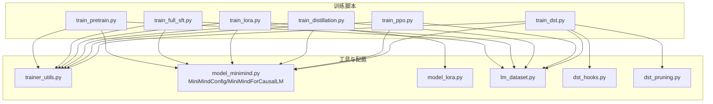
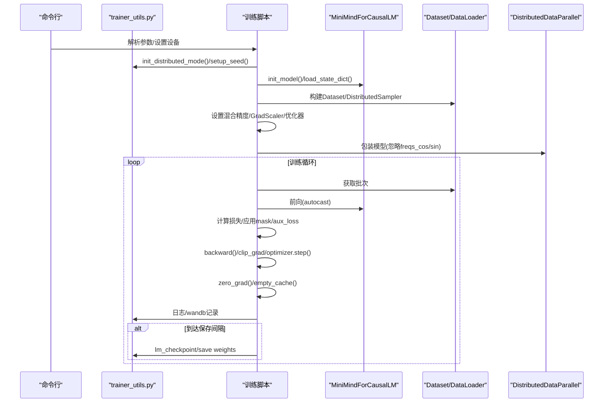
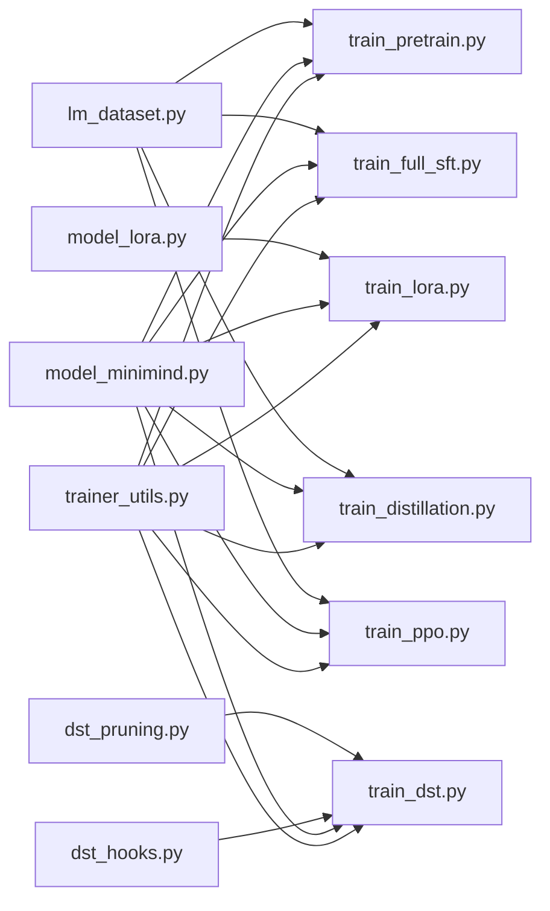

# 训练工具模块

<cite>
**本文档引用的文件**
- [trainer_utils.py](file://trainer/trainer_utils.py)
- [train_pretrain.py](file://trainer/train_pretrain.py)
- [train_full_sft.py](file://trainer/train_full_sft.py)
- [train_lora.py](file://trainer/train_lora.py)
- [train_distillation.py](file://trainer/train_distillation.py)
- [train_ppo.py](file://trainer/train_ppo.py)
- [model_minimind.py](file://model/model_minimind.py)
- [model_lora.py](file://model/model_lora.py)
- [lm_dataset.py](file://dataset/lm_dataset.py)
- [dst_hooks.py](file://DST-train/dst_hooks.py)
- [dst_pruning.py](file://DST-train/dst_pruning.py)
- [train_dst.py](file://DST-train/train_dst.py)
- [requirements.txt](file://requirements.txt)
</cite>

## 目录
1. [简介](#简介)
2. [项目结构](#项目结构)
3. [核心组件](#核心组件)
4. [架构总览](#架构总览)
5. [详细组件分析](#详细组件分析)
6. [依赖关系分析](#依赖关系分析)
7. [性能考量](#性能考量)
8. [故障排除指南](#故障排除指南)
9. [结论](#结论)
10. [附录](#附录)

## 简介
本文件系统性梳理 MiniMind 训练工具模块，覆盖分布式训练（数据并行）、混合精度训练（bfloat16/float16）、梯度累积、学习率调度（余弦退火）、断点续训（检查点保存/恢复/进度跟踪）、LoRA 参数高效微调、知识蒸馏、以及 DST 动态稀疏训练（RigL + 剪枝 + 蒸馏 + 假死神经元唤醒）。文档以代码级分析为基础，辅以图示与实操建议，帮助读者快速掌握分布式与高效训练的关键技术。

## 项目结构
训练工具模块主要位于 trainer 目录，配合 model、dataset、DST-train 等子模块协同工作。核心训练脚本围绕“初始化环境/模型/数据 → 设置混合精度/优化器 → 分布式封装 → 训练循环（含学习率/梯度累积/裁剪/日志/保存）”展开；断点续训通过 lm_checkpoint 统一管理模型、优化器、GradScaler、epoch/step、wandb/run 等状态。

图表来源
- [train_pretrain.py:1-162](file://trainer/train_pretrain.py#L1-L162)
- [train_full_sft.py:1-163](file://trainer/train_full_sft.py#L1-L163)
- [train_lora.py:1-177](file://trainer/train_lora.py#L1-L177)
- [train_distillation.py:1-224](file://trainer/train_distillation.py#L1-L224)
- [train_ppo.py:1-362](file://trainer/train_ppo.py#L1-L362)
- [train_dst.py:1-472](file://DST-train/train_dst.py#L1-L472)
- [trainer_utils.py:1-139](file://trainer/trainer_utils.py#L1-L139)
- [model_minimind.py:1-474](file://model/model_minimind.py#L1-L474)
- [model_lora.py:1-50](file://model/model_lora.py#L1-L50)
- [lm_dataset.py:1-250](file://dataset/lm_dataset.py#L1-L250)
- [dst_hooks.py:1-263](file://DST-train/dst_hooks.py#L1-L263)
- [dst_pruning.py:1-291](file://DST-train/dst_pruning.py#L1-L291)

章节来源
- [train_pretrain.py:1-162](file://trainer/train_pretrain.py#L1-L162)
- [trainer_utils.py:1-139](file://trainer/trainer_utils.py#L1-L139)

## 核心组件
- 分布式训练支持（数据并行）
  - 通过 torch.distributed.init_process_group 与 DistributedDataParallel 包装模型，结合 DistributedSampler 实现跨 GPU 的数据并行。
  - 通过 _ddp_params_and_buffers_to_ignore 忽略 RoPE 频率缓存等参数的同步，减少通信开销。
- 混合精度训练
  - bfloat16/float16 两种精度；CPU 上使用 nullcontext；CUDA 上使用 torch.cuda.amp.autocast。
  - float16 场景使用 GradScaler 动态缩放；bfloat16 场景直接前向，无需 GradScaler。
- 梯度累积与梯度裁剪
  - 通过 accumulation_steps 模拟更大 batch size；每 accumulation_steps 步执行优化器更新与 zero_grad。
  - clip_grad_norm_ 防止梯度爆炸。
- 学习率调度
  - 采用余弦退火调度（cosine annealing）；部分脚本使用 CosineAnnealingLR。
- 断点续训
  - 统一 lm_checkpoint 保存模型、优化器、GradScaler、epoch/step、world_size、wandb run id 等；加载时自动转换 step 以适配 GPU 数量变化。
- 数据加载与采样
  - DataLoader + DistributedSampler；SkipBatchSampler 支持跳过已训练 batch，实现精准续训。
- LoRA 参数高效微调
  - 在线添加低秩旁路，冻结基础权重，仅优化 LoRA 参数，显著降低显存与训练成本。
- 知识蒸馏
  - KL 散度蒸馏损失，支持 CE + α·KL 的组合损失。
- DST 动态稀疏训练
  - RigL 动态稀疏训练（周期性剪枝-生长），Magnitude Pruning 固定剪枝，MBE 监控与假死神经元唤醒。

章节来源
- [trainer_utils.py:28-98](file://trainer/trainer_utils.py#L28-L98)
- [train_pretrain.py:116-135](file://trainer/train_pretrain.py#L116-L135)
- [train_full_sft.py:117-136](file://trainer/train_full_sft.py#L117-L136)
- [train_lora.py:137-150](file://trainer/train_lora.py#L137-L150)
- [train_distillation.py:38-89](file://trainer/train_distillation.py#L38-L89)
- [train_ppo.py:119-235](file://trainer/train_ppo.py#L119-L235)
- [train_dst.py:74-138](file://DST-train/train_dst.py#L74-L138)
- [dst_hooks.py:10-160](file://DST-train/dst_hooks.py#L10-L160)
- [dst_pruning.py:9-118](file://DST-train/dst_pruning.py#L9-L118)

## 架构总览
训练流水线统一遵循以下步骤：初始化 → 模型/数据/优化器/混合精度 → DDP 包装 → 训练循环（前向/损失/反向/优化/日志/保存）→ 断点续训。DST 流程额外包含 RigL、剪枝、蒸馏与神经元唤醒。

图表来源
- [trainer_utils.py:15-98](file://trainer/trainer_utils.py#L15-L98)
- [train_pretrain.py:106-162](file://trainer/train_pretrain.py#L106-L162)
- [train_full_sft.py:107-163](file://trainer/train_full_sft.py#L107-L163)
- [train_lora.py:102-177](file://trainer/train_lora.py#L102-L177)
- [train_distillation.py:132-224](file://trainer/train_distillation.py#L132-L224)
- [train_ppo.py:237-362](file://trainer/train_ppo.py#L237-L362)

## 详细组件分析

### 分布式训练（数据并行）
- 初始化与封装
  - init_distributed_mode：检测 LOCAL_RANK，初始化 NCCL，设置 CUDA 设备。
  - DistributedDataParallel 包装模型，并将 RoPE 频率缓存加入忽略同步列表。
  - DistributedSampler：每 epoch set_epoch，保证分布式采样的随机性。
- 进度跟踪与续训
  - SkipBatchSampler：跳过已训练的前 N 个 batch，确保从断点继续。
- 代码片段路径
  - [分布式初始化与封装:28-35](file://trainer/trainer_utils.py#L28-L35)
  - [DDP 包装与忽略参数:146-149](file://trainer/train_pretrain.py#L146-L149)
  - [分布式采样器与 epoch 设置:133-134](file://trainer/train_full_sft.py#L133-L134)
  - [SkipBatchSampler:114-138](file://trainer/trainer_utils.py#L114-L138)

章节来源
- [trainer_utils.py:28-35](file://trainer/trainer_utils.py#L28-L35)
- [trainer_utils.py:114-138](file://trainer/trainer_utils.py#L114-L138)
- [train_pretrain.py:146-149](file://trainer/train_pretrain.py#L146-L149)
- [train_full_sft.py:133-134](file://trainer/train_full_sft.py#L133-L134)

### 混合精度训练（bfloat16/float16）
- 精度选择与上下文
  - dtype=bfloat16 或 float16；CPU 使用 nullcontext；CUDA 使用 autocast。
  - float16 场景启用 GradScaler；bfloat16 直接前向。
- 动态损失缩放与半精度保存
  - lm_checkpoint 中将 state_dict 转为半精度保存，节省存储空间。
- 代码片段路径
  - [混合精度设置:116-119](file://trainer/train_pretrain.py#L116-L119)
  - [GradScaler 初始化:134-134](file://trainer/train_pretrain.py#L134-L134)
  - [半精度保存:75-75](file://trainer/train_full_sft.py#L75-L75)
  - [断点续训中的半精度权重:57-58](file://trainer/trainer_utils.py#L57-L58)

章节来源
- [train_pretrain.py:116-119](file://trainer/train_pretrain.py#L116-L119)
- [train_pretrain.py:134-134](file://trainer/train_pretrain.py#L134-L134)
- [train_full_sft.py:75-75](file://trainer/train_full_sft.py#L75-L75)
- [trainer_utils.py:57-58](file://trainer/trainer_utils.py#L57-L58)

### 梯度累积与梯度裁剪
- 梯度累积
  - 将损失除以 accumulation_steps，累积到指定步数后执行优化器更新。
- 梯度裁剪
  - clip_grad_norm_ 防止梯度爆炸，提升训练稳定性。
- 代码片段路径
  - [累积与更新:45-55](file://trainer/train_pretrain.py#L45-L55)
  - [裁剪与清理缓存:48-56](file://trainer/train_full_sft.py#L48-L56)

章节来源
- [train_pretrain.py:45-55](file://trainer/train_pretrain.py#L45-L55)
- [train_full_sft.py:48-56](file://trainer/train_full_sft.py#L48-L56)

### 学习率调度器
- 余弦退火
  - get_lr 使用余弦退火；部分脚本使用 CosineAnnealingLR。
- PPO 学习率调度
  - 使用 CosineAnnealingLR 为 Actor/Critic 分别配置调度器。
- 代码片段路径
  - [余弦退火函数:24-25](file://trainer/trainer_utils.py#L24-L25)
  - [PPO 学习率调度:325-326](file://trainer/train_ppo.py#L325-L326)

章节来源
- [trainer_utils.py:24-25](file://trainer/trainer_utils.py#L24-L25)
- [train_ppo.py:325-326](file://trainer/train_ppo.py#L325-L326)

### 断点续训机制
- 统一检查点
  - lm_checkpoint 保存模型、优化器、GradScaler、epoch、step、world_size、wandb run id；支持扩展保存其他对象。
  - 加载时若 world_size 发生变化，自动转换 step 以匹配当前 GPU 数量。
- 权重保存与半精度
  - 训练中定期保存全量权重，同时保存半精度权重以节省空间。
- 代码片段路径
  - [检查点保存/加载:47-98](file://trainer/trainer_utils.py#L47-L98)
  - [跳过已训练 batch:114-138](file://trainer/trainer_utils.py#L114-L138)
  - [预训练保存:75-77](file://trainer/train_pretrain.py#L75-L77)
  - [SFT 保存:77-79](file://trainer/train_full_sft.py#L77-L79)

章节来源
- [trainer_utils.py:47-98](file://trainer/trainer_utils.py#L47-L98)
- [trainer_utils.py:114-138](file://trainer/trainer_utils.py#L114-L138)
- [train_pretrain.py:75-77](file://trainer/train_pretrain.py#L75-L77)
- [train_full_sft.py:77-79](file://trainer/train_full_sft.py#L77-L79)

### LoRA 参数高效微调
- 结构与实现
  - 在线为线性层添加低秩旁路（A×B），冻结原权重，仅训练 LoRA 参数。
  - 统计 LoRA 参数占比，便于评估效率。
- 代码片段路径
  - [LoRA 层定义:6-18](file://model/model_lora.py#L6-L18)
  - [应用 LoRA:21-32](file://model/model_lora.py#L21-L32)
  - [保存/加载 LoRA:43-50](file://model/model_lora.py#L43-L50)
  - [冻结非 LoRA 参数:137-144](file://trainer/train_lora.py#L137-L144)
  - [仅优化 LoRA 参数:149-150](file://trainer/train_lora.py#L149-L150)

章节来源
- [model/model_lora.py:6-18](file://model/model_lora.py#L6-L18)
- [model/model_lora.py:21-32](file://model/model_lora.py#L21-L32)
- [model/model_lora.py:43-50](file://model/model_lora.py#L43-L50)
- [train_lora.py:137-144](file://trainer/train_lora.py#L137-L144)
- [train_lora.py:149-150](file://trainer/train_lora.py#L149-L150)

### 知识蒸馏
- 损失函数
  - KL 散度蒸馏损失，支持 CE + α·KL 的加权组合。
- 代码片段路径
  - [蒸馏损失函数:24-35](file://trainer/train_distillation.py#L24-L35)
  - [损失组合与反向:88-90](file://trainer/train_distillation.py#L88-L90)

章节来源
- [train_distillation.py:24-35](file://trainer/train_distillation.py#L24-L35)
- [train_distillation.py:88-90](file://trainer/train_distillation.py#L88-L90)

### DST 动态稀疏训练
- RigL 动态稀疏训练
  - 周期性在活跃连接中剪掉权重最小的，在非活跃连接中选择梯度最大者生长，掩码固定后停止调整。
- Magnitude 剪枝
  - 按绝对值大小剪枝固定比例，保存掩码与剪枝后模型。
- MBE 监控与假死神经元唤醒
  - 通过 SVD 计算矩阵基熵判断学习饱和；检测并唤醒假死神经元。
- 代码片段路径
  - [RigL 更新与应用:111-117](file://DST-train/train_dst.py#L111-L117)
  - [RigL 类:120-261](file://DST-train/dst_pruning.py#L120-L261)
  - [Magnitude 剪枝:9-118](file://DST-train/dst_pruning.py#L9-L118)
  - [MBE 监控:10-160](file://DST-train/dst_hooks.py#L10-L160)
  - [假死神经元唤醒:212-238](file://DST-train/dst_hooks.py#L212-L238)

章节来源
- [train_dst.py:74-138](file://DST-train/train_dst.py#L74-L138)
- [dst_pruning.py:120-261](file://DST-train/dst_pruning.py#L120-L261)
- [dst_pruning.py:9-118](file://DST-train/dst_pruning.py#L9-L118)
- [dst_hooks.py:10-160](file://DST-train/dst_hooks.py#L10-L160)
- [dst_hooks.py:212-238](file://DST-train/dst_hooks.py#L212-L238)

### 数据与损失掩码
- 预训练数据
  - PretrainDataset：滑动窗口构造 X/Y，loss_mask 忽略 pad。
- SFT 数据
  - SFTDataset：ChatML 模板，生成 assistant 回复区域的 loss_mask，仅在该区域计算损失。
- 代码片段路径
  - [预训练样本构造:34-51](file://dataset/lm_dataset.py#L34-L51)
  - [SFT 损失掩码:84-100](file://dataset/lm_dataset.py#L84-L100)
  - [SFT 样本构造:102-124](file://dataset/lm_dataset.py#L102-L124)

章节来源
- [lm_dataset.py:34-51](file://dataset/lm_dataset.py#L34-L51)
- [lm_dataset.py:84-100](file://dataset/lm_dataset.py#L84-L100)
- [lm_dataset.py:102-124](file://dataset/lm_dataset.py#L102-L124)

### PPO 强化学习后训练
- Actor/Critic 架构
  - CriticModel 基于 MiniMindLM，替换 lm_head 为单维价值头。
- 优势估计与 KL 惩罚
  - 使用奖励模型得分与 Critic 价值估计计算优势，KL 惩罚参考旧策略。
- 代码片段路径
  - [Critic 定义:28-42](file://trainer/train_ppo.py#L28-L42)
  - [奖励计算:44-116](file://trainer/train_ppo.py#L44-L116)
  - [策略损失与价值损失:168-170](file://trainer/train_ppo.py#L168-L170)
  - [断点续训保存:229-234](file://trainer/train_ppo.py#L229-L234)

章节来源
- [train_ppo.py:28-42](file://trainer/train_ppo.py#L28-L42)
- [train_ppo.py:44-116](file://trainer/train_ppo.py#L44-L116)
- [train_ppo.py:168-170](file://trainer/train_ppo.py#L168-L170)
- [train_ppo.py:229-234](file://trainer/train_ppo.py#L229-L234)

## 依赖关系分析
- 训练脚本依赖关系
  - 各训练脚本均依赖 trainer_utils 提供的分布式初始化、随机种子、学习率函数、断点续训、SkipBatchSampler 等。
  - 模型依赖 model_minimind 提供的配置与模型结构；LoRA 依赖 model_lora。
  - 数据依赖 dataset/lm_dataset；DST 依赖 dst_hooks 与 dst_pruning。
- 外部依赖
  - torch、transformers、swanlab（wandb 替代）、peft 等。
  

图表来源
- [trainer_utils.py:1-139](file://trainer/trainer_utils.py#L1-L139)
- [train_pretrain.py:1-162](file://trainer/train_pretrain.py#L1-L162)
- [train_full_sft.py:1-163](file://trainer/train_full_sft.py#L1-L163)
- [train_lora.py:1-177](file://trainer/train_lora.py#L1-L177)
- [train_distillation.py:1-224](file://trainer/train_distillation.py#L1-L224)
- [train_ppo.py:1-362](file://trainer/train_ppo.py#L1-L362)
- [train_dst.py:1-472](file://DST-train/train_dst.py#L1-L472)
- [model_minimind.py:1-474](file://model/model_minimind.py#L1-L474)
- [model_lora.py:1-50](file://model/model_lora.py#L1-L50)
- [lm_dataset.py:1-250](file://dataset/lm_dataset.py#L1-L250)
- [dst_hooks.py:1-263](file://DST-train/dst_hooks.py#L1-L263)
- [dst_pruning.py:1-291](file://DST-train/dst_pruning.py#L1-L291)

章节来源
- [requirements.txt:1-31](file://requirements.txt#L1-L31)

## 性能考量
- 混合精度
  - bfloat16 更稳定，适合大多数场景；float16 需要 GradScaler 防止下溢。
- 梯度累积
  - 通过增大 effective batch size 提升稳定性，但需注意显存峰值。
- 分布式通信
  - DDP 忽略 RoPE 缓存同步，减少不必要的通信；合理设置 num_workers/pin_memory。
- LoRA
  - 显著降低显存占用与训练时间，适合多任务切换与垂域迁移。
- DST
  - RigL 动态稀疏可提升稀疏度，结合剪枝与蒸馏进一步压缩模型；MBE 监控避免学习饱和。

## 故障排除指南
- 训练不稳定/震荡
  - 降低学习率、检查学习率调度、确认梯度裁剪阈值合理。
- 损失爆炸
  - 检查梯度裁剪、混合精度设置、数据掩码是否正确。
- 分布式不同步
  - 确认 _ddp_params_and_buffers_to_ignore 设置、DistributedSampler 使用与 set_epoch。
- 续训步数不一致
  - 检查 world_size 变化导致的 step 转换逻辑，必要时手动校正。
- LoRA 不生效
  - 确认非 LoRA 参数已被冻结，仅优化 LoRA 参数；检查保存/加载路径。
- PPO 收敛困难
  - 调整 KL 惩罚系数、裁剪参数、学习率调度器步数与最小值。

章节来源
- [trainer_utils.py:93-96](file://trainer/trainer_utils.py#L93-L96)
- [train_ppo.py:325-326](file://trainer/train_ppo.py#L325-L326)

## 结论
MiniMind 训练工具模块以统一的工具函数与清晰的训练脚本为核心，覆盖了分布式数据并行、混合精度、梯度累积、学习率调度、断点续训、LoRA 微调、知识蒸馏与 DST 动态稀疏训练等关键技术。通过模块化设计与可插拔的组件（如 LoRA、蒸馏、DST），用户可在不同阶段灵活组合，实现高效、稳定的训练流程。

## 附录
- 配置示例（路径引用）
  - [预训练参数:82-104](file://trainer/train_pretrain.py#L82-L104)
  - [SFT 参数:82-105](file://trainer/train_full_sft.py#L82-L105)
  - [LoRA 参数:77-100](file://trainer/train_lora.py#L77-L100)
  - [蒸馏参数:132-160](file://trainer/train_distillation.py#L132-L160)
  - [PPO 参数:237-267](file://trainer/train_ppo.py#L237-L267)
  - [DST 参数:293-341](file://DST-train/train_dst.py#L293-L341)
- 数据集接口
  - [预训练数据集:16-51](file://dataset/lm_dataset.py#L16-L51)
  - [SFT 数据集:54-124](file://dataset/lm_dataset.py#L54-L124)
- 模型结构
  - [MiniMindConfig/MiniMindForCausalLM:8-474](file://model/model_minimind.py#L8-L474)