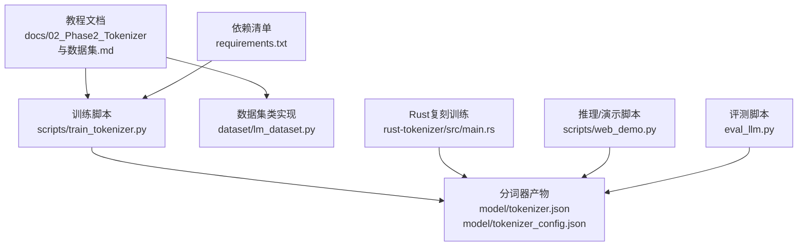
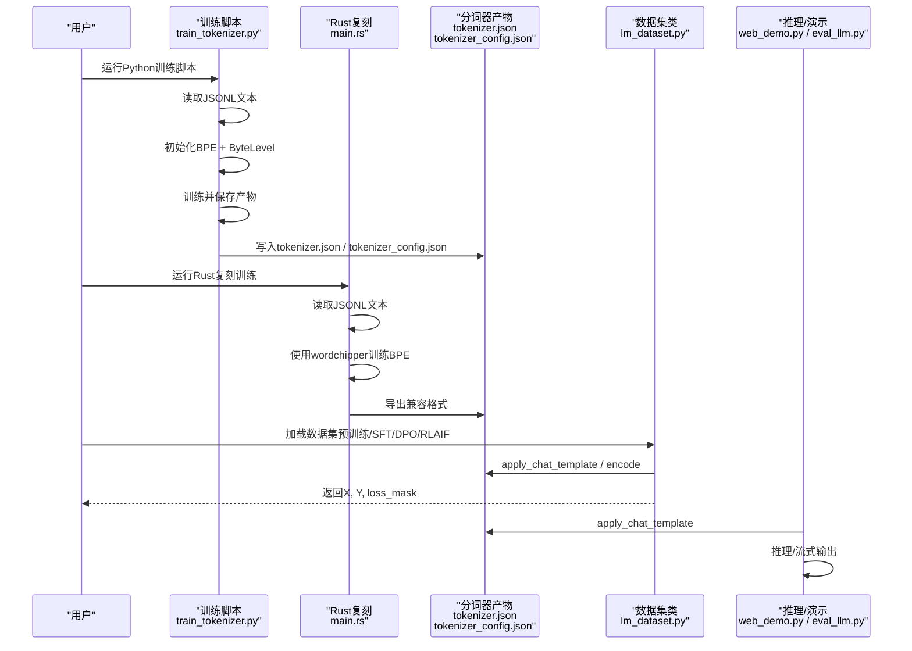
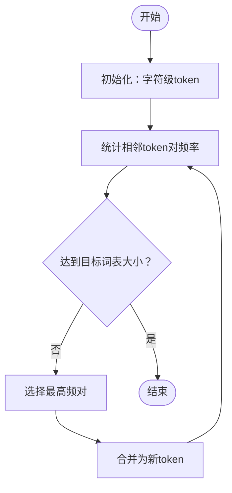
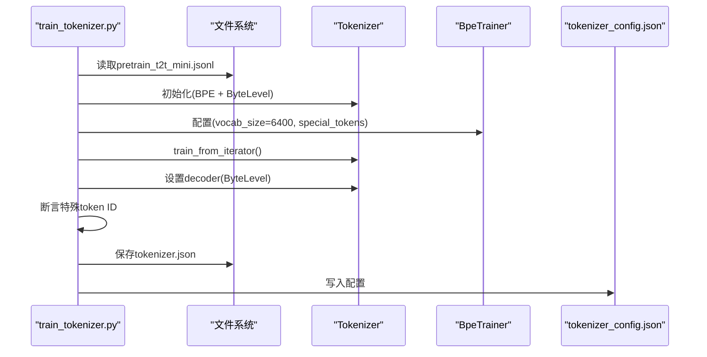
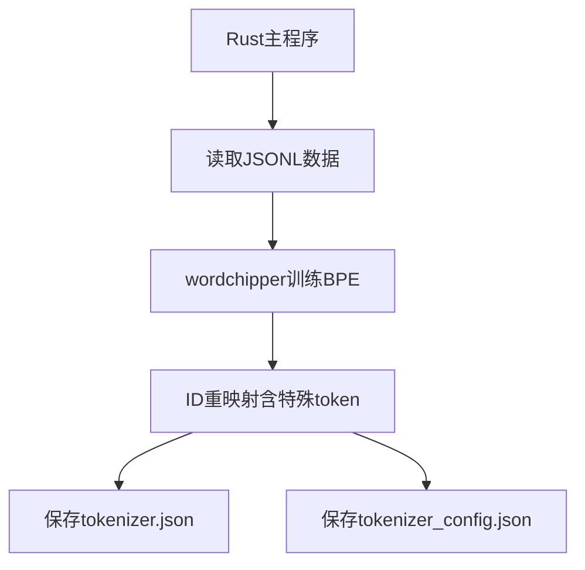
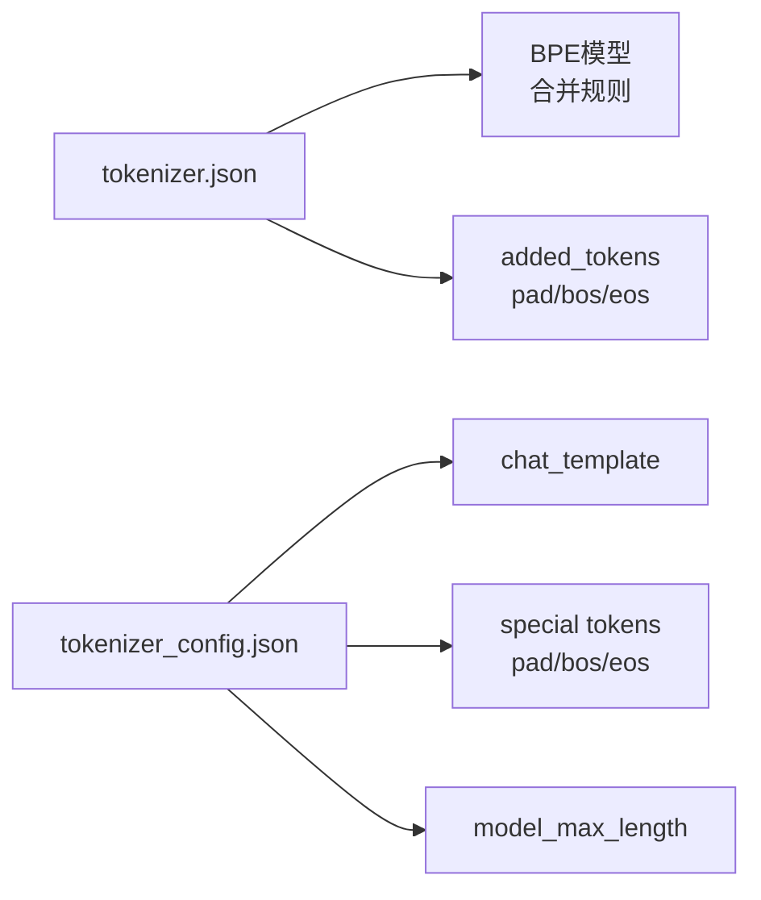
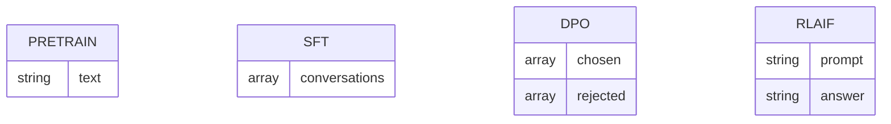
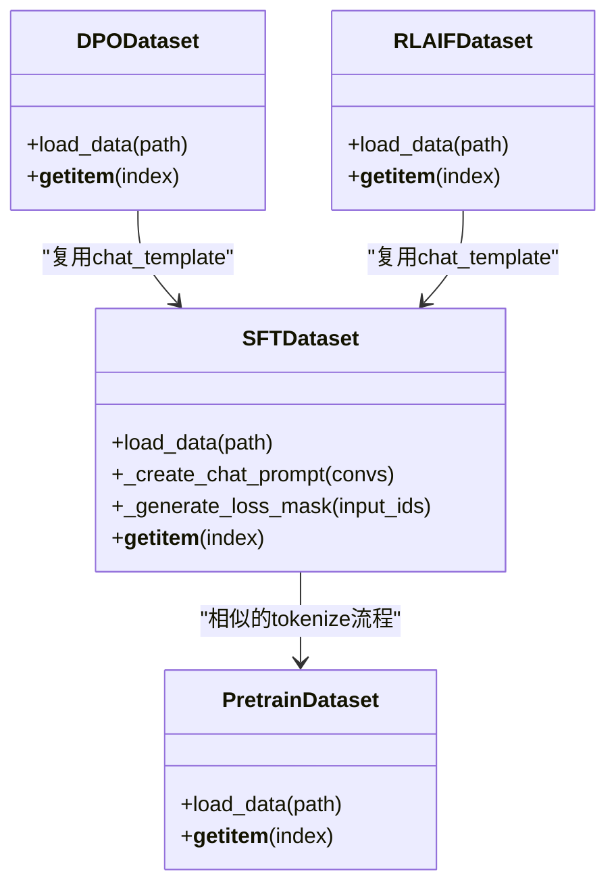
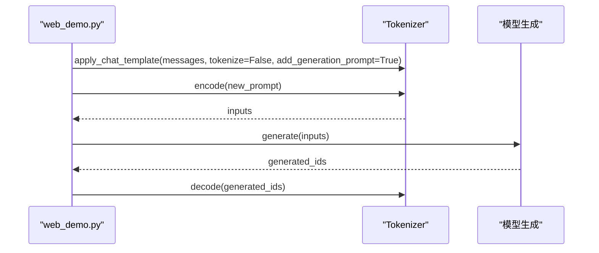
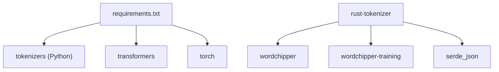

# Phase 2: 分词器与数据集

<cite>
**本文引用的文件**
- [docs/02_Phase2_Tokenizer与数据集.md](file://docs/02_Phase2_Tokenizer与数据集.md)
- [scripts/train_tokenizer.py](file://scripts/train_tokenizer.py)
- [rust-tokenizer/src/main.rs](file://rust-tokenizer/src/main.rs)
- [.comate/specs/rust-bpe-tokenizer/doc.md](file://.comate/specs/rust-bpe-tokenizer/doc.md)
- [model/tokenizer.json](file://model/tokenizer.json)
- [model/tokenizer_config.json](file://model/tokenizer_config.json)
- [MiniMind2/tokenizer.json](file://MiniMind2/tokenizer.json)
- [MiniMind2/tokenizer_config.json](file://MiniMind2/tokenizer_config.json)
- [requirements.txt](file://requirements.txt)
- [dataset/lm_dataset.py](file://dataset/lm_dataset.py)
- [scripts/web_demo.py](file://scripts/web_demo.py)
- [eval_llm.py](file://eval_llm.py)
</cite>

## 目录
1. [简介](#简介)
2. [项目结构](#项目结构)
3. [核心组件](#核心组件)
4. [架构总览](#架构总览)
5. [详细组件分析](#详细组件分析)
6. [依赖分析](#依赖分析)
7. [性能考量](#性能考量)
8. [故障排查指南](#故障排查指南)
9. [结论](#结论)
10. [附录](#附录)

## 简介
本阶段围绕“分词器与数据集”展开，目标是帮助读者：
- 理解分词器原理与MiniMind的BPE实现
- 掌握分词器训练流程、配置方法与特殊token处理
- 熟悉MiniMind各阶段数据集格式、清洗与预处理策略
- 学会从原始文本构建高质量训练数据集
- 具备独立完成分词器训练与数据集准备的能力

## 项目结构
本阶段涉及的关键目录与文件：
- docs/02_Phase2_Tokenizer与数据集.md：官方教程文档，涵盖原理、数据集格式与代码解读
- scripts/train_tokenizer.py：Python版BPE分词器训练脚本
- rust-tokenizer/src/main.rs：Rust复刻版BPE训练（wordchipper）
- model/tokenizer.json 与 model/tokenizer_config.json：训练好的分词器产物
- dataset/lm_dataset.py：数据集类实现（预训练、SFT、DPO、RLAIF）
- 其他：web_demo.py、eval_llm.py等演示与评测脚本

**图示来源**
- [docs/02_Phase2_Tokenizer与数据集.md:1-424](file://docs/02_Phase2_Tokenizer与数据集.md#L1-L424)
- [scripts/train_tokenizer.py:1-148](file://scripts/train_tokenizer.py#L1-L148)
- [rust-tokenizer/src/main.rs:1-383](file://rust-tokenizer/src/main.rs#L1-L383)
- [model/tokenizer.json:1-800](file://model/tokenizer.json#L1-L800)
- [model/tokenizer_config.json:1-43](file://model/tokenizer_config.json#L1-L43)
- [dataset/lm_dataset.py:1-250](file://dataset/lm_dataset.py#L1-L250)
- [requirements.txt:1-31](file://requirements.txt#L1-L31)
- [scripts/web_demo.py:261-291](file://scripts/web_demo.py#L261-L291)
- [eval_llm.py:64-89](file://eval_llm.py#L64-L89)

**章节来源**
- [docs/02_Phase2_Tokenizer与数据集.md:1-424](file://docs/02_Phase2_Tokenizer与数据集.md#L1-L424)

## 核心组件
- 分词器（BPE）：基于ByteLevel预分词与BPE合并规则，支持特殊token（pad/bos/eos）
- 数据集类：预训练（纯文本）、SFT（对话+工具调用）、DPO（偏好对）、RLAIF（rollout提示）
- 训练脚本：Python版与Rust版双实现，确保产物与配置兼容

**章节来源**
- [scripts/train_tokenizer.py:15-108](file://scripts/train_tokenizer.py#L15-L108)
- [rust-tokenizer/src/main.rs:132-383](file://rust-tokenizer/src/main.rs#L132-L383)
- [dataset/lm_dataset.py:15-230](file://dataset/lm_dataset.py#L15-L230)

## 架构总览
分词器与数据集的端到端工作流如下：

**图示来源**
- [scripts/train_tokenizer.py:15-108](file://scripts/train_tokenizer.py#L15-L108)
- [rust-tokenizer/src/main.rs:333-383](file://rust-tokenizer/src/main.rs#L333-L383)
- [model/tokenizer.json:1-800](file://model/tokenizer.json#L1-L800)
- [model/tokenizer_config.json:1-43](file://model/tokenizer_config.json#L1-L43)
- [dataset/lm_dataset.py:15-230](file://dataset/lm_dataset.py#L15-L230)
- [scripts/web_demo.py:281-291](file://scripts/web_demo.py#L281-L291)
- [eval_llm.py:72-85](file://eval_llm.py#L72-L85)

## 详细组件分析

### 分词器原理与BPE算法
- BPE（Byte Pair Encoding）流程：字符级初始化 → 统计相邻token频率 → 合并高频对 → 重复至目标词表大小
- MiniMind采用ByteLevel预分词，配合BPE合并，形成稳定的子词单元
- 特殊token：pad（""，ID=0）、bos（"<|im_start|>"，ID=1）、eos（"<|im_end|>"，ID=2）

**图示来源**
- [docs/02_Phase2_Tokenizer与数据集.md:49-66](file://docs/02_Phase2_Tokenizer与数据集.md#L49-L66)

**章节来源**
- [docs/02_Phase2_Tokenizer与数据集.md:49-86](file://docs/02_Phase2_Tokenizer与数据集.md#L49-L86)

### 训练自定义分词器（Python版）
- 数据来源：dataset/pretrain_t2t_mini.jsonl
- 关键步骤：
  - 初始化Tokenizer + BPE模型 + ByteLevel预分词器
  - 配置BpeTrainer（vocab_size=6400，special_tokens包含pad/bos/eos）
  - 从迭代器训练，设置ByteLevel解码器
  - 断言特殊token ID，保存tokenizer.json与tokenizer_config.json
- 评估：加载分词器，应用chat_template，验证编码长度与可逆性

**图示来源**
- [scripts/train_tokenizer.py:15-108](file://scripts/train_tokenizer.py#L15-L108)

**章节来源**
- [scripts/train_tokenizer.py:15-108](file://scripts/train_tokenizer.py#L15-L108)

### 训练自定义分词器（Rust复刻版）
- 目标：使用wordchipper复刻Python脚本，生成与HuggingFace格式兼容的tokenizer.json与tokenizer_config.json
- 关键点：
  - 使用与HuggingFace ByteLevel等价的正则模式
  - 训练完成后进行ID重映射，保证pad/bos/eos的ID与Python版一致
  - 手动构建added_tokens_decoder与chat_template字段

**图示来源**
- [rust-tokenizer/src/main.rs:132-383](file://rust-tokenizer/src/main.rs#L132-L383)
- [.comate/specs/rust-bpe-tokenizer/doc.md:1-27](file://.comate/specs/rust-bpe-tokenizer/doc.md#L1-L27)

**章节来源**
- [rust-tokenizer/src/main.rs:132-383](file://rust-tokenizer/src/main.rs#L132-L383)
- [.comate/specs/rust-bpe-tokenizer/doc.md:1-27](file://.comate/specs/rust-bpe-tokenizer/doc.md#L1-L27)

### 分词器配置与产物
- tokenizer.json：包含added_tokens（pad/bos/eos）、decoder、model（BPE合并规则等）
- tokenizer_config.json：包含特殊token、chat_template、model_max_length、pad_token等

**图示来源**
- [model/tokenizer.json:1-800](file://model/tokenizer.json#L1-L800)
- [model/tokenizer_config.json:1-43](file://model/tokenizer_config.json#L1-L43)
- [MiniMind2/tokenizer.json:1-800](file://MiniMind2/tokenizer.json#L1-L800)
- [MiniMind2/tokenizer_config.json:1-18](file://MiniMind2/tokenizer_config.json#L1-L18)

**章节来源**
- [model/tokenizer.json:1-800](file://model/tokenizer.json#L1-L800)
- [model/tokenizer_config.json:1-43](file://model/tokenizer_config.json#L1-L43)
- [MiniMind2/tokenizer.json:1-800](file://MiniMind2/tokenizer.json#L1-L800)
- [MiniMind2/tokenizer_config.json:1-18](file://MiniMind2/tokenizer_config.json#L1-L18)

### 数据集格式与处理
- 预训练数据（pretrain_t2t）：纯文本，每行一条，目标是“词语接龙”
- SFT数据（sft_t2t）：包含conversations，支持system/user/assistant/tool等角色，可含tool_calls
- DPO数据（dpo）：每条包含chosen/rejected两条偏好样本
- RLAIF数据（rlaif）：与SFT格式一致，用于rollout阶段

**图示来源**
- [docs/02_Phase2_Tokenizer与数据集.md:129-198](file://docs/02_Phase2_Tokenizer与数据集.md#L129-L198)

**章节来源**
- [docs/02_Phase2_Tokenizer与数据集.md:89-237](file://docs/02_Phase2_Tokenizer与数据集.md#L89-L237)

### 数据集类实现（关键逻辑）
- PretrainDataset：对纯文本tokenize，loss_mask覆盖非pad位置，X/Y为滑动窗口
- SFTDataset：使用apply_chat_template构建对话提示，loss_mask仅在assistant区域为1
- DPODataset：分别对chosen/rejected进行tokenize，返回两组X/Y/mask
- RLAIFDataset：返回prompt/answer文本，训练时再tokenize

**图示来源**
- [dataset/lm_dataset.py:15-230](file://dataset/lm_dataset.py#L15-L230)

**章节来源**
- [dataset/lm_dataset.py:15-230](file://dataset/lm_dataset.py#L15-L230)

### 推理与演示中的分词器使用
- web_demo.py：通过apply_chat_template构造提示，再encode生成inputs
- eval_llm.py：根据模式选择是否启用thinking，然后生成并解码

**图示来源**
- [scripts/web_demo.py:281-291](file://scripts/web_demo.py#L281-L291)
- [eval_llm.py:72-85](file://eval_llm.py#L72-L85)

**章节来源**
- [scripts/web_demo.py:281-291](file://scripts/web_demo.py#L281-L291)
- [eval_llm.py:72-85](file://eval_llm.py#L72-L85)

## 依赖分析
- 训练脚本依赖：tokenizers库（BPE、ByteLevel、Trainer）
- Rust复刻依赖：wordchipper、wordchipper-training、serde_json
- 推理/评测依赖：transformers（AutoTokenizer）、torch等

**图示来源**
- [requirements.txt:1-31](file://requirements.txt#L1-L31)
- [scripts/train_tokenizer.py:3-9](file://scripts/train_tokenizer.py#L3-L9)
- [rust-tokenizer/src/main.rs:1-12](file://rust-tokenizer/src/main.rs#L1-L12)

**章节来源**
- [requirements.txt:1-31](file://requirements.txt#L1-L31)

## 性能考量
- 词表大小权衡：MiniMind采用6400的小词表，显著降低Embedding层参数占比，适合小模型体积约束
- 中英文压缩比差异：中文约1.5~1.7字符/token，英文约4~5字符/token，影响max_seq_len设置
- max_seq_len建议：预训练/轻量SFT≈768，主线SFT≈380（以tokens为准）
- 损失掩码：仅在非pad/assistant区域计算loss，避免浪费算力与噪声

**章节来源**
- [docs/02_Phase2_Tokenizer与数据集.md:23-237](file://docs/02_Phase2_Tokenizer与数据集.md#L23-L237)

## 故障排查指南
- 分词器ID不一致
  - 现象：pad/bos/eos ID与预期不符
  - 排查：检查tokenizer_config.json中的special tokens与added_tokens_decoder
  - 参考：Python脚本断言特殊token ID；Rust复刻进行ID重映射
- chat_template不生效
  - 现象：生成内容缺少思维/工具调用格式
  - 排查：确认tokenizer_config.json中的chat_template字段完整
- 推理结果异常
  - 现象：decode后文本不一致或生成内容异常
  - 排查：检查apply_chat_template参数（add_generation_prompt、enable_thinking等）

**章节来源**
- [scripts/train_tokenizer.py:49-52](file://scripts/train_tokenizer.py#L49-L52)
- [rust-tokenizer/src/main.rs:297-322](file://rust-tokenizer/src/main.rs#L297-L322)
- [model/tokenizer_config.json:31-43](file://model/tokenizer_config.json#L31-L43)
- [eval_llm.py:72-85](file://eval_llm.py#L72-L85)

## 结论
本阶段完成了从原理到实践的闭环：理解BPE与特殊token设计，掌握Python与Rust双轨训练流程，熟悉各阶段数据集格式与数据集类实现，并能在推理/演示中正确应用分词器。建议优先使用项目自带的分词器产物，避免因词表变更导致的生态兼容性问题。

## 附录
- 动手练习
  - 探索分词器：加载AutoTokenizer，测试中文编码/逐token解码
  - 查看数据集样本：读取pretrain_t2t_mini.jsonl与sft_t2t_mini.jsonl的若干样本
  - 验证loss_mask：编写代码验证SFTDataset的loss_mask是否正确标记assistant区域

**章节来源**
- [docs/02_Phase2_Tokenizer与数据集.md:371-416](file://docs/02_Phase2_Tokenizer与数据集.md#L371-L416)