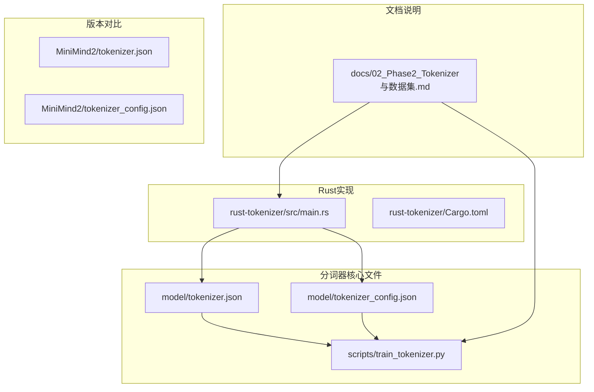
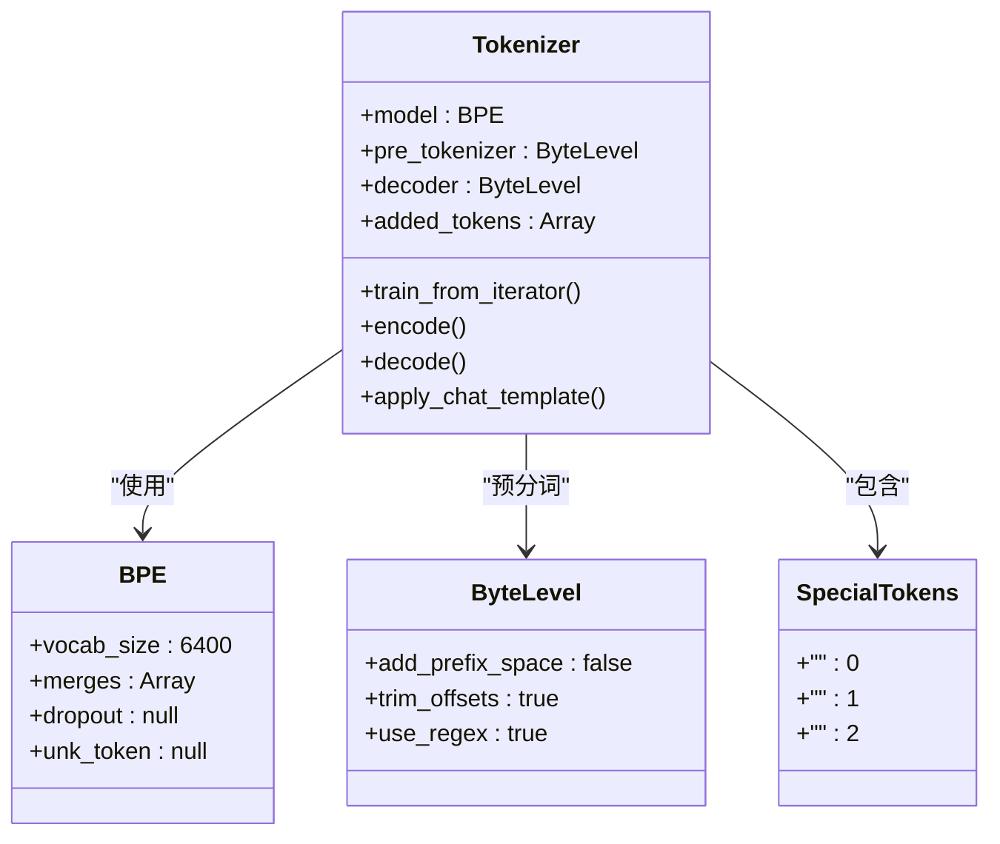
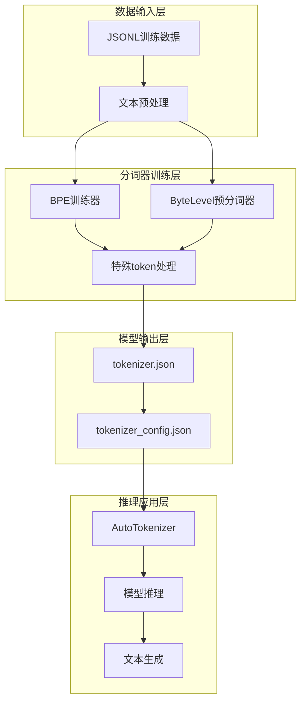
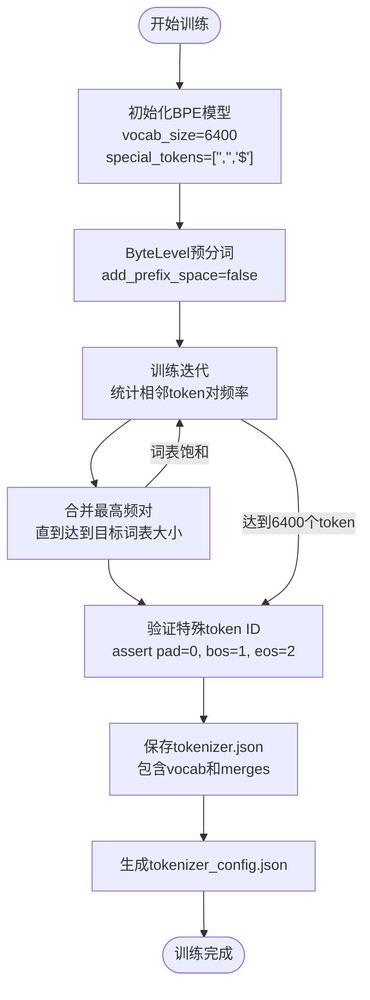
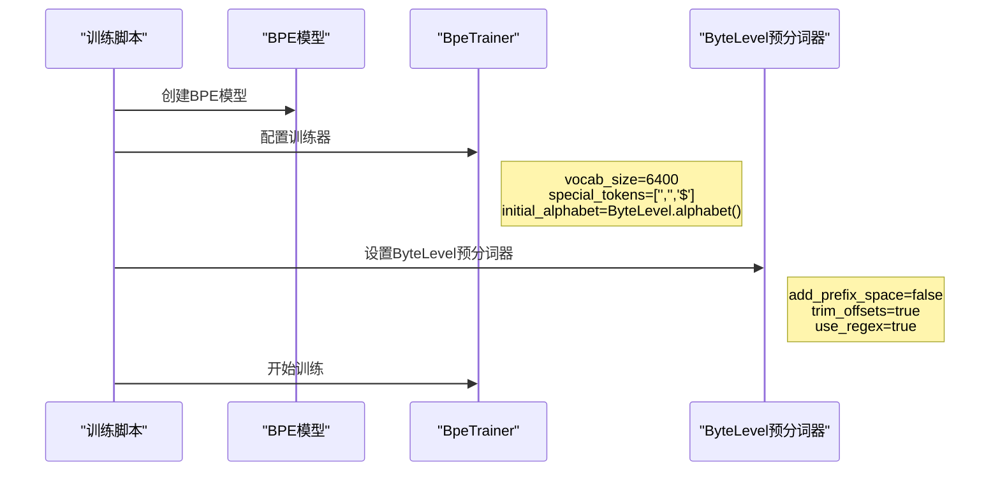
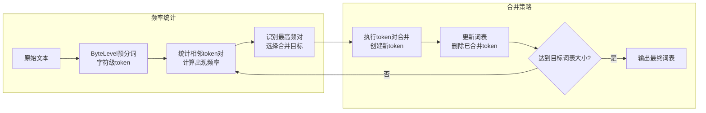
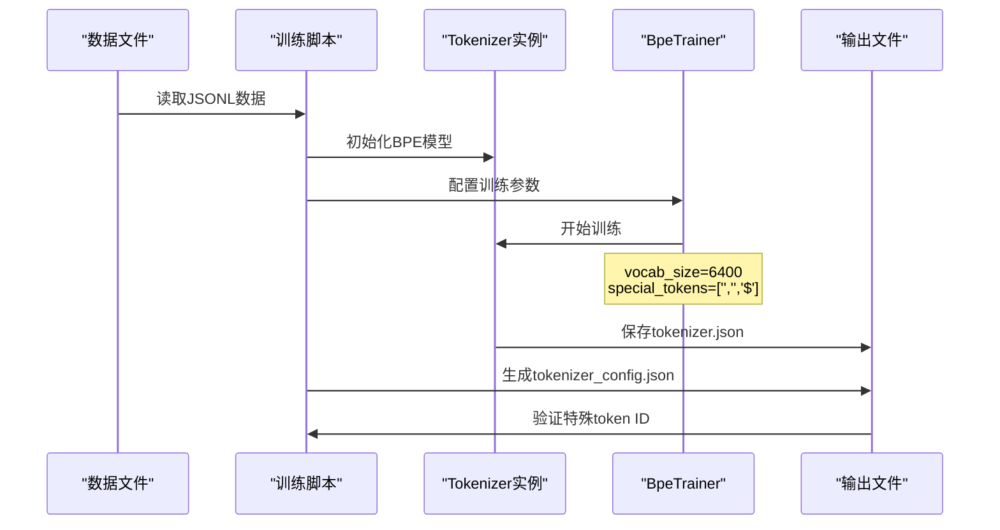
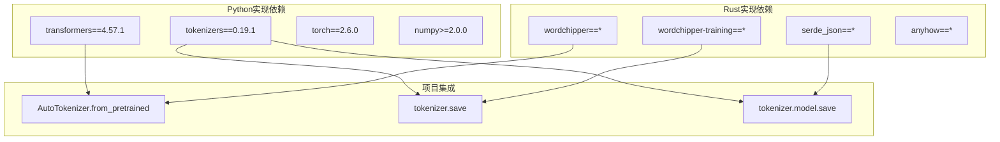
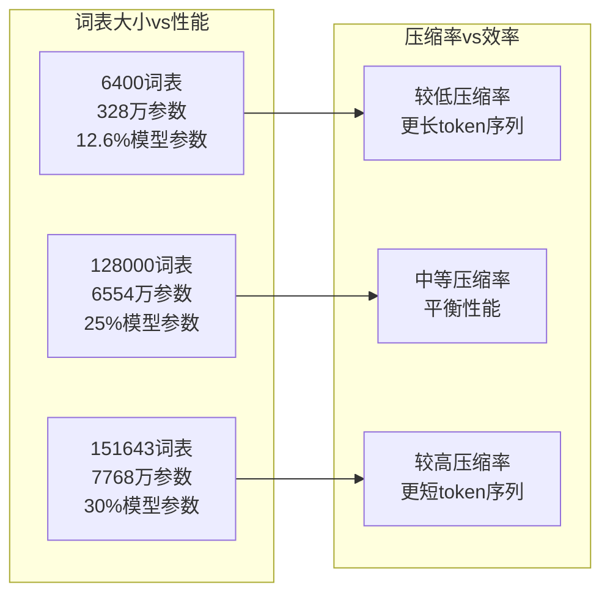
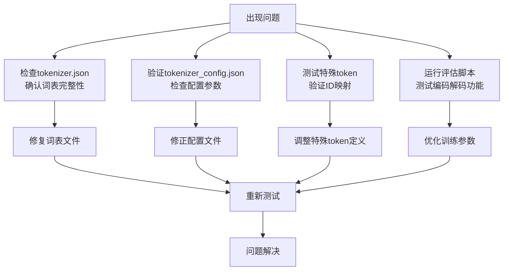

# 分词器原理与实现

<cite>
**本文档引用的文件**
- [tokenizer.json](file://model/tokenizer.json)
- [tokenizer_config.json](file://model/tokenizer_config.json)
- [train_tokenizer.py](file://scripts/train_tokenizer.py)
- [02_Phase2_Tokenizer与数据集.md](file://docs/02_Phase2_Tokenizer与数据集.md)
- [main.rs](file://rust-tokenizer/src/main.rs)
- [tokenizer.json](file://MiniMind2/tokenizer.json)
- [tokenizer_config.json](file://MiniMind2/tokenizer_config.json)
- [requirements.txt](file://requirements.txt)
</cite>

## 目录
1. [简介](#简介)
2. [项目结构](#项目结构)
3. [核心组件](#核心组件)
4. [架构概览](#架构概览)
5. [详细组件分析](#详细组件分析)
6. [依赖关系分析](#依赖关系分析)
7. [性能考量](#性能考量)
8. [故障排除指南](#故障排除指南)
9. [结论](#结论)

## 简介

MiniMind项目的分词器是整个大语言模型系统的核心组件之一，负责将自然语言文本转换为数字序列，以及将数字序列还原为人类可读的文本。本文档深入解析MiniMind分词器的设计理念、实现原理和最佳实践，特别关注BPE（Byte Pair Encoding）算法的完整实现流程。

分词器在LLM中扮演着"词典"的角色，是模型输入输出的桥梁。它不仅决定了模型能够理解和处理的语言范围，还直接影响模型的参数规模、推理速度和最终的性能表现。MiniMind项目选择了6400词表大小的定制化分词器，这一决策体现了在模型体积控制和压缩率之间的精心权衡。

## 项目结构

MiniMind项目的分词器相关文件分布清晰，体现了模块化的设计理念：



**图表来源**
- [tokenizer.json:1-800](file://model/tokenizer.json#L1-L800)
- [train_tokenizer.py:1-148](file://scripts/train_tokenizer.py#L1-L148)
- [main.rs:1-384](file://rust-tokenizer/src/main.rs#L1-L384)

**章节来源**
- [tokenizer.json:1-800](file://model/tokenizer.json#L1-L800)
- [tokenizer_config.json:1-43](file://model/tokenizer_config.json#L1-L43)
- [train_tokenizer.py:1-148](file://scripts/train_tokenizer.py#L1-L148)

## 核心组件

### 分词器架构设计

MiniMind分词器采用了现代化的HuggingFace tokenizers库架构，结合了ByteLevel预分词器和BPE模型的优势：



**图表来源**
- [train_tokenizer.py:25-58](file://scripts/train_tokenizer.py#L25-L58)
- [tokenizer.json:37-68](file://model/tokenizer.json#L37-L68)

### 词表大小策略

MiniMind项目选择了6400的独特词表大小，这一决策基于以下考量：

| 词表大小对比 | 参数规模 | 压缩率 | 适用场景 |
|------------|----------|--------|----------|
| 6400 | 328万参数 | 较低 | 小模型、体积敏感 |
| 151643 | 7768万参数 | 较高 | 大模型、中文友好 |
| 128000 | 6554万参数 | 中等 | 英文友好 |

**章节来源**
- [02_Phase2_Tokenizer与数据集.md:23-47](file://docs/02_Phase2_Tokenizer与数据集.md#L23-L47)

## 架构概览

### 整体系统架构



**图表来源**
- [train_tokenizer.py:15-108](file://scripts/train_tokenizer.py#L15-L108)
- [main.rs:131-192](file://rust-tokenizer/src/main.rs#L131-L192)

### BPE算法实现流程



**图表来源**
- [train_tokenizer.py:25-58](file://scripts/train_tokenizer.py#L25-L58)
- [main.rs:131-192](file://rust-tokenizer/src/main.rs#L131-L192)

## 详细组件分析

### BPE算法实现详解

#### 初始化阶段

BPE算法的初始化过程包含了词表大小设置、特殊token定义和预分词器配置：



**图表来源**
- [train_tokenizer.py:25-38](file://scripts/train_tokenizer.py#L25-L38)

#### 频率统计与合并过程

BPE算法的核心在于相邻token对的频率统计和最优合并策略：



**图表来源**
- [main.rs:74-129](file://rust-tokenizer/src/main.rs#L74-L129)

#### 特殊token处理机制

MiniMind分词器定义了三个特殊的token，它们在模型推理中发挥关键作用：

| 特殊token | ID | 用途 | 影响 |
|-----------|----|------|------|
| "" | 0 | pad token | 填充和掩码处理 |
| "" | 1 | bos token | 句子开始标记 |
| "" | 2 | eos token | 句子结束标记 |
| 其他 | 3+ | 一般token | 文本内容表示 |

**章节来源**
- [train_tokenizer.py:29-52](file://scripts/train_tokenizer.py#L29-L52)
- [tokenizer.json:2-30](file://model/tokenizer.json#L2-L30)

### Rust实现对比分析

#### WordChipper实现特点

Rust版本的wordchipper实现提供了与Python版本完全兼容的功能：

```mermaid
classDiagram
class WordChipperBPE {
+TRAIN_VOCAB_SIZE : 6397
+SPECIAL_TOKENS : 3
+extract_canonical_merges()
+bytes_to_bytelevel_string()
+save_tokenizer_json()
}
class PythonBPE {
+vocab_size : 6400
+special_tokens : 3
+train_from_iterator()
+ByteLevel.alphabet()
}
WordChipperBPE --> PythonBPE : "功能等价"
Note over WordChipperBPE,PythonBPE : "都支持6400词表大小<br/>相同的特殊token定义<br/>兼容的HuggingFace格式输出"
```

**图表来源**
- [main.rs:13-25](file://rust-tokenizer/src/main.rs#L13-L25)
- [main.rs:131-192](file://rust-tokenizer/src/main.rs#L131-L192)

#### ID映射策略

两种实现都采用了相似的ID映射策略来适配HuggingFace格式：

```mermaid
flowchart TD
subgraph "WordChipper内部ID"
A[byte vocab: 0-255]<br/>B[BPE合并: 256+]
end
subgraph "HuggingFace外部ID"
C[special tokens: 0-2]<br/>D[byte vocab: 3-258]<br/>E[BPE合并: 259+]
end
A --> F["ID偏移映射<br/>offset = 3"]
F --> C
F --> D
F --> E
```

**图表来源**
- [main.rs:154-171](file://rust-tokenizer/src/main.rs#L154-L171)

**章节来源**
- [main.rs:131-192](file://rust-tokenizer/src/main.rs#L131-L192)

### 训练流程完整示例

#### Python训练脚本分析

训练脚本展示了完整的BPE训练流程，从数据加载到模型保存的全过程：



**图表来源**
- [train_tokenizer.py:15-108](file://scripts/train_tokenizer.py#L15-L108)

#### 训练数据格式要求

训练数据需要遵循特定的JSONL格式，确保BPE算法能够正确学习词汇模式：

| 字段名 | 类型 | 必需 | 描述 |
|--------|------|------|------|
| text | string | 是 | 训练文本内容 |
| conversations | array | 否 | 对话格式数据 |

**章节来源**
- [train_tokenizer.py:16-21](file://scripts/train_tokenizer.py#L16-L21)

## 依赖关系分析

### 核心依赖关系



**图表来源**
- [requirements.txt:1-31](file://requirements.txt#L1-L31)
- [main.rs:1-11](file://rust-tokenizer/src/main.rs#L1-L11)

### 版本兼容性矩阵

| 组件 | 版本 | 兼容性 | 说明 |
|------|------|--------|------|
| transformers | 4.57.1 | ✅ 完全兼容 | 支持HuggingFace格式 |
| tokenizers | 0.19.1 | ✅ 完全兼容 | BPE训练和推理 |
| wordchipper | 最新版本 | ✅ 兼容 | Rust实现等价功能 |
| torch | 2.6.0 | ✅ 兼容 | 模型推理支持 |

**章节来源**
- [requirements.txt:1-31](file://requirements.txt#L1-L31)

## 性能考量

### 词表大小对性能的影响

MiniMind选择6400词表大小的性能权衡分析：



### 推理速度优化

分词器的推理速度受以下因素影响：

1. **词表查找复杂度**：O(log n)的二分查找
2. **token序列长度**：影响解码时间
3. **特殊token处理**：快速路径优化
4. **内存缓存**：常用token的缓存命中

**章节来源**
- [02_Phase2_Tokenizer与数据集.md:23-47](file://docs/02_Phase2_Tokenizer与数据集.md#L23-L47)

## 故障排除指南

### 常见问题及解决方案

#### 词表不匹配问题

**问题描述**：加载预训练模型时出现词表不匹配错误

**解决方案**：
1. 确认tokenizer.json和tokenizer_config.json文件完整性
2. 验证特殊token ID的一致性
3. 检查词表大小是否为6400

#### 训练数据格式错误

**问题描述**：训练过程中出现JSON解析错误

**解决方案**：
1. 检查JSONL文件格式是否正确
2. 确保每行都是有效的JSON对象
3. 验证text字段的存在和格式

#### 内存不足问题

**问题描述**：训练过程中出现内存溢出

**解决方案**：
1. 减少batch大小
2. 使用流式训练方法
3. 增加系统内存或使用更高规格的硬件

### 调试技巧



**章节来源**
- [train_tokenizer.py:112-139](file://scripts/train_tokenizer.py#L112-L139)

## 结论

MiniMind项目的分词器实现展现了在模型体积控制和性能优化之间的精妙平衡。通过选择6400词表大小的定制化BPE分词器，项目成功实现了：

1. **体积控制**：embedding层参数仅占模型总参数的12.6%，显著降低了模型负担
2. **兼容性保证**：与HuggingFace生态系统完全兼容，确保了生态系统的无缝集成
3. **性能优化**：通过Rust实现提供了高性能的训练和推理能力
4. **可扩展性**：模块化的架构设计便于未来的功能扩展和优化

分词器作为LLM系统的基础组件，其设计决策直接影响着整个模型的性能表现。MiniMind项目通过精心的架构设计和实现细节，为小模型的高效部署提供了可靠的基础设施支撑。

在未来的发展中，随着模型规模的扩大和技术的进步，分词器的优化将继续是提升整体系统性能的关键环节。项目团队应该持续关注新的分词技术和优化策略，在保持兼容性的前提下不断提升性能表现。