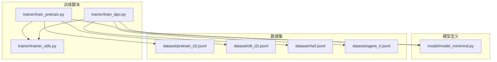
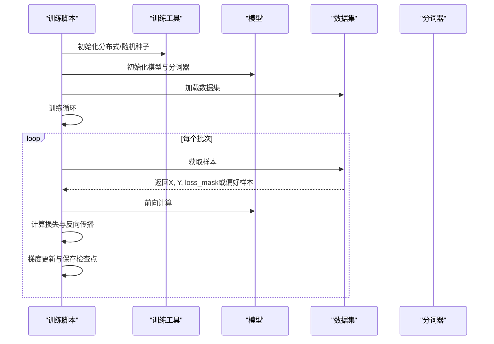
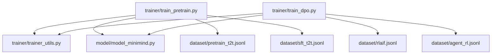

# 数据集格式与处理

<cite>
**本文档引用的文件**
- [train_pretrain.py](file://trainer/train_pretrain.py)
- [train_dpo.py](file://trainer/train_dpo.py)
- [trainer_utils.py](file://trainer/trainer_utils.py)
- [model_minimind.py](file://model/model_minimind.py)
- [pretrain_t2t.jsonl](file://dataset/pretrain_t2t.jsonl)
- [sft_t2t.jsonl](file://dataset/sft_t2t.jsonl)
- [rlaif.jsonl](file://dataset/rlaif.jsonl)
- [agent_rl.jsonl](file://dataset/agent_rl.jsonl)
</cite>

## 目录
1. [简介](#简介)
2. [项目结构](#项目结构)
3. [核心组件](#核心组件)
4. [架构概览](#架构概览)
5. [详细组件分析](#详细组件分析)
6. [依赖关系分析](#依赖关系分析)
7. [性能考虑](#性能考虑)
8. [故障排除指南](#故障排除指南)
9. [结论](#结论)
10. [附录](#附录)

## 简介
本文件为MiniMind项目的数据集格式与处理综合文档，涵盖预训练、监督微调、DPO、RLAIF等数据集类型。文档详细解析各类数据集的格式规范、字段含义、使用场景，以及数据集类的设计思路与关键方法。重点阐述损失掩码(loss_mask)的生成逻辑与作用机制，并提供数据预处理、清洗、增强等实用技巧，以及数据集下载、配置与使用的完整流程指导。

## 项目结构
MiniMind项目采用模块化设计，训练脚本位于trainer目录，模型定义位于model目录，数据集位于dataset目录。训练脚本通过统一的训练工具模块(trainer_utils)初始化分布式环境、模型与优化器，加载对应数据集并进行训练。

**图表来源**
- [train_pretrain.py:1-162](file://trainer/train_pretrain.py#L1-L162)
- [train_dpo.py:1-208](file://trainer/train_dpo.py#L1-L208)
- [trainer_utils.py:1-139](file://trainer/trainer_utils.py#L1-L139)
- [model_minimind.py:1-477](file://model/model_minimind.py#L1-L477)

**章节来源**
- [train_pretrain.py:1-162](file://trainer/train_pretrain.py#L1-L162)
- [train_dpo.py:1-208](file://trainer/train_dpo.py#L1-L208)
- [trainer_utils.py:1-139](file://trainer/trainer_utils.py#L1-L139)

## 核心组件
- 训练脚本：负责初始化环境、加载模型与数据集、执行训练循环、保存检查点。
- 训练工具：提供分布式初始化、日志、学习率调度、检查点管理、模型初始化等通用功能。
- 模型定义：包含MiniMindConfig与MiniMindForCausalLM，支持预训练与微调场景。
- 数据集：提供预训练、SFT、RLAIF等数据集格式与加载逻辑。

**章节来源**
- [train_pretrain.py:1-162](file://trainer/train_pretrain.py#L1-L162)
- [train_dpo.py:1-208](file://trainer/train_dpo.py#L1-L208)
- [trainer_utils.py:1-139](file://trainer/trainer_utils.py#L1-L139)
- [model_minimind.py:1-477](file://model/model_minimind.py#L1-L477)

## 架构概览
训练流程采用统一的训练循环，预训练与DPO训练在数据加载、损失计算、梯度更新等方面存在差异。预训练使用交叉熵损失与损失掩码，DPO训练使用参考模型与偏好优化损失。

**图表来源**
- [train_pretrain.py:23-78](file://trainer/train_pretrain.py#L23-L78)
- [train_dpo.py:54-116](file://trainer/train_dpo.py#L54-L116)
- [trainer_utils.py:1-139](file://trainer/trainer_utils.py#L1-L139)

## 详细组件分析

### 数据集格式规范与用途

#### 预训练数据集(pretrain_t2t.jsonl)
- 文件用途：用于语言模型的自回归预训练，最大化似然估计。
- 数据结构：每行一条JSON对象，包含text字段，表示训练文本。
- 字段含义：
  - text：训练文本，通常为长文本片段，经过分词器编码后作为输入序列。
- 使用场景：大规模语料库的无监督预训练，提升模型的语言理解与生成能力。

**章节来源**
- [pretrain_t2t.jsonl:1-342](file://dataset/pretrain_t2t.jsonl#L1-L342)

#### 监督微调数据集(sft_t2t.jsonl)
- 文件用途：用于监督微调，对齐人类偏好与指令遵循。
- 数据结构：每行一条JSON对象，包含conversations字段，列表中包含多个对话回合。
- 字段含义：
  - conversations：对话回合列表，每个回合包含role与content字段，role为"user"或"assistant"，content为对应的文本内容。
- 使用场景：指令遵循、对话生成、任务导向对话等。

**章节来源**
- [sft_t2t.jsonl:1-63](file://dataset/sft_t2t.jsonl#L1-L63)

#### DPO数据集(dpo.jsonl)
- 文件用途：用于直接偏好优化(DPO)，通过比较chosen与rejected样本学习偏好。
- 数据结构：每行一条JSON对象，包含x_chosen、y_chosen、mask_chosen、x_rejected、y_rejected、mask_rejected等字段。
- 字段含义：
  - x_chosen/y_chosen：首选样本的输入与目标序列。
  - x_rejected/y_rejected：拒绝样本的输入与目标序列。
  - mask_chosen/mask_rejected：对应序列的掩码，用于指示有效位置。
- 使用场景：偏好学习、排序优化、人类偏好对齐。

**章节来源**
- [train_dpo.py:137-178](file://trainer/train_dpo.py#L137-L178)

#### RLAIF数据集(rlaif.jsonl)
- 文件用途：用于基于人类反馈的强化学习(RLHF)，通过人类反馈优化策略。
- 数据结构：每行一条JSON对象，包含conversations字段，结构与SFT类似。
- 字段含义：
  - conversations：对话回合列表，role为"user"或"assistant"，content为文本内容。
- 使用场景：对话质量提升、人类价值观对齐、对话策略优化。

**章节来源**
- [rlaif.jsonl:1-163](file://dataset/rlaif.jsonl#L1-L163)

#### Agent RL数据集(agent_rl.jsonl)
- 文件用途：用于智能体强化学习，包含交互式对话与奖励信号。
- 数据结构：每行一条JSON对象，包含conversations字段。
- 字段含义：
  - conversations：对话回合列表，role为"user"或"assistant"，content为文本内容。
- 使用场景：智能体对话、任务执行、奖励建模。

**章节来源**
- [agent_rl.jsonl:1-200](file://dataset/agent_rl.jsonl#L1-L200)

### 数据集类设计与实现

#### PretrainDataset设计思路
- 设计目标：将文本数据转换为模型可训练的输入序列与目标序列，支持损失掩码生成。
- 关键方法：
  - __init__：初始化分词器、最大序列长度、数据路径。
  - __getitem__：读取文本，使用分词器编码，生成输入X与目标Y，计算loss_mask。
  - __len__：返回数据集长度。
- 损失掩码生成逻辑：
  - 对于自回归语言模型，loss_mask用于屏蔽填充位置与前缀部分，仅对目标位置计算损失。
  - 通常将padding位置标记为0，有效位置标记为1，计算时按元素相乘并归一化。

**章节来源**
- [train_pretrain.py:132-133](file://trainer/train_pretrain.py#L132-L133)

#### SFTDataset设计思路
- 设计目标：将对话数据转换为指令-响应对，支持监督微调。
- 关键方法：
  - __init__：初始化分词器、最大序列长度、数据路径。
  - __getitem__：读取conversations，构造指令-响应序列，生成X与Y。
  - __len__：返回数据集长度。
- 注意事项：需要处理多轮对话，确保指令与响应的对应关系。

**章节来源**
- [sft_t2t.jsonl:1-63](file://dataset/sft_t2t.jsonl#L1-L63)

#### DPODataset设计思路
- 设计目标：加载偏好数据，支持DPO训练中的比较学习。
- 关键方法：
  - __init__：初始化分词器、最大序列长度、数据路径。
  - __getitem__：读取chosen与rejected样本，生成X、Y与mask。
  - __len__：返回数据集长度。
- 损失计算：在训练循环中使用log-likelihood与偏好比较计算DPO损失。

**章节来源**
- [train_dpo.py:178-178](file://trainer/train_dpo.py#L178-L178)

#### RLAIFDataset设计思路
- 设计目标：加载RLAIF格式的对话数据，支持基于人类反馈的强化学习。
- 关键方法：
  - __init__：初始化分词器、最大序列长度、数据路径。
  - __getitem__：读取conversations，构造对话序列。
  - __len__：返回数据集长度。
- 与SFT的区别：RLAIF更侧重于人类反馈的对话质量提升。

**章节来源**
- [rlaif.jsonl:1-163](file://dataset/rlaif.jsonl#L1-L163)

### 损失掩码(loss_mask)生成逻辑与作用机制
- 生成逻辑：
  - 对于预训练：根据padding位置与有效位置生成mask，仅对目标位置计算损失。
  - 对于SFT：根据对话结构生成mask，屏蔽系统消息与历史消息的损失。
  - 对于DPO：对chosen与rejected样本分别生成mask，确保比较学习的公平性。
- 作用机制：
  - 在损失计算中与损失矩阵逐元素相乘，屏蔽无效位置。
  - 通过求和与归一化，确保损失的稳定性与可比性。
  - 在分布式训练中，mask需与全局batch对齐，避免统计偏差。

**章节来源**
- [train_pretrain.py:24-42](file://trainer/train_pretrain.py#L24-L42)
- [train_dpo.py:33-51](file://trainer/train_dpo.py#L33-L51)

### 数据预处理、清洗与增强技巧
- 数据清洗：
  - 移除异常长度样本，过滤重复文本，去除包含敏感信息的内容。
  - 对对话数据进行结构校验，确保conversations字段的完整性。
- 数据预处理：
  - 文本规范化，统一编码格式，处理特殊字符。
  - 分词与编码，确保序列长度不超过最大长度，必要时截断或填充。
- 数据增强：
  - 对话数据：同义词替换、句子重组、角色替换等。
  - 文本数据：回译、随机插入/删除、同义词替换等。
- 注意事项：
  - 增强后的数据需保持语义一致性，避免引入噪声。
  - 增强策略需与目标任务匹配，避免过度增强导致性能下降。

### 数据集下载、配置与使用流程
- 下载与准备：
  - 预训练数据集：准备大规模文本语料，确保数据多样性与代表性。
  - SFT数据集：收集高质量的指令-响应对，标注人类偏好。
  - DPO数据集：收集偏好比较样本，确保chosen与rejected样本的平衡。
  - RLAIF数据集：收集人类反馈的对话数据，标注反馈质量。
- 配置参数：
  - max_seq_len：最大序列长度，需根据硬件资源与任务需求调整。
  - batch_size：批量大小，需考虑显存限制与收敛速度。
  - learning_rate：学习率，需根据优化器与学习率调度策略调整。
- 使用流程：
  - 初始化训练脚本，加载分词器与模型。
  - 创建数据集实例，设置最大序列长度与数据路径。
  - 构建DataLoader，设置shuffle、batch_size与num_workers。
  - 执行训练循环，定期保存检查点，监控训练指标。

**章节来源**
- [train_pretrain.py:81-162](file://trainer/train_pretrain.py#L81-L162)
- [train_dpo.py:119-208](file://trainer/train_dpo.py#L119-L208)

## 依赖关系分析
训练脚本依赖训练工具模块与模型定义，数据集通过训练脚本加载。预训练与DPO训练在数据加载与损失计算上存在差异，但共享相同的模型与分词器。

**图表来源**
- [train_pretrain.py:1-162](file://trainer/train_pretrain.py#L1-L162)
- [train_dpo.py:1-208](file://trainer/train_dpo.py#L1-L208)
- [trainer_utils.py:1-139](file://trainer/trainer_utils.py#L1-L139)
- [model_minimind.py:1-477](file://model/model_minimind.py#L1-L477)

**章节来源**
- [train_pretrain.py:1-162](file://trainer/train_pretrain.py#L1-L162)
- [train_dpo.py:1-208](file://trainer/train_dpo.py#L1-L208)
- [trainer_utils.py:1-139](file://trainer/trainer_utils.py#L1-L139)
- [model_minimind.py:1-477](file://model/model_minimind.py#L1-L477)

## 性能考虑
- 训练效率：
  - 使用混合精度训练，减少显存占用与提升吞吐量。
  - 合理设置梯度累积步数，平衡内存与训练速度。
  - 使用分布式训练，提升大规模数据集的训练效率。
- 数据加载：
  - 使用多进程数据加载，减少I/O瓶颈。
  - 缓存常用数据，避免重复读取。
- 模型优化：
  - 使用梯度裁剪，防止梯度爆炸。
  - 合理设置学习率调度，提升收敛稳定性。

## 故障排除指南
- 分布式训练问题：
  - 确认NCCL后端与环境变量设置，检查GPU数量与可见性。
  - 检查DDP参数忽略列表，避免同步异常。
- 检查点恢复问题：
  - 确认检查点文件完整性，避免部分写入导致的加载失败。
  - GPU数量变化时，检查步数转换逻辑。
- 数据加载问题：
  - 检查数据路径与文件权限，确保数据集文件可读。
  - 校验JSON格式，避免解析错误。

**章节来源**
- [trainer_utils.py:28-97](file://trainer/trainer_utils.py#L28-L97)

## 结论
MiniMind项目提供了完整的数据集格式与处理方案，涵盖预训练、监督微调、DPO与RLAIF等多种训练范式。通过统一的训练工具与模型定义，实现了高效、稳定的训练流程。损失掩码的合理设计与使用，确保了训练过程的稳定性与有效性。建议在实际使用中结合任务特点，选择合适的数据集格式与预处理策略，以获得最佳的训练效果。

## 附录
- 数据集格式对照表：
  - 预训练：text字段，长文本序列。
  - SFT：conversations字段，多轮对话。
  - DPO：x_chosen/y_chosen与x_rejected/y_rejected及mask。
  - RLAIF：conversations字段，人类反馈对话。
- 训练参数建议：
  - 预训练：较大的max_seq_len与batch_size，适中的学习率。
  - SFT：适中的max_seq_len，较小的batch_size以提升收敛。
  - DPO：较小的batch_size，注意chosen与rejected样本平衡。
  - RLAIF：适中的max_seq_len，关注对话质量与反馈一致性。