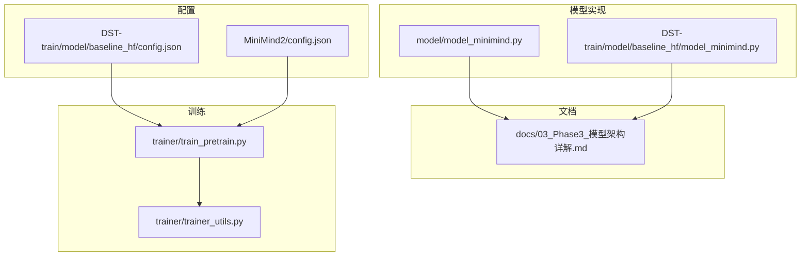
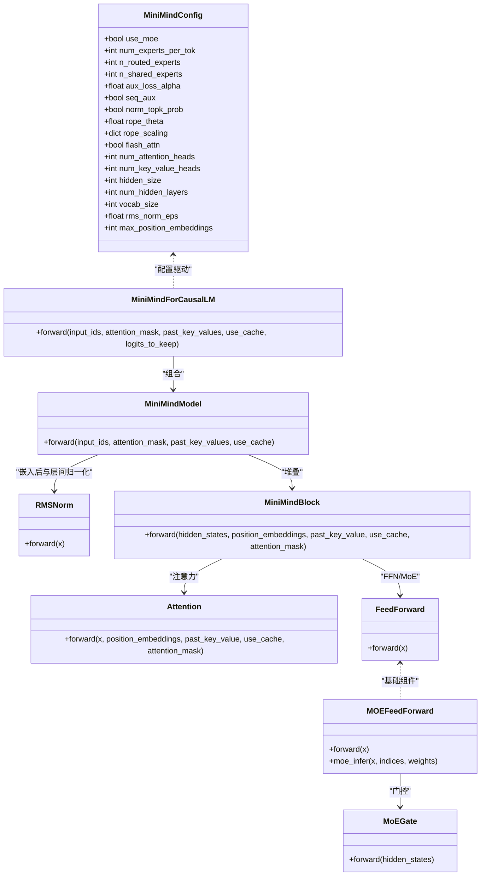
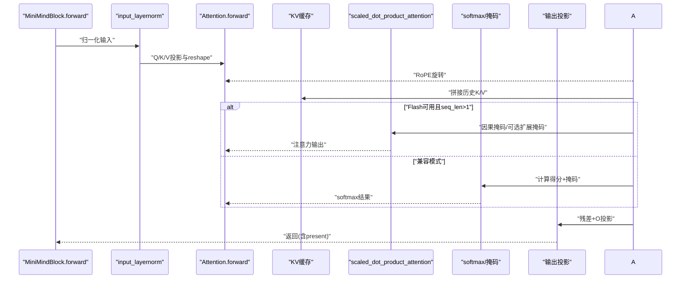
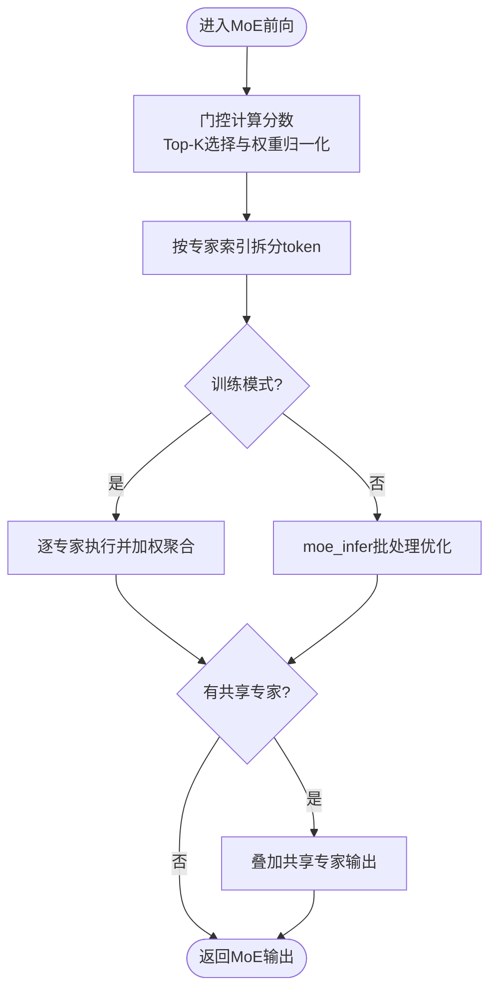
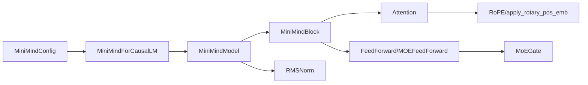

# Phase 3: 模型架构详解

<cite>
**本文引用的文件**
- [model/model_minimind.py](file://model/model_minimind.py)
- [DST-train/model/baseline_hf/model_minimind.py](file://DST-train/model/baseline_hf/model_minimind.py)
- [docs/03_Phase3_模型架构详解.md](file://docs/03_Phase3_模型架构详解.md)
- [DST-train/model/baseline_hf/config.json](file://DST-train/model/baseline_hf/config.json)
- [MiniMind2/config.json](file://MiniMind2/config.json)
- [trainer/train_pretrain.py](file://trainer/train_pretrain.py)
- [trainer/trainer_utils.py](file://trainer/trainer_utils.py)
</cite>

## 目录
1. [引言](#引言)
2. [项目结构](#项目结构)
3. [核心组件](#核心组件)
4. [架构总览](#架构总览)
5. [详细组件分析](#详细组件分析)
6. [依赖关系分析](#依赖关系分析)
7. [性能考量](#性能考量)
8. [故障排查指南](#故障排查指南)
9. [结论](#结论)
10. [附录](#附录)

## 引言
本阶段聚焦MiniMind的Transformer Decoder架构设计与实现细节，系统解析注意力机制、RoPE旋转位置编码、Grouped-Query Attention（GQA）优化、Dense标准前馈网络与MoE混合专家架构的差异与配置要点，并结合训练脚本展示如何在实际任务中启用与评估这些特性。文档同时提供参数配置、内存占用估算与性能调优建议，帮助读者深入理解MiniMind的设计理念与工程实现。

## 项目结构
围绕Phase 3模型架构，仓库中与之直接相关的文件主要分布在以下位置：
- 模型定义与实现：model/model_minimind.py、DST-train/model/baseline_hf/model_minimind.py
- 文档说明：docs/03_Phase3_模型架构详解.md
- 配置文件：DST-train/model/baseline_hf/config.json、MiniMind2/config.json
- 训练脚本：trainer/train_pretrain.py、trainer/trainer_utils.py

图表来源
- [model/model_minimind.py:1-474](file://model/model_minimind.py#L1-L474)
- [DST-train/model/baseline_hf/model_minimind.py:1-474](file://DST-train/model/baseline_hf/model_minimind.py#L1-L474)
- [docs/03_Phase3_模型架构详解.md:1-387](file://docs/03_Phase3_模型架构详解.md#L1-L387)
- [DST-train/model/baseline_hf/config.json:1-37](file://DST-train/model/baseline_hf/config.json#L1-L37)
- [MiniMind2/config.json:1-33](file://MiniMind2/config.json#L1-L33)
- [trainer/train_pretrain.py:1-162](file://trainer/train_pretrain.py#L1-L162)
- [trainer/trainer_utils.py:1-139](file://trainer/trainer_utils.py#L1-L139)

章节来源
- [model/model_minimind.py:1-474](file://model/model_minimind.py#L1-L474)
- [DST-train/model/baseline_hf/model_minimind.py:1-474](file://DST-train/model/baseline_hf/model_minimind.py#L1-L474)
- [docs/03_Phase3_模型架构详解.md:1-387](file://docs/03_Phase3_模型架构详解.md#L1-L387)
- [DST-train/model/baseline_hf/config.json:1-37](file://DST-train/model/baseline_hf/config.json#L1-L37)
- [MiniMind2/config.json:1-33](file://MiniMind2/config.json#L1-L33)
- [trainer/train_pretrain.py:1-162](file://trainer/train_pretrain.py#L1-L162)
- [trainer/trainer_utils.py:1-139](file://trainer/trainer_utils.py#L1-L139)

## 核心组件
本节概述MiniMind的核心模块及其职责：
- 配置类：MiniMindConfig，统一管理模型超参数，包括注意力头数、KV头数、RoPE参数、MoE开关与专家配置等。
- 规范化：RMSNorm，轻量化归一化，提升推理效率。
- 位置编码：RoPE（含YaRN外推），为Q/K注入相对位置信息。
- 注意力：Attention，支持GQA与KV重复、Flash Attention加速、KV缓存。
- 前馈网络：FeedForward（SwiGLU）、MOEFeedForward（MoE门控路由与专家执行）。
- Transformer块：MiniMindBlock，按Pre-LN顺序组织注意力与FFN/MoE。
- 完整模型：MiniMindModel与MiniMindForCausalLM，负责嵌入、层堆叠、输出投影与权重共享。

章节来源
- [model/model_minimind.py:8-78](file://model/model_minimind.py#L8-L78)
- [model/model_minimind.py:95-106](file://model/model_minimind.py#L95-L106)
- [model/model_minimind.py:108-128](file://model/model_minimind.py#L108-L128)
- [model/model_minimind.py:131-137](file://model/model_minimind.py#L131-L137)
- [model/model_minimind.py:140-148](file://model/model_minimind.py#L140-L148)
- [model/model_minimind.py:150-225](file://model/model_minimind.py#L150-L225)
- [model/model_minimind.py:227-241](file://model/model_minimind.py#L227-L241)
- [model/model_minimind.py:243-296](file://model/model_minimind.py#L243-L296)
- [model/model_minimind.py:299-358](file://model/model_minimind.py#L299-L358)
- [model/model_minimind.py:361-382](file://model/model_minimind.py#L361-L382)
- [model/model_minimind.py:385-438](file://model/model_minimind.py#L385-L438)
- [model/model_minimind.py:441-474](file://model/model_minimind.py#L441-L474)

## 架构总览
MiniMind采用Decoder-only架构，遵循Pre-LN与SwiGLU FFN设计，引入RoPE与GQA优化，支持MoE路由与共享专家。下图给出代码级的组件交互关系：

图表来源
- [model/model_minimind.py:8-78](file://model/model_minimind.py#L8-L78)
- [model/model_minimind.py:95-106](file://model/model_minimind.py#L95-L106)
- [model/model_minimind.py:150-225](file://model/model_minimind.py#L150-L225)
- [model/model_minimind.py:227-241](file://model/model_minimind.py#L227-L241)
- [model/model_minimind.py:243-296](file://model/model_minimind.py#L243-L296)
- [model/model_minimind.py:299-358](file://model/model_minimind.py#L299-L358)
- [model/model_minimind.py:361-382](file://model/model_minimind.py#L361-L382)
- [model/model_minimind.py:385-438](file://model/model_minimind.py#L385-L438)
- [model/model_minimind.py:441-474](file://model/model_minimind.py#L441-L474)

## 详细组件分析

### 配置类：MiniMindConfig
- 关键字段
  - MoE相关：use_moe、num_experts_per_tok、n_routed_experts、n_shared_experts、scoring_func、aux_loss_alpha、seq_aux、norm_topk_prob
  - RoPE相关：rope_theta、rope_scaling（YaRN外推）、inference_rope_scaling
  - 注意力与归一化：num_attention_heads、num_key_value_heads、hidden_size、rms_norm_eps、flash_attn
  - 其他：dropout、max_position_embeddings、hidden_act、vocab_size等
- 设计要点
  - 通过rope_scaling控制推理时的外推策略，便于长序列扩展
  - use_moe为False时，MoE相关配置不生效，保持向后兼容

章节来源
- [model/model_minimind.py:8-78](file://model/model_minimind.py#L8-L78)
- [DST-train/model/baseline_hf/config.json:1-37](file://DST-train/model/baseline_hf/config.json#L1-L37)
- [MiniMind2/config.json:1-33](file://MiniMind2/config.json#L1-L33)

### 规范化：RMSNorm
- 特点
  - 仅做缩放归一化，不计算均值，计算开销更低
  - 在前向中以float32进行数值稳定，再转回原dtype
- 作用
  - 作为Pre-LN与Post-LN的归一化基元，稳定训练与推理

章节来源
- [model/model_minimind.py:95-106](file://model/model_minimind.py#L95-L106)

### 位置编码：RoPE与YaRN外推
- 频率预计算
  - 基于rope_theta与维度构造频率序列，支持YaRN外推缩放
  - 当序列长度超出原始最大长度时，按YaRN公式动态调整高频分量
- 应用方式
  - 将cos/sin拼接后按位置切片，与Q/K进行旋转操作
- 优势
  - 相对位置编码、高效、可外推至更长序列

章节来源
- [model/model_minimind.py:108-128](file://model/model_minimind.py#L108-L128)
- [model/model_minimind.py:131-137](file://model/model_minimind.py#L131-L137)

### 注意力：GQA与Flash Attention
- GQA
  - num_attention_heads与num_key_value_heads分离，通过repeat_kv将KV头复制n_rep次匹配Q头
  - 支持KV缓存，加速自回归生成
- 注意力实现
  - Flash Attention优先：使用scaled_dot_product_attention，自动处理因果掩码与dropout
  - 兼容模式：手动计算得分、掩码、softmax与加权求和
- KV缓存
  - past_key_value拼接历史K/V，避免重复计算

图表来源
- [model/model_minimind.py:150-225](file://model/model_minimind.py#L150-L225)
- [model/model_minimind.py:361-382](file://model/model_minimind.py#L361-L382)

章节来源
- [model/model_minimind.py:140-148](file://model/model_minimind.py#L140-L148)
- [model/model_minimind.py:150-225](file://model/model_minimind.py#L150-L225)
- [model/model_minimind.py:361-382](file://model/model_minimind.py#L361-L382)

### 前馈网络：SwiGLU FFN
- 结构
  - gate_proj与up_proj并行分支，经ACT2FN[hidden_act]（默认silu）后逐元素相乘，再经down_proj降维
  - intermediate_size自动对齐到64的倍数，提升显存带宽利用率
- 作用
  - 在Pre-LN之后作为非线性变换，增强模型表达能力

章节来源
- [model/model_minimind.py:227-241](file://model/model_minimind.py#L227-L241)

### 混合专家：MoE门控与路由
- 门控网络（MoEGate）
  - 线性映射到专家分数，softmax后Top-K选择
  - 支持归一化top-k概率，训练时可选序列级或全局级辅助损失
- 专家执行（MOEFeedForward）
  - 训练：按flat_topk_idx分发token给对应专家，加权聚合
  - 推理：moe_infer按专家分桶批处理，scatter_add累加，提高吞吐
  - 可选共享专家（始终参与）

图表来源
- [model/model_minimind.py:243-296](file://model/model_minimind.py#L243-L296)
- [model/model_minimind.py:299-358](file://model/model_minimind.py#L299-L358)

章节来源
- [model/model_minimind.py:243-296](file://model/model_minimind.py#L243-L296)
- [model/model_minimind.py:299-358](file://model/model_minimind.py#L299-L358)

### Transformer块与完整模型
- MiniMindBlock
  - Pre-LN：先input_layernorm再注意力，再残差
  - Post-LN：post_attention_layernorm后FFN/MoE，再残差
- MiniMindModel
  - 嵌入、Dropout、多层堆叠、最终RMSNorm
  - 预计算并注册freqs_cos/freqs_sin为buffer，按start_pos切片
- MiniMindForCausalLM
  - 权重共享：lm_head与embed_tokens共享权重
  - 输出logits并封装CausalLMOutputWithPast，包含aux_loss与past_key_values

章节来源
- [model/model_minimind.py:361-382](file://model/model_minimind.py#L361-L382)
- [model/model_minimind.py:385-438](file://model/model_minimind.py#L385-L438)
- [model/model_minimind.py:441-474](file://model/model_minimind.py#L441-L474)

## 依赖关系分析
- 模块耦合
  - MiniMindBlock内部组合Attention与MLP（FeedForward或MOEFeedForward），耦合度适中
  - MiniMindModel持有嵌入、层数组与RMSNorm，对外暴露forward接口
  - MiniMindForCausalLM组合MiniMindModel与lm_head，形成端到端推理/训练入口
- 外部依赖
  - Transformers库提供PretrainedConfig、GenerationMixin、CausalLMOutputWithPast
  - torch.nn.functional提供scaled_dot_product_attention（Flash Attention）
  - ACT2FN提供激活函数映射

图表来源
- [model/model_minimind.py:8-78](file://model/model_minimind.py#L8-L78)
- [model/model_minimind.py:150-225](file://model/model_minimind.py#L150-L225)
- [model/model_minimind.py:227-241](file://model/model_minimind.py#L227-L241)
- [model/model_minimind.py:243-296](file://model/model_minimind.py#L243-L296)
- [model/model_minimind.py:361-382](file://model/model_minimind.py#L361-L382)
- [model/model_minimind.py:385-438](file://model/model_minimind.py#L385-L438)
- [model/model_minimind.py:441-474](file://model/model_minimind.py#L441-L474)

章节来源
- [model/model_minimind.py:1-474](file://model/model_minimind.py#L1-L474)

## 性能考量
- 计算与内存
  - GQA显著降低KV计算与显存占用：num_key_value_heads越小，KV计算量与缓存越少
  - RMSNorm比LayerNorm更高效，适合大规模推理
  - SwiGLU中间维度对齐到64倍数，有利于张量核利用
- 推理优化
  - Flash Attention在满足条件时自动启用，减少显存与时间开销
  - KV缓存复用避免重复计算，提升自回归生成吞吐
- MoE权衡
  - 训练时路由开销较大，但可提升参数规模与表达能力
  - 推理时moe_infer通过分桶批处理优化，降低碎片化开销
- 训练实践
  - 训练脚本支持混合精度、梯度累积、梯度裁剪与DDP，有助于稳定与加速收敛
  - 辅助损失（aux_loss）用于MoE负载均衡，防止专家路由偏置

章节来源
- [model/model_minimind.py:150-225](file://model/model_minimind.py#L150-L225)
- [model/model_minimind.py:299-358](file://model/model_minimind.py#L299-L358)
- [trainer/train_pretrain.py:23-78](file://trainer/train_pretrain.py#L23-L78)
- [trainer/train_pretrain.py:106-162](file://trainer/train_pretrain.py#L106-L162)

## 故障排查指南
- Flash Attention不可用
  - 现象：未使用Flash Attention，回落到兼容模式
  - 原因：PyTorch版本或环境不满足要求
  - 处理：升级PyTorch或关闭flash_attn
- KV头数不匹配
  - 现象：Assertion错误或形状不匹配
  - 原因：num_attention_heads必须能被num_key_value_heads整除
  - 处理：调整头数比例，确保n_rep为整数
- MoE辅助损失异常
  - 现象：aux_loss为0或NaN
  - 原因：scoring_func不支持或alpha设置不当
  - 处理：确认scoring_func为softmax，合理设置alpha与norm_topk_prob
- 推理KV缓存错位
  - 现象：生成结果异常或显存泄漏
  - 原因：past_key_values未正确传递或切片位置错误
  - 处理：检查start_pos与position_embeddings切片范围

章节来源
- [model/model_minimind.py:153-154](file://model/model_minimind.py#L153-L154)
- [model/model_minimind.py:243-296](file://model/model_minimind.py#L243-L296)
- [model/model_minimind.py:385-438](file://model/model_minimind.py#L385-L438)

## 结论
MiniMind在Decoder-only框架下，通过RMSNorm、RoPE、GQA与SwiGLU/ MoE等关键技术，实现了高效、可扩展且易于部署的模型架构。配置类统一管理关键超参，训练脚本提供混合精度与分布式支持。理解各组件的实现细节与相互依赖，有助于在不同场景下进行参数调优与性能优化。

## 附录
- 训练入口与配置加载
  - 训练脚本通过命令行参数选择use_moe、hidden_size、num_hidden_layers等，并在DDP环境下初始化模型与优化器
  - 训练循环中计算交叉熵损失与aux_loss，支持梯度累积与保存检查点

章节来源
- [trainer/train_pretrain.py:82-162](file://trainer/train_pretrain.py#L82-L162)
- [trainer/trainer_utils.py:100-111](file://trainer/trainer_utils.py#L100-L111)