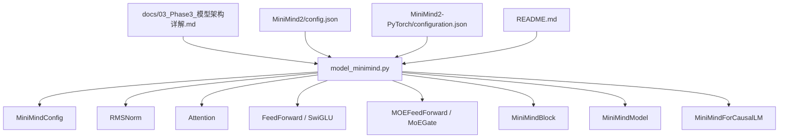
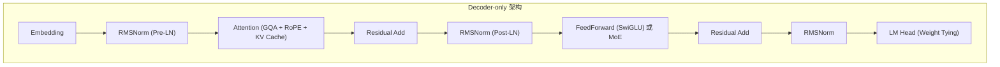
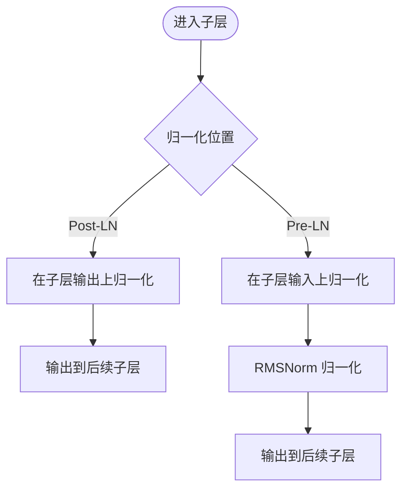
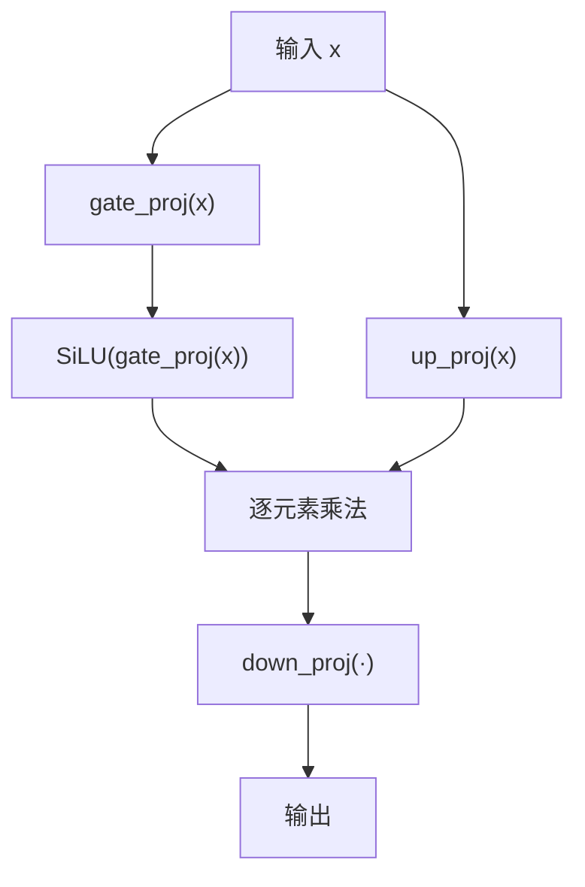
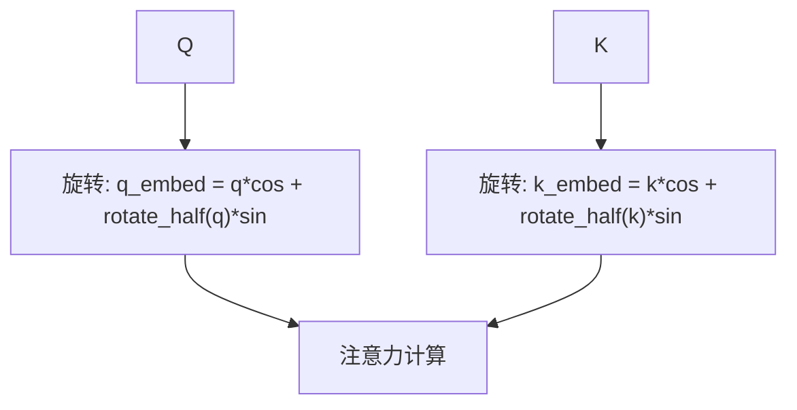
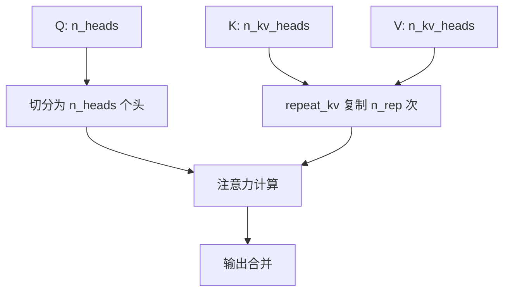
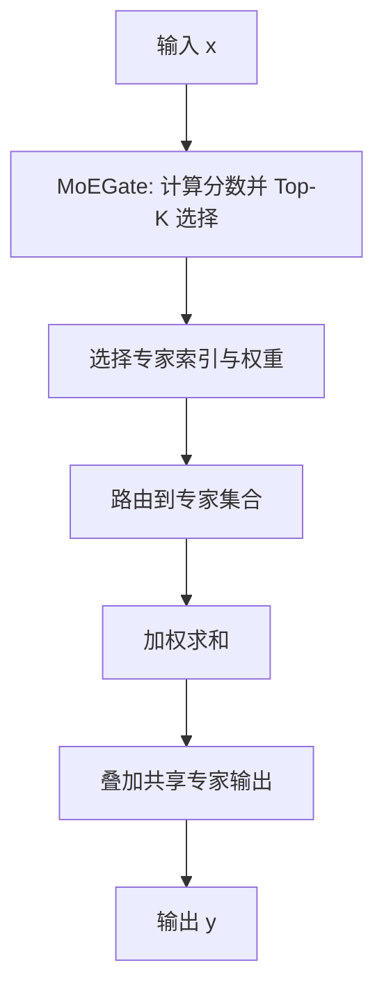
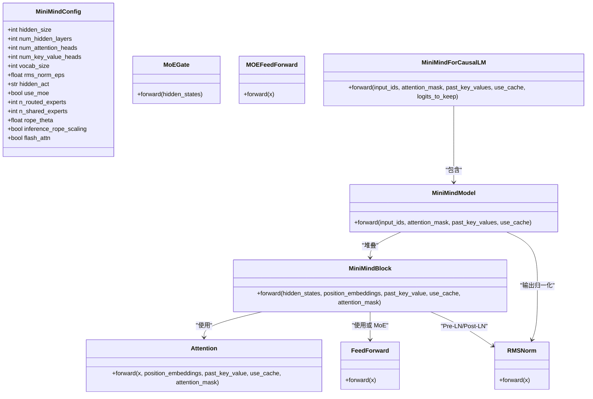
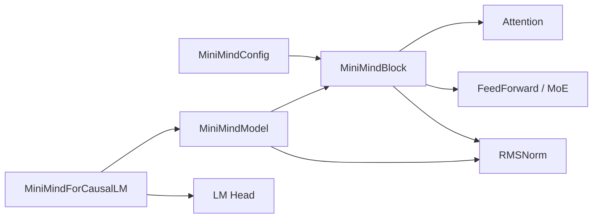

# Transformer Decoder 架构

<cite>
**本文引用的文件**
- [model_minimind.py](file://model/model_minimind.py)
- [model_minimind.py（DST训练基线）](file://DST-train/model/baseline_hf/model_minimind.py)
- [配置说明（Phase3）](file://docs/03_Phase3_模型架构详解.md)
- [MiniMind2 配置](file://MiniMind2/config.json)
- [MiniMind2-PyTorch 配置](file://MiniMind2-PyTorch/configuration.json)
- [README（项目总览）](file://README.md)
- [DST 基线配置](file://DST-train/model/baseline_hf/config.json)
</cite>

## 目录
1. [引言](#引言)
2. [项目结构](#项目结构)
3. [核心组件](#核心组件)
4. [架构总览](#架构总览)
5. [详细组件分析](#详细组件分析)
6. [依赖关系分析](#依赖关系分析)
7. [性能考量](#性能考量)
8. [故障排查指南](#故障排查指南)
9. [结论](#结论)
10. [附录](#附录)

## 引言
本文件围绕 MiniMind 的 Transformer Decoder-only 架构展开，系统阐述其设计理念、与 Encoder-Decoder 架构的区别、与 GPT-3 的架构差异，以及在 MiniMind 中的具体实现。重点解析 Pre-LN（Pre-RMSNorm）与 Post-LN 的区别、SwiGLU 激活函数的优势、RoPE 旋转位置编码、GQA（分组查询注意力）、MoE（混合专家）等关键组件，并给出架构图解、参数配置说明与与其他主流 LLM 架构的对比分析。最后提供代码实现示例路径，帮助开发者理解架构设计的权衡与技术决策。

## 项目结构
MiniMind 采用 Decoder-only 架构，核心代码集中在 model_minimind.py 中，配套文档在 docs/03_Phase3_模型架构详解.md 中有详细说明。MiniMind2 与 MiniMind2-PyTorch 提供了不同形态的配置文件，便于在 Transformers 生态与 PyTorch 原生之间切换。

图表来源
- [model_minimind.py:8-78](file://model/model_minimind.py#L8-L78)
- [model_minimind.py:95-106](file://model/model_minimind.py#L95-L106)
- [model_minimind.py:150-225](file://model/model_minimind.py#L150-L225)
- [model_minimind.py:227-241](file://model/model_minimind.py#L227-L241)
- [model_minimind.py:243-297](file://model/model_minimind.py#L243-L297)
- [model_minimind.py:361-383](file://model/model_minimind.py#L361-L383)
- [model_minimind.py:385-439](file://model/model_minimind.py#L385-L439)
- [model_minimind.py:441-475](file://model/model_minimind.py#L441-L475)

章节来源
- [model_minimind.py:1-475](file://model/model_minimind.py#L1-L475)
- [docs/03_Phase3_模型架构详解.md:1-387](file://docs/03_Phase3_模型架构详解.md#L1-L387)
- [MiniMind2/config.json:1-33](file://MiniMind2/config.json#L1-L33)
- [MiniMind2-PyTorch/configuration.json:1-1](file://MiniMind2-PyTorch/configuration.json#L1-L1)
- [README.md:608-631](file://README.md#L608-L631)

## 核心组件
- 配置类：MiniMindConfig，定义隐藏维度、层数、注意力头数、KV 头数、词表大小、RoPE theta、RMSNorm eps、是否使用 MoE、专家数等。
- 归一化：RMSNorm，Pre-LN 归一化，计算更高效，推理更快。
- 注意力：Attention，支持 Flash Attention、因果掩码、KV 复制（GQA）、RoPE 旋转位置编码、KV Cache。
- 前馈网络：FeedForward（SwiGLU），使用 SiLU 作为门控激活，中间维度按 64 对齐。
- MoE：MoEGate（Top-K 门控 + 负载均衡辅助损失）与 MOEFeedForward（路由专家 + 共享专家）。
- Transformer Block：MiniMindBlock，Pre-LN + Post-LN 结构，残差连接 + FFN/MoE。
- 模型主体：MiniMindModel，嵌入 + 多层 Block + RMSNorm。
- 语言模型头：MiniMindForCausalLM，权重共享（Embedding 与 lm_head），返回 CausalLMOutputWithPast。

章节来源
- [model_minimind.py:8-78](file://model/model_minimind.py#L8-L78)
- [model_minimind.py:95-106](file://model/model_minimind.py#L95-L106)
- [model_minimind.py:150-225](file://model/model_minimind.py#L150-L225)
- [model_minimind.py:227-241](file://model/model_minimind.py#L227-L241)
- [model_minimind.py:243-297](file://model/model_minimind.py#L243-L297)
- [model_minimind.py:361-383](file://model/model_minimind.py#L361-L383)
- [model_minimind.py:385-439](file://model/model_minimind.py#L385-L439)
- [model_minimind.py:441-475](file://model/model_minimind.py#L441-L475)

## 架构总览
MiniMind 采用 Decoder-only 架构，与 Llama3.1 一致，相较 GPT-3 的主要改进包括：
- 归一化位置：从 Post-LN（子层输出）改为 Pre-LN（子层输入），使用 RMSNorm。
- 激活函数：从 ReLU 改为 SwiGLU（SiLU 门控）。
- 位置编码：从可学习绝对位置编码改为 RoPE 旋转位置编码。
- 注意力机制：从 MHA 改为 GQA（分组查询注意力）。
- 前馈网络：从标准 FFN 改为 SwiGLU FFN 或 MoE。

图表来源
- [model_minimind.py:385-439](file://model/model_minimind.py#L385-L439)
- [model_minimind.py:361-383](file://model/model_minimind.py#L361-L383)
- [model_minimind.py:150-225](file://model/model_minimind.py#L150-L225)
- [model_minimind.py:227-241](file://model/model_minimind.py#L227-L241)
- [model_minimind.py:243-297](file://model/model_minimind.py#L243-L297)

章节来源
- [docs/03_Phase3_模型架构详解.md:7-16](file://docs/03_Phase3_模型架构详解.md#L7-L16)
- [README.md:611-616](file://README.md#L611-L616)

## 详细组件分析

### Pre-LN 与 Post-LN 的区别
- Post-LN（GPT-3）：在子层输出上进行归一化，训练稳定性较好，但在深层网络中可能出现数值不稳定。
- Pre-LN（Llama3 / MiniMind）：在子层输入上进行归一化，有利于深层网络的稳定收敛，常与 RMSNorm 配合使用，计算更高效，推理更快。
- MiniMind 使用 RMSNorm（而非 LayerNorm），在浮点计算中先归一化再缩放，减少计算量并保持数值稳定。

图表来源
- [model_minimind.py:361-383](file://model/model_minimind.py#L361-L383)
- [docs/03_Phase3_模型架构详解.md:52-76](file://docs/03_Phase3_模型架构详解.md#L52-L76)

章节来源
- [model_minimind.py:361-383](file://model/model_minimind.py#L361-L383)
- [docs/03_Phase3_模型架构详解.md:52-76](file://docs/03_Phase3_模型架构详解.md#L52-L76)

### SwiGLU 激活函数的优势
- SwiGLU 是 GLU 的变体，使用 SiLU（Sigmoid Linear Unit）作为门控激活，结合 gate_proj 与 up_proj 的逐元素乘法，增强非线性表达能力。
- 相比 ReLU，SwiGLU 在语言建模任务上通常表现更优，有助于提升困惑度与生成质量。
- 中间维度按 64 对齐，便于硬件加速与内存对齐。

图表来源
- [model_minimind.py:227-241](file://model/model_minimind.py#L227-L241)
- [docs/03_Phase3_模型架构详解.md:178-205](file://docs/03_Phase3_模型架构详解.md#L178-L205)

章节来源
- [model_minimind.py:227-241](file://model/model_minimind.py#L227-L241)
- [docs/03_Phase3_模型架构详解.md:178-205](file://docs/03_Phase3_模型架构详解.md#L178-L205)

### RoPE 旋转位置编码
- RoPE 通过旋转矩阵将位置信息注入到 Q/K 向量中，相对位置编码，利于长序列外推。
- YaRN 缩放策略可在推理时扩展到更长上下文（通过 rope_scaling 配置）。
- 应用时将 cos/sin 与 Q/K 进行旋转操作，支持 KV Cache 与 Flash Attention。

图表来源
- [model_minimind.py:108-128](file://model/model_minimind.py#L108-L128)
- [model_minimind.py:131-137](file://model/model_minimind.py#L131-L137)
- [model_minimind.py:150-225](file://model/model_minimind.py#L150-L225)

章节来源
- [model_minimind.py:108-137](file://model/model_minimind.py#L108-L137)
- [docs/03_Phase3_模型架构详解.md:77-117](file://docs/03_Phase3_模型架构详解.md#L77-L117)

### GQA（分组查询注意力）
- GQA 是 MHA 与 MQA 的折中：Q 头数为 n，KV 头数为 k，每 n/k 个 Q 头共享一组 KV 头，降低 KV 计算与存储开销。
- repeat_kv 将 KV 头复制 n_rep 次以匹配 Q 头数，支持 KV Cache，加速自回归生成。
- Flash Attention 与因果掩码结合，支持可选扩展注意力掩码。

图表来源
- [model_minimind.py:140-147](file://model/model_minimind.py#L140-L147)
- [model_minimind.py:150-225](file://model/model_minimind.py#L150-L225)

章节来源
- [model_minimind.py:140-147](file://model/model_minimind.py#L140-L147)
- [model_minimind.py:150-225](file://model/model_minimind.py#L150-L225)
- [docs/03_Phase3_模型架构详解.md:118-177](file://docs/03_Phase3_模型架构详解.md#L118-L177)

### MoE（混合专家）
- MoE 通过门控网络为每个 token 选择 Top-K 专家，结合共享专家，实现稀疏激活与负载均衡。
- 辅助损失（aux_loss）用于防止“路由崩塌”，维持专家分布均衡。
- 推理时采用 moe_infer 优化，按专家分桶处理，减少重复计算。

图表来源
- [model_minimind.py:243-297](file://model/model_minimind.py#L243-L297)
- [model_minimind.py:299-358](file://model/model_minimind.py#L299-L358)

章节来源
- [model_minimind.py:243-358](file://model/model_minimind.py#L243-L358)
- [docs/03_Phase3_模型架构详解.md:207-280](file://docs/03_Phase3_模型架构详解.md#L207-L280)

### Transformer Block 与模型主体
- MiniMindBlock：Pre-LN（input_layernorm）+ Attention + 残差 + Post-LN（post_attention_layernorm）+ FFN/MoE。
- MiniMindModel：嵌入 + 多层 Block + RMSNorm，支持 KV Cache 与 RoPE 频率缓存。
- MiniMindForCausalLM：权重共享（Embedding 与 lm_head），返回 CausalLMOutputWithPast。

图表来源
- [model_minimind.py:8-78](file://model/model_minimind.py#L8-L78)
- [model_minimind.py:95-106](file://model/model_minimind.py#L95-L106)
- [model_minimind.py:150-225](file://model/model_minimind.py#L150-L225)
- [model_minimind.py:227-241](file://model/model_minimind.py#L227-L241)
- [model_minimind.py:243-297](file://model/model_minimind.py#L243-L297)
- [model_minimind.py:299-358](file://model/model_minimind.py#L299-L358)
- [model_minimind.py:361-383](file://model/model_minimind.py#L361-L383)
- [model_minimind.py:385-439](file://model/model_minimind.py#L385-L439)
- [model_minimind.py:441-475](file://model/model_minimind.py#L441-L475)

章节来源
- [model_minimind.py:361-475](file://model/model_minimind.py#L361-L475)
- [docs/03_Phase3_模型架构详解.md:281-323](file://docs/03_Phase3_模型架构详解.md#L281-L323)

### 与 GPT-3 的架构对比
- 归一化位置：GPT-3 使用 Post-LN，MiniMind/Llama3 使用 Pre-LN（RMSNorm）。
- 激活函数：GPT-3 使用 ReLU，MiniMind 使用 SwiGLU。
- 位置编码：GPT-3 使用可学习绝对位置编码，MiniMind 使用 RoPE。
- 注意力机制：GPT-3 使用 MHA，MiniMind 使用 GQA。
- 前馈网络：GPT-3 使用标准 FFN，MiniMind 使用 SwiGLU FFN 或 MoE。

章节来源
- [docs/03_Phase3_模型架构详解.md:7-16](file://docs/03_Phase3_模型架构详解.md#L7-L16)
- [README.md:611-616](file://README.md#L611-L616)

### 与 Llama3.1 的一致性
- MiniMind 采用与 Llama3.1 一致的 Decoder-only 架构，参数配置与实现细节保持对齐，便于迁移与互操作。

章节来源
- [README.md:611-616](file://README.md#L611-L616)
- [MiniMind2/config.json:1-33](file://MiniMind2/config.json#L1-L33)

## 依赖关系分析
- 模块内依赖：MiniMindConfig 为所有模块提供统一配置；Attention 依赖 RMSNorm、RoPE 工具函数；MiniMindBlock 组合 Attention 与 FFN/MoE；MiniMindModel 组合多层 Block；MiniMindForCausalLM 组合模型与 LM 头。
- 外部依赖：依赖 transformers 的 PreTrainedModel、GenerationMixin、CausalLMOutputWithPast 等；ACT2FN 提供激活函数映射。

图表来源
- [model_minimind.py:8-78](file://model/model_minimind.py#L8-L78)
- [model_minimind.py:361-475](file://model/model_minimind.py#L361-L475)

章节来源
- [model_minimind.py:1-475](file://model/model_minimind.py#L1-L475)

## 性能考量
- 计算与内存：RMSNorm 比 LayerNorm 计算更轻量；GQA 降低 KV 计算与存储；SwiGLU 在表达能力与效率间取得平衡；MoE 通过稀疏激活降低计算量。
- 推理加速：Flash Attention 在 PyTorch 2.0+ 上提供高效实现；KV Cache 显著减少重复计算；RoPE 频率缓存避免重复预计算。
- 训练稳定性：Pre-LN + RMSNorm 有助于深层网络稳定收敛；MoE 辅助损失维持专家分布均衡。

章节来源
- [docs/03_Phase3_模型架构详解.md:164-177](file://docs/03_Phase3_模型架构详解.md#L164-L177)
- [model_minimind.py:150-225](file://model/model_minimind.py#L150-L225)
- [model_minimind.py:243-297](file://model/model_minimind.py#L243-L297)

## 故障排查指南
- 归一化与数值问题：确认使用 Pre-LN（RMSNorm）并在浮点计算中进行归一化，避免深层网络数值不稳定。
- 注意力掩码：确保因果掩码与扩展掩码正确设置，避免信息泄漏；Flash Attention 下注意掩码格式。
- KV Cache：推理时正确传递 past_key_values，避免重复计算；检查 start_pos 与 seq_len 对齐。
- RoPE：确认 rope_scaling 与 rope_theta 设置合理，避免外推异常；检查 cos/sin 频率缓存长度。
- MoE：检查门控 Top-K 选择与辅助损失，防止路由崩塌；推理时使用 moe_infer 优化。

章节来源
- [model_minimind.py:150-225](file://model/model_minimind.py#L150-L225)
- [model_minimind.py:243-297](file://model/model_minimind.py#L243-L297)
- [model_minimind.py:385-439](file://model/model_minimind.py#L385-L439)

## 结论
MiniMind 的 Transformer Decoder-only 架构在保持轻量化的同时，引入了 Pre-LN（RMSNorm）、SwiGLU、RoPE、GQA 与 MoE 等先进设计，显著提升了训练稳定性、推理效率与长序列外推能力。与 GPT-3 相比，MiniMind 更贴近 Llama3.1 的架构风格，并在实现细节上进行了针对性优化。通过合理的参数配置与工程实践，MiniMind 能够在极低成本下实现高质量的 LLM 训练与推理。

## 附录

### 参数配置说明（关键字段）
- hidden_size：隐藏维度（d_model）
- num_hidden_layers：层数
- num_attention_heads：查询头数
- num_key_value_heads：KV 头数（GQA）
- vocab_size：词表大小
- rms_norm_eps：RMSNorm epsilon
- hidden_act：激活函数（SwiGLU）
- rope_theta：RoPE 基础频率
- inference_rope_scaling：推理时启用 YaRN 外推
- flash_attn：启用 Flash Attention
- use_moe：是否使用 MoE
- n_routed_experts：路由专家数
- n_shared_experts：共享专家数
- scoring_func：门控评分函数（softmax）
- aux_loss_alpha：MoE 负载均衡辅助损失系数
- norm_topk_prob：Top-K 权重归一化

章节来源
- [model_minimind.py:8-78](file://model/model_minimind.py#L8-L78)
- [DST-train/model/baseline_hf/config.json:1-37](file://DST-train/model/baseline_hf/config.json#L1-L37)
- [MiniMind2/config.json:1-33](file://MiniMind2/config.json#L1-L33)

### 代码实现示例路径
- 配置类定义：[MiniMindConfig:8-78](file://model/model_minimind.py#L8-L78)
- RMSNorm 实现：[RMSNorm:95-106](file://model/model_minimind.py#L95-L106)
- RoPE 频率预计算：[precompute_freqs_cis:108-128](file://model/model_minimind.py#L108-L128)
- RoPE 应用：[apply_rotary_pos_emb:131-137](file://model/model_minimind.py#L131-L137)
- KV 复制：[repeat_kv:140-147](file://model/model_minimind.py#L140-L147)
- Attention 前向：[Attention.forward:169-224](file://model/model_minimind.py#L169-L224)
- SwiGLU 前向：[FeedForward.forward:239-240](file://model/model_minimind.py#L239-L240)
- MoE 门控：[MoEGate.forward:262-296](file://model/model_minimind.py#L262-L296)
- MoE 前向（训练/推理）：[MOEFeedForward.forward:314-335](file://model/model_minimind.py#L314-L335), [moe_infer:337-358](file://model/model_minimind.py#L337-L358)
- Block 前向：[MiniMindBlock.forward:374-382](file://model/model_minimind.py#L374-L382)
- 模型前向：[MiniMindModel.forward:401-438](file://model/model_minimind.py#L401-L438)
- 语言模型前向：[MiniMindForCausalLM.forward:454-474](file://model/model_minimind.py#L454-L474)