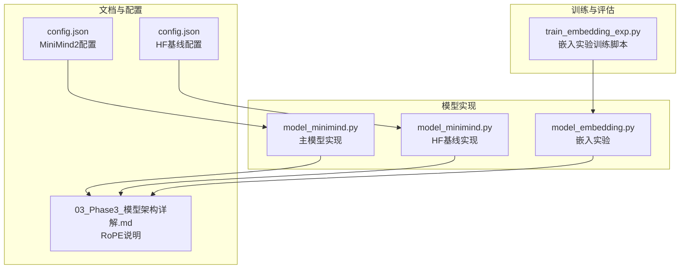
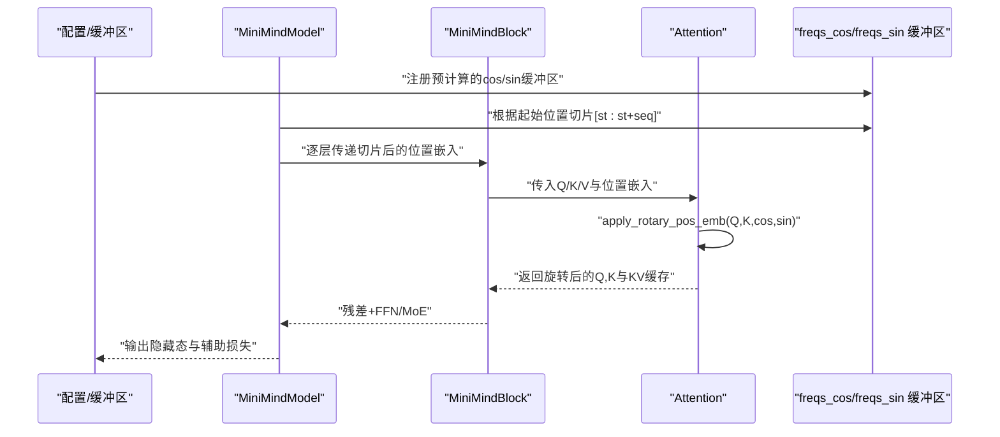
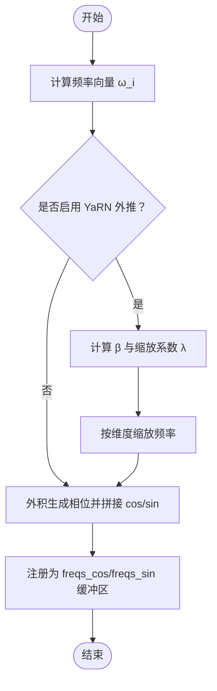
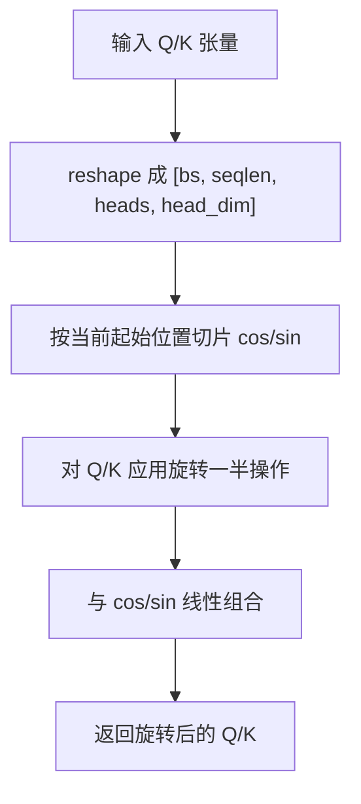
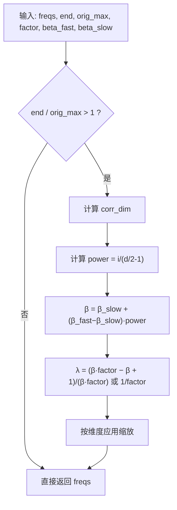
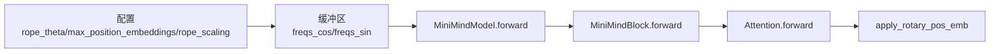

# 位置编码技术

<cite>
**本文引用的文件列表**
- [model_minimind.py](file://model/model_minimind.py)
- [model_minimind.py](file://DST-train/model/baseline_hf/model_minimind.py)
- [model_embedding.py](file://embedding-exp/model_embedding.py)
- [03_Phase3_模型架构详解.md](file://docs/03_Phase3_模型架构详解.md)
- [config.json](file://MiniMind2/config.json)
- [config.json](file://DST-train/model/baseline_hf/config.json)
- [train_embedding_exp.py](file://embedding-exp/train_embedding_exp.py)
</cite>

## 目录
1. [简介](#简介)
2. [项目结构](#项目结构)
3. [核心组件](#核心组件)
4. [架构总览](#架构总览)
5. [详细组件分析](#详细组件分析)
6. [依赖关系分析](#依赖关系分析)
7. [性能考量](#性能考量)
8. [故障排查指南](#故障排查指南)
9. [结论](#结论)
10. [附录](#附录)

## 简介
本文件系统性梳理 MiniMind 项目中的位置编码技术，重点围绕 RoPE（旋转位置编码）展开，涵盖数学原理、实现细节、YaRN 长度外推算法、相对位置编码特性，以及在长序列场景下的表现。同时提供与传统绝对位置编码的对比分析，并给出完整的代码实现路径、可视化思路与最佳实践建议。

## 项目结构
MiniMind 的位置编码实现集中在模型主干与嵌入实验两个入口中：
- 主模型实现：位于 [model_minimind.py](file://model/model_minimind.py) 与 [model_minimind.py](file://DST-train/model/baseline_hf/model_minimind.py)
- 嵌入实验（含固定/可学习坐标方案）：位于 [model_embedding.py](file://embedding-exp/model_embedding.py)
- 文档说明：位于 [03_Phase3_模型架构详解.md](file://docs/03_Phase3_模型架构详解.md)
- 配置参考：位于 [config.json](file://MiniMind2/config.json)、[config.json](file://DST-train/model/baseline_hf/config.json)
- 训练脚本（嵌入实验）：位于 [train_embedding_exp.py](file://embedding-exp/train_embedding_exp.py)

**图表来源**
- [model_minimind.py:108-128](file://model/model_minimind.py#L108-L128)
- [model_minimind.py:108-128](file://DST-train/model/baseline_hf/model_minimind.py#L108-L128)
- [model_embedding.py:123-130](file://embedding-exp/model_embedding.py#L123-L130)
- [03_Phase3_模型架构详解.md:77-116](file://docs/03_Phase3_模型架构详解.md#L77-L116)
- [config.json:15-26](file://MiniMind2/config.json#L15-L26)
- [config.json:19-30](file://DST-train/model/baseline_hf/config.json#L19-L30)
- [train_embedding_exp.py:157-162](file://embedding-exp/train_embedding_exp.py#L157-L162)

**章节来源**
- [model_minimind.py:108-128](file://model/model_minimind.py#L108-L128)
- [model_minimind.py:108-128](file://DST-train/model/baseline_hf/model_minimind.py#L108-L128)
- [model_embedding.py:123-130](file://embedding-exp/model_embedding.py#L123-L130)
- [03_Phase3_模型架构详解.md:77-116](file://docs/03_Phase3_模型架构详解.md#L77-L116)
- [config.json:15-26](file://MiniMind2/config.json#L15-L26)
- [config.json:19-30](file://DST-train/model/baseline_hf/config.json#L19-L30)
- [train_embedding_exp.py:157-162](file://embedding-exp/train_embedding_exp.py#L157-L162)

## 核心组件
- 旋转频率预计算与 YaRN 外推：[precompute_freqs_cis:108-128](file://model/model_minimind.py#L108-L128)、[precompute_freqs_cis:108-128](file://DST-train/model/baseline_hf/model_minimind.py#L108-L128)
- 旋转位置编码应用：[apply_rotary_pos_emb:131-137](file://model/model_minimind.py#L131-L137)、[apply_rotary_pos_emb:131-137](file://DST-train/model/baseline_hf/model_minimind.py#L131-L137)
- 注意力模块（含 KV 复制与缓存）：[Attention.forward:169-226](file://model/model_minimind.py#L169-L226)
- 模型前向（位置嵌入切片与层循环）：[MiniMindModel.forward:403-440](file://model/model_minimind.py#L403-L440)
- 嵌入实验（固定/可学习坐标 + RoPE）：[MiniMindEmbeddingForCausalLM.forward:132-173](file://embedding-exp/model_embedding.py#L132-L173)

**章节来源**
- [model_minimind.py:108-137](file://model/model_minimind.py#L108-L137)
- [model_minimind.py:169-226](file://model/model_minimind.py#L169-L226)
- [model_minimind.py:403-440](file://model/model_minimind.py#L403-L440)
- [model_embedding.py:132-173](file://embedding-exp/model_embedding.py#L132-L173)

## 架构总览
下图展示 RoPE 在 MiniMind 中的端到端工作流：从配置与缓冲区初始化，到前向传播中按需切片位置嵌入，再到注意力模块应用旋转。

**图表来源**
- [model_minimind.py:397-420](file://model/model_minimind.py#L397-L420)
- [model_minimind.py:376-384](file://model/model_minimind.py#L376-L384)
- [model_minimind.py:169-226](file://model/model_minimind.py#L169-L226)
- [model_minimind.py:131-137](file://model/model_minimind.py#L131-L137)

## 详细组件分析

### 数学原理与实现要点
- 频率计算：对每个维度 i 计算频率 ω_i = 1 / (θ^(2i/d))，其中 θ 为 RoPE 基础频率（默认 1e6）。随后对时间步 t 构造外积 t·ω，得到每个位置的相位，再取 cos/sin 并拼接。
- 旋转矩阵：对 Q/K 的每个头维度进行成对旋转，使用“旋转一半”操作将向量后半部分取负并与前半部分交换，等价于二维旋转矩阵作用。
- 相对位置编码：旋转后 Q·K^T 的内积仅依赖相对位置差 Δ = pos_j − pos_i，从而天然具备相对位置不变性。
- YaRN 长度外推：当序列长度超过原生最大长度时，按维度分段计算 β（随维度线性插值），并据此缩放频率，使高频分量在超出范围后按因子衰减，从而实现更长上下文的稳定外推。

**章节来源**
- [03_Phase3_模型架构详解.md:77-116](file://docs/03_Phase3_模型架构详解.md#L77-L116)
- [model_minimind.py:108-128](file://model/model_minimind.py#L108-L128)
- [model_minimind.py:131-137](file://model/model_minimind.py#L131-L137)

### 旋转矩阵构造与频率计算
- 频率向量：[precompute_freqs_cis:108-128](file://model/model_minimind.py#L108-L128) 计算 ω_i 并按位置外积生成相位，再拼接 cos/sin。
- YaRN 缩放：当 end/orig_max > 1 时，计算 β 与缩放系数 λ，对低维分量使用非线性缩放，高频分量按 1/factor 衰减。
- 缓冲区注册：在模型初始化时将 cos/sin 注册为非持久缓冲区，避免参与优化但可随设备移动。

**图表来源**
- [model_minimind.py:108-128](file://model/model_minimind.py#L108-L128)

**章节来源**
- [model_minimind.py:108-128](file://model/model_minimind.py#L108-L128)

### 如何将位置信息注入到 Q 和 K
- 应用方式：在注意力前向中，将 Q/K 投影到各头后，按位置切片对应的 cos/sin 对 Q/K 进行逐元素旋转。
- 旋转规则：对每个头的特征维度进行“旋转一半”操作，等价于二维旋转矩阵作用；随后与 cos/sin 线性组合得到旋转后的 Q/K。

**图表来源**
- [model_minimind.py:169-182](file://model/model_minimind.py#L169-L182)
- [model_minimind.py:131-137](file://model/model_minimind.py#L131-L137)

**章节来源**
- [model_minimind.py:131-137](file://model/model_minimind.py#L131-L137)
- [model_minimind.py:169-182](file://model/model_minimind.py#L169-L182)

### YaRN 长度外推算法实现
- 关键参数：original_max_position_embeddings、factor、beta_fast、beta_slow。
- 外推条件：当 end / orig_max > 1 时触发。
- 维度分段：计算临界维度 corr_dim，低于该维度使用非线性缩放，高于该维度按 1/factor 衰减。
- 缩放公式：λ = (β·α − β + 1)/(β·α)（YaRN 标准形式），其中 β 随维度线性插值。

**图表来源**
- [model_minimind.py:111-122](file://model/model_minimind.py#L111-L122)

**章节来源**
- [model_minimind.py:111-122](file://model/model_minimind.py#L111-L122)

### 相对位置编码特性
- 内积性质：旋转后 Q·K^T 仅依赖相对位置 Δ = j − i，因此注意力关注的是相对距离而非绝对位置。
- 优势：无需额外的绝对位置表征，计算高效，且在长序列中保持稳定性。

**章节来源**
- [03_Phase3_模型架构详解.md:113-116](file://docs/03_Phase3_模型架构详解.md#L113-L116)

### 在长序列处理中的表现
- 原生上限：max_position_embeddings 决定预计算缓冲区长度。
- 外推能力：通过 YaRN，可在远超原生长度的上下文中保持稳定性能。
- 实践建议：结合推理时的 rope_scaling 配置，确保在长上下文场景下仍能有效利用位置信息。

**章节来源**
- [config.json:15-16](file://MiniMind2/config.json#L15-L16)
- [config.json:19-20](file://DST-train/model/baseline_hf/config.json#L19-L20)
- [model_minimind.py:58-64](file://model/model_minimind.py#L58-L64)

### 与其他位置编码方案的对比
- 传统绝对位置编码：需要额外的可学习或可外推的位置表征，可能在长序列中出现泛化困难。
- 相对位置编码：内积仅依赖相对位置差，理论上更利于长序列建模。
- RoPE：兼具相对位置不变性与高效实现，且可通过 YaRN 外推扩展到更长序列。

**章节来源**
- [03_Phase3_模型架构详解.md:113-116](file://docs/03_Phase3_模型架构详解.md#L113-L116)

### 嵌入实验中的位置编码
嵌入实验提供了固定/可学习坐标方案，并在 forward 中同样使用预计算的 cos/sin 作为位置嵌入，验证不同嵌入策略与 RoPE 的协同效果。

**章节来源**
- [model_embedding.py:123-130](file://embedding-exp/model_embedding.py#L123-L130)
- [model_embedding.py:132-173](file://embedding-exp/model_embedding.py#L132-L173)

## 依赖关系分析
- 配置依赖：RoPE 基础频率 rope_theta、最大长度 max_position_embeddings、推理时的 rope_scaling。
- 缓冲区依赖：freqs_cos/freqs_sin 注册为非持久缓冲区，随模型移动到指定设备。
- 前向依赖：MiniMindModel 在每步前向中按 start_pos 切片位置嵌入，传递给各层。

**图表来源**
- [model_minimind.py:397-420](file://model/model_minimind.py#L397-L420)
- [model_minimind.py:403-440](file://model/model_minimind.py#L403-L440)
- [model_minimind.py:169-182](file://model/model_minimind.py#L169-L182)
- [model_minimind.py:131-137](file://model/model_minimind.py#L131-L137)

**章节来源**
- [model_minimind.py:397-420](file://model/model_minimind.py#L397-L420)
- [model_minimind.py:403-440](file://model/model_minimind.py#L403-L440)
- [model_minimind.py:169-182](file://model/model_minimind.py#L169-L182)
- [model_minimind.py:131-137](file://model/model_minimind.py#L131-L137)

## 性能考量
- 计算效率：RoPE 仅涉及逐元素乘加与少量拼接，开销远小于绝对位置表征。
- 内存占用：freqs_cos/freqs_sin 作为缓冲区注册，避免参与优化，节省显存。
- 外推成本：YaRN 在 end/orig_max > 1 时进行维度分段缩放，计算开销可控。
- 推理缓存：Attention 支持 KV 缓存，配合 RoPE 切片可实现高效自回归生成。

**章节来源**
- [03_Phase3_模型架构详解.md:113-116](file://docs/03_Phase3_模型架构详解.md#L113-L116)
- [model_minimind.py:198-226](file://model/model_minimind.py#L198-L226)
- [model_minimind.py:403-440](file://model/model_minimind.py#L403-L440)

## 故障排查指南
- 位置嵌入越界：确认 max_position_embeddings 是否覆盖实际序列长度；若需更长上下文，启用 rope_scaling 并设置合理的 factor 与 beta 参数。
- 设备不匹配：检查 freqs_cos/freqs_sin 是否与模型在同一设备；缓冲区注册为非持久，需确保模型移动到正确设备。
- 推理时外推异常：核对推理配置中的 rope_scaling 字段，确保 original_max_position_embeddings、factor、beta_fast、beta_slow 合理设置。
- 嵌入实验训练：注意 DDP 场景下对缓冲区的忽略配置，避免分布式同步问题。

**章节来源**
- [model_minimind.py:397-401](file://model/model_minimind.py#L397-L401)
- [train_embedding_exp.py:190-193](file://embedding-exp/train_embedding_exp.py#L190-L193)

## 结论
MiniMind 的位置编码体系以 RoPE 为核心，结合 YaRN 外推算法，在保持相对位置不变性的前提下，实现了高效的长序列建模。通过预计算与缓冲区注册，既降低了内存与计算开销，又保证了推理时的灵活性。嵌入实验进一步验证了不同嵌入策略与 RoPE 的协同效果，为后续扩展与优化提供了实践基础。

## 附录
- 可视化建议：绘制不同位置的 cos/sin 分量随维度变化的曲线，观察旋转后 Q/K 的相位分布；或绘制注意力权重随相对位置的变化，验证相对位置不变性。
- 最佳实践：在长上下文任务中启用 rope_scaling；合理设置 rope_theta 与 head_dim，平衡频率分辨率与数值稳定性；在 DDP 训练中注意缓冲区的设备与同步策略。