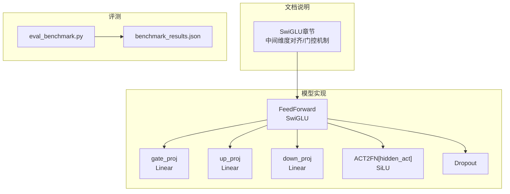
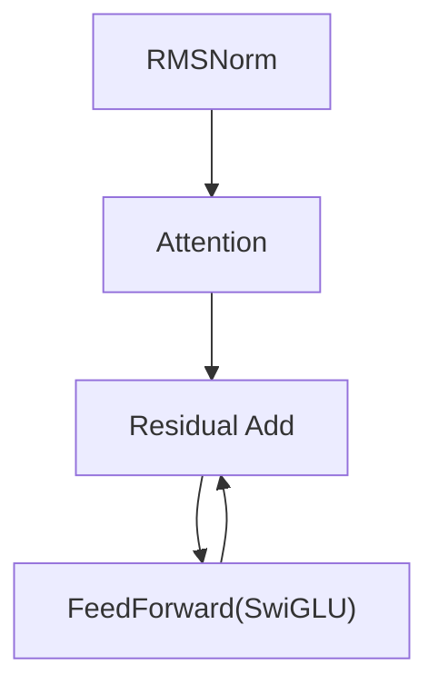
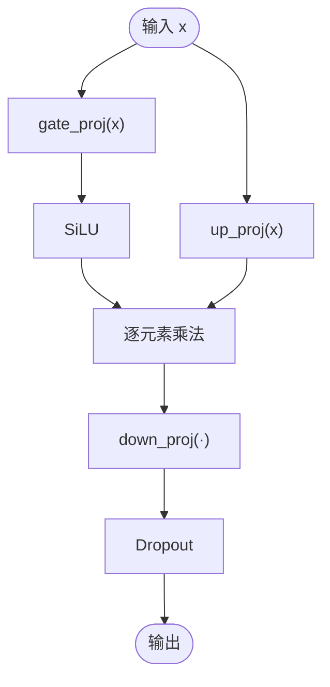
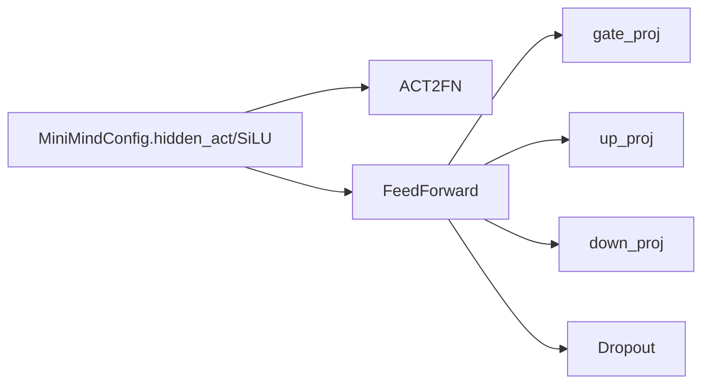

# 前馈网络设计

<cite>
**本文引用的文件**
- [model_minimind.py](file://model/model_minimind.py)
- [03_Phase3_模型架构详解.md](file://docs/03_Phase3_模型架构详解.md)
- [benchmark_results.json](file://reports/20260429/benchmark_results.json)
- [eval_benchmark.py](file://eval_benchmark.py)
</cite>

## 目录
1. [简介](#简介)
2. [项目结构](#项目结构)
3. [核心组件](#核心组件)
4. [架构总览](#架构总览)
5. [详细组件分析](#详细组件分析)
6. [依赖关系分析](#依赖关系分析)
7. [性能考量](#性能考量)
8. [故障排查指南](#故障排查指南)
9. [结论](#结论)
10. [附录](#附录)

## 简介
本文件聚焦于MiniMind项目中的前馈网络（FeedForward Network, FFN）设计，系统阐述SwiGLU（SiLU门控线性单元）的实现原理、与传统FFN及GLU/GELU等激活函数的差异、中间维度自动对齐策略、权重初始化与Dropout应用，并给出完整的SwiGLU计算流程图与数学推导。同时结合项目中的基准评测结果，提供性能评估视角与实践建议。

## 项目结构
- 前馈网络的核心实现位于模型文件中，采用SwiGLU结构，包含门控投影（gate_proj）、上投影（up_proj）与下投影（down_proj），并通过逐元素乘法实现门控机制。
- 文档中对SwiGLU的结构、中间维度对齐、激活函数选择（SiLU）进行了详细说明。
- 基准评测脚本用于评估模型在多选题任务上的表现，可用于对比不同激活函数或FFN变体的性能影响。

图表来源
- [model_minimind.py:229-243](file://model/model_minimind.py#L229-L243)
- [03_Phase3_模型架构详解.md:178-205](file://docs/03_Phase3_模型架构详解.md#L178-L205)
- [eval_benchmark.py:1-319](file://eval_benchmark.py#L1-L319)
- [benchmark_results.json:1-494](file://reports/20260429/benchmark_results.json#L1-L494)

章节来源
- [model_minimind.py:229-243](file://model/model_minimind.py#L229-L243)
- [03_Phase3_模型架构详解.md:178-205](file://docs/03_Phase3_模型架构详解.md#L178-L205)
- [eval_benchmark.py:1-319](file://eval_benchmark.py#L1-L319)
- [benchmark_results.json:1-494](file://reports/20260429/benchmark_results.json#L1-L494)

## 核心组件
- FeedForward（SwiGLU）：由三个线性层组成，分别负责门控投影、上投影与下投影；通过SiLU激活与逐元素乘法实现门控，最后经Dropout与下投影输出。
- 中间维度对齐：根据隐藏维度自动计算并向上对齐到64的倍数，提升张量运算效率。
- 激活函数：通过配置项选择，当前默认为SiLU（Swish），文档中明确指出使用SiLU替代ReLU。
- Dropout：在FFN输出端应用，控制过拟合并提升泛化能力。

章节来源
- [model_minimind.py:229-243](file://model/model_minimind.py#L229-L243)
- [03_Phase3_模型架构详解.md:178-205](file://docs/03_Phase3_模型架构详解.md#L178-L205)

## 架构总览
SwiGLU在MiniMind中作为Transformer Block的MLP子层使用，遵循Pre-LN结构：先进行RMSNorm，再进入注意力与FFN。FFN内部的门控机制通过两个分支并行计算，最终融合输出。

图表来源
- [model_minimind.py:363-384](file://model/model_minimind.py#L363-L384)

章节来源
- [model_minimind.py:363-384](file://model/model_minimind.py#L363-L384)

## 详细组件分析

### SwiGLU（SiLU门控线性单元）设计原理
- 门控投影（gate_proj）：将输入映射到中间维度，随后通过SiLU激活。
- 上投影（up_proj）：将输入映射到相同中间维度，作为门控信号的另一路。
- 逐元素乘法：将SiLU(gate_proj(x))与up_proj(x)逐元素相乘，形成门控输出。
- 下投影（down_proj）：将门控输出映射回隐藏维度。
- Dropout：在下投影之后应用，控制过拟合。

图表来源
- [model_minimind.py:229-243](file://model/model_minimind.py#L229-L243)
- [03_Phase3_模型架构详解.md:178-205](file://docs/03_Phase3_模型架构详解.md#L178-L205)

章节来源
- [model_minimind.py:229-243](file://model/model_minimind.py#L229-L243)
- [03_Phase3_模型架构详解.md:178-205](file://docs/03_Phase3_模型架构详解.md#L178-L205)

### 与传统FFN的区别
- 传统FFN通常采用单线性层+激活函数+单线性层的两层结构。
- SwiGLU引入门控机制，将输入同时送入两个分支，通过逐元素乘法融合，理论上能更好地建模复杂特征交互与非线性变换。

章节来源
- [03_Phase3_模型架构详解.md:178-205](file://docs/03_Phase3_模型架构详解.md#L178-L205)

### 与GLU、GELU的对比分析
- GLU（Gated Linear Unit）：与SwiGLU类似，但通常使用sigmoid作为门控激活；SwiGLU使用SiLU，具有更好的梯度性质与实证效果。
- GELU：非门控结构，仅通过激活函数引入非线性；在某些任务上表现良好，但在需要显式门控的场景下，SwiGLU可能更具表达力。
- 本项目默认使用SiLU（SwiGLU），文档中明确指出使用SiLU替代ReLU。

章节来源
- [03_Phase3_模型架构详解.md:178-205](file://docs/03_Phase3_模型架构详解.md#L178-L205)

### 中间维度的自动对齐
- 计算公式：intermediate_size = ceil(8/3 * hidden_size) / 64 * 64，确保中间维度为64的倍数。
- 优势：提升张量核函数与内存访问效率，降低碎片化，提高吞吐。

章节来源
- [model_minimind.py:232-235](file://model/model_minimind.py#L232-L235)
- [03_Phase3_模型架构详解.md:185-187](file://docs/03_Phase3_模型架构详解.md#L185-L187)

### 权重初始化策略
- 门控层（gate_proj/up_proj/down_proj）：使用无偏置线性层，未见专门的门控权重初始化策略；通常由PyTorch默认初始化。
- 激活函数：通过配置项hidden_act选择，当前默认SiLU。
- Dropout：在FFN输出端应用，配置项dropout控制概率。

章节来源
- [model_minimind.py:235-239](file://model/model_minimind.py#L235-L239)
- [model_minimind.py:242](file://model/model_minimind.py#L242)
- [03_Phase3_模型架构详解.md:181-196](file://docs/03_Phase3_模型架构详解.md#L181-L196)

### Dropout的应用
- 在FFN输出端应用Dropout，有助于正则化与泛化，缓解过拟合风险。

章节来源
- [model_minimind.py:238](file://model/model_minimind.py#L238)
- [model_minimind.py:242](file://model/model_minimind.py#L242)

### SwiGLU计算流程图与数学推导
- 数学形式：y = Dropout(down_proj(SiLU(gate_proj(x)) ⊙ up_proj(x)))，其中⊙表示逐元素乘法。
- 流程图已在“SwiGLU（SiLU门控线性单元）设计原理”小节给出。

章节来源
- [model_minimind.py:241-242](file://model/model_minimind.py#L241-L242)
- [03_Phase3_模型架构详解.md:194-196](file://docs/03_Phase3_模型架构详解.md#L194-L196)

### 与MoE FFN的关系
- 当配置use_moe为True时，MLP替换为MOEFeedForward；否则使用上述SwiGLU FFN。
- MoE FFN通过门控选择专家并加权聚合，适合大规模参数扩展；SwiGLU FFN则提供高效的单体前馈路径。

章节来源
- [model_minimind.py:374](file://model/model_minimind.py#L374)
- [model_minimind.py:301-337](file://model/model_minimind.py#L301-L337)

## 依赖关系分析
- FeedForward依赖ACT2FN提供的激活函数（默认SiLU），并依赖三个线性层（gate_proj/up_proj/down_proj）与Dropout。
- 中间维度对齐策略与配置项intermediate_size相关，确保与硬件/库优化兼容。

图表来源
- [model_minimind.py:239](file://model/model_minimind.py#L239)
- [model_minimind.py:235-239](file://model/model_minimind.py#L235-L239)
- [model_minimind.py:242](file://model/model_minimind.py#L242)

章节来源
- [model_minimind.py:235-242](file://model/model_minimind.py#L235-L242)

## 性能考量
- 计算效率优势：SwiGLU通过门控机制与逐元素乘法，能够在保持较低中间维度的同时提升表达能力；中间维度对齐到64的倍数有利于张量核优化。
- 内存与吞吐：对齐到64的倍数可减少内存碎片，提升访存与计算吞吐。
- 基准评测：项目提供了多选题评测脚本与结果JSON，可用于评估不同配置下的性能表现。当前基准结果展示了C-Eval与CMMLU的总体准确率与各科目分布，可作为SwiGLU在下游任务中的性能参考。

章节来源
- [eval_benchmark.py:1-319](file://eval_benchmark.py#L1-L319)
- [benchmark_results.json:1-494](file://reports/20260429/benchmark_results.json#L1-L494)

## 故障排查指南
- 激活函数不匹配：确认配置项hidden_act是否为SiLU；若需更换，需确保ACT2FN支持该激活函数。
- 中间维度异常：检查intermediate_size是否按64对齐；若手动修改，需确保与下游线性层形状一致。
- Dropout导致训练不稳定：适当降低dropout或检查学习率；在验证集上观察过拟合迹象。
- 性能不达预期：结合基准评测脚本，对比不同配置（如use_moe开关、hidden_size等）对准确率与速度的影响。

章节来源
- [model_minimind.py:232-239](file://model/model_minimind.py#L232-L239)
- [eval_benchmark.py:1-319](file://eval_benchmark.py#L1-L319)

## 结论
MiniMind的SwiGLU FFN通过门控机制与SiLU激活，在保持高效计算的同时提升了非线性表达能力。中间维度对齐策略与Dropout应用进一步增强了工程实用性与稳定性。结合基准评测结果，SwiGLU在多选题任务上具备良好的性能基础；在更大规模或更复杂的任务中，可考虑MoE FFN以扩展容量。

## 附录
- 激活函数选择：默认SiLU，文档明确指出使用SiLU替代ReLU。
- 中间维度对齐：自动对齐到64的倍数，提升张量运算效率。
- 基准评测：提供C-Eval与CMMLU的评测脚本与结果JSON，便于快速评估模型性能。

章节来源
- [03_Phase3_模型架构详解.md:178-205](file://docs/03_Phase3_模型架构详解.md#L178-L205)
- [eval_benchmark.py:1-319](file://eval_benchmark.py#L1-L319)
- [benchmark_results.json:1-494](file://reports/20260429/benchmark_results.json#L1-L494)