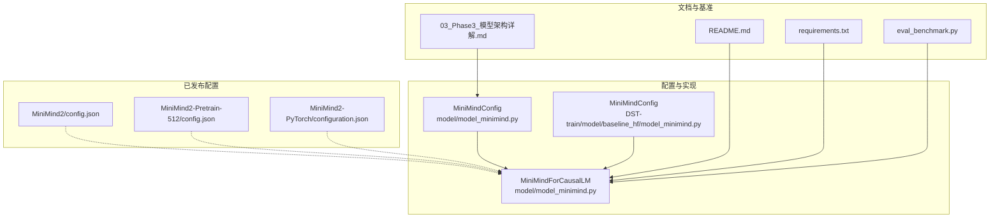
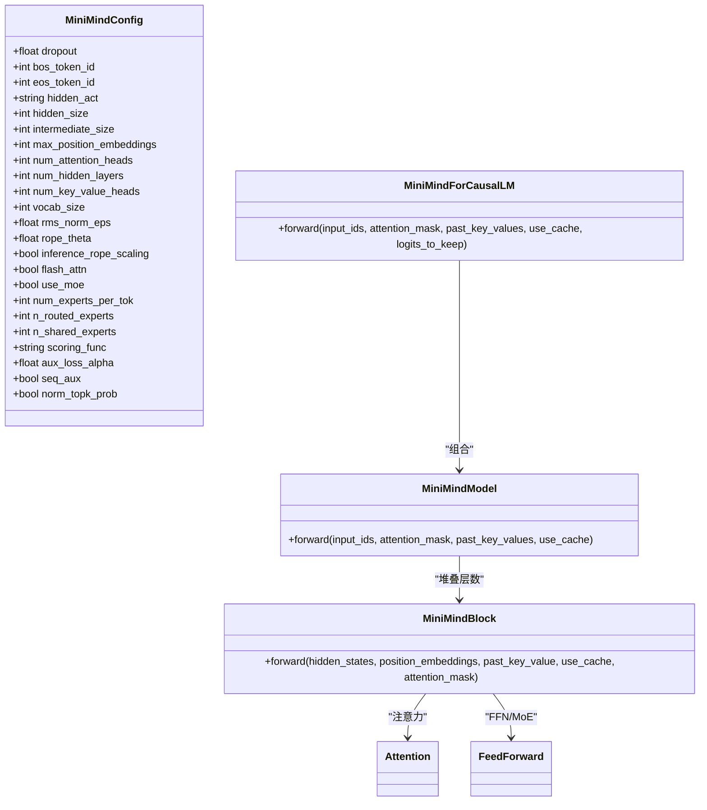
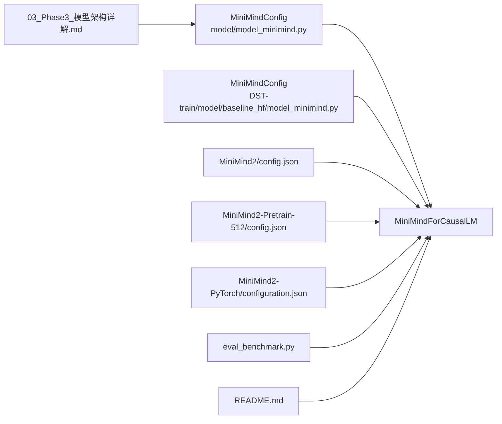

# 模型配置与参数

<cite>
**本文引用的文件**
- [model/model_minimind.py](file://model/model_minimind.py)
- [DST-train/model/baseline_hf/model_minimind.py](file://DST-train/model/baseline_hf/model_minimind.py)
- [MiniMind2/config.json](file://MiniMind2/config.json)
- [MiniMind2-Pretrain-512/config.json](file://MiniMind2-Pretrain-512/config.json)
- [MiniMind2-PyTorch/configuration.json](file://MiniMind2-PyTorch/configuration.json)
- [docs/03_Phase3_模型架构详解.md](file://docs/03_Phase3_模型架构详解.md)
- [README.md](file://README.md)
- [requirements.txt](file://requirements.txt)
- [eval_benchmark.py](file://eval_benchmark.py)
</cite>

## 目录
1. [简介](#简介)
2. [项目结构](#项目结构)
3. [核心组件](#核心组件)
4. [架构总览](#架构总览)
5. [详细组件分析](#详细组件分析)
6. [依赖分析](#依赖分析)
7. [性能考量](#性能考量)
8. [故障排查指南](#故障排查指南)
9. [结论](#结论)
10. [附录](#附录)

## 简介
本文件面向MiniMind项目的模型配置系统，围绕MiniMindConfig配置类展开，系统阐述各参数的作用、默认值、典型取值范围及对模型性能的影响；给出隐藏层维度、层数、注意力头数、KV头数等关键参数的调优建议；对比MiniMind2系列不同变体（MiniMind2-Small、MiniMind2、MiniMind2-MoE）的配置差异与参数量估算；提供参数敏感性分析、推荐配置方案与最佳实践，并结合仓库中的配置文件与文档进行交叉验证。

## 项目结构
与模型配置相关的核心文件分布如下：
- 配置类与模型实现：model/model_minimind.py、DST-train/model/baseline_hf/model_minimind.py
- 已发布的MiniMind2系列配置：MiniMind2/config.json、MiniMind2-Pretrain-512/config.json
- PyTorch框架声明：MiniMind2-PyTorch/configuration.json
- 架构与参数量说明：docs/03_Phase3_模型架构详解.md
- 项目说明与模型列表：README.md
- 依赖版本：requirements.txt
- 基准评测脚本（用于验证加载与参数量）：eval_benchmark.py

**图表来源**
- [model/model_minimind.py:8-78](file://model/model_minimind.py#L8-L78)
- [DST-train/model/baseline_hf/model_minimind.py:8-78](file://DST-train/model/baseline_hf/model_minimind.py#L8-L78)
- [MiniMind2/config.json:1-33](file://MiniMind2/config.json#L1-L33)
- [MiniMind2-Pretrain-512/config.json:1-33](file://MiniMind2-Pretrain-512/config.json#L1-L33)
- [MiniMind2-PyTorch/configuration.json:1-1](file://MiniMind2-PyTorch/configuration.json#L1-L1)
- [docs/03_Phase3_模型架构详解.md:1-387](file://docs/03_Phase3_模型架构详解.md#L1-L387)
- [README.md:90-122](file://README.md#L90-L122)
- [requirements.txt:1-31](file://requirements.txt#L1-L31)
- [eval_benchmark.py:18-31](file://eval_benchmark.py#L18-L31)

**章节来源**
- [model/model_minimind.py:1-477](file://model/model_minimind.py#L1-L477)
- [DST-train/model/baseline_hf/model_minimind.py:1-477](file://DST-train/model/baseline_hf/model_minimind.py#L1-L477)
- [MiniMind2/config.json:1-33](file://MiniMind2/config.json#L1-L33)
- [MiniMind2-Pretrain-512/config.json:1-33](file://MiniMind2-Pretrain-512/config.json#L1-L33)
- [MiniMind2-PyTorch/configuration.json:1-1](file://MiniMind2-PyTorch/configuration.json#L1-L1)
- [docs/03_Phase3_模型架构详解.md:1-387](file://docs/03_Phase3_模型架构详解.md#L1-L387)
- [README.md:90-122](file://README.md#L90-L122)
- [requirements.txt:1-31](file://requirements.txt#L1-L31)
- [eval_benchmark.py:18-31](file://eval_benchmark.py#L18-L31)

## 核心组件
本节聚焦MiniMindConfig配置类及其关键参数，解释默认值、取值范围与影响。

- 模型类型与基础参数
  - model_type: "minimind"
  - dropout: 默认0.0，控制注意力与FFN的丢弃率
  - bos_token_id/eos_token_id: 默认1/2，用于生成起止标记
  - hidden_act: 默认"silu"，激活函数
  - hidden_size: 默认512，隐藏层维度
  - intermediate_size: 默认None，按规则对齐到64的倍数
  - max_position_embeddings: 默认32768，最大序列长度
  - num_attention_heads: 默认8，查询头数
  - num_hidden_layers: 默认8，Transformer层数
  - num_key_value_heads: 默认2，KV头数（GQA）
  - vocab_size: 默认6400，词表大小
  - rms_norm_eps: 默认1e-5，RMSNorm的数值稳定项
  - rope_theta: 默认1000000.0，RoPE频率基础
  - inference_rope_scaling: 默认False，是否启用推理时的YARN外推
  - flash_attn: 默认True，是否启用Flash Attention

- MoE专用参数（use_moe为True时生效）
  - use_moe: 默认False
  - num_experts_per_tok: 默认2，每个token选择的专家数
  - n_routed_experts: 默认4，可路由专家总数
  - n_shared_experts: 默认1，共享专家数
  - scoring_func: 默认"softmax"，专家打分函数
  - aux_loss_alpha: 默认0.1，辅助损失系数
  - seq_aux: 默认True，是否按序列级别计算辅助损失
  - norm_topk_prob: 默认True，是否对Top-K概率归一化

- 关键参数对性能的影响
  - hidden_size：越大表达能力越强，但参数量与显存开销显著上升
  - num_hidden_layers：增加层数可提升拟合能力，但训练难度与计算量随之上升
  - num_attention_heads与num_key_value_heads：决定注意力并行度与KV重复策略，影响吞吐与显存
  - intermediate_size：SwiGLU FFN的宽度，影响非线性表达能力
  - rope_theta与inference_rope_scaling：影响长序列外推能力与位置编码稳定性
  - flash_attn：在支持的硬件上可显著提升注意力计算效率
  - MoE参数：在保持相似FLOPs的前提下扩大有效容量，但引入路由与负载均衡开销

**章节来源**
- [model/model_minimind.py: MiniMindConfig.__init__:11-78](file://model/model_minimind.py#L11-L78)
- [DST-train/model/baseline_hf/model_minimind.py: MiniMindConfig.__init__:11-78](file://DST-train/model/baseline_hf/model_minimind.py#L11-L78)
- [docs/03_Phase3_模型架构详解.md: 参数与组件说明:17-117](file://docs/03_Phase3_模型架构详解.md#L17-L117)

## 架构总览
MiniMind采用Decoder-only Transformer，结合RMSNorm、RoPE、GQA与可选MoE模块。配置类贯穿模型初始化与前向传播，确保参数一致性与可移植性。

**图表来源**
- [model/model_minimind.py: MiniMindConfig:8-78](file://model/model_minimind.py#L8-L78)
- [model/model_minimind.py: MiniMindForCausalLM:443-477](file://model/model_minimind.py#L443-L477)
- [model/model_minimind.py: MiniMindModel:387-441](file://model/model_minimind.py#L387-L441)
- [model/model_minimind.py: MiniMindBlock:363-384](file://model/model_minimind.py#L363-L384)

**章节来源**
- [model/model_minimind.py:8-477](file://model/model_minimind.py#L8-L477)

## 详细组件分析

### MiniMindConfig参数详解与默认值
- 基础参数
  - hidden_size：控制注意力与FFN通道宽度
  - num_attention_heads/num_key_value_heads：决定Q/KV头数与GQA比例
  - intermediate_size：若未指定，按8/3规则向上对齐到64倍数
  - max_position_embeddings：影响RoPE频率表规模与缓存长度
  - rope_theta/inference_rope_scaling：影响位置编码尺度与长序列外推
  - flash_attn：在满足条件时使用高效注意力内核
  - dropout/rms_norm_eps：正则化与数值稳定
  - bos_token_id/eos_token_id/vocab_size：生成与词表控制

- MoE参数
  - use_moe/n_routed_experts：是否启用MoE与专家总数
  - num_experts_per_tok/n_shared_experts：路由粒度与共享专家
  - scoring_func：专家打分函数（当前实现为softmax）
  - aux_loss_alpha/seq_aux/norm_topk_prob：辅助损失与概率归一化

- 参数敏感性分析要点
  - hidden_size与num_hidden_layers：对表达能力与资源消耗呈非线性影响
  - GQA（num_attention_heads与num_key_value_heads）：KV重复次数影响显存与吞吐平衡
  - MoE：在训练稳定性（辅助损失）与计算开销之间权衡

**章节来源**
- [model/model_minimind.py: MiniMindConfig.__init__:11-78](file://model/model_minimind.py#L11-L78)
- [docs/03_Phase3_模型架构详解.md: 参数与组件说明:17-117](file://docs/03_Phase3_模型架构详解.md#L17-L117)

### MiniMind2系列配置对比
- MiniMind2-Small（来自文档参数量表）
  - hidden_size=512, num_hidden_layers=8, num_attention_heads=8, num_key_value_heads=2
  - 参数量约26M（文档表格与实现一致）

- MiniMind2（来自MiniMind2/config.json）
  - hidden_size=768, num_hidden_layers=16, num_attention_heads=8, num_key_value_heads=2
  - 参数量约104M（文档表格与配置一致）

- MiniMind2-MoE（来自文档参数量表）
  - hidden_size=640（文档表格），n_routed_experts=4, n_shared_experts=1
  - 参数量约145M（文档表格）

- 预训练配置（MiniMind2-Pretrain-512）
  - hidden_size=512, num_hidden_layers=8, num_attention_heads=8, num_key_value_heads=2
  - 与MiniMind2-Small同结构，但用于预训练场景

- PyTorch框架声明
  - MiniMind2-PyTorch/configuration.json声明框架与任务类型

**章节来源**
- [docs/03_Phase3_模型架构详解.md: 参数量表与对比:19-24](file://docs/03_Phase3_模型架构详解.md#L19-L24)
- [MiniMind2/config.json:1-33](file://MiniMind2/config.json#L1-L33)
- [MiniMind2-Pretrain-512/config.json:1-33](file://MiniMind2-Pretrain-512/config.json#L1-L33)
- [MiniMind2-PyTorch/configuration.json:1-1](file://MiniMind2-PyTorch/configuration.json#L1-L1)

### 参数量计算方法与内存占用分析
- 文档提供的计算思路（以MiniMind2-Small为例）
  - 单层参数量主要由Embedding、Q/K/V/O投影、FFN（或MoE）与RMSNorm组成
  - 8层叠加后加上Embedding与lm_head权重，总计约25.8M
- 实践验证
  - eval_benchmark.py展示了如何加载模型并统计参数量（单位M）

- 内存占用
  - README中给出了MiniMind2系列的推理内存占用近似值（如26M模型约0.5GB，104M/145M模型约1GB）
  - 实际显存占用还受dtype（如float16）、KV缓存、batch大小等因素影响

**章节来源**
- [docs/03_Phase3_模型架构详解.md: 参数量计算:324-342](file://docs/03_Phase3_模型架构详解.md#L324-L342)
- [eval_benchmark.py: 加载与参数量统计:18-31](file://eval_benchmark.py#L18-L31)
- [README.md: 模型列表与内存占用:95-107](file://README.md#L95-L107)

### 推荐配置方案与最佳实践
- 小型对话/边缘部署
  - MiniMind2-Small（hidden_size=512, layers=8）：参数量小、显存占用低，适合资源受限场景
- 中型通用对话
  - MiniMind2（hidden_size=768, layers=16）：在参数量与性能间取得较好平衡
- 高质量生成/长文本
  - 结合RoPE外推（inference_rope_scaling）与适当增大hidden_size/层数，注意显存预算
- MoE变体
  - 在保持FLOPs前提下扩大容量，需关注辅助损失与路由稳定性；建议从较小n_routed_experts起步
- 训练与推理一致性
  - 若使用第三方推理框架（如vLLM、llama.cpp），注意位置编码与权重共享的兼容性

**章节来源**
- [docs/03_Phase3_模型架构详解.md: 架构与组件:5-323](file://docs/03_Phase3_模型架构详解.md#L5-L323)
- [README.md: 模型列表与兼容性说明:144-162](file://README.md#L144-L162)

## 依赖分析
- 配置类与模型实现
  - MiniMindConfig在model/model_minimind.py与DST-train/model/baseline_hf/model_minimind.py中定义一致，确保两套实现兼容
- 发布配置
  - MiniMind2/config.json与MiniMind2-Pretrain-512/config.json分别代表不同训练阶段的配置
  - MiniMind2-PyTorch/configuration.json声明框架类型
- 文档与基准
  - docs/03_Phase3_模型架构详解.md提供参数量与架构细节
  - eval_benchmark.py可用于验证加载与参数量
  - README.md提供模型列表与内存占用参考

**图表来源**
- [model/model_minimind.py:8-78](file://model/model_minimind.py#L8-L78)
- [DST-train/model/baseline_hf/model_minimind.py:8-78](file://DST-train/model/baseline_hf/model_minimind.py#L8-L78)
- [MiniMind2/config.json:1-33](file://MiniMind2/config.json#L1-L33)
- [MiniMind2-Pretrain-512/config.json:1-33](file://MiniMind2-Pretrain-512/config.json#L1-L33)
- [MiniMind2-PyTorch/configuration.json:1-1](file://MiniMind2-PyTorch/configuration.json#L1-L1)
- [docs/03_Phase3_模型架构详解.md:1-387](file://docs/03_Phase3_模型架构详解.md#L1-L387)
- [eval_benchmark.py:18-31](file://eval_benchmark.py#L18-L31)
- [README.md:90-122](file://README.md#L90-L122)

**章节来源**
- [model/model_minimind.py:1-477](file://model/model_minimind.py#L1-L477)
- [DST-train/model/baseline_hf/model_minimind.py:1-477](file://DST-train/model/baseline_hf/model_minimind.py#L1-L477)
- [MiniMind2/config.json:1-33](file://MiniMind2/config.json#L1-L33)
- [MiniMind2-Pretrain-512/config.json:1-33](file://MiniMind2-Pretrain-512/config.json#L1-L33)
- [MiniMind2-PyTorch/configuration.json:1-1](file://MiniMind2-PyTorch/configuration.json#L1-L1)
- [docs/03_Phase3_模型架构详解.md:1-387](file://docs/03_Phase3_模型架构详解.md#L1-L387)
- [eval_benchmark.py:18-31](file://eval_benchmark.py#L18-L31)
- [README.md:90-122](file://README.md#L90-L122)

## 性能考量
- 计算效率
  - Flash Attention在满足条件时可显著降低注意力计算时间
  - GQA通过减少KV头数与重复次数，在保持效果的同时降低显存与吞吐压力
- 显存与吞吐
  - hidden_size与层数对显存占用影响显著；可通过梯度检查点、混合精度等手段缓解
  - KV缓存对长序列生成至关重要，需结合max_position_embeddings与推理缓存策略
- 长序列与位置编码
  - inference_rope_scaling启用后可利用YARN外推，提升长上下文稳定性
- MoE稳定性
  - 辅助损失有助于避免路由崩塌；建议从较小n_routed_experts与较低aux_loss_alpha起步

**章节来源**
- [model/model_minimind.py: Attention.forward:169-226](file://model/model_minimind.py#L169-L226)
- [model/model_minimind.py: MoEGate.forward:264-298](file://model/model_minimind.py#L264-L298)
- [docs/03_Phase3_模型架构详解.md: GQA与RoPE说明:118-177](file://docs/03_Phase3_模型架构详解.md#L118-L177)

## 故障排查指南
- 模型加载与参数量
  - 使用eval_benchmark.py可验证模型加载成功并打印参数量，便于确认配置与权重匹配
- 推理兼容性
  - README指出迁移至第三方推理框架（如llama.cpp、vllm）时的注意事项与兼容性变化
- MoE相关问题
  - 若出现训练不稳定或路由集中，检查aux_loss_alpha与norm_topk_prob设置，逐步调整n_routed_experts与num_experts_per_tok

**章节来源**
- [eval_benchmark.py: 加载与参数量统计:18-31](file://eval_benchmark.py#L18-L31)
- [README.md: 兼容性说明:144-162](file://README.md#L144-L162)
- [model/model_minimind.py: MoE辅助损失:279-298](file://model/model_minimind.py#L279-L298)

## 结论
MiniMindConfig提供了清晰、可移植的配置入口，覆盖注意力、位置编码、FFN/MoE等关键模块。通过合理设置hidden_size、层数、注意力头数与MoE参数，可在参数量、显存占用与生成质量之间取得平衡。结合仓库中的配置文件与文档，可快速定位目标变体并进行针对性调优。

## 附录

### 配置参数对照表（摘要）
- 基础参数
  - hidden_size、num_hidden_layers、num_attention_heads、num_key_value_heads、intermediate_size、max_position_embeddings、rope_theta、inference_rope_scaling、flash_attn、dropout、rms_norm_eps、bos/eos、vocab_size
- MoE参数
  - use_moe、n_routed_experts、n_shared_experts、num_experts_per_tok、scoring_func、aux_loss_alpha、seq_aux、norm_topk_prob

**章节来源**
- [model/model_minimind.py: MiniMindConfig.__init__:11-78](file://model/model_minimind.py#L11-L78)
- [docs/03_Phase3_模型架构详解.md: 参数与组件说明:17-117](file://docs/03_Phase3_模型架构详解.md#L17-L117)