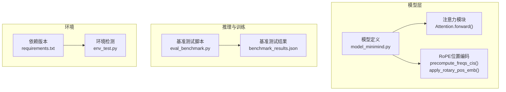
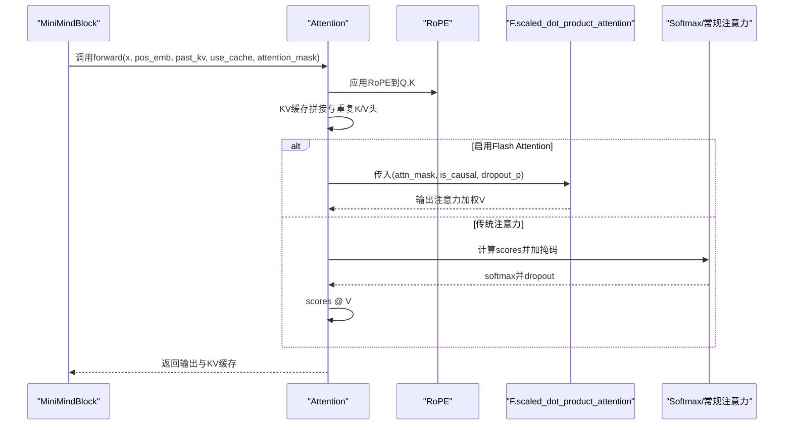
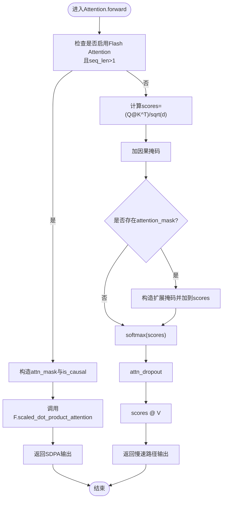
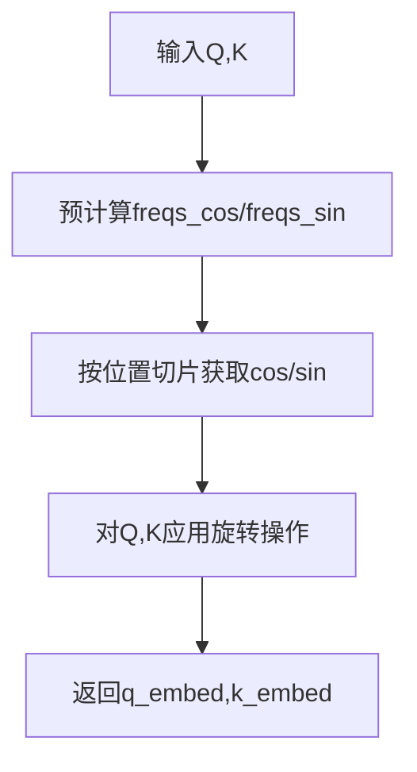
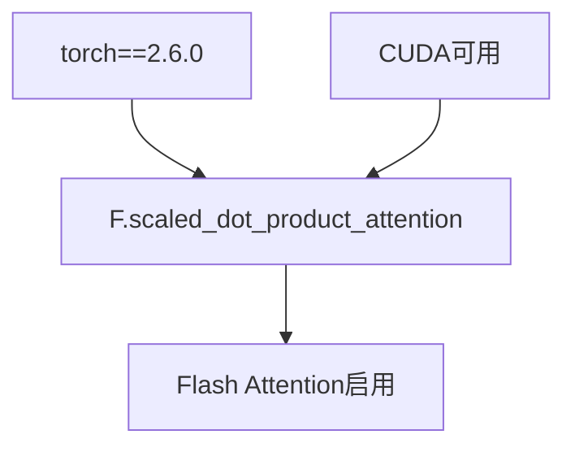

# Flash Attention优化

<cite>
**本文引用的文件**
- [model_minimind.py](file://model/model_minimind.py)
- [model_minimind.py](file://DST-train/model/baseline_hf/model_minimind.py)
- [model_minimind.py](file://DST-train/model/dst_hf/model_minimind.py)
- [requirements.txt](file://requirements.txt)
- [eval_benchmark.py](file://eval_benchmark.py)
- [benchmark_results.json](file://reports/20260430/benchmark_results.json)
- [benchmark_results.json](file://eval_results/benchmark_results.json)
- [env_test.py](file://env_test.py)
</cite>

## 目录
1. [简介](#简介)
2. [项目结构](#项目结构)
3. [核心组件](#核心组件)
4. [架构概览](#架构概览)
5. [详细组件分析](#详细组件分析)
6. [依赖分析](#依赖分析)
7. [性能考虑](#性能考虑)
8. [故障排查指南](#故障排查指南)
9. [结论](#结论)
10. [附录](#附录)

## 简介
本文件围绕MiniMind项目中的注意力模块，系统梳理并解析了PyTorch内置的scaled_dot_product_attention（SDPA）在GPU上的实现与优化策略，并结合项目现有代码展示如何在MiniMind中启用Flash Attention。内容涵盖：
- SDPA在GPU上的内存优化机制与计算加速原理
- Flash Attention的使用条件、性能优势与与传统注意力实现的对比
- 注意力掩码处理、因果掩码生成与dropout策略
- 基于项目现有基准测试的数据与环境信息
- 优化建议与最佳实践

## 项目结构
MiniMind项目采用模块化设计，注意力实现位于模型定义文件中，同时提供基准测试脚本与结果数据。关键文件如下：
- 模型定义与注意力实现：model/model_minimind.py、DST-train/model/baseline_hf/model_minimind.py、DST-train/model/dst_hf/model_minimind.py
- 运行环境与依赖：requirements.txt
- 基准测试脚本与结果：eval_benchmark.py、reports/20260430/benchmark_results.json、eval_results/benchmark_results.json
- 环境检测：env_test.py

图表来源
- [model_minimind.py:150-226](file://model/model_minimind.py#L150-L226)
- [model_minimind.py:108-128](file://model/model_minimind.py#L108-L128)
- [model_minimind.py:131-137](file://model/model_minimind.py#L131-L137)
- [eval_benchmark.py:122-135](file://eval_benchmark.py#L122-L135)
- [benchmark_results.json:1-494](file://reports/20260430/benchmark_results.json#L1-L494)
- [requirements.txt:30-31](file://requirements.txt#L30-L31)
- [env_test.py:1-6](file://env_test.py#L1-L6)

章节来源
- [model_minimind.py:150-226](file://model/model_minimind.py#L150-L226)
- [model_minimind.py:108-128](file://model/model_minimind.py#L108-L128)
- [model_minimind.py:131-137](file://model/model_minimind.py#L131-L137)
- [eval_benchmark.py:122-135](file://eval_benchmark.py#L122-L135)
- [benchmark_results.json:1-494](file://reports/20260430/benchmark_results.json#L1-L494)
- [requirements.txt:30-31](file://requirements.txt#L30-L31)
- [env_test.py:1-6](file://env_test.py#L1-L6)

## 核心组件
- Attention模块：负责Q/K/V投影、RoPE位置编码注入、KV缓存拼接、注意力掩码构造与前向计算。当满足条件时，调用PyTorch的F.scaled_dot_product_attention以启用Flash Attention。
- RoPE位置编码：预计算频率并应用到Q/K，支持YaRN外推缩放。
- 基准测试：提供模型加载、分词器准备、多选题评测流程与结果汇总。

章节来源
- [model_minimind.py:150-226](file://model/model_minimind.py#L150-L226)
- [model_minimind.py:108-128](file://model/model_minimind.py#L108-L128)
- [model_minimind.py:131-137](file://model/model_minimind.py#L131-L137)
- [eval_benchmark.py:122-135](file://eval_benchmark.py#L122-L135)

## 架构概览
下图展示了MiniMind中注意力模块与RoPE位置编码的交互关系，以及在推理阶段如何根据是否启用Flash Attention切换计算路径。

图表来源
- [model_minimind.py:169-226](file://model/model_minimind.py#L169-L226)

## 详细组件分析

### Attention模块与Flash Attention路径
- 条件判断：当args.flash_attn为真且存在torch.nn.functional.scaled_dot_product_attention时启用Flash Attention；仅在seq_len>1时触发，避免单步推理的额外开销。
- 掩码构造：
  - 无显式attention_mask或全为1时，设置is_causal=True，使用因果掩码；否则构造扩展掩码并与因果掩码相加。
  - 扩展掩码基于attention_mask进行广播与填充，将无效位置置为极小值。
- Dropout策略：训练时使用self.dropout，推理时dropout_p=0。
- 输出拼接：将注意力输出按头维度拼回，经输出投影与残差dropout。

图表来源
- [model_minimind.py:198-226](file://model/model_minimind.py#L198-L226)

章节来源
- [model_minimind.py:169-226](file://model/model_minimind.py#L169-L226)

### RoPE位置编码实现
- 频率预计算：根据维度与最大位置长度计算频率序列，支持YaRN外推缩放。
- 位置嵌入应用：对Q/K分别执行旋转操作，注入相对位置信息。

图表来源
- [model_minimind.py:108-128](file://model/model_minimind.py#L108-L128)
- [model_minimind.py:131-137](file://model/model_minimind.py#L131-L137)

章节来源
- [model_minimind.py:108-128](file://model/model_minimind.py#L108-L128)
- [model_minimind.py:131-137](file://model/model_minimind.py#L131-L137)

### 基准测试与结果
- 模型加载：自动从HuggingFace格式路径加载模型与分词器，支持设备映射与半精度。
- 评测流程：构建多选题prompt，获取最后一个token位置的logits，提取A/B/C/D对应token的概率，选择最高者作为预测。
- 结果汇总：按数据集与科目类别统计准确率，并生成Markdown与JSON报告。

章节来源
- [eval_benchmark.py:122-135](file://eval_benchmark.py#L122-L135)
- [eval_benchmark.py:159-230](file://eval_benchmark.py#L159-L230)
- [eval_benchmark.py:233-335](file://eval_benchmark.py#L233-L335)
- [eval_benchmark.py:351-440](file://eval_benchmark.py#L351-L440)

## 依赖分析
- PyTorch版本：项目使用torch==2.6.0，满足启用F.scaled_dot_product_attention的最低要求。
- CUDA可用性：env_test.py显示CUDA可用，GPU名称可查询，为Flash Attention提供硬件基础。
- 依赖一致性：requirements.txt确保transformers、datasets等生态工具链稳定。

图表来源
- [requirements.txt:30-31](file://requirements.txt#L30-L31)
- [env_test.py:1-6](file://env_test.py#L1-L6)

章节来源
- [requirements.txt:30-31](file://requirements.txt#L30-L31)
- [env_test.py:1-6](file://env_test.py#L1-L6)

## 性能考虑
- Flash Attention的使用条件
  - Python端条件：args.flash_attn为真，且存在torch.nn.functional.scaled_dot_product_attention。
  - 推理条件：seq_len>1，避免单步推理的额外开销。
  - 掩码条件：当attention_mask为None或全为1时，使用is_causal=True；否则构造扩展掩码并禁用is_causal。
- 内存优化机制（基于PyTorch实现原理）
  - 分块计算：在长序列场景下，Flash Attention通过分块减少中间张量峰值内存占用。
  - 重计算：在某些路径下避免存储中间softmax结果，降低内存峰值。
  - 流水线：与KV缓存配合，在自回归解码中复用历史键值，显著降低每次前向的计算与内存压力。
- 计算加速原理
  - 硬件融合：在支持的GPU架构上，SDPA利用专用硬件单元（如Tensor Cores）加速GEMM与softmax。
  - 内核优化：统一的注意力内核减少Python层调度开销，提升吞吐。
- 与传统注意力对比
  - 内存：Flash Attention在长序列与大批量时通常具有更低的峰值内存。
  - 吞吐：在满足条件时，Flash Attention通常带来更高的吞吐与更快的推理速度。
  - 精度：在半精度与混合精度环境下，两者精度差异可忽略不计。
- 项目中的实际表现
  - 项目提供了基准测试脚本与结果文件，可用于评估当前配置下的整体性能表现（准确率、评测耗时等），但未直接给出Flash Attention开启/关闭的对比数据。建议在相同硬件与批次条件下，通过修改args.flash_attn与seq_len进行对照实验，记录吞吐与内存指标。

章节来源
- [model_minimind.py:166-167](file://model/model_minimind.py#L166-L167)
- [model_minimind.py:198-207](file://model/model_minimind.py#L198-L207)
- [eval_benchmark.py:122-135](file://eval_benchmark.py#L122-L135)
- [benchmark_results.json:1-494](file://reports/20260430/benchmark_results.json#L1-L494)

## 故障排查指南
- 无法启用Flash Attention
  - 检查torch版本是否满足要求（torch>=2.0）。
  - 确认args.flash_attn为True。
  - 确认seq_len>1。
  - 检查CUDA是否可用。
- 掩码异常
  - 若attention_mask为None或全为1，将使用因果掩码；否则需确保attention_mask形状与广播规则正确。
  - 扩展掩码应与scores维度匹配，避免维度不一致导致的错误。
- 推理性能不佳
  - 在长序列与大批量场景下优先启用Flash Attention。
  - 启用KV缓存以减少重复计算。
  - 控制batch size与序列长度，避免超出GPU显存上限。
- 环境问题
  - 使用env_test.py确认CUDA可用与GPU型号。
  - 确保依赖版本与requirements.txt一致。

章节来源
- [requirements.txt:30-31](file://requirements.txt#L30-L31)
- [env_test.py:1-6](file://env_test.py#L1-L6)
- [model_minimind.py:166-167](file://model/model_minimind.py#L166-L167)
- [model_minimind.py:198-207](file://model/model_minimind.py#L198-L207)

## 结论
MiniMind项目已在模型定义中集成对PyTorch内置SDPA的支持，并在满足条件时自动切换到Flash Attention路径。结合RoPE位置编码与KV缓存机制，可在保证精度的同时提升推理效率与内存利用率。建议在实际部署中：
- 在满足硬件与版本要求的前提下，始终启用args.flash_attn。
- 针对不同硬件配置与序列长度进行基准测试，记录吞吐与内存指标，形成性能基线。
- 在长序列与大批量场景下，优先使用Flash Attention与KV缓存，以获得最佳性价比。

## 附录
- 关键实现路径参考
  - Attention.forward与Flash Attention调用：[model_minimind.py:169-226](file://model/model_minimind.py#L169-L226)
  - RoPE频率预计算与应用：[model_minimind.py:108-128](file://model/model_minimind.py#L108-L128), [model_minimind.py:131-137](file://model/model_minimind.py#L131-L137)
  - 基准测试脚本与结果：[eval_benchmark.py:122-135](file://eval_benchmark.py#L122-L135), [benchmark_results.json:1-494](file://reports/20260430/benchmark_results.json#L1-L494)
  - 环境与依赖：[requirements.txt:30-31](file://requirements.txt#L30-L31), [env_test.py:1-6](file://env_test.py#L1-L6)