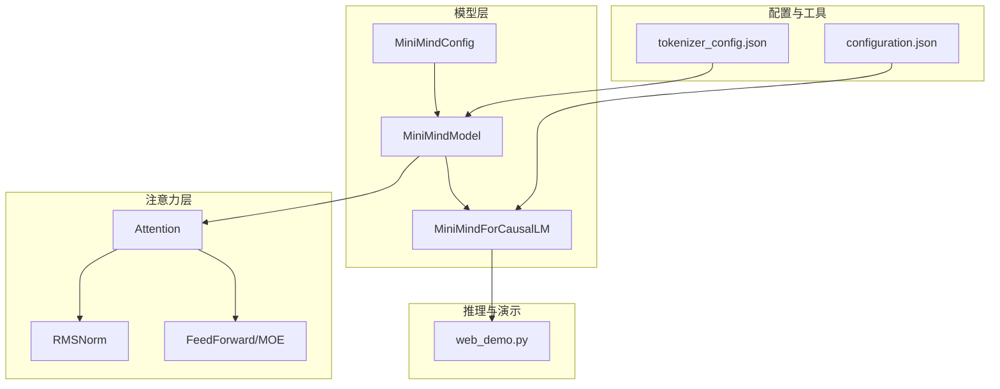
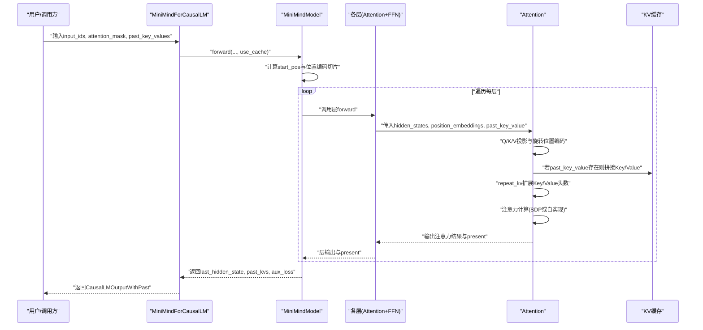
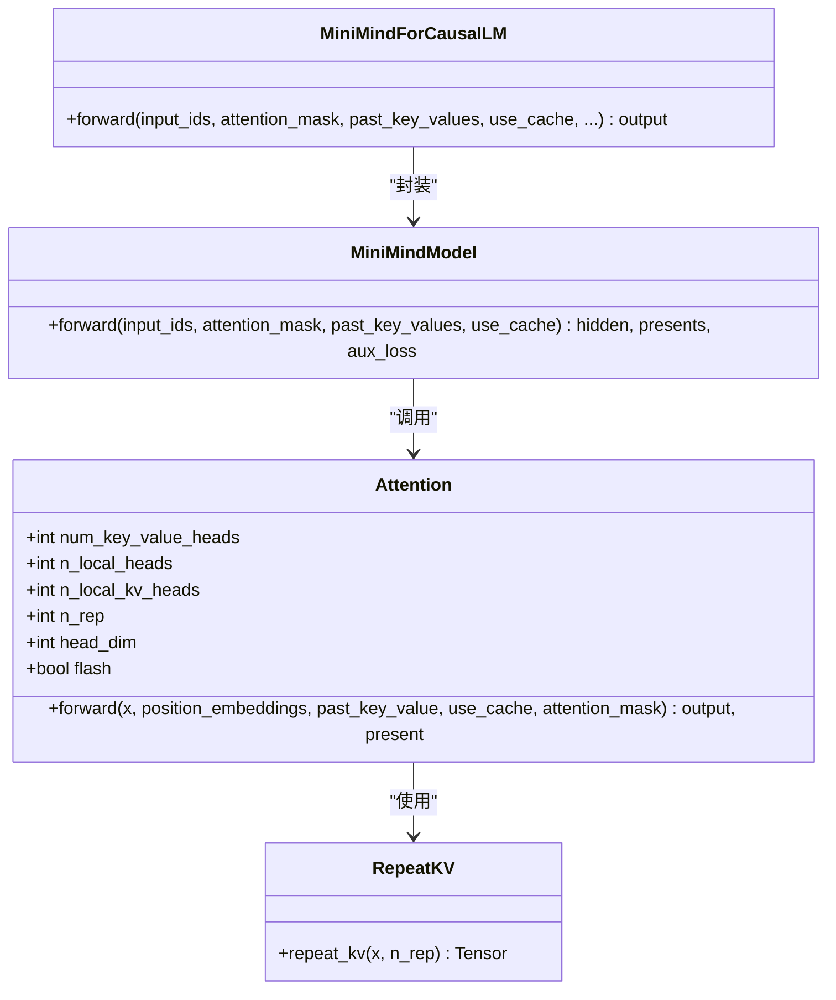
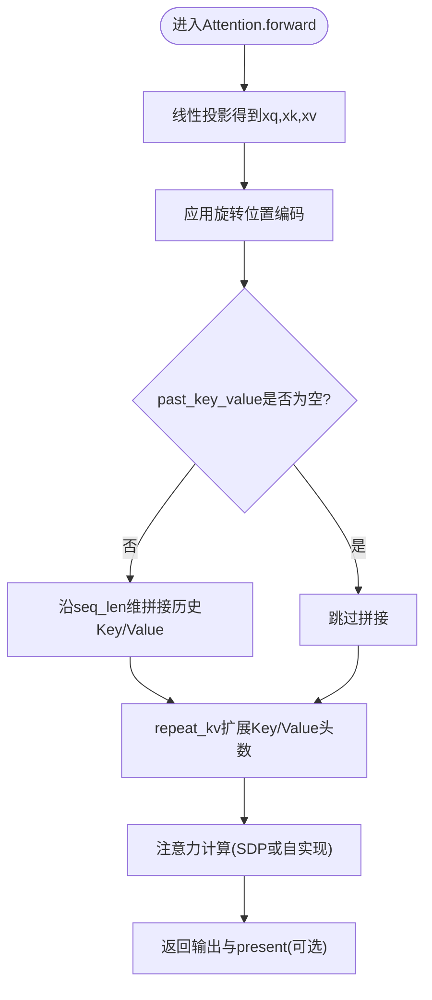
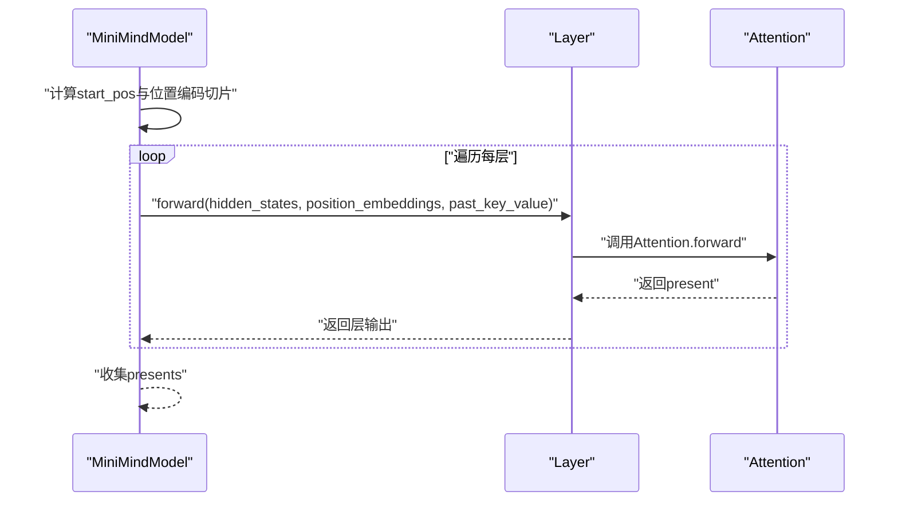
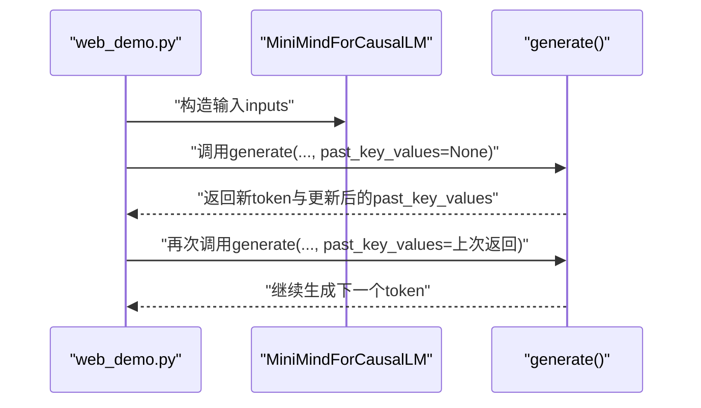
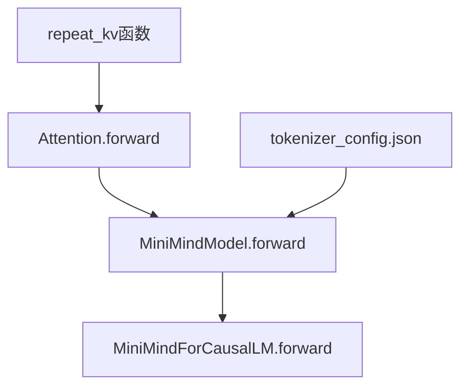

# KV缓存实现

<cite>
**本文档引用的文件**
- [model_minimind.py](file://model/model_minimind.py)
- [model_minimind.py（DST训练版本）](file://DST-train/model/dst_hf/model_minimind.py)
- [web_demo.py](file://scripts/web_demo.py)
- [tokenizer_config.json](file://model/tokenizer_config.json)
- [configuration.json](file://MiniMind2-PyTorch/configuration.json)
</cite>

## 目录
1. [简介](#简介)
2. [项目结构](#项目结构)
3. [核心组件](#核心组件)
4. [架构概览](#架构概览)
5. [详细组件分析](#详细组件分析)
6. [依赖分析](#依赖分析)
7. [性能考虑](#性能考虑)
8. [故障排除指南](#故障排除指南)
9. [结论](#结论)
10. [附录](#附录)

## 简介
本文件针对MiniMind项目的KV缓存机制进行系统化技术文档编写，重点解析past_key_value缓存系统的实现原理，包括Key和Value张量的存储策略、缓存状态的管理机制、推理阶段的缓存复用逻辑。文档将详细说明缓存张量的形状设计、cat函数的拼接操作、以及缓存大小的动态调整，并提供完整的代码实现分析，涵盖缓存初始化、状态更新、内存优化策略。同时，给出推理效率分析、缓存命中率统计方法、不同序列长度下的性能表现，以及缓存配置建议和故障排除指南。

## 项目结构
MiniMind项目采用分层模块化组织，KV缓存相关的核心实现集中在注意力模块与模型前向传播路径中。关键文件与职责如下：
- model/model_minimind.py：包含MiniMind模型的完整实现，包括Attention类中的KV缓存逻辑、位置编码旋转、注意力计算等。
- DST-train/model/dst_hf/model_minimind.py：与上述文件功能一致，用于特定训练场景的HF兼容实现。
- scripts/web_demo.py：演示推理接口，展示如何在实际推理中使用past_key_values进行缓存复用。
- model/tokenizer_config.json：提供模型最大上下文长度等配置信息，影响KV缓存的有效性与扩展性。
- MiniMind2-PyTorch/configuration.json：声明框架类型与任务类型，确保推理环境正确加载模型。

**图表来源**
- [model_minimind.py:387-477](file://model/model_minimind.py#L387-L477)
- [model_minimind.py:150-227](file://model/model_minimind.py#L150-L227)
- [web_demo.py:207-329](file://scripts/web_demo.py#L207-L329)
- [tokenizer_config.json:1-43](file://model/tokenizer_config.json#L1-L43)
- [configuration.json:1-1](file://MiniMind2-PyTorch/configuration.json#L1-L1)

**章节来源**
- [model_minimind.py:387-477](file://model/model_minimind.py#L387-L477)
- [model_minimind.py:150-227](file://model/model_minimind.py#L150-L227)
- [web_demo.py:207-329](file://scripts/web_demo.py#L207-L329)
- [tokenizer_config.json:1-43](file://model/tokenizer_config.json#L1-L43)
- [configuration.json:1-1](file://MiniMind2-PyTorch/configuration.json#L1-L1)

## 核心组件
本节聚焦KV缓存机制的核心实现，包括：
- Attention类中的KV缓存拼接与返回逻辑
- 位置编码旋转与KV重复扩展
- 模型前向传播中past_key_values的传递与组装
- 推理阶段的缓存复用与输出格式

关键实现要点：
- KV缓存拼接：当past_key_value存在时，将历史Key/Value与当前Key/Value沿序列维度拼接，形成累积的历史上下文。
- KV重复扩展：通过repeat_kv函数将Key/Value头数从num_key_value_heads扩展到num_attention_heads，满足注意力头对齐。
- 位置编码切片：根据start_pos与当前序列长度计算位置编码片段，避免重复计算。
- 缓存返回：use_cache为True时，Attention返回当前层的Key/Value作为present，供后续层或外部调用复用。

**章节来源**
- [model_minimind.py:150-227](file://model/model_minimind.py#L150-L227)
- [model_minimind.py:403-440](file://model/model_minimind.py#L403-L440)
- [model_minimind.py:456-477](file://model/model_minimind.py#L456-L477)

## 架构概览
下图展示了KV缓存在MiniMind推理流程中的整体交互关系，包括输入序列、位置编码、注意力计算、KV缓存拼接与返回、以及最终的past_key_values输出。

**图表来源**
- [model_minimind.py:403-440](file://model/model_minimind.py#L403-L440)
- [model_minimind.py:376-384](file://model/model_minimind.py#L376-L384)
- [model_minimind.py:169-226](file://model/model_minimind.py#L169-L226)

## 详细组件分析

### 组件A：Attention类中的KV缓存实现
该组件负责注意力计算与KV缓存的拼接与返回，是KV缓存机制的核心。

**图表来源**
- [model_minimind.py:150-227](file://model/model_minimind.py#L150-L227)
- [model_minimind.py:140-147](file://model/model_minimind.py#L140-L147)
- [model_minimind.py:387-440](file://model/model_minimind.py#L387-L440)
- [model_minimind.py:443-477](file://model/model_minimind.py#L443-L477)

**章节来源**
- [model_minimind.py:150-227](file://model/model_minimind.py#L150-L227)
- [model_minimind.py:140-147](file://model/model_minimind.py#L140-L147)
- [model_minimind.py:387-440](file://model/model_minimind.py#L387-L440)
- [model_minimind.py:443-477](file://model/model_minimind.py#L443-L477)

### 组件B：KV缓存拼接与形状设计
- 输入形状：xq/xk/xv的形状为[batch_size, seq_len, heads, head_dim]。
- 旋转位置编码后，xq与xk保持相同序列长度seq_len。
- 若past_key_value存在，则将past_key_value[0]（历史Key）与当前xk沿seq_len维拼接；past_key_value[1]（历史Value）与当前xv沿seq_len维拼接。
- 拼接后的Key/Value形状为[batch_size, start_pos+seq_len, num_key_value_heads, head_dim]。
- repeat_kv将Key/Value头数扩展至与注意力头数一致，便于多头注意力计算。

**图表来源**
- [model_minimind.py:169-226](file://model/model_minimind.py#L169-L226)
- [model_minimind.py:140-147](file://model/model_minimind.py#L140-L147)

**章节来源**
- [model_minimind.py:169-226](file://model/model_minimind.py#L169-L226)
- [model_minimind.py:140-147](file://model/model_minimind.py#L140-L147)

### 组件C：模型前向传播中的缓存管理
- MiniMindModel在forward中计算start_pos=start_pos=past_key_values[0][0].shape[1]（若存在），并据此切片位置编码。
- 将past_key_values按层解包，逐层传入Attention，每层返回present作为该层的KV缓存。
- 最终返回presents列表，其中每个元素为该层的(Key, Value)元组，供外部调用复用。

**图表来源**
- [model_minimind.py:403-440](file://model/model_minimind.py#L403-L440)

**章节来源**
- [model_minimind.py:403-440](file://model/model_minimind.py#L403-L440)

### 组件D：推理阶段的缓存复用与输出
- MiniMindForCausalLM.forward中，将past_key_values传入模型，并在返回中设置past_key_values字段，供后续generate调用复用。
- web_demo.py演示了如何在Streamlit界面中调用模型的generate接口，并通过past_key_values实现增量生成。

**图表来源**
- [model_minimind.py:456-477](file://model/model_minimind.py#L456-L477)
- [web_demo.py:289-314](file://scripts/web_demo.py#L289-L314)

**章节来源**
- [model_minimind.py:456-477](file://model/model_minimind.py#L456-L477)
- [web_demo.py:289-314](file://scripts/web_demo.py#L289-L314)

## 依赖分析
KV缓存实现的关键依赖关系如下：
- Attention依赖repeat_kv函数进行Key/Value头数扩展。
- MiniMindModel依赖Attention完成每层的注意力计算与KV缓存返回。
- MiniMindForCausalLM封装MiniMindModel，并在forward中设置past_key_values输出，供推理框架复用。
- 配置文件tokenizer_config.json提供model_max_length等参数，影响位置编码切片与缓存上限。

**图表来源**
- [model_minimind.py:140-147](file://model/model_minimind.py#L140-L147)
- [model_minimind.py:169-226](file://model/model_minimind.py#L169-L226)
- [model_minimind.py:403-440](file://model/model_minimind.py#L403-L440)
- [model_minimind.py:456-477](file://model/model_minimind.py#L456-L477)
- [tokenizer_config.json:1-43](file://model/tokenizer_config.json#L1-L43)

**章节来源**
- [model_minimind.py:140-147](file://model/model_minimind.py#L140-L147)
- [model_minimind.py:169-226](file://model/model_minimind.py#L169-L226)
- [model_minimind.py:403-440](file://model/model_minimind.py#L403-L440)
- [model_minimind.py:456-477](file://model/model_minimind.py#L456-L477)
- [tokenizer_config.json:1-43](file://model/tokenizer_config.json#L1-L43)

## 性能考虑
- 推理效率分析
  - KV缓存显著减少注意力计算中的Key/Value矩阵规模，避免重复计算历史序列的注意力得分，从而降低时间复杂度与内存占用。
  - 在长上下文场景下，缓存复用带来的收益尤为明显，但需注意拼接操作的时间开销随历史长度线性增长。
- 缓存命中率统计
  - 可通过记录每次生成时past_key_values的长度变化与拼接次数，估算缓存命中率。例如：命中率≈1 - (新增Key/Value数量)/(历史Key/Value总量)。
- 不同序列长度下的性能表现
  - 短序列：缓存初始化成本相对较高，但后续增量生成收益显著。
  - 中等序列：缓存复用效果稳定，注意力计算主要集中在新增token。
  - 长序列：缓存大小持续增长，需关注内存峰值与拼接开销；可通过限制历史长度或采用分块策略缓解。
- 内存优化策略
  - 控制use_cache开关，仅在需要增量生成时启用。
  - 合理设置max_length，避免不必要的历史缓存积累。
  - 对于超长上下文，可考虑分段生成并在必要时清理旧缓存。

[本节为通用性能讨论，不直接分析具体文件，故无“章节来源”]

## 故障排除指南
- past_key_values格式错误
  - 症状：报错提示past_key_values.layers不存在或形状不匹配。
  - 处理：确保传入的past_key_values为List[Tuple[torch.Tensor, torch.Tensor]]，且长度与层数一致；若为None或无效对象，框架会自动填充为全None列表。
- 位置编码切片异常
  - 症状：位置编码索引越界或形状不匹配。
  - 处理：确认start_pos=past_key_values[0][0].shape[1]有效，且不超过max_position_embeddings；检查tokenizer_config.json中的model_max_length配置。
- 缓存拼接导致内存溢出
  - 症状：长时间运行后显存/内存持续增长。
  - 处理：定期清理past_key_values或限制生成长度；在推理循环中及时更新past_key_values，避免重复拼接。
- 推理速度异常
  - 症状：启用use_cache后速度未提升或反而下降。
  - 处理：检查是否正确传入past_key_values；确认attention_mask与seq_len条件分支；验证Flash Attention可用性。

**章节来源**
- [model_minimind.py:409-412](file://model/model_minimind.py#L409-L412)
- [model_minimind.py:410-411](file://model/model_minimind.py#L410-L411)
- [tokenizer_config.json:37-37](file://model/tokenizer_config.json#L37-L37)

## 结论
MiniMind的KV缓存机制通过在Attention层对Key/Value进行历史拼接与头数扩展，实现了高效的推理缓存复用。配合位置编码切片与可选的Flash Attention，系统在长上下文场景下仍能保持良好的性能与稳定性。通过合理配置与监控，可进一步优化内存占用与生成速度，满足不同应用场景的需求。

[本节为总结性内容，不直接分析具体文件，故无“章节来源”]

## 附录
- 缓存配置建议
  - use_cache：在增量生成时启用，避免不必要的缓存开销。
  - max_length：结合tokenizer_config.json中的model_max_length设置，控制最大上下文长度。
  - attention_mask：在非因果掩码场景下，确保扩展掩码与因果掩码正确组合。
- 相关文件路径
  - [model_minimind.py](file://model/model_minimind.py)
  - [model_minimind.py（DST训练版本）](file://DST-train/model/dst_hf/model_minimind.py)
  - [web_demo.py](file://scripts/web_demo.py)
  - [tokenizer_config.json](file://model/tokenizer_config.json)
  - [configuration.json](file://MiniMind2-PyTorch/configuration.json)

[本节为补充信息，不直接分析具体文件，故无“章节来源”]