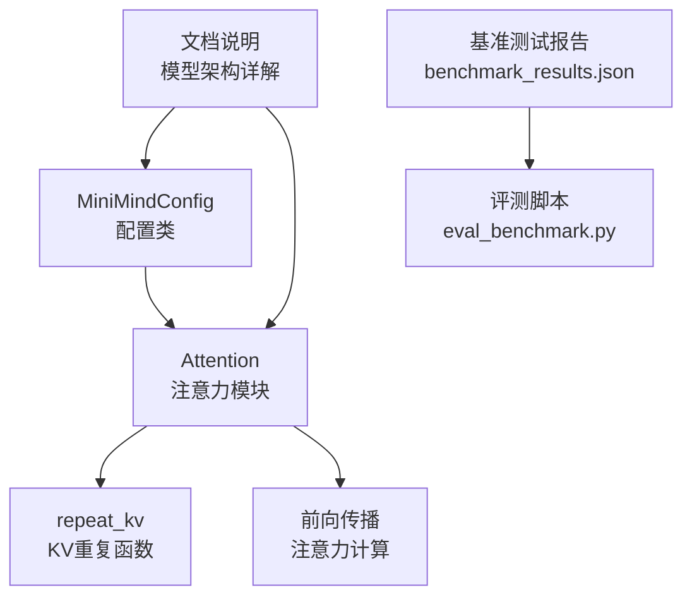
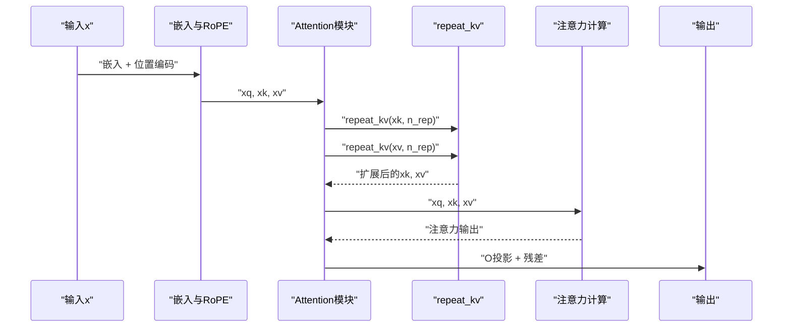
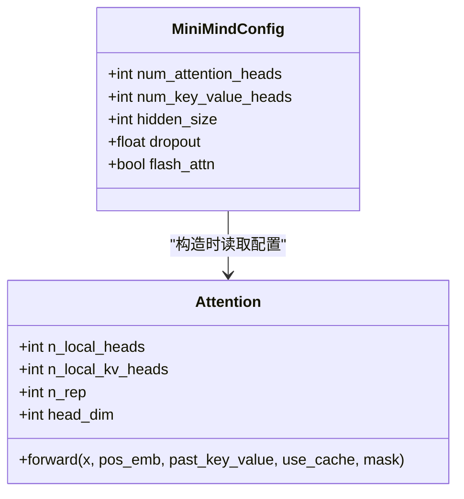
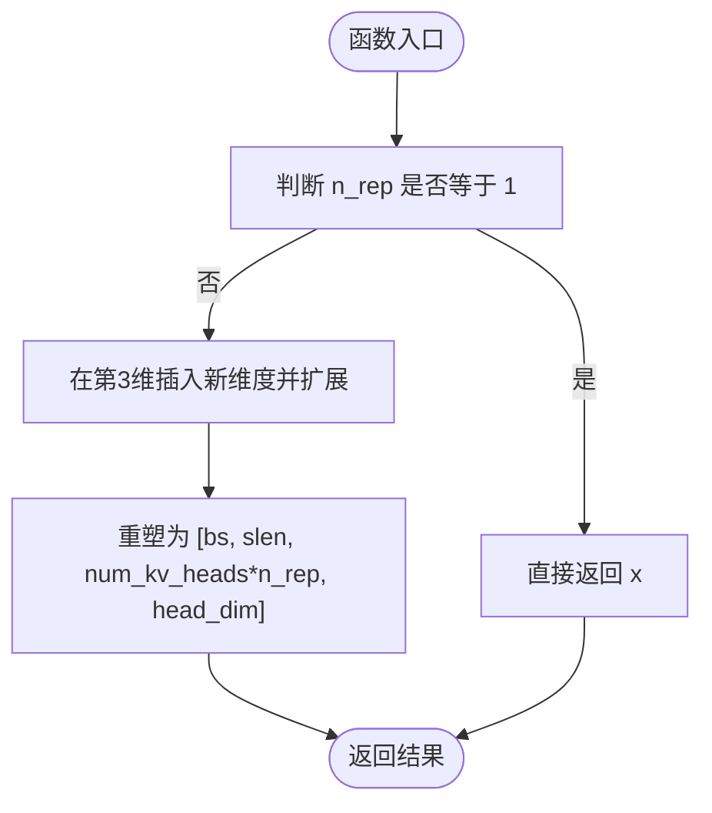
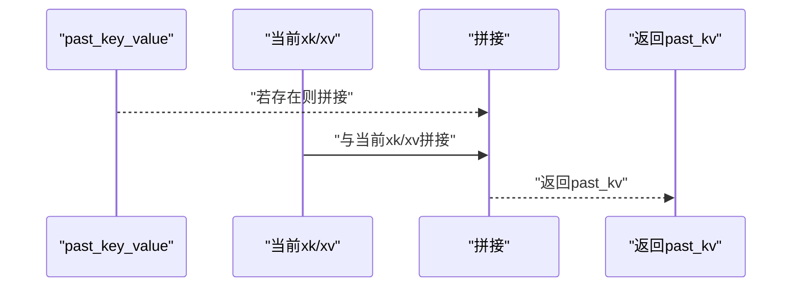
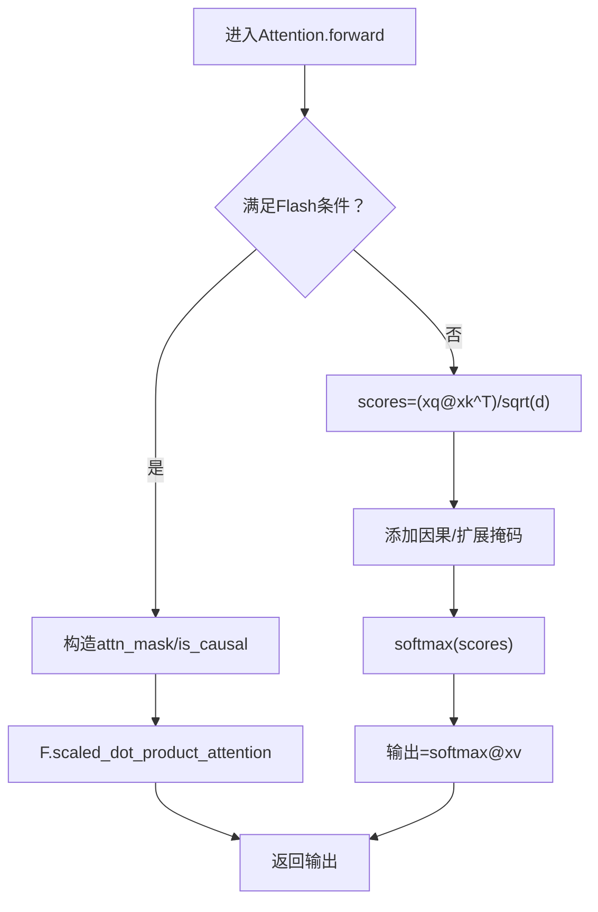
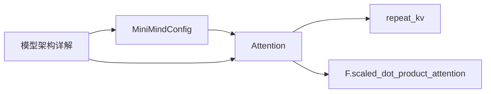

# 分组查询注意力(GQA)

<cite>
**本文引用的文件**
- [model_minimind.py](file://model/model_minimind.py)
- [03_Phase3_模型架构详解.md](file://docs/03_Phase3_模型架构详解.md)
- [benchmark_results.json](file://reports/20260429/benchmark_results.json)
- [eval_benchmark.py](file://eval_benchmark.py)
</cite>

## 目录
1. [引言](#引言)
2. [项目结构](#项目结构)
3. [核心组件](#核心组件)
4. [架构总览](#架构总览)
5. [详细组件分析](#详细组件分析)
6. [依赖分析](#依赖分析)
7. [性能考量](#性能考量)
8. [故障排查指南](#故障排查指南)
9. [结论](#结论)
10. [附录](#附录)

## 引言
本文件围绕 MiniMind 项目中的分组查询注意力（Grouped-Query Attention, GQA）机制展开，系统阐述其在减少 Key/Value 头数量的同时保持与多头注意力（MHA）相近表达能力的设计思路，并深入解析 n_rep 重复机制、repeat_kv 函数的实现逻辑、KV 头共享的数学原理与内存优化策略。同时，结合项目文档与基准测试结果，对比 GQA 与传统 MHA 在计算复杂度与内存使用上的差异，并给出适用场景建议。

## 项目结构
与 GQA 相关的核心实现集中在模型定义文件中，配套文档提供了配置参数与架构说明，基准测试报告展示了模型在中文评测榜单上的表现。

**图表来源**
- [model_minimind.py:150-226](file://model/model_minimind.py#L150-L226)
- [03_Phase3_模型架构详解.md:118-176](file://docs/03_Phase3_模型架构详解.md#L118-L176)

**章节来源**
- [model_minimind.py:150-226](file://model/model_minimind.py#L150-L226)
- [03_Phase3_模型架构详解.md:118-176](file://docs/03_Phase3_模型架构详解.md#L118-L176)

## 核心组件
- GQA 配置与头数关系
  - MiniMind 使用 n_heads=8、kv_heads=2，因此 n_rep = n_heads / kv_heads = 4。即每 4 个查询头共享一组 KV 头。
- Attention 模块
  - Q/K/V 投影分别使用不同头数，O 投影将所有 Q 头拼接后的结果映射回隐藏维。
  - 支持 KV Cache，推理时拼接历史 K/V，避免重复计算。
  - 支持 Flash Attention（若后端支持）与兼容路径（手动实现注意力）。
- repeat_kv 函数
  - 将 KV 头按 n_rep 次重复，使 KV 头数与 Q 头数一致，便于后续注意力计算。
- 旋转位置编码（RoPE）
  - 对 Q/K 应用旋转位置编码，增强相对位置感知能力。

**章节来源**
- [model_minimind.py:150-226](file://model/model_minimind.py#L150-L226)
- [03_Phase3_模型架构详解.md:118-176](file://docs/03_Phase3_模型架构详解.md#L118-L176)

## 架构总览
下图展示 GQA 在 MiniMind 中的整体调用链：输入经嵌入与位置编码后进入 Attention 模块，先进行 Q/K/V 投影与 RoPE，随后根据 n_rep 重复 KV 头，再进入注意力计算（Flash 或兼容路径），最后经 O 投影与残差连接输出。

**图表来源**
- [model_minimind.py:176-226](file://model/model_minimind.py#L176-L226)
- [model_minimind.py:140-147](file://model/model_minimind.py#L140-L147)

## 详细组件分析

### Attention 模块与 GQA 头数配置
- 头数与维度
  - n_heads=8，kv_heads=2，head_dim = hidden_size / n_heads。
  - n_rep = n_heads / kv_heads，用于将 KV 头重复 n_rep 次以匹配 Q 头数。
- 投影与形状
  - Q 投影输出形状为 [bs, slen, n_heads, head_dim]。
  - K/V 投影输出形状为 [bs, slen, kv_heads, head_dim]。
  - 经 RoPE 后类型对齐，随后进行 KV Cache 拼接与重复。
- 注意力计算
  - 若满足条件则使用 Flash Attention；否则走兼容路径的手动注意力实现。

**图表来源**
- [model_minimind.py:8-78](file://model/model_minimind.py#L8-L78)
- [model_minimind.py:150-167](file://model/model_minimind.py#L150-L167)

**章节来源**
- [model_minimind.py:150-167](file://model/model_minimind.py#L150-L167)
- [03_Phase3_模型架构详解.md:118-142](file://docs/03_Phase3_模型架构详解.md#L118-L142)

### repeat_kv 函数与 n_rep 重复机制
- 功能
  - 将 KV 头按 n_rep 次重复，使 K/V 头数与 Q 头数一致，从而在注意力计算中实现“每组 KV 被多个 Q 头共享”的效果。
- 实现要点
  - 输入张量形状为 [bs, slen, num_kv_heads, head_dim]。
  - 当 n_rep=1 时直接返回原张量。
  - 否则通过 reshape + expand 再 reshape 的方式在中间插入重复维，最终得到 [bs, slen, num_kv_heads * n_rep, head_dim]。
- 数学与内存
  - 该操作不复制实际数据，而是通过视图扩展实现“逻辑重复”，显著降低 KV 存储与计算开销。
  - 与直接复制 KV（MQA）相比，GQA 在表达能力与存储/计算成本之间取得平衡。

**图表来源**
- [model_minimind.py:140-147](file://model/model_minimind.py#L140-L147)

**章节来源**
- [model_minimind.py:140-147](file://model/model_minimind.py#L140-L147)
- [03_Phase3_模型架构详解.md:144-152](file://docs/03_Phase3_模型架构详解.md#L144-L152)

### KV Cache 与推理加速
- 推理时将当前步的 K/V 与历史 K/V 拼接，形成累积序列，避免重复计算历史上下文。
- 仅在 use_cache 为真时返回当前步 K/V，供后续步复用。

**图表来源**
- [model_minimind.py:186-190](file://model/model_minimind.py#L186-L190)

**章节来源**
- [model_minimind.py:186-190](file://model/model_minimind.py#L186-L190)
- [03_Phase3_模型架构详解.md:154-162](file://docs/03_Phase3_模型架构详解.md#L154-L162)

### 注意力计算路径（Flash 与兼容）
- Flash Attention
  - 当 seq_len > 1 且满足条件时，使用后端提供的 scaled_dot_product_attention，自动处理因果掩码与可选扩展掩码。
- 兼容路径
  - 手动计算注意力分数，应用因果掩码与可选扩展掩码，Softmax 后与 V 相乘得到输出。

**图表来源**
- [model_minimind.py:198-222](file://model/model_minimind.py#L198-L222)

**章节来源**
- [model_minimind.py:198-222](file://model/model_minimind.py#L198-L222)
- [03_Phase3_模型架构详解.md:164-176](file://docs/03_Phase3_模型架构详解.md#L164-L176)

### 复杂度与内存对比（GQA vs MHA）
- 计算复杂度
  - MHA：QK^T 与注意力权重与 V 的乘法均与 kv_heads 成正比。
  - GQA：K/V 投影与存储仅为 kv_heads，重复仅在形状层面，不增加实际乘法次数；但 Q 与扩展后的 K 的乘法次数仍与 n_heads 成正比。
- 内存占用
  - MHA：K/V 存储与投影均为 n_heads。
  - GQA：K/V 存储与投影仅为 kv_heads，推理时 KV Cache 也相应减少。
- 表达能力
  - GQA 通过 n_rep 重复实现“每组 KV 被多个 Q 头共享”，在减少 KV 成本的同时保留多头的表达能力。

**章节来源**
- [03_Phase3_模型架构详解.md:120-128](file://docs/03_Phase3_模型架构详解.md#L120-L128)

## 依赖分析
- 组件耦合
  - Attention 依赖 MiniMindConfig 提供头数与维度配置。
  - repeat_kv 作为纯张量操作函数，被 Attention 的前向传播调用。
  - 文档说明与实现相互印证，确保配置与实现一致。
- 外部依赖
  - PyTorch 的 scaled_dot_product_attention（可选）。
  - Transformers 生态（用于推理与评测）。

**图表来源**
- [model_minimind.py:8-78](file://model/model_minimind.py#L8-L78)
- [model_minimind.py:150-226](file://model/model_minimind.py#L150-L226)

**章节来源**
- [model_minimind.py:8-78](file://model/model_minimind.py#L8-L78)
- [model_minimind.py:150-226](file://model/model_minimind.py#L150-L226)

## 性能考量
- 推理效率
  - GQA 通过减少 KV 投影与存储，显著降低 KV Cache 占用与前向计算时间，尤其在长序列与多步推理中收益明显。
- 训练效率
  - 训练阶段 Q/K/V 投影与注意力计算与推理相同，但整体仍受益于更少的 KV 参数与缓存。
- 基准测试结果（中文评测）
  - C-Eval 与 CMMLU 的评测由脚本驱动，报告中包含各任务的准确率与统计信息，可用于评估 GQA 在下游任务中的表现。
  - 评测脚本支持批量推理、设备选择与模型加载，便于在不同硬件条件下评估性能。

**章节来源**
- [benchmark_results.json:1-494](file://reports/20260429/benchmark_results.json#L1-L494)
- [eval_benchmark.py:122-135](file://eval_benchmark.py#L122-L135)

## 故障排查指南
- 形状不匹配
  - 确认 n_heads 与 kv_heads 的整除关系，n_rep 必须为整数。
  - 检查 repeat_kv 的输入形状与输出形状是否符合预期。
- 掩码与因果性
  - 使用 Flash Attention 时，注意 attention_mask 的构造与 is_causal 的设置。
  - 兼容路径下确保因果掩码与扩展掩码正确叠加。
- KV Cache
  - 推理时 past_key_value 的拼接顺序与维度必须与实现一致，避免历史与当前步错位。
- 设备与精度
  - 评测脚本默认使用半精度与设备映射，若出现显存不足，可调整 batch_size 或 dtype。

**章节来源**
- [model_minimind.py:154-157](file://model/model_minimind.py#L154-L157)
- [model_minimind.py:198-222](file://model/model_minimind.py#L198-L222)
- [eval_benchmark.py:122-135](file://eval_benchmark.py#L122-L135)

## 结论
MiniMind 的 GQA 通过减少 KV 头数量并在形状层面重复实现“多 Q 共享一组 KV”，在保持与 MHA 相近表达能力的前提下显著降低 KV 存储与计算成本。repeat_kv 的实现不复制数据，仅通过视图扩展达到逻辑重复，配合 KV Cache 与可选的 Flash Attention，在推理阶段获得明显效率提升。结合中文评测报告，GQA 在下游任务中具备良好的实用性与性能表现。

## 附录
- 关键实现路径
  - GQA 配置与 Attention 前向：[model_minimind.py:150-226](file://model/model_minimind.py#L150-L226)
  - repeat_kv 实现：[model_minimind.py:140-147](file://model/model_minimind.py#L140-L147)
  - 文档说明与配置：[03_Phase3_模型架构详解.md:118-176](file://docs/03_Phase3_模型架构详解.md#L118-L176)
- 基准测试
  - 评测脚本与报告：[eval_benchmark.py:122-135](file://eval_benchmark.py#L122-L135)，[benchmark_results.json:1-494](file://reports/20260429/benchmark_results.json#L1-L494)