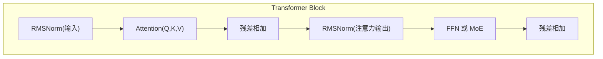
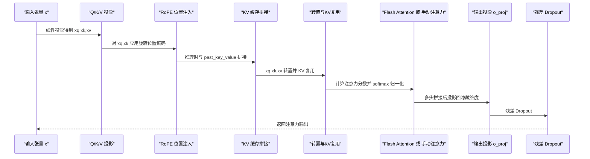
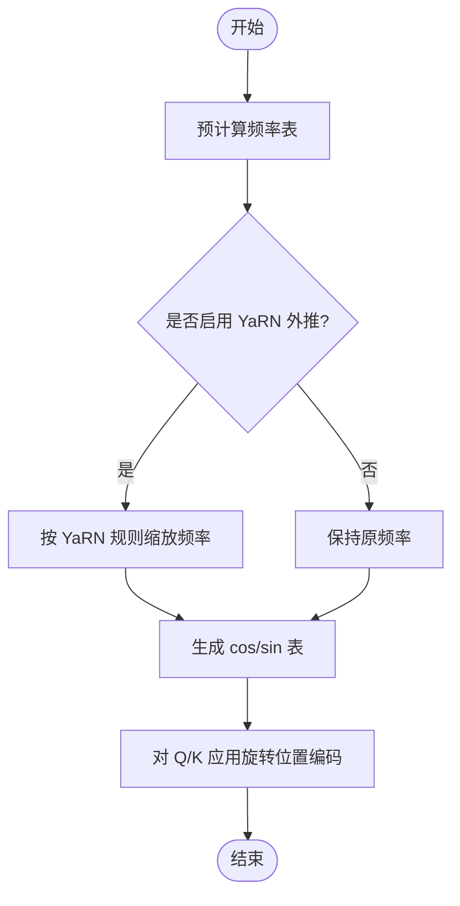
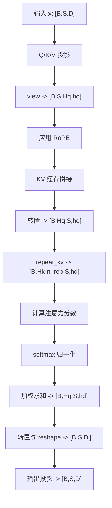
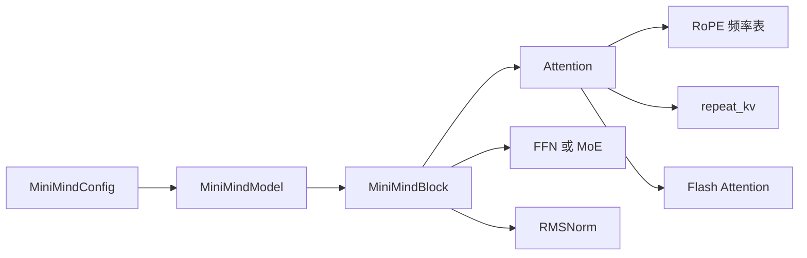
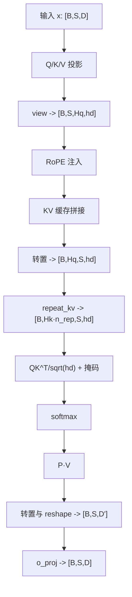

# 多头注意力机制

<cite>
**本文引用的文件列表**
- [model_minimind.py](file://model/model_minimind.py)
- [model_minimind.py（DST训练版本）](file://DST-train/model/baseline_hf/model_minimind.py)
- [03_Phase3_模型架构详解.md](file://docs/03_Phase3_模型架构详解.md)
- [README.md](file://README.md)
</cite>

## 目录
1. [简介](#简介)
2. [项目结构与定位](#项目结构与定位)
3. [核心组件与职责](#核心组件与职责)
4. [架构总览](#架构总览)
5. [详细组件分析](#详细组件分析)
6. [依赖关系分析](#依赖关系分析)
7. [性能与工程考量](#性能与工程考量)
8. [故障排查指南](#故障排查指南)
9. [结论](#结论)
10. [附录：数学公式与可视化](#附录数学公式与可视化)

## 简介
本文件围绕 MiniMind 项目中的多头注意力机制展开，系统阐述 Q/K/V 投影矩阵设计、注意力分数计算、softmax 归一化、多头并行计算、头维度 head_dim 的计算、KV 头复用与拼接输出等关键实现细节。文档同时提供代码级关系图与流程图，帮助读者从工程实现角度理解多头注意力的工作原理。

## 项目结构与定位
- MiniMind 采用 Transformer Decoder-only 架构，注意力采用 GQA（Grouped-Query Attention）以降低 KV 头数，兼顾效率与表达能力。
- 多头注意力位于单层 Transformer Block 内，作为自注意力子层，配合 RMSNorm、FFN/MoE 与残差连接构成完整前馈路径。
- 项目文档对 RoPE 旋转位置编码、GQA、Flash Attention 等关键技术有详尽说明，为理解注意力实现提供背景支撑。

**章节来源**
- [README.md: 模型结构与组件:607-631](file://README.md#L607-L631)
- [03_Phase3_模型架构详解.md: 整体架构概览:5-25](file://docs/03_Phase3_模型架构详解.md#L5-L25)

## 核心组件与职责
- Attention 模块：负责 Q/K/V 投影、RoPE 位置注入、KV 复用、注意力分数计算、softmax 归一化、dropout 与输出拼接。
- RoPE 相关函数：预计算频率、应用旋转位置编码。
- KV 复用函数：将少量 KV 头复制扩展以匹配查询头数。
- MiniMindBlock：将注意力与 FFN/MoE、残差与归一化串联，形成标准 Transformer 子层。

**章节来源**
- [model_minimind.py: Attention 类与前向逻辑:150-226](file://model/model_minimind.py#L150-L226)
- [model_minimind.py: RoPE 频率预计算与应用:108-137](file://model/model_minimind.py#L108-L137)
- [model_minimind.py: KV 复用函数:140-147](file://model/model_minimind.py#L140-L147)
- [model_minimind.py: MiniMindBlock 结构:363-384](file://model/model_minimind.py#L363-L384)

## 架构总览
下图展示注意力子层在 Transformer Block 中的调用关系与数据流。

**图表来源**
- [model_minimind.py: MiniMindBlock.forward:376-384](file://model/model_minimind.py#L376-L384)

## 详细组件分析

### Attention 模块：多头注意力实现
- 投影层初始化
  - Q 投影：输入维度 hidden_size → 输出维度 num_attention_heads × head_dim
  - K/V 投影：输入维度 hidden_size → 输出维度 num_key_value_heads × head_dim
  - 输出投影：输入维度 num_attention_heads × head_dim → 输出维度 hidden_size
- 头维度与头数
  - head_dim = hidden_size / num_attention_heads
  - n_local_heads = num_attention_heads
  - n_local_kv_heads = num_key_value_heads
  - n_rep = n_local_heads / n_local_kv_heads（KV 复用倍数）
- 前向流程
  - 线性投影：xq, xk, xv = Q(x), K(x), V(x)
  - 形状变换：view 成 [batch, seq_len, heads, head_dim]
  - 应用 RoPE：对 xq, xk 注入位置信息
  - KV 缓存拼接：推理时与 past_key_value 拼接
  - 张量转置与 KV 复用：xq 转置到 [batch, heads, seq_len, head_dim]，KV 通过 repeat_kv 扩展
  - 注意力计算：优先使用 Flash Attention；否则手动计算注意力分数并 softmax 归一化
  - 输出拼接：将多头输出 reshape 并经 o_proj 投影回隐藏维度，再经残差 dropout

**图表来源**
- [model_minimind.py: Attention.forward:169-226](file://model/model_minimind.py#L169-L226)

**章节来源**
- [model_minimind.py: Attention.__init__ 初始化投影与头维度:150-167](file://model/model_minimind.py#L150-L167)
- [model_minimind.py: Attention.forward 前向逻辑:169-226](file://model/model_minimind.py#L169-L226)
- [03_Phase3_模型架构详解.md: GQA 与 KV 复用说明:118-177](file://docs/03_Phase3_模型架构详解.md#L118-L177)

### RoPE 旋转位置编码
- 频率预计算：按维度与 theta 基础频率生成 cos/sin 频率表，并支持 YaRN 外推缩放。
- 位置注入：对 Q/K 的通道进行旋转，实现相对位置感知。
- 与注意力的衔接：在 Q/K 形状变换与转置之前应用，确保注意力计算基于带位置信息的向量。

**图表来源**
- [model_minimind.py: precompute_freqs_cis:108-128](file://model/model_minimind.py#L108-L128)
- [model_minimind.py: apply_rotary_pos_emb:131-137](file://model/model_minimind.py#L131-L137)

**章节来源**
- [model_minimind.py: RoPE 频率与应用函数:108-137](file://model/model_minimind.py#L108-L137)
- [03_Phase3_模型架构详解.md: RoPE 与 YaRN:77-117](file://docs/03_Phase3_模型架构详解.md#L77-L117)

### KV 复用与头维度 head_dim
- head_dim：隐藏维度按注意力头数等分，决定每个头的向量维度。
- KV 复用：当 num_attention_heads > num_key_value_heads 时，通过 repeat_kv 将少量 KV 头复制扩展，以匹配查询头数。
- 形状变换：注意力张量在 batch、heads、seq_len、head_dim 维度间进行转置与重塑，确保矩阵乘法与 softmax 的正确性。

**图表来源**
- [model_minimind.py: repeat_kv:140-147](file://model/model_minimind.py#L140-L147)
- [model_minimind.py: Attention.forward:169-226](file://model/model_minimind.py#L169-L226)

**章节来源**
- [model_minimind.py: repeat_kv 与注意力前向:140-226](file://model/model_minimind.py#L140-L226)
- [03_Phase3_模型架构详解.md: GQA 与 KV 复用:118-177](file://docs/03_Phase3_模型架构详解.md#L118-L177)

### 注意力分数计算与 softmax 归一化
- 分数计算：在手动路径中，使用 Q 与 K 的转置相乘，除以 sqrt(head_dim)。
- 掩码处理：添加因果掩码与可选的 attention_mask 扩展掩码，确保自回归与有效 token 的正确性。
- 归一化：对注意力分数进行 softmax 归一化，随后乘以 V 得到上下文向量。
- Dropout：对注意力权重进行 dropout，控制过拟合并提升鲁棒性。

**章节来源**
- [model_minimind.py: 手动注意力路径与 softmax:208-222](file://model/model_minimind.py#L208-L222)
- [03_Phase3_模型架构详解.md: 手动注意力与掩码:164-177](file://docs/03_Phase3_模型架构详解.md#L164-L177)

### Flash Attention 路径
- 当满足条件（存在 scaled_dot_product_attention 且 seq_len > 1）时，使用 PyTorch 内置的 Flash Attention，支持可选的因果掩码与 dropout。
- 该路径在性能上更优，且与掩码/dropout 的集成度更高。

**章节来源**
- [model_minimind.py: Flash Attention 分支:198-207](file://model/model_minimind.py#L198-L207)
- [03_Phase3_模型架构详解.md: Flash Attention:164-177](file://docs/03_Phase3_模型架构详解.md#L164-L177)

## 依赖关系分析
- Attention 依赖：
  - RoPE 频率表（通过 MiniMindModel 注册 buffer）
  - KV 复用函数 repeat_kv
  - 可选的 Flash Attention（PyTorch 2.0+）
- MiniMindBlock 依赖：
  - Attention、RMSNorm、FFN 或 MoE
- 模型整体依赖：
  - 配置类 MiniMindConfig 控制隐藏维度、头数、KV 头数等关键参数

**图表来源**
- [model_minimind.py: MiniMindModel 初始化与注册 RoPE:397-401](file://model/model_minimind.py#L397-L401)
- [model_minimind.py: MiniMindBlock 组装:363-384](file://model/model_minimind.py#L363-L384)
- [model_minimind.py: Attention 依赖关系:150-167](file://model/model_minimind.py#L150-L167)

**章节来源**
- [model_minimind.py: 模型与注意力依赖:397-401](file://model/model_minimind.py#L397-L401)
- [model_minimind.py: Block 组装:363-384](file://model/model_minimind.py#L363-L384)

## 性能与工程考量
- Flash Attention：在满足条件时优先使用，显著降低内存与计算开销。
- KV 缓存：推理时拼接 past_key_value，避免重复计算 KV，提升生成效率。
- 掩码与 dropout：在注意力权重层面进行，既保证因果性又提升泛化。
- 头维度 head_dim：与 head 数成反比，需在表达能力与计算开销间平衡。

**章节来源**
- [model_minimind.py: KV 缓存与掩码处理:186-190](file://model/model_minimind.py#L186-L190)
- [model_minimind.py: Flash Attention 条件与掩码:198-207](file://model/model_minimind.py#L198-L207)
- [03_Phase3_模型架构详解.md: GQA 与性能:118-177](file://docs/03_Phase3_模型架构详解.md#L118-L177)

## 故障排查指南
- 形状不匹配
  - 症状：view/transpose/repeat_kv 报错或维度不一致
  - 排查：确认 hidden_size 能被 num_attention_heads 整除；核对 n_local_heads 与 n_local_kv_heads 的关系
- 掩码异常
  - 症状：注意力分数出现 inf/nan 或分布异常
  - 排查：检查 attention_mask 的形状与 dtype；确认 causal 掩码与扩展掩码的组合
- RoPE 频率不一致
  - 症状：位置编码与预期不符
  - 排查：确认 max_position_embeddings 与 rope_theta 设置；YaRN 缩放参数是否按需启用
- Flash Attention 不生效
  - 症状：仍走手动注意力路径
  - 排查：确认 PyTorch 版本与 scaled_dot_product_attention 可用性；seq_len 条件是否满足

**章节来源**
- [model_minimind.py: 形状与掩码处理:175-222](file://model/model_minimind.py#L175-L222)
- [model_minimind.py: RoPE 频率与 YaRN:108-128](file://model/model_minimind.py#L108-L128)

## 结论
MiniMind 的多头注意力实现以 GQA 为核心，通过 Q/K/V 投影、RoPE 位置注入、KV 复用与可选的 Flash Attention，实现了高效且可扩展的自注意力计算。工程上，注意力模块与 RoPE、KV 缓存、掩码与 dropout 紧密协作，既保证了性能，也兼顾了可解释性与可维护性。理解上述实现细节，有助于在实际训练与推理中进行针对性优化与问题定位。

## 附录：数学公式与可视化

### 数学公式
- 头维度计算
  $$
  \text{head\_dim} = \frac{\text{hidden\_size}}{\text{num\_attention\_heads}}
  $$

- 注意力分数与 softmax
  $$
  \text{scores} = \frac{Q K^T}{\sqrt{\text{head\_dim}}} + \text{mask}
  $$
  $$
  P = \text{softmax}(\text{scores})
  $$
  $$
  \text{Output} = P V
  $$

- 输出拼接与投影
  $$
  \text{Concat} = \text{reshape}(\text{transpose}(\text{Output}))
  $$
  $$
  \text{Final} = \text{o\_proj}(\text{Concat})
  $$

### 可视化示例（概念图）
下图展示注意力计算的关键步骤与张量形状变化，帮助理解多头并行与拼接过程。

**图表来源**
- [model_minimind.py: Attention 前向与形状变换:169-226](file://model/model_minimind.py#L169-L226)