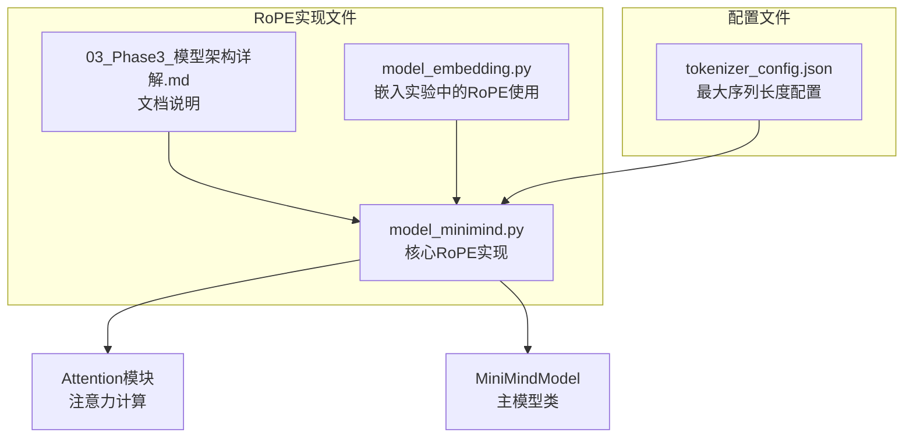
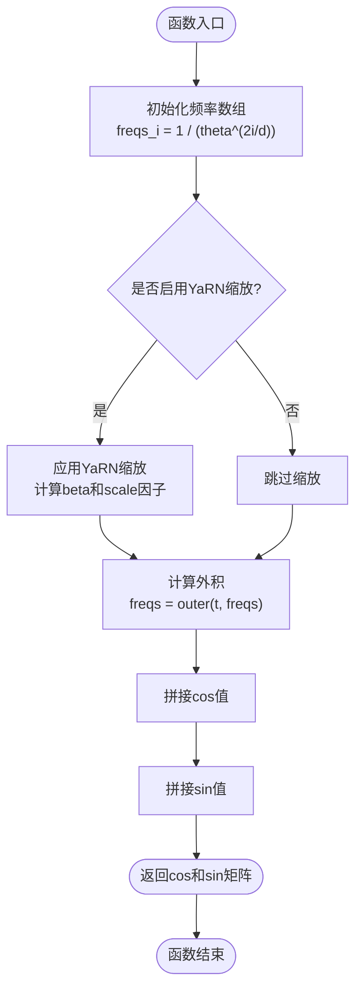
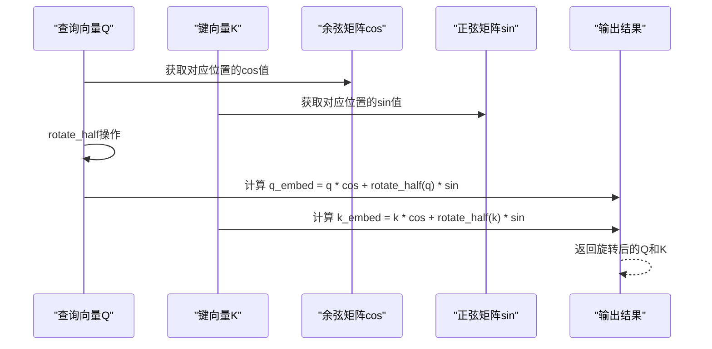
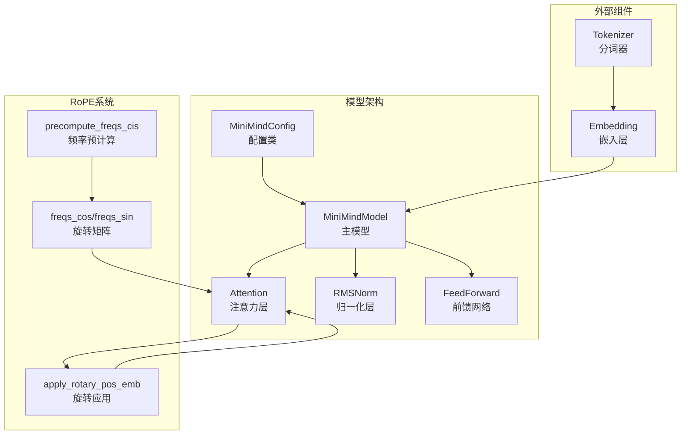
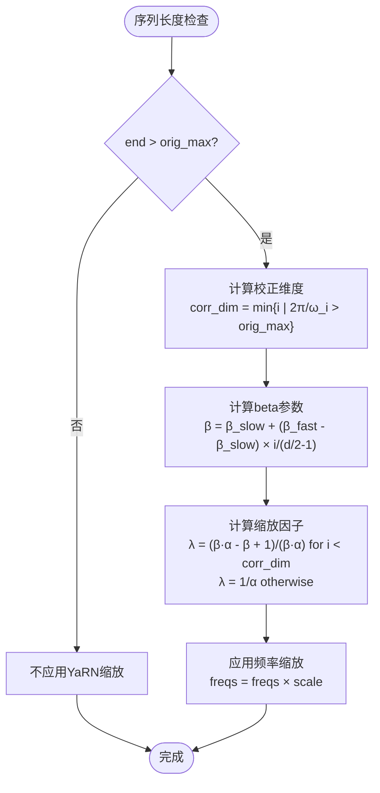
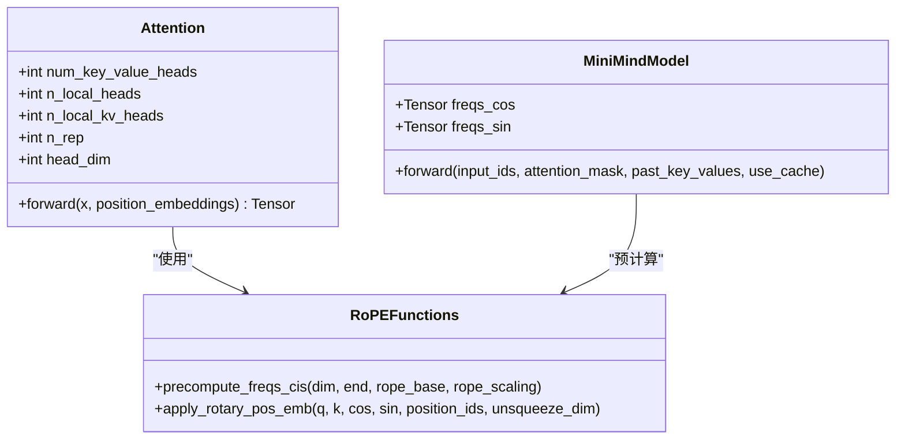
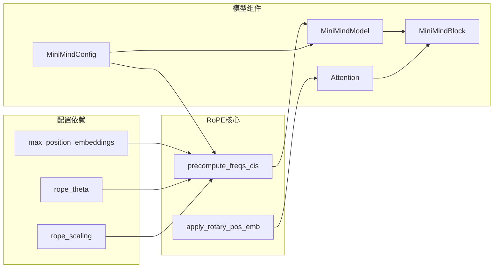

# 旋转位置编码(RoPE)

<cite>
**本文档引用的文件**
- [model_minimind.py](file://model/model_minimind.py)
- [03_Phase3_模型架构详解.md](file://docs/03_Phase3_模型架构详解.md)
- [model_embedding.py](file://embedding-exp/model_embedding.py)
- [tokenizer_config.json](file://model/tokenizer_config.json)
</cite>

## 目录
1. [简介](#简介)
2. [项目结构](#项目结构)
3. [核心组件](#核心组件)
4. [架构概览](#架构概览)
5. [详细组件分析](#详细组件分析)
6. [依赖关系分析](#依赖关系分析)
7. [性能考虑](#性能考虑)
8. [故障排除指南](#故障排除指南)
9. [结论](#结论)

## 简介

旋转位置编码(Rotary Position Embedding, RoPE)是MiniMind项目中用于为注意力机制注入位置信息的核心技术。与传统的绝对位置编码不同，RoPE通过旋转矩阵直接将位置信息嵌入到查询(Q)和键(K)向量中，实现了相对位置编码的优势，并支持长度外推能力。

RoPE的核心思想是将每个特征维度配对，通过旋转矩阵对每对维度进行位置相关的变换。这种设计使得注意力计算只依赖于相对位置差，而非绝对位置坐标，从而天然地支持更长的序列长度。

## 项目结构

在MiniMind项目中，RoPE相关的核心实现分布在以下几个关键文件中：



**图表来源**
- [model_minimind.py:108-137](file://model/model_minimind.py#L108-L137)
- [03_Phase3_模型架构详解.md:77-116](file://docs/03_Phase3_模型架构详解.md#L77-L116)

**章节来源**
- [model_minimind.py:1-477](file://model/model_minimind.py#L1-L477)
- [03_Phase3_模型架构详解.md:1-387](file://docs/03_Phase3_模型架构详解.md#L1-L387)

## 核心组件

### 频率预计算函数

`precompute_freqs_cis`函数负责计算RoPE所需的频率参数和旋转矩阵：



**图表来源**
- [model_minimind.py:108-128](file://model/model_minimind.py#L108-L128)

### 旋转矩阵应用函数

`apply_rotary_pos_emb`函数实现了旋转矩阵的应用机制：



**图表来源**
- [model_minimind.py:131-137](file://model/model_minimind.py#L131-L137)

**章节来源**
- [model_minimind.py:108-137](file://model/model_minimind.py#L108-L137)

## 架构概览

RoPE在整个MiniMind架构中的集成方式如下：



**图表来源**
- [model_minimind.py:387-440](file://model/model_minimind.py#L387-L440)
- [model_minimind.py:108-137](file://model/model_minimind.py#L108-L137)

## 详细组件分析

### 数学原理与推导

#### 频率计算基础

RoPE的核心数学基础是复数旋转的概念。对于每个特征维度，我们定义：

```
频率: ω_i = 1 / (θ^(2i/d))
其中: θ为频率基数(默认1000000.0), d为隐藏维度, i为维度索引
```

#### 旋转矩阵构造

对于每对相邻维度(i, i+d/2)，旋转角度为：

```
θ_t = t × ω_i
旋转矩阵: R_t = [[cos(θ_t), -sin(θ_t)],
                 [sin(θ_t),  cos(θ_t)]]
```

#### 相对位置编码优势

RoPE的关键优势在于注意力计算中的内积性质：

```
(Q ⊗ R_t) · (K ⊗ R_t) = Q · K + (Q × K) × sin(θ_t)
其中: Q × K 表示二维向量的叉积
```

这意味着注意力分数只依赖于相对位置差(t1-t2)，而非绝对位置。

### YaRN外推扩展实现

YaRN(Yarn)是RoPE的长度外推算法，通过动态调整频率来支持更长的序列：



**图表来源**
- [model_minimind.py:111-122](file://model/model_minimind.py#L111-L122)

### 实现细节分析

#### 频率预计算的复杂度分析

- 时间复杂度: O(max_position_embeddings × (d/2))
- 空间复杂度: O(max_position_embeddings × d)
- 预计算优势: 避免运行时重复计算三角函数

#### 旋转应用的优化策略



**图表来源**
- [model_minimind.py:150-226](file://model/model_minimind.py#L150-L226)
- [model_minimind.py:108-137](file://model/model_minimind.py#L108-L137)

**章节来源**
- [model_minimind.py:108-226](file://model/model_minimind.py#L108-L226)

### 不同位置编码方案比较

| 方案 | 相对位置编码 | 长度外推 | 计算复杂度 | 内存占用 |
|------|-------------|----------|-----------|----------|
| RoPE | ✅ 是 | ✅ 支持YaRN | O(1) | O(max_len × d) |
| 绝对位置编码 | ❌ 否 | ❌ 有限 | O(1) | O(max_len × d) |
| 可学习位置编码 | ❌ 否 | ❌ 有限 | O(1) | O(max_len × d) |

## 依赖关系分析

RoPE实现与其他组件的依赖关系：



**图表来源**
- [model_minimind.py:8-78](file://model/model_minimind.py#L8-L78)
- [model_minimind.py:387-440](file://model/model_minimind.py#L387-L440)

**章节来源**
- [model_minimind.py:1-477](file://model/model_minimind.py#L1-L477)

## 性能考虑

### 计算效率优化

1. **预计算策略**: 在模型初始化时计算完整的频率矩阵，避免运行时重复计算
2. **内存管理**: 使用register_buffer存储频率矩阵，自动处理设备迁移
3. **批处理优化**: 利用向量化操作处理整个批次的序列

### 内存使用分析

- 频率矩阵大小: `max_position_embeddings × hidden_size`
- 对于32768长度和768维度的配置，约需24MB内存
- 支持动态切片访问，按需加载所需位置范围

## 故障排除指南

### 常见问题及解决方案

#### 问题1: 序列长度超出限制
**症状**: 运行时报错或结果异常
**原因**: 使用了超过配置的最大序列长度
**解决**: 调整`max_position_embeddings`配置或使用YaRN缩放

#### 问题2: 位置编码效果不明显
**症状**: 模型在长序列任务上表现不佳
**原因**: 频率基数设置不当
**解决**: 调整`rope_theta`参数，通常设置为1000000.0

#### 问题3: 内存使用过高
**症状**: 训练过程中内存不足
**原因**: 频率矩阵过大
**解决**: 减少`max_position_embeddings`或使用更小的模型尺寸

**章节来源**
- [model_minimind.py:111-128](file://model/model_minimind.py#L111-L128)
- [tokenizer_config.json:37](file://model/tokenizer_config.json#L37)

## 结论

RoPE作为MiniMind项目的核心位置编码技术，通过其独特的数学设计实现了相对位置编码的优势和长度外推能力。YaRN扩展进一步增强了模型处理超长序列的能力，使其能够适应各种规模的文本生成任务。

该实现具有以下关键优势：
- **理论优势**: 相对位置编码确保注意力计算只依赖相对位置差
- **实践优势**: 高效的预计算策略和内存管理
- **扩展优势**: YaRN算法支持更长的序列长度
- **兼容优势**: 与现有注意力机制无缝集成

通过深入理解RoPE的数学原理和实现细节，开发者可以更好地优化模型性能，选择合适的配置参数，并在实际应用中发挥RoPE的最大价值。