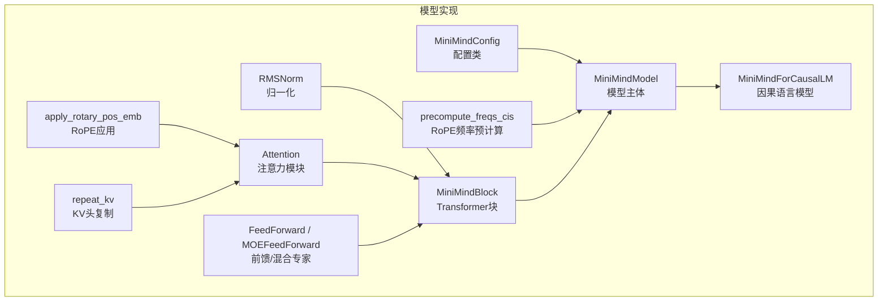
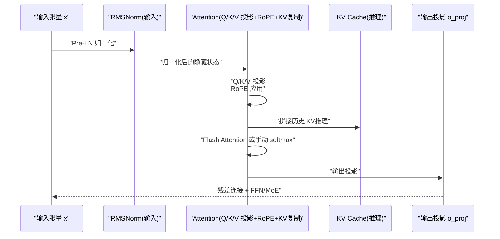
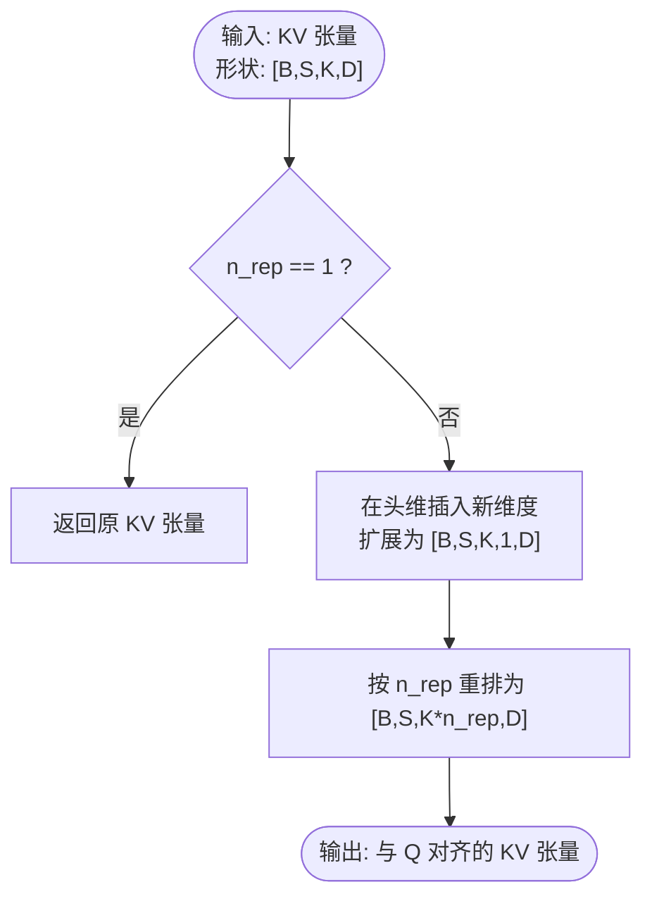
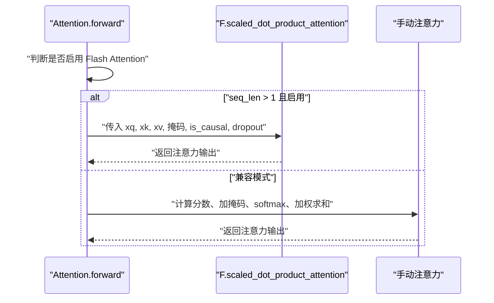
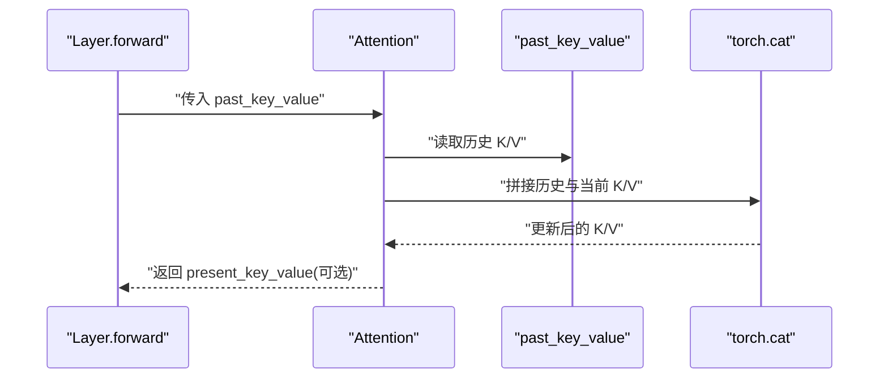
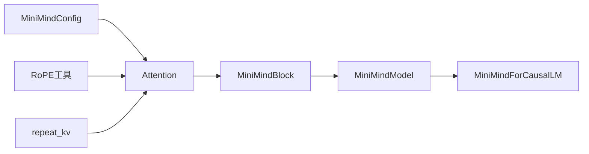

# 注意力机制实现

<cite>
**本文引用的文件列表**
- [model/model_minimind.py](file://model/model_minimind.py)
- [DST-train/model/dst_hf/model_minimind.py](file://DST-train/model/dst_hf/model_minimind.py)
- [docs/03_Phase3_模型架构详解.md](file://docs/03_Phase3_模型架构详解.md)
- [docs/09_Phase9_推理模型与部署.md](file://docs/09_Phase9_推理模型与部署.md)
</cite>

## 目录
1. [引言](#引言)
2. [项目结构](#项目结构)
3. [核心组件](#核心组件)
4. [架构总览](#架构总览)
5. [详细组件分析](#详细组件分析)
6. [依赖关系分析](#依赖关系分析)
7. [性能考量](#性能考量)
8. [故障排查指南](#故障排查指南)
9. [结论](#结论)
10. [附录](#附录)

## 引言
本技术文档围绕 MiniMind 项目的注意力机制展开，系统解析 Multi-Head Attention（MHA）、Grouped-Query Attention（GQA）以及注意力计算的完整流程，涵盖 Q/K/V 投影矩阵设计、注意力分数计算、softmax 归一化过程、输出投影、KV 头共享机制、Flash Attention 的使用、KV Cache 的实现与推理效率优化，并提供可视化示例与最佳实践建议。文档面向具备一定深度学习背景的读者，同时尽量以循序渐进的方式呈现复杂概念。

## 项目结构
MiniMind 的注意力机制主要实现在两个模块中：
- 核心实现位于 model/model_minimind.py，包含完整的 Attention 类、RoPE 旋转位置编码、KV 复制与 Flash Attention 切换逻辑、KV Cache 的拼接与返回。
- 文档 docs/03_Phase3_模型架构详解.md 提供了 GQA、RoPE、FFN 等组件的高层说明与代码片段路径，便于对照理解。
- 推理部署相关文档 docs/09_Phase9_推理模型与部署.md 说明了推理阶段的 KV Cache 使用与服务化部署。

图表来源
- [model/model_minimind.py:8-78](file://model/model_minimind.py#L8-L78)
- [model/model_minimind.py:95-106](file://model/model_minimind.py#L95-L106)
- [model/model_minimind.py:108-128](file://model/model_minimind.py#L108-L128)
- [model/model_minimind.py:131-137](file://model/model_minimind.py#L131-L137)
- [model/model_minimind.py:140-147](file://model/model_minimind.py#L140-L147)
- [model/model_minimind.py:150-226](file://model/model_minimind.py#L150-L226)
- [model/model_minimind.py:229-242](file://model/model_minimind.py#L229-L242)
- [model/model_minimind.py:363-384](file://model/model_minimind.py#L363-L384)
- [model/model_minimind.py:387-440](file://model/model_minimind.py#L387-L440)
- [model/model_minimind.py:443-476](file://model/model_minimind.py#L443-L476)

章节来源
- [model/model_minimind.py:8-78](file://model/model_minimind.py#L8-L78)
- [model/model_minimind.py:150-226](file://model/model_minimind.py#L150-L226)
- [docs/03_Phase3_模型架构详解.md:118-176](file://docs/03_Phase3_模型架构详解.md#L118-L176)

## 核心组件
- MiniMindConfig：定义隐藏维度、层数、注意力头数、KV 头数、RoPE 基础频率、是否启用 Flash Attention 等关键超参。
- RMSNorm：Pre-LN 架构中的均方根归一化，计算更高效。
- RoPE 频率预计算与应用：通过 YaRN 外推策略支持更长上下文。
- repeat_kv：GQA 的核心实现，将 KV 头复制以匹配 Q 头数量。
- Attention：注意力主模块，包含 Q/K/V 投影、RoPE、KV Cache、Flash Attention 与手动 softmax 的双轨实现。
- FeedForward/MOEFeedForward：SwiGLU 前馈网络或 MoE 路由专家网络。
- MiniMindBlock/MiniMindModel/MiniMindForCausalLM：封装注意力与 FFN 的 Transformer 块、模型主体与因果语言模型接口。

章节来源
- [model/model_minimind.py:8-78](file://model/model_minimind.py#L8-L78)
- [model/model_minimind.py:95-106](file://model/model_minimind.py#L95-L106)
- [model/model_minimind.py:108-128](file://model/model_minimind.py#L108-L128)
- [model/model_minimind.py:131-137](file://model/model_minimind.py#L131-L137)
- [model/model_minimind.py:140-147](file://model/model_minimind.py#L140-L147)
- [model/model_minimind.py:150-226](file://model/model_minimind.py#L150-L226)
- [model/model_minimind.py:229-242](file://model/model_minimind.py#L229-L242)
- [model/model_minimind.py:363-384](file://model/model_minimind.py#L363-L384)
- [model/model_minimind.py:387-440](file://model/model_minimind.py#L387-L440)
- [model/model_minimind.py:443-476](file://model/model_minimind.py#L443-L476)

## 架构总览
下图展示了 MiniMind 的注意力子系统在 Transformer 块中的位置与交互关系，以及 KV Cache 在推理阶段的作用。

图表来源
- [model/model_minimind.py:150-226](file://model/model_minimind.py#L150-L226)
- [model/model_minimind.py:363-384](file://model/model_minimind.py#L363-L384)
- [docs/03_Phase3_模型架构详解.md:154-162](file://docs/03_Phase3_模型架构详解.md#L154-L162)

## 详细组件分析

### Multi-Head Attention（MHA）与 GQA
- MHA：每个 Q 头独立对应一组 KV 头，计算量大但表达能力强。
- GQA：将 KV 头数减少为若干组，多个 Q 头共享同一组 KV 头，从而显著降低 KV 计算与内存开销。
- MiniMind 配置：n_heads=8，kv_heads=2，因此每个 KV 组被 4 个 Q 头共享。

实现要点
- Q/K/V 投影矩阵：分别将隐藏维度映射到 n_heads×head_dim 与 kv_heads×head_dim。
- KV 复制：通过 repeat_kv 将 KV 头复制 n_rep = n_heads/kv_heads 次，使维度对齐。
- RoPE：对 Q/K 应用旋转位置编码，注入相对位置信息。
- 因果掩码：在自回归场景下对注意力分数添加上三角无穷小掩码，确保仅关注历史信息。

章节来源
- [docs/03_Phase3_模型架构详解.md:118-128](file://docs/03_Phase3_模型架构详解.md#L118-L128)
- [docs/03_Phase3_模型架构详解.md:130-142](file://docs/03_Phase3_模型架构详解.md#L130-L142)
- [docs/03_Phase3_模型架构详解.md:144-152](file://docs/03_Phase3_模型架构详解.md#L144-L152)
- [model/model_minimind.py:158-162](file://model/model_minimind.py#L158-L162)
- [model/model_minimind.py:176-179](file://model/model_minimind.py#L176-L179)
- [model/model_minimind.py:181-184](file://model/model_minimind.py#L181-L184)
- [model/model_minimind.py:192-196](file://model/model_minimind.py#L192-L196)

### Q/K/V 投影矩阵设计
- Q 投影：将隐藏维度映射到 n_heads×head_dim，形成多头表示。
- K/V 投影：将隐藏维度映射到 kv_heads×head_dim，随后通过 repeat_kv 扩展到 n_heads×head_dim。
- 输出投影：将多头拼接后的结果映射回隐藏维度。

复杂度与内存
- Q/K/V 投影的参数量与头数线性相关；GQA 通过减少 kv_heads 显著降低 KV 投影参数与中间张量的内存占用。

章节来源
- [model/model_minimind.py:158-162](file://model/model_minimind.py#L158-L162)
- [model/model_minimind.py:224-226](file://model/model_minimind.py#L224-L226)

### 注意力分数计算与 softmax 归一化
- 分数计算：Q 与 K 的转置相乘，除以 sqrt(head_dim)，得到注意力分数矩阵。
- 掩码：添加上三角因果掩码；若提供 attention_mask，则将其扩展为四维并融合到注意力掩码中。
- Softmax：对最后一维进行 softmax 归一化，得到注意力权重分布。
- Dropout：对 softmax 结果应用注意力 Dropout，防止过拟合。

章节来源
- [model/model_minimind.py:209-222](file://model/model_minimind.py#L209-L222)
- [docs/03_Phase3_模型架构详解.md:164-176](file://docs/03_Phase3_模型架构详解.md#L164-L176)

### 输出投影与残差连接
- 输出投影：将多头注意力的拼接结果通过 o_proj 映射回隐藏维度。
- 残差连接：注意力输出与输入残差相加，随后进入 FFN 或 MoE。
- 残差 Dropout：对投影后的输出再次应用残差 Dropout。

章节来源
- [model/model_minimind.py:224-226](file://model/model_minimind.py#L224-L226)
- [model/model_minimind.py:376-384](file://model/model_minimind.py#L376-L384)

### KV 头共享机制与 repeat_kv
- 共享机制：n_rep = n_heads / kv_heads，每个 KV 组被 n_rep 个 Q 头共享。
- repeat_kv 实现：将 KV 张量在头维上重复 n_rep 次，保持形状一致性，避免显式循环展开。

图表来源
- [model/model_minimind.py:140-147](file://model/model_minimind.py#L140-L147)
- [docs/03_Phase3_模型架构详解.md:144-152](file://docs/03_Phase3_模型架构详解.md#L144-L152)

章节来源
- [model/model_minimind.py:140-147](file://model/model_minimind.py#L140-L147)
- [docs/03_Phase3_模型架构详解.md:120-128](file://docs/03_Phase3_模型架构详解.md#L120-L128)

### Flash Attention 的使用
- 条件启用：当 PyTorch 版本支持 scaled_dot_product_attention 且配置开启时，使用 Flash Attention。
- 掩码处理：若全为 1 的 attention_mask 或 None，则使用因果掩码；否则构造扩展掩码并与因果掩码相加。
- Dropout：训练时启用注意力 Dropout，推理时关闭。

图表来源
- [model/model_minimind.py:198-207](file://model/model_minimind.py#L198-L207)
- [model/model_minimind.py:209-222](file://model/model_minimind.py#L209-L222)
- [docs/03_Phase3_模型架构详解.md:164-176](file://docs/03_Phase3_模型架构详解.md#L164-L176)

章节来源
- [model/model_minimind.py:166](file://model/model_minimind.py#L166)
- [model/model_minimind.py:198-207](file://model/model_minimind.py#L198-L207)
- [model/model_minimind.py:209-222](file://model/model_minimind.py#L209-L222)

### KV Cache 的实现与推理效率
- 推理阶段缓存：past_key_value 为历史 KV 张量，当前 KV 与历史拼接，避免重复计算。
- 返回值：use_cache 为真时返回 (xk, xv) 作为新的 past_key_value，供后续步使用。
- 长序列生成：通过缓存显著降低自回归生成的计算与内存压力。

图表来源
- [model/model_minimind.py:186-190](file://model/model_minimind.py#L186-L190)
- [docs/03_Phase3_模型架构详解.md:154-162](file://docs/03_Phase3_模型架构详解.md#L154-L162)

章节来源
- [model/model_minimind.py:186-190](file://model/model_minimind.py#L186-L190)
- [docs/03_Phase3_模型架构详解.md:154-162](file://docs/03_Phase3_模型架构详解.md#L154-L162)

### RoPE 旋转位置编码
- 频率预计算：根据 rope_theta 与可选 YaRN 缩放策略生成 cos/sin 频谱。
- 应用方式：对 Q/K 的偶数/奇数维度分别进行旋转，注入相对位置信息。
- YaRN 外推：在超出原始最大长度时，按 YaRN 规则调整频率尺度，支持更长上下文。

章节来源
- [model/model_minimind.py:108-128](file://model/model_minimind.py#L108-L128)
- [model/model_minimind.py:131-137](file://model/model_minimind.py#L131-L137)
- [docs/03_Phase3_模型架构详解.md:77-117](file://docs/03_Phase3_模型架构详解.md#L77-L117)

### 前馈网络与 SwiGLU
- SwiGLU：门控线性单元，使用 SiLU 激活，先经 gate_proj 与 up_proj，再逐元素乘，最后 down_proj。
- 中间维度对齐：自动对齐到 64 的倍数，提高张量运算效率。

章节来源
- [model/model_minimind.py:229-242](file://model/model_minimind.py#L229-L242)
- [docs/03_Phase3_模型架构详解.md:178-205](file://docs/03_Phase3_模型架构详解.md#L178-L205)

### Transformer 块与模型主体
- MiniMindBlock：Pre-LN 架构，先 RMSNorm，再注意力，残差连接，再 FFN/MoE。
- MiniMindModel：嵌入层、多层 Transformer 块、最终 RMSNorm。
- MiniMindForCausalLM：语言模型头部，权重共享（embedding 与 lm_head）。

章节来源
- [model/model_minimind.py:363-384](file://model/model_minimind.py#L363-L384)
- [model/model_minimind.py:387-440](file://model/model_minimind.py#L387-L440)
- [model/model_minimind.py:443-476](file://model/model_minimind.py#L443-L476)

## 依赖关系分析
- Attention 依赖：
  - MiniMindConfig：读取 n_heads、kv_heads、hidden_size、head_dim、flash_attn 等配置。
  - RoPE 工具：precompute_freqs_cis、apply_rotary_pos_emb。
  - KV 复制：repeat_kv。
  - Dropout：attn_dropout、resid_dropout。
- Transformer 块依赖：
  - RMSNorm：Pre-LN 与 Post-LN。
  - FeedForward/MOEFeedForward：前馈网络。
  - MiniMindModel：多层堆叠与 KV Cache 管理。
  - MiniMindForCausalLM：输出层与权重共享。

图表来源
- [model/model_minimind.py:8-78](file://model/model_minimind.py#L8-L78)
- [model/model_minimind.py:108-128](file://model/model_minimind.py#L108-L128)
- [model/model_minimind.py:131-137](file://model/model_minimind.py#L131-L137)
- [model/model_minimind.py:140-147](file://model/model_minimind.py#L140-L147)
- [model/model_minimind.py:150-226](file://model/model_minimind.py#L150-L226)
- [model/model_minimind.py:363-384](file://model/model_minimind.py#L363-L384)
- [model/model_minimind.py:387-440](file://model/model_minimind.py#L387-L440)
- [model/model_minimind.py:443-476](file://model/model_minimind.py#L443-L476)

章节来源
- [model/model_minimind.py:150-226](file://model/model_minimind.py#L150-L226)
- [model/model_minimind.py:363-384](file://model/model_minimind.py#L363-L384)
- [model/model_minimind.py:387-440](file://model/model_minimind.py#L387-L440)
- [model/model_minimind.py:443-476](file://model/model_minimind.py#L443-L476)

## 性能考量
- GQA 降本增效：通过减少 kv_heads，显著降低 KV 投影与中间张量的内存与计算开销，同时保持与 MHA 的表达能力接近。
- Flash Attention：在满足条件时使用 PyTorch 内置的 scaled_dot_product_attention，通常具有更好的内存效率与吞吐。
- KV Cache：在自回归生成中复用历史 KV，避免重复计算，极大提升推理效率。
- RoPE 外推：YaRN 策略支持更长上下文，减少截断误差。
- Dropout：训练与推理的差异设置有助于稳定训练与加速推理。

章节来源
- [docs/03_Phase3_模型架构详解.md:118-128](file://docs/03_Phase3_模型架构详解.md#L118-L128)
- [model/model_minimind.py:166](file://model/model_minimind.py#L166)
- [model/model_minimind.py:186-190](file://model/model_minimind.py#L186-L190)
- [docs/09_Phase9_推理模型与部署.md:202-211](file://docs/09_Phase9_推理模型与部署.md#L202-L211)

## 故障排查指南
- Flash Attention 未生效
  - 检查 PyTorch 版本是否支持 scaled_dot_product_attention，以及配置中 flash_attn 是否开启。
  - 若 attention_mask 非 None 且存在非 1 的位置，将切换到兼容模式。
  - 参考路径：[model/model_minimind.py:166](file://model/model_minimind.py#L166)、[model/model_minimind.py:198-207](file://model/model_minimind.py#L198-L207)
- KV Cache 导致维度不匹配
  - 确认 past_key_value 与当前 KV 的头数一致，repeat_kv 会将 KV 复制到与 Q 对齐的维度。
  - 参考路径：[model/model_minimind.py:192-196](file://model/model_minimind.py#L192-L196)、[model/model_minimind.py:140-147](file://model/model_minimind.py#L140-L147)
- 掩码异常导致注意力全零
  - 检查因果掩码与 attention_mask 的组合是否正确，确保上三角为负无穷，有效位置为 0。
  - 参考路径：[model/model_minimind.py:209-222](file://model/model_minimind.py#L209-L222)
- 推理阶段性能不佳
  - 确认 use_cache 为 True，past_key_values 正确传递给每一层。
  - 参考路径：[docs/03_Phase3_模型架构详解.md:154-162](file://docs/03_Phase3_模型架构详解.md#L154-L162)、[docs/09_Phase9_推理模型与部署.md:120-184](file://docs/09_Phase9_推理模型与部署.md#L120-L184)

章节来源
- [model/model_minimind.py:166](file://model/model_minimind.py#L166)
- [model/model_minimind.py:192-196](file://model/model_minimind.py#L192-L196)
- [model/model_minimind.py:209-222](file://model/model_minimind.py#L209-L222)
- [docs/03_Phase3_模型架构详解.md:154-162](file://docs/03_Phase3_模型架构详解.md#L154-L162)
- [docs/09_Phase9_推理模型与部署.md:120-184](file://docs/09_Phase9_推理模型与部署.md#L120-L184)

## 结论
MiniMind 的注意力机制通过 GQA 与 KV Cache 的结合，在保持模型表达能力的同时显著降低了计算与内存成本；RoPE 与 YaRN 外推提升了长序列建模能力；Flash Attention 的条件启用进一步优化了吞吐。这些设计共同构成了 MiniMind 在推理阶段高效、稳定的注意力子系统。建议在实际部署中优先启用 Flash Attention 与 KV Cache，并根据任务长度合理配置 RoPE 外推策略。

## 附录
- 相关实现路径参考
  - GQA 与 KV 复制：[model/model_minimind.py:140-147](file://model/model_minimind.py#L140-L147)
  - Attention 前向：[model/model_minimind.py:150-226](file://model/model_minimind.py#L150-L226)
  - RoPE 频率与应用：[model/model_minimind.py:108-128](file://model/model_minimind.py#L108-L128)、[model/model_minimind.py:131-137](file://model/model_minimind.py#L131-L137)
  - 推理部署与 KV Cache：[docs/09_Phase9_推理模型与部署.md:120-184](file://docs/09_Phase9_推理模型与部署.md#L120-L184)